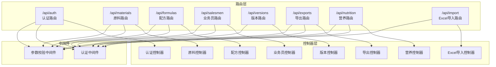
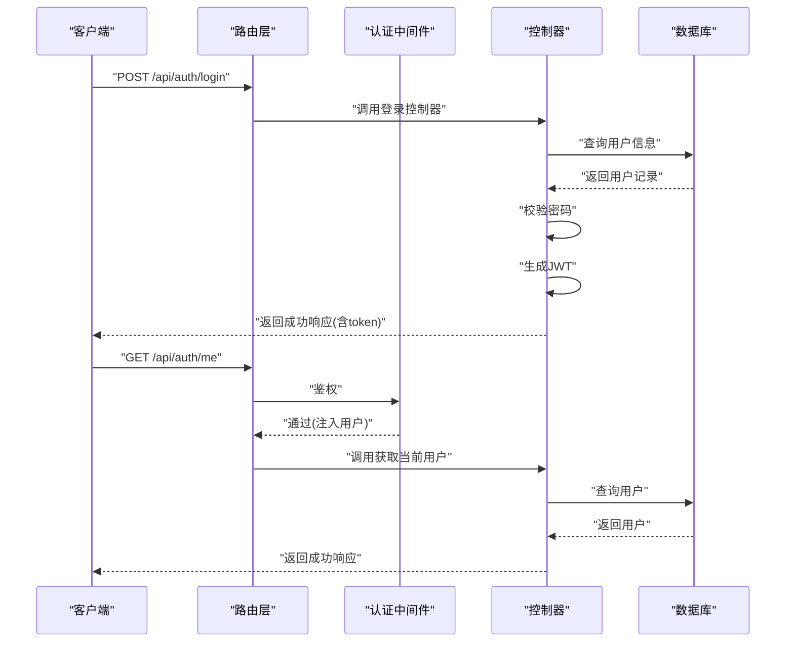
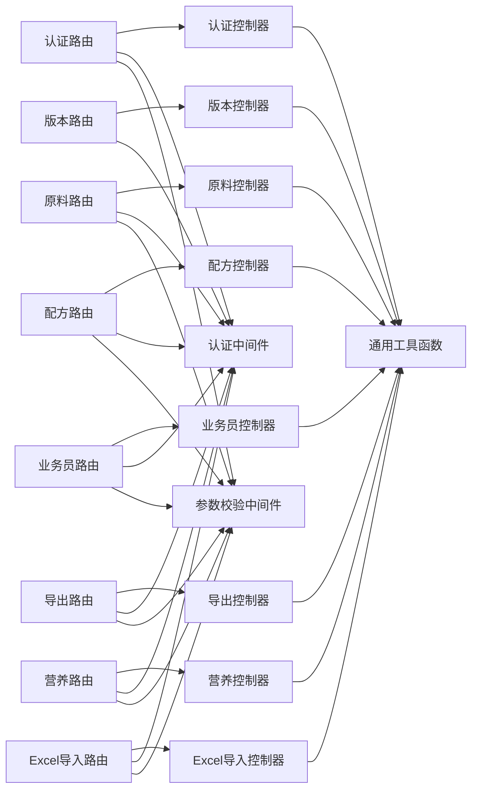

# API 接口文档

<cite>
**本文引用的文件**
- [API 文档](file://backend/API_DOC.md)
- [入口路由聚合](file://backend/src/routes/index.ts)
- [Excel导入路由](file://backend/src/routes/excelImport.ts)
- [Excel导入控制器](file://backend/src/controllers/excelImportController.ts)
- [认证中间件](file://backend/src/middleware/auth.ts)
- [通用工具函数](file://backend/src/utils/helpers.ts)
- [Excel导入API](file://frontend/src/api/excelImport.ts)
- [Excel导入面板组件](file://frontend/src/components/ExcelImportPanel.vue)
- [认证路由](file://backend/src/routes/auth.ts)
- [原料路由](file://backend/src/routes/materials.ts)
- [配方路由](file://backend/src/routes/formulas.ts)
- [业务员路由](file://backend/src/routes/salesmen.ts)
- [版本路由](file://backend/src/routes/versions.ts)
- [导出路由](file://backend/src/routes/exports.ts)
- [营养路由](file://backend/src/routes/nutrition.ts)
- [认证控制器](file://backend/src/controllers/authController.ts)
- [原料控制器](file://backend/src/controllers/materialController.ts)
- [配方控制器](file://backend/src/controllers/formulaController.ts)
- [业务员控制器](file://backend/src/controllers/salesmanController.ts)
- [版本控制器](file://backend/src/controllers/versionController.ts)
- [导出控制器](file://backend/src/controllers/exportController.ts)
- [营养控制器](file://backend/src/controllers/nutritionController.ts)
</cite>

## 目录
1. [简介](#简介)
2. [项目结构](#项目结构)
3. [核心组件](#核心组件)
4. [架构总览](#架构总览)
5. [详细组件分析](#详细组件分析)
6. [依赖关系分析](#依赖关系分析)
7. [性能考虑](#性能考虑)
8. [故障排查指南](#故障排查指南)
9. [结论](#结论)
10. [附录](#附录)

## 简介
本文件为 TingStudio 的完整 API 接口文档，基于后端提供的接口规范与实现，覆盖认证、原料管理、配方管理、业务员管理、版本管理、导出管理、营养成分管理、Excel导入等八大功能模块。文档提供每个接口的 HTTP 方法、URL 模式、请求参数、响应格式、错误码说明、认证机制、请求头设置、参数校验规则、业务逻辑说明，并给出前端集成建议与最佳实践。

- 基础地址：http://localhost:3000/api
- 认证方式：Bearer Token（JWT）
- Content-Type：application/json

## 项目结构
后端采用 Express + TypeScript，按"路由 -> 控制器 -> 数据库查询"的分层设计；路由文件位于 src/routes，控制器位于 src/controllers，通用工具位于 src/utils，认证中间件位于 src/middleware。

图表来源
- [入口路由聚合:11-23](file://backend/src/routes/index.ts#L11-L23)
- [Excel导入路由:1-42](file://backend/src/routes/excelImport.ts#L1-L42)
- [认证路由:1-20](file://backend/src/routes/auth.ts#L1-L20)
- [原料路由:1-22](file://backend/src/routes/materials.ts#L1-L22)
- [配方路由:1-29](file://backend/src/routes/formulas.ts#L1-L29)
- [业务员路由:1-24](file://backend/src/routes/salesmen.ts#L1-L24)
- [版本路由:1-17](file://backend/src/routes/versions.ts#L1-L17)
- [导出路由:1-34](file://backend/src/routes/exports.ts#L1-L34)
- [营养路由:1-31](file://backend/src/routes/nutrition.ts#L1-L31)

章节来源
- [入口路由聚合:11-23](file://backend/src/routes/index.ts#L11-L23)

## 核心组件
- 认证中间件：负责从 Authorization 头提取 Bearer Token，校验 JWT 并注入用户信息到请求上下文。
- 参数校验中间件：基于路由定义的规则对请求体进行参数校验。
- 通用工具函数：统一响应格式、分页构建、命名转换、安全 JSON 解析等。

章节来源
- [认证中间件:13-31](file://backend/src/middleware/auth.ts#L13-L31)
- [通用工具函数:26-51](file://backend/src/utils/helpers.ts#L26-L51)

## 架构总览
以下序列图展示典型认证流程与控制器调用链：

图表来源
- [认证路由:17-19](file://backend/src/routes/auth.ts#L17-L19)
- [认证控制器:41-88](file://backend/src/controllers/authController.ts#L41-L88)
- [认证中间件:13-31](file://backend/src/middleware/auth.ts#L13-L31)

## 详细组件分析

### 通用说明
- 请求头
  - Authorization: Bearer <token>（除登录/注册/公开分享外均需）
  - Content-Type: application/json
- 响应格式
  - 成功响应：success=true, message, data
  - 分页列表响应：data.list, data.pagination
  - 错误响应：success=false, message, errors(参数校验失败时存在)
- HTTP 状态码
  - 200/201 成功/创建成功
  - 400 请求参数错误
  - 401 未认证或令牌无效
  - 404 资源不存在
  - 409 资源冲突（唯一约束）
  - 410 资源已过期
  - 413 文件大小超限
  - 500 服务器内部错误
- 通用查询参数（分页列表）
  - page/pageSize/keyword（最大pageSize=100）

章节来源
- [API 文档:11-78](file://backend/API_DOC.md#L11-L78)

### 一、认证模块 /api/auth
- GET /api/auth/me
  - 认证：需要 Bearer Token
  - 响应：当前用户信息
- POST /api/auth/register
  - 请求体：username(2-50), password(>=6)
  - 响应：user(id, username, role), token
  - 错误：409 用户名已存在
- POST /api/auth/login
  - 请求体：username, password
  - 响应：user(id, username, role), token
  - 错误：401 用户名或密码错误

章节来源
- [认证路由:9-19](file://backend/src/routes/auth.ts#L9-L19)
- [认证控制器:8-88](file://backend/src/controllers/authController.ts#L8-L88)
- [API 文档:82-159](file://backend/API_DOC.md#L82-L159)

### 二、原料管理 /api/materials
- GET /api/materials
  - 查询参数：keyword, page, pageSize
  - 响应：分页列表，字段包括 id, name, code, unit, stock, createdBy, createdAt, updatedAt
  - 业务：按创建人过滤
- GET /api/materials/:id
  - 响应：单个原料详情
- POST /api/materials
  - 请求体：name, code(唯一), unit(默认g), stock(默认0)
  - 响应：创建后的原料
  - 错误：409 原料编码已存在
- PUT /api/materials/:id
  - 请求体：name, code, unit, stock
  - 响应：更新后的原料
  - 错误：409 原料编码已存在
- DELETE /api/materials/:id
  - 业务：若被配方引用则拒绝删除（400）
  - 响应：删除成功

章节来源
- [原料路由:11-21](file://backend/src/routes/materials.ts#L11-L21)
- [原料控制器:6-129](file://backend/src/controllers/materialController.ts#L6-L129)
- [API 文档:163-216](file://backend/API_DOC.md#L163-L216)

### 三、配方管理 /api/formulas
- GET /api/formulas
  - 查询参数：keyword, salesmanId, page, pageSize
  - 响应：分页列表，字段包括 id, name, salesmanId, salesmanName, materialsJson, description, createdBy, createdAt, updatedAt
  - 业务：admin 可查看全部；普通用户仅可见自己创建
- GET /api/formulas/:id
  - 响应：单个配方详情
- POST /api/formulas
  - 请求体：name, salesmanId, materials(数组，含materialId/materialName/quantity)，description, finishedWeight, ratioFactor
  - 响应：创建后的配方
  - 业务：自动创建 v1.0 初始版本
- PUT /api/formulas/:id
  - 请求体：同上
  - 响应：更新后的配方
  - 业务：若原料列表变化，自动创建新版本
- DELETE /api/formulas/:id
  - 业务：级联删除版本数据
- GET /api/formulas/by-material/:materialId
  - 响应：包含该原料的所有配方

章节来源
- [配方路由:14-28](file://backend/src/routes/formulas.ts#L14-L28)
- [配方控制器:6-224](file://backend/src/controllers/formulaController.ts#L6-L224)
- [API 文档:219-292](file://backend/API_DOC.md#L219-L292)

### 四、业务员管理 /api/salesmen
- GET /api/salesmen
  - 查询参数：keyword(姓名/工号/电话), status(active/inactive), department, page, pageSize
  - 响应：分页列表
- GET /api/salesmen/:id
  - 响应：单个业务员详情
- POST /api/salesmen
  - 请求体：name, code(唯一), department, phone, email
  - 响应：创建后的业务员
  - 错误：409 工号已存在
- PUT /api/salesmen/:id
  - 请求体：name, code, department, phone, email, status
  - 响应：更新后的业务员
- DELETE /api/salesmen/:id
  - 业务：软删除（设为 inactive）

章节来源
- [业务员路由:13-23](file://backend/src/routes/salesmen.ts#L13-L23)
- [业务员控制器:6-124](file://backend/src/controllers/salesmanController.ts#L6-L124)
- [API 文档:295-358](file://backend/API_DOC.md#L295-L358)

### 五、配方版本管理 /api/versions
- GET /api/versions/formula/:formulaId
  - 查询参数：status(draft/published/archived)
  - 响应：版本列表，字段包括 versionId, formulaId, versionNumber, versionName, changes, snapshot, status, isCurrent, createdBy, createdAt
- GET /api/versions/detail/:versionId
  - 响应：版本详情（解析后的 changes/snapshot）
- POST /api/versions/formula/:formulaId
  - 请求体：versionName, status(默认 draft)
  - 响应：versionId, versionNumber
  - 业务：自动生成版本号（主版本+1），并设为当前版本
- PUT /api/versions/publish/:versionId
  - 业务：将指定版本设为 published+is_current，其他版本设为 archived
- GET /api/versions/compare/:formulaId
  - 查询参数：versionA, versionB
  - 响应：差异对比结果（含 summary 统计）

章节来源
- [版本路由:12-16](file://backend/src/routes/versions.ts#L12-L16)
- [版本控制器:6-255](file://backend/src/controllers/versionController.ts#L6-L255)
- [API 文档:361-460](file://backend/API_DOC.md#L361-L460)

### 六、导出管理 /api/exports
- GET /api/exports/templates
  - 查询参数：type(pdf/excel/api/print)
  - 响应：模板列表（含 formatConfig）
- POST /api/exports/templates
  - 请求体：name, description, type, formatConfig, isDefault
  - 响应：templateId
  - 业务：若 isDefault=true，则同类型模板的默认标记会被清除
- POST /api/exports/jobs
  - 请求体：formulaId, versionId, templateId, exportType(pdf/excel/api)
  - 响应：jobId, status
- GET /api/exports/jobs
  - 查询参数：status(pending/processing/completed/failed), page, pageSize
  - 响应：分页列表
- GET /api/exports/jobs/:jobId
  - 响应：任务详情
- POST /api/exports/share
  - 请求体：formulaId, versionId, shareType(link/email/api), password, expireDate, allowedEmails, downloadLimit
  - 响应：shareId, shareUrl
- GET /api/exports/share/:shareId
  - 业务：公开访问，检查过期与下载次数限制，更新下载计数
  - 响应：分享配置与配方详情
- GET /api/exports/api-interfaces
  - 响应：API 数据接口列表
- POST /api/exports/api-interfaces
  - 请求体：name, description, endpoint(唯一), method, authentication, authConfig, dataFormat, fieldMapping, rateLimit, retryConfig
  - 响应：interfaceId
  - 错误：409 接口地址已存在

章节来源
- [导出路由:17-34](file://backend/src/routes/exports.ts#L17-L34)
- [导出控制器:6-230](file://backend/src/controllers/exportController.ts#L6-L230)
- [API 文档:464-553](file://backend/API_DOC.md#L464-L553)

### 七、营养成分管理 /api/nutrition
- GET /api/nutrition/material/:materialId
  - 响应：per100g(标准化键名), dataVersion, dataSource, notes, lastUpdated
  - 业务：标准化键名（兼容带单位后缀）
- PUT /api/nutrition/material/:materialId
  - 请求体：per100g, dataSource, notes
  - 响应：保存成功
  - 业务：存在则版本号+1，否则新建版本号1.0
- POST /api/nutrition/calculate/:formulaId
  - 响应：totalWeight, totalNutrition, per100gNutrition, materialBreakdown
  - 业务：遍历配方原料，汇总营养，保存至汇总表
- GET /api/nutrition/profiles
  - 查询参数：category(infant/child/adult/elderly/pregnant/special)
  - 响应：营养标准列表（targetValues, toleranceRanges, mandatoryFields）
- POST /api/nutrition/profiles
  - 请求体：name, description, category, targetValues, toleranceRanges, mandatoryFields
  - 响应：profileId
- POST /api/nutrition/compliance/:formulaId
  - 查询参数：profileId
  - 响应：reportId, complianceCheck, recommendations, summary
  - 业务：基于目标标准进行合规检查，生成报告
- GET /api/nutrition/tables/:formulaId
  - 响应：配方营养计算表格数据（与 XLS 格式一致）

章节来源
- [营养路由:17-31](file://backend/src/routes/nutrition.ts#L17-L31)
- [营养控制器:55-537](file://backend/src/controllers/nutritionController.ts#L55-L537)
- [API 文档:556-674](file://backend/API_DOC.md#L556-L674)

### 八、Excel 导入模块 /api/import
- GET /api/import/formula/template
  - 认证：需要 Bearer Token
  - 响应：Excel 模板文件（application/vnd.openxmlformats-officedocument.spreadsheetml.sheet）
  - 业务：下载配方导入模板，包含示例数据和使用说明
- POST /api/import/formula/parse
  - 认证：需要 Bearer Token
  - 请求格式：multipart/form-data，文件字段名：file
  - 支持格式：.xlsx, .xls（最大5MB）
  - 响应：解析结果，包含匹配的原料列表、错误、警告和汇总信息
  - 业务：解析Excel文件，自动匹配现有原料，识别新原料，验证数据完整性

#### 模板字段说明
| 列名 | 必填 | 说明 |
|------|------|------|
| 原料名称* | 是 | 用于匹配系统中的原料 |
| 原料编码 | 否 | 可选，辅助匹配 |
| 原料类型* | 是 | 药材 或 辅料 |
| 数量(g)* | 是 | 配方中该原料的用量 |
| 单位 | 否 | 默认 g |
| 蛋白质(g/100g) | 否 | 每100g原料中蛋白质含量 |
| 脂肪(g/100g) | 否 | 每100g原料中脂肪含量 |
| 碳水化合物(g/100g) | 否 | 每100g原料中碳水化合物含量 |
| 钠(mg/100g) | 否 | 每100g原料中钠含量 |
| 备注 | 否 | 备注信息 |

#### 解析响应字段说明
| 字段 | 说明 |
|------|------|
| materials | 解析出的原料列表 |
| materials[].materialId | 原料ID（已匹配时存在） |
| materials[].materialName | 原料名称 |
| materials[].materialType | 原料类型（herb/supplement） |
| materials[].quantity | 数量（克） |
| materials[].isNew | 是否为新原料（系统中不存在） |
| errors | 解析错误列表 |
| warnings | 解析警告列表 |
| missingMaterials | 缺失原料名称列表 |
| summary | 解析汇总信息 |

章节来源
- [Excel导入路由:35-39](file://backend/src/routes/excelImport.ts#L35-L39)
- [Excel导入控制器:52-225](file://backend/src/controllers/excelImportController.ts#L52-L225)
- [API 文档:703-791](file://backend/API_DOC.md#L703-L791)

### 九、健康检查
- GET /health
  - 无需认证
  - 响应：{ status: "ok", timestamp }

章节来源
- [API 文档:793-800](file://backend/API_DOC.md#L793-L800)

## 依赖关系分析
- 路由层依赖中间件（认证、参数校验）与控制器。
- 控制器依赖数据库查询与工具函数。
- 认证中间件依赖配置中的密钥与过期时间。
- Excel导入模块依赖multer进行文件上传处理，依赖xlsx库进行Excel解析。

图表来源
- [入口路由聚合:11-23](file://backend/src/routes/index.ts#L11-L23)
- [Excel导入路由:1-42](file://backend/src/routes/excelImport.ts#L1-L42)
- [认证路由:1-20](file://backend/src/routes/auth.ts#L1-L20)
- [原料路由:1-22](file://backend/src/routes/materials.ts#L1-L22)
- [配方路由:1-29](file://backend/src/routes/formulas.ts#L1-L29)
- [业务员路由:1-24](file://backend/src/routes/salesmen.ts#L1-L24)
- [版本路由:1-17](file://backend/src/routes/versions.ts#L1-L17)
- [导出路由:1-34](file://backend/src/routes/exports.ts#L1-L34)
- [营养路由:1-31](file://backend/src/routes/nutrition.ts#L1-L31)
- [认证中间件:1-38](file://backend/src/middleware/auth.ts#L1-L38)
- [通用工具函数:1-86](file://backend/src/utils/helpers.ts#L1-L86)

## 性能考虑
- 分页参数限制：最大 pageSize=100，避免一次性返回过多数据。
- SQL 查询优化：列表接口使用 LIMIT/OFFSET，配合 COUNT(*) 统计总数。
- JSON 解析与转换：使用安全解析与驼峰转换，减少异常开销。
- 缓存策略：可在前端对静态列表与模板配置做本地缓存，降低重复请求。
- Excel文件处理：设置5MB文件大小限制，使用内存存储multer，避免磁盘IO开销。
- Excel解析优化：使用xlsx库的高性能解析方法，跳过空行和无效数据。

## 故障排查指南
- 401 未认证或令牌无效
  - 检查 Authorization 头是否以 Bearer 开头，且令牌未过期。
- 409 资源冲突
  - 原料编码、业务员工号、接口地址唯一冲突，请更换唯一值。
- 400 请求参数错误
  - 检查必填字段与类型，参考各接口的参数校验规则。
- 410 资源已过期/下载次数已达上限
  - 公开分享链接可能已过期或达到下载上限。
- 413 文件大小超限
  - Excel文件超过5MB限制，请压缩文件或拆分数据。
- 500 服务器内部错误
  - 查看后端日志，定位具体控制器与数据库操作。
- Excel导入问题
  - 检查Excel格式是否正确，必填字段是否填写完整
  - 确认原料类型是否为"药材"或"辅料"
  - 验证数量字段是否为正数

章节来源
- [认证中间件:13-31](file://backend/src/middleware/auth.ts#L13-L31)
- [导出控制器:153-163](file://backend/src/controllers/exportController.ts#L153-L163)
- [原料控制器:73-76](file://backend/src/controllers/materialController.ts#L73-L76)
- [业务员控制器:77-80](file://backend/src/controllers/salesmanController.ts#L77-L80)
- [导出控制器:204-207](file://backend/src/controllers/exportController.ts#L204-L207)
- [Excel导入控制器:108-121](file://backend/src/controllers/excelImportController.ts#L108-L121)

## 结论
本接口文档基于后端实现与规范文档整理而成，覆盖了 TingStudio 的核心业务能力，包括新增的Excel导入功能。前端在集成时应严格遵循认证机制、请求头设置、参数校验与响应格式，确保系统稳定运行与良好的用户体验。Excel导入模块提供了完整的模板下载和数据解析功能，大大简化了批量数据导入的流程。

## 附录
- 健康检查
  - GET /health（无需认证）
  - 响应：{ status: "ok", timestamp }

章节来源
- [API 文档:793-800](file://backend/API_DOC.md#L793-L800)