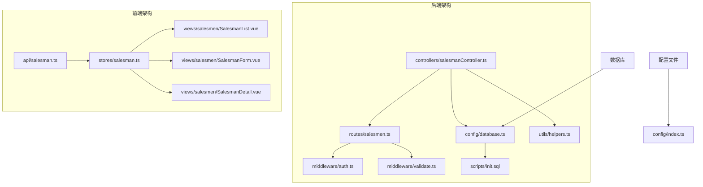
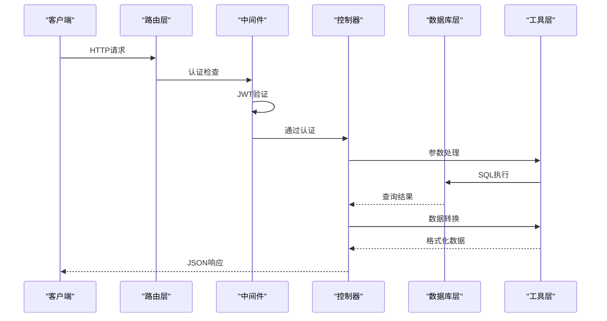
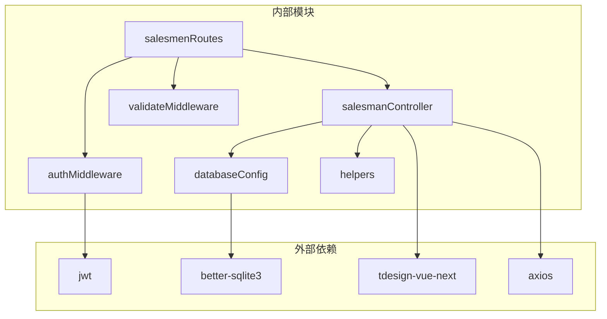

# 业务员管理 API

<cite>
**本文档引用的文件**
- [backend/src/controllers/salesmanController.ts](file://backend/src/controllers/salesmanController.ts)
- [backend/src/routes/salesmen.ts](file://backend/src/routes/salesmen.ts)
- [backend/src/middleware/auth.ts](file://backend/src/middleware/auth.ts)
- [backend/src/middleware/validate.ts](file://backend/src/middleware/validate.ts)
- [backend/src/config/database.ts](file://backend/src/config/database.ts)
- [backend/src/utils/helpers.ts](file://backend/src/utils/helpers.ts)
- [backend/src/scripts/init.sql](file://backend/src/scripts/init.sql)
- [backend/src/config/index.ts](file://backend/src/config/index.ts)
- [frontend/src/api/salesman.ts](file://frontend/src/api/salesman.ts)
- [frontend/src/stores/salesman.ts](file://frontend/src/stores/salesman.ts)
- [frontend/src/views/salesmen/SalesmanList.vue](file://frontend/src/views/salesmen/SalesmanList.vue)
- [frontend/src/views/salesmen/SalesmanForm.vue](file://frontend/src/views/salesmen/SalesmanForm.vue)
- [frontend/src/views/salesmen/SalesmanDetail.vue](file://frontend/src/views/salesmen/SalesmanDetail.vue)
</cite>

## 目录
1. [简介](#简介)
2. [项目结构](#项目结构)
3. [核心组件](#核心组件)
4. [架构概览](#架构概览)
5. [详细组件分析](#详细组件分析)
6. [依赖关系分析](#依赖关系分析)
7. [性能考虑](#性能考虑)
8. [故障排除指南](#故障排除指南)
9. [结论](#结论)
10. [附录](#附录)

## 简介

业务员管理模块是 TingStudio 系统中的核心功能模块之一，负责管理业务员的基本信息、状态控制和权限管理。该模块实现了完整的 CRUD 操作，支持关键词搜索、状态筛选、分页查询等功能，并采用软删除机制确保数据完整性。

系统采用前后端分离架构，后端基于 Node.js + Express + SQLite，前端使用 Vue 3 + TypeScript + TDesign 组件库。业务员数据具有全员可见的访问规则，所有登录用户都可以查看业务员信息。

## 项目结构

业务员管理模块在项目中的组织结构如下：



**图表来源**
- [backend/src/controllers/salesmanController.ts:1-125](file://backend/src/controllers/salesmanController.ts#L1-L125)
- [backend/src/routes/salesmen.ts:1-24](file://backend/src/routes/salesmen.ts#L1-L24)
- [frontend/src/api/salesman.ts:1-41](file://frontend/src/api/salesman.ts#L1-L41)

**章节来源**
- [backend/src/controllers/salesmanController.ts:1-125](file://backend/src/controllers/salesmanController.ts#L1-L125)
- [frontend/src/api/salesman.ts:1-41](file://frontend/src/api/salesman.ts#L1-L41)

## 核心组件

### 数据模型

业务员实体包含以下核心字段：

| 字段名 | 类型 | 必填 | 描述 | 约束 |
|--------|------|------|------|------|
| id | string | 是 | 业务员唯一标识 | 自动生成 |
| name | string | 是 | 业务员姓名 | 最少1字符 |
| code | string | 是 | 业务员工号 | 唯一约束 |
| department | string | 否 | 所属部门 | 最多50字符 |
| phone | string | 否 | 联系电话 | 11位手机号格式 |
| email | string | 否 | 邮箱地址 | 邮箱格式验证 |
| status | string | 是 | 状态 | active/inactive |
| created_by | string | 是 | 创建人ID | 外键约束 |
| created_at | string | 是 | 创建时间 | 自动设置 |
| updated_at | string | 是 | 更新时间 | 自动更新 |

### 状态枚举值

业务员状态采用枚举值管理：
- `active`: 活跃状态（默认）
- `inactive`: 停用状态（软删除）

**章节来源**
- [backend/src/scripts/init.sql:55-71](file://backend/src/scripts/init.sql#L55-L71)
- [backend/src/controllers/salesmanController.ts:119](file://backend/src/controllers/salesmanController.ts#L119)

## 架构概览

业务员管理模块采用经典的 MVC 架构模式，实现清晰的职责分离：



**图表来源**
- [backend/src/routes/salesmen.ts:9-24](file://backend/src/routes/salesmen.ts#L9-L24)
- [backend/src/middleware/auth.ts:13-31](file://backend/src/middleware/auth.ts#L13-L31)
- [backend/src/controllers/salesmanController.ts:6-125](file://backend/src/controllers/salesmanController.ts#L6-L125)

## 详细组件分析

### 控制器层

控制器层实现了业务员管理的所有核心功能，包括增删改查、状态管理和分页查询。

#### 列表查询接口

**接口定义**
- 方法: GET
- 路径: `/salesmen`
- 认证: 需要 JWT 令牌
- 权限: 所有登录用户

**查询参数**

| 参数名 | 类型 | 必填 | 默认值 | 描述 | 示例 |
|--------|------|------|--------|------|------|
| keyword | string | 否 | - | 关键词搜索 | "张三" |
| status | string | 否 | - | 状态筛选 | "active" |
| department | string | 否 | - | 部门筛选 | "销售部" |
| page | number | 否 | 1 | 页码 | 1 |
| pageSize | number | 否 | 20 | 每页数量 | 10-100 |

**响应数据结构**

```typescript
{
  success: boolean,
  message: string,
  data: {
    list: Salesman[],
    pagination: {
      page: number,
      pageSize: number,
      total: number,
      totalPages: number
    }
  }
}
```

**业务逻辑说明**
- 支持关键词模糊搜索（姓名、工号、电话）
- 动态构建 WHERE 条件子句
- 使用分页查询优化大数据集性能
- 返回标准化的分页响应格式

#### 详情查询接口

**接口定义**
- 方法: GET
- 路径: `/salesmen/:id`
- 认证: 需要 JWT 令牌
- 权限: 所有登录用户

**路径参数**

| 参数名 | 类型 | 必填 | 描述 |
|--------|------|------|------|
| id | string | 是 | 业务员唯一标识 |

**响应数据结构**
```typescript
{
  success: boolean,
  message: string,
  data: Salesman
}
```

#### 创建业务员接口

**接口定义**
- 方法: POST
- 路径: `/salesmen`
- 认证: 需要 JWT 令牌
- 权限: 所有登录用户

**请求体参数**

| 参数名 | 类型 | 必填 | 描述 | 验证规则 |
|--------|------|------|------|----------|
| name | string | 是 | 业务员姓名 | 必填，2-20字符 |
| code | string | 是 | 业务员工号 | 必填，唯一约束 |
| department | string | 否 | 所属部门 | 最多50字符 |
| phone | string | 否 | 联系电话 | 11位手机号格式 |
| email | string | 否 | 邮箱地址 | 邮箱格式 |

**响应数据结构**
```typescript
{
  success: boolean,
  message: string,
  data: Salesman
}
```

**业务逻辑说明**
- 自动设置状态为 `active`
- 记录创建人信息
- 实现工号唯一性约束
- 返回创建成功的业务员信息

#### 更新业务员接口

**接口定义**
- 方法: PUT
- 路径: `/salesmen/:id`
- 认证: 需要 JWT 令牌
- 权限: 所有登录用户

**请求体参数**
支持部分字段更新，未提供的字段保持不变。

**响应数据结构**
```typescript
{
  success: boolean,
  message: string,
  data: Salesman
}
```

#### 删除业务员接口（软删除）

**接口定义**
- 方法: DELETE
- 路径: `/salesmen/:id`
- 认证: 需要 JWT 令牌
- 权限: 所有登录用户

**业务逻辑说明**
- 采用软删除机制，将状态从 `active` 切换为 `inactive`
- 不进行物理删除，确保数据完整性
- 适用于需要保留历史记录的场景

**章节来源**
- [backend/src/controllers/salesmanController.ts:6-125](file://backend/src/controllers/salesmanController.ts#L6-L125)

### 路由层

路由层定义了业务员管理的所有 API 接口，采用 RESTful 设计风格：

```mermaid
graph LR
A[/salesmen] --> B[GET - 获取列表]
A --> C[POST - 创建业务员]
D[/salesmen/:id] --> E[GET - 获取详情]
D --> F[PUT - 更新业务员]
D --> G[DELETE - 删除业务员]
H[认证中间件] --> A
H --> D
I[验证中间件] --> C
```

**图表来源**
- [backend/src/routes/salesmen.ts:9-24](file://backend/src/routes/salesmen.ts#L9-L24)

**章节来源**
- [backend/src/routes/salesmen.ts:1-24](file://backend/src/routes/salesmen.ts#L1-L24)

### 中间件层

#### 认证中间件

认证中间件负责 JWT 令牌验证和用户身份识别：

**功能特性**
- 检查 Authorization 头部
- 验证 JWT 令牌有效性
- 提取用户信息到请求对象
- 支持自定义过期时间配置

#### 参数验证中间件

参数验证中间件提供灵活的请求参数校验：

**验证规则**
- 类型检查（string、number、boolean、array）
- 必填项验证
- 长度限制（minLength、maxLength）
- 数值范围限制（min、max）
- 正则表达式验证

**章节来源**
- [backend/src/middleware/auth.ts:1-38](file://backend/src/middleware/auth.ts#L1-L38)
- [backend/src/middleware/validate.ts:1-68](file://backend/src/middleware/validate.ts#L1-L68)

### 数据访问层

数据访问层封装了数据库操作，提供了统一的查询接口：

**核心功能**
- 连接管理：自动创建数据库目录，启用 WAL 模式
- 查询执行：支持 SELECT 和非 SELECT 语句
- 事务支持：提供原子性操作保证
- 错误处理：统一的异常处理机制

**章节来源**
- [backend/src/config/database.ts:1-70](file://backend/src/config/database.ts#L1-L70)

### 前端组件层

#### API 层

前端 API 层定义了与后端交互的标准接口：

**接口定义**
- `getList(params)`: 获取业务员列表
- `getById(id)`: 获取业务员详情
- `create(data)`: 创建业务员
- `update(id, data)`: 更新业务员
- `delete(id)`: 删除业务员

**章节来源**
- [frontend/src/api/salesman.ts:1-41](file://frontend/src/api/salesman.ts#L1-L41)

#### Store 层

Pinia Store 提供了状态管理和数据缓存功能：

**核心功能**
- 列表数据管理
- 加载状态控制
- 分页参数管理
- 表单数据处理
- 错误处理和消息提示

**章节来源**
- [frontend/src/stores/salesman.ts:1-121](file://frontend/src/stores/salesman.ts#L1-L121)

#### 视图组件

**SalesmanList.vue**: 业务员列表展示组件
- 支持关键词搜索和状态筛选
- 实现分页显示
- 提供操作按钮（查看、编辑、停用）

**SalesmanForm.vue**: 业务员表单组件  
- 实现表单验证
- 支持新增和编辑模式
- 提供手机号和邮箱格式验证

**SalesmanDetail.vue**: 业务员详情组件
- 展示业务员详细信息
- 显示状态标签
- 提供返回功能

**章节来源**
- [frontend/src/views/salesmen/SalesmanList.vue:1-136](file://frontend/src/views/salesmen/SalesmanList.vue#L1-L136)
- [frontend/src/views/salesmen/SalesmanForm.vue:1-158](file://frontend/src/views/salesmen/SalesmanForm.vue#L1-L158)
- [frontend/src/views/salesmen/SalesmanDetail.vue:1-52](file://frontend/src/views/salesmen/SalesmanDetail.vue#L1-L52)

## 依赖关系分析

业务员管理模块的依赖关系如下：



**图表来源**
- [backend/src/controllers/salesmanController.ts:1-5](file://backend/src/controllers/salesmanController.ts#L1-L5)
- [backend/src/routes/salesmen.ts:2-7](file://backend/src/routes/salesmen.ts#L2-L7)

**章节来源**
- [backend/src/controllers/salesmanController.ts:1-5](file://backend/src/controllers/salesmanController.ts#L1-L5)
- [backend/src/routes/salesmen.ts:2-7](file://backend/src/routes/salesmen.ts#L2-L7)

## 性能考虑

### 数据库优化

1. **索引策略**
   - 业务员表建立了多个索引以优化查询性能
   - 包括姓名、工号、状态等常用查询字段

2. **分页查询**
   - 实现了高效的分页查询机制
   - 支持最大 100 条记录的限制

3. **WAL 模式**
   - 启用了 SQLite 的 WAL 模式提升并发性能

### 前端优化

1. **懒加载**
   - 列表组件按需加载数据
   - 支持虚拟滚动优化大数据集展示

2. **缓存策略**
   - Store 层提供数据缓存
   - 避免重复网络请求

3. **防抖处理**
   - 搜索功能实现防抖优化
   - 减少不必要的 API 调用

## 故障排除指南

### 常见错误及解决方案

**认证失败**
- 症状：返回 401 未授权
- 原因：缺少有效的 JWT 令牌
- 解决：重新登录获取新令牌

**参数验证失败**
- 症状：返回 400 参数错误
- 原因：请求参数不符合验证规则
- 解决：检查表单输入格式和长度限制

**业务员工号冲突**
- 症状：返回 409 冲突错误
- 原因：工号已被其他业务员使用
- 解决：修改为唯一的工号

**业务员不存在**
- 症状：返回 404 资源不存在
- 原因：业务员 ID 无效或已被删除
- 解决：确认业务员 ID 正确性

### 调试建议

1. **后端调试**
   - 检查数据库连接状态
   - 查看日志输出获取详细错误信息
   - 验证 JWT 令牌配置

2. **前端调试**
   - 使用浏览器开发者工具查看网络请求
   - 检查 Store 状态变化
   - 验证表单验证规则

**章节来源**
- [backend/src/controllers/salesmanController.ts:77-82](file://backend/src/controllers/salesmanController.ts#L77-L82)
- [backend/src/middleware/auth.ts:13-31](file://backend/src/middleware/auth.ts#L13-L31)

## 结论

业务员管理模块实现了完整的业务员生命周期管理功能，具有以下特点：

1. **功能完整**：支持增删改查、状态管理、搜索筛选等核心功能
2. **安全可靠**：采用 JWT 认证和参数验证双重保障
3. **性能优化**：实现了分页查询、索引优化等性能措施
4. **用户体验**：提供了友好的前端界面和表单验证
5. **数据完整性**：采用软删除机制确保历史数据可追溯

该模块为 TingStudio 系统提供了稳定可靠的业务员管理基础，为后续的功能扩展奠定了良好的技术基础。

## 附录

### API 接口清单

| 接口名称 | 方法 | 路径 | 认证 | 权限 |
|----------|------|------|------|------|
| 获取业务员列表 | GET | /salesmen | ✅ | 所有用户 |
| 获取业务员详情 | GET | /salesmen/:id | ✅ | 所有用户 |
| 创建业务员 | POST | /salesmen | ✅ | 所有用户 |
| 更新业务员 | PUT | /salesmen/:id | ✅ | 所有用户 |
| 删除业务员 | DELETE | /salesmen/:id | ✅ | 所有用户 |

### 配置说明

**数据库配置**
- 数据库类型：SQLite
- 数据库存储路径：./data/tingstudio.db
- 外键约束：启用
- WAL 模式：启用

**JWT 配置**
- 密钥：TINGSTUDIO_DEFAULT_SECRET
- 过期时间：7天
- 签发者：TingStudio

**上传配置**
- 上传目录：./uploads
- 最大文件大小：10MB
- 支持格式：图片、文档等

**章节来源**
- [backend/src/config/index.ts:1-24](file://backend/src/config/index.ts#L1-L24)
- [backend/src/config/database.ts:10-30](file://backend/src/config/database.ts#L10-L30)