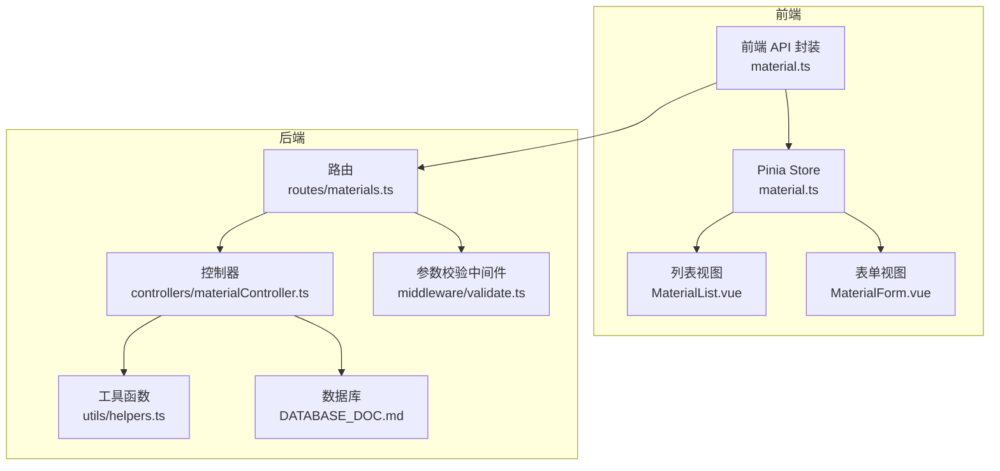
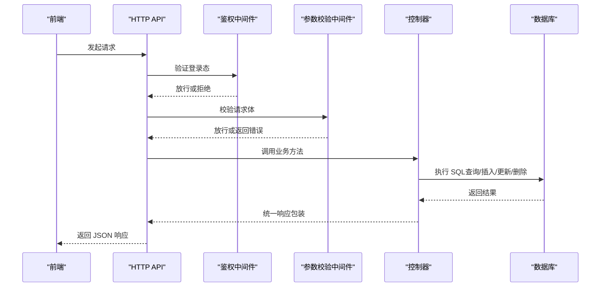
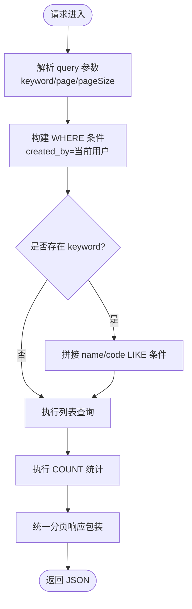
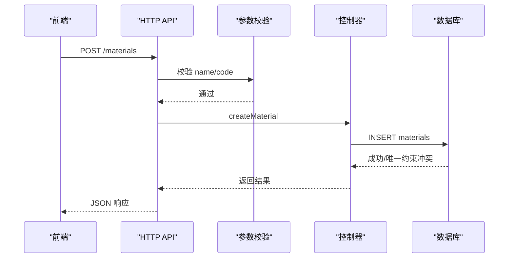
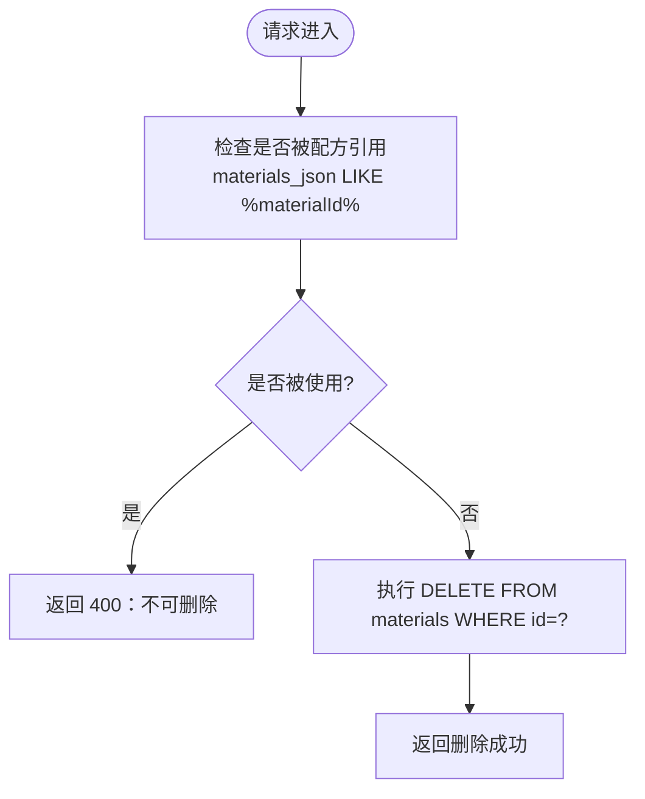
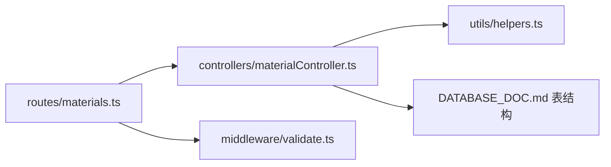

# 原料管理 API

<cite>
**本文档引用的文件**
- [backend/src/controllers/materialController.ts](file://backend/src/controllers/materialController.ts)
- [backend/src/routes/materials.ts](file://backend/src/routes/materials.ts)
- [backend/src/middleware/validate.ts](file://backend/src/middleware/validate.ts)
- [backend/src/utils/helpers.ts](file://backend/src/utils/helpers.ts)
- [backend/DATABASE_DOC.md](file://backend/DATABASE_DOC.md)
- [backend/src/scripts/init.sql](file://backend/src/scripts/init.sql)
- [frontend/src/api/material.ts](file://frontend/src/api/material.ts)
- [frontend/src/stores/material.ts](file://frontend/src/stores/material.ts)
- [frontend/src/views/materials/MaterialList.vue](file://frontend/src/views/materials/MaterialList.vue)
- [frontend/src/views/materials/MaterialForm.vue](file://frontend/src/views/materials/MaterialForm.vue)
- [backend/src/controllers/formulaController.ts](file://backend/src/controllers/formulaController.ts)
- [backend/src/routes/formulas.ts](file://backend/src/routes/formulas.ts)
</cite>

## 更新摘要
**变更内容**
- 移除了原料 API 接口中 ratioFactor 参数的处理
- 更新了数据模型说明，反映实际的表结构
- 简化了新增和更新原料的请求参数
- 更新了前端类型定义，移除 ratioFactor 字段

## 目录
1. [简介](#简介)
2. [项目结构](#项目结构)
3. [核心组件](#核心组件)
4. [架构总览](#架构总览)
5. [详细组件分析](#详细组件分析)
6. [依赖关系分析](#依赖关系分析)
7. [性能考量](#性能考量)
8. [故障排查指南](#故障排查指南)
9. [结论](#结论)
10. [附录](#附录)

## 简介
本文件为"原料管理"模块的完整 API 接口文档，覆盖原料的增删改查、详情查询、按配方查询原料、列表分页与关键词搜索、单位设置、库存管理等能力。文档同时说明原料编码的唯一性约束、库存变更的业务规则与删除保护机制，并提供前端调用示例与数据验证规则，帮助开发者正确集成。

**更新** 本版本移除了 ratioFactor 参数，简化了原料管理接口，专注于核心的原料信息管理功能。

## 项目结构
- 后端采用 Express + SQLite 的轻量架构，控制器负责业务处理，路由定义接口，中间件负责鉴权与参数校验，工具函数提供通用能力（分页、驼峰转换、ID 生成等）。
- 前端使用 Vue + Pinia，通过 API 层封装 HTTP 请求，Store 统一管理状态与分页，页面组件负责展示与交互。

**图表来源**
- [backend/src/routers/materials.ts:1-22](file://backend/src/routes/materials.ts#L1-L22)
- [backend/src/controllers/materialController.ts:1-129](file://backend/src/controllers/materialController.ts#L1-L129)
- [backend/src/middleware/validate.ts:1-68](file://backend/src/middleware/validate.ts#L1-L68)
- [backend/src/utils/helpers.ts:1-86](file://backend/src/utils/helpers.ts#L1-L86)
- [backend/DATABASE_DOC.md:44-64](file://backend/DATABASE_DOC.md#L44-L64)

**章节来源**
- [backend/src/routers/materials.ts:1-22](file://backend/src/routes/materials.ts#L1-L22)
- [backend/src/controllers/materialController.ts:1-129](file://backend/src/controllers/materialController.ts#L1-L129)
- [backend/src/middleware/validate.ts:1-68](file://backend/src/middleware/validate.ts#L1-L68)
- [backend/src/utils/helpers.ts:1-86](file://backend/src/utils/helpers.ts#L1-L86)
- [backend/DATABASE_DOC.md:44-64](file://backend/DATABASE_DOC.md#L44-L64)

## 核心组件
- 路由层：定义原料管理的 REST 接口，统一注入鉴权中间件。
- 控制器层：实现列表、详情、创建、更新、删除等业务逻辑；包含关键词搜索、分页、唯一性约束处理、删除保护等。
- 中间件层：参数校验，确保请求体字段类型、长度、范围符合要求。
- 工具层：提供分页构建、LIKE 条件构造、驼峰转换、ID 生成等通用能力。
- 数据层：SQLite 表结构定义，含原料表的唯一约束与默认值。

**章节来源**
- [backend/src/routers/materials.ts:1-22](file://backend/src/routes/materials.ts#L1-L22)
- [backend/src/controllers/materialController.ts:6-38](file://backend/src/controllers/materialController.ts#L6-L38)
- [backend/src/middleware/validate.ts:16-67](file://backend/src/middleware/validate.ts#L16-L67)
- [backend/src/utils/helpers.ts:13-51](file://backend/src/utils/helpers.ts#L13-L51)
- [backend/DATABASE_DOC.md:44-64](file://backend/DATABASE_DOC.md#L44-L64)

## 架构总览

**图表来源**
- [backend/src/routers/materials.ts:9-21](file://backend/src/routes/materials.ts#L9-L21)
- [backend/src/middleware/validate.ts:16-67](file://backend/src/middleware/validate.ts#L16-L67)
- [backend/src/controllers/materialController.ts:58-106](file://backend/src/controllers/materialController.ts#L58-L106)

## 详细组件分析

### 1) 列表查询（分页 + 关键词搜索）
- 接口定义
  - 方法：GET
  - 路径：/materials
  - 鉴权：是
- 请求参数
  - keyword：可选，字符串，支持原料名称或编码的模糊匹配
  - page：可选，数字，默认 1，最小 1
  - pageSize：可选，数字，默认 20，最大 100
- 响应数据
  - success：布尔
  - message：字符串
  - data.list：原料数组（包含 id、name、code、unit、stock、materialType、createdBy、createdAt、updatedAt）
  - data.pagination：分页信息（page、pageSize、total、totalPages）
- 业务逻辑
  - 仅查询当前用户创建的原料
  - keyword 使用 LIKE 模糊匹配 name 或 code
  - 分页参数经工具函数规范化
- 错误码
  - 500：服务器内部错误

**图表来源**
- [backend/src/controllers/materialController.ts:7-38](file://backend/src/controllers/materialController.ts#L7-L38)
- [backend/src/utils/helpers.ts:13-19](file://backend/src/utils/helpers.ts#L13-L19)
- [backend/src/utils/helpers.ts:21-24](file://backend/src/utils/helpers.ts#L21-L24)

**章节来源**
- [backend/src/controllers/materialController.ts:7-38](file://backend/src/controllers/materialController.ts#L7-L38)
- [backend/src/routers/materials.ts:11](file://backend/src/routes/materials.ts#L11)
- [backend/src/utils/helpers.ts:13-19](file://backend/src/utils/helpers.ts#L13-L19)
- [backend/src/utils/helpers.ts:21-24](file://backend/src/utils/helpers.ts#L21-L24)

### 2) 详情查询
- 接口定义
  - 方法：GET
  - 路径：/materials/:id
  - 鉴权：是
- 请求参数
  - id：路径参数，原料 ID
- 响应数据
  - data：原料对象（包含上述列表字段）
- 错误码
  - 404：原料不存在
  - 500：服务器内部错误

**章节来源**
- [backend/src/controllers/materialController.ts:40-55](file://backend/src/controllers/materialController.ts#L40-L55)
- [backend/src/routers/materials.ts:12](file://backend/src/routes/materials.ts#L12)

### 3) 新增原料
- 接口定义
  - 方法：POST
  - 路径：/materials
  - 鉴权：是
  - 参数校验：是
- 请求体字段
  - name：字符串，必填，最小长度 1
  - code：字符串，必填，最小长度 1
  - unit：字符串，可选，默认 g
  - stock：数字，可选，默认 0
  - materialType：字符串，可选，默认 herb
- 响应数据
  - data：新增的原料对象
- 错误码
  - 400：参数校验失败
  - 409：原料编码已存在（数据库唯一约束）
  - 500：服务器内部错误

**图表来源**
- [backend/src/routers/materials.ts:13-19](file://backend/src/routes/materials.ts#L13-L19)
- [backend/src/middleware/validate.ts:16-67](file://backend/src/middleware/validate.ts#L16-L67)
- [backend/src/controllers/materialController.ts:58-79](file://backend/src/controllers/materialController.ts#L58-L79)

**章节来源**
- [backend/src/routers/materials.ts:13-19](file://backend/src/routes/materials.ts#L13-L19)
- [backend/src/middleware/validate.ts:16-67](file://backend/src/middleware/validate.ts#L16-L67)
- [backend/src/controllers/materialController.ts:58-79](file://backend/src/controllers/materialController.ts#L58-L79)

### 4) 更新原料
- 接口定义
  - 方法：PUT
  - 路径：/materials/:id
  - 鉴权：是
- 请求体字段
  - name、code、unit、stock、materialType（均可选）
- 响应数据
  - data：更新后的原料对象
- 错误码
  - 404：原料不存在
  - 409：原料编码已存在（唯一约束）
  - 500：服务器内部错误

**章节来源**
- [backend/src/controllers/materialController.ts:81-106](file://backend/src/controllers/materialController.ts#L81-L106)
- [backend/src/routers/materials.ts:20](file://backend/src/routes/materials.ts#L20)

### 5) 删除原料
- 接口定义
  - 方法：DELETE
  - 路径：/materials/:id
  - 鉴权：是
- 业务规则
  - 若原料在任一配方的 materials_json 中被引用，则禁止删除
  - 删除前会进行引用检查（基于 JSON 文本 LIKE 匹配）
- 响应数据
  - 无 data
- 错误码
  - 400：该原料正在被配方使用，无法删除
  - 500：服务器内部错误

**图表来源**
- [backend/src/controllers/materialController.ts:108-128](file://backend/src/controllers/materialController.ts#L108-L128)

**章节来源**
- [backend/src/controllers/materialController.ts:108-128](file://backend/src/controllers/materialController.ts#L108-L128)
- [backend/src/routers/materials.ts:21](file://backend/src/routes/materials.ts#L21)

### 6) 按配方查询原料
- 接口定义
  - 方法：GET
  - 路径：/materials/by-formula/:formulaId
  - 鉴权：是
- 用途
  - 根据配方 ID 查询配方中使用的原料集合（用于配方详情或编辑时的原料回显）
- 响应数据
  - data：原料数组（包含原料基本信息）

**章节来源**
- [frontend/src/api/material.ts:41-44](file://frontend/src/api/material.ts#L41-L44)
- [backend/src/controllers/formulaController.ts:231-243](file://backend/src/controllers/formulaController.ts#L231-L243)
- [backend/src/routes/formulas.ts:27](file://backend/src/routes/formulas.ts#L27)

### 7) 数据模型与约束
- 原料表字段与约束
  - id：主键
  - name：非空
  - code：非空且唯一
  - unit：非空，默认 g
  - stock：非空，默认 0
  - material_type：非空，默认 herb
  - created_by：创建人
  - created_at/updated_at：时间戳
- 唯一性约束
  - code 字段具有唯一约束，重复创建或更新会触发 409
- 默认值与类型
  - unit 默认 g，stock 默认 0，material_type 默认 herb

**更新** 移除了 ratio_factor 字段，该字段已从原料表中移除，不再作为请求参数或响应字段。

**章节来源**
- [backend/DATABASE_DOC.md:44-64](file://backend/DATABASE_DOC.md#L44-L64)
- [backend/src/scripts/init.sql:17-28](file://backend/src/scripts/init.sql#L17-L28)

### 8) 前端调用示例与集成要点
- 列表查询
  - GET /materials?keyword=&page=&pageSize=
  - 前端通过 Pinia Store 的 getList 方法发起请求，自动处理分页与 keyword
- 详情查询
  - GET /materials/:id
  - 通过 getById 获取单条记录
- 新增/更新
  - POST /materials 或 PUT /materials/:id
  - 前端表单校验与后端校验共同保障数据质量
- 删除
  - DELETE /materials/:id
  - 删除前需提示用户，避免误删

**章节来源**
- [frontend/src/api/material.ts:25-44](file://frontend/src/api/material.ts#L25-L44)
- [frontend/src/stores/material.ts:16-85](file://frontend/src/stores/material.ts#L16-L85)
- [frontend/src/views/materials/MaterialList.vue:131-178](file://frontend/src/views/materials/MaterialList.vue#L131-L178)
- [frontend/src/views/materials/MaterialForm.vue:125-165](file://frontend/src/views/materials/MaterialForm.vue#L125-L165)

## 依赖关系分析

**图表来源**
- [backend/src/routers/materials.ts:1-22](file://backend/src/routes/materials.ts#L1-L22)
- [backend/src/controllers/materialController.ts:1-129](file://backend/src/controllers/materialController.ts#L1-L129)
- [backend/src/middleware/validate.ts:1-68](file://backend/src/middleware/validate.ts#L1-L68)
- [backend/src/utils/helpers.ts:1-86](file://backend/src/utils/helpers.ts#L1-L86)
- [backend/DATABASE_DOC.md:44-64](file://backend/DATABASE_DOC.md#L44-L64)

**章节来源**
- [backend/src/routers/materials.ts:1-22](file://backend/src/routes/materials.ts#L1-L22)
- [backend/src/controllers/materialController.ts:1-129](file://backend/src/controllers/materialController.ts#L1-L129)
- [backend/src/middleware/validate.ts:1-68](file://backend/src/middleware/validate.ts#L1-L68)
- [backend/src/utils/helpers.ts:1-86](file://backend/src/utils/helpers.ts#L1-L86)
- [backend/DATABASE_DOC.md:44-64](file://backend/DATABASE_DOC.md#L44-L64)

## 性能考量
- 分页参数限制：page 最小为 1，pageSize 最小为 1、最大为 100，避免超大分页导致资源浪费
- 模糊查询：LIKE 条件对 name/code 进行匹配，建议在高频查询场景下考虑建立合适索引（当前文档未给出具体索引，但表结构中包含 name/code 索引）
- JSON 查询：删除保护通过 materials_json 的 LIKE 匹配判断，可能影响性能；建议在高并发场景评估优化方案（如引入中间表或缓存）

## 故障排查指南
- 400 参数校验失败
  - 检查请求体字段类型、长度与必填项
  - 参考后端校验规则与前端表单规则
- 409 原料编码已存在
  - 修改 code 或使用其他编码
- 404 原料不存在
  - 确认 id 是否正确，或该记录是否已被删除
- 400 该原料正在被配方使用，无法删除
  - 先移除配方中的该原料，或调整配方后再删除
- 500 服务器内部错误
  - 查看服务端日志，定位具体异常

**章节来源**
- [backend/src/middleware/validate.ts:16-67](file://backend/src/middleware/validate.ts#L16-L67)
- [backend/src/controllers/materialController.ts:73-78](file://backend/src/controllers/materialController.ts#L73-L78)
- [backend/src/controllers/materialController.ts:100-103](file://backend/src/controllers/materialController.ts#L100-L103)
- [backend/src/controllers/materialController.ts:118-121](file://backend/src/controllers/materialController.ts#L118-L121)

## 结论
本接口文档覆盖了原料管理的全量能力：列表分页与关键词搜索、详情查询、新增与更新、删除保护、按配方查询原料等。通过前后端协同的参数校验与统一响应包装，保证了数据一致性与用户体验。移除了 ratioFactor 参数后，接口更加简洁，专注于核心的原料信息管理功能。建议在生产环境中结合业务场景进一步完善索引与缓存策略，以提升查询性能。

## 附录

### A. 原料字段说明
- id：原料唯一标识
- name：原料名称
- code：原料编码（唯一）
- unit：计量单位（默认 g）
- stock：库存数量（默认 0）
- materialType：原料类型（herb/ supplement，默认 herb）
- createdBy：创建人
- createdAt/updatedAt：创建与更新时间

**更新** 移除了 ratioFactor 字段，该字段已从原料管理功能中移除。

**章节来源**
- [backend/DATABASE_DOC.md:44-64](file://backend/DATABASE_DOC.md#L44-L64)
- [frontend/src/api/material.ts:3-14](file://frontend/src/api/material.ts#L3-L14)

### B. 前端调用要点
- 列表：使用 materialApi.getList，支持 keyword、page、pageSize
- 详情：materialApi.getById
- 新增/更新：materialApi.create / materialApi.update
- 删除：materialApi.delete
- 按配方查询：materialApi.getByFormula（前端定义，后端控制器未实现对应路由）

**更新** 前端类型定义中已移除 ratioFactor 字段，保持与后端一致。

**章节来源**
- [frontend/src/api/material.ts:25-44](file://frontend/src/api/material.ts#L25-L44)
- [frontend/src/stores/material.ts:16-85](file://frontend/src/stores/material.ts#L16-L85)
- [backend/src/controllers/formulaController.ts:231-243](file://backend/src/controllers/formulaController.ts#L231-L243)
- [backend/src/routes/formulas.ts:27](file://backend/src/routes/formulas.ts#L27)