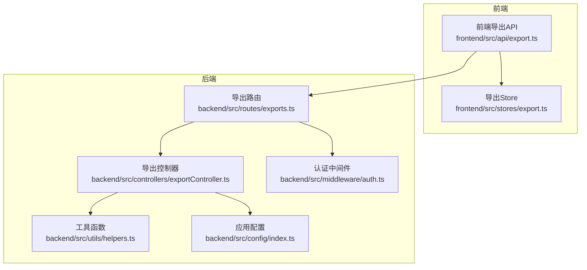
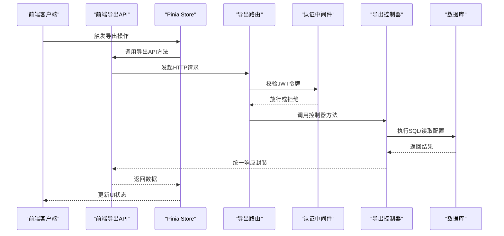
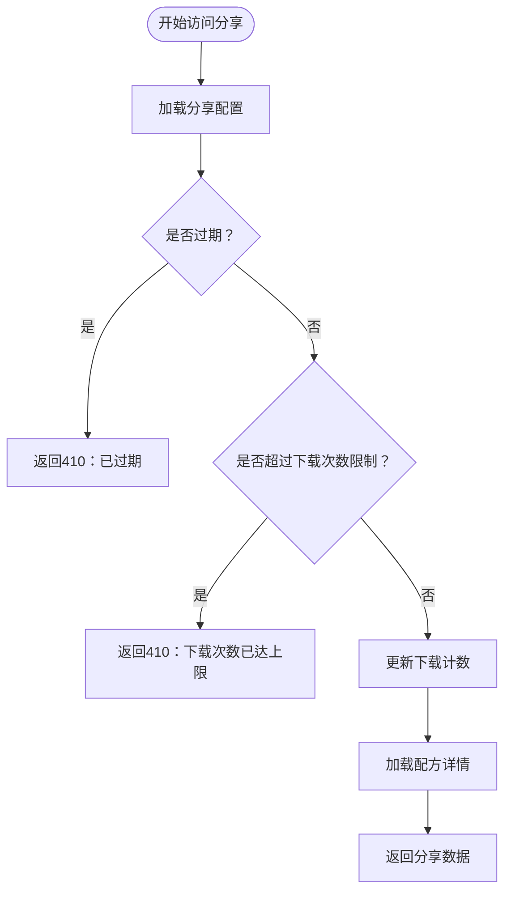
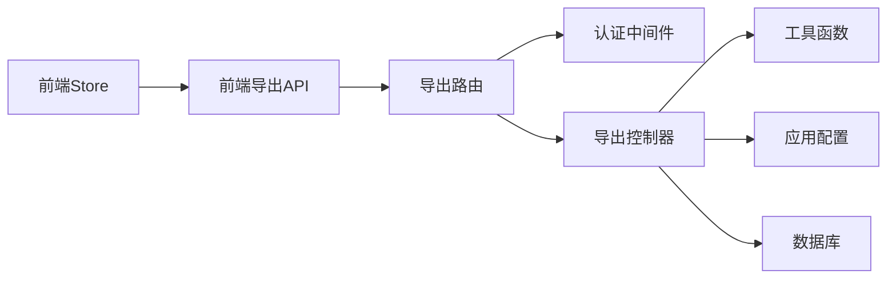
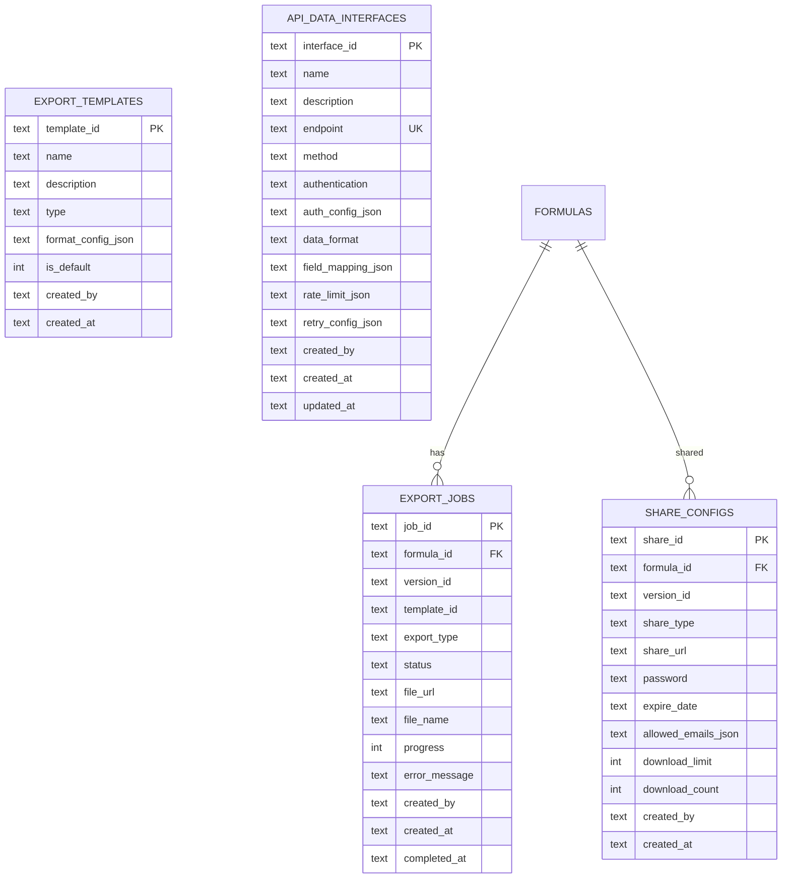

# 导出管理 API

<cite>
**本文档引用的文件**
- [backend/src/controllers/exportController.ts](file://backend/src/controllers/exportController.ts)
- [backend/src/routes/exports.ts](file://backend/src/routes/exports.ts)
- [backend/API_DOC.md](file://backend/API_DOC.md)
- [backend/DATABASE_DOC.md](file://backend/DATABASE_DOC.md)
- [backend/src/middleware/auth.ts](file://backend/src/middleware/auth.ts)
- [backend/src/utils/helpers.ts](file://backend/src/utils/helpers.ts)
- [backend/src/config/index.ts](file://backend/src/config/index.ts)
- [frontend/src/api/export.ts](file://frontend/src/api/export.ts)
- [frontend/src/stores/export.ts](file://frontend/src/stores/export.ts)
</cite>

## 目录
1. [简介](#简介)
2. [项目结构](#项目结构)
3. [核心组件](#核心组件)
4. [架构总览](#架构总览)
5. [详细组件分析](#详细组件分析)
6. [依赖关系分析](#依赖关系分析)
7. [性能考虑](#性能考虑)
8. [故障排查指南](#故障排查指南)
9. [结论](#结论)
10. [附录](#附录)

## 简介
本文件为导出管理模块的完整 API 接口文档，覆盖以下能力：
- 导出模板管理：模板列表查询与创建（支持 PDF、Excel、API、打印）
- 导出任务管理：任务创建、任务列表与状态查询
- 分享链接管理：创建分享、公开访问、访问控制与下载限制
- API 接口配置：外部数据接口的创建与查询（用于导出类型为 API 的场景）

同时，文档说明了导出类型支持、模板格式配置、任务队列管理、分享安全控制、文件生成流程、安全验证机制，并给出性能优化、大文件处理与并发控制的最佳实践。

## 项目结构
后端采用 Express + TypeScript，导出模块由路由、控制器、中间件与工具函数组成；前端通过 Pinia Store 与 API 层对接。

图表来源
- [backend/src/routes/exports.ts:1-34](file://backend/src/routes/exports.ts#L1-L34)
- [backend/src/controllers/exportController.ts:1-230](file://backend/src/controllers/exportController.ts#L1-L230)
- [backend/src/middleware/auth.ts:1-38](file://backend/src/middleware/auth.ts#L1-L38)
- [backend/src/utils/helpers.ts:1-86](file://backend/src/utils/helpers.ts#L1-L86)
- [backend/src/config/index.ts:1-24](file://backend/src/config/index.ts#L1-L24)
- [frontend/src/api/export.ts:1-56](file://frontend/src/api/export.ts#L1-L56)
- [frontend/src/stores/export.ts:1-109](file://frontend/src/stores/export.ts#L1-L109)

章节来源
- [backend/src/routes/exports.ts:1-34](file://backend/src/routes/exports.ts#L1-L34)
- [backend/src/controllers/exportController.ts:1-230](file://backend/src/controllers/exportController.ts#L1-L230)
- [frontend/src/api/export.ts:1-56](file://frontend/src/api/export.ts#L1-L56)
- [frontend/src/stores/export.ts:1-109](file://frontend/src/stores/export.ts#L1-L109)

## 核心组件
- 路由层：定义导出相关接口的路径与鉴权策略
- 控制器层：实现模板、任务、分享、API 接口的具体业务逻辑
- 中间件层：JWT 认证与请求体校验
- 工具层：统一响应、分页、ID 生成、JSON 安全解析等
- 前端层：导出 API 客户端与 Pinia Store

章节来源
- [backend/src/routes/exports.ts:1-34](file://backend/src/routes/exports.ts#L1-L34)
- [backend/src/controllers/exportController.ts:1-230](file://backend/src/controllers/exportController.ts#L1-L230)
- [backend/src/middleware/auth.ts:1-38](file://backend/src/middleware/auth.ts#L1-L38)
- [backend/src/utils/helpers.ts:1-86](file://backend/src/utils/helpers.ts#L1-L86)

## 架构总览
导出管理模块遵循“路由 -> 中间件 -> 控制器 -> 数据库”的调用链路，前端通过 HTTP 客户端发起请求，后端返回统一格式的响应。

图表来源
- [backend/src/routes/exports.ts:1-34](file://backend/src/routes/exports.ts#L1-L34)
- [backend/src/middleware/auth.ts:1-38](file://backend/src/middleware/auth.ts#L1-L38)
- [backend/src/controllers/exportController.ts:1-230](file://backend/src/controllers/exportController.ts#L1-L230)
- [frontend/src/api/export.ts:1-56](file://frontend/src/api/export.ts#L1-L56)
- [frontend/src/stores/export.ts:1-109](file://frontend/src/stores/export.ts#L1-L109)

## 详细组件分析

### 1. 导出模板管理
- 接口列表
  - GET /api/exports/templates：查询模板列表（可按类型过滤）
  - POST /api/exports/templates：创建模板（支持设置默认模板）
- 请求参数
  - GET /api/exports/templates
    - type：模板类型（可选，支持 pdf、excel、api、print）
  - POST /api/exports/templates
    - name：模板名称（必填）
    - description：描述（可选）
    - type：模板类型（必填）
    - formatConfig：格式配置（必填，JSON 对象）
    - isDefault：是否设为默认（可选）
- 响应数据
  - 列表：数组，元素包含 templateId、name、type、formatConfig、isDefault、createdBy、createdAt
  - 创建：返回 templateId
- 安全与规则
  - 需要认证
  - 当设置 isDefault=true 时，会将同类型的模板默认标记置零
- 模板格式配置
  - formatConfig 为 JSON 对象，具体字段由前端/业务约定，建议包含页面布局、字段映射、样式等

章节来源
- [backend/src/controllers/exportController.ts:6-30](file://backend/src/controllers/exportController.ts#L6-L30)
- [backend/API_DOC.md:473-492](file://backend/API_DOC.md#L473-L492)
- [backend/DATABASE_DOC.md:175-191](file://backend/DATABASE_DOC.md#L175-L191)

### 2. 导出任务管理
- 接口列表
  - POST /api/exports/jobs：创建导出任务
  - GET /api/exports/jobs：查询任务列表（支持状态过滤与分页）
  - GET /api/exports/jobs/:jobId：查询任务详情
- 请求参数
  - POST /api/exports/jobs
    - formulaId：配方ID（必填）
    - versionId：版本ID（可选）
    - templateId：模板ID（可选）
    - exportType：导出类型（必填，支持 pdf、excel、api）
  - GET /api/exports/jobs
    - status：任务状态（可选，支持 pending、processing、completed、failed）
    - page/pageSize：分页参数（可选）
- 响应数据
  - 列表：包含 list 与 pagination
  - 详情：包含 jobId、formulaId、versionId、templateId、exportType、status、fileUrl、fileName、progress、errorMessage、createdBy、createdAt、completedAt
- 文件生成流程（概念性说明）
  - 创建任务后，后台根据模板与配方数据生成文件或推送 API 数据
  - 任务状态在 pending -> processing -> completed 或 failed 之间流转
  - 前端轮询或监听任务状态变化

章节来源
- [backend/src/controllers/exportController.ts:55-117](file://backend/src/controllers/exportController.ts#L55-L117)
- [backend/API_DOC.md:493-517](file://backend/API_DOC.md#L493-L517)
- [backend/DATABASE_DOC.md:194-221](file://backend/DATABASE_DOC.md#L194-L221)

### 3. 分享链接管理
- 接口列表
  - POST /api/exports/share：创建分享
  - GET /api/exports/share/:shareId：公开访问分享内容
- 请求参数
  - POST /api/exports/share
    - formulaId：配方ID（必填）
    - versionId：版本ID（可选）
    - shareType：分享类型（可选，link/email/api）
    - password：访问密码（可选）
    - expireDate：过期日期（可选）
    - allowedEmails：允许访问的邮箱列表（可选）
    - downloadLimit：下载次数限制（可选）
  - GET /api/exports/share/:shareId
    - 无需认证
- 响应数据
  - 创建：返回 shareId 与 shareUrl
  - 公开访问：返回 shareId、shareType、formulaId、versionId、formula（配方详情）、allowedEmails、downloadCount、downloadLimit、expireDate 等
- 安全与控制
  - 访问控制：支持密码保护、邮箱白名单、过期时间、下载次数限制
  - 过期判断：若过期返回 410
  - 下载限制：超过限制返回 410
  - 下载计数：每次成功访问更新一次

图表来源
- [backend/src/controllers/exportController.ts:119-185](file://backend/src/controllers/exportController.ts#L119-L185)
- [backend/DATABASE_DOC.md:248-270](file://backend/DATABASE_DOC.md#L248-L270)

章节来源
- [backend/src/controllers/exportController.ts:119-185](file://backend/src/controllers/exportController.ts#L119-L185)
- [backend/API_DOC.md:518-536](file://backend/API_DOC.md#L518-L536)
- [backend/DATABASE_DOC.md:248-270](file://backend/DATABASE_DOC.md#L248-L270)

### 4. API 接口配置
- 接口列表
  - GET /api/exports/api-interfaces：查询 API 接口列表
  - POST /api/exports/api-interfaces：创建 API 接口
- 请求参数
  - GET /api/exports/api-interfaces：无
  - POST /api/exports/api-interfaces
    - name/description：名称与描述
    - endpoint：端点地址（唯一）
    - method：HTTP 方法（GET/POST/PUT/DELETE）
    - authentication：认证方式（none/basic/apiKey/oauth）
    - authConfig：认证配置（JSON）
    - dataFormat：数据格式（json/xml）
    - fieldMapping：字段映射（JSON 数组）
    - rateLimit：限流配置（JSON）
    - retryConfig：重试配置（JSON）
- 响应数据
  - 列表：包含接口数组，字段包含认证配置、字段映射、限流与重试配置等
  - 创建：返回 interfaceId
- 冲突处理
  - endpoint 唯一约束冲突返回 409

章节来源
- [backend/src/controllers/exportController.ts:187-230](file://backend/src/controllers/exportController.ts#L187-L230)
- [backend/API_DOC.md:538-558](file://backend/API_DOC.md#L538-L558)
- [backend/DATABASE_DOC.md:223-245](file://backend/DATABASE_DOC.md#L223-L245)

### 5. 路由与认证
- 路由规则
  - /api/exports/templates：GET/POST（需认证）
  - /api/exports/jobs：POST、GET、GET /:jobId
  - /api/exports/share：POST、GET /share/:shareId（公开）
  - /api/exports/api-interfaces：GET/POST
- 认证机制
  - 所有受保护接口要求 Authorization: Bearer <JWT>
  - 认证失败返回 401

章节来源
- [backend/src/routes/exports.ts:14-34](file://backend/src/routes/exports.ts#L14-L34)
- [backend/src/middleware/auth.ts:13-31](file://backend/src/middleware/auth.ts#L13-L31)
- [backend/API_DOC.md:3-71](file://backend/API_DOC.md#L3-L71)

## 依赖关系分析
- 组件耦合
  - 路由依赖中间件与控制器
  - 控制器依赖数据库查询与工具函数
  - 前端 API 依赖后端路由与统一响应格式
- 外部依赖
  - JWT：认证令牌
  - SQLite：数据持久化
  - better-sqlite3：数据库驱动

图表来源
- [backend/src/routes/exports.ts:1-34](file://backend/src/routes/exports.ts#L1-L34)
- [backend/src/controllers/exportController.ts:1-230](file://backend/src/controllers/exportController.ts#L1-L230)
- [backend/src/middleware/auth.ts:1-38](file://backend/src/middleware/auth.ts#L1-L38)
- [backend/src/utils/helpers.ts:1-86](file://backend/src/utils/helpers.ts#L1-L86)
- [backend/src/config/index.ts:1-24](file://backend/src/config/index.ts#L1-L24)
- [frontend/src/api/export.ts:1-56](file://frontend/src/api/export.ts#L1-L56)
- [frontend/src/stores/export.ts:1-109](file://frontend/src/stores/export.ts#L1-L109)

章节来源
- [backend/src/routes/exports.ts:1-34](file://backend/src/routes/exports.ts#L1-L34)
- [backend/src/controllers/exportController.ts:1-230](file://backend/src/controllers/exportController.ts#L1-L230)
- [backend/src/middleware/auth.ts:1-38](file://backend/src/middleware/auth.ts#L1-L38)
- [backend/src/utils/helpers.ts:1-86](file://backend/src/utils/helpers.ts#L1-L86)
- [backend/src/config/index.ts:1-24](file://backend/src/config/index.ts#L1-L24)
- [frontend/src/api/export.ts:1-56](file://frontend/src/api/export.ts#L1-L56)
- [frontend/src/stores/export.ts:1-109](file://frontend/src/stores/export.ts#L1-L109)

## 性能考虑
- 大文件处理
  - 上传目录与大小限制：通过配置项控制上传目录与最大文件大小
  - 建议：对大文件采用分片上传、断点续传或异步任务队列
- 并发控制
  - 任务队列：导出任务采用 pending/processing/completed/failed 状态机，避免重复执行
  - 限流：对外部 API 接口支持 rateLimit 配置
- 查询优化
  - 分页：后端限制每页最大条数，避免一次性返回大量数据
  - 索引：数据库表针对常用查询字段建立索引（如 export_jobs 的 formula_id、status）
- 缓存与压缩
  - 对静态资源与报表缓存可结合 CDN 与 Gzip 压缩

章节来源
- [backend/src/config/index.ts:15-18](file://backend/src/config/index.ts#L15-L18)
- [backend/DATABASE_DOC.md:217-219](file://backend/DATABASE_DOC.md#L217-L219)
- [backend/src/utils/helpers.ts:13-19](file://backend/src/utils/helpers.ts#L13-L19)

## 故障排查指南
- 常见错误与状态码
  - 401 未认证：缺少或无效的 JWT 令牌
  - 404 资源不存在：任务或分享不存在
  - 409 资源冲突：API 接口 endpoint 已存在
  - 410 资源已过期/下载次数已达上限：分享过期或超出下载限制
  - 500 服务器内部错误：数据库异常或业务逻辑异常
- 建议排查步骤
  - 确认 Authorization 头是否正确携带
  - 检查任务状态是否为 completed 且 fileUrl 是否可用
  - 核对分享配置中的 password、allowedEmails、expireDate、downloadLimit
  - 查看数据库中对应记录是否存在、是否被删除或更新

章节来源
- [backend/API_DOC.md:58-71](file://backend/API_DOC.md#L58-L71)
- [backend/src/controllers/exportController.ts:119-185](file://backend/src/controllers/exportController.ts#L119-L185)
- [backend/src/controllers/exportController.ts:187-230](file://backend/src/controllers/exportController.ts#L187-L230)

## 结论
导出管理模块提供了从模板配置、任务调度、分享控制到外部 API 集成的完整能力。通过统一的认证与响应格式、完善的数据库设计与前端 Store 封装，能够满足多场景下的导出需求。建议在生产环境中配合任务队列、CDN 与限流策略，确保高并发与大文件场景的稳定性与性能。

## 附录

### A. 统一响应格式
- 成功响应
  - { success: true, message: "操作成功", data: any }
- 分页列表响应
  - { success: true, message: "查询成功", data: { list: [], pagination: { page, pageSize, total, totalPages } } }
- 错误响应
  - { success: false, message: "错误描述", errors?: ["详细错误列表"] }

章节来源
- [backend/API_DOC.md:18-56](file://backend/API_DOC.md#L18-L56)

### B. 数据模型概览

图表来源
- [backend/DATABASE_DOC.md:175-270](file://backend/DATABASE_DOC.md#L175-L270)