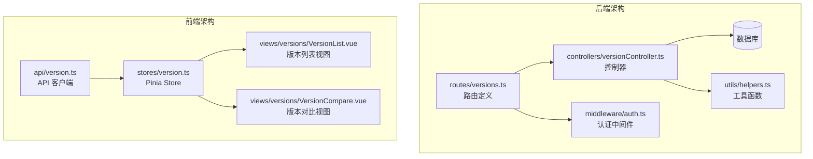
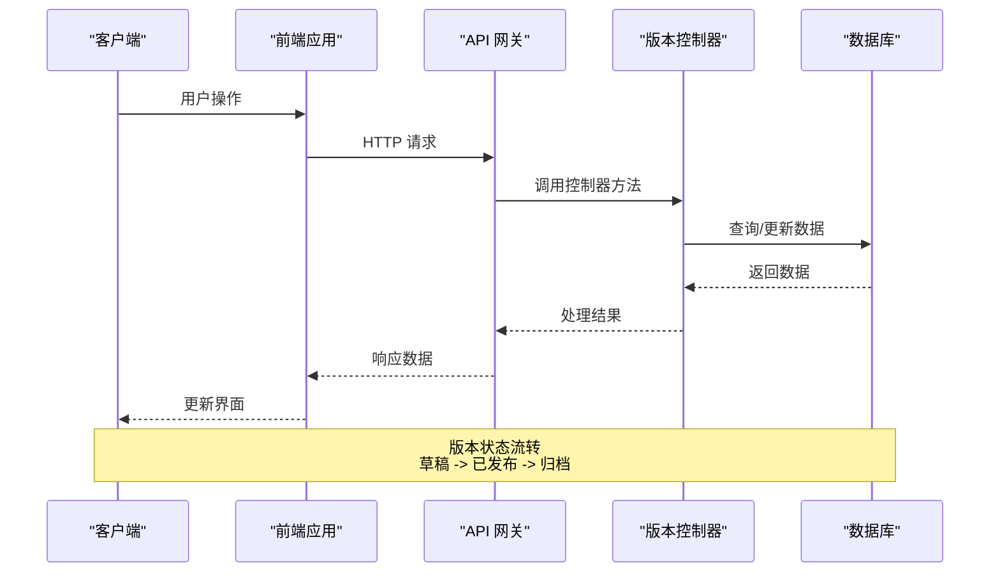
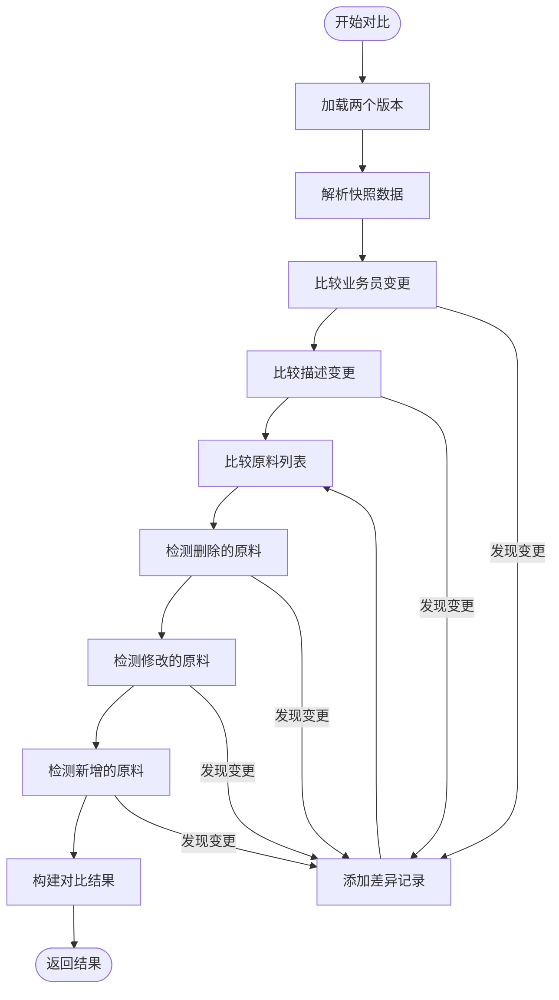
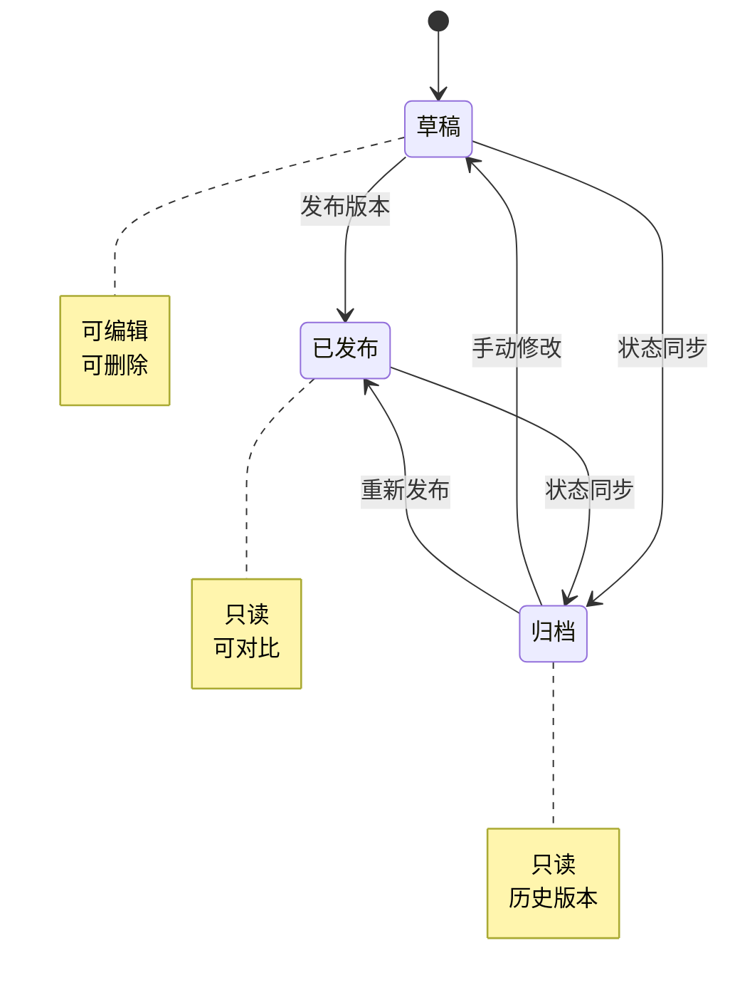
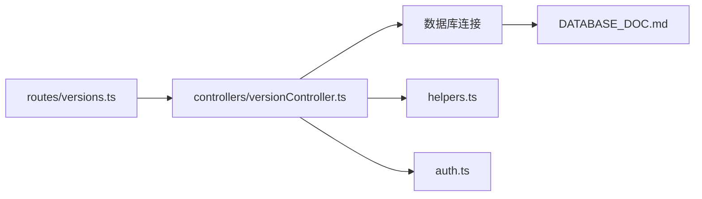
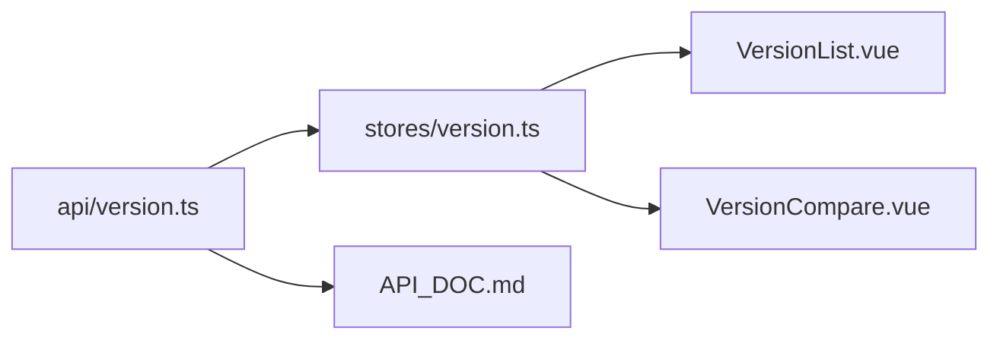

# 版本管理 API

<cite>
**本文档引用的文件**
- [versionController.ts](file://backend/src/controllers/versionController.ts)
- [versions.ts](file://backend/src/routes/versions.ts)
- [version.ts](file://frontend/src/api/version.ts)
- [version.ts](file://frontend/src/stores/version.ts)
- [VersionList.vue](file://frontend/src/views/versions/VersionList.vue)
- [VersionCompare.vue](file://frontend/src/views/versions/VersionCompare.vue)
- [helpers.ts](file://backend/src/utils/helpers.ts)
- [auth.ts](file://backend/src/middleware/auth.ts)
- [API_DOC.md](file://backend/API_DOC.md)
- [DATABASE_DOC.md](file://backend/DATABASE_DOC.md)
</cite>

## 目录
1. [简介](#简介)
2. [项目结构](#项目结构)
3. [核心组件](#核心组件)
4. [架构概览](#架构概览)
5. [详细组件分析](#详细组件分析)
6. [依赖关系分析](#依赖关系分析)
7. [性能考虑](#性能考虑)
8. [故障排除指南](#故障排除指南)
9. [结论](#结论)
10. [附录](#附录)

## 简介
本文档详细说明配方版本管理模块的 API 接口规范，涵盖版本的完整生命周期管理，包括版本列表查询、详情获取、新版本创建、版本发布和版本对比等功能。文档还解释了版本号自动生成规则、版本状态管理（草稿、已发布、归档）、当前版本标记机制、版本快照存储格式、变更记录解析规则以及版本发布后的状态同步逻辑。同时提供前端版本管理界面的集成指南和用户体验优化建议。

## 项目结构
版本管理模块采用前后端分离架构，后端使用 Express.js 提供 RESTful API，前端使用 Vue.js + Pinia 管理状态。核心文件组织如下：



**图表来源**
- [versions.ts:1-17](file://backend/src/routes/versions.ts#L1-L17)
- [versionController.ts:1-270](file://backend/src/controllers/versionController.ts#L1-L270)
- [version.ts:1-35](file://frontend/src/api/version.ts#L1-L35)
- [version.ts:1-83](file://frontend/src/stores/version.ts#L1-L83)

**章节来源**
- [versions.ts:1-17](file://backend/src/routes/versions.ts#L1-L17)
- [versionController.ts:1-270](file://backend/src/controllers/versionController.ts#L1-L270)
- [version.ts:1-35](file://frontend/src/api/version.ts#L1-L35)
- [version.ts:1-83](file://frontend/src/stores/version.ts#L1-L83)

## 核心组件
版本管理模块包含以下核心组件：

### 后端组件
- **路由层**：定义版本管理相关的 HTTP 路由
- **控制器层**：实现版本管理的具体业务逻辑
- **数据库层**：存储版本快照和变更记录
- **工具层**：提供通用的辅助函数

### 前端组件
- **API 客户端**：封装版本管理的 HTTP 请求
- **状态管理**：使用 Pinia 管理版本数据状态
- **视图组件**：提供版本列表和对比的用户界面

**章节来源**
- [versionController.ts:1-270](file://backend/src/controllers/versionController.ts#L1-L270)
- [version.ts:1-35](file://frontend/src/api/version.ts#L1-L35)
- [version.ts:1-83](file://frontend/src/stores/version.ts#L1-L83)

## 架构概览
版本管理模块采用经典的三层架构模式，实现了清晰的职责分离：



**图表来源**
- [versionController.ts:6-35](file://backend/src/controllers/versionController.ts#L6-L35)
- [versionController.ts:113-157](file://backend/src/controllers/versionController.ts#L113-L157)
- [versionController.ts:159-269](file://backend/src/controllers/versionController.ts#L159-L269)

## 详细组件分析

### 版本生命周期管理

#### 版本列表查询
版本列表查询支持按状态过滤，返回所有版本的简要信息：

**请求参数**
- `formulaId`: 配方 ID（路径参数）
- `status`: 版本状态（查询参数，可选）

**响应数据结构**
- `versionId`: 版本唯一标识
- `formulaId`: 配方 ID
- `versionNumber`: 版本号（如 v1.0）
- `versionName`: 版本名称
- `status`: 版本状态（draft/published/archived）
- `isCurrent`: 是否为当前版本（1/0）
- `createdAt`: 创建时间
- `createdBy`: 创建人

**章节来源**
- [versionController.ts:6-35](file://backend/src/controllers/versionController.ts#L6-L35)
- [version.ts:18-21](file://frontend/src/api/version.ts#L18-L21)

#### 版本详情获取
获取单个版本的完整信息，包括快照和变更记录：

**请求参数**
- `versionId`: 版本 ID（路径参数）

**响应数据结构**
- `snapshot`: 版本快照对象
- `changes`: 变更记录数组

**章节来源**
- [versionController.ts:37-58](file://backend/src/controllers/versionController.ts#L37-L58)
- [version.ts:22-24](file://frontend/src/api/version.ts#L22-L24)

#### 新版本创建
创建新版本时，系统会自动：
1. 生成新的版本号（主版本号 +1）
2. 将新版本标记为当前版本
3. 从当前配方生成快照

**请求参数**
- `formulaId`: 配方 ID（路径参数）
- `versionName`: 版本名称（可选）
- `status`: 版本状态（默认 draft）

**响应数据结构**
- `versionId`: 新创建的版本 ID
- `versionNumber`: 新版本号

**章节来源**
- [versionController.ts:60-111](file://backend/src/controllers/versionController.ts#L60-L111)
- [version.ts:25-27](file://frontend/src/api/version.ts#L25-L27)

#### 版本发布
发布版本时，系统会执行状态同步：
1. 将目标版本状态设为已发布
2. 将 `is_current` 设为 1
3. 将同一配方的其他草稿和已发布版本设为归档

**请求参数**
- `versionId`: 版本 ID（路径参数）

**响应数据结构**
- 空数据（仅包含成功状态）

**章节来源**
- [versionController.ts:113-157](file://backend/src/controllers/versionController.ts#L113-L157)
- [version.ts:28-30](file://frontend/src/api/version.ts#L28-L30)

### 版本对比功能

#### 对比算法实现
版本对比功能支持两个版本之间的差异检测：



**图表来源**
- [versionController.ts:159-269](file://backend/src/controllers/versionController.ts#L159-L269)

#### 对比结果数据结构
**差异记录结构**
- `fieldId`: 字段标识符
- `fieldLabel`: 字段显示标签
- `fieldType`: 字段类型
- `changes`: 变更详情对象

**变更详情对象**
- `oldValue`: 旧值
- `newValue`: 新值
- `changeType`: 变更类型（add/delete/modify）
- `highlighted`: 是否高亮显示

**对比摘要结构**
- `totalChanges`: 总变更数
- `addedCount`: 新增数量
- `modifiedCount`: 修改数量
- `deletedCount`: 删除数量
- `materialChanges`: 原料变更数
- `descriptionChanges`: 描述变更数
- `salesmanChanges`: 业务员变更数

**章节来源**
- [versionController.ts:159-269](file://backend/src/controllers/versionController.ts#L159-L269)
- [API_DOC.md:414-465](file://backend/API_DOC.md#L414-L465)

### 版本号自动生成规则
版本号采用语义化版本控制格式，规则如下：

1. **格式**: `v{主版本}.{次版本}`
2. **初始值**: `v1.0`
3. **递增规则**: 当创建新版本时，提取现有最高版本号的主版本号并加1
4. **次版本重置**: 次版本号始终为0

**章节来源**
- [versionController.ts:74-84](file://backend/src/controllers/versionController.ts#L74-L84)

### 版本状态管理
版本状态采用三态模型：



**图表来源**
- [versionController.ts:139-150](file://backend/src/controllers/versionController.ts#L139-L150)

**状态说明**
- **草稿**: 新创建的版本，可编辑修改
- **已发布**: 经过审核发布的版本，标记为当前版本
- **归档**: 已过时的历史版本，标记为非当前版本

**章节来源**
- [versionController.ts:139-150](file://backend/src/controllers/versionController.ts#L139-L150)
- [DATABASE_DOC.md:137](file://backend/DATABASE_DOC.md#L137)

### 当前版本标记机制
当前版本通过 `is_current` 字段标记，确保同一配方只有一个当前版本：

**标记规则**
1. 创建新版本时，自动将新版本的 `is_current` 设为 1
2. 发布版本时，将目标版本的 `is_current` 设为 1
3. 其他版本的 `is_current` 自动设为 0

**章节来源**
- [versionController.ts:88-105](file://backend/src/controllers/versionController.ts#L88-L105)
- [versionController.ts:146-150](file://backend/src/controllers/versionController.ts#L146-L150)

### 版本快照存储格式
版本快照采用 JSON 格式存储，包含完整的配方信息：

**快照结构**
```json
{
  "name": "配方名称",
  "salesmanId": "业务员ID",
  "salesmanName": "业务员名称",
  "materials": [
    {
      "materialId": "原料ID",
      "materialName": "原料名称",
      "quantity": 200
    }
  ],
  "description": "配方描述",
  "formulaData": { "原始配方数据" }
}
```

**变更记录结构**
```json
[
  {
    "field": "materials",
    "fieldLabel": "原料: 白砂糖",
    "oldValue": 200,
    "newValue": 180,
    "changeType": "modify"
  }
]
```

**章节来源**
- [DATABASE_DOC.md:148-171](file://backend/DATABASE_DOC.md#L148-L171)

### 变更记录解析规则
系统提供安全的 JSON 解析函数，确保数据完整性：

**解析规则**
1. 支持空值安全处理
2. 解析失败时返回默认值
3. 自动转换字段命名风格

**章节来源**
- [helpers.ts:77-85](file://backend/src/utils/helpers.ts#L77-L85)

## 依赖关系分析

### 后端依赖关系


**图表来源**
- [versions.ts:1-17](file://backend/src/routes/versions.ts#L1-L17)
- [versionController.ts:1-5](file://backend/src/controllers/versionController.ts#L1-L5)

### 前端依赖关系


**图表来源**
- [version.ts:1-35](file://frontend/src/api/version.ts#L1-L35)
- [version.ts:1-83](file://frontend/src/stores/version.ts#L1-L83)

**章节来源**
- [versions.ts:1-17](file://backend/src/routes/versions.ts#L1-L17)
- [version.ts:1-35](file://frontend/src/api/version.ts#L1-L35)
- [version.ts:1-83](file://frontend/src/stores/version.ts#L1-L83)

## 性能考虑
版本管理模块在设计时考虑了以下性能因素：

### 数据库优化
1. **索引设计**: 在 `formula_id` 和 `version_number` 上建立复合索引
2. **查询优化**: 使用参数化查询防止 SQL 注入
3. **数据类型**: 使用 TEXT 存储 JSON 数据，便于灵活扩展

### 前端性能
1. **懒加载**: 版本对比页面按需加载数据
2. **状态缓存**: 使用 Pinia 缓存版本数据
3. **虚拟滚动**: 大数据量时使用虚拟滚动优化渲染

### API 性能
1. **批量操作**: 支持批量状态更新
2. **分页查询**: 列表查询支持分页
3. **缓存策略**: 合理设置响应缓存

## 故障排除指南

### 常见错误及解决方案

**认证失败**
- **症状**: 返回 401 未认证错误
- **原因**: 缺少或无效的 JWT 令牌
- **解决**: 确保请求头包含有效的 Bearer 令牌

**版本不存在**
- **症状**: 返回 404 资源不存在
- **原因**: 版本 ID 错误或已被删除
- **解决**: 验证版本 ID 并确认版本状态

**数据库约束冲突**
- **症状**: 返回 409 资源冲突
- **原因**: 版本号重复或其他唯一约束冲突
- **解决**: 检查版本号生成逻辑和唯一性约束

**章节来源**
- [auth.ts:13-31](file://backend/src/middleware/auth.ts#L13-L31)
- [versionController.ts:45-47](file://backend/src/controllers/versionController.ts#L45-L47)

### 调试建议
1. **启用日志**: 在开发环境中启用详细的日志记录
2. **API 测试**: 使用 Postman 或 curl 测试 API 接口
3. **数据库监控**: 监控数据库查询性能和连接数
4. **前端调试**: 使用浏览器开发者工具调试 API 调用

## 结论
配方版本管理模块提供了完整的版本生命周期管理功能，包括版本创建、发布、对比等核心能力。系统采用清晰的架构设计，支持版本号自动生成、状态管理和当前版本标记机制。前后端分离的设计使得模块具有良好的可维护性和扩展性。通过合理的数据库设计和前端优化，系统能够满足实际业务需求并提供良好的用户体验。

## 附录

### API 接口一览表

| 接口 | 方法 | 路径 | 功能 | 认证 |
|------|------|------|------|------|
| 获取版本列表 | GET | `/versions/formula/:formulaId` | 查询配方版本列表 | 是 |
| 获取版本详情 | GET | `/versions/detail/:versionId` | 获取版本详细信息 | 是 |
| 创建版本 | POST | `/versions/formula/:formulaId` | 创建新版本 | 是 |
| 发布版本 | PUT | `/versions/publish/:versionId` | 发布版本 | 是 |
| 版本对比 | GET | `/versions/compare/:formulaId` | 对比两个版本 | 是 |

### 前端集成指南

**安装依赖**
```bash
npm install axios
npm install pinia
```

**API 客户端使用**
```typescript
import { versionApi } from '@/api/version'

// 获取版本列表
const versions = await versionApi.getList(formulaId, { status: 'published' })

// 创建版本
const newVersion = await versionApi.create(formulaId, { 
  versionName: '测试版本',
  status: 'draft' 
})

// 发布版本
await versionApi.publish(versionId)

// 版本对比
const comparison = await versionApi.compare(formulaId, versionA, versionB)
```

**状态管理集成**
```typescript
import { useVersionStore } from '@/stores/version'

const versionStore = useVersionStore()

// 获取版本列表
await versionStore.fetchVersions(formulaId, { status: 'published' })

// 创建版本
const result = await versionStore.createVersion(formulaId, { status: 'draft' })
```

**章节来源**
- [API_DOC.md:366-467](file://backend/API_DOC.md#L366-L467)
- [version.ts:18-34](file://frontend/src/api/version.ts#L18-L34)
- [version.ts:6-82](file://frontend/src/stores/version.ts#L6-L82)