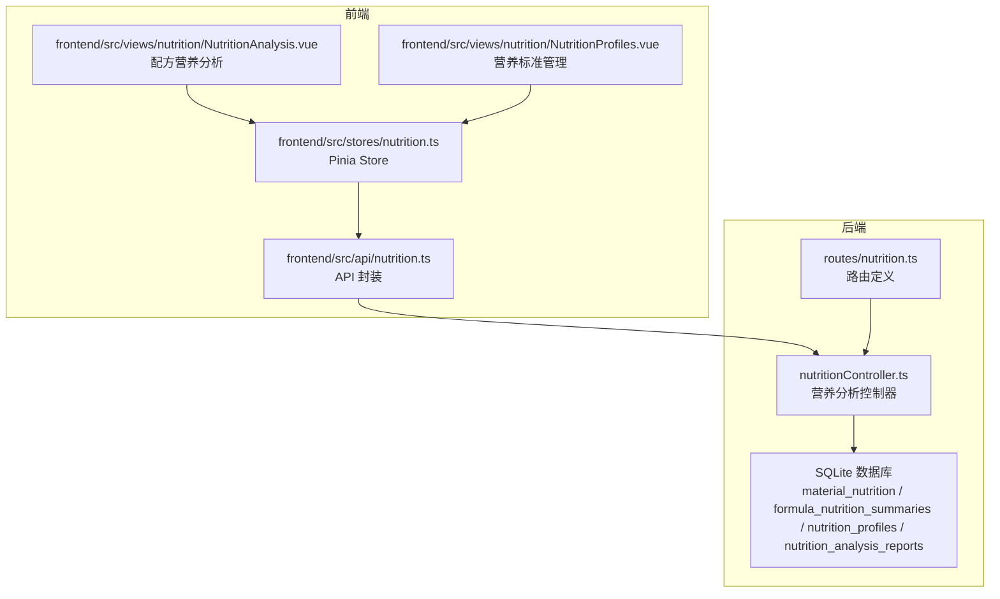
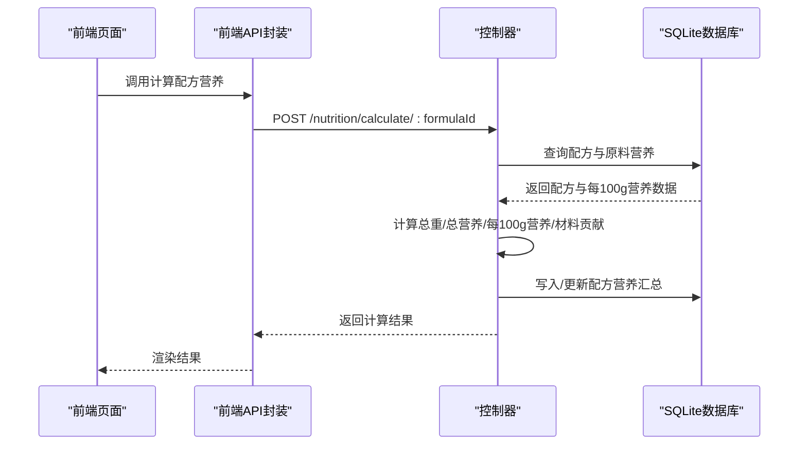
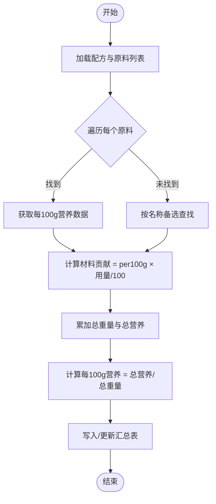
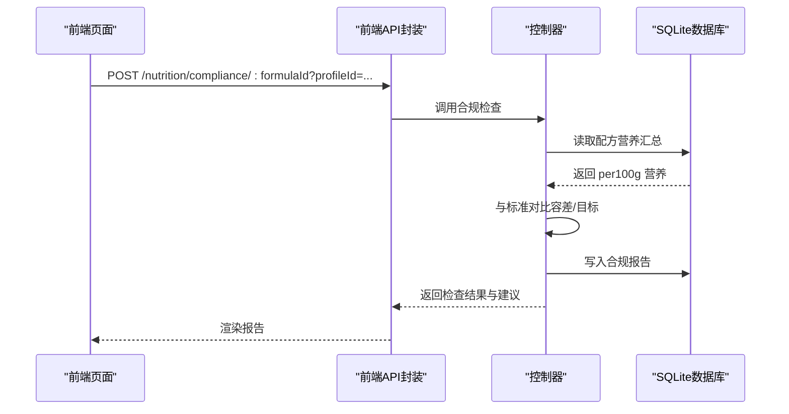
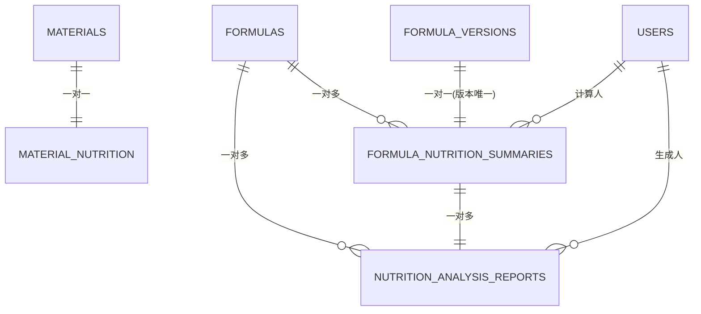

# 营养分析 API

<cite>
**本文档引用的文件**
- [nutritionController.ts](file://backend/src/controllers/nutritionController.ts)
- [nutrition.ts](file://backend/src/routes/nutrition.ts)
- [nutrition.ts](file://frontend/src/api/nutrition.ts)
- [nutrition.ts](file://frontend/src/stores/nutrition.ts)
- [NutritionAnalysis.vue](file://frontend/src/views/nutrition/NutritionAnalysis.vue)
- [NutritionProfiles.vue](file://frontend/src/views/nutrition/NutritionProfiles.vue)
- [init.sql](file://backend/src/scripts/init.sql)
- [DATABASE_DOC.md](file://backend/DATABASE_DOC.md)
- [formula.ts](file://frontend/src/types/formula.ts)
- [material.ts](file://frontend/src/types/material.ts)
</cite>

## 目录
1. [简介](#简介)
2. [项目结构](#项目结构)
3. [核心组件](#核心组件)
4. [架构总览](#架构总览)
5. [详细组件分析](#详细组件分析)
6. [依赖关系分析](#依赖关系分析)
7. [性能考虑](#性能考虑)
8. [故障排查指南](#故障排查指南)
9. [结论](#结论)
10. [附录](#附录)

## 简介
本文件为“营养分析模块”的详细 API 接口文档，覆盖以下核心能力：
- 原料营养成分管理：录入、更新每100g营养数据，支持单位后缀兼容与标准化
- 配方营养计算：基于配方中各原料的用量与每100g营养数据，计算总营养与每100g营养，并生成材料贡献明细
- 营养标准配置：维护不同人群（婴幼儿/儿童/成人/老年/孕妇/特殊）的营养目标值与容差范围
- 合规性检查：将配方每100g营养与选定标准进行对比，生成检查报告与建议
- 报表与可视化：提供与Excel一致的营养计算表格视图，支持技术处理（归零、重新计算能量）
- 前端集成：提供API封装、Pinia Store、Vue 组件与可视化展示

## 项目结构
后端采用 Express + SQLite 架构，前端使用 Vue + TDesign 组件库。营养分析模块涉及控制器、路由、API 封装、Pinia Store 以及两个核心页面组件。

图表来源
- [nutritionController.ts:1-641](file://backend/src/controllers/nutritionController.ts#L1-L641)
- [nutrition.ts:1-31](file://backend/src/routes/nutrition.ts#L1-L31)
- [init.sql:172-227](file://backend/src/scripts/init.sql#L172-L227)
- [nutrition.ts:1-38](file://frontend/src/api/nutrition.ts#L1-L38)
- [nutrition.ts:1-100](file://frontend/src/stores/nutrition.ts#L1-L100)
- [NutritionAnalysis.vue:1-262](file://frontend/src/views/nutrition/NutritionAnalysis.vue#L1-L262)
- [NutritionProfiles.vue:1-262](file://frontend/src/views/nutrition/NutritionProfiles.vue#L1-L262)

章节来源
- [nutritionController.ts:1-641](file://backend/src/controllers/nutritionController.ts#L1-L641)
- [nutrition.ts:1-31](file://backend/src/routes/nutrition.ts#L1-L31)
- [init.sql:172-227](file://backend/src/scripts/init.sql#L172-L227)

## 核心组件
- 控制器：实现原料营养查询/更新、配方营养计算、营养标准查询/创建、合规性检查、Excel报表视图等
- 路由：定义认证中间件、RESTful 接口与校验中间件
- 前端 API：对控制器接口进行封装，统一返回结构
- Pinia Store：集中管理加载状态、数据缓存与调用
- 页面组件：NutritionAnalysis.vue 展示配方分析与合规检查；NutritionProfiles.vue 管理营养标准

章节来源
- [nutritionController.ts:55-641](file://backend/src/controllers/nutritionController.ts#L55-L641)
- [nutrition.ts:13-31](file://backend/src/routes/nutrition.ts#L13-L31)
- [nutrition.ts:15-37](file://frontend/src/api/nutrition.ts#L15-L37)
- [nutrition.ts:6-99](file://frontend/src/stores/nutrition.ts#L6-L99)
- [NutritionAnalysis.vue:1-262](file://frontend/src/views/nutrition/NutritionAnalysis.vue#L1-L262)
- [NutritionProfiles.vue:1-262](file://frontend/src/views/nutrition/NutritionProfiles.vue#L1-L262)

## 架构总览
后端控制器通过数据库访问层执行 SQL 查询与更新，前端通过 API 层与控制器交互，最终在页面组件中呈现结果与建议。

图表来源
- [nutrition.ts:21-23](file://backend/src/routes/nutrition.ts#L21-L23)
- [nutritionController.ts:124-242](file://backend/src/controllers/nutritionController.ts#L124-L242)
- [init.sql:184-198](file://backend/src/scripts/init.sql#L184-L198)

## 详细组件分析

### 1) 原料营养成分管理
- 功能概述
  - 获取某原料的每100g营养数据（含单位后缀兼容与标准化）
  - 更新或新建原料的每100g营养数据，自动版本递增
- 输入参数
  - 路径参数：materialId（原料ID）
  - 请求体：per100g（每100g营养数据对象）、dataSource（数据来源）、notes（备注）
- 输出格式
  - 成功：success(true) + data（包含标准化后的 per100g）
  - 失败：success(false) + message + error
- 数据结构与标准化
  - 支持单位后缀（如 _g/_mg/_ug/_kj），自动去除并映射到标准键名
  - per100g 仅保留数值字段，缺失字段视为 0
- 版本控制
  - 更新时根据现有 data_version 生成新版本号（主版本号递增）
- 错误处理
  - 原料不存在、数据库异常、解析 JSON 失败等情况返回 4xx/5xx

章节来源
- [nutritionController.ts:55-121](file://backend/src/controllers/nutritionController.ts#L55-L121)
- [nutrition.ts:17-19](file://backend/src/routes/nutrition.ts#L17-L19)

### 2) 配方营养计算
- 功能概述
  - 基于配方中的原料列表，逐项获取每100g营养数据，按用量加权求和
  - 计算总重量、总营养、每100g营养，并生成材料贡献明细
  - 将结果写入 formula_nutrition_summaries 表
- 输入参数
  - 路径参数：formulaId（配方ID）
- 输出格式
  - 成功：success(true) + data（包含配方信息、总重量、总营养、每100g营养、材料贡献明细）
- 计算精度与规则
  - 材料贡献：每项 = per100g × (用量/100)
  - 每100g营养：Σ(贡献)/总重量（保留两位小数）
  - 占比：用量/总重量 × 100（保留两位小数）
- 容错与回退
  - 若按 materialId 无法找到营养数据，尝试按原料名称匹配
- 错误处理
  - 配方不存在、数据库异常、解析 JSON 失败等情况返回 4xx/5xx

图表来源
- [nutritionController.ts:124-242](file://backend/src/controllers/nutritionController.ts#L124-L242)

章节来源
- [nutritionController.ts:124-242](file://backend/src/controllers/nutritionController.ts#L124-L242)

### 3) 营养标准配置
- 功能概述
  - 查询营养标准列表（可按 category 过滤）
  - 创建新的营养标准（包含目标值、容差范围、必填字段）
- 输入参数
  - GET /nutrition/profiles?category=...
  - POST /nutrition/profiles（body 包含 name/description/category/targetValues/toleranceRanges/mandatoryFields）
- 输出格式
  - 列表：success(true) + data（profiles 数组）
  - 创建：success(true) + data（profileId）+ message
- 标准值与容差
  - targetValues：键为营养素字段名，值为目标值
  - toleranceRanges：数组，每项包含 field、label、min、max、alertLevel
  - mandatoryFields：必填字段列表
- 分类体系
  - category：infant/child/adult/elderly/pregnant/special

章节来源
- [nutritionController.ts:244-288](file://backend/src/controllers/nutritionController.ts#L244-L288)
- [nutrition.ts:25-27](file://backend/src/routes/nutrition.ts#L25-L27)
- [DATABASE_DOC.md:348-366](file://backend/DATABASE_DOC.md#L348-L366)

### 4) 合规性检查
- 功能概述
  - 将配方每100g营养与选定标准进行对比，生成合规检查结果与建议
  - 保存报告至 nutrition_analysis_reports 表
- 输入参数
  - 路径参数：formulaId
  - 查询参数：profileId（可选，不传则仅展示数值）
- 输出格式
  - 成功：success(true) + data（包含 reportId、complianceCheck、recommendations、summary）
- 检查逻辑
  - 遍历每100g营养字段，若实际值为 0 则跳过
  - 若提供 profile：比较容差范围与目标值，判定 pass/warning/fail
  - 生成推荐：若存在不达标项，给出高优先级安全建议；若全部达标，给出低优先级营养建议
- 报告生成
  - 保存合规检查与建议到 reports 表，包含摘要统计（总数、通过数、失败数、警告数）

图表来源
- [nutrition.ts:29-30](file://backend/src/routes/nutrition.ts#L29-L30)
- [nutritionController.ts:290-407](file://backend/src/controllers/nutritionController.ts#L290-L407)

章节来源
- [nutritionController.ts:290-407](file://backend/src/controllers/nutritionController.ts#L290-L407)

### 5) Excel 报表视图（与 XLS 一致）
- 功能概述
  - 提供与 Excel 营养标签一致的计算表格数据（含技术处理规则）
  - 包含“营养成分计算表”、“营养成分表+技术处理依据”
- 输入参数
  - 路径参数：formulaId
- 输出格式
  - 成功：success(true) + data（包含配方名、成品重量、总重量、计算行、汇总行、NRV 行、标签行、缺失营养数据的原料列表）
- 技术处理规则
  - 低于零阈值的归零（energy: ≤17 kJ；protein/fat/carbohydrate/sodium 的阈值见常量）
  - 能量重新计算：用技术处理后的蛋白质/脂肪/碳水计算（kJ）
  - NRV% 计算：每项营养素的 NRV 百分比
- 计算精度
  - 保留固定小数位（如 4 位或 2 位），四舍五入

章节来源
- [nutritionController.ts:420-640](file://backend/src/controllers/nutritionController.ts#L420-L640)
- [nutrition.ts:22-23](file://backend/src/routes/nutrition.ts#L22-L23)

### 6) 前端集成与可视化
- API 封装
  - 提供 getMaterialNutrition/setMaterialNutrition/calculateFormulaNutrition/getProfiles/createProfile/checkCompliance/getFormulaNutritionTables
- Pinia Store
  - 统一管理 loading、profiles、materialNutrition、formulaNutrition、complianceResult
  - 封装异步调用与错误处理
- 页面组件
  - NutritionAnalysis.vue：配方选择、计算、合规检查、结果展示
  - NutritionProfiles.vue：标准列表、筛选、新增、详情查看

章节来源
- [nutrition.ts:15-37](file://frontend/src/api/nutrition.ts#L15-L37)
- [nutrition.ts:6-99](file://frontend/src/stores/nutrition.ts#L6-L99)
- [NutritionAnalysis.vue:1-262](file://frontend/src/views/nutrition/NutritionAnalysis.vue#L1-L262)
- [NutritionProfiles.vue:1-262](file://frontend/src/views/nutrition/NutritionProfiles.vue#L1-L262)

## 依赖关系分析

图表来源
- [init.sql:172-227](file://backend/src/scripts/init.sql#L172-L227)
- [DATABASE_DOC.md:393-427](file://backend/DATABASE_DOC.md#L393-L427)

章节来源
- [init.sql:172-227](file://backend/src/scripts/init.sql#L172-L227)
- [DATABASE_DOC.md:393-427](file://backend/DATABASE_DOC.md#L393-L427)

## 性能考虑
- 数据库索引
  - material_nutrition(material_id)、formula_nutrition_summaries(formula_id)、nutrition_profiles(category)、nutrition_analysis_reports(formula_id)
- 批量查询
  - 在“Excel 报表视图”中批量获取原料 ratio_factor，减少多次查询
- 计算精度
  - 使用定点运算与固定小数位，避免浮点误差累积
- 缓存与去抖
  - 前端 Store 中缓存最近一次结果，避免重复请求
- 建议
  - 对于大量配方/原料场景，可在前端增加分页与懒加载
  - 对频繁使用的标准值可做内存缓存

[本节为通用性能建议，无需特定文件来源]

## 故障排查指南
- 常见错误与定位
  - “未找到该原料的营养数据”：确认原料是否存在且已录入 per100g 数据
  - “配方不存在”：确认 formulaId 正确且存在于数据库
  - “请先计算配方营养成分”：合规检查前需先执行计算接口
  - “保存营养成分失败/获取营养成分失败”：检查 JSON 结构与字段命名是否符合 per100g 标准键名
- 前端调试
  - Store 中 loading 状态与错误消息提示
  - 页面上对空状态与错误状态的友好提示
- 后端日志
  - 控制器中捕获异常并返回统一结构，便于前端展示

章节来源
- [nutritionController.ts:56-74](file://backend/src/controllers/nutritionController.ts#L56-L74)
- [nutritionController.ts:130-134](file://backend/src/controllers/nutritionController.ts#L130-L134)
- [nutritionController.ts:297-305](file://backend/src/controllers/nutritionController.ts#L297-L305)
- [nutrition.ts:188-199](file://frontend/src/views/nutrition/NutritionAnalysis.vue#L188-L199)
- [nutrition.ts:201-210](file://frontend/src/views/nutrition/NutritionAnalysis.vue#L201-L210)

## 结论
本模块提供了从“原料营养录入”到“配方营养计算”再到“标准合规检查”的完整闭环，配合前端可视化与报表视图，满足食品/营养配方研发与质量控制需求。通过标准化的 per100g 数据结构、可配置的营养标准与容差范围，以及可扩展的建议输出机制，系统具备良好的可维护性与可扩展性。

[本节为总结性内容，无需特定文件来源]

## 附录

### A. 每100g营养字段清单
- 能量、蛋白质、脂肪、碳水化合物、膳食纤维、糖类、钠、钾、钙、铁、锌、镁、磷
- 维生素A、C、D、E、K、B1、B2、B3、B6、B12、叶酸
- 胆固醇、反式脂肪、饱和脂肪

章节来源
- [nutritionController.ts:7-13](file://backend/src/controllers/nutritionController.ts#L7-L13)

### B. 营养素参考值（NRV）
- 用于 NRV% 计算与标签行展示
- 字段：energy、protein、fat、carbohydrate、sodium、potassium、calcium、iron、zinc、vitaminA、vitaminC、vitaminD、vitaminE、vitaminB1、vitaminB2、vitaminB3、vitaminB6、vitaminB12、folate、cholesterol、dietaryFiber

章节来源
- [nutritionController.ts:46-53](file://backend/src/controllers/nutritionController.ts#L46-L53)

### C. 数据模型与字段说明
- material_nutrition：per_100g_json 存放每100g营养数据
- formula_nutrition_summaries：保存配方总重量、总营养、每100g营养、材料贡献明细
- nutrition_profiles：目标值、容差范围、必填字段
- nutrition_analysis_reports：合规检查与建议

章节来源
- [DATABASE_DOC.md:273-390](file://backend/DATABASE_DOC.md#L273-L390)
- [init.sql:172-227](file://backend/src/scripts/init.sql#L172-L227)

### D. 前端类型与接口
- 原料类型：Material、MaterialForm、MaterialQuery、MaterialUsage
- 配方类型：Formula、FormulaForm、FormulaQuery、MaterialItem
- 营养 API：封装了所有营养分析相关接口
- 营养 Store：集中管理状态与调用

章节来源
- [material.ts:1-30](file://frontend/src/types/material.ts#L1-L30)
- [formula.ts:1-33](file://frontend/src/types/formula.ts#L1-L33)
- [nutrition.ts:3-13](file://frontend/src/api/nutrition.ts#L3-L13)