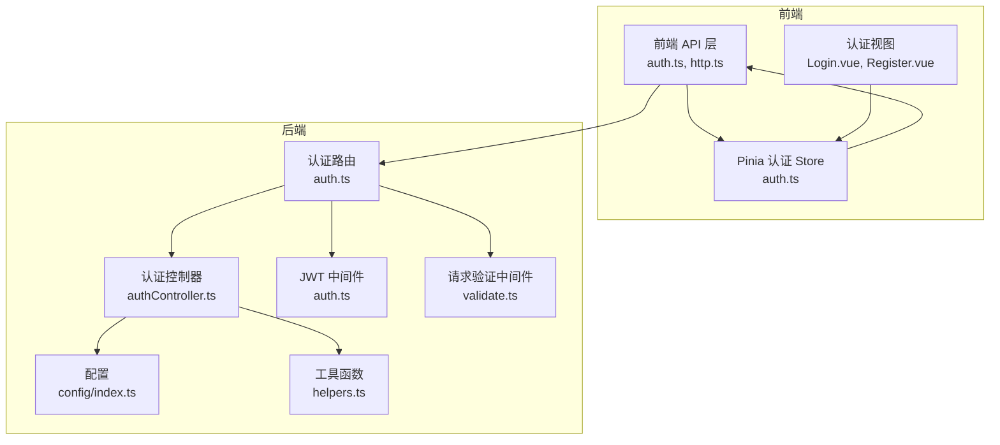
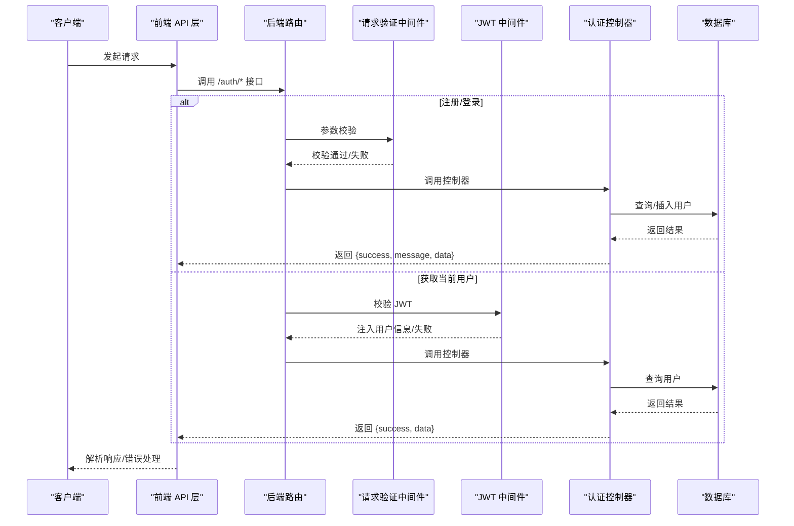
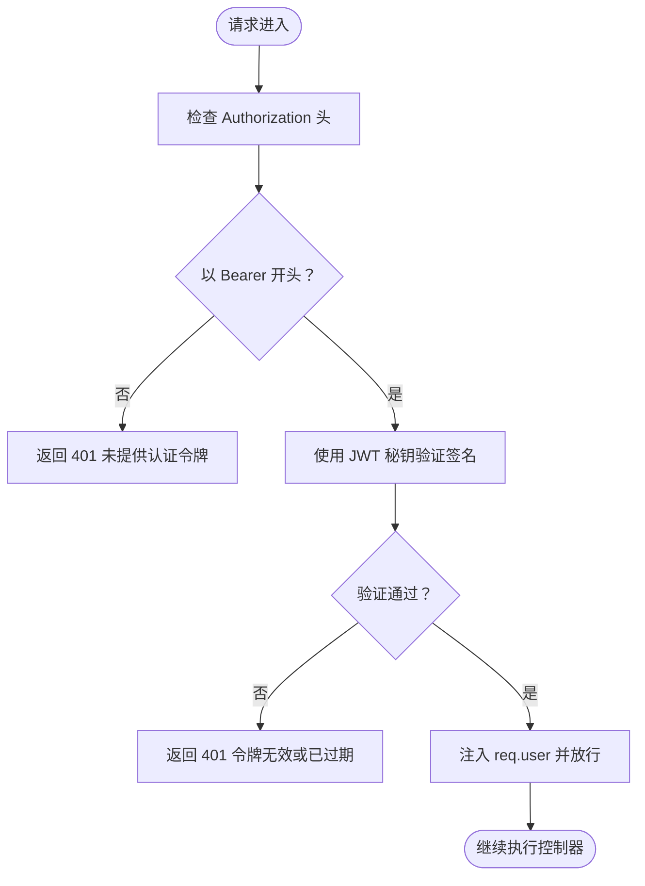
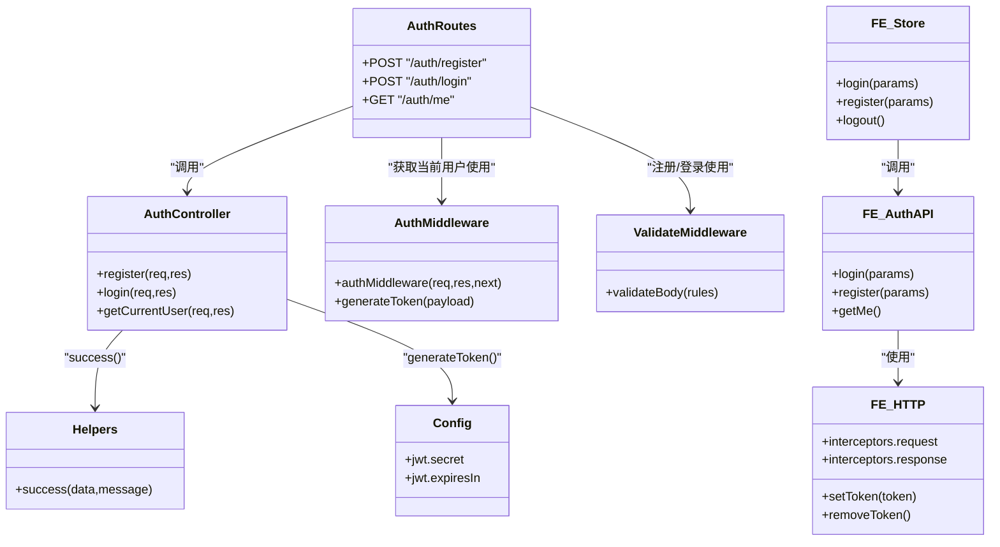

# 认证模块 API

<cite>
**本文档引用的文件**
- [backend/src/controllers/authController.ts](file://backend/src/controllers/authController.ts)
- [backend/src/routes/auth.ts](file://backend/src/routes/auth.ts)
- [backend/src/middleware/auth.ts](file://backend/src/middleware/auth.ts)
- [backend/src/middleware/validate.ts](file://backend/src/middleware/validate.ts)
- [backend/src/config/index.ts](file://backend/src/config/index.ts)
- [backend/src/utils/helpers.ts](file://backend/src/utils/helpers.ts)
- [frontend/src/api/auth.ts](file://frontend/src/api/auth.ts)
- [frontend/src/api/http.ts](file://frontend/src/api/http.ts)
- [frontend/src/stores/auth.ts](file://frontend/src/stores/auth.ts)
- [frontend/src/views/auth/Login.vue](file://frontend/src/views/auth/Login.vue)
- [frontend/src/views/auth/Register.vue](file://frontend/src/views/auth/Register.vue)
- [frontend/src/types/user.ts](file://frontend/src/types/user.ts)
</cite>

## 目录
1. [简介](#简介)
2. [项目结构](#项目结构)
3. [核心组件](#核心组件)
4. [架构总览](#架构总览)
5. [详细组件分析](#详细组件分析)
6. [依赖关系分析](#依赖关系分析)
7. [性能考虑](#性能考虑)
8. [故障排除指南](#故障排除指南)
9. [结论](#结论)
10. [附录](#附录)

## 简介
本文件为 TingStudio 认证模块的详细 API 文档，覆盖用户注册、登录、获取当前用户信息三个核心接口的完整规范。文档同时解释 JWT 认证机制的实现原理（token 生成、验证与过期处理），提供请求与响应示例、参数验证规则、业务逻辑说明，并给出前端认证状态管理与 token 存储的最佳实践。

## 项目结构
认证模块由后端控制器、路由与中间件，以及前端 API 层、状态管理与视图组成：
- 后端：控制器负责业务逻辑；路由定义接口；中间件负责 JWT 校验与请求体验证；配置提供 JWT 秘钥与过期时间；工具函数提供通用响应格式。
- 前端：API 层封装 HTTP 请求与响应拦截；Pinia Store 管理认证状态；Vue 视图负责表单校验与交互；类型定义确保前后端一致性。

图表来源
- [backend/src/controllers/authController.ts:1-89](file://backend/src/controllers/authController.ts#L1-L89)
- [backend/src/routes/auth.ts:1-20](file://backend/src/routes/auth.ts#L1-L20)
- [backend/src/middleware/auth.ts:1-38](file://backend/src/middleware/auth.ts#L1-L38)
- [backend/src/middleware/validate.ts:1-68](file://backend/src/middleware/validate.ts#L1-L68)
- [backend/src/config/index.ts:1-24](file://backend/src/config/index.ts#L1-L24)
- [backend/src/utils/helpers.ts:1-86](file://backend/src/utils/helpers.ts#L1-L86)
- [frontend/src/api/auth.ts:1-36](file://frontend/src/api/auth.ts#L1-L36)
- [frontend/src/api/http.ts:1-58](file://frontend/src/api/http.ts#L1-L58)
- [frontend/src/stores/auth.ts:1-64](file://frontend/src/stores/auth.ts#L1-L64)

章节来源
- [backend/src/controllers/authController.ts:1-89](file://backend/src/controllers/authController.ts#L1-L89)
- [backend/src/routes/auth.ts:1-20](file://backend/src/routes/auth.ts#L1-L20)
- [backend/src/middleware/auth.ts:1-38](file://backend/src/middleware/auth.ts#L1-L38)
- [backend/src/middleware/validate.ts:1-68](file://backend/src/middleware/validate.ts#L1-L68)
- [backend/src/config/index.ts:1-24](file://backend/src/config/index.ts#L1-L24)
- [backend/src/utils/helpers.ts:1-86](file://backend/src/utils/helpers.ts#L1-L86)
- [frontend/src/api/auth.ts:1-36](file://frontend/src/api/auth.ts#L1-L36)
- [frontend/src/api/http.ts:1-58](file://frontend/src/api/http.ts#L1-L58)
- [frontend/src/stores/auth.ts:1-64](file://frontend/src/stores/auth.ts#L1-L64)

## 核心组件
- 认证控制器：实现注册、登录、获取当前用户信息的业务逻辑。
- 认证路由：定义接口路径、参数校验与中间件链路。
- JWT 中间件：校验 Authorization 头中的 Bearer Token 并注入用户信息。
- 请求验证中间件：对请求体字段进行类型、长度、必填等规则校验。
- 配置：提供 JWT 秘钥与过期时间等运行时配置。
- 工具函数：统一封装成功响应格式与通用工具。
- 前端 API 层：封装 /auth/* 接口调用，处理 token 存取与错误提示。
- Pinia Store：集中管理认证状态、用户信息与登录/注册流程。
- Vue 视图：表单校验、提交与跳转。

章节来源
- [backend/src/controllers/authController.ts:8-89](file://backend/src/controllers/authController.ts#L8-L89)
- [backend/src/routes/auth.ts:9-19](file://backend/src/routes/auth.ts#L9-L19)
- [backend/src/middleware/auth.ts:13-37](file://backend/src/middleware/auth.ts#L13-L37)
- [backend/src/middleware/validate.ts:16-67](file://backend/src/middleware/validate.ts#L16-L67)
- [backend/src/config/index.ts:10-13](file://backend/src/config/index.ts#L10-L13)
- [backend/src/utils/helpers.ts:26-29](file://backend/src/utils/helpers.ts#L26-L29)
- [frontend/src/api/auth.ts:7-17](file://frontend/src/api/auth.ts#L7-L17)
- [frontend/src/stores/auth.ts:6-63](file://frontend/src/stores/auth.ts#L6-L63)

## 架构总览
认证模块采用“请求-路由-中间件-控制器-数据库”的标准 Express 流程，配合 JWT 实现无状态认证。前端通过 Axios 统一拦截器自动附加 Bearer Token，并在 401 时清理本地存储并重定向到登录页。

图表来源
- [backend/src/routes/auth.ts:9-19](file://backend/src/routes/auth.ts#L9-L19)
- [backend/src/middleware/validate.ts:16-67](file://backend/src/middleware/validate.ts#L16-L67)
- [backend/src/middleware/auth.ts:13-31](file://backend/src/middleware/auth.ts#L13-L31)
- [backend/src/controllers/authController.ts:8-89](file://backend/src/controllers/authController.ts#L8-L89)
- [frontend/src/api/http.ts:12-43](file://frontend/src/api/http.ts#L12-L43)

## 详细组件分析

### 接口规范

#### 1) 用户注册
- HTTP 方法：POST
- URL 路径：/auth/register
- 请求头：Content-Type: application/json
- 请求体参数：
  - username: string, 必填, 长度 2-50
  - password: string, 必填, 长度 ≥6
- 成功响应：
  - data.user: { id, username, role }
  - data.token: string
- 错误响应：
  - 400：参数验证失败
  - 409：用户名已存在
  - 500：服务器内部错误

章节来源
- [backend/src/routes/auth.ts:9-15](file://backend/src/routes/auth.ts#L9-L15)
- [backend/src/middleware/validate.ts:16-67](file://backend/src/middleware/validate.ts#L16-L67)
- [backend/src/controllers/authController.ts:8-39](file://backend/src/controllers/authController.ts#L8-L39)
- [backend/src/utils/helpers.ts:26-29](file://backend/src/utils/helpers.ts#L26-L29)

#### 2) 用户登录
- HTTP 方法：POST
- URL 路径：/auth/login
- 请求头：Content-Type: application/json
- 请求体参数：
  - username: string, 必填
  - password: string, 必填
- 成功响应：
  - data.user: { id, username, role, created_at }
  - data.token: string
- 错误响应：
  - 401：用户名或密码错误
  - 500：服务器内部错误

章节来源
- [backend/src/routes/auth.ts:17](file://backend/src/routes/auth.ts#L17)
- [backend/src/controllers/authController.ts:41-71](file://backend/src/controllers/authController.ts#L41-L71)
- [backend/src/utils/helpers.ts:26-29](file://backend/src/utils/helpers.ts#L26-L29)

#### 3) 获取当前用户信息
- HTTP 方法：GET
- URL 路径：/auth/me
- 请求头：Authorization: Bearer <token>
- 成功响应：
  - data: { id, username, role, created_at }
- 错误响应：
  - 401：未提供认证令牌/令牌无效或已过期
  - 404：用户不存在
  - 500：服务器内部错误

章节来源
- [backend/src/routes/auth.ts:19](file://backend/src/routes/auth.ts#L19)
- [backend/src/middleware/auth.ts:13-31](file://backend/src/middleware/auth.ts#L13-L31)
- [backend/src/controllers/authController.ts:73-88](file://backend/src/controllers/authController.ts#L73-L88)
- [backend/src/utils/helpers.ts:26-29](file://backend/src/utils/helpers.ts#L26-L29)

### JWT 认证机制
- 生成：控制器调用中间件的 generateToken，使用配置中的 secret 与 expiresIn 生成 token。
- 验证：中间件从 Authorization 头提取 Bearer token，使用相同 secret 校验并解码，将用户信息注入到 req.user。
- 过期：配置中 expiresIn 控制 token 有效期，默认 7 天；前端在 401 时自动清理本地 token 并跳转登录。

图表来源
- [backend/src/middleware/auth.ts:13-31](file://backend/src/middleware/auth.ts#L13-L31)
- [backend/src/config/index.ts:10-13](file://backend/src/config/index.ts#L10-L13)

章节来源
- [backend/src/middleware/auth.ts:33-37](file://backend/src/middleware/auth.ts#L33-L37)
- [backend/src/config/index.ts:10-13](file://backend/src/config/index.ts#L10-L13)

### 参数验证规则
- 注册接口：
  - username：必填，字符串，长度 2-50
  - password：必填，字符串，长度 ≥6
- 登录接口：
  - username：必填
  - password：必填
- 响应格式：
  - 统一使用 { success: boolean, message: string, data?: any } 结构，便于前端统一处理。

章节来源
- [backend/src/routes/auth.ts:10-14](file://backend/src/routes/auth.ts#L10-L14)
- [backend/src/middleware/validate.ts:16-67](file://backend/src/middleware/validate.ts#L16-L67)
- [backend/src/utils/helpers.ts:26-29](file://backend/src/utils/helpers.ts#L26-L29)

### 业务逻辑说明
- 注册：
  - 检查用户名是否已存在
  - 使用 bcrypt 对密码加盐哈希
  - 插入新用户（默认角色为 formulist）
  - 生成 token 并返回用户信息与 token
- 登录：
  - 根据用户名查询用户
  - 使用 bcrypt 校验密码
  - 生成 token 并返回用户信息与 token
- 获取当前用户：
  - 通过中间件注入的用户 ID 查询用户
  - 返回用户基本信息

章节来源
- [backend/src/controllers/authController.ts:8-39](file://backend/src/controllers/authController.ts#L8-L39)
- [backend/src/controllers/authController.ts:41-71](file://backend/src/controllers/authController.ts#L41-L71)
- [backend/src/controllers/authController.ts:73-88](file://backend/src/controllers/authController.ts#L73-L88)

### 前端集成与最佳实践

#### 前端 API 层
- 提供 login、register、getMe 三个方法，返回统一结构的数据。
- saveAuthData：保存 token 与用户信息到 localStorage。
- clearAuthData：清除认证信息。
- getCachedUser：从 localStorage 读取缓存的用户信息。

章节来源
- [frontend/src/api/auth.ts:7-17](file://frontend/src/api/auth.ts#L7-L17)
- [frontend/src/api/auth.ts:19-35](file://frontend/src/api/auth.ts#L19-L35)

#### Pinia 认证 Store
- 状态：user、loading、isAuthenticated
- 方法：initAuth、login、register、logout
- 自动初始化：从 localStorage 读取缓存用户信息
- 登录/注册成功后保存 token 与用户信息

章节来源
- [frontend/src/stores/auth.ts:6-63](file://frontend/src/stores/auth.ts#L6-L63)

#### HTTP 拦截器
- 请求拦截：自动附加 Authorization: Bearer token
- 响应拦截：统一错误处理；401 时清理本地存储并跳转登录页
- 超时与基础路径：超时 15000ms，baseURL 为 /api

章节来源
- [frontend/src/api/http.ts:6-19](file://frontend/src/api/http.ts#L6-L19)
- [frontend/src/api/http.ts:21-43](file://frontend/src/api/http.ts#L21-L43)

#### Vue 视图层
- 登录页：表单校验（用户名≥3，密码≥6），提交后调用 store.login
- 注册页：表单校验（用户名 3-20，密码≥6，确认密码一致），提交后调用 store.register

章节来源
- [frontend/src/views/auth/Login.vue:259-273](file://frontend/src/views/auth/Login.vue#L259-L273)
- [frontend/src/views/auth/Register.vue:174-188](file://frontend/src/views/auth/Register.vue#L174-L188)

#### 认证状态管理与 token 存储指南
- 存储位置：localStorage
- 键名：
  - tingstudio_token：存放 JWT
  - tingstudio_user：存放用户信息 JSON
- 生命周期：
  - 登录/注册成功后写入
  - 退出登录时清除
  - 401 时自动清理并跳转登录页
- 建议：
  - 在生产环境使用 HttpOnly Cookie 存储 token（需后端支持）
  - 设置合理的过期时间与刷新策略
  - 在页面加载时优先从 localStorage 初始化认证状态

章节来源
- [frontend/src/api/http.ts:45-55](file://frontend/src/api/http.ts#L45-L55)
- [frontend/src/api/auth.ts:19-35](file://frontend/src/api/auth.ts#L19-L35)
- [frontend/src/stores/auth.ts:6-17](file://frontend/src/stores/auth.ts#L6-L17)

## 依赖关系分析

图表来源
- [backend/src/controllers/authController.ts:1-89](file://backend/src/controllers/authController.ts#L1-L89)
- [backend/src/routes/auth.ts:1-20](file://backend/src/routes/auth.ts#L1-L20)
- [backend/src/middleware/auth.ts:1-38](file://backend/src/middleware/auth.ts#L1-L38)
- [backend/src/middleware/validate.ts:1-68](file://backend/src/middleware/validate.ts#L1-L68)
- [backend/src/config/index.ts:1-24](file://backend/src/config/index.ts#L1-L24)
- [backend/src/utils/helpers.ts:1-86](file://backend/src/utils/helpers.ts#L1-L86)
- [frontend/src/api/http.ts:1-58](file://frontend/src/api/http.ts#L1-L58)
- [frontend/src/api/auth.ts:1-36](file://frontend/src/api/auth.ts#L1-L36)
- [frontend/src/stores/auth.ts:1-64](file://frontend/src/stores/auth.ts#L1-L64)

章节来源
- [backend/src/controllers/authController.ts:1-89](file://backend/src/controllers/authController.ts#L1-L89)
- [backend/src/routes/auth.ts:1-20](file://backend/src/routes/auth.ts#L1-L20)
- [backend/src/middleware/auth.ts:1-38](file://backend/src/middleware/auth.ts#L1-L38)
- [backend/src/middleware/validate.ts:1-68](file://backend/src/middleware/validate.ts#L1-L68)
- [backend/src/config/index.ts:1-24](file://backend/src/config/index.ts#L1-L24)
- [backend/src/utils/helpers.ts:1-86](file://backend/src/utils/helpers.ts#L1-L86)
- [frontend/src/api/http.ts:1-58](file://frontend/src/api/http.ts#L1-L58)
- [frontend/src/api/auth.ts:1-36](file://frontend/src/api/auth.ts#L1-L36)
- [frontend/src/stores/auth.ts:1-64](file://frontend/src/stores/auth.ts#L1-L64)

## 性能考虑
- 密码哈希成本：bcrypt 默认成本为 10，平衡安全性与性能；如需更高安全等级可适当提升成本，但需评估 CPU 与延迟。
- 数据库查询：用户名唯一性检查与用户查询均为 O(1) 或基于索引的 O(log n)，建议在 username 上建立唯一索引。
- JWT 过期：合理设置 expiresIn，避免过短导致频繁登录，过长增加泄露风险。
- 前端缓存：localStorage 读写开销极低，建议在应用启动时初始化认证状态。

## 故障排除指南
- 400 参数验证失败：
  - 检查请求体字段类型与长度是否满足要求
  - 参考注册接口的 username 与 password 规则
- 401 未提供认证令牌/令牌无效或已过期：
  - 确认请求头 Authorization 是否为 Bearer token
  - 检查本地 localStorage 中是否存在 token
  - 前端在 401 时会自动清理 token 并跳转登录页
- 409 用户名已存在：
  - 更换用户名或引导用户直接登录
- 404 用户不存在：
  - 检查用户 ID 是否正确，或重新登录

章节来源
- [backend/src/middleware/validate.ts:16-67](file://backend/src/middleware/validate.ts#L16-L67)
- [backend/src/middleware/auth.ts:13-31](file://backend/src/middleware/auth.ts#L13-L31)
- [frontend/src/api/http.ts:31-43](file://frontend/src/api/http.ts#L31-L43)

## 结论
本认证模块通过清晰的路由与中间件设计、严格的参数验证与统一响应格式，结合前端的拦截器与状态管理，实现了稳定可靠的用户注册、登录与当前用户信息获取能力。JWT 机制提供了无状态认证能力，配合合理的过期策略与前端自动清理，保障了用户体验与安全性。

## 附录

### 请求与响应示例（路径参考）
- 注册请求示例：POST /auth/register
  - 请求体：{ username, password }
  - 成功响应：{ success: true, message, data: { user, token } }
  - 参考路径：[backend/src/routes/auth.ts:9-15](file://backend/src/routes/auth.ts#L9-L15), [backend/src/controllers/authController.ts:8-39](file://backend/src/controllers/authController.ts#L8-L39)
- 登录请求示例：POST /auth/login
  - 请求体：{ username, password }
  - 成功响应：{ success: true, message, data: { user, token } }
  - 参考路径：[backend/src/routes/auth.ts:17](file://backend/src/routes/auth.ts#L17), [backend/src/controllers/authController.ts:41-71](file://backend/src/controllers/authController.ts#L41-L71)
- 获取当前用户请求示例：GET /auth/me
  - 请求头：Authorization: Bearer <token>
  - 成功响应：{ success: true, data }
  - 参考路径：[backend/src/routes/auth.ts:19](file://backend/src/routes/auth.ts#L19), [backend/src/middleware/auth.ts:13-31](file://backend/src/middleware/auth.ts#L13-L31), [backend/src/controllers/authController.ts:73-88](file://backend/src/controllers/authController.ts#L73-L88)

### 安全最佳实践
- 使用 HTTPS 传输，防止 token 泄露
- 后端配置 JWT 秘钥与过期时间，避免硬编码在代码中
- 生产环境建议使用 HttpOnly Cookie 存储 token，前端通过 SameSite 策略防范 CSRF
- 定期轮换 JWT 秘钥，监控异常登录行为
- 对敏感操作增加二次验证或 MFA