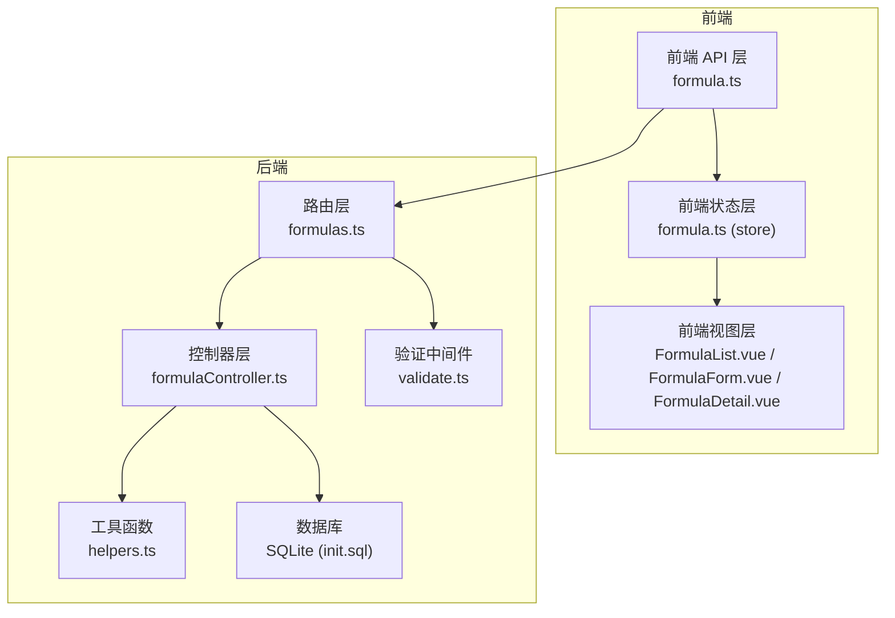
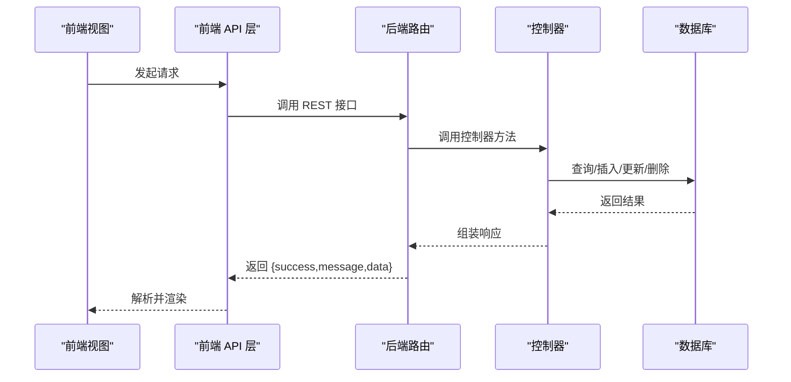
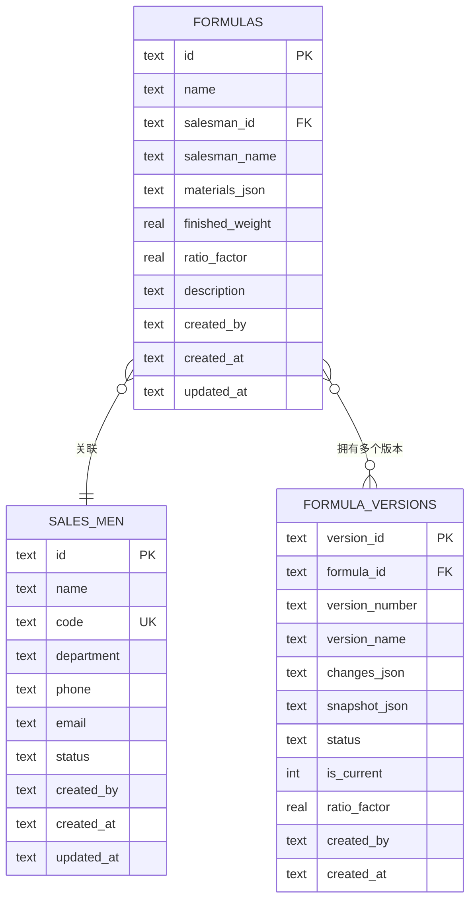
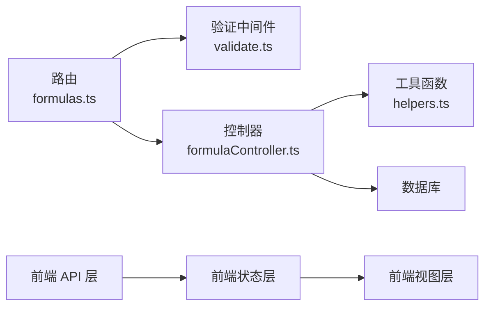

# 配方管理 API

<cite>
**本文引用的文件**
- [backend/src/controllers/formulaController.ts](file://backend/src/controllers/formulaController.ts)
- [backend/src/routes/formulas.ts](file://backend/src/routes/formulas.ts)
- [backend/src/middleware/validate.ts](file://backend/src/middleware/validate.ts)
- [backend/src/utils/helpers.ts](file://backend/src/utils/helpers.ts)
- [backend/src/scripts/init.sql](file://backend/src/scripts/init.sql)
- [backend/src/scripts/migrate-ratio-factor.ts](file://backend/src/scripts/migrate-ratio-factor.ts)
- [backend/src/scripts/migrate-ratio-factor.cjs](file://backend/src/scripts/migrate-ratio-factor.cjs)
- [frontend/src/api/formula.ts](file://frontend/src/api/formula.ts)
- [frontend/src/stores/formula.ts](file://frontend/src/stores/formula.ts)
- [frontend/src/types/formula.ts](file://frontend/src/types/formula.ts)
- [frontend/src/views/formulas/FormulaList.vue](file://frontend/src/views/formulas/FormulaList.vue)
- [frontend/src/views/formulas/FormulaForm.vue](file://frontend/src/views/formulas/FormulaForm.vue)
- [frontend/src/views/formulas/FormulaDetail.vue](file://frontend/src/views/formulas/FormulaDetail.vue)
</cite>

## 更新摘要
**变更内容**
- 新增 ratioFactor 参数支持，用于营养成分含量比计算
- 数据库表结构更新，新增 ratio_factor 字段
- 前端表单支持 ratioFactor 输入和显示
- 版本控制系统同步更新 ratio_factor 字段

## 目录
1. [简介](#简介)
2. [项目结构](#项目结构)
3. [核心组件](#核心组件)
4. [架构总览](#架构总览)
5. [详细组件分析](#详细组件分析)
6. [依赖分析](#依赖分析)
7. [性能考虑](#性能考虑)
8. [故障排查指南](#故障排查指南)
9. [结论](#结论)
10. [附录](#附录)

## 简介
本文件为配方管理模块的完整 API 接口文档，覆盖配方的全生命周期管理：列表查询、详情获取、创建、更新、删除以及按原料查找配方。文档详细说明配方数据结构、原料配置格式、业务员关联关系、版本自动创建机制，以及新增的 ratioFactor 参数支持。包含每个接口的参数说明、响应格式与业务逻辑解释，以及配方 JSON 数据结构解析规则与前端数据绑定最佳实践。

## 项目结构
配方管理模块由后端控制器与路由、前端 API 层与状态管理、以及视图层组成，形成清晰的分层架构：
- 后端：控制器负责业务逻辑与数据库交互；路由定义 REST 接口；验证中间件保障请求参数合法性；工具函数提供通用能力。
- 前端：API 层封装 HTTP 请求；Pinia Store 管理状态与数据；Vue 组件承载视图与交互。

**图表来源**
- [backend/src/routes/formulas.ts:1-28](file://backend/src/routes/formulas.ts#L1-L28)
- [backend/src/controllers/formulaController.ts:1-290](file://backend/src/controllers/formulaController.ts#L1-L290)
- [backend/src/middleware/validate.ts:1-68](file://backend/src/middleware/validate.ts#L1-L68)
- [backend/src/utils/helpers.ts:1-86](file://backend/src/utils/helpers.ts#L1-L86)
- [backend/src/scripts/init.sql:33-92](file://backend/src/scripts/init.sql#L33-L92)
- [frontend/src/api/formula.ts:1-67](file://frontend/src/api/formula.ts#L1-L67)
- [frontend/src/stores/formula.ts:1-166](file://frontend/src/stores/formula.ts#L1-L166)
- [frontend/src/views/formulas/FormulaList.vue:1-741](file://frontend/src/views/formulas/FormulaList.vue#L1-L741)
- [frontend/src/views/formulas/FormulaForm.vue:1-368](file://frontend/src/views/formulas/FormulaForm.vue#L1-L368)
- [frontend/src/views/formulas/FormulaDetail.vue:1-302](file://frontend/src/views/formulas/FormulaDetail.vue#L1-L302)

**章节来源**
- [backend/src/routes/formulas.ts:1-28](file://backend/src/routes/formulas.ts#L1-L28)
- [backend/src/controllers/formulaController.ts:1-290](file://backend/src/controllers/formulaController.ts#L1-L290)
- [backend/src/scripts/init.sql:33-92](file://backend/src/scripts/init.sql#L33-L92)
- [frontend/src/api/formula.ts:1-67](file://frontend/src/api/formula.ts#L1-L67)
- [frontend/src/stores/formula.ts:1-166](file://frontend/src/stores/formula.ts#L1-L166)
- [frontend/src/views/formulas/FormulaList.vue:1-741](file://frontend/src/views/formulas/FormulaList.vue#L1-L741)
- [frontend/src/views/formulas/FormulaForm.vue:1-368](file://frontend/src/views/formulas/FormulaForm.vue#L1-L368)
- [frontend/src/views/formulas/FormulaDetail.vue:1-302](file://frontend/src/views/formulas/FormulaDetail.vue#L1-L302)

## 核心组件
- 后端控制器：实现配方 CRUD、按原料查询、版本自动创建与变更记录构建等核心逻辑，支持 ratioFactor 参数。
- 路由与验证：定义 REST 接口并进行请求体字段校验。
- 工具函数：提供分页、时间戳、ID 生成、JSON 安全解析等通用能力。
- 前端 API 与状态：封装 HTTP 请求、解析 JSON 字段、管理分页与加载状态。
- 视图层：展示配方列表、表单、详情与版本变更记录，支持业务员筛选与全局搜索联动。

**章节来源**
- [backend/src/controllers/formulaController.ts:1-290](file://backend/src/controllers/formulaController.ts#L1-L290)
- [backend/src/routes/formulas.ts:1-28](file://backend/src/routes/formulas.ts#L1-L28)
- [backend/src/middleware/validate.ts:1-68](file://backend/src/middleware/validate.ts#L1-L68)
- [backend/src/utils/helpers.ts:1-86](file://backend/src/utils/helpers.ts#L1-L86)
- [frontend/src/api/formula.ts:1-67](file://frontend/src/api/formula.ts#L1-L67)
- [frontend/src/stores/formula.ts:1-166](file://frontend/src/stores/formula.ts#L1-L166)

## 架构总览
配方管理的前后端交互遵循标准的 MVC 模式：
- 前端通过 API 层发起请求，经路由与验证中间件进入控制器。
- 控制器执行业务逻辑（如版本创建、变更记录构建），并与数据库交互。
- 响应统一包装为 { success, message, data } 结构，前端 Store 解析并渲染视图。

**图表来源**
- [backend/src/routes/formulas.ts:14-27](file://backend/src/routes/formulas.ts#L14-L27)
- [backend/src/controllers/formulaController.ts:6-69](file://backend/src/controllers/formulaController.ts#L6-L69)
- [frontend/src/api/formula.ts:45-64](file://frontend/src/api/formula.ts#L45-L64)

## 详细组件分析

### 数据模型与数据库结构
配方与版本的数据模型由 SQLite 初始化脚本定义，关键表如下：
- formulas：存储配方基本信息与关联业务员，materials_json 存放原料配置的 JSON，ratio_factor 存放含量比系数。
- formula_versions：存储配方版本历史，包含版本号、快照、变更记录与状态，以及 ratio_factor 字段。
- salesmen：业务员表，用于关联业务员信息。

**图表来源**
- [backend/src/scripts/init.sql:33-92](file://backend/src/scripts/init.sql#L33-L92)

**章节来源**
- [backend/src/scripts/init.sql:33-92](file://backend/src/scripts/init.sql#L33-L92)

### 接口定义与业务逻辑

#### 列表查询
- 方法与路径：GET /formulas
- 功能：分页查询配方列表，支持关键词（配方名/业务员名）与业务员筛选；管理员可见全部，普通用户仅见自己创建的。
- 参数：
  - keyword：可选，模糊匹配配方名或业务员名
  - salesmanId：可选，按业务员筛选
  - page/pageSize：可选，分页参数
- 响应：包含 list 与 pagination 的分页结果，每个配方对象附加 versions 数组（按时间倒序取最新版本信息）。
- 业务逻辑：
  - 根据用户角色动态拼接查询条件
  - 对每个配方批量查询其版本信息并合并到返回数据
  - 分页参数安全处理，最小 1，最大 100
- 错误处理：内部错误返回 500

**章节来源**
- [backend/src/controllers/formulaController.ts:6-69](file://backend/src/controllers/formulaController.ts#L6-L69)
- [backend/src/utils/helpers.ts:13-19](file://backend/src/utils/helpers.ts#L13-L19)

#### 详情获取
- 方法与路径：GET /formulas/:id
- 功能：获取指定配方详情
- 参数：id（路径参数）
- 响应：配方对象（含解析后的 materials 与 description）
- 业务逻辑：查不到则返回 404
- 错误处理：内部错误返回 500

**章节来源**
- [backend/src/controllers/formulaController.ts:71-86](file://backend/src/controllers/formulaController.ts#L71-L86)

#### 创建配方
- 方法与路径：POST /formulas
- 功能：创建新配方并自动创建初始版本
- 请求体验证规则：
  - name：必填，字符串，长度≥1
  - salesmanId：必填，字符串，需存在
  - materials：必填，数组，至少一项
  - finishedWeight：必填，数值
  - ratioFactor：可选，数值，默认 0.18
- 请求体字段：
  - name：配方名称
  - salesmanId：业务员 ID
  - materials：原料数组，元素包含 materialId、materialName（可选）、quantity（数值）
  - finishedWeight：成品重量
  - ratioFactor：含量比系数，默认 0.18（辅料配方为 1.0，药材配方为 0.18）
  - description：可选描述（支持 JSON 或纯文本）
- 响应：返回新建配方对象
- 业务逻辑：
  - 校验业务员是否存在
  - 将请求中的原料简化为 {materialId, materialName, quantity} 写入 materials_json
  - 自动创建初始版本（version_number='v1.0'，status='published'，is_current=1）
  - 版本快照包含 name、salesmanId、salesmanName、materials、finishedWeight、ratioFactor、description、formulaData
- 错误处理：参数校验失败返回 400；内部错误返回 500

**更新** 新增 ratioFactor 参数支持，用于营养成分含量比计算

**章节来源**
- [backend/src/routes/formulas.ts:16-24](file://backend/src/routes/formulas.ts#L16-L24)
- [backend/src/middleware/validate.ts:16-67](file://backend/src/middleware/validate.ts#L16-L67)
- [backend/src/controllers/formulaController.ts:88-130](file://backend/src/controllers/formulaController.ts#L88-L130)

#### 更新配方
- 方法与路径：PUT /formulas/:id
- 功能：更新配方信息；当 materials 变更时自动创建新版本
- 参数：id（路径参数）
- 请求体字段（可选）：name、salesmanId、materials、finishedWeight、ratioFactor、description
- 业务逻辑：
  - 若 salesmanId 变更，重新查询业务员名称
  - 若 materials 变更：将旧版本标记为非当前，计算新版本号（基于最新版本号递增小数点后一位），构建变更记录（新增/修改/删除），创建新版本（status='draft'，is_current=1）
  - 若未变更 materials，仅更新配方信息
- 响应：返回更新后的配方对象
- 错误处理：配方不存在返回 404；内部错误返回 500

**更新** 新增 ratioFactor 参数支持，用于营养成分含量比计算

**章节来源**
- [backend/src/controllers/formulaController.ts:132-218](file://backend/src/controllers/formulaController.ts#L132-L218)
- [backend/src/controllers/formulaController.ts:245-286](file://backend/src/controllers/formulaController.ts#L245-L286)

#### 删除配方
- 方法与路径：DELETE /formulas/:id
- 功能：删除指定配方
- 参数：id（路径参数）
- 业务逻辑：直接删除配方记录
- 错误处理：内部错误返回 500

**章节来源**
- [backend/src/controllers/formulaController.ts:220-229](file://backend/src/controllers/formulaController.ts#L220-L229)

#### 按原料查找配方
- 方法与路径：GET /formulas/by-material/:materialId
- 功能：根据原料 ID 查询使用该原料的所有配方
- 参数：materialId（路径参数）
- 业务逻辑：在 materials_json 中模糊匹配包含该 materialId 的配方
- 响应：配方数组
- 错误处理：内部错误返回 500

**章节来源**
- [backend/src/controllers/formulaController.ts:231-243](file://backend/src/controllers/formulaController.ts#L231-L243)

### 原料配置格式与验证
- 原料配置格式（materials）：
  - 每个元素包含：materialId（必填）、materialName（可选，用于显示与快照）、quantity（必填，数值）
  - 写入数据库前会标准化为 {materialId, materialName, quantity}
- 前端表单验证：
  - 至少添加一种原料
  - 每个原料必须选择 materialId 且 quantity > 0
- 前端解析与绑定：
  - Store 在获取数据后解析 materialsJson 为数组，description 支持 JSON 或纯文本
  - 视图层对变更记录进行 JSON 解析与展示

**章节来源**
- [frontend/src/api/formula.ts:3-43](file://frontend/src/api/formula.ts#L3-L43)
- [frontend/src/stores/formula.ts:136-165](file://frontend/src/stores/formula.ts#L136-L165)
- [frontend/src/views/formulas/FormulaForm.vue:199-219](file://frontend/src/views/formulas/FormulaForm.vue#L199-L219)

### 业务员关联关系
- 配方与业务员通过 salesman_id 关联，创建时必须存在对应业务员；更新时若更换业务员需重新查询业务员名称写入 salesman_name。
- 列表查询支持按 salesmanId 过滤。

**章节来源**
- [backend/src/controllers/formulaController.ts:95-100](file://backend/src/controllers/formulaController.ts#L95-L100)
- [backend/src/controllers/formulaController.ts:146-154](file://backend/src/controllers/formulaController.ts#L146-L154)
- [backend/src/scripts/init.sql:45-46](file://backend/src/scripts/init.sql#L45-L46)

### 版本自动创建机制
- 创建配方时自动创建初始版本（version_number='v1.0'，status='published'，is_current=1）
- 更新配方且 materials 变更时：
  - 将旧版本标记为非当前
  - 新版本号基于最新版本号递增（如 v1.0 -> v1.1）
  - 构建变更记录（新增/修改/删除），快照包含当前配方数据
- 前端视图层展示版本列表与变更详情，支持展开查看变更明细。

**章节来源**
- [backend/src/controllers/formulaController.ts:113-123](file://backend/src/controllers/formulaController.ts#L113-L123)
- [backend/src/controllers/formulaController.ts:167-211](file://backend/src/controllers/formulaController.ts#L167-L211)
- [frontend/src/views/formulas/FormulaList.vue:218-229](file://frontend/src/views/formulas/FormulaList.vue#L218-L229)

### ratioFactor 参数支持
- 参数定义：ratioFactor（含量比系数），用于营养成分含量比计算
- 默认值：0.18（药材配方），1.0（辅料配方）
- 数据库字段：ratio_factor，存储在 formulas 和 formula_versions 表中
- 前端表单：支持输入 0-2 之间的数值，精度到小数点后三位
- 业务逻辑：根据配方中是否包含辅料自动设置默认值，用户可手动调整

**新增** ratioFactor 参数支持，用于营养成分含量比计算

**章节来源**
- [backend/src/controllers/formulaController.ts:91-110](file://backend/src/controllers/formulaController.ts#L91-L110)
- [backend/src/controllers/formulaController.ts:136-166](file://backend/src/controllers/formulaController.ts#L136-L166)
- [backend/src/scripts/migrate-ratio-factor.ts:45-53](file://backend/src/scripts/migrate-ratio-factor.ts#L45-L53)
- [backend/src/scripts/migrate-ratio-factor.ts:92-104](file://backend/src/scripts/migrate-ratio-factor.ts#L92-L104)
- [frontend/src/views/formulas/FormulaForm.vue:57-67](file://frontend/src/views/formulas/FormulaForm.vue#L57-L67)
- [frontend/src/views/formulas/FormulaForm.vue:207-208](file://frontend/src/views/formulas/FormulaForm.vue#L207-L208)

### 删除保护机制
- 当前实现为直接删除配方记录，未在控制器中显式设置外键级联删除策略。
- 数据库层面，formula_versions 的外键删除策略为 CASCADE，删除配方会级联删除其版本；salesmen 的外键删除策略为 RESTRICT，删除业务员前需解除关联。

**章节来源**
- [backend/src/scripts/init.sql:45-46](file://backend/src/scripts/init.sql#L45-L46)
- [backend/src/scripts/init.sql:88-89](file://backend/src/scripts/init.sql#L88-L89)

### 前端数据绑定最佳实践
- Store 层统一解析 JSON 字段（materialsJson、description），并格式化时间戳，避免视图层重复解析。
- 列表视图支持展开行展示版本与变更详情，点击"查看变更"切换展开状态。
- 表单视图对原料进行远程搜索与本地过滤，确保用户体验与性能平衡。
- 列表支持全局搜索事件联动，便于跨页面搜索。
- ratioFactor 字段在表单中默认显示 0.18，支持用户自定义调整。

**更新** 新增 ratioFactor 字段的前端显示和绑定

**章节来源**
- [frontend/src/stores/formula.ts:18-62](file://frontend/src/stores/formula.ts#L18-L62)
- [frontend/src/views/formulas/FormulaList.vue:14-95](file://frontend/src/views/formulas/FormulaList.vue#L14-L95)
- [frontend/src/views/formulas/FormulaForm.vue:179-252](file://frontend/src/views/formulas/FormulaForm.vue#L179-L252)
- [frontend/src/views/formulas/FormulaForm.vue:57-67](file://frontend/src/views/formulas/FormulaForm.vue#L57-L67)

## 依赖分析
- 控制器依赖：
  - 数据库查询（query）
  - 工具函数（generateId、now、success、successWithPagination、buildPagination、buildLike、rowToCamelCase、rowsToCamelCase）
  - 验证中间件（validateBody）
- 路由依赖：
  - 认证中间件（authMiddleware）
  - 控制器方法
- 前端依赖：
  - API 层封装 HTTP 请求
  - Pinia Store 管理状态
  - Vue 组件承载视图与交互

**图表来源**
- [backend/src/routes/formulas.ts:1-28](file://backend/src/routes/formulas.ts#L1-L28)
- [backend/src/controllers/formulaController.ts:1-6](file://backend/src/controllers/formulaController.ts#L1-L6)
- [backend/src/middleware/validate.ts:1-68](file://backend/src/middleware/validate.ts#L1-L68)
- [backend/src/utils/helpers.ts:1-86](file://backend/src/utils/helpers.ts#L1-L86)
- [frontend/src/api/formula.ts:1-67](file://frontend/src/api/formula.ts#L1-L67)
- [frontend/src/stores/formula.ts:1-166](file://frontend/src/stores/formula.ts#L1-L166)

**章节来源**
- [backend/src/controllers/formulaController.ts:1-6](file://backend/src/controllers/formulaController.ts#L1-L6)
- [backend/src/routes/formulas.ts:1-28](file://backend/src/routes/formulas.ts#L1-L28)
- [frontend/src/api/formula.ts:1-67](file://frontend/src/api/formula.ts#L1-L67)
- [frontend/src/stores/formula.ts:1-166](file://frontend/src/stores/formula.ts#L1-L166)

## 性能考虑
- 列表查询：
  - 使用分页参数限制每页数量（默认 20，最大 100）
  - 对 formulas 与 formula_versions 建立索引，提升查询效率
- 批量版本查询：
  - 通过 IN 查询批量获取版本，减少多次往返
- JSON 解析：
  - 前端 Store 统一解析 materialsJson，避免重复解析
- 原料搜索：
  - 前端对搜索结果进行本地过滤，减少网络请求
- ratioFactor 字段：
  - 数据库中为数值型字段，查询性能良好
  - 前端表单支持范围限制，避免无效数据

**更新** 新增 ratioFactor 字段的性能考虑

**章节来源**
- [backend/src/utils/helpers.ts:13-19](file://backend/src/utils/helpers.ts#L13-L19)
- [backend/src/scripts/init.sql:47-91](file://backend/src/scripts/init.sql#L47-L91)
- [frontend/src/stores/formula.ts:136-144](file://frontend/src/stores/formula.ts#L136-L144)

## 故障排查指南
- 参数校验失败：
  - 检查请求体字段类型与必填项是否满足验证规则
  - 查看响应中的错误数组定位具体字段
- 业务员不存在：
  - 确认 salesmanId 是否存在于 salesmen 表
- 配方不存在：
  - 确认 id 是否正确，或是否已被删除
- 删除失败：
  - 检查是否有外键约束导致删除失败（如被其他表引用）
- 版本变更异常：
  - 检查 materials 是否发生变更，确认版本号递增逻辑是否符合预期
- ratioFactor 异常：
  - 检查数据库中 ratio_factor 字段是否存在且为数值类型
  - 确认前端表单输入范围是否在 0-2 之间

**更新** 新增 ratioFactor 相关的故障排查

**章节来源**
- [backend/src/middleware/validate.ts:16-67](file://backend/src/middleware/validate.ts#L16-L67)
- [backend/src/controllers/formulaController.ts:95-100](file://backend/src/controllers/formulaController.ts#L95-L100)
- [backend/src/controllers/formulaController.ts:140-144](file://backend/src/controllers/formulaController.ts#L140-L144)
- [backend/src/controllers/formulaController.ts:245-286](file://backend/src/controllers/formulaController.ts#L245-L286)

## 结论
配方管理模块提供了完善的配方生命周期管理能力，涵盖列表查询、详情获取、创建、更新、删除与按原料查找。系统采用前后端分离架构，后端通过严格的参数验证与版本自动创建机制保证数据一致性，前端通过 Store 统一解析与视图层扩展展示增强用户体验。新增的 ratioFactor 参数支持进一步增强了系统的功能性，为营养成分计算提供了基础。建议在后续迭代中完善删除保护与版本状态管理，以进一步提升系统的健壮性与可维护性。

## 附录

### 接口一览表
- GET /formulas：列表查询（支持 keyword、salesmanId、page、pageSize）
- GET /formulas/:id：详情获取
- POST /formulas：创建配方（含请求体验证，支持 ratioFactor）
- PUT /formulas/:id：更新配方（含版本自动创建，支持 ratioFactor）
- DELETE /formulas/:id：删除配方
- GET /formulas/by-material/:materialId：按原料查找配方

**更新** 新增 ratioFactor 参数支持

**章节来源**
- [backend/src/routes/formulas.ts:14-27](file://backend/src/routes/formulas.ts#L14-L27)

### 数据库迁移说明
- 新增 ratio_factor 字段到 formulas 和 formula_versions 表
- 默认值设置：0.18（药材配方），1.0（辅料配方）
- 迁移脚本支持自动检测和执行

**新增** 数据库迁移相关说明

**章节来源**
- [backend/src/scripts/migrate-ratio-factor.ts:45-53](file://backend/src/scripts/migrate-ratio-factor.ts#L45-L53)
- [backend/src/scripts/migrate-ratio-factor.ts:92-104](file://backend/src/scripts/migrate-ratio-factor.ts#L92-L104)
- [backend/src/scripts/init.sql:40](file://backend/src/scripts/init.sql#L40)
- [backend/src/scripts/init.sql:86](file://backend/src/scripts/init.sql#L86)