# 导出中心

<cite>
**本文档引用的文件**
- [exportController.ts](file://backend/src/controllers/exportController.ts)
- [exports.ts](file://backend/src/routes/exports.ts)
- [export.ts](file://frontend/src/stores/export.ts)
- [ExportCenter.vue](file://frontend/src/views/exports/ExportCenter.vue)
- [formulaExporter.ts](file://backend/src/utils/formulaExporter.ts)
- [formulaPdfExporter.ts](file://backend/src/utils/formulaPdfExporter.ts)
- [export.ts](file://frontend/src/api/export.ts)
- [database.ts](file://backend/src/config/database.ts)
- [init.sql](file://backend/src/scripts/init.sql)
- [API_DOC.md](file://backend/API_DOC.md)
- [index.ts](file://backend/src/index.ts)
</cite>

## 目录
1. [简介](#简介)
2. [项目结构](#项目结构)
3. [核心组件](#核心组件)
4. [架构概览](#架构概览)
5. [详细组件分析](#详细组件分析)
6. [依赖关系分析](#依赖关系分析)
7. [性能考虑](#性能考虑)
8. [故障排除指南](#故障排除指南)
9. [结论](#结论)

## 简介

导出中心是 TingStudio 食品配方工作数据管理平台的核心导出功能模块。该模块提供了完整的配方导出解决方案，支持 Excel 和 PDF 两种格式的配方数据导出，并集成了分享管理和模板管理功能。

**更新** 系统现已升级为综合管理界面，支持四种导出模板类型（Excel、PDF、API、打印），并提供同步执行的导出任务处理机制。

该系统采用前后端分离架构，后端基于 Node.js + Express + Better-SQLite3，前端使用 Vue 3 + TypeScript + Pinia。系统设计注重用户体验和数据完整性，提供了直观的操作界面和强大的导出功能。

## 项目结构

导出中心项目采用清晰的分层架构，主要分为以下层次：

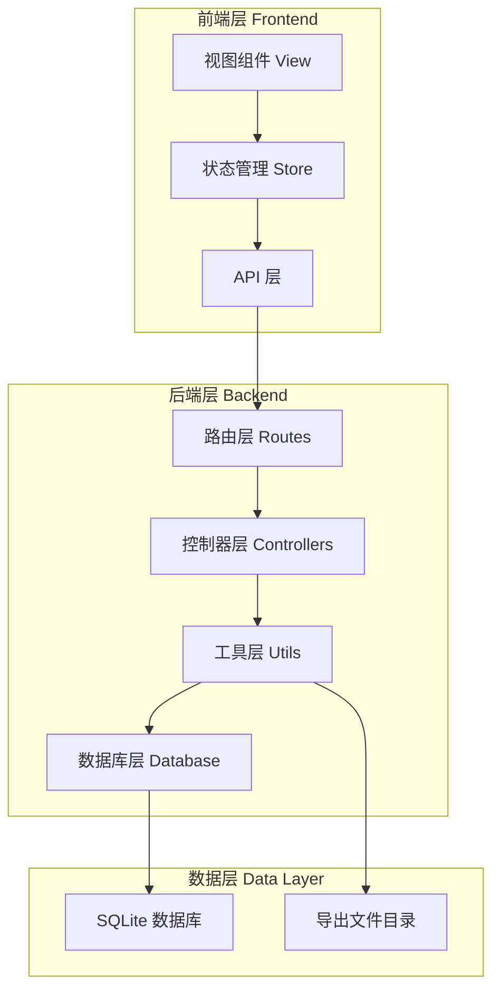

**图表来源**
- [exportController.ts:1-421](file://backend/src/controllers/exportController.ts#L1-L421)
- [exports.ts:1-40](file://backend/src/routes/exports.ts#L1-L40)

**章节来源**
- [exportController.ts:1-421](file://backend/src/controllers/exportController.ts#L1-L421)
- [exports.ts:1-40](file://backend/src/routes/exports.ts#L1-L40)

## 核心组件

### 后端核心组件

#### 导出控制器 (ExportController)
导出控制器是整个导出系统的核心，负责处理所有导出相关的业务逻辑：

**更新** 导出控制器现已从异步模式改为同步执行模式，提供更快的响应速度和更好的用户体验。

- **模板管理**：支持导出模板的创建、更新、删除和查询，支持四种模板类型（Excel、PDF、API、打印）
- **任务管理**：处理导出任务的创建、状态查询、重试和下载，支持同步执行
- **分享管理**：提供配方分享功能，支持密码保护和有效期控制
- **API 接口管理**：管理外部 API 接口配置

#### 导出引擎 (Export Engines)
系统提供了两种专业的导出引擎：

- **Excel 导出引擎**：基于 xlsx 库，生成专业的 Excel 文件，包含配方信息、原料清单、营养数据三个工作表
- **PDF 导出引擎**：基于 pdfkit 库，生成高质量的 PDF 文档，支持中文字体显示和专业的排版设计

#### 数据库模型
导出功能涉及多个核心数据表：
- `export_templates`：导出模板表，支持四种模板类型
- `export_jobs`：导出任务表，支持同步执行模式  
- `share_configs`：分享配置表
- `api_data_interfaces`：API 接口表

**章节来源**
- [exportController.ts:1-421](file://backend/src/controllers/exportController.ts#L1-L421)
- [formulaExporter.ts:1-203](file://backend/src/utils/formulaExporter.ts#L1-L203)
- [formulaPdfExporter.ts:1-362](file://backend/src/utils/formulaPdfExporter.ts#L1-L362)
- [init.sql:101-171](file://backend/src/scripts/init.sql#L101-L171)

### 前端核心组件

#### 导出状态管理 (Export Store)
前端使用 Pinia 管理导出相关的状态：

- **模板状态**：模板列表、创建、更新、删除操作
- **任务状态**：导出任务列表、创建、重试、下载
- **分享状态**：分享链接管理
- **API 接口状态**：外部接口配置管理

#### 导出中心视图 (Export Center View)
**更新** 导出中心现为综合管理界面，提供四个主要标签页：

- **导出任务**：创建和管理导出任务，支持同步执行
- **分享管理**：创建和管理分享链接
- **导出模板**：管理导出模板，支持四种模板类型
- **API 接口**：配置外部 API 接口

**章节来源**
- [export.ts:1-189](file://frontend/src/stores/export.ts#L1-L189)
- [ExportCenter.vue:1-554](file://frontend/src/views/exports/ExportCenter.vue#L1-L554)

## 架构概览

**更新** 导出中心采用了同步执行的现代化全栈架构设计，确保了系统的实时性和用户体验。

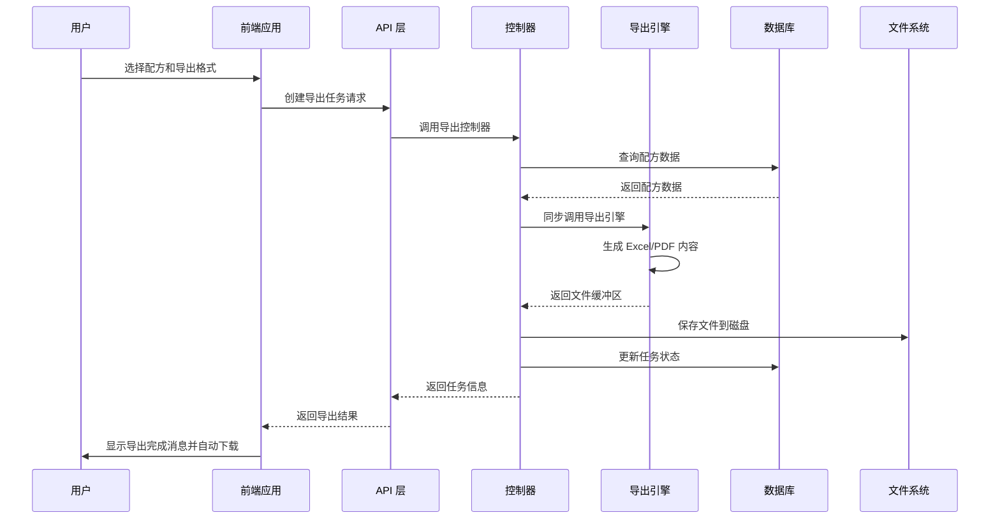

**图表来源**
- [exportController.ts:65-122](file://backend/src/controllers/exportController.ts#L65-L122)
- [formulaExporter.ts:56-203](file://backend/src/utils/formulaExporter.ts#L56-L203)
- [formulaPdfExporter.ts:102-362](file://backend/src/utils/formulaPdfExporter.ts#L102-L362)

系统架构的关键特点：

1. **同步执行**：导出任务采用同步处理模式，提供即时响应
2. **文件缓存**：导出文件保存在本地文件系统，提高访问效率
3. **状态跟踪**：完整的任务状态跟踪机制，支持重试和监控
4. **安全控制**：基于 JWT 的认证机制，确保数据安全

**章节来源**
- [exportController.ts:1-421](file://backend/src/controllers/exportController.ts#L1-L421)
- [database.ts:1-70](file://backend/src/config/database.ts#L1-L70)

## 详细组件分析

### 导出控制器分析

导出控制器是整个系统的核心业务逻辑层，负责协调各个组件完成导出任务。

#### 导出模板管理

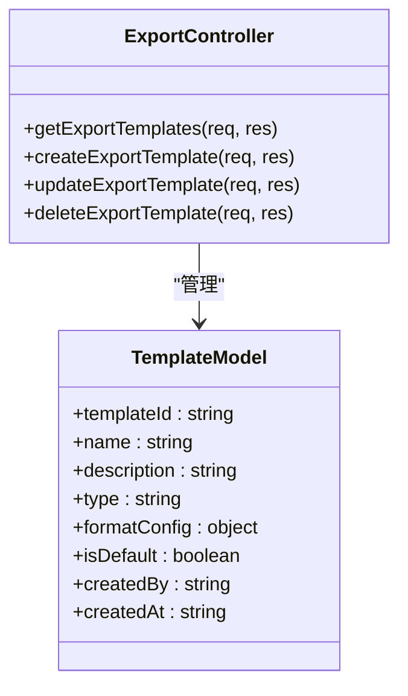

**图表来源**
- [exportController.ts:16-420](file://backend/src/controllers/exportController.ts#L16-L420)

模板管理功能支持：
- 按类型过滤模板（Excel、PDF、API、打印）
- 设置默认模板
- JSON 格式的配置存储
- 用户权限控制

#### 导出任务管理

**更新** 导出任务现在采用同步执行模式：

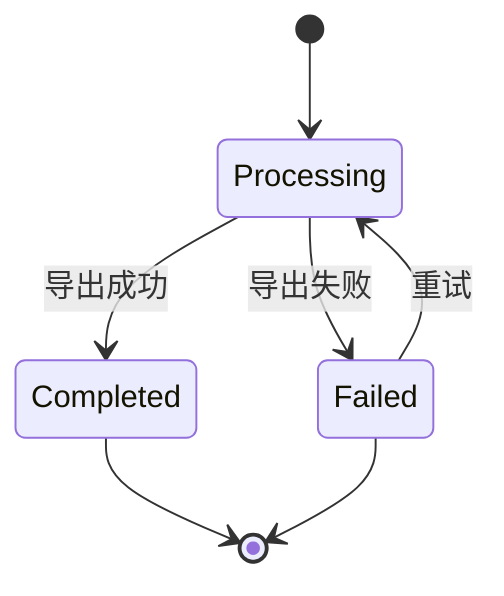

**图表来源**
- [exportController.ts:124-167](file://backend/src/controllers/exportController.ts#L124-L167)

任务管理流程包括：
- 同步执行导出任务
- 实时状态更新
- 自动文件清理机制
- 错误信息记录
- 进度监控

#### 分享管理功能

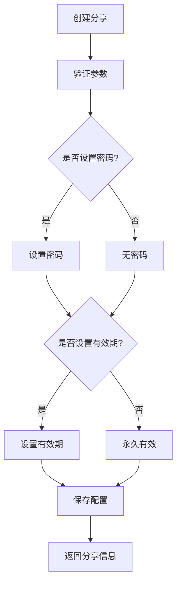

**图表来源**
- [exportController.ts:169-235](file://backend/src/controllers/exportController.ts#L169-L235)

分享功能特性：
- 密码保护机制
- 有效期控制
- 下载次数限制
- 邮箱白名单验证

**章节来源**
- [exportController.ts:1-421](file://backend/src/controllers/exportController.ts#L1-L421)

### 导出引擎分析

#### Excel 导出引擎

Excel 导出引擎提供了专业的配方数据导出功能：

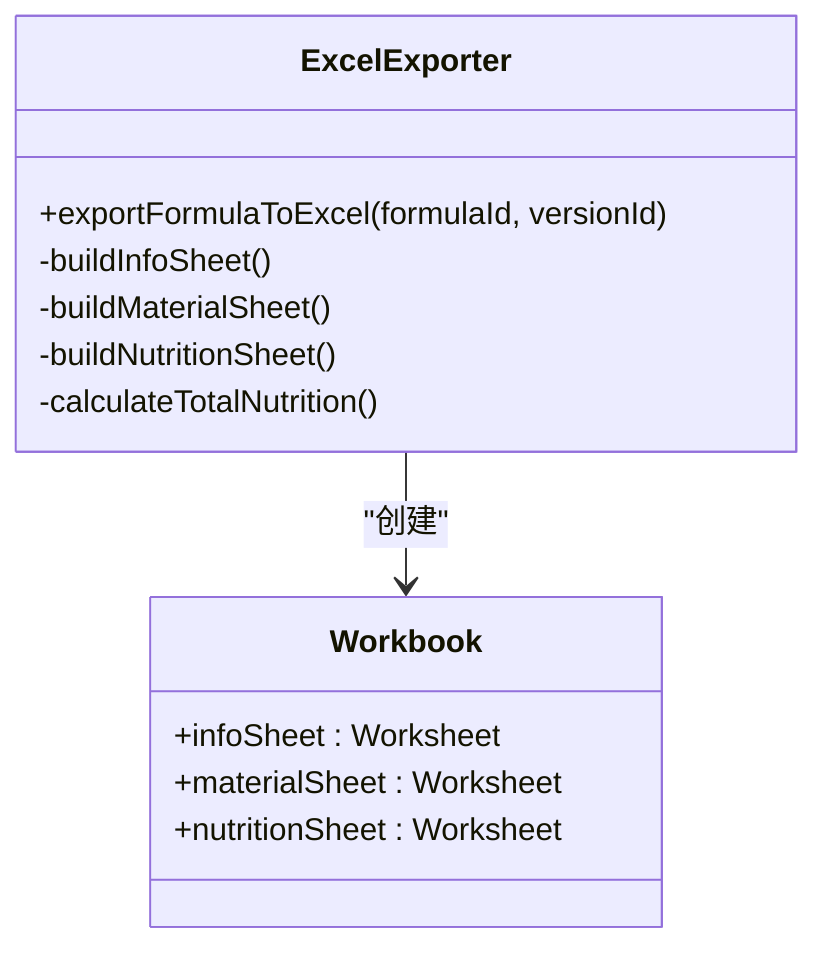

**图表来源**
- [formulaExporter.ts:56-203](file://backend/src/utils/formulaExporter.ts#L56-L203)

Excel 导出特性：
- 三个工作表：配方信息、原料清单、营养数据
- 自动计算配方总营养成分
- 标准化的表格格式
- 支持版本号显示

#### PDF 导出引擎

PDF 导出引擎提供了高质量的文档导出功能：

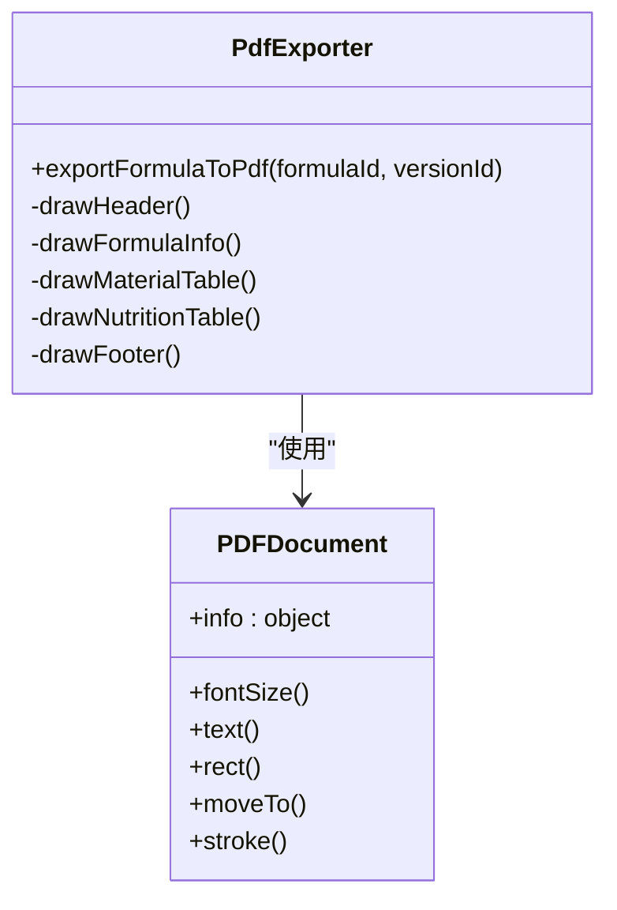

**图表来源**
- [formulaPdfExporter.ts:102-362](file://backend/src/utils/formulaPdfExporter.ts#L102-L362)

PDF 导出特性：
- A4 标准页面尺寸
- 专业的排版设计
- 渐变色彩主题
- 详细的营养数据分析
- 中文字体支持

**章节来源**
- [formulaExporter.ts:1-203](file://backend/src/utils/formulaExporter.ts#L1-L203)
- [formulaPdfExporter.ts:1-362](file://backend/src/utils/formulaPdfExporter.ts#L1-L362)

### 前端组件分析

#### 导出状态管理

前端使用 Pinia 管理复杂的导出状态：

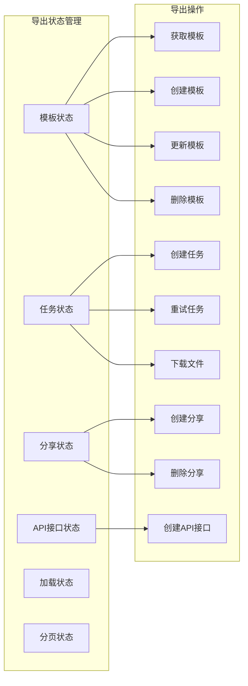

**图表来源**
- [export.ts:6-189](file://frontend/src/stores/export.ts#L6-L189)

状态管理特点：
- 响应式状态更新
- 自动加载指示器
- 错误处理和提示
- 分页数据管理

#### 导出中心视图

**更新** 导出中心现在提供直观的综合管理界面：

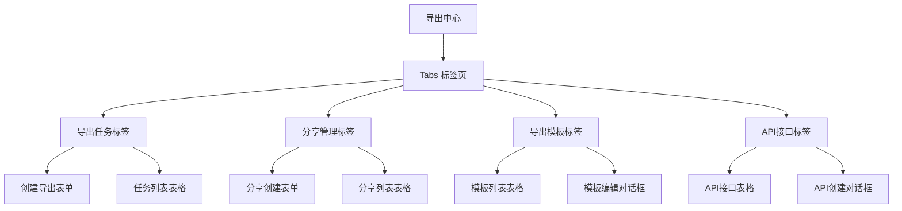

**图表来源**
- [ExportCenter.vue:1-554](file://frontend/src/views/exports/ExportCenter.vue#L1-L554)

界面设计特点：
- 响应式布局
- 实时状态更新
- 操作反馈提示
- 错误处理机制
- 四种模板类型的统一管理

**章节来源**
- [export.ts:1-189](file://frontend/src/stores/export.ts#L1-L189)
- [ExportCenter.vue:1-554](file://frontend/src/views/exports/ExportCenter.vue#L1-L554)

## 依赖关系分析

### 技术栈依赖

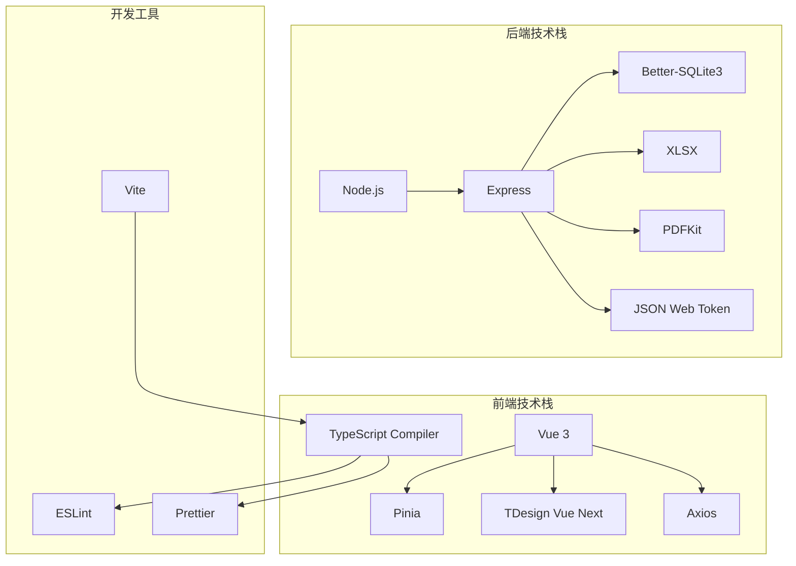

**图表来源**
- [package.json:12-29](file://frontend/package.json#L12-L29)
- [package.json:14-42](file://backend/package.json#L14-L42)

### 数据库关系

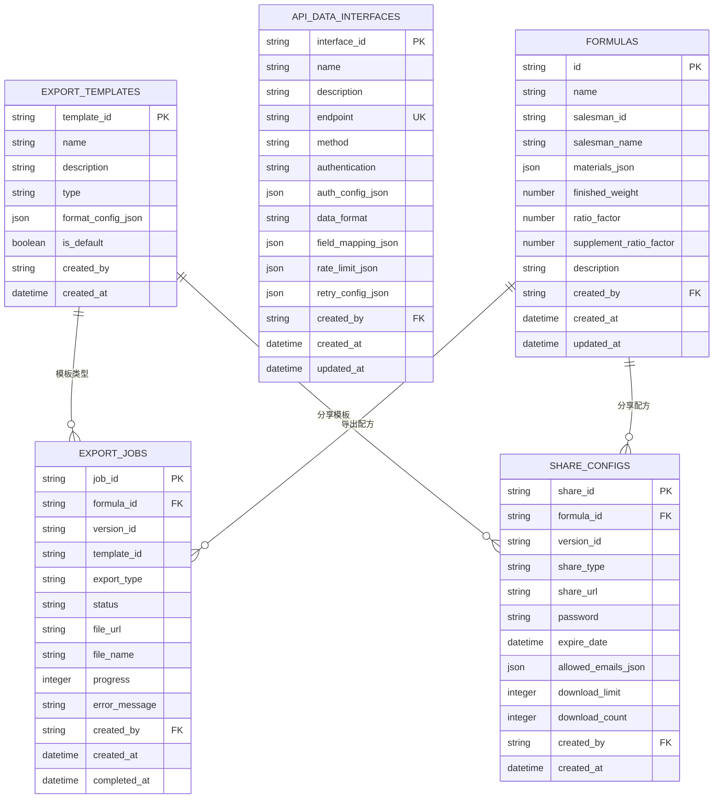

**图表来源**
- [init.sql:101-171](file://backend/src/scripts/init.sql#L101-L171)

**章节来源**
- [database.ts:1-70](file://backend/src/config/database.ts#L1-L70)
- [init.sql:1-232](file://backend/src/scripts/init.sql#L1-L232)

## 性能考虑

### 数据库优化

系统采用了多项数据库优化策略：

1. **索引优化**：为常用查询字段建立索引
2. **WAL 模式**：启用写-ahead logging 提高并发性能
3. **事务管理**：使用事务确保数据一致性
4. **连接池**：Better-SQLite3 内置连接池管理

### 导出性能优化

**更新** 同步执行模式下的性能优化：

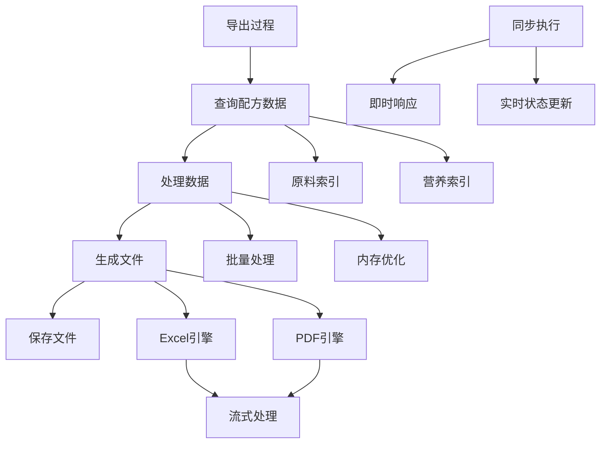

**图表来源**
- [formulaExporter.ts:84-107](file://backend/src/utils/formulaExporter.ts#L84-L107)
- [formulaPdfExporter.ts:78-96](file://backend/src/utils/formulaPdfExporter.ts#L78-L96)

性能优化措施：
- 批量查询减少数据库往返
- 流式处理减少内存占用
- 缓存机制提升重复查询性能
- 同步执行避免长时间等待

### 前端性能优化

前端层面的优化包括：
- 懒加载组件减少初始加载时间
- 响应式状态管理避免不必要的重渲染
- 分页加载处理大量数据
- 缓存机制提升用户体验

## 故障排除指南

### 常见问题及解决方案

#### 导出任务失败

**问题症状**：
- 导出任务状态显示失败
- 错误信息显示具体原因

**可能原因**：
1. 配方数据缺失或损坏
2. 原料信息不完整
3. 营养数据异常
4. 文件系统权限问题

**解决步骤**：
1. 检查配方数据完整性
2. 验证原料是否存在
3. 查看错误日志获取详细信息
4. 重新创建导出任务

#### 文件下载失败

**问题症状**：
- 下载链接无法访问
- 文件不存在或已过期

**可能原因**：
1. 文件已被清理
2. 下载链接过期
3. 权限不足
4. 网络问题

**解决步骤**：
1. 重新创建导出任务
2. 检查文件存储目录权限
3. 验证下载链接有效性
4. 检查网络连接状态

#### 模板配置错误

**问题症状**：
- 模板无法应用
- 导出格式异常

**可能原因**：
1. 模板配置格式错误
2. 字段映射不正确
3. 格式配置缺失
4. 模板类型不匹配

**解决步骤**：
1. 检查模板配置 JSON 格式
2. 验证字段映射关系
3. 确认模板类型设置
4. 重新创建模板

**章节来源**
- [exportController.ts:111-121](file://backend/src/controllers/exportController.ts#L111-L121)
- [exportController.ts:282-311](file://backend/src/controllers/exportController.ts#L282-L311)

### 调试技巧

#### 后端调试

1. **日志查看**：检查数据库连接和查询日志
2. **错误追踪**：使用 try-catch 包装关键代码段
3. **状态监控**：监控导出任务状态变化
4. **性能分析**：使用性能分析工具识别瓶颈

#### 前端调试

1. **状态检查**：使用浏览器开发者工具检查 Pinia 状态
2. **网络监控**：监控 API 请求和响应
3. **错误处理**：检查错误边界组件
4. **性能分析**：使用性能面板分析渲染性能

## 结论

导出中心作为 TingStudio 的核心导出功能模块，展现了现代 Web 应用的最佳实践。系统通过精心设计的架构、完善的错误处理机制和优秀的用户体验，为食品配方管理工作提供了强大而可靠的工具。

**更新** 系统现已升级为综合管理界面，提供同步执行的导出服务，支持四种模板类型，显著提升了用户体验和系统性能。

### 主要优势

1. **功能完整性**：涵盖了从数据导出到分享管理的完整工作流程
2. **技术先进性**：采用最新的前端和后端技术栈
3. **用户体验优秀**：直观的界面设计和流畅的操作体验
4. **可扩展性强**：模块化设计便于功能扩展和维护
5. **性能卓越**：同步执行模式提供即时响应

### 技术亮点

1. **同步执行架构**：高效的同步任务处理机制
2. **多格式支持**：同时支持 Excel 和 PDF 两种导出格式
3. **安全控制**：完善的认证授权和数据保护机制
4. **性能优化**：多项性能优化措施确保系统高效运行
5. **综合管理**：统一的模板和接口管理界面

### 发展建议

1. **功能扩展**：可以考虑添加更多导出格式和自定义选项
2. **性能提升**：进一步优化大数据量场景下的处理性能
3. **监控增强**：增加更详细的系统监控和日志分析功能
4. **移动端适配**：优化移动端用户体验

导出中心为 TingStudio 提供了坚实的导出基础，为用户提供了专业而便捷的配方数据管理体验。随着系统的不断完善和功能扩展，它将继续为食品配方行业提供强有力的技术支持。