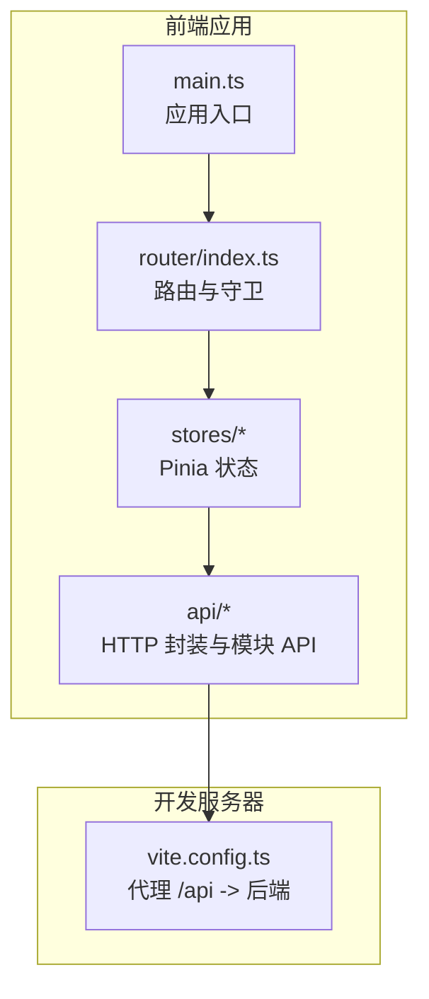
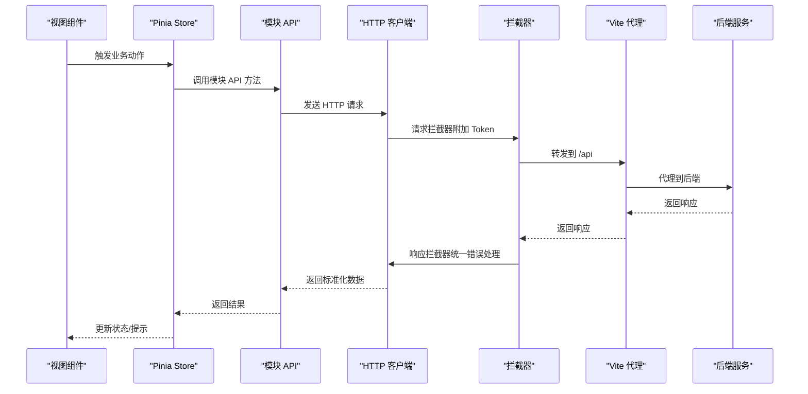
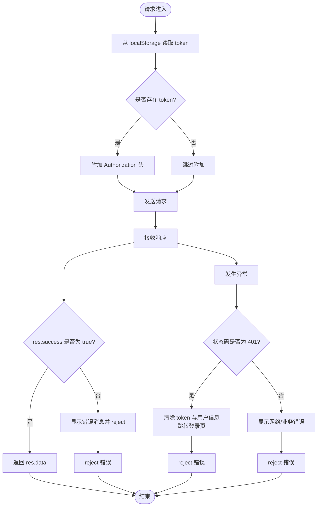
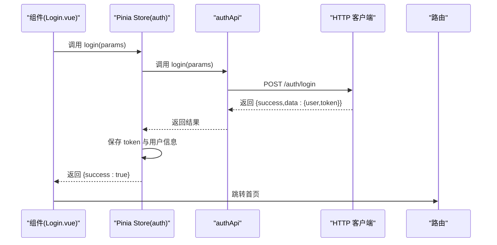
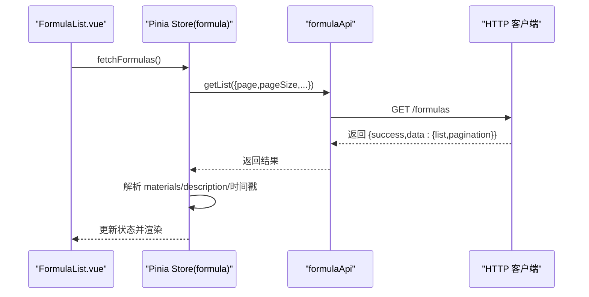
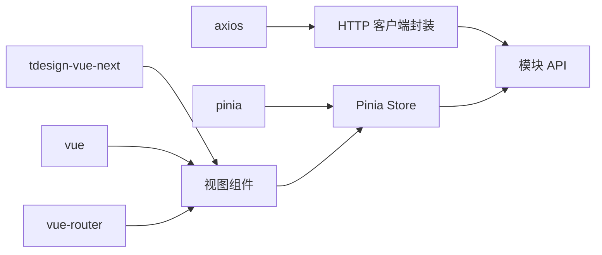

# API 客户端集成

<cite>
**本文引用的文件**
- [frontend/src/api/http.ts](file://frontend/src/api/http.ts)
- [frontend/src/api/auth.ts](file://frontend/src/api/auth.ts)
- [frontend/src/api/formula.ts](file://frontend/src/api/formula.ts)
- [frontend/src/api/material.ts](file://frontend/src/api/material.ts)
- [frontend/src/api/nutrition.ts](file://frontend/src/api/nutrition.ts)
- [frontend/src/api/export.ts](file://frontend/src/api/export.ts)
- [frontend/src/api/salesman.ts](file://frontend/src/api/salesman.ts)
- [frontend/src/api/version.ts](file://frontend/src/api/version.ts)
- [frontend/src/stores/auth.ts](file://frontend/src/stores/auth.ts)
- [frontend/src/stores/formula.ts](file://frontend/src/stores/formula.ts)
- [frontend/src/router/index.ts](file://frontend/src/router/index.ts)
- [frontend/src/main.ts](file://frontend/src/main.ts)
- [frontend/vite.config.ts](file://frontend/vite.config.ts)
- [frontend/package.json](file://frontend/package.json)
- [frontend/src/views/auth/Login.vue](file://frontend/src/views/auth/Login.vue)
- [frontend/src/views/formulas/FormulaList.vue](file://frontend/src/views/formulas/FormulaList.vue)
- [frontend/src/views/formulas/FormulaForm.vue](file://frontend/src/views/formulas/FormulaForm.vue)
</cite>

## 目录
1. [简介](#简介)
2. [项目结构](#项目结构)
3. [核心组件](#核心组件)
4. [架构总览](#架构总览)
5. [详细组件分析](#详细组件分析)
6. [依赖关系分析](#依赖关系分析)
7. [性能与并发特性](#性能与并发特性)
8. [故障排查指南](#故障排查指南)
9. [结论](#结论)
10. [附录](#附录)

## 简介
本文件系统性阐述前端 API 客户端的集成方案，覆盖 axios 封装、请求/响应拦截器、各模块 API 设计、错误处理机制、缓存策略与并发控制，并给出最佳实践建议（重试、超时、安全等）。目标是帮助开发者在不深入源码的情况下，也能高效、安全地使用 API。

## 项目结构
前端采用 Vue 3 + Vite 构建，API 层位于 frontend/src/api，按功能域拆分模块；状态管理使用 Pinia；路由守卫结合鉴权状态进行访问控制；开发服务器通过 Vite 反向代理转发至后端服务。

图表来源
- [frontend/src/main.ts:1-17](file://frontend/src/main.ts#L1-L17)
- [frontend/src/router/index.ts:1-165](file://frontend/src/router/index.ts#L1-L165)
- [frontend/vite.config.ts:1-23](file://frontend/vite.config.ts#L1-L23)

章节来源
- [frontend/src/main.ts:1-17](file://frontend/src/main.ts#L1-L17)
- [frontend/src/router/index.ts:1-165](file://frontend/src/router/index.ts#L1-L165)
- [frontend/vite.config.ts:1-23](file://frontend/vite.config.ts#L1-L23)

## 核心组件
- HTTP 客户端封装与拦截器
  - axios 实例创建、默认配置、请求头注入、统一错误处理、401 自动登出
  - 提供 token 的本地存储与读取工具函数
- 认证 API
  - 登录、注册、获取当前用户信息
  - 登录后持久化 token 与用户信息，退出清理
- 业务模块 API
  - 配方、原料、业务员、版本、导出、营养分析等模块的 CRUD 与业务接口
- 状态与路由
  - Pinia Store 统一调度 API 调用与本地缓存
  - 路由守卫基于鉴权状态控制访问

章节来源
- [frontend/src/api/http.ts:1-58](file://frontend/src/api/http.ts#L1-L58)
- [frontend/src/api/auth.ts:1-36](file://frontend/src/api/auth.ts#L1-L36)
- [frontend/src/api/formula.ts:1-65](file://frontend/src/api/formula.ts#L1-L65)
- [frontend/src/api/material.ts:1-45](file://frontend/src/api/material.ts#L1-L45)
- [frontend/src/api/nutrition.ts:1-38](file://frontend/src/api/nutrition.ts#L1-L38)
- [frontend/src/api/export.ts:1-56](file://frontend/src/api/export.ts#L1-L56)
- [frontend/src/api/salesman.ts:1-41](file://frontend/src/api/salesman.ts#L1-L41)
- [frontend/src/api/version.ts:1-35](file://frontend/src/api/version.ts#L1-L35)
- [frontend/src/stores/auth.ts:1-64](file://frontend/src/stores/auth.ts#L1-L64)
- [frontend/src/stores/formula.ts:1-166](file://frontend/src/stores/formula.ts#L1-L166)

## 架构总览
下图展示从前端组件到 API 层、状态层与后端的整体交互路径。

图表来源
- [frontend/src/api/http.ts:12-43](file://frontend/src/api/http.ts#L12-L43)
- [frontend/vite.config.ts:15-20](file://frontend/vite.config.ts#L15-L20)
- [frontend/src/router/index.ts:148-162](file://frontend/src/router/index.ts#L148-L162)

## 详细组件分析

### HTTP 客户端与拦截器
- axios 实例
  - 基础路径：/api
  - 超时：15000ms
  - Content-Type：application/json
- 请求拦截器
  - 从 localStorage 读取 token 并附加 Authorization 头
- 响应拦截器
  - 成功：透传 data
  - 失败：
    - 401：清除本地 token 与用户信息，跳转登录页，提示“登录已过期”
    - 其他：统一错误提示
- 工具函数
  - getToken/setToken/removeToken：token 的读写删

图表来源
- [frontend/src/api/http.ts:12-43](file://frontend/src/api/http.ts#L12-L43)

章节来源
- [frontend/src/api/http.ts:1-58](file://frontend/src/api/http.ts#L1-L58)

### 认证模块 API
- 接口定义
  - 登录：POST /auth/login
  - 注册：POST /auth/register
  - 获取当前用户：GET /auth/me
- 行为
  - 登录/注册成功后，保存 token 与用户信息到 localStorage
  - 退出时清理本地数据
  - 支持从本地缓存读取用户信息

图表来源
- [frontend/src/views/auth/Login.vue:290-308](file://frontend/src/views/auth/Login.vue#L290-L308)
- [frontend/src/stores/auth.ts:19-32](file://frontend/src/stores/auth.ts#L19-L32)
- [frontend/src/api/auth.ts:7-17](file://frontend/src/api/auth.ts#L7-L17)
- [frontend/src/api/http.ts:45-55](file://frontend/src/api/http.ts#L45-L55)

章节来源
- [frontend/src/api/auth.ts:1-36](file://frontend/src/api/auth.ts#L1-L36)
- [frontend/src/stores/auth.ts:1-64](file://frontend/src/stores/auth.ts#L1-L64)
- [frontend/src/views/auth/Login.vue:1-910](file://frontend/src/views/auth/Login.vue#L1-L910)

### 配方模块 API
- 接口定义
  - 列表/详情/创建/更新/删除/按原料查询
- Store 行为
  - 统一分页参数与加载状态
  - 对返回数据进行解析与格式化（如 materialsJson、描述摘要）
  - 统一错误提示与 finally 回收 loading

图表来源
- [frontend/src/views/formulas/FormulaList.vue:271-277](file://frontend/src/views/formulas/FormulaList.vue#L271-L277)
- [frontend/src/stores/formula.ts:18-44](file://frontend/src/stores/formula.ts#L18-L44)
- [frontend/src/api/formula.ts:45-64](file://frontend/src/api/formula.ts#L45-L64)

章节来源
- [frontend/src/api/formula.ts:1-65](file://frontend/src/api/formula.ts#L1-L65)
- [frontend/src/stores/formula.ts:1-166](file://frontend/src/stores/formula.ts#L1-L166)
- [frontend/src/views/formulas/FormulaList.vue:1-741](file://frontend/src/views/formulas/FormulaList.vue#L1-L741)
- [frontend/src/views/formulas/FormulaForm.vue:1-348](file://frontend/src/views/formulas/FormulaForm.vue#L1-L348)

### 原料、业务员、版本、导出、营养分析模块 API
- 原料模块：列表/详情/创建/更新/删除/按配方查询
- 业务员模块：列表/详情/创建/更新/删除
- 版本模块：列表/详情/创建/发布/版本对比
- 导出模块：模板管理、任务管理、分享、API 接口
- 营养模块：原料营养、配方计算、标准档案、合规检查、表格

这些模块均遵循一致的命名与返回结构约定，便于统一处理与扩展。

章节来源
- [frontend/src/api/material.ts:1-45](file://frontend/src/api/material.ts#L1-L45)
- [frontend/src/api/salesman.ts:1-41](file://frontend/src/api/salesman.ts#L1-L41)
- [frontend/src/api/version.ts:1-35](file://frontend/src/api/version.ts#L1-L35)
- [frontend/src/api/export.ts:1-56](file://frontend/src/api/export.ts#L1-L56)
- [frontend/src/api/nutrition.ts:1-38](file://frontend/src/api/nutrition.ts#L1-L38)

## 依赖关系分析
- 开发依赖
  - axios：HTTP 客户端
  - tdesign-vue-next：UI 组件库（用于消息提示与表单）
  - vue/vue-router/pinia：框架与状态/路由
- 运行时依赖
  - 通过 Vite 插件与别名配置，简化模块导入路径
- 代理配置
  - /api 前缀代理到后端服务地址

图表来源
- [frontend/package.json:12-20](file://frontend/package.json#L12-L20)
- [frontend/src/main.ts:1-17](file://frontend/src/main.ts#L1-L17)
- [frontend/vite.config.ts:1-23](file://frontend/vite.config.ts#L1-L23)

章节来源
- [frontend/package.json:1-30](file://frontend/package.json#L1-L30)
- [frontend/src/main.ts:1-17](file://frontend/src/main.ts#L1-L17)
- [frontend/vite.config.ts:1-23](file://frontend/vite.config.ts#L1-L23)

## 性能与并发特性
- 超时与重试
  - 默认超时 15000ms；未内置自动重试机制
  - 如需增强稳定性，可在拦截器或封装层增加指数退避重试策略
- 并发控制
  - 未见集中式并发队列或请求去重逻辑
  - 建议在高频刷新场景中引入请求去重（基于 URL+参数）或合并策略
- 缓存策略
  - 未见浏览器级缓存或 HTTP 缓存头设置
  - 可在 Store 层对热点数据做内存缓存，并结合路由/组件生命周期管理
- 本地缓存
  - 认证信息与用户信息通过 localStorage 缓存，减少重复登录成本

章节来源
- [frontend/src/api/http.ts:6-10](file://frontend/src/api/http.ts#L6-L10)
- [frontend/src/api/auth.ts:31-35](file://frontend/src/api/auth.ts#L31-L35)

## 故障排查指南
- 登录态失效（401）
  - 现象：出现“登录已过期，请重新登录”
  - 处理：拦截器自动清除本地 token 与用户信息并跳转登录页
- 网络错误
  - 现象：显示通用网络错误提示
  - 处理：检查代理配置、网络连通性与后端服务状态
- 业务错误
  - 现象：接口返回 success=false，显示具体 message
  - 处理：根据 message 提示修复参数或联系管理员
- 路由守卫导致的页面跳转
  - 现象：未登录访问受保护路由被重定向到登录页
  - 处理：确保登录流程完成后正确保存 token 与用户信息

章节来源
- [frontend/src/api/http.ts:31-42](file://frontend/src/api/http.ts#L31-L42)
- [frontend/src/router/index.ts:148-162](file://frontend/src/router/index.ts#L148-L162)
- [frontend/src/stores/auth.ts:12-17](file://frontend/src/stores/auth.ts#L12-L17)

## 结论
本项目以 axios 为核心构建了统一的 HTTP 客户端，配合拦截器实现了认证与错误处理的标准化；模块 API 采用清晰的命名与一致的返回结构，便于在 Store 中统一调度与缓存；路由守卫保障了访问安全。建议后续在重试、并发控制与缓存方面进一步完善，以提升用户体验与系统韧性。

## 附录

### 最佳实践清单
- 重试与超时
  - 在拦截器中实现指数退避重试（仅对幂等 GET/HEAD）
  - 根据业务场景调整超时阈值
- 并发与去重
  - 引入请求去重（URL+参数哈希），避免重复请求
  - 对高频刷新场景使用节流/防抖
- 缓存
  - Store 内存缓存热点数据，设置 TTL 或失效策略
  - 对只读列表数据启用浏览器缓存（Cache-Control/ETag）
- 安全
  - 严格校验后端返回字段，避免直接渲染不受信任数据
  - 使用 HTTPS 与安全的 Cookie 属性（如 SameSite、HttpOnly）
- 错误处理
  - 区分网络错误与业务错误，分别提示
  - 对 401 自动登出，对 403/404 提示友好信息
- 可观测性
  - 记录关键请求耗时与失败原因，辅助定位问题

### 关键调用路径参考
- 登录流程
  - [frontend/src/views/auth/Login.vue:290-308](file://frontend/src/views/auth/Login.vue#L290-L308)
  - [frontend/src/stores/auth.ts:19-32](file://frontend/src/stores/auth.ts#L19-L32)
  - [frontend/src/api/auth.ts:7-17](file://frontend/src/api/auth.ts#L7-L17)
- 配方列表加载
  - [frontend/src/views/formulas/FormulaList.vue:271-277](file://frontend/src/views/formulas/FormulaList.vue#L271-L277)
  - [frontend/src/stores/formula.ts:18-44](file://frontend/src/stores/formula.ts#L18-L44)
  - [frontend/src/api/formula.ts:45-64](file://frontend/src/api/formula.ts#L45-L64)