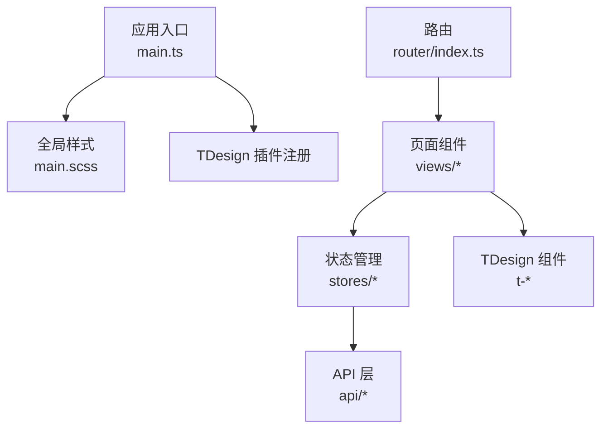
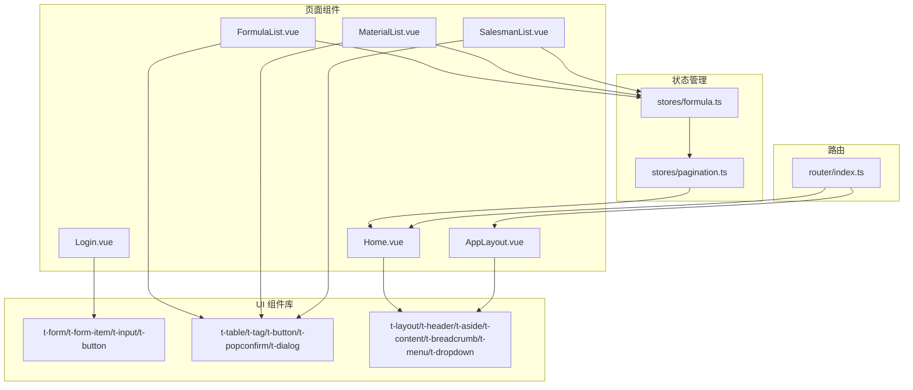
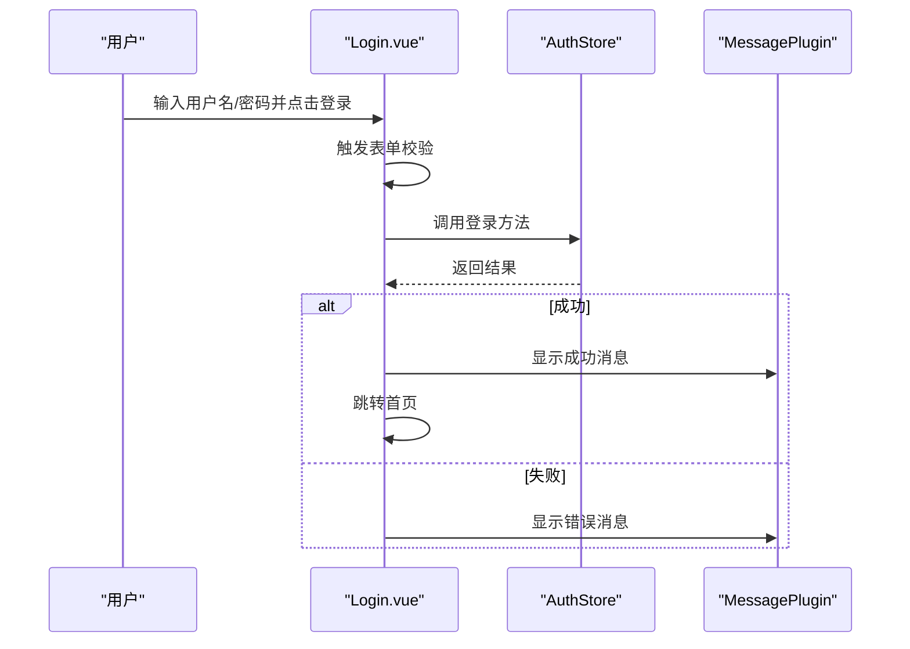
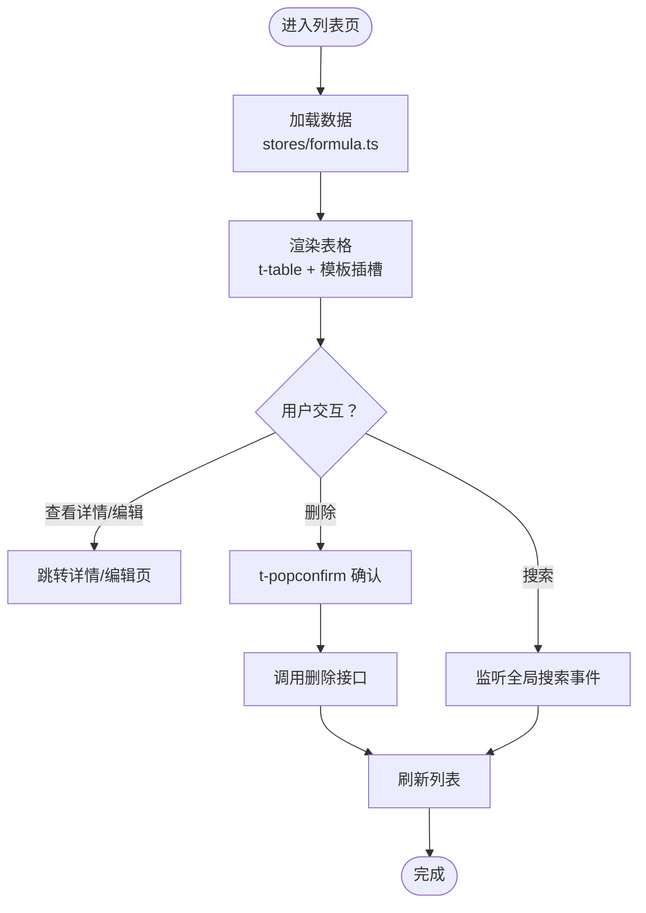
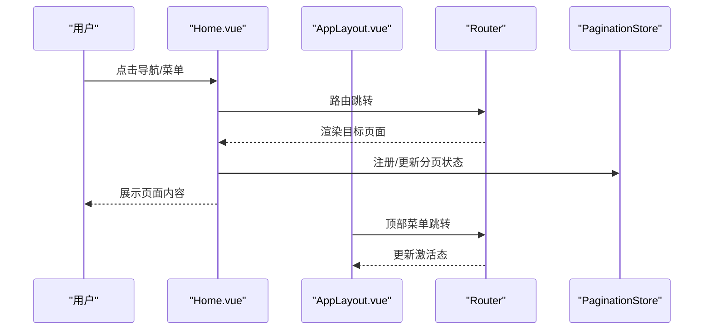
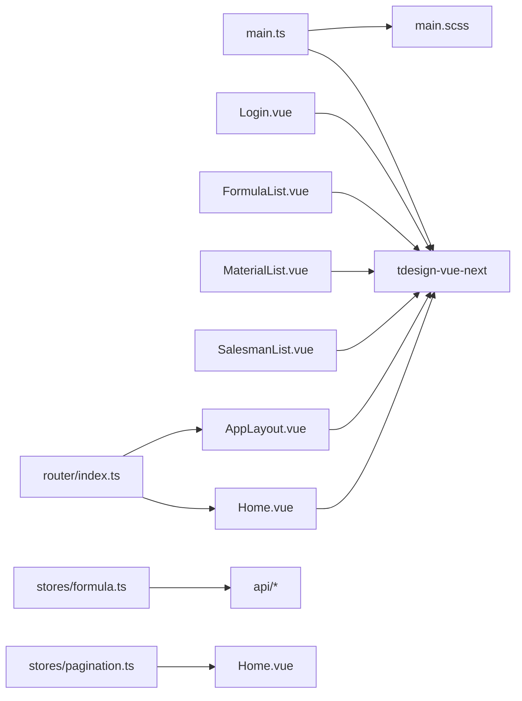

# UI 组件与 TDesign

<cite>
**本文引用的文件**
- [frontend/package.json](file://frontend/package.json)
- [frontend/src/main.ts](file://frontend/src/main.ts)
- [frontend/vite.config.ts](file://frontend/vite.config.ts)
- [frontend/src/assets/styles/main.scss](file://frontend/src/assets/styles/main.scss)
- [frontend/src/assets/styles/variables.scss](file://frontend/src/assets/styles/variables.scss)
- [frontend/src/views/Home.vue](file://frontend/src/views/Home.vue)
- [frontend/src/components/Layout/AppLayout.vue](file://frontend/src/components/Layout/AppLayout.vue)
- [frontend/src/views/auth/Login.vue](file://frontend/src/views/auth/Login.vue)
- [frontend/src/views/formulas/FormulaList.vue](file://frontend/src/views/formulas/FormulaList.vue)
- [frontend/src/views/materials/MaterialList.vue](file://frontend/src/views/materials/MaterialList.vue)
- [frontend/src/views/salesmen/SalesmanList.vue](file://frontend/src/views/salesmen/SalesmanList.vue)
- [frontend/src/stores/formula.ts](file://frontend/src/stores/formula.ts)
- [frontend/src/stores/pagination.ts](file://frontend/src/stores/pagination.ts)
- [frontend/src/router/index.ts](file://frontend/src/router/index.ts)
</cite>

## 目录

1. [简介](#简介)
2. [项目结构](#项目结构)
3. [核心组件](#核心组件)
4. [架构总览](#架构总览)
5. [详细组件分析](#详细组件分析)
6. [依赖关系分析](#依赖关系分析)
7. [性能考量](#性能考量)
8. [故障排查指南](#故障排查指南)
9. [结论](#结论)
10. [附录](#附录)

## 简介

本文件系统性梳理前端项目中 TDesign Vue Next 组件库的集成与使用实践，涵盖安装与配置、按需引入与全局样式、常用组件（表单、表格、弹窗、导航）的实际应用、主题定制与样式覆盖、响应式与移动端适配策略，以及组件开发规范（属性设计、事件处理、无障碍支持）。文档面向不同技术背景读者，既提供高层概览也包含代码级参考。

## 项目结构

前端采用 Vite + Vue 3 + TypeScript 架构，TDesign 作为 UI 基础库在应用入口统一注册，并通过 SCSS 全局样式覆盖实现主题定制。页面组件广泛使用 TDesign 的表单、表格、对话框、按钮、标签等组件；路由层通过 Pinia 状态管理与 API 层交互，形成清晰的分层结构。

图表来源

- [frontend/src/main.ts:1-17](file://frontend/src/main.ts#L1-L17)
- [frontend/src/assets/styles/main.scss:1-203](file://frontend/src/assets/styles/main.scss#L1-L203)
- [frontend/src/router/index.ts:1-165](file://frontend/src/router/index.ts#L1-L165)

章节来源

- [frontend/src/main.ts:1-17](file://frontend/src/main.ts#L1-L17)
- [frontend/vite.config.ts:1-23](file://frontend/vite.config.ts#L1-L23)
- [frontend/src/assets/styles/main.scss:1-203](file://frontend/src/assets/styles/main.scss#L1-L203)
- [frontend/src/router/index.ts:1-165](file://frontend/src/router/index.ts#L1-L165)

## 核心组件

- 表单组件：登录页使用 t-form、t-form-item、t-input、t-button 实现认证流程与校验。
- 表格组件：配方、原料、业务员列表页使用 t-table、t-tag、t-button、t-popconfirm、t-dialog 实现数据展示与交互。
- 弹窗组件：t-dialog 用于删除确认等危险操作，结合 t-popconfirm 提供轻量确认。
- 导航组件：t-layout、t-header、t-aside、t-content、t-breadcrumb、t-menu、t-dropdown、t-button、t-space 等构建页面骨架与交互导航。

章节来源

- [frontend/src/views/auth/Login.vue:165-231](file://frontend/src/views/auth/Login.vue#L165-L231)
- [frontend/src/views/formulas/FormulaList.vue:4-165](file://frontend/src/views/formulas/FormulaList.vue#L4-L165)
- [frontend/src/views/materials/MaterialList.vue:4-51](file://frontend/src/views/materials/MaterialList.vue#L4-L51)
- [frontend/src/views/salesmen/SalesmanList.vue:4-18](file://frontend/src/views/salesmen/SalesmanList.vue#L4-L18)
- [frontend/src/components/Layout/AppLayout.vue:25-98](file://frontend/src/components/Layout/AppLayout.vue#L25-L98)

## 架构总览

下图展示页面组件与 TDesign 组件、状态管理与路由之间的交互关系，体现“页面组件驱动 UI，状态管理承载数据，路由控制导航”的整体架构。

图表来源

- [frontend/src/views/Home.vue:1-231](file://frontend/src/views/Home.vue#L1-L231)
- [frontend/src/components/Layout/AppLayout.vue:1-100](file://frontend/src/components/Layout/AppLayout.vue#L1-L100)
- [frontend/src/views/auth/Login.vue:165-231](file://frontend/src/views/auth/Login.vue#L165-L231)
- [frontend/src/views/formulas/FormulaList.vue:4-165](file://frontend/src/views/formulas/FormulaList.vue#L4-L165)
- [frontend/src/views/materials/MaterialList.vue:4-51](file://frontend/src/views/materials/MaterialList.vue#L4-L51)
- [frontend/src/views/salesmen/SalesmanList.vue:4-18](file://frontend/src/views/salesmen/SalesmanList.vue#L4-L18)
- [frontend/src/stores/formula.ts:1-166](file://frontend/src/stores/formula.ts#L1-L166)
- [frontend/src/stores/pagination.ts:1-89](file://frontend/src/stores/pagination.ts#L1-L89)
- [frontend/src/router/index.ts:1-165](file://frontend/src/router/index.ts#L1-L165)

## 详细组件分析

### 安装与配置

- 依赖安装：通过包管理器安装 tdesign-vue-next，并在应用入口引入插件与全局样式。
- 入口注册：在应用启动时挂载 TDesign 插件，使全局可用。
- 全局样式：引入组件库基础样式文件，确保默认样式一致。

章节来源

- [frontend/package.json:12-20](file://frontend/package.json#L12-L20)
- [frontend/src/main.ts:3-4](file://frontend/src/main.ts#L3-L4)

### 主题定制与样式覆盖

- 变量集中管理：通过 SCSS 变量文件定义主色、辅助色、字体、间距、圆角、阴影等，统一主题风格。
- 全局样式覆盖：使用 ::v-deep 对 TDesign 组件进行样式穿透，覆盖卡片、按钮、输入框、表格、分页、对话框等组件的视觉表现，形成统一的“粉嫩可爱”主题。
- 组件样式封装：在各页面组件内使用 ::v-deep 对特定按钮、表格行等进行局部样式增强，保证一致性与可维护性。

章节来源

- [frontend/src/assets/styles/variables.scss:1-55](file://frontend/src/assets/styles/variables.scss#L1-L55)
- [frontend/src/assets/styles/main.scss:87-203](file://frontend/src/assets/styles/main.scss#L87-L203)

### 表单组件应用

- 登录页表单：使用 t-form、t-form-item、t-input（带前缀图标）、t-button 构建登录界面；结合 vee-validate/yup 进行规则校验；提交时通过 MessagePlugin 展示反馈。
- 表单交互：支持清空、加载态、块级按钮、图标模板插槽等特性，提升用户体验。

图表来源

- [frontend/src/views/auth/Login.vue:290-308](file://frontend/src/views/auth/Login.vue#L290-L308)

章节来源

- [frontend/src/views/auth/Login.vue:165-231](file://frontend/src/views/auth/Login.vue#L165-L231)

### 表格组件应用

- 配方列表：使用 t-table 展示配方数据，支持展开行显示版本与变更明细；列模板插槽用于状态标签、操作按钮、业务员与原料数量展示；空状态使用 t-empty。
- 原料与业务员列表：使用 t-table 展示基础数据，列模板插槽用于状态标签与操作按钮；空状态使用 t-empty。
- 分页与搜索：通过 stores/pagination.ts 管理分页状态，监听全局搜索事件实现跨页面联动。

图表来源

- [frontend/src/views/formulas/FormulaList.vue:184-356](file://frontend/src/views/formulas/FormulaList.vue#L184-L356)
- [frontend/src/stores/formula.ts:18-44](file://frontend/src/stores/formula.ts#L18-L44)
- [frontend/src/stores/pagination.ts:42-53](file://frontend/src/stores/pagination.ts#L42-L53)

章节来源

- [frontend/src/views/formulas/FormulaList.vue:4-165](file://frontend/src/views/formulas/FormulaList.vue#L4-L165)
- [frontend/src/views/materials/MaterialList.vue:4-51](file://frontend/src/views/materials/MaterialList.vue#L4-L51)
- [frontend/src/views/salesmen/SalesmanList.vue:4-18](file://frontend/src/views/salesmen/SalesmanList.vue#L4-L18)
- [frontend/src/stores/formula.ts:1-166](file://frontend/src/stores/formula.ts#L1-L166)
- [frontend/src/stores/pagination.ts:1-89](file://frontend/src/stores/pagination.ts#L1-L89)

### 弹窗组件应用

- 删除确认：t-popconfirm 用于轻量级删除确认（如原料列表、配方列表、业务员列表），点击后弹出气泡浮层（theme="danger" 警告风格）；t-dialog 用于复杂确认场景（如需展示详细信息或二次输入的对话框）。两者均配合 MessagePlugin 展示操作反馈。
- 交互流程：点击删除触发确认，确认后调用接口并刷新列表。

章节来源

- [frontend/src/views/formulas/FormulaList.vue:152-180](file://frontend/src/views/formulas/FormulaList.vue#L152-L180)
- [frontend/src/views/materials/MaterialList.vue:38-68](file://frontend/src/views/materials/MaterialList.vue#L38-L68)

### 导航组件应用

- 顶部面包屑与用户菜单：t-breadcrumb、t-dropdown、t-button、t-space 构建头部导航与用户操作。
- 侧边菜单：t-menu、t-icon、t-layout、t-header、t-aside、t-content 组成页面骨架，支持主题切换与激活态样式。
- 路由集成：路由守卫控制登录态与页面标题，页面组件通过 router-view 渲染。

图表来源

- [frontend/src/views/Home.vue:398-420](file://frontend/src/views/Home.vue#L398-L420)
- [frontend/src/components/Layout/AppLayout.vue:163-173](file://frontend/src/components/Layout/AppLayout.vue#L163-L173)
- [frontend/src/router/index.ts:148-162](file://frontend/src/router/index.ts#L148-L162)
- [frontend/src/stores/pagination.ts:42-53](file://frontend/src/stores/pagination.ts#L42-L53)

章节来源

- [frontend/src/components/Layout/AppLayout.vue:25-98](file://frontend/src/components/Layout/AppLayout.vue#L25-L98)
- [frontend/src/views/Home.vue:350-420](file://frontend/src/views/Home.vue#L350-L420)
- [frontend/src/router/index.ts:1-165](file://frontend/src/router/index.ts#L1-L165)

### 响应式设计与移动端适配

- 视口与容器：页面根元素使用 100vh 或 100dvh，配合 Flex 布局实现纵向三段式布局与滚动区域分离。
- 滚动与分页：通过 ResizeObserver 计算内容区域高度，动态推导表格分页条数，提升小屏体验。
- 移动端细节：登录页在小屏隐藏部分装饰元素，按钮与输入框尺寸适配移动端触摸目标。

章节来源

- [frontend/src/views/Home.vue:250-305](file://frontend/src/views/Home.vue#L250-L305)
- [frontend/src/views/auth/Login.vue:571-606](file://frontend/src/views/auth/Login.vue#L571-L606)

### 组件开发规范

- 属性设计：遵循 TDesign 组件属性命名与语义化，如 theme、variant、size、block、clearable、labelWidth 等。
- 事件处理：统一使用 v-on 语法绑定事件，避免直接操作 DOM；对危险操作（如删除）统一使用 t-popconfirm 气泡确认（theme="danger"），仅在需要复杂交互时使用 t-dialog。
- 无障碍支持：为交互元素提供明确的图标与文案；在需要时补充 aria-label 或 role；确保键盘可访问性（如可聚焦按钮）。
- 可维护性：通过 ::v-deep 进行样式封装，避免全局污染；将通用逻辑抽象到 stores 与工具函数中。

章节来源

- [frontend/src/views/auth/Login.vue:165-231](file://frontend/src/views/auth/Login.vue#L165-L231)
- [frontend/src/views/formulas/FormulaList.vue:4-165](file://frontend/src/views/formulas/FormulaList.vue#L4-L165)
- [frontend/src/views/materials/MaterialList.vue:4-51](file://frontend/src/views/materials/MaterialList.vue#L4-L51)
- [frontend/src/views/salesmen/SalesmanList.vue:4-18](file://frontend/src/views/salesmen/SalesmanList.vue#L4-L18)

## 依赖关系分析

- 组件依赖：页面组件依赖 TDesign 组件库；状态管理依赖 stores；路由控制页面跳转。
- 样式依赖：全局样式覆盖 TDesign 默认样式；页面组件局部样式通过 ::v-deep 进行封装。
- 运行时依赖：应用入口引入 TDesign 插件与全局样式，确保组件可用与样式一致。

图表来源

- [frontend/src/main.ts:3-4](file://frontend/src/main.ts#L3-L4)
- [frontend/src/views/auth/Login.vue:165-231](file://frontend/src/views/auth/Login.vue#L165-L231)
- [frontend/src/views/formulas/FormulaList.vue:4-165](file://frontend/src/views/formulas/FormulaList.vue#L4-L165)
- [frontend/src/views/materials/MaterialList.vue:4-51](file://frontend/src/views/materials/MaterialList.vue#L4-L51)
- [frontend/src/views/salesmen/SalesmanList.vue:4-18](file://frontend/src/views/salesmen/SalesmanList.vue#L4-L18)
- [frontend/src/views/Home.vue:1-231](file://frontend/src/views/Home.vue#L1-L231)
- [frontend/src/components/Layout/AppLayout.vue:1-100](file://frontend/src/components/Layout/AppLayout.vue#L1-L100)
- [frontend/src/stores/formula.ts:1-166](file://frontend/src/stores/formula.ts#L1-L166)
- [frontend/src/stores/pagination.ts:1-89](file://frontend/src/stores/pagination.ts#L1-L89)
- [frontend/src/router/index.ts:1-165](file://frontend/src/router/index.ts#L1-L165)

章节来源

- [frontend/src/main.ts:1-17](file://frontend/src/main.ts#L1-L17)
- [frontend/src/assets/styles/main.scss:1-203](file://frontend/src/assets/styles/main.scss#L1-L203)
- [frontend/src/router/index.ts:1-165](file://frontend/src/router/index.ts#L1-L165)

## 性能考量

- 按需引入：建议结合构建工具按需引入组件与样式，减少打包体积（当前项目已通过入口引入全局样式，可评估按需引入策略）。
- 渲染优化：表格数据量大时启用虚拟滚动（若组件支持）；合理使用 v-show/v-if 控制复杂面板渲染。
- 事件节流：滚动与窗口尺寸变化事件使用防抖/节流，避免频繁重排。
- 图标与资源：SVG 图标内联或懒加载，减少额外请求。

## 故障排查指南

- 组件样式不生效：检查是否正确使用 ::v-deep 与作用域样式；确认全局样式加载顺序。
- 分页异常：检查 stores/pagination.ts 的 register/update 与页面组件的监听逻辑；确认 onChange 回调是否正确执行。
- 登录失败：检查表单校验规则与接口返回；确认 MessagePlugin 的提示时机。
- 路由跳转失效：检查路由守卫逻辑与 meta 标记；确认登录态初始化流程。

章节来源

- [frontend/src/stores/pagination.ts:42-53](file://frontend/src/stores/pagination.ts#L42-L53)
- [frontend/src/views/auth/Login.vue:290-308](file://frontend/src/views/auth/Login.vue#L290-L308)
- [frontend/src/router/index.ts:148-162](file://frontend/src/router/index.ts#L148-L162)

## 结论

本项目通过在应用入口统一注册 TDesign 并结合 SCSS 全局样式覆盖，实现了统一的主题风格与良好的组件复用性。页面组件围绕表单、表格、弹窗与导航等核心场景进行实践，配合 Pinia 状态管理与路由守卫，形成清晰的前端架构。建议后续进一步探索按需引入与虚拟滚动等优化手段，持续完善组件开发规范与无障碍支持。

## 附录

- 安装与配置要点
  - 安装依赖：tdesign-vue-next
  - 入口注册：app.use(TDesign)
  - 全局样式：引入组件库基础样式
- 主题定制要点
  - 使用 SCSS 变量集中管理色彩与排版
  - 通过 ::v-deep 对组件进行样式穿透
  - 在页面组件内进行局部样式封装
- 常用组件清单
  - 表单：t-form、t-form-item、t-input、t-button
  - 表格：t-table、t-tag、t-button、t-popconfirm、t-dialog
  - 导航：t-layout、t-header、t-aside、t-content、t-breadcrumb、t-menu、t-dropdown
- 开发规范
  - 属性语义化、事件统一处理、无障碍支持、样式封装与可维护性
