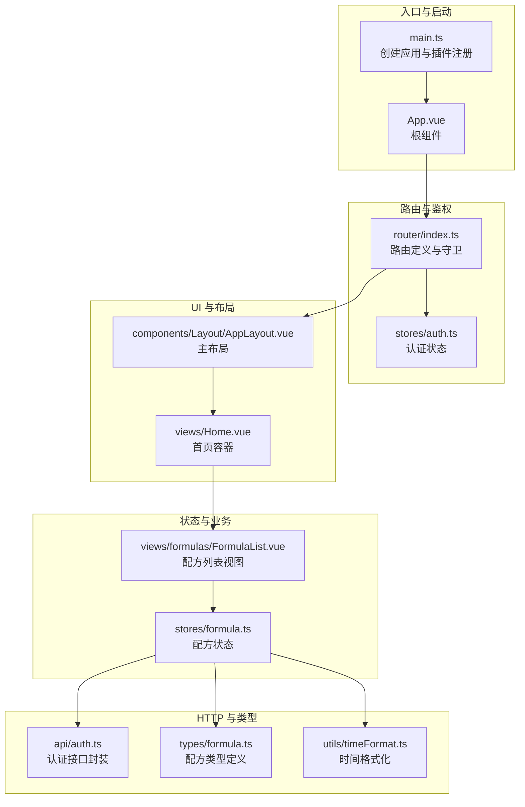
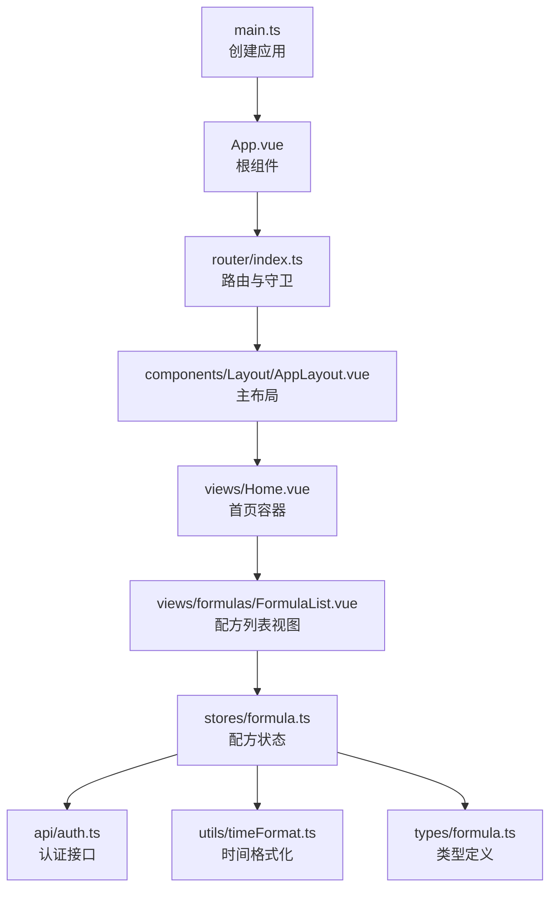
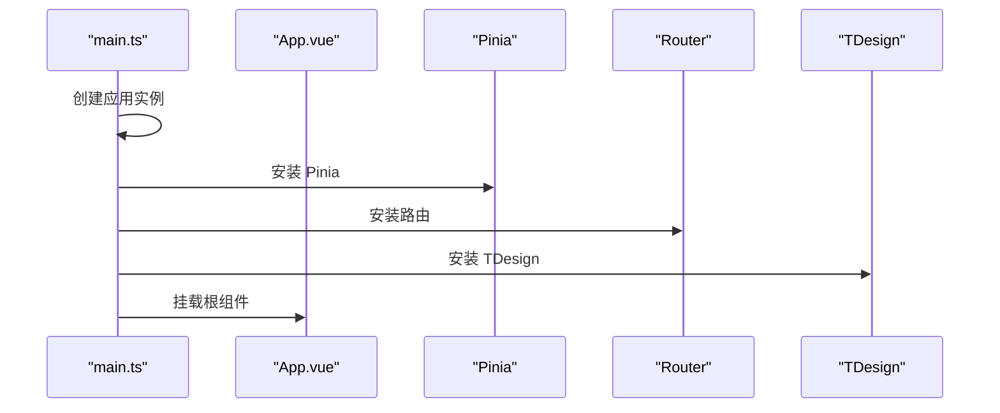
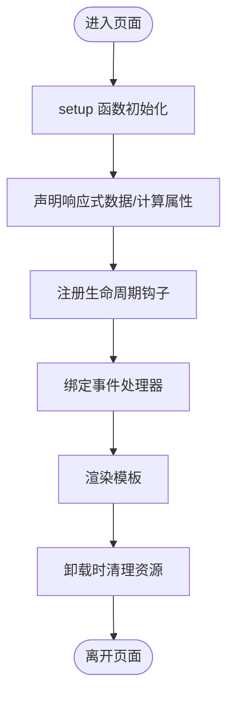
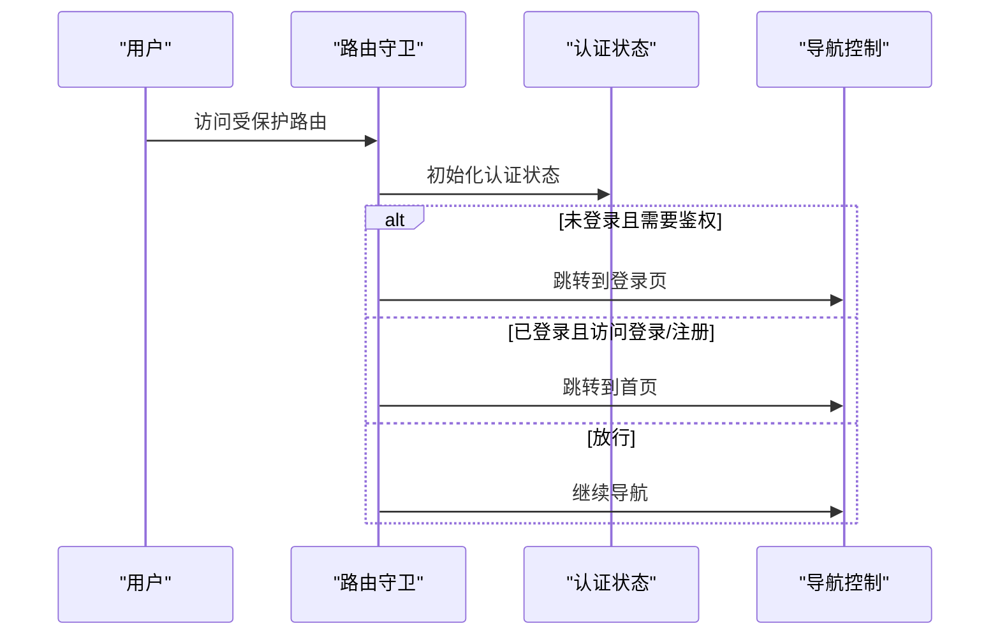
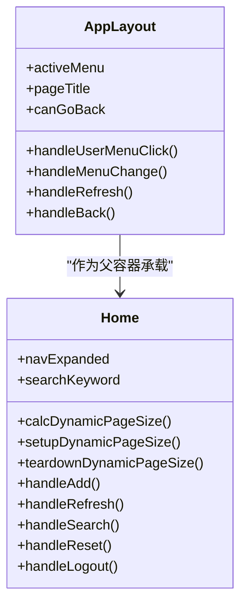
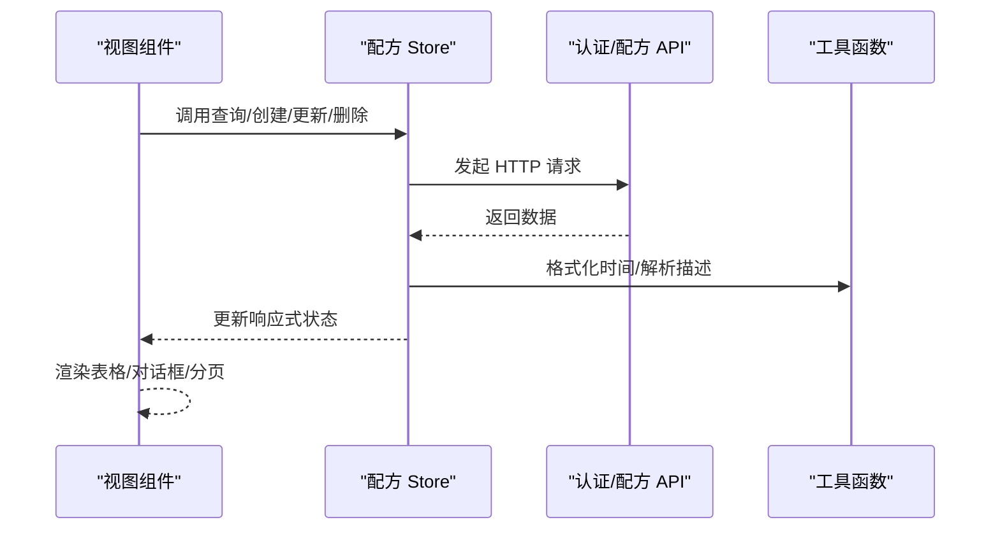
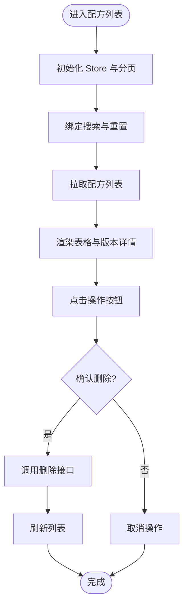
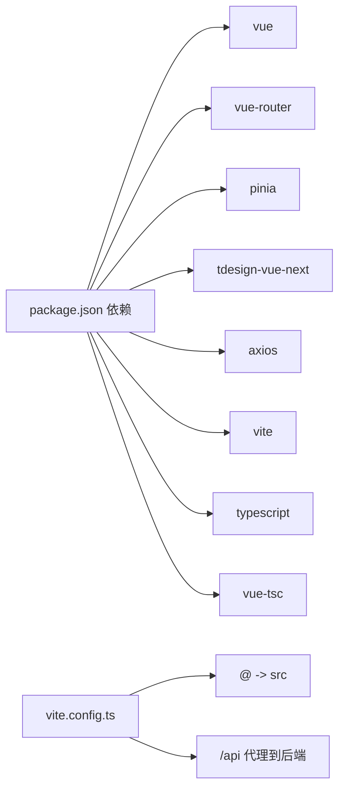

# Vue 3 应用架构

<cite>
**本文引用的文件**
- [frontend/src/main.ts](file://frontend/src/main.ts)
- [frontend/src/App.vue](file://frontend/src/App.vue)
- [frontend/vite.config.ts](file://frontend/vite.config.ts)
- [frontend/package.json](file://frontend/package.json)
- [frontend/tsconfig.json](file://frontend/tsconfig.json)
- [frontend/tsconfig.node.json](file://frontend/tsconfig.node.json)
- [frontend/src/router/index.ts](file://frontend/src/router/index.ts)
- [frontend/src/stores/auth.ts](file://frontend/src/stores/auth.ts)
- [frontend/src/components/Layout/AppLayout.vue](file://frontend/src/components/Layout/AppLayout.vue)
- [frontend/src/views/Home.vue](file://frontend/src/views/Home.vue)
- [frontend/src/stores/formula.ts](file://frontend/src/stores/formula.ts)
- [frontend/src/views/formulas/FormulaList.vue](file://frontend/src/views/formulas/FormulaList.vue)
- [frontend/src/api/auth.ts](file://frontend/src/api/auth.ts)
- [frontend/src/types/formula.ts](file://frontend/src/types/formula.ts)
- [frontend/src/utils/timeFormat.ts](file://frontend/src/utils/timeFormat.ts)
</cite>

## 目录
1. [引言](#引言)
2. [项目结构](#项目结构)
3. [核心组件](#核心组件)
4. [架构总览](#架构总览)
5. [详细组件分析](#详细组件分析)
6. [依赖分析](#依赖分析)
7. [性能考虑](#性能考虑)
8. [故障排查指南](#故障排查指南)
9. [结论](#结论)
10. [附录](#附录)

## 引言
本文件系统性梳理前端 Vue 3 应用的架构与实现细节，覆盖应用初始化流程、插件注册顺序与全局配置、组合式 API 使用模式、路由鉴权策略、状态管理设计、构建工具配置与优化、TypeScript 集成与类型最佳实践，以及组件层次与代码组织规范。目标是帮助开发者快速理解并高效扩展该应用。

## 项目结构
前端采用“入口应用 + 路由 + Pinia 状态 + 组件层 + 视图层 + API 类型工具”的分层组织方式，配合 Vite 构建与 TypeScript 类型约束，形成清晰的职责边界与可维护性。

图表来源
- [frontend/src/main.ts:1-17](file://frontend/src/main.ts#L1-L17)
- [frontend/src/App.vue:1-10](file://frontend/src/App.vue#L1-L10)
- [frontend/src/router/index.ts:1-165](file://frontend/src/router/index.ts#L1-L165)
- [frontend/src/stores/auth.ts:1-64](file://frontend/src/stores/auth.ts#L1-L64)
- [frontend/src/components/Layout/AppLayout.vue:1-392](file://frontend/src/components/Layout/AppLayout.vue#L1-L392)
- [frontend/src/views/Home.vue:1-800](file://frontend/src/views/Home.vue#L1-L800)
- [frontend/src/stores/formula.ts:1-166](file://frontend/src/stores/formula.ts#L1-L166)
- [frontend/src/views/formulas/FormulaList.vue:1-741](file://frontend/src/views/formulas/FormulaList.vue#L1-L741)
- [frontend/src/api/auth.ts:1-36](file://frontend/src/api/auth.ts#L1-L36)
- [frontend/src/types/formula.ts:1-33](file://frontend/src/types/formula.ts#L1-L33)
- [frontend/src/utils/timeFormat.ts:1-24](file://frontend/src/utils/timeFormat.ts#L1-L24)

章节来源
- [frontend/src/main.ts:1-17](file://frontend/src/main.ts#L1-L17)
- [frontend/src/App.vue:1-10](file://frontend/src/App.vue#L1-L10)
- [frontend/vite.config.ts:1-23](file://frontend/vite.config.ts#L1-L23)
- [frontend/package.json:1-30](file://frontend/package.json#L1-L30)
- [frontend/tsconfig.json:1-32](file://frontend/tsconfig.json#L1-L32)
- [frontend/tsconfig.node.json:1-11](file://frontend/tsconfig.node.json#L1-L11)

## 核心组件
- 应用入口与初始化：在入口文件中创建应用实例、安装 Pinia、路由与 TDesign 插件，最后挂载根组件。
- 根组件：最外层容器，内部仅包含路由视图出口，承载全局样式与主题。
- 路由与鉴权：集中定义页面路由、面包屑标题与鉴权守卫；在守卫中初始化认证状态并控制访问。
- 主布局：提供头部导航、侧边菜单、内容区与用户下拉菜单，统一交互与视觉风格。
- 首页容器：负责动态计算分页尺寸、日期天气祝福语等交互逻辑，作为各子页面的父容器。
- 状态管理：以组合式 Store 模式组织认证、配方等业务状态，结合 Pinia 提供响应式与持久化能力。
- 视图组件：围绕具体业务页面（如配方列表）组织数据、交互与 UI，解耦于布局与状态。
- API 与类型：统一的 HTTP 封装、认证接口与类型定义，确保前后端契约一致。
- 工具函数：时间格式化等通用工具，避免重复实现。

章节来源
- [frontend/src/main.ts:1-17](file://frontend/src/main.ts#L1-L17)
- [frontend/src/App.vue:1-10](file://frontend/src/App.vue#L1-L10)
- [frontend/src/router/index.ts:1-165](file://frontend/src/router/index.ts#L1-L165)
- [frontend/src/components/Layout/AppLayout.vue:1-392](file://frontend/src/components/Layout/AppLayout.vue#L1-L392)
- [frontend/src/views/Home.vue:1-800](file://frontend/src/views/Home.vue#L1-L800)
- [frontend/src/stores/formula.ts:1-166](file://frontend/src/stores/formula.ts#L1-L166)
- [frontend/src/views/formulas/FormulaList.vue:1-741](file://frontend/src/views/formulas/FormulaList.vue#L1-L741)
- [frontend/src/api/auth.ts:1-36](file://frontend/src/api/auth.ts#L1-L36)
- [frontend/src/types/formula.ts:1-33](file://frontend/src/types/formula.ts#L1-L33)
- [frontend/src/utils/timeFormat.ts:1-24](file://frontend/src/utils/timeFormat.ts#L1-L24)

## 架构总览
应用采用“单页应用 + 组合式 Store + 组件化视图”的架构，结合 TDesign UI 与 Pinia 状态管理，实现清晰的职责分离与良好的可扩展性。

图表来源
- [frontend/src/main.ts:1-17](file://frontend/src/main.ts#L1-L17)
- [frontend/src/App.vue:1-10](file://frontend/src/App.vue#L1-L10)
- [frontend/src/router/index.ts:1-165](file://frontend/src/router/index.ts#L1-L165)
- [frontend/src/components/Layout/AppLayout.vue:1-392](file://frontend/src/components/Layout/AppLayout.vue#L1-L392)
- [frontend/src/views/Home.vue:1-800](file://frontend/src/views/Home.vue#L1-L800)
- [frontend/src/views/formulas/FormulaList.vue:1-741](file://frontend/src/views/formulas/FormulaList.vue#L1-L741)
- [frontend/src/stores/formula.ts:1-166](file://frontend/src/stores/formula.ts#L1-L166)
- [frontend/src/api/auth.ts:1-36](file://frontend/src/api/auth.ts#L1-L36)
- [frontend/src/utils/timeFormat.ts:1-24](file://frontend/src/utils/timeFormat.ts#L1-L24)
- [frontend/src/types/formula.ts:1-33](file://frontend/src/types/formula.ts#L1-L33)

## 详细组件分析

### 应用初始化与插件注册
- 初始化流程：创建应用实例，安装 Pinia、路由与 TDesign 插件，最后挂载根组件。
- 插件顺序：先安装 Pinia（提供全局状态），再安装路由（提供导航与守卫），最后安装 UI 插件（提供组件与主题）。
- 全局配置：引入全局样式与主题样式，确保首屏一致性。

图表来源
- [frontend/src/main.ts:1-17](file://frontend/src/main.ts#L1-L17)

章节来源
- [frontend/src/main.ts:1-17](file://frontend/src/main.ts#L1-L17)

### 组合式 API 使用模式
- setup 函数：在脚本块中声明响应式数据、计算属性、生命周期钩子与方法，集中处理页面逻辑。
- 响应式数据：使用 ref/computed 管理本地状态；通过 Store 管理跨组件共享状态。
- 生命周期钩子：在 onMounted/onUnmounted 中执行副作用（如动态分页计算、事件监听与清理）。
- 方法与事件：在模板中绑定事件处理器，调用 Store 或路由方法，实现页面交互。

图表来源
- [frontend/src/views/Home.vue:233-526](file://frontend/src/views/Home.vue#L233-L526)
- [frontend/src/views/formulas/FormulaList.vue:184-356](file://frontend/src/views/formulas/FormulaList.vue#L184-L356)

章节来源
- [frontend/src/views/Home.vue:233-526](file://frontend/src/views/Home.vue#L233-L526)
- [frontend/src/views/formulas/FormulaList.vue:184-356](file://frontend/src/views/formulas/FormulaList.vue#L184-L356)

### 路由与鉴权
- 路由定义：使用 history 模式，按模块划分视图组件，支持嵌套路由与动态导入。
- 鉴权守卫：在 beforeEach 中初始化认证状态，判断是否需要登录与是否已登录，进行跳转控制。
- 标题与面包屑：通过 meta.title 与路由路径映射生成面包屑与页面标题。

图表来源
- [frontend/src/router/index.ts:148-162](file://frontend/src/router/index.ts#L148-L162)
- [frontend/src/stores/auth.ts:12-17](file://frontend/src/stores/auth.ts#L12-L17)

章节来源
- [frontend/src/router/index.ts:1-165](file://frontend/src/router/index.ts#L1-L165)
- [frontend/src/stores/auth.ts:1-64](file://frontend/src/stores/auth.ts#L1-L64)

### 主布局与首页容器
- 主布局：提供头部导航、面包屑、用户菜单与侧边菜单，统一交互与视觉风格。
- 首页容器：负责动态计算分页尺寸、日期天气祝福语、导航切换与搜索事件广播，作为子页面父容器。

图表来源
- [frontend/src/components/Layout/AppLayout.vue:103-174](file://frontend/src/components/Layout/AppLayout.vue#L103-L174)
- [frontend/src/views/Home.vue:233-526](file://frontend/src/views/Home.vue#L233-L526)

章节来源
- [frontend/src/components/Layout/AppLayout.vue:1-392](file://frontend/src/components/Layout/AppLayout.vue#L1-L392)
- [frontend/src/views/Home.vue:1-800](file://frontend/src/views/Home.vue#L1-L800)

### 状态管理与业务逻辑
- 认证状态：使用组合式 Store 管理用户信息、加载状态与登录/注册/登出流程。
- 配方状态：封装列表查询、详情解析、创建/更新/删除与分页参数，统一时间格式化与描述解析。
- 依赖关系：视图组件通过 Store 与 API 交互，Store 调用 API 并格式化数据，最终驱动视图渲染。

图表来源
- [frontend/src/stores/formula.ts:18-133](file://frontend/src/stores/formula.ts#L18-L133)
- [frontend/src/api/auth.ts:7-17](file://frontend/src/api/auth.ts#L7-L17)
- [frontend/src/utils/timeFormat.ts:10-23](file://frontend/src/utils/timeFormat.ts#L10-L23)

章节来源
- [frontend/src/stores/auth.ts:1-64](file://frontend/src/stores/auth.ts#L1-L64)
- [frontend/src/stores/formula.ts:1-166](file://frontend/src/stores/formula.ts#L1-L166)
- [frontend/src/api/auth.ts:1-36](file://frontend/src/api/auth.ts#L1-L36)
- [frontend/src/utils/timeFormat.ts:1-24](file://frontend/src/utils/timeFormat.ts#L1-L24)

### 视图组件与交互
- 配方列表：展示配方数据、状态标签、版本记录与变更详情，支持搜索、分页与批量操作。
- 交互设计：通过弹窗确认删除、下拉菜单更多操作、标签页切换与路由跳转，提升可用性。

图表来源
- [frontend/src/views/formulas/FormulaList.vue:271-355](file://frontend/src/views/formulas/FormulaList.vue#L271-L355)
- [frontend/src/stores/formula.ts:18-101](file://frontend/src/stores/formula.ts#L18-L101)

章节来源
- [frontend/src/views/formulas/FormulaList.vue:1-741](file://frontend/src/views/formulas/FormulaList.vue#L1-L741)
- [frontend/src/stores/formula.ts:1-166](file://frontend/src/stores/formula.ts#L1-L166)

## 依赖分析
- 运行时依赖：Vue 3、Vue Router、Pinia、TDesign、Axios、VeeValidate、Yup。
- 开发依赖：Vite、@vitejs/plugin-vue、TypeScript、vue-tsc、Sass、TSX。
- 路径别名：通过 Vite 配置将 @ 映射到 src 目录，简化导入路径。
- 构建脚本：dev/build/preview，构建前先进行类型检查。

图表来源
- [frontend/package.json:12-28](file://frontend/package.json#L12-L28)
- [frontend/vite.config.ts:5-22](file://frontend/vite.config.ts#L5-L22)

章节来源
- [frontend/package.json:1-30](file://frontend/package.json#L1-L30)
- [frontend/vite.config.ts:1-23](file://frontend/vite.config.ts#L1-L23)

## 性能考虑
- 懒加载与路由分割：路由组件采用动态导入，减少首屏体积。
- 动态分页：根据内容区高度动态计算分页条目数，避免不必要的渲染与滚动。
- 事件监听与清理：在卸载阶段移除 ResizeObserver 与全局事件监听，防止内存泄漏。
- 代理与端口：开发服务器默认端口与代理配置，降低跨域与联调成本。

章节来源
- [frontend/src/router/index.ts:10-146](file://frontend/src/router/index.ts#L10-L146)
- [frontend/src/views/Home.vue:250-310](file://frontend/src/views/Home.vue#L250-L310)
- [frontend/vite.config.ts:12-21](file://frontend/vite.config.ts#L12-L21)

## 故障排查指南
- 登录/注册失败：检查认证接口返回结构与错误提示，确认 Token 与用户信息缓存逻辑。
- 数据解析异常：关注 Store 中对 description 与 materials 的解析，避免 JSON 解析失败导致渲染异常。
- 时间显示异常：确认时间格式化工具对非法日期的兜底处理。
- 路由跳转异常：核对守卫中的鉴权逻辑与 meta.requiresAuth 设置。

章节来源
- [frontend/src/api/auth.ts:19-35](file://frontend/src/api/auth.ts#L19-L35)
- [frontend/src/stores/formula.ts:137-165](file://frontend/src/stores/formula.ts#L137-L165)
- [frontend/src/utils/timeFormat.ts:10-16](file://frontend/src/utils/timeFormat.ts#L10-L16)
- [frontend/src/router/index.ts:148-162](file://frontend/src/router/index.ts#L148-L162)

## 结论
该 Vue 3 应用通过清晰的分层与组合式 API 实现了高内聚低耦合的架构：入口与插件注册简洁明确，路由与鉴权集中可控，状态管理以 Store 为核心，视图组件职责单一，配合 Vite 与 TypeScript 提升开发效率与质量。建议在后续迭代中持续完善类型体系、增强错误处理与性能监控，并保持组件与状态的演进一致性。

## 附录

### TypeScript 集成与类型最佳实践
- 编译选项：启用严格模式、模块解析为 bundler、允许 TS 扩展名、禁用 emit。
- 路径映射：baseUrl 与 paths 对应 @/*，与 Vite alias 保持一致。
- 多 tsconfig：根 tsconfig 与 node 专用 tsconfig 分离，避免环境差异。

章节来源
- [frontend/tsconfig.json:2-27](file://frontend/tsconfig.json#L2-L27)
- [frontend/tsconfig.node.json:1-11](file://frontend/tsconfig.node.json#L1-L11)

### 组件层次与代码组织规范
- 层级结构：入口 → 根组件 → 路由 → 布局 → 视图 → 组件 → 工具。
- 文件命名：按功能模块划分目录，组件与视图采用 PascalCase，Store 与 API 采用小驼峰。
- 导入路径：统一使用 @ 前缀，避免相对路径过深。
- 类型定义：将公共类型集中于 types 目录，避免重复定义。

章节来源
- [frontend/src/types/formula.ts:1-33](file://frontend/src/types/formula.ts#L1-L33)
- [frontend/tsconfig.json:24-27](file://frontend/tsconfig.json#L24-L27)