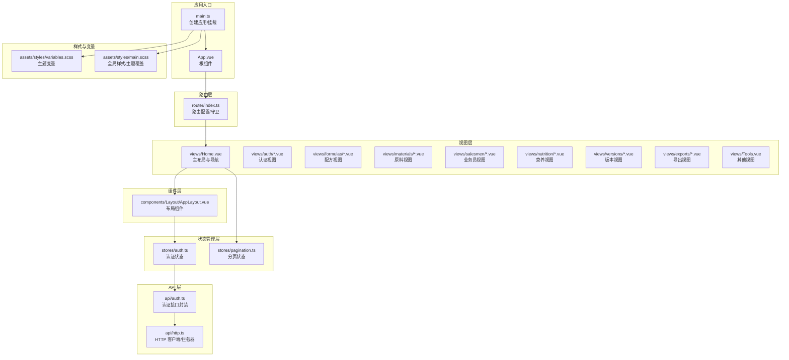
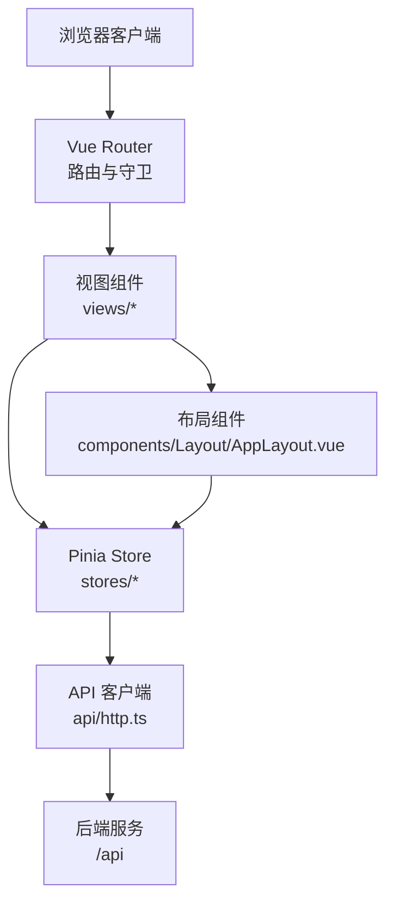
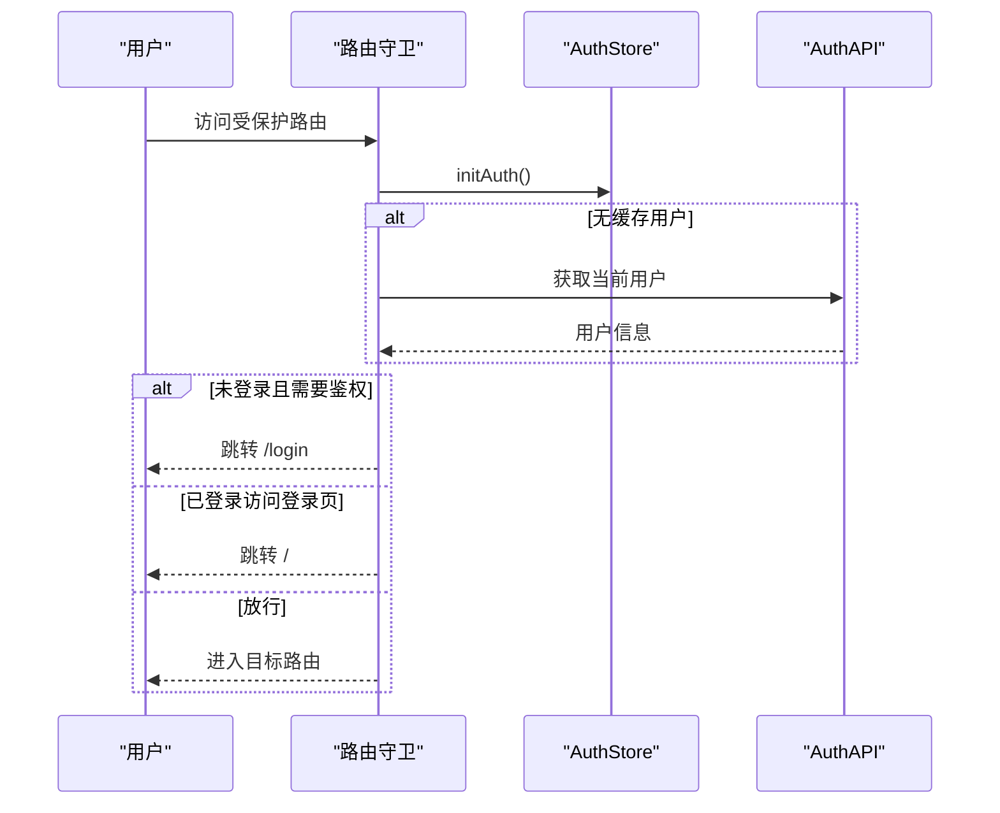
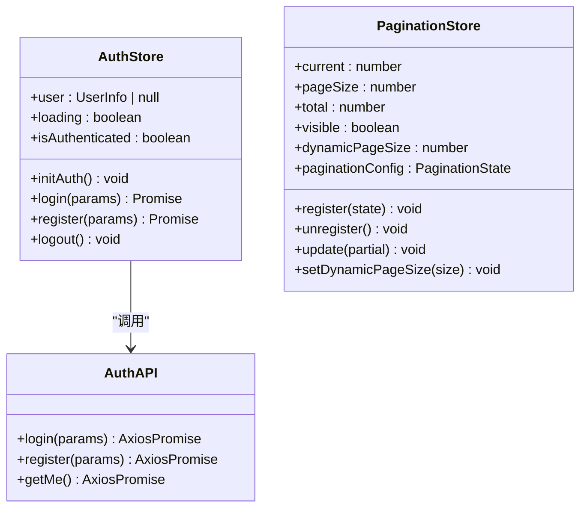
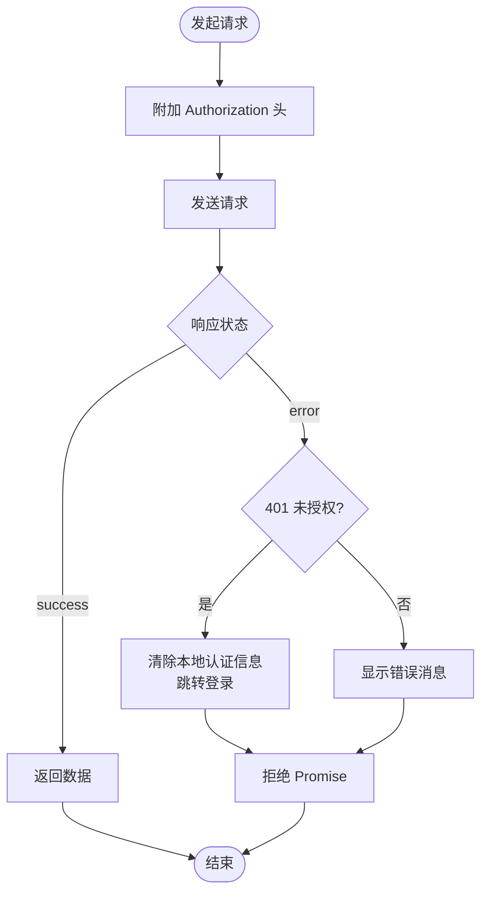
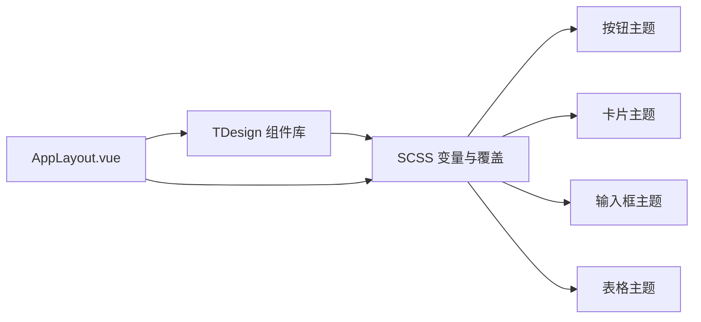
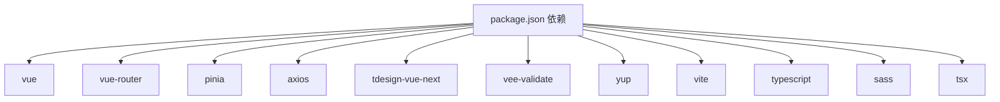

# 前端开发指南

<cite>
**本文档引用的文件**
- [frontend/src/main.ts](file://frontend/src/main.ts)
- [frontend/src/App.vue](file://frontend/src/App.vue)
- [frontend/src/router/index.ts](file://frontend/src/router/index.ts)
- [frontend/package.json](file://frontend/package.json)
- [frontend/vite.config.ts](file://frontend/vite.config.ts)
- [frontend/src/stores/auth.ts](file://frontend/src/stores/auth.ts)
- [frontend/src/stores/pagination.ts](file://frontend/src/stores/pagination.ts)
- [frontend/src/api/http.ts](file://frontend/src/api/http.ts)
- [frontend/src/api/auth.ts](file://frontend/src/api/auth.ts)
- [frontend/src/assets/styles/main.scss](file://frontend/src/assets/styles/main.scss)
- [frontend/src/assets/styles/variables.scss](file://frontend/src/assets/styles/variables.scss)
- [frontend/src/components/Layout/AppLayout.vue](file://frontend/src/components/Layout/AppLayout.vue)
- [frontend/src/views/Home.vue](file://frontend/src/views/Home.vue)
- [frontend/tsconfig.json](file://frontend/tsconfig.json)
</cite>

## 目录
1. [简介](#简介)
2. [项目结构](#项目结构)
3. [核心组件](#核心组件)
4. [架构总览](#架构总览)
5. [详细组件分析](#详细组件分析)
6. [依赖关系分析](#依赖关系分析)
7. [性能考虑](#性能考虑)
8. [故障排除指南](#故障排除指南)
9. [结论](#结论)
10. [附录](#附录)

## 简介
本指南面向 TingStudio 前端团队，系统性阐述 Vue 3 应用的架构设计与最佳实践，涵盖组合式 API 使用、组件化开发模式、路由配置、Pinia 状态管理、TDesign Vue Next 组件库集成与主题定制、API 客户端设计与 HTTP 请求处理机制，以及组件开发规范、样式管理与构建配置。目标是帮助开发者快速理解并高效扩展系统。

## 项目结构
前端采用模块化目录组织，按功能域划分路由视图、通用组件、状态管理与 API 层，配合 Vite 构建与 TypeScript 类型支持，形成清晰的职责边界与可维护性。

**图表来源**
- [frontend/src/main.ts:1-17](file://frontend/src/main.ts#L1-L17)
- [frontend/src/App.vue:1-10](file://frontend/src/App.vue#L1-L10)
- [frontend/src/router/index.ts:1-165](file://frontend/src/router/index.ts#L1-L165)
- [frontend/src/views/Home.vue:1-800](file://frontend/src/views/Home.vue#L1-L800)
- [frontend/src/components/Layout/AppLayout.vue:1-392](file://frontend/src/components/Layout/AppLayout.vue#L1-L392)
- [frontend/src/stores/auth.ts:1-64](file://frontend/src/stores/auth.ts#L1-L64)
- [frontend/src/stores/pagination.ts:1-89](file://frontend/src/stores/pagination.ts#L1-L89)
- [frontend/src/api/http.ts:1-58](file://frontend/src/api/http.ts#L1-L58)
- [frontend/src/api/auth.ts:1-36](file://frontend/src/api/auth.ts#L1-L36)
- [frontend/src/assets/styles/variables.scss:1-55](file://frontend/src/assets/styles/variables.scss#L1-L55)
- [frontend/src/assets/styles/main.scss:1-203](file://frontend/src/assets/styles/main.scss#L1-L203)

**章节来源**
- [frontend/src/main.ts:1-17](file://frontend/src/main.ts#L1-L17)
- [frontend/src/App.vue:1-10](file://frontend/src/App.vue#L1-L10)
- [frontend/src/router/index.ts:1-165](file://frontend/src/router/index.ts#L1-L165)
- [frontend/src/views/Home.vue:1-800](file://frontend/src/views/Home.vue#L1-L800)
- [frontend/src/components/Layout/AppLayout.vue:1-392](file://frontend/src/components/Layout/AppLayout.vue#L1-L392)
- [frontend/src/stores/auth.ts:1-64](file://frontend/src/stores/auth.ts#L1-L64)
- [frontend/src/stores/pagination.ts:1-89](file://frontend/src/stores/pagination.ts#L1-L89)
- [frontend/src/api/http.ts:1-58](file://frontend/src/api/http.ts#L1-L58)
- [frontend/src/api/auth.ts:1-36](file://frontend/src/api/auth.ts#L1-L36)
- [frontend/src/assets/styles/variables.scss:1-55](file://frontend/src/assets/styles/variables.scss#L1-L55)
- [frontend/src/assets/styles/main.scss:1-203](file://frontend/src/assets/styles/main.scss#L1-L203)

## 核心组件
- 应用入口与插件注册：在入口文件中初始化 Vue 应用、Pinia、路由与 TDesign，并引入全局样式。
- 根组件：最外层容器，内部仅包含路由出口，便于统一布局与状态注入。
- 路由系统：集中配置页面级路由与嵌套路由，使用前置守卫进行鉴权控制与用户初始化。
- 布局组件：提供头部导航、面包屑、侧边菜单与内容区域，统一用户体验与交互行为。
- 主题样式：通过 SCSS 变量与深度选择器覆盖 TDesign 组件风格，形成统一的“粉嫩”视觉体系。

**章节来源**
- [frontend/src/main.ts:1-17](file://frontend/src/main.ts#L1-L17)
- [frontend/src/App.vue:1-10](file://frontend/src/App.vue#L1-L10)
- [frontend/src/router/index.ts:1-165](file://frontend/src/router/index.ts#L1-L165)
- [frontend/src/components/Layout/AppLayout.vue:1-392](file://frontend/src/components/Layout/AppLayout.vue#L1-L392)
- [frontend/src/assets/styles/variables.scss:1-55](file://frontend/src/assets/styles/variables.scss#L1-L55)
- [frontend/src/assets/styles/main.scss:1-203](file://frontend/src/assets/styles/main.scss#L1-L203)

## 架构总览
应用采用“视图 + 组件 + 状态 + API”的分层架构，结合组合式 API 与函数式 Store，实现逻辑清晰、可测试性强的前端系统。

**图表来源**
- [frontend/src/router/index.ts:1-165](file://frontend/src/router/index.ts#L1-L165)
- [frontend/src/views/Home.vue:1-800](file://frontend/src/views/Home.vue#L1-L800)
- [frontend/src/components/Layout/AppLayout.vue:1-392](file://frontend/src/components/Layout/AppLayout.vue#L1-L392)
- [frontend/src/stores/auth.ts:1-64](file://frontend/src/stores/auth.ts#L1-L64)
- [frontend/src/stores/pagination.ts:1-89](file://frontend/src/stores/pagination.ts#L1-L89)
- [frontend/src/api/http.ts:1-58](file://frontend/src/api/http.ts#L1-L58)

## 详细组件分析

### 路由与鉴权流程
- 路由配置：集中定义页面路由与嵌套子路由，为每个路由设置标题与鉴权需求。
- 鉴权守卫：在进入路由前检查用户状态，未登录则跳转登录；已登录访问登录/注册页则重定向首页。
- 用户初始化：首次访问时尝试读取本地缓存用户信息，避免重复请求。

**图表来源**
- [frontend/src/router/index.ts:148-162](file://frontend/src/router/index.ts#L148-L162)
- [frontend/src/stores/auth.ts:12-17](file://frontend/src/stores/auth.ts#L12-L17)
- [frontend/src/api/auth.ts:14-16](file://frontend/src/api/auth.ts#L14-L16)

**章节来源**
- [frontend/src/router/index.ts:1-165](file://frontend/src/router/index.ts#L1-L165)
- [frontend/src/stores/auth.ts:1-64](file://frontend/src/stores/auth.ts#L1-L64)
- [frontend/src/api/auth.ts:1-36](file://frontend/src/api/auth.ts#L1-L36)

### Pinia 状态管理设计
- 认证状态（AuthStore）：管理用户信息、登录/注册/登出流程、加载状态与鉴权标识。
- 分页状态（PaginationStore）：集中管理分页参数、可见性与动态页大小计算，供各列表页复用。
- 设计原则：使用组合式 Store 暴露响应式状态与方法，避免过度嵌套与副作用，通过计算属性派生视图所需数据。

**图表来源**
- [frontend/src/stores/auth.ts:6-62](file://frontend/src/stores/auth.ts#L6-L62)
- [frontend/src/stores/pagination.ts:14-87](file://frontend/src/stores/pagination.ts#L14-L87)
- [frontend/src/api/auth.ts:7-17](file://frontend/src/api/auth.ts#L7-L17)

**章节来源**
- [frontend/src/stores/auth.ts:1-64](file://frontend/src/stores/auth.ts#L1-L64)
- [frontend/src/stores/pagination.ts:1-89](file://frontend/src/stores/pagination.ts#L1-L89)
- [frontend/src/api/auth.ts:1-36](file://frontend/src/api/auth.ts#L1-L36)

### API 客户端与 HTTP 请求处理
- 基础配置：统一 base URL、超时时间与 Content-Type。
- 请求拦截：自动附加本地存储的 Token。
- 响应拦截：统一错误处理与消息提示；401 自动清理本地认证信息并跳转登录。
- 认证数据持久化：登录成功后写入 Token 与用户信息，登出时清除。

**图表来源**
- [frontend/src/api/http.ts:6-43](file://frontend/src/api/http.ts#L6-L43)

**章节来源**
- [frontend/src/api/http.ts:1-58](file://frontend/src/api/http.ts#L1-L58)
- [frontend/src/api/auth.ts:19-35](file://frontend/src/api/auth.ts#L19-L35)

### TDesign 组件库集成与主题定制
- 组件库集成：在入口文件安装 TDesign 插件，全局引入基础样式。
- 主题定制：通过 SCSS 变量定义品牌色、字体、间距与阴影；使用深度选择器覆盖 TDesign 组件默认样式，统一按钮、卡片、输入框、表格等组件风格。
- 布局组件：AppLayout 使用 TDesign 布局、菜单、面包屑与下拉组件，结合动画与交互增强用户体验。

**图表来源**
- [frontend/src/main.ts:3-4](file://frontend/src/main.ts#L3-L4)
- [frontend/src/assets/styles/variables.scss:1-55](file://frontend/src/assets/styles/variables.scss#L1-L55)
- [frontend/src/assets/styles/main.scss:87-191](file://frontend/src/assets/styles/main.scss#L87-L191)
- [frontend/src/components/Layout/AppLayout.vue:31-54](file://frontend/src/components/Layout/AppLayout.vue#L31-L54)

**章节来源**
- [frontend/src/main.ts:1-17](file://frontend/src/main.ts#L1-L17)
- [frontend/src/assets/styles/variables.scss:1-55](file://frontend/src/assets/styles/variables.scss#L1-L55)
- [frontend/src/assets/styles/main.scss:1-203](file://frontend/src/assets/styles/main.scss#L1-L203)
- [frontend/src/components/Layout/AppLayout.vue:1-392](file://frontend/src/components/Layout/AppLayout.vue#L1-L392)

### 组件开发规范与样式管理
- 组件结构：使用组合式 API 编写逻辑，模板内聚、样式作用域化，必要时使用深度选择器覆盖第三方组件。
- 样式组织：变量集中管理，全局样式统一入口，组件局部样式与全局样式分离，避免样式冲突。
- 开发建议：优先使用 TDesign 组件，遵循其设计语言；自定义组件时保持一致的命名与层级结构。

**章节来源**
- [frontend/src/assets/styles/main.scss:1-203](file://frontend/src/assets/styles/main.scss#L1-L203)
- [frontend/src/assets/styles/variables.scss:1-55](file://frontend/src/assets/styles/variables.scss#L1-L55)
- [frontend/src/components/Layout/AppLayout.vue:176-391](file://frontend/src/components/Layout/AppLayout.vue#L176-L391)

## 依赖关系分析
- 运行时依赖：Vue 3、Vue Router、Pinia、Axios、TDesign Vue Next、vee-validate、yup。
- 构建依赖：Vite、Vue 插件、TypeScript、Sass、tsx。
- 代理配置：开发环境将 /api 代理到后端服务端口，便于前后端联调。

**图表来源**
- [frontend/package.json:12-28](file://frontend/package.json#L12-L28)

**章节来源**
- [frontend/package.json:1-30](file://frontend/package.json#L1-L30)
- [frontend/vite.config.ts:15-21](file://frontend/vite.config.ts#L15-L21)

## 性能考虑
- 路由懒加载：路由组件采用动态导入，减少首屏包体。
- 动态分页：根据可视区域高度动态计算分页大小，提升大数据量场景下的渲染性能。
- 样式优化：统一变量与覆盖策略，避免重复样式与深层选择器导致的重绘。
- 构建优化：使用 Vite 快速冷启动与热更新，TypeScript 严格模式保证类型安全。

**章节来源**
- [frontend/src/router/index.ts:10-142](file://frontend/src/router/index.ts#L10-L142)
- [frontend/src/views/Home.vue:250-305](file://frontend/src/views/Home.vue#L250-L305)
- [frontend/vite.config.ts:1-23](file://frontend/vite.config.ts#L1-L23)

## 故障排除指南
- 登录状态异常
  - 现象：频繁跳转登录或无法访问受保护页面。
  - 排查：确认本地是否保存有效 Token 与用户信息；检查鉴权守卫逻辑与认证接口返回。
- 401 未授权
  - 现象：出现“登录已过期，请重新登录”提示。
  - 排查：确认请求拦截器是否正确附加 Token；检查后端签发与校验逻辑。
- 样式覆盖失效
  - 现象：按钮、卡片或表格样式未按预期。
  - 排查：确认深度选择器层级与优先级；检查变量值是否正确导入。
- 构建/代理问题
  - 现象：接口请求 404 或跨域。
  - 排查：确认 Vite 代理配置指向正确的后端地址；检查网络连通性。

**章节来源**
- [frontend/src/router/index.ts:148-162](file://frontend/src/router/index.ts#L148-L162)
- [frontend/src/api/http.ts:31-42](file://frontend/src/api/http.ts#L31-L42)
- [frontend/vite.config.ts:15-21](file://frontend/vite.config.ts#L15-L21)

## 结论
TingStudio 前端以 Vue 3 + Pinia + TDesign 为核心技术栈，结合路由守卫与 API 客户端拦截器，实现了清晰的鉴权与数据流管理。通过 SCSS 变量与深度选择器，完成了统一的主题定制与组件风格收敛。建议在后续迭代中持续完善组件抽象、测试覆盖与性能监控，以保障系统的长期可维护性与稳定性。

## 附录
- 路径别名：@ 指向 src 目录，便于模块导入与路径一致性。
- TypeScript 配置：启用严格模式与模块解析，确保类型安全与模块解析正确。

**章节来源**
- [frontend/tsconfig.json:23-27](file://frontend/tsconfig.json#L23-L27)
- [frontend/tsconfig.json:18-21](file://frontend/tsconfig.json#L18-L21)