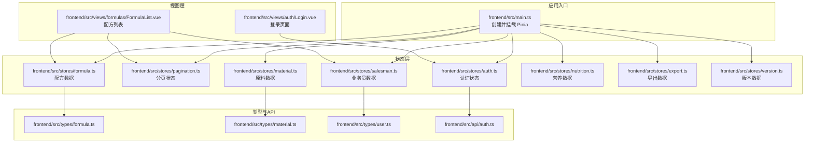
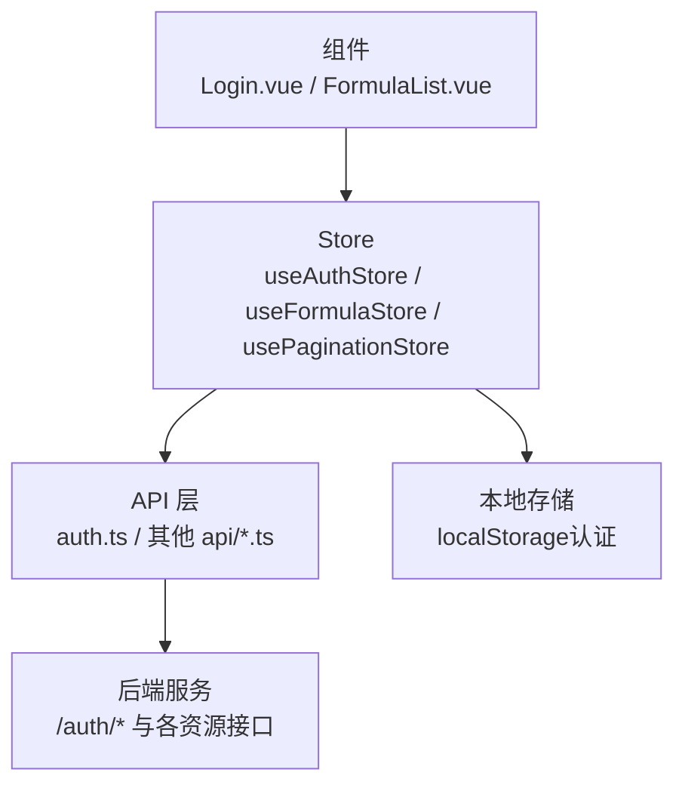
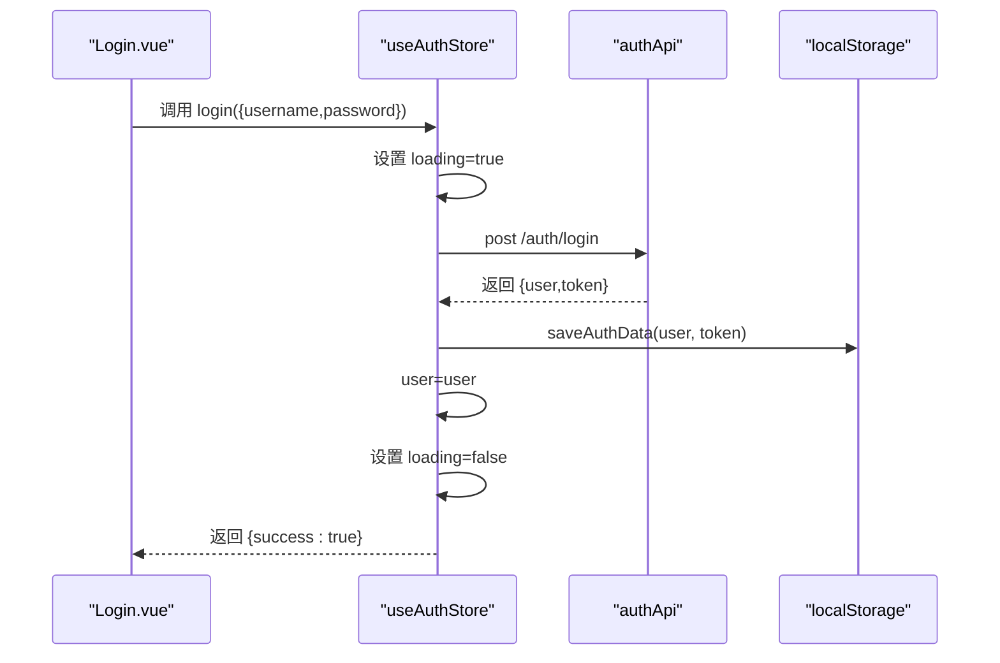
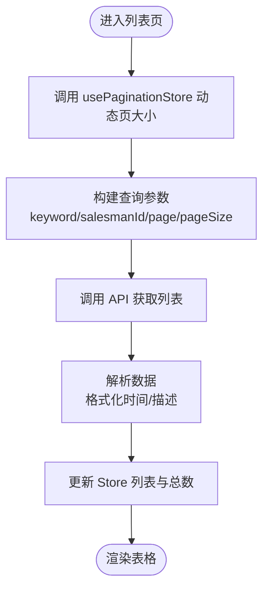
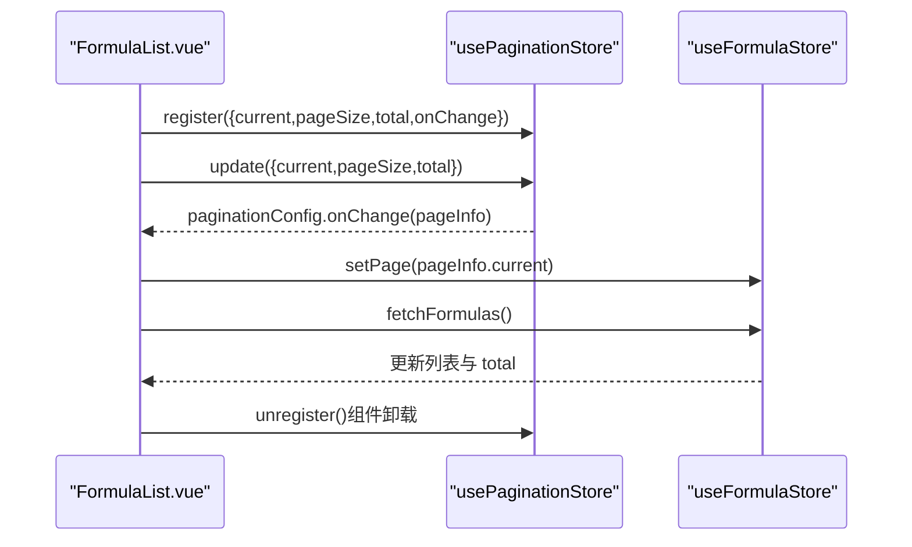
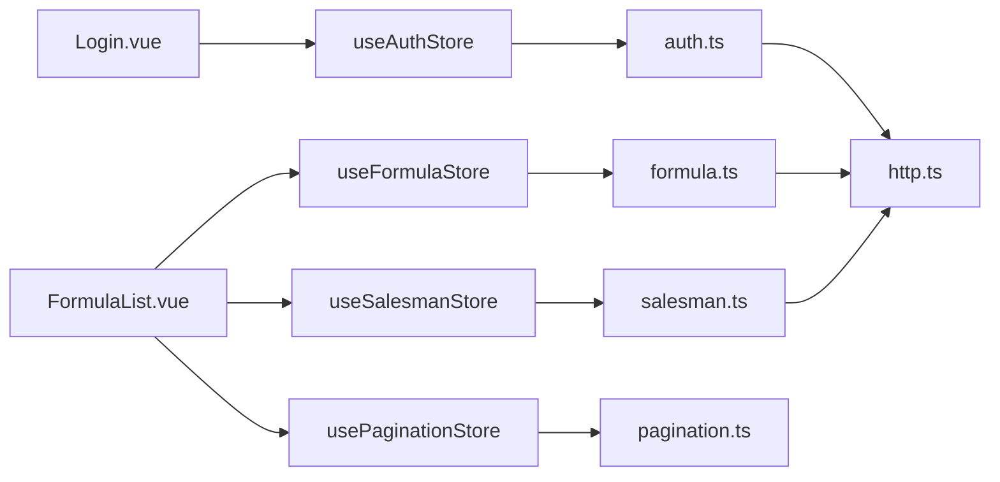

# 状态管理 (Pinia)

<cite>
**本文引用的文件**
- [frontend/src/main.ts](file://frontend/src/main.ts)
- [frontend/src/stores/auth.ts](file://frontend/src/stores/auth.ts)
- [frontend/src/stores/pagination.ts](file://frontend/src/stores/pagination.ts)
- [frontend/src/stores/material.ts](file://frontend/src/stores/material.ts)
- [frontend/src/stores/formula.ts](file://frontend/src/stores/formula.ts)
- [frontend/src/stores/salesman.ts](file://frontend/src/stores/salesman.ts)
- [frontend/src/stores/nutrition.ts](file://frontend/src/stores/nutrition.ts)
- [frontend/src/stores/export.ts](file://frontend/src/stores/export.ts)
- [frontend/src/stores/version.ts](file://frontend/src/stores/version.ts)
- [frontend/src/api/auth.ts](file://frontend/src/api/auth.ts)
- [frontend/src/views/auth/Login.vue](file://frontend/src/views/auth/Login.vue)
- [frontend/src/views/formulas/FormulaList.vue](file://frontend/src/views/formulas/FormulaList.vue)
- [frontend/src/types/formula.ts](file://frontend/src/types/formula.ts)
- [frontend/src/types/material.ts](file://frontend/src/types/material.ts)
- [frontend/src/types/user.ts](file://frontend/src/types/user.ts)
</cite>

## 目录
1. [简介](#简介)
2. [项目结构](#项目结构)
3. [核心组件](#核心组件)
4. [架构总览](#架构总览)
5. [详细组件分析](#详细组件分析)
6. [依赖关系分析](#依赖关系分析)
7. [性能考量](#性能考量)
8. [故障排查指南](#故障排查指南)
9. [结论](#结论)
10. [附录](#附录)

## 简介
本文件系统性阐述前端基于 Pinia 的状态管理设计与实现，重点覆盖以下方面：
- Store 设计理念与与 Vuex 的差异：以组合式 API 为核心，强调类型安全、更自然的响应式语法与更轻量的样板代码。
- 状态定义、Getter 与 Action 的组织方式：通过 ref/computed 定义状态与派生状态，通过函数封装 Action，统一错误处理与加载态。
- 各模块 Store 的职责划分：认证状态、数据状态（配方、原料、业务员等）、UI 状态（分页、加载态）。
- 持久化策略与数据同步：本地缓存用户信息、与 API 的双向同步、分页状态的跨组件共享。
- 响应式更新与组件使用：在组件中通过组合式 API 访问 Store，自动响应状态变化。
- 最佳实践：状态设计原则、异步处理模式、调试技巧。

## 项目结构
前端应用通过 Pinia 提供全局状态能力，Store 文件位于 stores 目录，按功能域拆分；组件通过组合式 API 使用 Store，并通过 API 层与后端交互。

**图表来源**
- [frontend/src/main.ts:1-17](file://frontend/src/main.ts#L1-L17)
- [frontend/src/stores/auth.ts:1-64](file://frontend/src/stores/auth.ts#L1-L64)
- [frontend/src/stores/pagination.ts:1-89](file://frontend/src/stores/pagination.ts#L1-L89)
- [frontend/src/stores/material.ts:1-130](file://frontend/src/stores/material.ts#L1-L130)
- [frontend/src/stores/formula.ts:1-166](file://frontend/src/stores/formula.ts#L1-L166)
- [frontend/src/stores/salesman.ts:1-121](file://frontend/src/stores/salesman.ts#L1-L121)
- [frontend/src/stores/nutrition.ts:1-100](file://frontend/src/stores/nutrition.ts#L1-L100)
- [frontend/src/stores/export.ts:1-109](file://frontend/src/stores/export.ts#L1-L109)
- [frontend/src/stores/version.ts:1-83](file://frontend/src/stores/version.ts#L1-L83)
- [frontend/src/api/auth.ts:1-36](file://frontend/src/api/auth.ts#L1-L36)
- [frontend/src/views/auth/Login.vue:1-910](file://frontend/src/views/auth/Login.vue#L1-L910)
- [frontend/src/views/formulas/FormulaList.vue:1-741](file://frontend/src/views/formulas/FormulaList.vue#L1-L741)
- [frontend/src/types/formula.ts:1-33](file://frontend/src/types/formula.ts#L1-L33)
- [frontend/src/types/material.ts:1-30](file://frontend/src/types/material.ts#L1-L30)
- [frontend/src/types/user.ts:1-22](file://frontend/src/types/user.ts#L1-L22)

**章节来源**
- [frontend/src/main.ts:1-17](file://frontend/src/main.ts#L1-L17)

## 核心组件
- 应用入口与 Pinia 安装：在入口文件中创建并安装 Pinia，确保后续组件可直接使用 Store。
- 认证 Store：负责用户信息、登录/注册/登出流程与本地缓存。
- 分页 Store：集中管理分页配置与动态页大小，供各列表组件复用。
- 数据 Store：围绕实体（配方、原料、业务员、营养、导出、版本）定义 CRUD 与查询方法。
- 视图组件：在组件中注入 Store，绑定数据与事件，触发 Action 更新状态。

**章节来源**
- [frontend/src/main.ts:1-17](file://frontend/src/main.ts#L1-L17)
- [frontend/src/stores/auth.ts:1-64](file://frontend/src/stores/auth.ts#L1-L64)
- [frontend/src/stores/pagination.ts:1-89](file://frontend/src/stores/pagination.ts#L1-L89)
- [frontend/src/stores/material.ts:1-130](file://frontend/src/stores/material.ts#L1-L130)
- [frontend/src/stores/formula.ts:1-166](file://frontend/src/stores/formula.ts#L1-L166)
- [frontend/src/stores/salesman.ts:1-121](file://frontend/src/stores/salesman.ts#L1-L121)
- [frontend/src/stores/nutrition.ts:1-100](file://frontend/src/stores/nutrition.ts#L1-L100)
- [frontend/src/stores/export.ts:1-109](file://frontend/src/stores/export.ts#L1-L109)
- [frontend/src/stores/version.ts:1-83](file://frontend/src/stores/version.ts#L1-L83)

## 架构总览
Pinia 在本项目中的定位是“轻量、类型友好”的状态中心，围绕以下原则组织：
- 组合式 Store：每个 Store 以函数形式定义，内部使用 ref/computed 管理状态与派生状态。
- 明确的职责边界：认证、分页、数据实体分别独立 Store，避免交叉耦合。
- 统一的异步模式：所有与后端交互的方法均返回结果对象，包含 success 与 message，便于 UI 层统一处理。
- 组件驱动的数据流：组件通过 Store 的 Action 触发数据请求，Store 内部更新状态，组件自动响应。

**图表来源**
- [frontend/src/views/auth/Login.vue:246-309](file://frontend/src/views/auth/Login.vue#L246-L309)
- [frontend/src/views/formulas/FormulaList.vue:184-356](file://frontend/src/views/formulas/FormulaList.vue#L184-L356)
- [frontend/src/stores/auth.ts:19-52](file://frontend/src/stores/auth.ts#L19-L52)
- [frontend/src/stores/formula.ts:18-101](file://frontend/src/stores/formula.ts#L18-L101)
- [frontend/src/stores/pagination.ts:14-87](file://frontend/src/stores/pagination.ts#L14-L87)
- [frontend/src/api/auth.ts:19-35](file://frontend/src/api/auth.ts#L19-L35)

## 详细组件分析

### 认证状态（Auth Store）
- 状态定义
  - user：当前用户信息，初始值来自本地缓存。
  - loading：登录/注册过程中的加载态。
  - isAuthenticated：基于 user 是否存在计算得出的布尔值。
- 主要 Action
  - initAuth：初始化时从本地缓存恢复用户信息。
  - login/register：调用 API 完成认证，成功后保存用户信息与 token 到本地。
  - logout：清除本地认证数据并将 user 置空。
- 与 API 的集成
  - 通过 authApi.login/register/getMe 与后端交互。
  - 通过 saveAuthData/clearAuthData/getCachedUser 管理本地持久化。

**图表来源**
- [frontend/src/views/auth/Login.vue:290-308](file://frontend/src/views/auth/Login.vue#L290-L308)
- [frontend/src/stores/auth.ts:19-32](file://frontend/src/stores/auth.ts#L19-L32)
- [frontend/src/api/auth.ts:7-17](file://frontend/src/api/auth.ts#L7-L17)
- [frontend/src/api/auth.ts:19-35](file://frontend/src/api/auth.ts#L19-L35)

**章节来源**
- [frontend/src/stores/auth.ts:1-64](file://frontend/src/stores/auth.ts#L1-L64)
- [frontend/src/api/auth.ts:1-36](file://frontend/src/api/auth.ts#L1-L36)
- [frontend/src/views/auth/Login.vue:246-309](file://frontend/src/views/auth/Login.vue#L246-L309)

### 数据状态（配方、原料、业务员）
- 配置型状态
  - 列表数据：formulas/materials/salesmen 等数组。
  - 分页参数：currentPage/pageSize/total/keyword/filter。
  - 加载态：loading 控制表格与按钮的加载状态。
- 核心 Action
  - 列表获取：fetchFormulas/fetchMaterials/fetchSalesmen，内部根据动态页大小与过滤条件请求后端，更新列表与总数。
  - 单条获取：getFormula/getMaterial/getSalesman。
  - 新增/更新/删除：create*/update*/delete*，统一在成功后刷新列表。
  - 过滤与分页控制：setKeyword/setSalesmanId/setPage 等。
- 时间格式化与解析
  - 使用工具函数对时间字段进行格式化。
  - 配方描述支持 JSON 字符串解析为可读摘要。

**图表来源**
- [frontend/src/stores/formula.ts:18-44](file://frontend/src/stores/formula.ts#L18-L44)
- [frontend/src/stores/material.ts:16-37](file://frontend/src/stores/material.ts#L16-L37)
- [frontend/src/stores/salesman.ts:17-39](file://frontend/src/stores/salesman.ts#L17-L39)
- [frontend/src/stores/pagination.ts:26-71](file://frontend/src/stores/pagination.ts#L26-L71)

**章节来源**
- [frontend/src/stores/formula.ts:1-166](file://frontend/src/stores/formula.ts#L1-L166)
- [frontend/src/stores/material.ts:1-130](file://frontend/src/stores/material.ts#L1-L130)
- [frontend/src/stores/salesman.ts:1-121](file://frontend/src/stores/salesman.ts#L1-L121)
- [frontend/src/stores/pagination.ts:1-89](file://frontend/src/stores/pagination.ts#L1-L89)

### UI 状态（分页）
- 状态与派生
  - current/pageSize/total/showJumper/showSizeChanger/pageSizeOptions。
  - paginationConfig：computed 包裹的分页配置，包含 onChange 回调。
- 生命周期与注册
  - register/unregister：组件挂载时注册分页状态，卸载时注销。
  - update：动态更新分页参数。
  - setDynamicPageSize：根据可视区域动态调整页大小。
- 与列表组件协作
  - 列表组件监听分页变更，调用对应 Store 的 setPage 与 fetch* 方法。

**图表来源**
- [frontend/src/views/formulas/FormulaList.vue:264-282](file://frontend/src/views/formulas/FormulaList.vue#L264-L282)
- [frontend/src/stores/pagination.ts:42-58](file://frontend/src/stores/pagination.ts#L42-L58)
- [frontend/src/stores/formula.ts:113-133](file://frontend/src/stores/formula.ts#L113-L133)

**章节来源**
- [frontend/src/stores/pagination.ts:1-89](file://frontend/src/stores/pagination.ts#L1-L89)
- [frontend/src/views/formulas/FormulaList.vue:184-356](file://frontend/src/views/formulas/FormulaList.vue#L184-L356)

### 营养、导出与版本（辅助数据）
- 营养 Store：提供原料与配方的营养计算、标准档案管理与合规检查。
- 导出 Store：模板与导出任务管理，支持创建任务与分享链接。
- 版本 Store：配方版本列表、版本对比与发布。

这些 Store 的模式与数据 Store 类似，均以 Action 管理异步流程，更新本地状态并反馈结果。

**章节来源**
- [frontend/src/stores/nutrition.ts:1-100](file://frontend/src/stores/nutrition.ts#L1-L100)
- [frontend/src/stores/export.ts:1-109](file://frontend/src/stores/export.ts#L1-L109)
- [frontend/src/stores/version.ts:1-83](file://frontend/src/stores/version.ts#L1-L83)

## 依赖关系分析
- 组件依赖 Store：视图组件通过组合式 API 注入 Store，直接消费状态与 Action。
- Store 依赖 API：Store 内部调用 API 层方法，完成与后端的交互。
- API 依赖 HTTP：API 层封装 HTTP 请求与 Token 管理。
- 类型定义贯穿：types 目录提供强类型约束，确保 Store 与组件之间的契约清晰。

**图表来源**
- [frontend/src/views/auth/Login.vue:246-309](file://frontend/src/views/auth/Login.vue#L246-L309)
- [frontend/src/views/formulas/FormulaList.vue:184-356](file://frontend/src/views/formulas/FormulaList.vue#L184-L356)
- [frontend/src/stores/auth.ts:1-64](file://frontend/src/stores/auth.ts#L1-L64)
- [frontend/src/stores/formula.ts:1-166](file://frontend/src/stores/formula.ts#L1-L166)
- [frontend/src/stores/salesman.ts:1-121](file://frontend/src/stores/salesman.ts#L1-L121)
- [frontend/src/stores/pagination.ts:1-89](file://frontend/src/stores/pagination.ts#L1-L89)
- [frontend/src/api/auth.ts:1-36](file://frontend/src/api/auth.ts#L1-L36)

**章节来源**
- [frontend/src/views/auth/Login.vue:246-309](file://frontend/src/views/auth/Login.vue#L246-L309)
- [frontend/src/views/formulas/FormulaList.vue:184-356](file://frontend/src/views/formulas/FormulaList.vue#L184-L356)
- [frontend/src/stores/auth.ts:1-64](file://frontend/src/stores/auth.ts#L1-L64)
- [frontend/src/stores/formula.ts:1-166](file://frontend/src/stores/formula.ts#L1-L166)
- [frontend/src/stores/salesman.ts:1-121](file://frontend/src/stores/salesman.ts#L1-L121)
- [frontend/src/stores/pagination.ts:1-89](file://frontend/src/stores/pagination.ts#L1-L89)
- [frontend/src/api/auth.ts:1-36](file://frontend/src/api/auth.ts#L1-L36)

## 性能考量
- 异步流程的加载态：通过 loading 精准控制 UI 反馈，避免重复请求与闪烁。
- 动态页大小：usePaginationStore 的 dynamicPageSize 根据可视区域自适应，减少不必要的 DOM 渲染。
- 列表懒加载与缓存：部分 Store 支持一次性拉取全量选项（如原料下拉），通过缓存避免重复请求。
- 错误处理与降级：Action 统一捕获异常并返回消息，组件据此展示提示，保证用户体验稳定。

[本节为通用指导，无需特定文件来源]

## 故障排查指南
- 登录失败
  - 检查登录表单校验与提交流程是否正确调用 Store 的 login。
  - 查看返回的错误消息，确认网络与后端接口可用。
- 列表不刷新
  - 确认在新增/更新/删除成功后调用了对应的 fetch* 方法。
  - 检查分页状态是否正确更新（current/pageSize/total）。
- 分页不生效
  - 确保组件在挂载时调用 register，并在卸载时调用 unregister。
  - 检查 paginationConfig.onChange 的回调是否被触发。
- 营养/版本/导出异常
  - 关注 Action 的返回值与错误消息，必要时在组件中显示提示。
  - 确认后端接口路径与参数构造正确。

**章节来源**
- [frontend/src/views/auth/Login.vue:290-308](file://frontend/src/views/auth/Login.vue#L290-L308)
- [frontend/src/stores/formula.ts:64-101](file://frontend/src/stores/formula.ts#L64-L101)
- [frontend/src/stores/pagination.ts:42-58](file://frontend/src/stores/pagination.ts#L42-L58)
- [frontend/src/stores/nutrition.ts:13-84](file://frontend/src/stores/nutrition.ts#L13-L84)
- [frontend/src/stores/export.ts:36-86](file://frontend/src/stores/export.ts#L36-L86)
- [frontend/src/stores/version.ts:12-69](file://frontend/src/stores/version.ts#L12-L69)

## 结论
本项目采用 Pinia 的组合式 Store 模式，实现了清晰的状态分层与一致的异步处理规范。认证、分页与数据实体分别由独立 Store 管理，配合 API 层与类型定义，形成高内聚、低耦合的状态体系。通过统一的 Action 与错误返回机制，组件使用简单直观，易于扩展与维护。

[本节为总结，无需特定文件来源]

## 附录

### 状态设计最佳实践
- 状态最小化：仅存放组件渲染与交互所需的最少数据。
- 行为函数化：将与后端交互的逻辑封装为 Action，保持 Store 的纯净。
- 统一错误处理：Action 返回包含 success/message 的结果对象，便于 UI 层统一处理。
- 加载态精细化：为每个耗时操作设置独立的 loading 标志，避免全局阻塞。
- 类型驱动：通过 types 目录提供强类型约束，降低运行期风险。

### 异步操作处理建议
- 所有异步请求在 Store 中完成，组件只负责触发与展示。
- 成功后优先更新本地状态，再触发 UI 反馈。
- 对于批量操作，考虑合并请求或使用防抖策略。

### 状态调试技巧
- 使用浏览器开发者工具观察 Store 的状态变化，确认数据流向。
- 在关键 Action 上添加日志输出，追踪请求参数与返回值。
- 对于复杂列表，先验证分页参数与 total 的一致性，再逐步定位数据问题。

[本节为通用指导，无需特定文件来源]