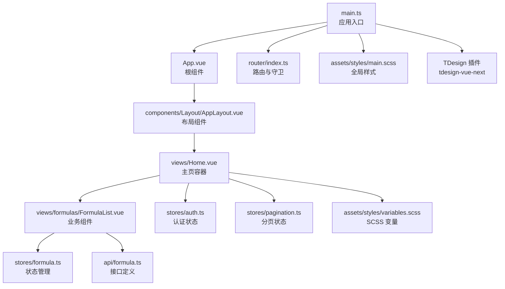
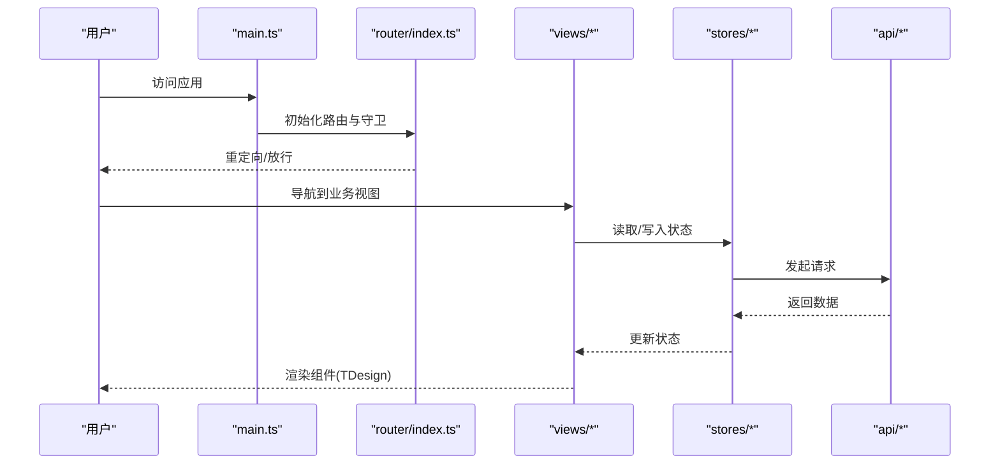
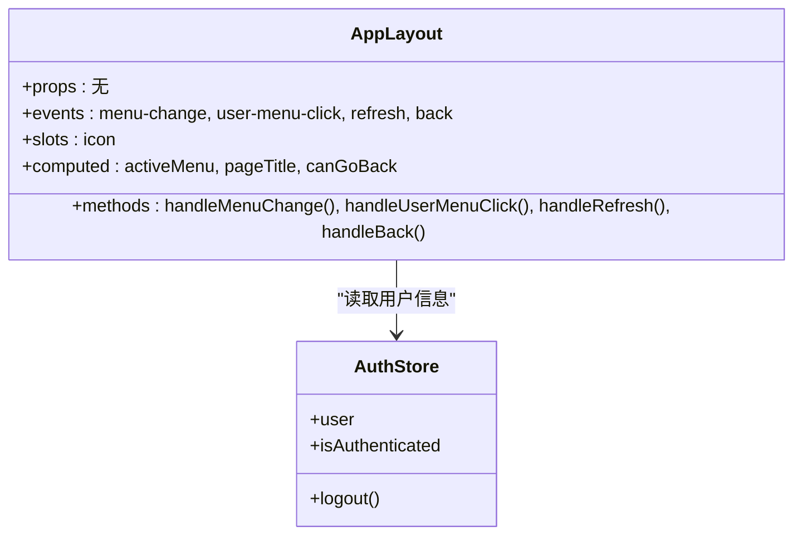
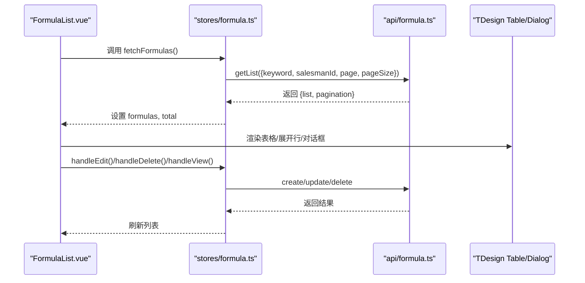
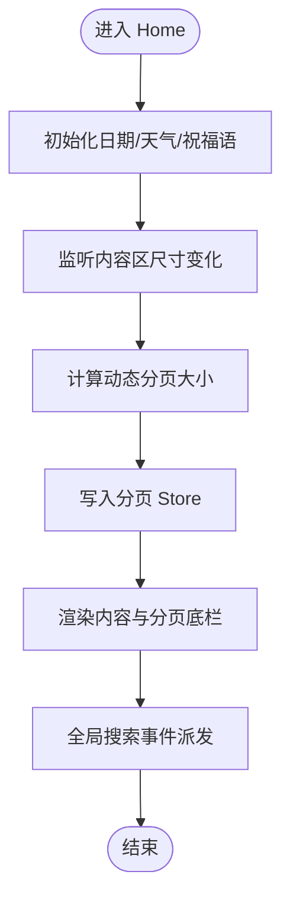
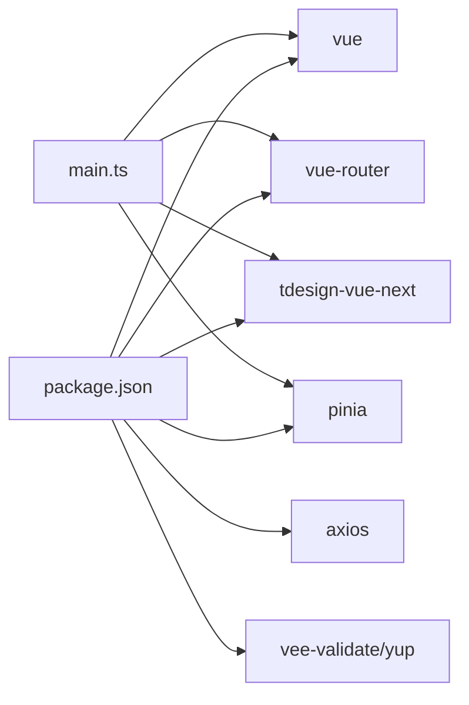

# 组件设计系统

<cite>
**本文引用的文件**
- [frontend/src/App.vue](file://frontend/src/App.vue)
- [frontend/src/main.ts](file://frontend/src/main.ts)
- [frontend/src/components/Layout/AppLayout.vue](file://frontend/src/components/Layout/AppLayout.vue)
- [frontend/src/views/Home.vue](file://frontend/src/views/Home.vue)
- [frontend/src/views/formulas/FormulaList.vue](file://frontend/src/views/formulas/FormulaList.vue)
- [frontend/src/stores/formula.ts](file://frontend/src/stores/formula.ts)
- [frontend/src/stores/auth.ts](file://frontend/src/stores/auth.ts)
- [frontend/src/router/index.ts](file://frontend/src/router/index.ts)
- [frontend/src/assets/styles/main.scss](file://frontend/src/assets/styles/main.scss)
- [frontend/src/assets/styles/variables.scss](file://frontend/src/assets/styles/variables.scss)
- [frontend/package.json](file://frontend/package.json)
- [frontend/vite.config.ts](file://frontend/vite.config.ts)
- [frontend/src/api/formula.ts](file://frontend/src/api/formula.ts)
- [frontend/src/utils/timeFormat.ts](file://frontend/src/utils/timeFormat.ts)
- [frontend/src/types/formula.ts](file://frontend/src/types/formula.ts)
</cite>

## 目录
1. [引言](#引言)
2. [项目结构](#项目结构)
3. [核心组件](#核心组件)
4. [架构总览](#架构总览)
5. [详细组件分析](#详细组件分析)
6. [依赖关系分析](#依赖关系分析)
7. [性能考量](#性能考量)
8. [故障排查指南](#故障排查指南)
9. [结论](#结论)
10. [附录](#附录)

## 引言
本文件面向 TingStudio 前端工程，系统性梳理组件设计体系，覆盖组件分类与命名规范、Props 设计、事件与插槽使用、TDesign Vue Next 的集成与封装策略、样式系统组织（SCSS 变量、混入与主题定制）、以及组件复用模式与最佳实践（组件通信、状态提升、组合模式）。目标是帮助开发者快速理解并高效扩展组件库，确保一致性与可维护性。

## 项目结构
前端采用 Vite + Vue 3 + TypeScript + Pinia + Vue Router 架构，按“布局组件 + 业务视图 + 通用样式 + 状态管理 + 类型与 API”分层组织。入口应用在 main.ts 注册 TDesign 插件与全局样式；路由负责权限守卫与页面导航；Pinia Store 提供跨组件状态共享；样式系统以 SCSS 变量与全局样式为主，配合 TDesign 组件的深度样式覆盖实现统一主题风格。

图表来源
- [frontend/src/main.ts:1-17](file://frontend/src/main.ts#L1-L17)
- [frontend/src/App.vue:1-10](file://frontend/src/App.vue#L1-L10)
- [frontend/src/router/index.ts:1-165](file://frontend/src/router/index.ts#L1-L165)
- [frontend/src/assets/styles/main.scss:1-203](file://frontend/src/assets/styles/main.scss#L1-L203)
- [frontend/src/components/Layout/AppLayout.vue:1-392](file://frontend/src/components/Layout/AppLayout.vue#L1-L392)
- [frontend/src/views/Home.vue:1-800](file://frontend/src/views/Home.vue#L1-L800)
- [frontend/src/views/formulas/FormulaList.vue:1-200](file://frontend/src/views/formulas/FormulaList.vue#L1-L200)
- [frontend/src/stores/formula.ts:1-166](file://frontend/src/stores/formula.ts#L1-L166)
- [frontend/src/api/formula.ts:1-65](file://frontend/src/api/formula.ts#L1-L65)
- [frontend/src/stores/auth.ts:1-64](file://frontend/src/stores/auth.ts#L1-L64)
- [frontend/src/assets/styles/variables.scss:1-55](file://frontend/src/assets/styles/variables.scss#L1-L55)

章节来源
- [frontend/src/main.ts:1-17](file://frontend/src/main.ts#L1-L17)
- [frontend/src/App.vue:1-10](file://frontend/src/App.vue#L1-L10)
- [frontend/src/router/index.ts:1-165](file://frontend/src/router/index.ts#L1-L165)
- [frontend/src/assets/styles/main.scss:1-203](file://frontend/src/assets/styles/main.scss#L1-L203)
- [frontend/src/assets/styles/variables.scss:1-55](file://frontend/src/assets/styles/variables.scss#L1-L55)

## 核心组件
- 布局组件
  - AppLayout：提供头部导航、面包屑、用户菜单、侧边菜单与主内容区，统一品牌色与交互风格。
- 业务组件
  - FormulaList：配方列表，支持展开行、版本记录、标签化状态、批量操作等。
- 通用组件
  - TDesign 提供的 Button、Menu、Breadcrumb、Dropdown、Space、Tag、Table、Dialog、Pagination、Input、Empty、Popconfirm 等，作为通用 UI 基础。

章节来源
- [frontend/src/components/Layout/AppLayout.vue:1-392](file://frontend/src/components/Layout/AppLayout.vue#L1-L392)
- [frontend/src/views/formulas/FormulaList.vue:1-200](file://frontend/src/views/formulas/FormulaList.vue#L1-L200)

## 架构总览
应用启动流程：main.ts 创建应用实例，注册 Pinia、Router、TDesign 插件与全局样式；App.vue 作为根组件承载路由出口；路由守卫控制访问权限；业务视图通过 Store 与 API 交互，渲染 TDesign 组件并应用全局样式。

图表来源
- [frontend/src/main.ts:1-17](file://frontend/src/main.ts#L1-L17)
- [frontend/src/router/index.ts:148-162](file://frontend/src/router/index.ts#L148-L162)
- [frontend/src/views/formulas/FormulaList.vue:184-196](file://frontend/src/views/formulas/FormulaList.vue#L184-L196)
- [frontend/src/stores/formula.ts:18-44](file://frontend/src/stores/formula.ts#L18-L44)
- [frontend/src/api/formula.ts:45-64](file://frontend/src/api/formula.ts#L45-L64)

## 详细组件分析

### 布局组件：AppLayout
- 设计原则
  - 使用 TDesign Layout、Menu、Breadcrumb、Dropdown、Button 等构建统一布局。
  - 通过计算属性动态绑定面包屑与菜单选中态，保证与路由一致。
  - 用户菜单提供“设置/帮助/退出登录”，结合消息提示与路由跳转。
- Props 设计
  - 未对外暴露 Props，内部通过路由与 Pinia 状态驱动 UI。
- 事件与插槽
  - 事件：菜单切换、用户菜单点击、返回/刷新等。
  - 插槽：图标插槽用于按钮与菜单项图标。
- 样式组织
  - 使用 SCSS 变量与全局样式覆盖 TDesign 组件外观，形成统一的粉色主题。

图表来源
- [frontend/src/components/Layout/AppLayout.vue:103-174](file://frontend/src/components/Layout/AppLayout.vue#L103-L174)
- [frontend/src/stores/auth.ts:1-64](file://frontend/src/stores/auth.ts#L1-L64)

章节来源
- [frontend/src/components/Layout/AppLayout.vue:1-392](file://frontend/src/components/Layout/AppLayout.vue#L1-L392)
- [frontend/src/stores/auth.ts:1-64](file://frontend/src/stores/auth.ts#L1-L64)

### 业务组件：FormulaList（配方列表）
- 设计原则
  - 使用 TDesign Table 展示配方数据，支持展开行显示版本历史与变更明细。
  - 使用 Tag、Button、Dropdown、Popconfirm 等组合实现状态标签与操作面板。
  - 支持空态 Empty，提升可用性。
- Props 设计
  - 通过 Pinia Store 注入数据与状态，避免冗余 Props。
- 事件与插槽
  - 事件：查看、编辑、更多操作、删除确认等。
  - 插槽：列模板（状态、材料数、操作按钮组），展开行内容。
- 数据处理
  - Store 对后端返回的 JSON 字符串进行解析与格式化，统一时间格式。
  - 通过 API 模块封装请求方法，集中管理接口契约。

图表来源
- [frontend/src/views/formulas/FormulaList.vue:184-196](file://frontend/src/views/formulas/FormulaList.vue#L184-L196)
- [frontend/src/stores/formula.ts:18-44](file://frontend/src/stores/formula.ts#L18-L44)
- [frontend/src/api/formula.ts:45-64](file://frontend/src/api/formula.ts#L45-L64)

章节来源
- [frontend/src/views/formulas/FormulaList.vue:1-200](file://frontend/src/views/formulas/FormulaList.vue#L1-L200)
- [frontend/src/stores/formula.ts:1-166](file://frontend/src/stores/formula.ts#L1-L166)
- [frontend/src/api/formula.ts:1-65](file://frontend/src/api/formula.ts#L1-L65)
- [frontend/src/utils/timeFormat.ts:1-24](file://frontend/src/utils/timeFormat.ts#L1-L24)
- [frontend/src/types/formula.ts:1-33](file://frontend/src/types/formula.ts#L1-L33)

### 主页容器：Home（页面容器与分页策略）
- 设计原则
  - 左侧侧边栏包含导航、用户信息、日期天气与操作按钮；右侧内容区包含标题、搜索与操作按钮、滚动内容区与独立分页底栏。
  - 通过 ResizeObserver 动态计算分页每页条数，适配不同设备与窗口尺寸。
- 事件与插槽
  - 通过自定义事件向子页面广播搜索关键词，实现全局搜索联动。
- 样式组织
  - 使用 SCSS 变量与全局样式覆盖 TDesign 组件外观，形成统一视觉风格。

图表来源
- [frontend/src/views/Home.vue:250-310](file://frontend/src/views/Home.vue#L250-L310)
- [frontend/src/views/Home.vue:427-436](file://frontend/src/views/Home.vue#L427-L436)

章节来源
- [frontend/src/views/Home.vue:1-800](file://frontend/src/views/Home.vue#L1-L800)

## 依赖关系分析
- 组件与库
  - TDesign Vue Next：提供基础 UI 组件与图标、消息提示等能力。
  - Vue 3 + Vue Router：页面级组件与路由导航。
  - Pinia：跨组件状态管理。
- 样式依赖
  - SCSS 变量与全局样式覆盖 TDesign 组件默认样式，形成统一主题。
- 运行时依赖
  - axios：HTTP 请求封装。
  - vee-validate/yup：表单校验（在本仓库未直接体现，但作为依赖存在）。

图表来源
- [frontend/package.json:12-20](file://frontend/package.json#L12-L20)
- [frontend/src/main.ts:1-17](file://frontend/src/main.ts#L1-L17)

章节来源
- [frontend/package.json:1-30](file://frontend/package.json#L1-L30)
- [frontend/src/main.ts:1-17](file://frontend/src/main.ts#L1-L17)

## 性能考量
- 动态分页策略
  - 在 Home 视图中，通过 ResizeObserver 与首屏测量，动态计算表格每页条数，减少不必要的滚动与渲染压力。
- 组件懒加载
  - 路由按需加载视图组件，降低首屏体积。
- 样式覆盖优化
  - 使用 ::v-deep 与变量集中管理，避免重复覆盖与样式冲突。
- 网络与状态
  - Store 中统一错误处理与加载状态，避免频繁重渲染。

章节来源
- [frontend/src/views/Home.vue:250-310](file://frontend/src/views/Home.vue#L250-L310)
- [frontend/src/router/index.ts:6-146](file://frontend/src/router/index.ts#L6-L146)
- [frontend/src/assets/styles/main.scss:88-197](file://frontend/src/assets/styles/main.scss#L88-L197)

## 故障排查指南
- 登录/权限问题
  - 路由守卫会检测认证状态，未登录用户会被重定向到登录页；已在登录页时若已登录则重定向到首页。
- 消息提示
  - 使用 TDesign 的消息插件进行成功/错误提示，便于定位问题。
- 接口异常
  - Store 中对 API 调用进行 try/catch，并统一返回 {success, message} 结构，便于上层处理。

章节来源
- [frontend/src/router/index.ts:148-162](file://frontend/src/router/index.ts#L148-L162)
- [frontend/src/stores/auth.ts:19-32](file://frontend/src/stores/auth.ts#L19-L32)
- [frontend/src/stores/formula.ts:38-44](file://frontend/src/stores/formula.ts#L38-L44)

## 结论
本设计系统以 TDesign 为基础，结合 Pinia 状态管理与 SCSS 主题变量，实现了统一的视觉与交互体验。通过布局组件与业务组件的清晰分工、事件与插槽的合理使用、以及动态分页与懒加载等性能优化，满足了配方管理等业务场景的需求。建议后续在组件库层面沉淀通用业务组件与工具函数，进一步提升复用性与一致性。

## 附录

### 组件分类与命名规范
- 布局组件
  - 命名：以 Layout 结尾，职责单一，仅负责布局与导航。
  - 示例：AppLayout。
- 业务组件
  - 命名：以名词短语表达业务实体，如 FormulaList、FormulaForm、FormulaDetail。
  - 设计：聚焦业务逻辑，尽量通过 Store 与 API 交互，避免冗余 Props。
- 通用组件
  - 命名：遵循 TDesign 组件命名，如 Button、Menu、Table、Dialog 等。
  - 设计：通过插槽与事件扩展行为，避免过度封装。

### Props 设计、事件与插槽
- Props
  - 优先通过 Pinia Store 注入数据，减少跨层级 Props。
- 事件
  - 使用 emit 或回调函数向上冒泡，保持组件解耦。
- 插槽
  - 使用具名插槽扩展单元格、操作按钮组、展开行内容等。

### TDesign Vue Next 集成与自定义封装
- 集成
  - 在入口文件注册插件与全局样式，确保组件可用与样式生效。
- 自定义封装
  - 通过 SCSS 变量与 ::v-deep 覆盖组件外观，形成统一主题。
  - 对常用交互（如消息提示、确认对话框）进行统一封装，提升一致性。

### 样式系统组织（SCSS 变量、混入与主题定制）
- 变量
  - 颜色、字体、间距、圆角、阴影、过渡等集中定义，便于主题切换。
- 混入
  - 可在需要时引入混入，但当前项目主要通过变量与覆盖实现。
- 主题定制
  - 通过全局样式覆盖 TDesign 组件默认样式，形成“粉嫩”主题风格。

### 组件复用模式与最佳实践
- 组件通信
  - 父子通信：Props/emit；兄弟通信：事件总线或 Pinia Store。
- 状态提升
  - 将共享状态提升至 Store，避免重复请求与状态不一致。
- 组合模式
  - 将通用 UI 与业务逻辑拆分，通过插槽与事件组合，提高灵活性。