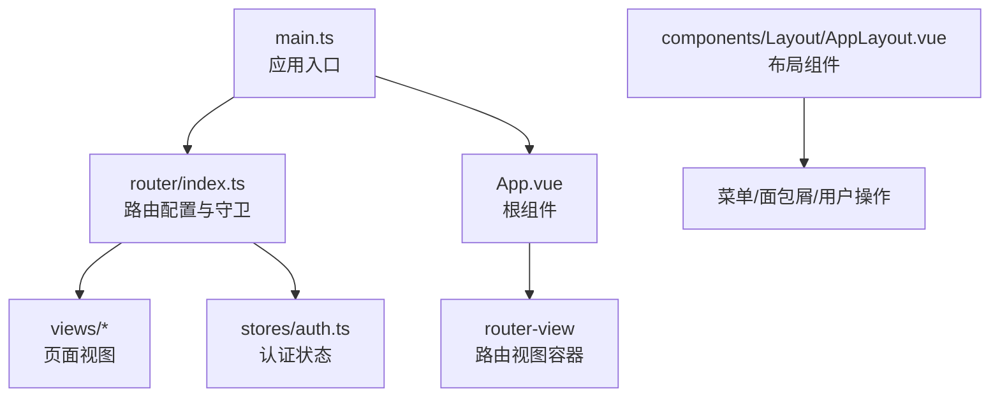
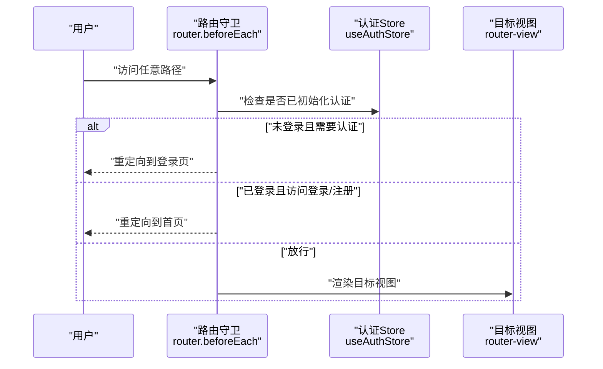
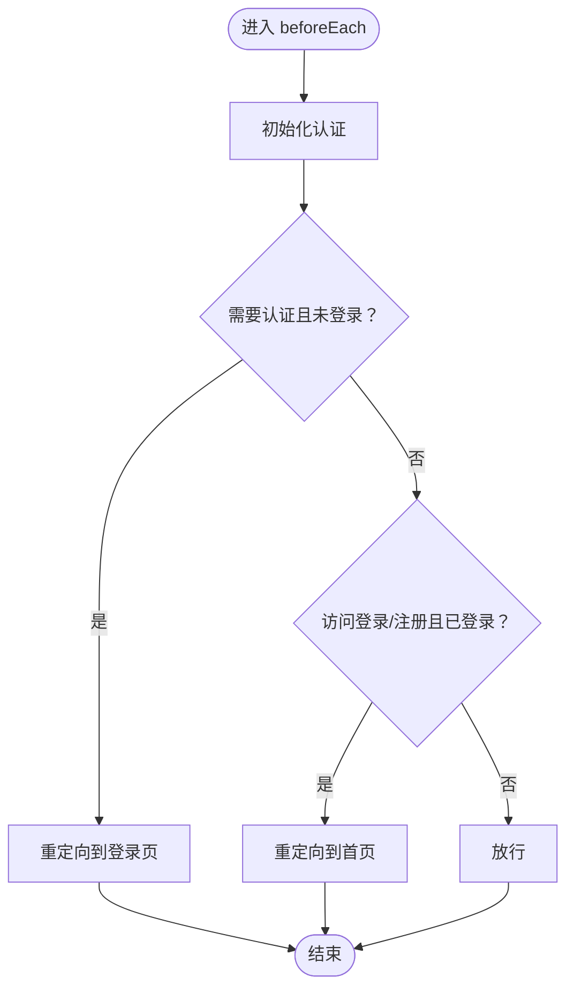
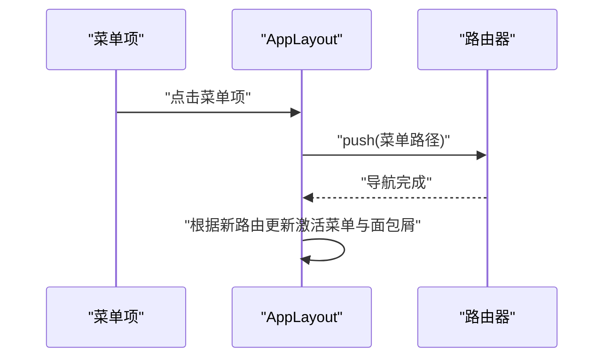
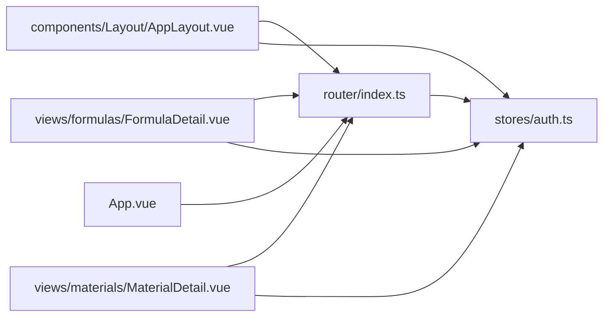

# 路由与导航

<cite>
**本文引用的文件**
- [frontend/src/router/index.ts](file://frontend/src/router/index.ts)
- [frontend/src/main.ts](file://frontend/src/main.ts)
- [frontend/src/App.vue](file://frontend/src/App.vue)
- [frontend/src/components/Layout/AppLayout.vue](file://frontend/src/components/Layout/AppLayout.vue)
- [frontend/src/stores/auth.ts](file://frontend/src/stores/auth.ts)
- [frontend/vite.config.ts](file://frontend/vite.config.ts)
- [frontend/src/views/Home.vue](file://frontend/src/views/Home.vue)
- [frontend/src/views/formulas/FormulaDetail.vue](file://frontend/src/views/formulas/FormulaDetail.vue)
- [frontend/src/views/materials/MaterialDetail.vue](file://frontend/src/views/materials/MaterialDetail.vue)
</cite>

## 目录
1. [简介](#简介)
2. [项目结构](#项目结构)
3. [核心组件](#核心组件)
4. [架构总览](#架构总览)
5. [详细组件分析](#详细组件分析)
6. [依赖关系分析](#依赖关系分析)
7. [性能考虑](#性能考虑)
8. [故障排查指南](#故障排查指南)
9. [结论](#结论)
10. [附录](#附录)

## 简介
本文件系统性梳理前端路由与导航体系，覆盖 Vue Router 配置、路由守卫、页面路由组织（懒加载、嵌套路由、参数传递）、导航菜单与面包屑设计、编程式与声明式导航、以及路由优化策略（预加载、缓存与性能）。文档以仓库现有实现为依据，结合代码级图示与流程图，帮助开发者快速理解与扩展。

## 项目结构
前端路由位于路由目录，应用入口在 main.ts 注册路由；根组件通过 router-view 渲染当前路由视图；布局组件 AppLayout 提供全局导航菜单与面包屑；认证状态通过 Pinia store 管理并在路由守卫中使用。

图表来源
- [frontend/src/main.ts:1-17](file://frontend/src/main.ts#L1-L17)
- [frontend/src/router/index.ts:1-165](file://frontend/src/router/index.ts#L1-L165)
- [frontend/src/App.vue:1-10](file://frontend/src/App.vue#L1-L10)
- [frontend/src/components/Layout/AppLayout.vue:1-392](file://frontend/src/components/Layout/AppLayout.vue#L1-L392)
- [frontend/src/stores/auth.ts:1-64](file://frontend/src/stores/auth.ts#L1-L64)

章节来源
- [frontend/src/main.ts:1-17](file://frontend/src/main.ts#L1-L17)
- [frontend/src/router/index.ts:1-165](file://frontend/src/router/index.ts#L1-L165)
- [frontend/src/App.vue:1-10](file://frontend/src/App.vue#L1-L10)
- [frontend/src/components/Layout/AppLayout.vue:1-392](file://frontend/src/components/Layout/AppLayout.vue#L1-L392)
- [frontend/src/stores/auth.ts:1-64](file://frontend/src/stores/auth.ts#L1-L64)

## 核心组件
- 路由器与守卫
  - 创建 Web History 路由实例，定义多级路由与嵌套路由，统一在 beforeEach 中进行鉴权拦截与登录页保护。
- 认证 Store
  - 提供用户状态、登录/注册/登出、初始化认证等能力，供路由守卫读取。
- 布局与导航
  - AppLayout 提供侧边菜单、面包屑、返回/刷新/用户下拉等交互，并通过编程式导航实现菜单跳转与用户操作。
- 视图层导航
  - 各页面通过 useRouter/useRoute 读取路由参数与路径，实现参数化页面与返回逻辑。

章节来源
- [frontend/src/router/index.ts:1-165](file://frontend/src/router/index.ts#L1-L165)
- [frontend/src/stores/auth.ts:1-64](file://frontend/src/stores/auth.ts#L1-L64)
- [frontend/src/components/Layout/AppLayout.vue:103-174](file://frontend/src/components/Layout/AppLayout.vue#L103-L174)

## 架构总览
Vue Router 在应用启动时被安装到应用实例，根组件通过 router-view 展示当前匹配的视图。路由守卫在每次导航前执行，依据认证状态决定放行或重定向。布局组件负责全局导航与面包屑，视图组件负责具体页面逻辑与参数解析。

图表来源
- [frontend/src/router/index.ts:148-162](file://frontend/src/router/index.ts#L148-L162)
- [frontend/src/stores/auth.ts:12-17](file://frontend/src/stores/auth.ts#L12-L17)

章节来源
- [frontend/src/router/index.ts:148-162](file://frontend/src/router/index.ts#L148-L162)
- [frontend/src/stores/auth.ts:12-17](file://frontend/src/stores/auth.ts#L12-L17)

## 详细组件分析

### 路由配置与嵌套路由
- 历史模式与基础路由
  - 使用 Web History，根路径 '/' 对应 Home 布局视图，内部包含多个子路由。
- 子路由与标题元信息
  - 子路由均带有 meta.title，便于布局组件动态生成面包屑与页面标题。
- 参数化路由
  - 如 '/materials/:id'、'/formulas/:id' 等，用于详情页参数传递。
- 嵌套路由
  - '/' 下的 children 定义了完整的页面导航树，形成“主页面 + 子页面”的层级结构。

章节来源
- [frontend/src/router/index.ts:4-146](file://frontend/src/router/index.ts#L4-L146)

### 路由懒加载
- 所有路由组件均通过动态导入实现懒加载，按需加载模块，降低首屏体积。
- 典型用法：component: () => import('@/views/...')

章节来源
- [frontend/src/router/index.ts:10-141](file://frontend/src/router/index.ts#L10-L141)

### 路由守卫与权限控制
- 初始化认证
  - 若未初始化用户信息，则调用认证 Store 初始化。
- 登录拦截
  - 需要认证但未登录时，重定向到登录页。
- 登录/注册保护
  - 已登录用户访问登录/注册页时，重定向到首页。
- 放行
  - 其他情况直接放行。

图表来源
- [frontend/src/router/index.ts:148-162](file://frontend/src/router/index.ts#L148-L162)
- [frontend/src/stores/auth.ts:12-17](file://frontend/src/stores/auth.ts#L12-L17)

章节来源
- [frontend/src/router/index.ts:148-162](file://frontend/src/router/index.ts#L148-L162)
- [frontend/src/stores/auth.ts:12-17](file://frontend/src/stores/auth.ts#L12-L17)

### 导航菜单与面包屑
- 菜单联动
  - 布局组件根据当前路由计算激活菜单项，点击菜单触发编程式导航 push。
- 面包屑
  - 面包屑显示“首页 + 当前页面标题”，标题来自路由 meta.title 或根据路径动态映射。
- 用户操作
  - 用户下拉菜单支持退出登录，触发登出并跳转到登录页。

图表来源
- [frontend/src/components/Layout/AppLayout.vue:113-127](file://frontend/src/components/Layout/AppLayout.vue#L113-L127)
- [frontend/src/components/Layout/AppLayout.vue:163-165](file://frontend/src/components/Layout/AppLayout.vue#L163-L165)

章节来源
- [frontend/src/components/Layout/AppLayout.vue:63-93](file://frontend/src/components/Layout/AppLayout.vue#L63-L93)
- [frontend/src/components/Layout/AppLayout.vue:113-127](file://frontend/src/components/Layout/AppLayout.vue#L113-L127)
- [frontend/src/components/Layout/AppLayout.vue:151-161](file://frontend/src/components/Layout/AppLayout.vue#L151-L161)

### 编程式导航与声明式导航
- 声明式导航
  - 根组件通过 <router-view> 渲染当前路由视图，属于声明式渲染。
- 编程式导航
  - AppLayout 通过 router.push 实现菜单跳转与用户操作；
  - 各页面通过 router.push 或 router.back 实现返回与跳转；
  - Home 通过 router.push 进入新增流程；
  - 路由守卫通过 next('/login' | '/') 实现重定向。

章节来源
- [frontend/src/App.vue:1-3](file://frontend/src/App.vue#L1-L3)
- [frontend/src/components/Layout/AppLayout.vue:163-173](file://frontend/src/components/Layout/AppLayout.vue#L163-L173)
- [frontend/src/views/Home.vue:398-400](file://frontend/src/views/Home.vue#L398-L400)
- [frontend/src/views/formulas/FormulaDetail.vue:146](file://frontend/src/views/formulas/FormulaDetail.vue#L146)
- [frontend/src/views/materials/MaterialDetail.vue:88](file://frontend/src/views/materials/MaterialDetail.vue#L88)
- [frontend/src/router/index.ts:155-159](file://frontend/src/router/index.ts#L155-L159)

### 路由参数传递与页面解析
- 参数路由
  - '/materials/:id'、'/formulas/:id' 等通过 useRoute.params.id 获取参数。
- 参数使用
  - 详情页根据 id 加载数据并渲染，返回按钮使用 router.push 返回列表页。

章节来源
- [frontend/src/router/index.ts:42-58](file://frontend/src/router/index.ts#L42-L58)
- [frontend/src/router/index.ts:66-82](file://frontend/src/router/index.ts#L66-L82)
- [frontend/src/views/formulas/FormulaDetail.vue:103-107](file://frontend/src/views/formulas/FormulaDetail.vue#L103-L107)
- [frontend/src/views/materials/MaterialDetail.vue:56-65](file://frontend/src/views/materials/MaterialDetail.vue#L56-L65)

### 动态路由与标题映射
- 路由 meta.title
  - 用于面包屑与页面标题的静态映射。
- 路由路径动态映射
  - 布局组件与 Home 组件均提供路径到标题的映射逻辑，保证未显式设置 meta 的页面也能正确显示标题。

章节来源
- [frontend/src/router/index.ts:32-136](file://frontend/src/router/index.ts#L32-L136)
- [frontend/src/components/Layout/AppLayout.vue:121-127](file://frontend/src/components/Layout/AppLayout.vue#L121-L127)
- [frontend/src/views/Home.vue:374-390](file://frontend/src/views/Home.vue#L374-L390)

## 依赖关系分析
- 路由器依赖认证 Store
  - 路由守卫读取认证状态，影响导航决策。
- 布局组件依赖路由器与认证 Store
  - 菜单与面包屑依赖当前路由；用户操作依赖认证 Store 与路由器。
- 视图组件依赖路由器与业务 Store
  - 详情页依赖路由参数与业务 Store 数据。

图表来源
- [frontend/src/router/index.ts:148-162](file://frontend/src/router/index.ts#L148-L162)
- [frontend/src/stores/auth.ts:1-64](file://frontend/src/stores/auth.ts#L1-L64)
- [frontend/src/components/Layout/AppLayout.vue:109-111](file://frontend/src/components/Layout/AppLayout.vue#L109-L111)
- [frontend/src/views/formulas/FormulaDetail.vue:103-107](file://frontend/src/views/formulas/FormulaDetail.vue#L103-L107)
- [frontend/src/views/materials/MaterialDetail.vue:56-65](file://frontend/src/views/materials/MaterialDetail.vue#L56-L65)
- [frontend/src/App.vue:1-3](file://frontend/src/App.vue#L1-L3)

章节来源
- [frontend/src/router/index.ts:148-162](file://frontend/src/router/index.ts#L148-L162)
- [frontend/src/stores/auth.ts:1-64](file://frontend/src/stores/auth.ts#L1-L64)
- [frontend/src/components/Layout/AppLayout.vue:109-111](file://frontend/src/components/Layout/AppLayout.vue#L109-L111)
- [frontend/src/views/formulas/FormulaDetail.vue:103-107](file://frontend/src/views/formulas/FormulaDetail.vue#L103-L107)
- [frontend/src/views/materials/MaterialDetail.vue:56-65](file://frontend/src/views/materials/MaterialDetail.vue#L56-L65)
- [frontend/src/App.vue:1-3](file://frontend/src/App.vue#L1-L3)

## 性能考虑
- 路由懒加载
  - 所有路由组件采用动态导入，减少初始包体，提升首屏加载速度。
- 路由守卫轻量化
  - 守卫仅做必要判断与初始化，避免复杂异步逻辑阻塞导航。
- 视图内懒加载
  - 详情页按需加载数据，避免不必要的网络请求与渲染。
- 开发服务器代理
  - Vite 代理后端接口，减少跨域与调试成本，间接提升开发体验。

章节来源
- [frontend/src/router/index.ts:10-141](file://frontend/src/router/index.ts#L10-L141)
- [frontend/src/router/index.ts:148-162](file://frontend/src/router/index.ts#L148-L162)
- [frontend/src/views/formulas/FormulaDetail.vue:148-160](file://frontend/src/views/formulas/FormulaDetail.vue#L148-L160)
- [frontend/src/views/materials/MaterialDetail.vue:90-116](file://frontend/src/views/materials/MaterialDetail.vue#L90-L116)
- [frontend/vite.config.ts:15-20](file://frontend/vite.config.ts#L15-L20)

## 故障排查指南
- 无法进入受保护页面
  - 检查路由守卫逻辑与认证 Store 是否正确初始化；确认用户状态与 requiresAuth 设置。
- 登录后未跳转首页
  - 检查守卫中对已登录用户访问登录/注册页的重定向逻辑。
- 面包屑/标题不正确
  - 检查路由 meta.title 或布局/Home 的路径映射逻辑。
- 菜单高亮异常
  - 检查 activeMenu 的路径匹配规则与当前路由路径。
- 返回按钮无效
  - 检查页面是否正确注入 useRouter 并调用 router.push 或 router.back。

章节来源
- [frontend/src/router/index.ts:148-162](file://frontend/src/router/index.ts#L148-L162)
- [frontend/src/stores/auth.ts:12-17](file://frontend/src/stores/auth.ts#L12-L17)
- [frontend/src/components/Layout/AppLayout.vue:113-127](file://frontend/src/components/Layout/AppLayout.vue#L113-L127)
- [frontend/src/views/formulas/FormulaDetail.vue:146](file://frontend/src/views/formulas/FormulaDetail.vue#L146)
- [frontend/src/views/materials/MaterialDetail.vue:88](file://frontend/src/views/materials/MaterialDetail.vue#L88)

## 结论
该路由与导航系统以 Vue Router 为核心，配合 Pinia 认证 Store，在守卫中完成权限拦截与登录保护；通过懒加载与嵌套路由组织页面结构；布局组件提供菜单与面包屑，视图组件实现参数化页面与导航。整体架构清晰、职责明确，具备良好的扩展性与可维护性。

## 附录
- 术语
  - 懒加载：按需加载模块，减少首屏体积。
  - 嵌套路由：父路由包含子路由集合，形成层级导航。
  - 编程式导航：通过代码调用路由器方法进行跳转。
  - 声明式导航：通过模板指令与 router-view 渲染当前视图。