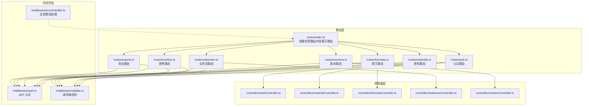
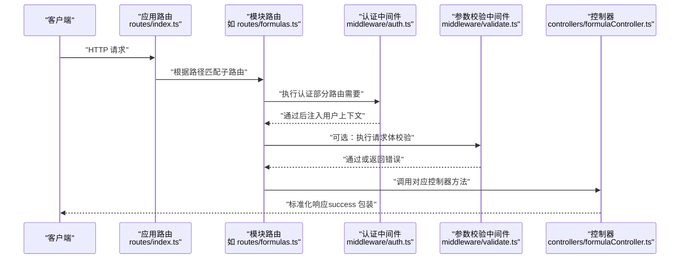
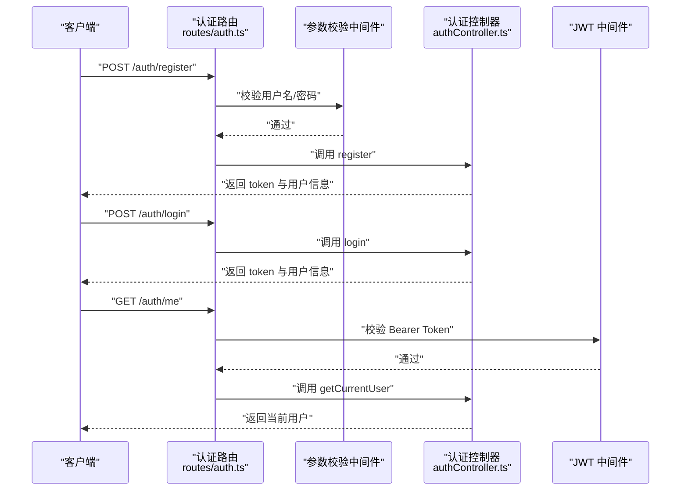
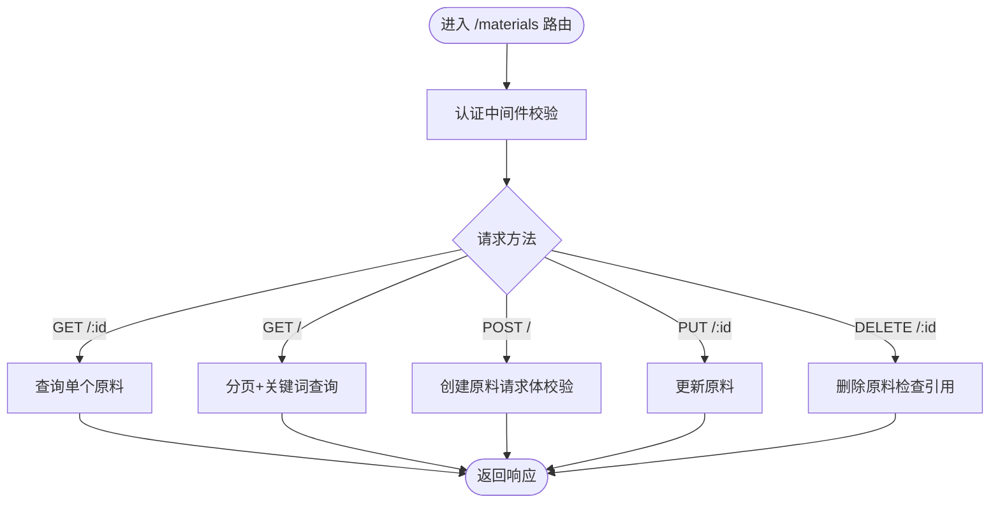
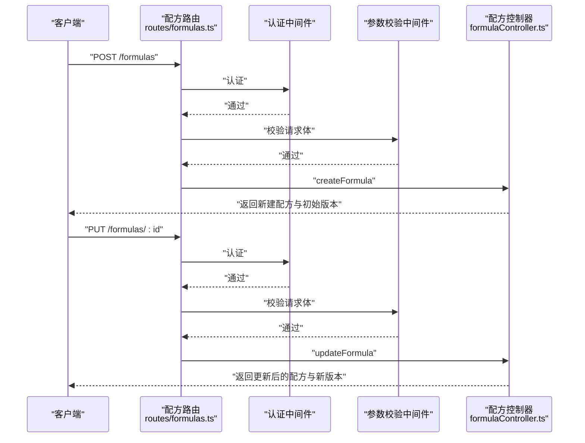
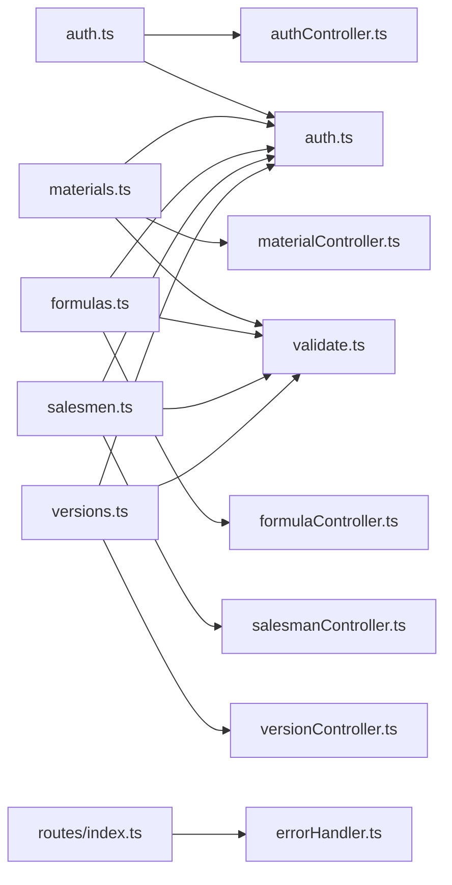

# API 路由系统

<cite>
**本文档引用的文件**
- [backend/src/routes/index.ts](file://backend/src/routes/index.ts)
- [backend/src/routes/auth.ts](file://backend/src/routes/auth.ts)
- [backend/src/routes/materials.ts](file://backend/src/routes/materials.ts)
- [backend/src/routes/formulas.ts](file://backend/src/routes/formulas.ts)
- [backend/src/routes/salesmen.ts](file://backend/src/routes/salesmen.ts)
- [backend/src/routes/versions.ts](file://backend/src/routes/versions.ts)
- [backend/src/routes/nutrition.ts](file://backend/src/routes/nutrition.ts)
- [backend/src/routes/exports.ts](file://backend/src/routes/exports.ts)
- [backend/src/middleware/auth.ts](file://backend/src/middleware/auth.ts)
- [backend/src/middleware/validate.ts](file://backend/src/middleware/validate.ts)
- [backend/src/middleware/errorHandler.ts](file://backend/src/middleware/errorHandler.ts)
- [backend/src/controllers/authController.ts](file://backend/src/controllers/authController.ts)
- [backend/src/controllers/materialController.ts](file://backend/src/controllers/materialController.ts)
- [backend/src/controllers/formulaController.ts](file://backend/src/controllers/formulaController.ts)
- [backend/src/controllers/salesmanController.ts](file://backend/src/controllers/salesmanController.ts)
- [backend/src/controllers/versionController.ts](file://backend/src/controllers/versionController.ts)
</cite>

## 目录
1. [简介](#简介)
2. [项目结构](#项目结构)
3. [核心组件](#核心组件)
4. [架构总览](#架构总览)
5. [详细组件分析](#详细组件分析)
6. [依赖关系分析](#依赖关系分析)
7. [性能考虑](#性能考虑)
8. [故障排除指南](#故障排除指南)
9. [结论](#结论)
10. [附录：API 设计规范与示例](#附录api-设计规范与示例)

## 简介
本文件系统性梳理后端 API 路由体系，覆盖路由组织结构、RESTful 设计原则与 URL 规范，详解认证、原料、配方、业务员、版本、导出与营养分析七大模块的路由定义与实现细节。同时总结路由参数处理、查询字符串解析、请求体验证、中间件使用、权限控制与错误处理的最佳实践，并提供完整的设计规范与示例。

## 项目结构
后端采用按功能域划分的路由组织方式：根路由通过统一入口挂载各模块子路由；每个模块拥有独立的路由文件与控制器文件；中间件负责认证、参数校验与全局错误处理。

图表来源
- [backend/src/routes/index.ts:11-23](file://backend/src/routes/index.ts#L11-L23)
- [backend/src/routes/auth.ts:1-20](file://backend/src/routes/auth.ts#L1-L20)
- [backend/src/routes/materials.ts:1-22](file://backend/src/routes/materials.ts#L1-L22)
- [backend/src/routes/formulas.ts:1-28](file://backend/src/routes/formulas.ts#L1-L28)
- [backend/src/routes/salesmen.ts:1-24](file://backend/src/routes/salesmen.ts#L1-L24)
- [backend/src/routes/versions.ts:1-17](file://backend/src/routes/versions.ts#L1-L17)
- [backend/src/routes/nutrition.ts:1-31](file://backend/src/routes/nutrition.ts#L1-L31)
- [backend/src/routes/exports.ts:1-34](file://backend/src/routes/exports.ts#L1-L34)
- [backend/src/middleware/auth.ts:13-31](file://backend/src/middleware/auth.ts#L13-L31)
- [backend/src/middleware/validate.ts:16-67](file://backend/src/middleware/validate.ts#L16-L67)
- [backend/src/middleware/errorHandler.ts:5-50](file://backend/src/middleware/errorHandler.ts#L5-L50)

章节来源
- [backend/src/routes/index.ts:11-23](file://backend/src/routes/index.ts#L11-L23)

## 核心组件
- 应用路由聚合器：在统一入口创建 Express Router 并挂载各模块路由，形成清晰的命名空间分层。
- 中间件体系：
  - 认证中间件：基于 Bearer Token 的 JWT 校验，向后续请求注入用户上下文。
  - 参数校验中间件：对请求体字段进行类型、长度、范围与必填性校验，统一返回标准化错误。
  - 全局错误处理：捕获数据库约束冲突、JWT 过期/无效、文件大小限制等常见异常，返回一致的响应格式。
- 控制器层：围绕资源 CRUD 与业务流程实现具体逻辑，统一使用工具函数构建响应与分页。

章节来源
- [backend/src/middleware/auth.ts:13-31](file://backend/src/middleware/auth.ts#L13-L31)
- [backend/src/middleware/validate.ts:16-67](file://backend/src/middleware/validate.ts#L16-L67)
- [backend/src/middleware/errorHandler.ts:5-50](file://backend/src/middleware/errorHandler.ts#L5-L50)

## 架构总览
下图展示请求从客户端到控制器的典型调用链路，以及中间件在其中的作用点。

图表来源
- [backend/src/routes/index.ts:11-23](file://backend/src/routes/index.ts#L11-L23)
- [backend/src/routes/formulas.ts:12-26](file://backend/src/routes/formulas.ts#L12-L26)
- [backend/src/middleware/auth.ts:13-31](file://backend/src/middleware/auth.ts#L13-L31)
- [backend/src/middleware/validate.ts:16-67](file://backend/src/middleware/validate.ts#L16-L67)
- [backend/src/controllers/formulaController.ts:89-130](file://backend/src/controllers/formulaController.ts#L89-L130)

## 详细组件分析

### 认证模块（/auth）
- 路由设计
  - POST /auth/register：注册接口，使用请求体校验中间件确保用户名与密码长度。
  - POST /auth/login：登录接口，返回用户信息与 JWT。
  - GET /auth/me：获取当前用户信息，需携带有效 Bearer Token。
- 参数与验证
  - 注册：用户名长度 2-50，密码长度 ≥6；请求体校验中间件统一拦截非法输入。
  - 登录：接收用户名与密码，控制器内进行密码比对与令牌签发。
- 权限与安全
  - 使用 JWT 中间件校验请求头中的 Authorization 字段，支持过期与无效令牌的统一错误处理。
- 响应规范
  - 成功时返回 success 包裹的数据与消息；失败时返回标准化错误对象。

图表来源
- [backend/src/routes/auth.ts:9-19](file://backend/src/routes/auth.ts#L9-L19)
- [backend/src/middleware/validate.ts:16-67](file://backend/src/middleware/validate.ts#L16-L67)
- [backend/src/middleware/auth.ts:13-31](file://backend/src/middleware/auth.ts#L13-L31)
- [backend/src/controllers/authController.ts:9-88](file://backend/src/controllers/authController.ts#L9-L88)

章节来源
- [backend/src/routes/auth.ts:1-20](file://backend/src/routes/auth.ts#L1-L20)
- [backend/src/middleware/auth.ts:13-31](file://backend/src/middleware/auth.ts#L13-L31)
- [backend/src/middleware/validate.ts:16-67](file://backend/src/middleware/validate.ts#L16-L67)
- [backend/src/controllers/authController.ts:1-89](file://backend/src/controllers/authController.ts#L1-L89)

### 原料模块（/materials）
- 路由设计
  - GET /materials：分页查询，支持关键词搜索与分页参数。
  - GET /materials/:id：获取单个原料。
  - POST /materials：创建原料，请求体需包含名称与编码。
  - PUT /materials/:id：更新原料。
  - DELETE /materials/:id：删除原料（若被配方引用则拒绝删除）。
- 参数与验证
  - 创建：名称与编码必填；使用请求体校验中间件保证字段合法。
  - 查询：支持 keyword、page、pageSize 查询参数。
- 权限与安全
  - 全部路由均受认证中间件保护，控制器内按创建者维度过滤数据。
- 响应规范
  - 列表查询返回分页结果；唯一性冲突返回 409；外键/引用冲突返回 400。

图表来源
- [backend/src/routes/materials.ts:9-21](file://backend/src/routes/materials.ts#L9-L21)
- [backend/src/middleware/auth.ts:13-31](file://backend/src/middleware/auth.ts#L13-L31)
- [backend/src/middleware/validate.ts:16-67](file://backend/src/middleware/validate.ts#L16-L67)
- [backend/src/controllers/materialController.ts:7-128](file://backend/src/controllers/materialController.ts#L7-L128)

章节来源
- [backend/src/routes/materials.ts:1-22](file://backend/src/routes/materials.ts#L1-L22)
- [backend/src/controllers/materialController.ts:1-129](file://backend/src/controllers/materialController.ts#L1-L129)

### 配方模块（/formulas）
- 路由设计
  - GET /formulas：分页查询，支持关键词与业务员筛选。
  - GET /formulas/:id：获取单个配方。
  - POST /formulas：创建配方，请求体包含名称、业务员 ID、原料列表与成品重量。
  - PUT /formulas/:id：更新配方，必要时自动生成新版本。
  - DELETE /formulas/:id：删除配方。
  - GET /formulas/by-material/:materialId：按原料反查配方。
- 参数与验证
  - 创建：名称、业务员 ID、原料列表、成品重量必填；使用请求体校验中间件。
  - 查询：支持 keyword、salesmanId、page、pageSize。
- 权限与安全
  - 全部路由受认证中间件保护；管理员可见全部配方，普通用户仅见本人创建。
- 版本控制
  - 更新配方时，若材料发生变更则生成新版本并标记为草稿，便于后续发布。

图表来源
- [backend/src/routes/formulas.ts:12-27](file://backend/src/routes/formulas.ts#L12-L27)
- [backend/src/middleware/auth.ts:13-31](file://backend/src/middleware/auth.ts#L13-L31)
- [backend/src/middleware/validate.ts:16-67](file://backend/src/middleware/validate.ts#L16-L67)
- [backend/src/controllers/formulaController.ts:89-218](file://backend/src/controllers/formulaController.ts#L89-L218)

章节来源
- [backend/src/routes/formulas.ts:1-28](file://backend/src/routes/formulas.ts#L1-L28)
- [backend/src/controllers/formulaController.ts:1-287](file://backend/src/controllers/formulaController.ts#L1-L287)

### 业务员模块（/salesmen）
- 路由设计
  - GET /salesmen：分页查询，支持关键词、状态与部门筛选。
  - GET /salesmen/:id：获取单个业务员。
  - POST /salesmen：创建业务员，请求体包含姓名、工号等。
  - PUT /salesmen/:id：更新业务员（可选择性更新字段）。
  - DELETE /salesmen/:id：软删除（设置为 inactive）。
- 参数与验证
  - 创建：姓名与工号必填；使用请求体校验中间件。
  - 查询：支持 keyword、status、department、page、pageSize。
- 权限与安全
  - 全部路由受认证中间件保护。

章节来源
- [backend/src/routes/salesmen.ts:1-24](file://backend/src/routes/salesmen.ts#L1-L24)
- [backend/src/controllers/salesmanController.ts:1-125](file://backend/src/controllers/salesmanController.ts#L1-L125)

### 版本模块（/versions）
- 路由设计
  - GET /versions/formula/:formulaId：获取配方的所有版本，支持按状态筛选。
  - GET /versions/detail/:versionId：获取单个版本详情。
  - POST /versions/formula/:formulaId：创建手动版本（生成快照）。
  - PUT /versions/publish/:versionId：发布版本（归档同配方其他版本）。
  - GET /versions/compare/:formulaId：对比两个版本差异。
- 参数与验证
  - 创建：请求体包含版本名称与状态。
  - 对比：查询参数必须提供两个版本 ID。
- 权限与安全
  - 全部路由受认证中间件保护。

章节来源
- [backend/src/routes/versions.ts:1-17](file://backend/src/routes/versions.ts#L1-L17)
- [backend/src/controllers/versionController.ts:1-270](file://backend/src/controllers/versionController.ts#L1-L270)

### 营养模块（/nutrition）
- 路由设计
  - GET /nutrition/material/:materialId：获取原料的营养信息。
  - PUT /nutrition/material/:materialId：设置原料的营养信息。
  - POST /nutrition/calculate/:formulaId：计算配方的营养值。
  - GET /nutrition/tables/:formulaId：获取配方的营养表格。
  - GET /nutrition/profiles：获取营养标准列表。
  - POST /nutrition/profiles：创建营养标准。
  - POST /nutrition/compliance/:formulaId：合规检查。
- 参数与验证
  - 设置营养信息与创建标准时使用请求体校验中间件。
- 权限与安全
  - 全部路由受认证中间件保护。

章节来源
- [backend/src/routes/nutrition.ts:1-31](file://backend/src/routes/nutrition.ts#L1-L31)

### 导出模块（/exports）
- 路由设计
  - 模板管理（需认证）：GET/POST /exports/templates
  - 导出任务：POST /exports/jobs，GET /exports/jobs，GET /exports/jobs/:jobId
  - 分享：POST /exports/share，公开访问 GET /exports/share/:shareId（无需认证）
  - API 接口管理：GET/POST /exports/api-interfaces
- 权限与安全
  - 模板管理、任务管理与分享创建受认证中间件保护；公开分享访问无需认证。

章节来源
- [backend/src/routes/exports.ts:1-34](file://backend/src/routes/exports.ts#L1-L34)

## 依赖关系分析
- 路由到控制器的依赖：每个模块路由直接依赖对应控制器函数，控制器通过数据库查询与工具函数完成业务逻辑。
- 中间件依赖：认证中间件贯穿多数路由；参数校验中间件用于关键写操作；全局错误处理作为兜底中间件挂载在应用路由之后。
- 数据一致性：控制器内对数据库约束冲突进行分类处理，返回统一的错误码与消息。

图表来源
- [backend/src/routes/index.ts:11-23](file://backend/src/routes/index.ts#L11-L23)
- [backend/src/routes/auth.ts:1-20](file://backend/src/routes/auth.ts#L1-L20)
- [backend/src/routes/materials.ts:1-22](file://backend/src/routes/materials.ts#L1-L22)
- [backend/src/routes/formulas.ts:1-28](file://backend/src/routes/formulas.ts#L1-L28)
- [backend/src/routes/salesmen.ts:1-24](file://backend/src/routes/salesmen.ts#L1-L24)
- [backend/src/routes/versions.ts:1-17](file://backend/src/routes/versions.ts#L1-L17)
- [backend/src/middleware/auth.ts:13-31](file://backend/src/middleware/auth.ts#L13-L31)
- [backend/src/middleware/validate.ts:16-67](file://backend/src/middleware/validate.ts#L16-L67)
- [backend/src/middleware/errorHandler.ts:5-50](file://backend/src/middleware/errorHandler.ts#L5-L50)

章节来源
- [backend/src/routes/index.ts:11-23](file://backend/src/routes/index.ts#L11-L23)

## 性能考虑
- 分页查询：列表接口统一使用分页工具构建 SQL 限制与偏移，避免一次性加载大量数据。
- 条件查询：在控制器内根据查询参数动态拼接 WHERE 子句，减少不必要的全表扫描。
- 批量查询：配方列表在返回前批量查询版本信息，减少 N+1 查询问题。
- 缓存策略：建议在控制器层对热点数据增加内存缓存（如业务员名称映射），降低重复查询成本。
- 日志与监控：全局错误中间件记录未处理错误，便于定位性能瓶颈与异常。

## 故障排除指南
- 认证失败
  - 现象：返回 401 且提示未提供认证令牌或令牌无效/过期。
  - 排查：确认请求头 Authorization 是否以 Bearer 开头，令牌是否在有效期内。
- 参数校验失败
  - 现象：返回 400 且包含字段级错误列表。
  - 排查：核对必填字段、类型与长度限制，修正请求体后再试。
- 数据冲突
  - 现象：返回 409，提示数据已存在。
  - 排查：检查唯一约束字段（如原料编码、业务员工号）是否重复。
- 外键/引用冲突
  - 现象：返回 400，提示关联数据不存在或被引用。
  - 排查：确认被引用资源是否存在，删除前先解除关联。
- 文件大小超限
  - 现象：返回 413，提示文件大小超出限制。
  - 排查：调整上传文件大小限制或压缩文件后再上传。

章节来源
- [backend/src/middleware/errorHandler.ts:13-40](file://backend/src/middleware/errorHandler.ts#L13-L40)
- [backend/src/middleware/auth.ts:13-31](file://backend/src/middleware/auth.ts#L13-L31)
- [backend/src/middleware/validate.ts:16-67](file://backend/src/middleware/validate.ts#L16-L67)

## 结论
本路由系统遵循 RESTful 设计原则，采用模块化路由与中间件分离的架构，实现了清晰的权限控制、严格的请求体验证与一致的错误处理。通过统一的成功/失败响应包装与分页工具，提升了前后端协作效率与用户体验。建议在生产环境中结合缓存与监控进一步优化性能与可观测性。

## 附录：API 设计规范与示例

### RESTful 设计原则
- 资源命名：使用名词复数形式表示集合，如 /materials、/formulas。
- 路径参数：使用 :id 表示单个资源标识，如 /materials/:id。
- 查询参数：使用 ?key=value 形式，支持分页与筛选，如 ?page=1&pageSize=20&keyword=abc。
- 请求体：仅在 POST/PUT 等写操作中使用，字段需明确类型与必填性。
- 状态码：遵循语义化状态码，配合统一响应结构。

### 统一响应结构
- 成功响应：包含 success=true、data 与 message 字段。
- 失败响应：包含 success=false、message 与可选 errors 或 error 字段。

### 路由示例（节选）
- 认证
  - POST /auth/register：注册新用户（用户名、密码长度校验）。
  - POST /auth/login：登录并获取 token。
  - GET /auth/me：获取当前用户信息。
- 原料
  - GET /materials：分页查询，支持 keyword、page、pageSize。
  - GET /materials/:id：获取单个原料。
  - POST /materials：创建原料（名称、编码必填）。
  - PUT /materials/:id：更新原料。
  - DELETE /materials/:id：删除原料（若被配方引用则拒绝）。
- 配方
  - GET /formulas：分页查询，支持 keyword、salesmanId、page、pageSize。
  - GET /formulas/:id：获取单个配方。
  - POST /formulas：创建配方（名称、业务员 ID、原料列表、成品重量必填）。
  - PUT /formulas/:id：更新配方（必要时生成新版本）。
  - DELETE /formulas/:id：删除配方。
  - GET /formulas/by-material/:materialId：按原料反查配方。
- 业务员
  - GET /salesmen：分页查询，支持 keyword、status、department、page、pageSize。
  - GET /salesmen/:id：获取单个业务员。
  - POST /salesmen：创建业务员（姓名、工号必填）。
  - PUT /salesmen/:id：更新业务员（可选择性更新字段）。
  - DELETE /salesmen/:id：软删除（设置为 inactive）。
- 版本
  - GET /versions/formula/:formulaId：获取配方的所有版本（可按状态筛选）。
  - GET /versions/detail/:versionId：获取单个版本详情。
  - POST /versions/formula/:formulaId：创建手动版本（生成快照）。
  - PUT /versions/publish/:versionId：发布版本（归档同配方其他版本）。
  - GET /versions/compare/:formulaId：对比两个版本差异。
- 营养
  - GET /nutrition/material/:materialId：获取原料的营养信息。
  - PUT /nutrition/material/:materialId：设置原料的营养信息。
  - POST /nutrition/calculate/:formulaId：计算配方的营养值。
  - GET /nutrition/tables/:formulaId：获取配方的营养表格。
  - GET /nutrition/profiles：获取营养标准列表。
  - POST /nutrition/profiles：创建营养标准。
  - POST /nutrition/compliance/:formulaId：合规检查。
- 导出
  - GET /exports/templates：获取导出模板列表。
  - POST /exports/templates：创建导出模板。
  - POST /exports/jobs：创建导出任务。
  - GET /exports/jobs：获取导出任务列表。
  - GET /exports/jobs/:jobId：获取单个导出任务。
  - POST /exports/share：创建分享链接。
  - GET /exports/share/:shareId：公开访问分享内容。
  - GET /exports/api-interfaces：获取 API 接口列表。
  - POST /exports/api-interfaces：创建 API 接口。

### 最佳实践
- 路由中间件
  - 在模块路由层统一挂载认证中间件，对需要鉴权的资源进行保护。
  - 对写操作（POST/PUT/DELETE）使用参数校验中间件，确保请求体合法性。
- 权限控制
  - 使用认证中间件注入用户上下文，控制器内按用户角色与创建者维度进行数据隔离。
- 错误处理
  - 使用全局错误中间件捕获未处理异常，针对不同约束与错误类型返回一致的状态码与消息。
- 响应设计
  - 统一使用 success 包裹响应数据，失败时提供明确的错误信息与可选的字段级错误列表。