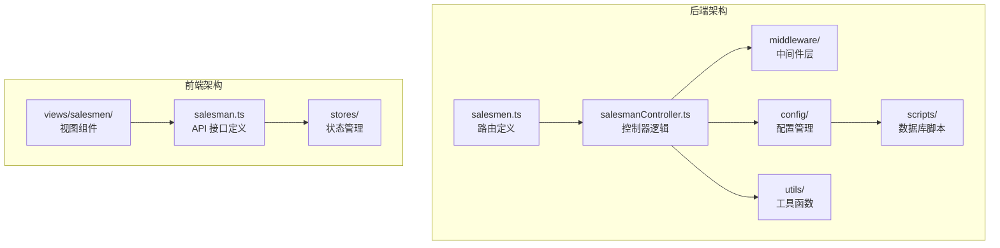
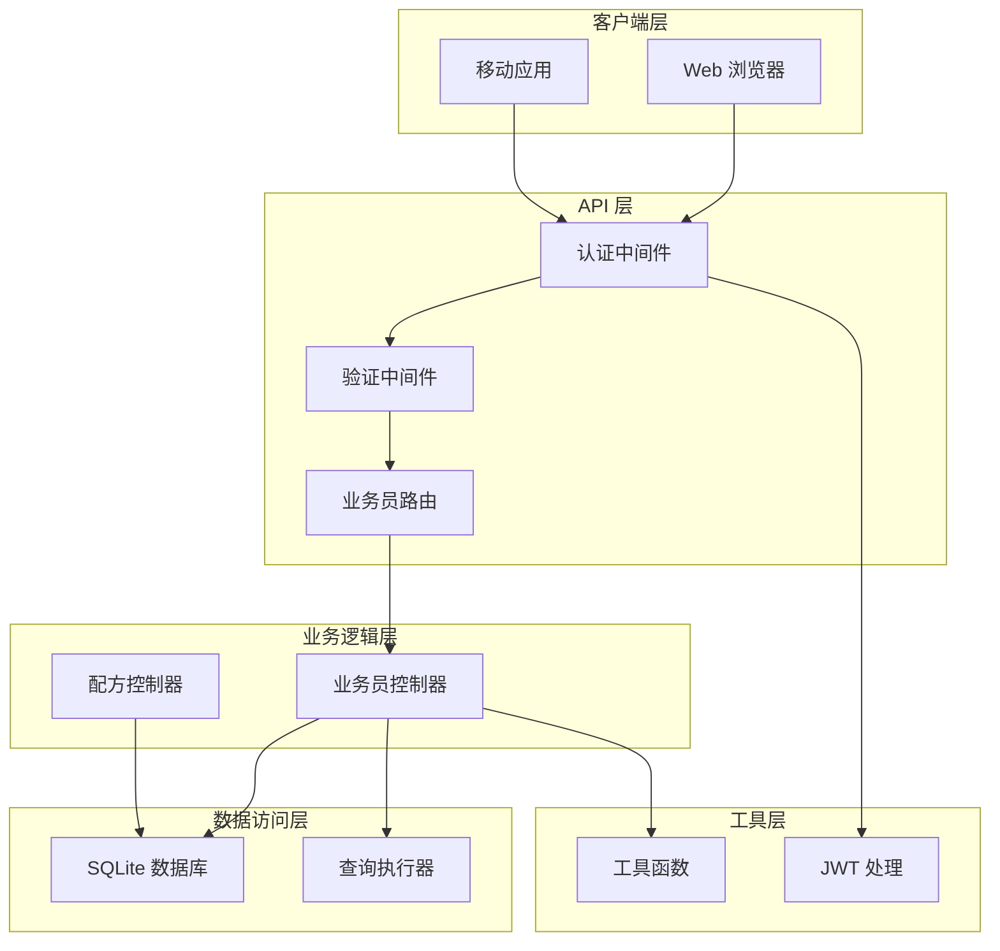
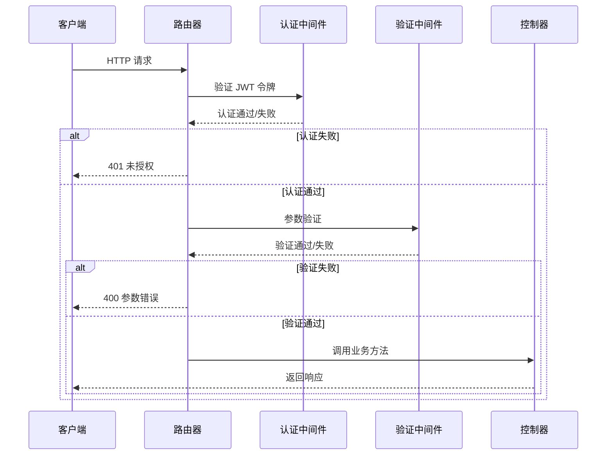
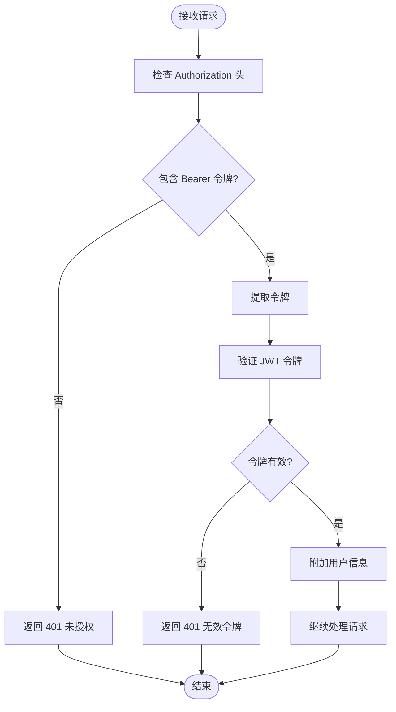
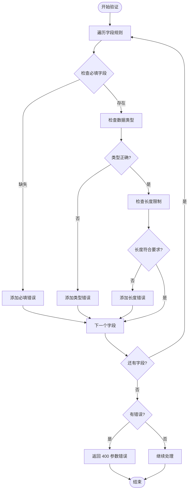
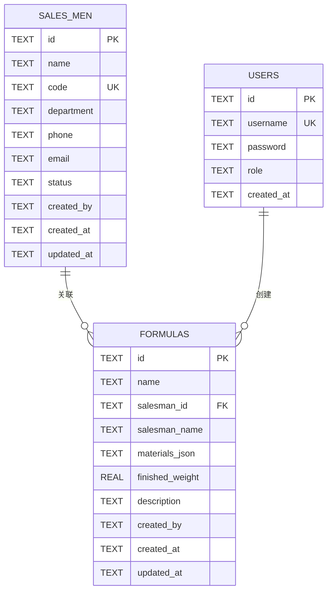
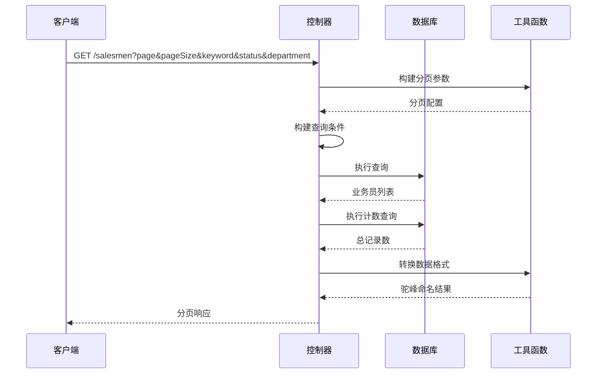
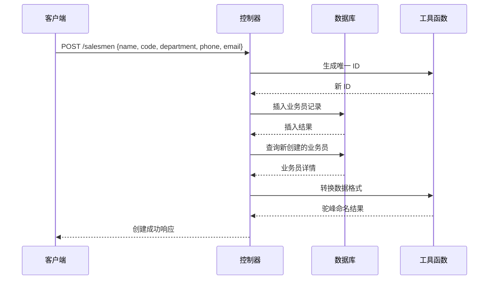

# 业务员路由模块

<cite>
**本文档引用的文件**
- [backend/src/routes/salesmen.ts](file://backend/src/routes/salesmen.ts)
- [backend/src/controllers/salesmanController.ts](file://backend/src/controllers/salesmanController.ts)
- [backend/src/middleware/auth.ts](file://backend/src/middleware/auth.ts)
- [backend/src/middleware/validate.ts](file://backend/src/middleware/validate.ts)
- [backend/src/config/database.ts](file://backend/src/config/database.ts)
- [backend/src/utils/helpers.ts](file://backend/src/utils/helpers.ts)
- [backend/src/config/index.ts](file://backend/src/config/index.ts)
- [backend/src/scripts/init.sql](file://backend/src/scripts/init.sql)
- [backend/src/routes/index.ts](file://backend/src/routes/index.ts)
- [frontend/src/api/salesman.ts](file://frontend/src/api/salesman.ts)
- [frontend/src/views/salesmen/SalesmanList.vue](file://frontend/src/views/salesmen/SalesmanList.vue)
- [frontend/src/views/salesmen/SalesmanForm.vue](file://frontend/src/views/salesmen/SalesmanForm.vue)
- [frontend/src/stores/salesman.ts](file://frontend/src/stores/salesman.ts)
- [backend/src/controllers/formulaController.ts](file://backend/src/controllers/formulaController.ts)
</cite>

## 目录
1. [简介](#简介)
2. [项目结构](#项目结构)
3. [核心组件](#核心组件)
4. [架构概览](#架构概览)
5. [详细组件分析](#详细组件分析)
6. [依赖关系分析](#依赖关系分析)
7. [性能考虑](#性能考虑)
8. [故障排除指南](#故障排除指南)
9. [结论](#结论)
10. [附录](#附录)

## 简介

业务员路由模块是 TingStudio 系统中的核心业务模块之一，负责管理业务员的完整生命周期。该模块提供了基于 RESTful API 的业务员信息管理功能，包括增删改查、状态管理和数据验证等核心能力。

本模块采用前后端分离架构，后端使用 Express.js 提供 RESTful API，前端使用 Vue.js 构建用户界面。系统通过 JWT 进行身份认证，使用 SQLite 数据库存储业务员数据，并通过外键约束确保数据完整性。

## 项目结构

业务员路由模块在项目中的组织结构如下：



**图表来源**
- [backend/src/routes/salesmen.ts:1-24](file://backend/src/routes/salesmen.ts#L1-L24)
- [backend/src/controllers/salesmanController.ts:1-125](file://backend/src/controllers/salesmanController.ts#L1-L125)
- [frontend/src/api/salesman.ts:1-41](file://frontend/src/api/salesman.ts#L1-L41)

**章节来源**
- [backend/src/routes/salesmen.ts:1-24](file://backend/src/routes/salesmen.ts#L1-L24)
- [backend/src/routes/index.ts:1-24](file://backend/src/routes/index.ts#L1-L24)

## 核心组件

### 路由层组件

业务员路由模块包含以下核心路由端点：

| HTTP 方法 | 路径 | 功能描述 | 认证要求 |
|-----------|------|----------|----------|
| GET | `/salesmen` | 获取业务员列表 | 是 |
| GET | `/salesmen/:id` | 获取业务员详情 | 是 |
| POST | `/salesmen` | 创建新业务员 | 是 |
| PUT | `/salesmen/:id` | 更新业务员信息 | 是 |
| DELETE | `/salesmen/:id` | 停用业务员（软删除） | 是 |

### 控制器层组件

控制器层实现了完整的业务逻辑处理，包括数据验证、数据库操作和响应格式化。

### 中间件层组件

系统集成了多层中间件来确保安全性、数据完整性和请求有效性。

**章节来源**
- [backend/src/routes/salesmen.ts:9-24](file://backend/src/routes/salesmen.ts#L9-L24)
- [backend/src/controllers/salesmanController.ts:6-125](file://backend/src/controllers/salesmanController.ts#L6-L125)

## 架构概览

业务员路由模块采用分层架构设计，确保关注点分离和代码可维护性：



**图表来源**
- [backend/src/middleware/auth.ts:13-31](file://backend/src/middleware/auth.ts#L13-L31)
- [backend/src/middleware/validate.ts:16-67](file://backend/src/middleware/validate.ts#L16-L67)
- [backend/src/controllers/salesmanController.ts:2-4](file://backend/src/controllers/salesmanController.ts#L2-L4)

## 详细组件分析

### 路由定义组件

业务员路由模块通过 Express Router 实现了完整的 RESTful API 定义：



**图表来源**
- [backend/src/routes/salesmen.ts:11-23](file://backend/src/routes/salesmen.ts#L11-L23)
- [backend/src/middleware/auth.ts:13-31](file://backend/src/middleware/auth.ts#L13-L31)
- [backend/src/middleware/validate.ts:16-67](file://backend/src/middleware/validate.ts#L16-L67)

#### 认证中间件分析

认证中间件负责验证客户端提供的 JWT 令牌，确保只有经过身份验证的用户才能访问业务员相关 API：



**图表来源**
- [backend/src/middleware/auth.ts:13-31](file://backend/src/middleware/auth.ts#L13-L31)

#### 数据验证中间件分析

验证中间件提供了灵活的参数验证机制，支持多种数据类型和验证规则：



**图表来源**
- [backend/src/middleware/validate.ts:16-67](file://backend/src/middleware/validate.ts#L16-L67)

### 控制器组件

业务员控制器实现了完整的 CRUD 操作，包括业务员列表查询、详情获取、创建、更新和停用功能。

#### 数据模型映射

业务员数据模型在不同层次的映射关系：



**图表来源**
- [backend/src/scripts/init.sql:55-67](file://backend/src/scripts/init.sql#L55-L67)
- [backend/src/scripts/init.sql:34-46](file://backend/src/scripts/init.sql#L34-L46)

#### 列表查询功能

业务员列表查询支持多条件过滤和分页功能：



**图表来源**
- [backend/src/controllers/salesmanController.ts:7-43](file://backend/src/controllers/salesmanController.ts#L7-L43)
- [backend/src/utils/helpers.ts:13-51](file://backend/src/utils/helpers.ts#L13-L51)

#### 创建业务员功能

创建业务员时的完整流程：



**图表来源**
- [backend/src/controllers/salesmanController.ts:62-83](file://backend/src/controllers/salesmanController.ts#L62-L83)
- [backend/src/utils/helpers.ts:3-11](file://backend/src/utils/helpers.ts#L3-L11)

### 前端集成组件

前端通过专门的 API 模块与后端进行交互，提供了完整的业务员管理界面。

#### API 接口定义

前端 API 模块定义了标准化的接口规范：

| 接口名称 | HTTP 方法 | URL 路径 | 功能描述 |
|----------|-----------|----------|----------|
| getList | GET | `/salesmen` | 获取业务员列表 |
| getById | GET | `/salesmen/:id` | 获取业务员详情 |
| create | POST | `/salesmen` | 创建业务员 |
| update | PUT | `/salesmen/:id` | 更新业务员 |
| delete | DELETE | `/salesmen/:id` | 停用业务员 |

#### 视图组件分析

前端提供了三个主要的视图组件来支持业务员管理：

1. **业务员列表组件**：展示业务员表格，支持搜索、分页和状态管理
2. **业务员表单组件**：提供业务员信息的创建和编辑功能
3. **业务员详情组件**：显示业务员的详细信息

**章节来源**
- [frontend/src/api/salesman.ts:24-40](file://frontend/src/api/salesman.ts#L24-L40)
- [frontend/src/views/salesmen/SalesmanList.vue:1-136](file://frontend/src/views/salesmen/SalesmanList.vue#L1-L136)
- [frontend/src/views/salesmen/SalesmanForm.vue:1-158](file://frontend/src/views/salesmen/SalesmanForm.vue#L1-L158)

## 依赖关系分析

业务员路由模块的依赖关系体现了清晰的分层架构：

```mermaid
graph TB
subgraph "外部依赖"
Express[Express.js]
BetterSQLite[better-sqlite3]
JWT[jsonwebtoken]
TDesign[TDesign UI]
end
subgraph "内部模块"
SalesmenRoutes[salesmen.ts]
SalesmanController[salesmanController.ts]
AuthMiddleware[auth.ts]
ValidateMiddleware[validate.ts]
DatabaseConfig[database.ts]
Helpers[helpers.ts]
Config[index.ts]
end
subgraph "前端模块"
SalesmanAPI[salesman.ts]
SalesmanStore[salesman.ts (store)]
SalesmanViews[SalesmanList.vue, SalesmanForm.vue]
end
Express --> SalesmenRoutes
SalesmenRoutes --> SalesmanController
SalesmanController --> AuthMiddleware
SalesmanController --> ValidateMiddleware
SalesmanController --> DatabaseConfig
SalesmanController --> Helpers
AuthMiddleware --> JWT
BetterSQLite --> DatabaseConfig
TDesign --> SalesmanViews
SalesmanAPI --> SalesmanStore
SalesmanStore --> SalesmanViews
```

**图表来源**
- [backend/src/routes/salesmen.ts:2-6](file://backend/src/routes/salesmen.ts#L2-L6)
- [backend/src/controllers/salesmanController.ts:2-4](file://backend/src/controllers/salesmanController.ts#L2-L4)
- [backend/src/middleware/auth.ts:3](file://backend/src/middleware/auth.ts#L3)

### 数据库关系分析

业务员与配方之间的关系通过外键约束实现：

```mermaid
erDiagram
SALES_MEN {
TEXT id PK
TEXT name
TEXT code UK
TEXT status
}
FORMULAS {
TEXT id PK
TEXT name
TEXT salesman_id FK
TEXT salesman_name
TEXT materials_json
TEXT created_by
TEXT created_at
}
SALES_MEN ||--o{ FORMULAS : "创建的配方"
note for SALES_MEN """
外键约束:
- ON DELETE RESTRICT
- 确保业务员存在时才能创建配方
"""
note for FORMULAS """
外键约束:
- FOREIGN KEY (salesman_id) REFERENCES salesmen(id)
- ON DELETE RESTRICT
"""
```

**图表来源**
- [backend/src/scripts/init.sql:34-46](file://backend/src/scripts/init.sql#L34-L46)
- [backend/src/scripts/init.sql:55-67](file://backend/src/scripts/init.sql#L55-L67)

**章节来源**
- [backend/src/scripts/init.sql:34-46](file://backend/src/scripts/init.sql#L34-L46)
- [backend/src/scripts/init.sql:55-67](file://backend/src/scripts/init.sql#L55-L67)

## 性能考虑

### 数据库优化策略

1. **索引优化**：为常用查询字段建立索引，包括业务员姓名、工号和状态字段
2. **分页查询**：实现合理的分页机制，避免一次性加载大量数据
3. **查询优化**：使用参数化查询防止 SQL 注入，优化查询条件构建

### 缓存策略

1. **响应缓存**：对于不频繁变化的数据可以考虑适当的缓存策略
2. **查询结果缓存**：对热门查询结果进行缓存以提高响应速度

### 并发处理

1. **事务管理**：使用数据库事务确保数据一致性
2. **连接池管理**：合理配置数据库连接池大小

## 故障排除指南

### 常见错误及解决方案

#### 认证相关错误

| 错误代码 | 错误信息 | 可能原因 | 解决方案 |
|----------|----------|----------|----------|
| 401 | 未提供认证令牌 | 缺少 Authorization 头 | 在请求头中添加有效的 JWT 令牌 |
| 401 | 令牌无效或已过期 | JWT 令牌格式错误或已过期 | 重新登录获取新的 JWT 令牌 |
| 403 | 权限不足 | 用户权限不足 | 确认用户具有相应的操作权限 |

#### 数据验证错误

| 错误代码 | 错误信息 | 可能原因 | 解决方案 |
|----------|----------|----------|----------|
| 400 | 参数验证失败 | 请求参数不符合验证规则 | 检查请求参数格式和长度限制 |
| 409 | 业务员工号已存在 | 工号重复 | 使用唯一的业务员工号 |

#### 数据库相关错误

| 错误代码 | 错误信息 | 可能原因 | 解决方案 |
|----------|----------|----------|----------|
| 500 | 获取业务员列表失败 | 数据库查询异常 | 检查数据库连接和查询语句 |
| 500 | 创建业务员失败 | 数据库插入异常 | 检查唯一约束和数据完整性 |

**章节来源**
- [backend/src/middleware/auth.ts:15-30](file://backend/src/middleware/auth.ts#L15-L30)
- [backend/src/controllers/salesmanController.ts:77-82](file://backend/src/controllers/salesmanController.ts#L77-L82)

## 结论

业务员路由模块是一个设计良好、功能完整的业务模块，具有以下特点：

1. **清晰的架构设计**：采用分层架构，职责分离明确
2. **完善的安全机制**：集成 JWT 认证和参数验证
3. **良好的扩展性**：模块化设计便于功能扩展
4. **完整的前端集成**：提供直观的用户界面和良好的用户体验

该模块为 TingStudio 系统提供了可靠的业务员管理基础，支持业务员信息的完整生命周期管理，并为后续的功能扩展奠定了坚实的基础。

## 附录

### API 完整示例

#### 获取业务员列表
```
GET /salesmen?page=1&pageSize=10&keyword=张&status=active
Authorization: Bearer <jwt-token>
```

#### 创建业务员
```
POST /salesmen
Content-Type: application/json
Authorization: Bearer <jwt-token>

{
  "name": "张三",
  "code": "EMP001",
  "department": "销售部",
  "phone": "13800138000",
  "email": "zhangsan@example.com"
}
```

#### 更新业务员
```
PUT /salesmen/:id
Content-Type: application/json
Authorization: Bearer <jwt-token>

{
  "name": "张三丰",
  "phone": "13900139000"
}
```

#### 停用业务员
```
DELETE /salesmen/:id
Authorization: Bearer <jwt-token>
```

### 数据安全考虑

1. **传输安全**：建议在生产环境中使用 HTTPS 协议
2. **令牌管理**：合理设置 JWT 令牌的过期时间
3. **输入验证**：严格验证所有用户输入数据
4. **权限控制**：确保只有授权用户才能访问敏感数据
5. **日志记录**：记录重要的操作日志以便审计