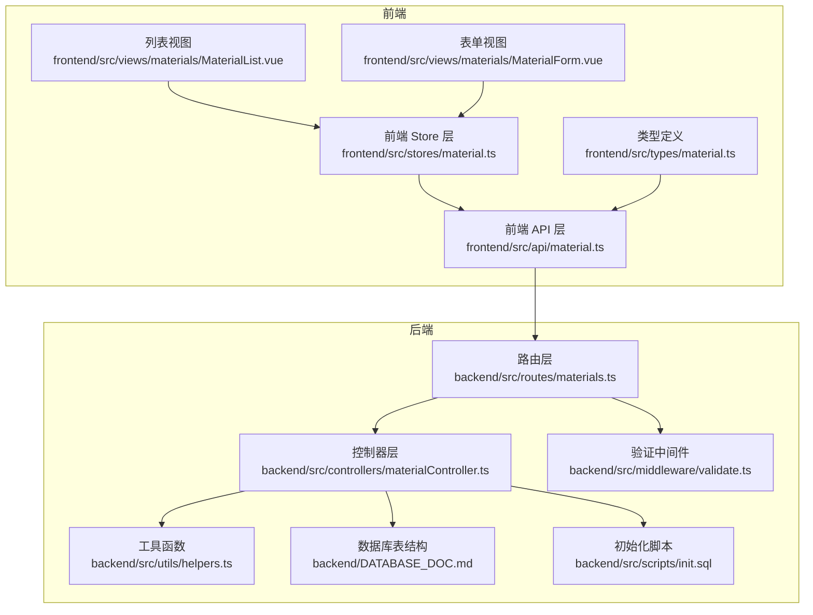
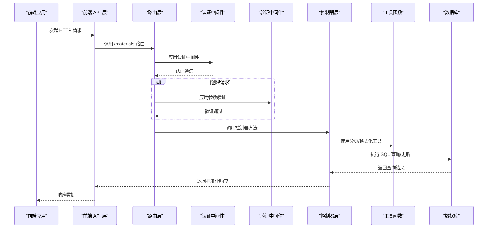
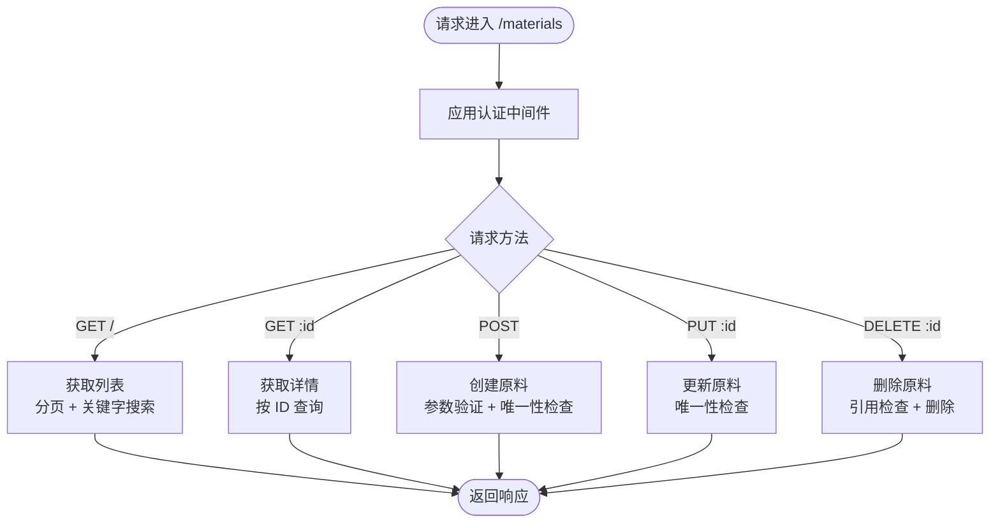
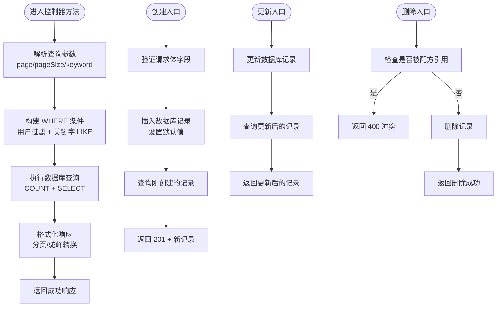
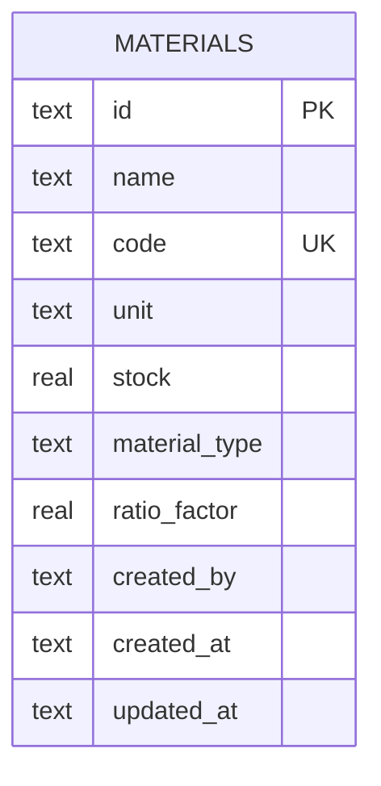
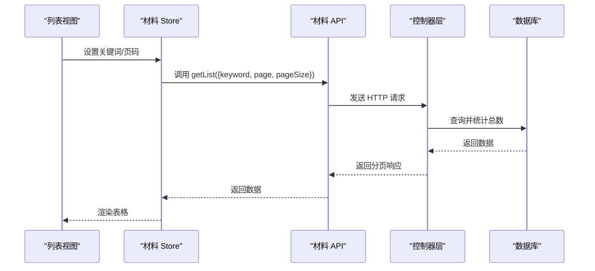
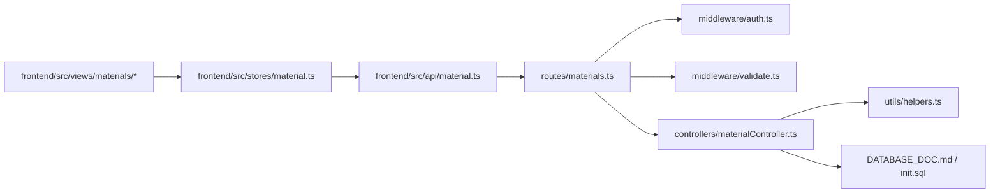

# 原料路由模块

<cite>
**本文档引用的文件**
- [backend/src/routes/materials.ts](file://backend/src/routes/materials.ts)
- [backend/src/controllers/materialController.ts](file://backend/src/controllers/materialController.ts)
- [backend/src/middleware/validate.ts](file://backend/src/middleware/validate.ts)
- [backend/src/utils/helpers.ts](file://backend/src/utils/helpers.ts)
- [backend/DATABASE_DOC.md](file://backend/DATABASE_DOC.md)
- [backend/src/scripts/init.sql](file://backend/src/scripts/init.sql)
- [frontend/src/api/material.ts](file://frontend/src/api/material.ts)
- [frontend/src/types/material.ts](file://frontend/src/types/material.ts)
- [frontend/src/stores/material.ts](file://frontend/src/stores/material.ts)
- [frontend/src/views/materials/MaterialList.vue](file://frontend/src/views/materials/MaterialList.vue)
- [frontend/src/views/materials/MaterialForm.vue](file://frontend/src/views/materials/MaterialForm.vue)
</cite>

## 目录
1. [简介](#简介)
2. [项目结构](#项目结构)
3. [核心组件](#核心组件)
4. [架构概览](#架构概览)
5. [详细组件分析](#详细组件分析)
6. [依赖分析](#依赖分析)
7. [性能考虑](#性能考虑)
8. [故障排除指南](#故障排除指南)
9. [结论](#结论)
10. [附录](#附录)

## 简介
本文件详细说明了 TingStudio 项目中 /materials 前缀下的原料管理路由模块。该模块实现了原料的完整 CRUD 操作（创建、读取、更新、删除），支持分页查询、关键字搜索过滤，并通过统一的验证中间件确保请求数据的有效性。同时，后端与前端通过标准化的数据模型进行交互，前端提供了完整的列表展示、搜索、分页以及表单编辑能力。

## 项目结构
原料路由模块位于后端的路由层，控制器层处理业务逻辑，验证中间件负责请求参数校验，工具函数提供分页、响应格式化等通用能力。前端通过 API 层与后端交互，Store 管理状态，视图组件负责用户界面展示。

**图表来源**
- [backend/src/routes/materials.ts:1-22](file://backend/src/routes/materials.ts#L1-L22)
- [backend/src/controllers/materialController.ts:1-129](file://backend/src/controllers/materialController.ts#L1-L129)
- [backend/src/middleware/validate.ts:1-68](file://backend/src/middleware/validate.ts#L1-L68)
- [backend/src/utils/helpers.ts:1-86](file://backend/src/utils/helpers.ts#L1-L86)
- [backend/DATABASE_DOC.md:44-65](file://backend/DATABASE_DOC.md#L44-L65)
- [backend/src/scripts/init.sql:17-29](file://backend/src/scripts/init.sql#L17-L29)

**章节来源**
- [backend/src/routes/materials.ts:1-22](file://backend/src/routes/materials.ts#L1-L22)
- [backend/src/controllers/materialController.ts:1-129](file://backend/src/controllers/materialController.ts#L1-L129)
- [backend/src/middleware/validate.ts:1-68](file://backend/src/middleware/validate.ts#L1-L68)
- [backend/src/utils/helpers.ts:1-86](file://backend/src/utils/helpers.ts#L1-L86)
- [backend/DATABASE_DOC.md:44-65](file://backend/DATABASE_DOC.md#L44-L65)
- [backend/src/scripts/init.sql:17-29](file://backend/src/scripts/init.sql#L17-L29)

## 核心组件
- 路由层：定义 /materials 前缀下的所有端点，包括 GET 列表、GET 单条、POST 创建、PUT 更新、DELETE 删除，并在路由层应用认证中间件。
- 控制器层：实现具体的业务逻辑，包括分页查询、关键字搜索、唯一性校验、删除前的引用检查等。
- 验证中间件：提供统一的请求体参数校验，支持必填、类型、长度、数值范围等规则。
- 工具函数：提供分页构建、LIKE 条件构造、响应格式化、数据库字段命名转换等通用能力。
- 数据模型：后端数据库表 materials 的字段定义与前端类型定义保持一致，确保前后端数据契约清晰。

**章节来源**
- [backend/src/routes/materials.ts:7-22](file://backend/src/routes/materials.ts#L7-L22)
- [backend/src/controllers/materialController.ts:6-129](file://backend/src/controllers/materialController.ts#L6-L129)
- [backend/src/middleware/validate.ts:16-67](file://backend/src/middleware/validate.ts#L16-L67)
- [backend/src/utils/helpers.ts:13-51](file://backend/src/utils/helpers.ts#L13-L51)
- [backend/DATABASE_DOC.md:44-65](file://backend/DATABASE_DOC.md#L44-L65)

## 架构概览
以下序列图展示了从前端发起请求到后端处理并返回响应的完整流程，涵盖认证、参数验证、业务处理和错误处理。

**图表来源**
- [backend/src/routes/materials.ts:9-21](file://backend/src/routes/materials.ts#L9-L21)
- [backend/src/middleware/validate.ts:16-67](file://backend/src/middleware/validate.ts#L16-L67)
- [backend/src/controllers/materialController.ts:6-129](file://backend/src/controllers/materialController.ts#L6-L129)
- [backend/src/utils/helpers.ts:13-51](file://backend/src/utils/helpers.ts#L13-L51)

## 详细组件分析

### 路由定义与端点说明
- 路由前缀：/materials
- 中间件：
  - 认证中间件：所有端点均需通过认证。
  - 参数验证中间件：仅创建端点应用验证规则。
- 端点列表：
  - GET /materials：获取原料列表（支持分页、关键字搜索）
  - GET /materials/:id：获取指定原料详情
  - POST /materials：创建新原料（需要参数验证）
  - PUT /materials/:id：更新指定原料
  - DELETE /materials/:id：删除指定原料（检查是否被配方引用）

**图表来源**
- [backend/src/routes/materials.ts:9-21](file://backend/src/routes/materials.ts#L9-L21)

**章节来源**
- [backend/src/routes/materials.ts:1-22](file://backend/src/routes/materials.ts#L1-L22)

### 控制器逻辑与数据处理
- 列表查询：
  - 支持分页：page、pageSize 参数，内部转换为 limit/offset。
  - 支持关键字搜索：name 或 code 匹配，自动转义特殊字符。
  - 按创建人过滤：仅返回当前用户创建的原料。
  - 统一分页响应：返回 list、total、page、pageSize、totalPages。
- 单条查询：按 ID 查询，未找到时返回 404。
- 创建原料：
  - 默认值：unit 默认 g；stock 默认 0；materialType 默认 herb；ratioFactor 默认 0.18。
  - 唯一性检查：code 唯一，冲突返回 409。
- 更新原料：
  - 支持部分字段更新。
  - 唯一性检查：code 唯一，冲突返回 409。
- 删除原料：
  - 引用检查：若在 formulas 的 materials_json 中被引用则拒绝删除。
  - 删除成功后返回成功消息。

**图表来源**
- [backend/src/controllers/materialController.ts:6-129](file://backend/src/controllers/materialController.ts#L6-L129)
- [backend/src/utils/helpers.ts:13-51](file://backend/src/utils/helpers.ts#L13-L51)

**章节来源**
- [backend/src/controllers/materialController.ts:6-129](file://backend/src/controllers/materialController.ts#L6-L129)
- [backend/src/utils/helpers.ts:13-51](file://backend/src/utils/helpers.ts#L13-L51)

### 参数验证规则与数据模型
- 创建请求体验证规则（validateBody）：
  - name：字符串，必填，最小长度 1。
  - code：字符串，必填，最小长度 1。
- 响应格式：
  - 成功响应：success=true，message=操作成功/查询成功等，data 为具体数据或分页对象。
  - 分页响应：包含 list、pagination（含 page、pageSize、total、totalPages）。
- 数据模型映射：
  - 后端数据库字段与前端类型定义保持一致，工具函数负责下划线到驼峰的转换。
  - materials 表字段：id、name、code、unit、stock、material_type、ratio_factor、created_by、created_at、updated_at。

**图表来源**
- [backend/DATABASE_DOC.md:44-65](file://backend/DATABASE_DOC.md#L44-L65)
- [backend/src/scripts/init.sql:17-29](file://backend/src/scripts/init.sql#L17-L29)

**章节来源**
- [backend/src/middleware/validate.ts:16-67](file://backend/src/middleware/validate.ts#L16-L67)
- [backend/src/utils/helpers.ts:26-51](file://backend/src/utils/helpers.ts#L26-L51)
- [backend/DATABASE_DOC.md:44-65](file://backend/DATABASE_DOC.md#L44-L65)
- [backend/src/scripts/init.sql:17-29](file://backend/src/scripts/init.sql#L17-L29)

### 前端集成与用户界面
- API 层：
  - 提供 getList、getById、create、update、delete 等方法，参数与后端路由一致。
  - 支持 keyword、page、pageSize 查询参数。
- Store 层：
  - 管理列表数据、加载状态、分页参数、关键词等。
  - 提供创建、更新、删除操作的封装，调用 API 并刷新列表。
- 视图组件：
  - MaterialList：表格展示、分页、搜索、操作按钮（查看、编辑、删除）。
  - MaterialForm：表单输入、字段校验、提交处理、类型切换时的系数默认值调整。

**图表来源**
- [frontend/src/views/materials/MaterialList.vue:16-124](file://frontend/src/views/materials/MaterialList.vue#L16-L124)
- [frontend/src/stores/material.ts:16-37](file://frontend/src/stores/material.ts#L16-L37)
- [frontend/src/api/material.ts:26-28](file://frontend/src/api/material.ts#L26-L28)

**章节来源**
- [frontend/src/api/material.ts:1-45](file://frontend/src/api/material.ts#L1-L45)
- [frontend/src/stores/material.ts:1-130](file://frontend/src/stores/material.ts#L1-L130)
- [frontend/src/views/materials/MaterialList.vue:1-342](file://frontend/src/views/materials/MaterialList.vue#L1-L342)
- [frontend/src/views/materials/MaterialForm.vue:1-204](file://frontend/src/views/materials/MaterialForm.vue#L1-L204)

## 依赖分析
- 路由层依赖：
  - 认证中间件：确保所有端点的安全访问。
  - 验证中间件：仅在创建端点应用，保证请求体符合规则。
  - 控制器：路由层直接调用控制器方法。
- 控制器层依赖：
  - 数据库查询：使用统一的 query 函数执行 SQL。
  - 工具函数：分页构建、LIKE 条件、响应格式化、命名转换。
  - 数据库表结构：materials 表的字段定义与查询语句一致。
- 前端依赖：
  - API 层：与后端路由一一对应。
  - Store 层：集中管理状态与副作用。
  - 视图组件：负责用户交互与展示。

**图表来源**
- [backend/src/routes/materials.ts:3-5](file://backend/src/routes/materials.ts#L3-L5)
- [backend/src/middleware/validate.ts:1-68](file://backend/src/middleware/validate.ts#L1-L68)
- [backend/src/controllers/materialController.ts:1-129](file://backend/src/controllers/materialController.ts#L1-L129)
- [backend/src/utils/helpers.ts:1-86](file://backend/src/utils/helpers.ts#L1-L86)
- [backend/DATABASE_DOC.md:44-65](file://backend/DATABASE_DOC.md#L44-L65)
- [backend/src/scripts/init.sql:17-29](file://backend/src/scripts/init.sql#L17-L29)
- [frontend/src/api/material.ts:1-45](file://frontend/src/api/material.ts#L1-L45)
- [frontend/src/stores/material.ts:1-130](file://frontend/src/stores/material.ts#L1-L130)

**章节来源**
- [backend/src/routes/materials.ts:1-22](file://backend/src/routes/materials.ts#L1-L22)
- [backend/src/controllers/materialController.ts:1-129](file://backend/src/controllers/materialController.ts#L1-L129)
- [backend/src/middleware/validate.ts:1-68](file://backend/src/middleware/validate.ts#L1-L68)
- [backend/src/utils/helpers.ts:1-86](file://backend/src/utils/helpers.ts#L1-L86)
- [frontend/src/api/material.ts:1-45](file://frontend/src/api/material.ts#L1-L45)
- [frontend/src/stores/material.ts:1-130](file://frontend/src/stores/material.ts#L1-L130)

## 性能考虑
- 分页参数限制：
  - page 最小为 1，pageSize 最小为 1，最大为 100，避免过大请求导致性能问题。
- 查询优化：
  - materials 表包含 name 和 code 的索引，有利于关键字搜索。
  - 列表查询按 created_by 过滤，结合索引可提升查询效率。
- 响应格式化：
  - 使用 rowsToCamelCase 将数据库下划线字段转换为驼峰命名，减少前端额外处理。
- 删除前检查：
  - 通过 LIKE 模糊匹配 JSON 文本判断引用，避免破坏数据完整性，但可能影响性能。建议在高并发场景下考虑更精确的引用表或索引优化。

[本节为通用性能讨论，不直接分析具体文件，故无章节来源]

## 故障排除指南
- 参数验证失败：
  - 现象：返回 400，包含错误数组。
  - 原因：必填字段缺失、类型不符、长度或数值范围超限。
  - 处理：根据错误提示修正请求体字段。
- 原料编码冲突：
  - 现象：创建/更新返回 409，提示“原料编码已存在”。
  - 原因：code 字段唯一约束冲突。
  - 处理：修改编码为唯一值。
- 原料不存在：
  - 现象：查询/更新/删除指定 ID 返回 404。
  - 原因：ID 无效或已被删除。
  - 处理：确认 ID 正确性或重新获取最新列表。
- 原料被引用：
  - 现象：删除返回 400，提示“该原料正在被配方使用，无法删除”。
  - 原因：在 formulas 的 materials_json 中存在引用。
  - 处理：先移除配方中的该原料再删除。
- 数据库错误：
  - 现象：返回 500，包含错误信息。
  - 原因：SQL 执行异常、连接问题等。
  - 处理：检查数据库状态与日志，重试请求。

**章节来源**
- [backend/src/middleware/validate.ts:60-66](file://backend/src/middleware/validate.ts#L60-L66)
- [backend/src/controllers/materialController.ts:73-78](file://backend/src/controllers/materialController.ts#L73-L78)
- [backend/src/controllers/materialController.ts:99-105](file://backend/src/controllers/materialController.ts#L99-L105)
- [backend/src/controllers/materialController.ts:46-49](file://backend/src/controllers/materialController.ts#L46-L49)
- [backend/src/controllers/materialController.ts:118-121](file://backend/src/controllers/materialController.ts#L118-L121)

## 结论
原料路由模块通过清晰的路由定义、严格的参数验证、完善的业务逻辑与前后端协作，实现了稳定高效的原料管理能力。其分页、搜索、唯一性约束与引用检查等特性满足了实际业务需求。建议在后续迭代中关注删除引用检查的性能优化，并持续完善错误处理与日志记录。

[本节为总结性内容，不直接分析具体文件，故无章节来源]

## 附录

### 路由参数与响应规范
- 列表查询参数：
  - keyword：字符串，关键字搜索（name 或 code）。
  - page：数字，页码，默认 1，最小 1。
  - pageSize：数字，每页条数，默认 20，最大 100。
- 单条查询：
  - :id：字符串，原料唯一标识。
- 创建请求体：
  - name：字符串，必填。
  - code：字符串，必填。
  - unit：字符串，可选，默认 g。
  - stock：数字，可选，默认 0。
  - materialType：字符串，可选，默认 herb。
  - ratioFactor：数字，可选，默认 0.18（herb）或 1（supplement）。
- 更新请求体：
  - 支持部分字段更新，规则同创建。

**章节来源**
- [backend/src/routes/materials.ts:11-21](file://backend/src/routes/materials.ts#L11-L21)
- [backend/src/middleware/validate.ts:16-67](file://backend/src/middleware/validate.ts#L16-L67)
- [backend/src/controllers/materialController.ts:58-106](file://backend/src/controllers/materialController.ts#L58-L106)

### 数据模型字段说明
- materials 表字段：
  - id：主键，唯一标识。
  - name：原料名称。
  - code：原料编码，唯一。
  - unit：计量单位，默认 g。
  - stock：库存数量，默认 0。
  - material_type：原料类型，默认 herb。
  - ratio_factor：含量比系数，默认 0.18。
  - created_by：创建人。
  - created_at：创建时间。
  - updated_at：更新时间。

**章节来源**
- [backend/DATABASE_DOC.md:44-65](file://backend/DATABASE_DOC.md#L44-L65)
- [backend/src/scripts/init.sql:17-29](file://backend/src/scripts/init.sql#L17-L29)