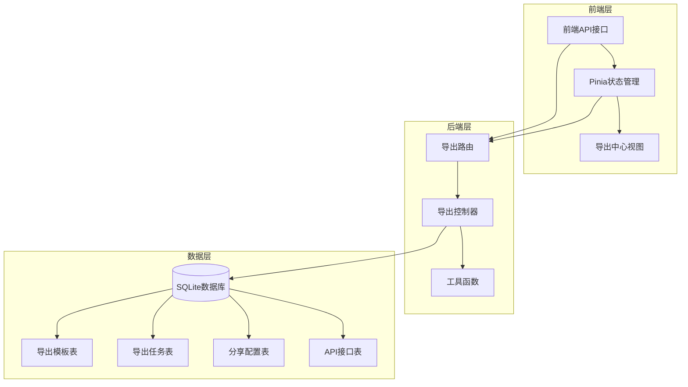
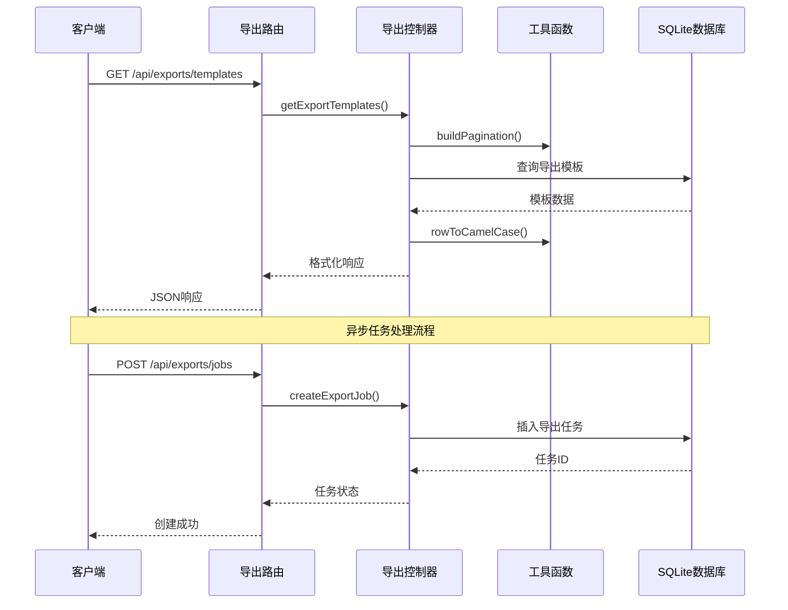
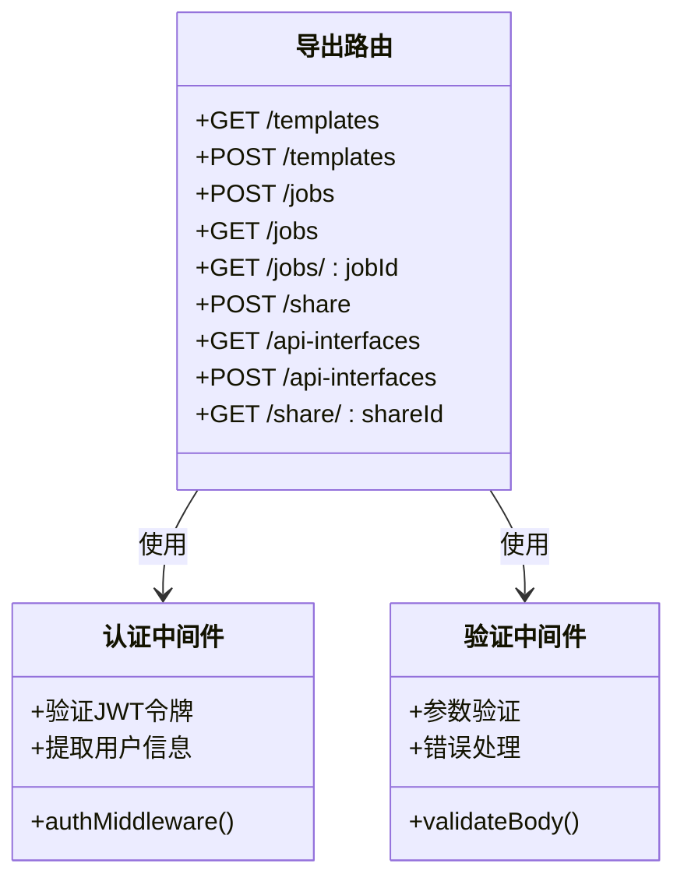
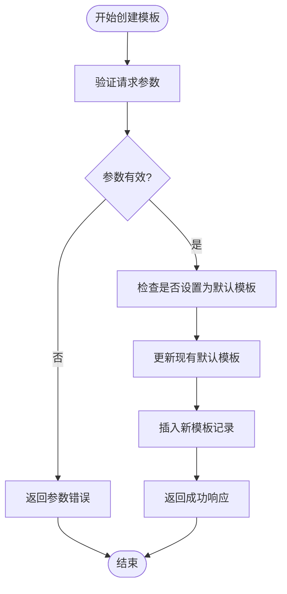
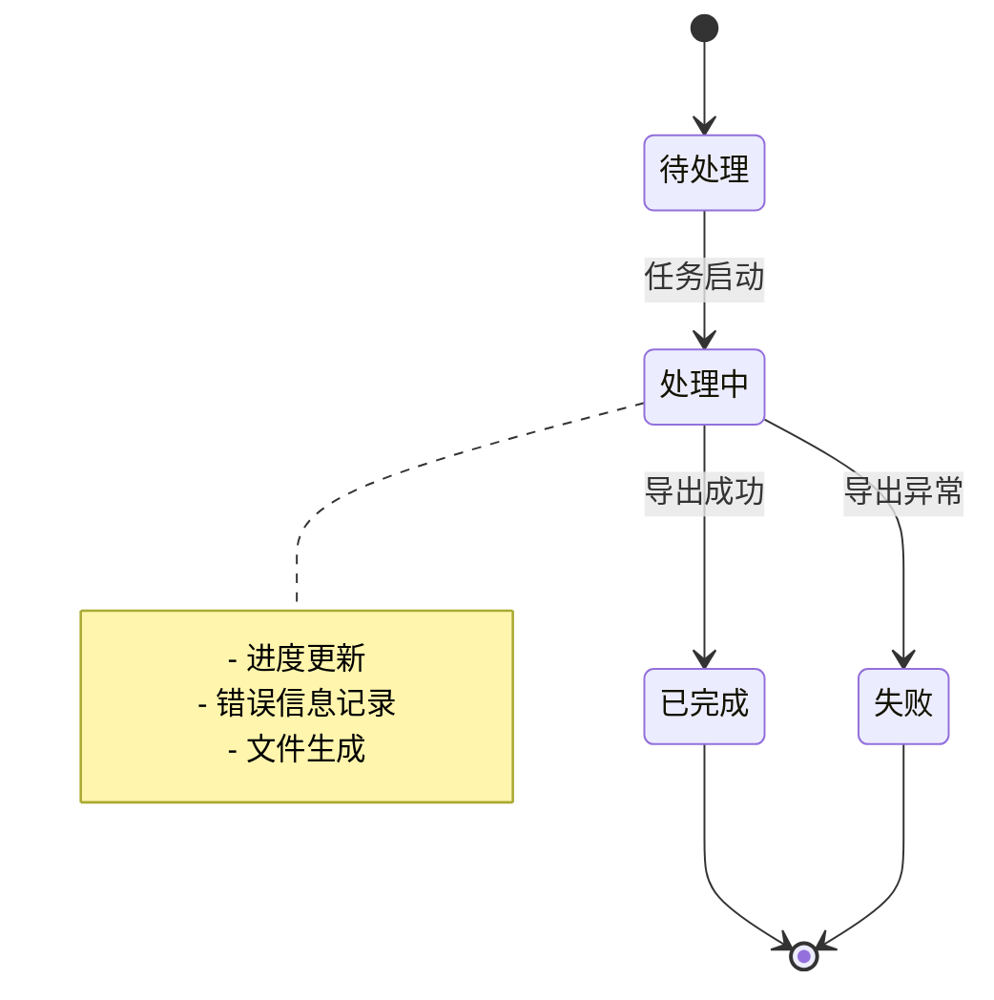
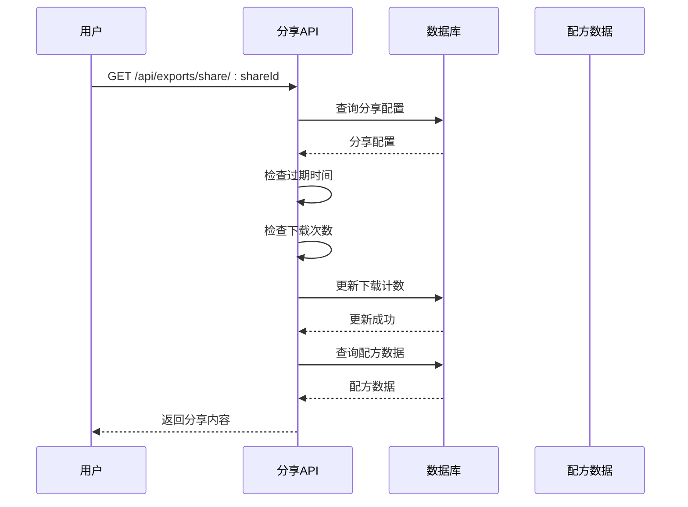
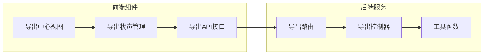
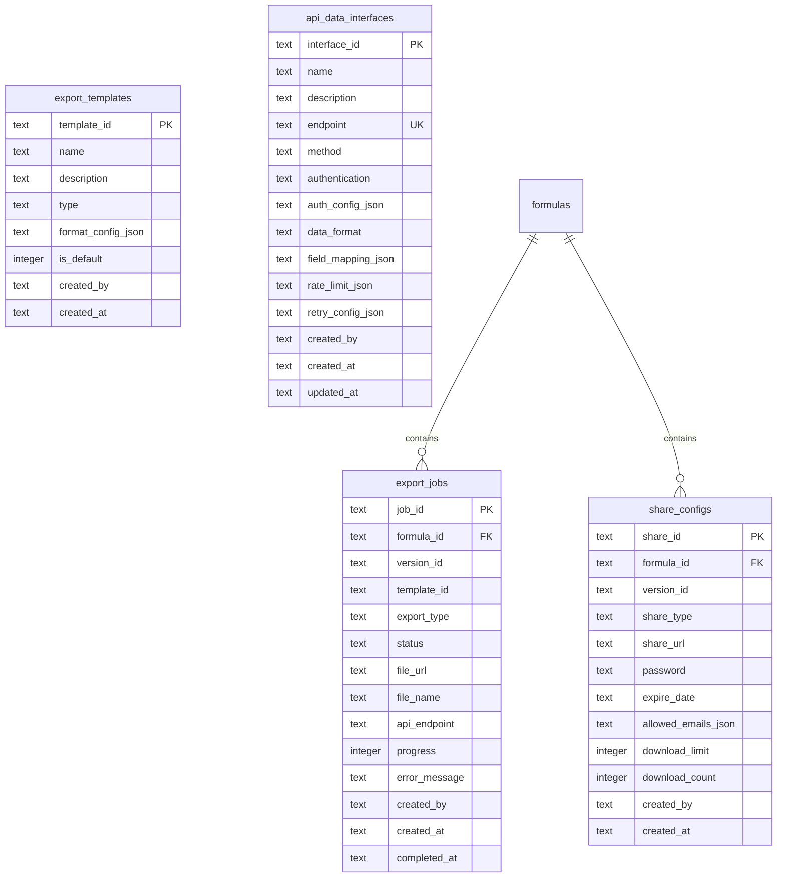

# 导出路由模块

<cite>
**本文档引用的文件**
- [backend/src/routes/exports.ts](file://backend/src/routes/exports.ts)
- [backend/src/controllers/exportController.ts](file://backend/src/controllers/exportController.ts)
- [backend/src/utils/helpers.ts](file://backend/src/utils/helpers.ts)
- [backend/DATABASE_DOC.md](file://backend/DATABASE_DOC.md)
- [backend/API_DOC.md](file://backend/API_DOC.md)
- [frontend/src/api/export.ts](file://frontend/src/api/export.ts)
- [frontend/src/stores/export.ts](file://frontend/src/stores/export.ts)
- [frontend/src/views/exports/ExportCenter.vue](file://frontend/src/views/exports/ExportCenter.vue)
</cite>

## 目录
1. [简介](#简介)
2. [项目结构](#项目结构)
3. [核心组件](#核心组件)
4. [架构概览](#架构概览)
5. [详细组件分析](#详细组件分析)
6. [依赖关系分析](#依赖关系分析)
7. [性能考虑](#性能考虑)
8. [故障排除指南](#故障排除指南)
9. [结论](#结论)
10. [附录](#附录)

## 简介
导出路由模块是 TingStudio 配方管理系统中的核心功能模块，负责管理配方数据的导出、模板管理和分享功能。该模块提供了完整的异步导出任务处理机制，支持 PDF、Excel、API 和打印等多种导出格式，并具备完善的任务状态跟踪和进度监控能力。

## 项目结构
导出路由模块采用典型的 MVC 架构模式，包含路由层、控制器层和数据访问层：



**图表来源**
- [backend/src/routes/exports.ts:1-34](file://backend/src/routes/exports.ts#L1-L34)
- [backend/src/controllers/exportController.ts:1-230](file://backend/src/controllers/exportController.ts#L1-L230)
- [backend/DATABASE_DOC.md:175-270](file://backend/DATABASE_DOC.md#L175-L270)

**章节来源**
- [backend/src/routes/exports.ts:1-34](file://backend/src/routes/exports.ts#L1-L34)
- [backend/src/controllers/exportController.ts:1-230](file://backend/src/controllers/exportController.ts#L1-L230)

## 核心组件
导出路由模块包含以下核心组件：

### 路由组件
- **模板管理路由**：处理导出模板的创建、查询和管理
- **导出任务路由**：处理导出任务的创建、查询和状态跟踪
- **分享管理路由**：处理配方分享链接的创建和访问
- **API接口管理路由**：处理外部API对接配置

### 控制器组件
- **模板控制器**：管理导出模板的生命周期
- **任务控制器**：处理导出任务的异步执行
- **分享控制器**：管理公开分享链接的访问控制
- **API接口控制器**：管理外部数据接口配置

### 数据模型组件
- **导出模板模型**：定义模板配置结构
- **导出任务模型**：定义任务状态和进度
- **分享配置模型**：定义公开分享的访问规则
- **API接口模型**：定义外部数据对接配置

**章节来源**
- [backend/src/routes/exports.ts:14-34](file://backend/src/routes/exports.ts#L14-L34)
- [backend/src/controllers/exportController.ts:6-230](file://backend/src/controllers/exportController.ts#L6-L230)
- [backend/DATABASE_DOC.md:175-270](file://backend/DATABASE_DOC.md#L175-L270)

## 架构概览
导出路由模块采用分层架构设计，确保了良好的可维护性和扩展性：



**图表来源**
- [backend/src/routes/exports.ts:17-23](file://backend/src/routes/exports.ts#L17-L23)
- [backend/src/controllers/exportController.ts:6-117](file://backend/src/controllers/exportController.ts#L6-L117)
- [backend/src/utils/helpers.ts:13-51](file://backend/src/utils/helpers.ts#L13-L51)

## 详细组件分析

### 导出路由定义
导出路由模块在 `/api/exports` 前缀下提供完整的导出功能接口：



**图表来源**
- [backend/src/routes/exports.ts:1-34](file://backend/src/routes/exports.ts#L1-L34)

### 模板管理功能
模板管理功能支持创建、查询和管理导出模板：

#### 模板数据模型
导出模板包含以下关键字段：
- `templateId`: 模板唯一标识符
- `name`: 模板名称
- `description`: 模板描述
- `type`: 模板类型（pdf/excel/api/print）
- `formatConfig`: 格式配置对象
- `isDefault`: 是否为默认模板
- `createdBy`: 创建人
- `createdAt`: 创建时间

#### 模板创建流程


**图表来源**
- [backend/src/controllers/exportController.ts:33-53](file://backend/src/controllers/exportController.ts#L33-L53)

**章节来源**
- [backend/src/controllers/exportController.ts:6-53](file://backend/src/controllers/exportController.ts#L6-L53)
- [backend/DATABASE_DOC.md:175-191](file://backend/DATABASE_DOC.md#L175-L191)

### 导出任务管理
导出任务管理功能提供异步任务处理机制：

#### 任务状态流转


#### 任务数据模型
导出任务包含以下字段：
- `jobId`: 任务唯一标识符
- `formulaId`: 配方ID
- `versionId`: 版本ID
- `templateId`: 模板ID
- `exportType`: 导出类型
- `status`: 任务状态
- `fileUrl`: 文件URL
- `fileName`: 文件名
- `progress`: 进度百分比
- `errorMessage`: 错误信息
- `createdBy`: 创建人
- `createdAt`: 创建时间
- `completedAt`: 完成时间

**章节来源**
- [backend/src/controllers/exportController.ts:55-117](file://backend/src/controllers/exportController.ts#L55-L117)
- [backend/DATABASE_DOC.md:194-221](file://backend/DATABASE_DOC.md#L194-L221)

### 分享管理功能
分享管理功能允许用户创建公开分享链接：

#### 分享配置模型
- `shareId`: 分享ID
- `formulaId`: 配方ID
- `versionId`: 版本ID
- `shareType`: 分享类型
- `shareUrl`: 分享URL
- `password`: 访问密码
- `expireDate`: 过期日期
- `allowedEmails`: 允许邮箱列表
- `downloadLimit`: 下载次数限制
- `downloadCount`: 已下载次数

#### 分享访问流程


**图表来源**
- [backend/src/controllers/exportController.ts:141-185](file://backend/src/controllers/exportController.ts#L141-L185)

**章节来源**
- [backend/src/controllers/exportController.ts:119-185](file://backend/src/controllers/exportController.ts#L119-L185)
- [backend/DATABASE_DOC.md:248-270](file://backend/DATABASE_DOC.md#L248-L270)

### API接口管理
API接口管理功能支持外部系统集成：

#### API接口数据模型
- `interfaceId`: 接口ID
- `name`: 接口名称
- `description`: 接口描述
- `endpoint`: 端点地址
- `method`: HTTP方法
- `authentication`: 认证方式
- `authConfig`: 认证配置
- `dataFormat`: 数据格式
- `fieldMapping`: 字段映射
- `rateLimit`: 限流配置
- `retryConfig`: 重试配置

**章节来源**
- [backend/src/controllers/exportController.ts:187-229](file://backend/src/controllers/exportController.ts#L187-L229)
- [backend/DATABASE_DOC.md:223-246](file://backend/DATABASE_DOC.md#L223-L246)

## 依赖关系分析

### 前端集成
前端通过统一的API接口与后端交互：



**图表来源**
- [frontend/src/views/exports/ExportCenter.vue:1-186](file://frontend/src/views/exports/ExportCenter.vue#L1-L186)
- [frontend/src/stores/export.ts:1-109](file://frontend/src/stores/export.ts#L1-L109)
- [frontend/src/api/export.ts:1-56](file://frontend/src/api/export.ts#L1-L56)

### 数据库关系
导出模块涉及多个表之间的复杂关系：



**图表来源**
- [backend/DATABASE_DOC.md:175-270](file://backend/DATABASE_DOC.md#L175-L270)

**章节来源**
- [backend/DATABASE_DOC.md:175-270](file://backend/DATABASE_DOC.md#L175-L270)

## 性能考虑
导出路由模块在设计时充分考虑了性能优化：

### 数据库优化
- **索引策略**：为常用查询字段建立索引，提高查询性能
- **分页处理**：实现高效的分页查询，避免大数据集加载
- **连接池管理**：合理管理数据库连接，减少连接开销

### 缓存策略
- **模板缓存**：默认模板的快速访问
- **任务状态缓存**：频繁查询的状态信息缓存
- **配置缓存**：常用的导出配置缓存

### 异步处理
- **任务队列**：异步处理耗时的导出任务
- **进度跟踪**：实时更新任务进度
- **错误恢复**：失败任务的自动重试机制

## 故障排除指南

### 常见问题诊断
1. **模板创建失败**
   - 检查模板类型是否有效
   - 验证格式配置JSON是否正确
   - 确认用户权限

2. **导出任务状态异常**
   - 检查任务ID是否正确
   - 验证配方是否存在
   - 查看错误日志

3. **分享链接访问失败**
   - 确认分享ID是否正确
   - 检查过期时间和访问限制
   - 验证密码和邮箱限制

### 错误响应处理
系统提供标准化的错误响应格式：
- HTTP状态码：400、401、404、409、410、500
- 统一的错误结构：包含success、message和errors字段

**章节来源**
- [backend/src/controllers/exportController.ts:27-116](file://backend/src/controllers/exportController.ts#L27-L116)
- [backend/API_DOC.md:48-71](file://backend/API_DOC.md#L48-L71)

## 结论
导出路由模块为 TingStudio 提供了完整的配方数据导出解决方案。通过清晰的分层架构、完善的数据模型和高效的异步处理机制，该模块能够满足各种复杂的导出需求。模块的设计充分考虑了可扩展性和可维护性，为未来的功能扩展奠定了坚实的基础。

## 附录

### API完整示例

#### 模板管理示例
```javascript
// 获取模板列表
GET /api/exports/templates?type=pdf

// 创建模板
POST /api/exports/templates
{
  "name": "标准配方模板",
  "type": "pdf",
  "formatConfig": {
    "columns": ["配方名称", "业务员名称", "原料列表"],
    "orientation": "portrait",
    "fontSize": 12
  },
  "isDefault": true
}
```

#### 导出任务示例
```javascript
// 创建导出任务
POST /api/exports/jobs
{
  "formulaId": "FORMULA_001",
  "exportType": "pdf"
}

// 查询任务状态
GET /api/exports/jobs/JOB_001
```

#### 分享管理示例
```javascript
// 创建分享链接
POST /api/exports/share
{
  "formulaId": "FORMULA_001",
  "expireDate": "2025-12-31T23:59:59Z",
  "downloadLimit": 10
}

// 访问分享内容
GET /api/exports/share/S_SHARE_001
```

**章节来源**
- [backend/API_DOC.md:469-559](file://backend/API_DOC.md#L469-L559)
- [frontend/src/api/export.ts:30-56](file://frontend/src/api/export.ts#L30-L56)