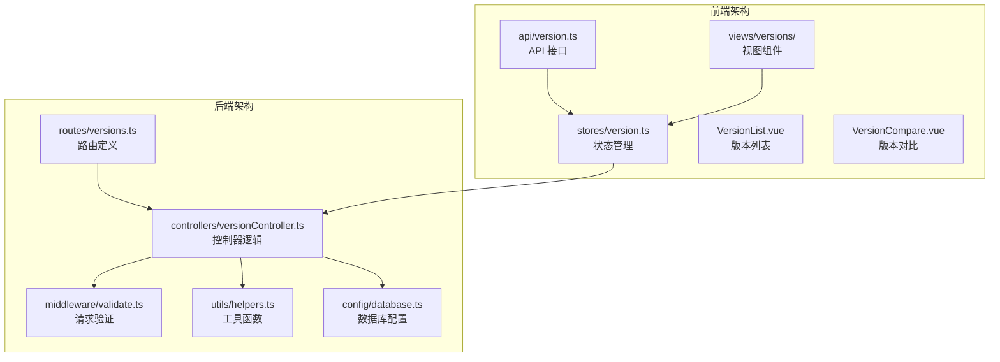
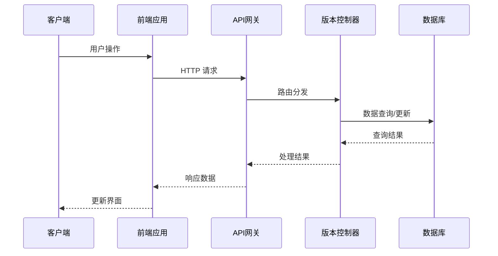
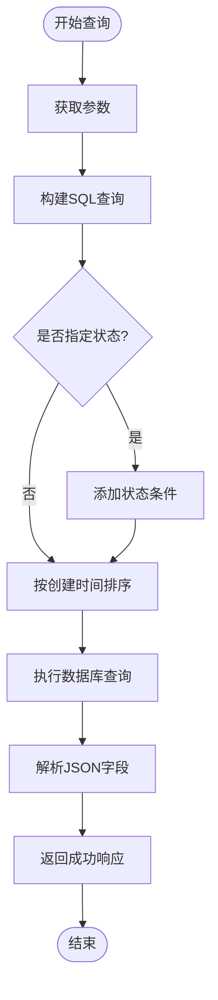
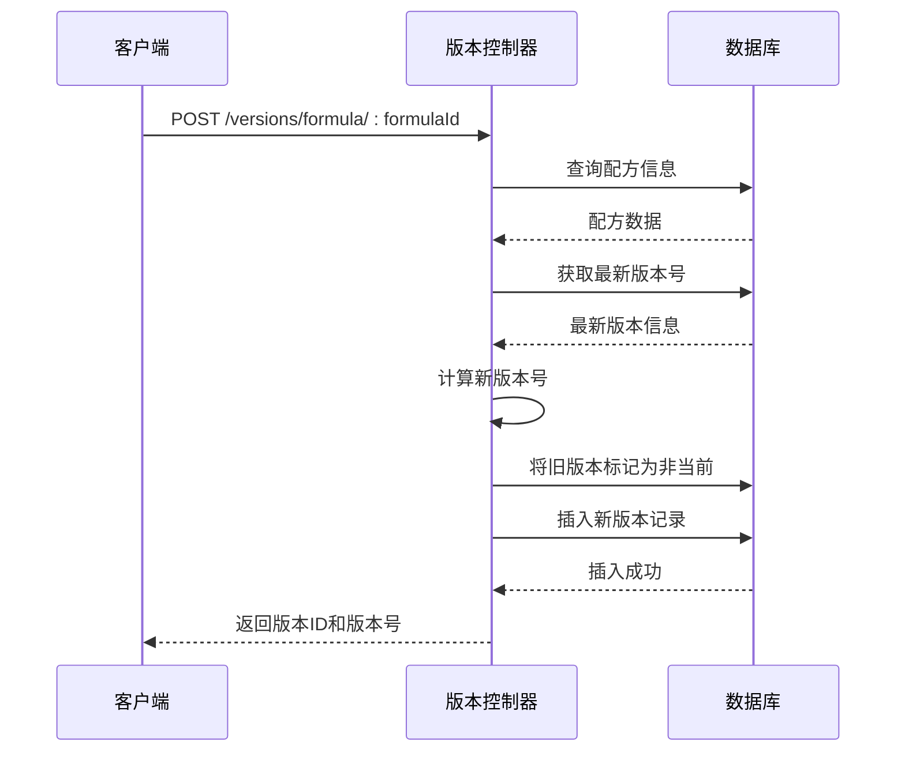
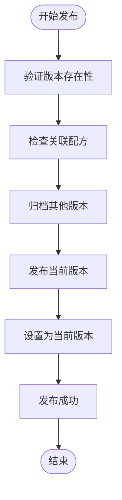
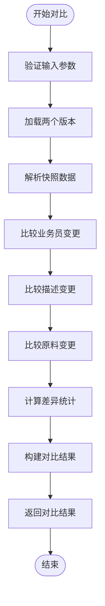
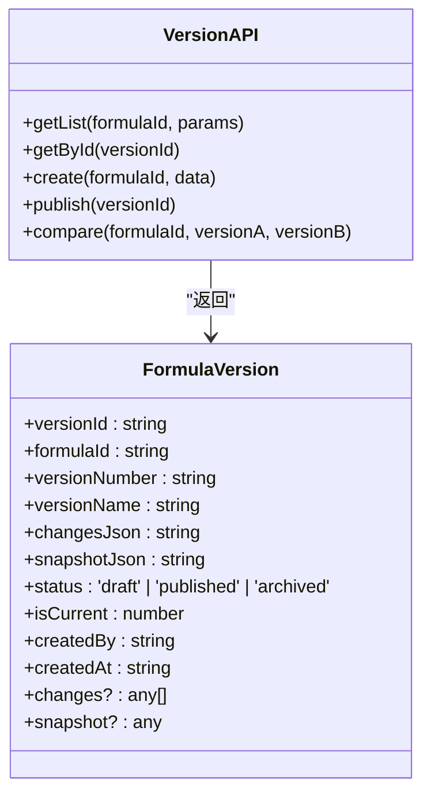
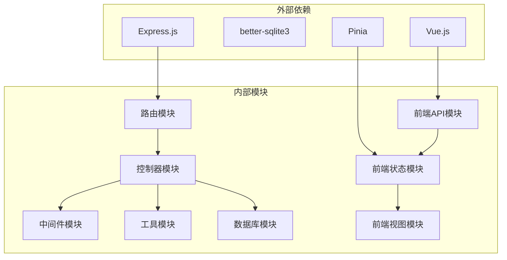

# 版本路由模块

<cite>
**本文档引用的文件**
- [versions.ts](file://backend/src/routes/versions.ts)
- [versionController.ts](file://backend/src/controllers/versionController.ts)
- [validate.ts](file://backend/src/middleware/validate.ts)
- [helpers.ts](file://backend/src/utils/helpers.ts)
- [database.ts](file://backend/src/config/database.ts)
- [version.ts](file://frontend/src/api/version.ts)
- [version.ts](file://frontend/src/stores/version.ts)
- [VersionList.vue](file://frontend/src/views/versions/VersionList.vue)
- [VersionCompare.vue](file://frontend/src/views/versions/VersionCompare.vue)
- [API_DOC.md](file://backend/API_DOC.md)
- [DATABASE_DOC.md](file://backend/DATABASE_DOC.md)
- [init.sql](file://backend/src/scripts/init.sql)
</cite>

## 目录
1. [简介](#简介)
2. [项目结构](#项目结构)
3. [核心组件](#核心组件)
4. [架构概览](#架构概览)
5. [详细组件分析](#详细组件分析)
6. [依赖关系分析](#依赖关系分析)
7. [性能考虑](#性能考虑)
8. [故障排除指南](#故障排除指南)
9. [结论](#结论)
10. [附录](#附录)

## 简介

版本路由模块是 TingStudio 配方管理系统中的核心功能模块，负责管理配方的历史版本、版本对比和版本发布流程。该模块实现了完整的版本控制生命周期，包括版本创建、查询、对比和发布功能，为配方管理提供了强大的历史追踪和审计能力。

该模块采用前后端分离架构，后端使用 Express.js 提供 RESTful API，前端使用 Vue.js 和 Pinia 状态管理，实现了完整的版本管理用户体验。

## 项目结构

版本路由模块在项目中的组织结构如下：



**图表来源**
- [versions.ts:1-17](file://backend/src/routes/versions.ts#L1-L17)
- [versionController.ts:1-270](file://backend/src/controllers/versionController.ts#L1-L270)
- [version.ts:1-35](file://frontend/src/api/version.ts#L1-L35)
- [version.ts:1-83](file://frontend/src/stores/version.ts#L1-L83)

**章节来源**
- [versions.ts:1-17](file://backend/src/routes/versions.ts#L1-L17)
- [versionController.ts:1-270](file://backend/src/controllers/versionController.ts#L1-L270)
- [version.ts:1-35](file://frontend/src/api/version.ts#L1-L35)
- [version.ts:1-83](file://frontend/src/stores/version.ts#L1-L83)

## 核心组件

版本路由模块由以下核心组件构成：

### 后端组件

1. **路由层**：定义 `/versions` 前缀下的所有 API 端点
2. **控制器层**：实现版本管理的核心业务逻辑
3. **中间件层**：提供请求验证和认证功能
4. **工具层**：提供通用的辅助函数和数据库操作

### 前端组件

1. **API 层**：封装 HTTP 请求和响应处理
2. **状态管理层**：使用 Pinia 管理版本数据状态
3. **视图层**：提供版本管理和对比的用户界面

**章节来源**
- [versionController.ts:6-35](file://backend/src/controllers/versionController.ts#L6-L35)
- [validate.ts:16-67](file://backend/src/middleware/validate.ts#L16-L67)
- [version.ts:18-34](file://frontend/src/api/version.ts#L18-L34)

## 架构概览

版本路由模块采用分层架构设计，确保了良好的代码组织和可维护性：



**图表来源**
- [versions.ts:8-16](file://backend/src/routes/versions.ts#L8-L16)
- [versionController.ts:60-111](file://backend/src/controllers/versionController.ts#L60-L111)
- [database.ts:44-55](file://backend/src/config/database.ts#L44-L55)

## 详细组件分析

### 路由定义组件

版本路由模块定义了五个主要的 API 端点：

| 端点 | 方法 | 描述 | 参数 |
|------|------|------|------|
| `/versions/formula/:formulaId` | GET | 获取配方的所有版本 | status (可选) |
| `/versions/detail/:versionId` | GET | 获取单个版本详情 | - |
| `/versions/formula/:formulaId` | POST | 创建新版本 | versionName, status |
| `/versions/publish/:versionId` | PUT | 发布版本 | - |
| `/versions/compare/:formulaId` | GET | 版本对比 | versionA, versionB |

**章节来源**
- [versions.ts:12-16](file://backend/src/routes/versions.ts#L12-L16)
- [API_DOC.md:370-465](file://backend/API_DOC.md#L370-L465)

### 控制器逻辑组件

#### 版本查询功能

版本查询功能支持按状态过滤和时间排序：



**图表来源**
- [versionController.ts:7-35](file://backend/src/controllers/versionController.ts#L7-L35)
- [helpers.ts:77-85](file://backend/src/utils/helpers.ts#L77-L85)

#### 版本创建功能

版本创建功能实现了自动版本号管理和快照创建：



**图表来源**
- [versionController.ts:60-111](file://backend/src/controllers/versionController.ts#L60-L111)

#### 版本发布功能

版本发布功能实现了版本状态管理和当前版本标记：



**图表来源**
- [versionController.ts:113-157](file://backend/src/controllers/versionController.ts#L113-L157)

#### 版本对比功能

版本对比功能实现了详细的差异计算和可视化展示：



**图表来源**
- [versionController.ts:159-269](file://backend/src/controllers/versionController.ts#L159-L269)

**章节来源**
- [versionController.ts:6-269](file://backend/src/controllers/versionController.ts#L6-L269)

### 数据模型设计

版本路由模块的核心数据模型基于 SQLite 数据库，主要包含以下表结构：

#### 配方版本表 (formula_versions)

| 字段名 | 类型 | 约束 | 描述 |
|--------|------|------|------|
| `version_id` | TEXT | PRIMARY KEY | 版本唯一标识符 |
| `formula_id` | TEXT | NOT NULL, FK | 关联配方ID |
| `version_number` | TEXT | NOT NULL | 版本号 (如 v1.0) |
| `version_name` | TEXT | NULL | 版本名称 |
| `changes_json` | TEXT | NULL | 变更记录JSON |
| `snapshot_json` | TEXT | NOT NULL | 配方快照JSON |
| `status` | TEXT | NOT NULL, DEFAULT 'draft' | 版本状态 |
| `is_current` | INTEGER | NOT NULL, DEFAULT 0 | 是否为当前版本 |
| `created_by` | TEXT | NOT NULL | 创建人ID |
| `created_at` | TEXT | NOT NULL | 创建时间 |

**章节来源**
- [DATABASE_DOC.md:125-173](file://backend/DATABASE_DOC.md#L125-L173)
- [init.sql:77-91](file://backend/src/scripts/init.sql#L77-L91)

### 前端集成组件

#### API 接口封装

前端提供了完整的 API 接口封装，包括：



**图表来源**
- [version.ts:18-34](file://frontend/src/api/version.ts#L18-L34)
- [version.ts:3-16](file://frontend/src/api/version.ts#L3-L16)

#### 状态管理

使用 Pinia 管理版本状态，包括：

- 版本列表数据
- 当前版本信息
- 对比结果缓存
- 加载状态管理

**章节来源**
- [version.ts:1-83](file://frontend/src/stores/version.ts#L1-L83)

## 依赖关系分析

版本路由模块的依赖关系如下：



**图表来源**
- [versions.ts:2-6](file://backend/src/routes/versions.ts#L2-L6)
- [versionController.ts:2-4](file://backend/src/controllers/versionController.ts#L2-L4)
- [version.ts:3](file://frontend/src/stores/version.ts#L3)

**章节来源**
- [versions.ts:1-17](file://backend/src/routes/versions.ts#L1-L17)
- [versionController.ts:1-270](file://backend/src/controllers/versionController.ts#L1-L270)

## 性能考虑

版本路由模块在设计时充分考虑了性能优化：

### 数据库优化

1. **索引策略**：为 `formula_versions` 表建立了复合索引，优化查询性能
2. **查询优化**：使用参数化查询防止 SQL 注入
3. **连接池**：使用 SQLite 的 WAL 模式提高并发性能

### 前端性能

1. **状态缓存**：使用 Pinia 缓存版本数据，减少重复请求
2. **懒加载**：按需加载版本对比数据
3. **虚拟滚动**：对于大量版本数据使用虚拟滚动优化渲染

### API 设计

1. **批量操作**：支持批量查询和更新操作
2. **分页机制**：对于大量数据提供分页支持
3. **缓存策略**：合理使用 HTTP 缓存头

## 故障排除指南

### 常见问题及解决方案

#### 版本创建失败

**问题症状**：创建版本时返回 500 错误

**可能原因**：
1. 配方不存在
2. 数据库连接异常
3. JSON 解析错误

**解决步骤**：
1. 验证配方ID的有效性
2. 检查数据库连接状态
3. 使用 `safeJsonParse` 函数处理 JSON 数据

#### 版本发布失败

**问题症状**：发布版本时返回 404 错误

**可能原因**：
1. 版本ID不存在
2. 关联配方被删除
3. 数据库事务失败

**解决步骤**：
1. 验证版本ID的正确性
2. 检查配方的关联关系
3. 查看数据库日志确认事务状态

#### 版本对比异常

**问题症状**：版本对比返回空结果或错误数据

**可能原因**：
1. 版本ID不匹配
2. 快照数据格式错误
3. 原料数据缺失

**解决步骤**：
1. 验证两个版本ID都属于同一配方
2. 检查快照数据的完整性
3. 确认原料数据的可用性

**章节来源**
- [versionController.ts:32-34](file://backend/src/controllers/versionController.ts#L32-L34)
- [versionController.ts:153-156](file://backend/src/controllers/versionController.ts#L153-L156)

## 结论

版本路由模块为 TingStudio 配方管理系统提供了完整的版本控制能力。通过精心设计的架构和数据模型，该模块实现了高效的版本管理、精确的版本对比和可靠的版本发布流程。

模块的主要优势包括：

1. **完整的生命周期管理**：从版本创建到发布的全流程支持
2. **精确的差异追踪**：详细的变更记录和可视化展示
3. **高性能设计**：合理的数据库设计和前端优化
4. **良好的扩展性**：清晰的架构便于功能扩展

该模块为配方管理系统的稳定运行提供了坚实的基础，是整个系统的重要组成部分。

## 附录

### API 使用示例

#### 获取版本列表
```javascript
// GET /api/versions/formula/{formulaId}?status=draft
const response = await versionApi.getList(formulaId, { status: 'draft' });
```

#### 创建版本
```javascript
// POST /api/versions/formula/{formulaId}
const response = await versionApi.create(formulaId, {
  versionName: '测试版本',
  status: 'draft'
});
```

#### 发布版本
```javascript
// PUT /api/versions/publish/{versionId}
const response = await versionApi.publish(versionId);
```

#### 版本对比
```javascript
// GET /api/versions/compare/{formulaId}?versionA={id}&versionB={id}
const response = await versionApi.compare(formulaId, versionA, versionB);
```

**章节来源**
- [API_DOC.md:370-465](file://backend/API_DOC.md#L370-L465)
- [version.ts:18-34](file://frontend/src/api/version.ts#L18-L34)