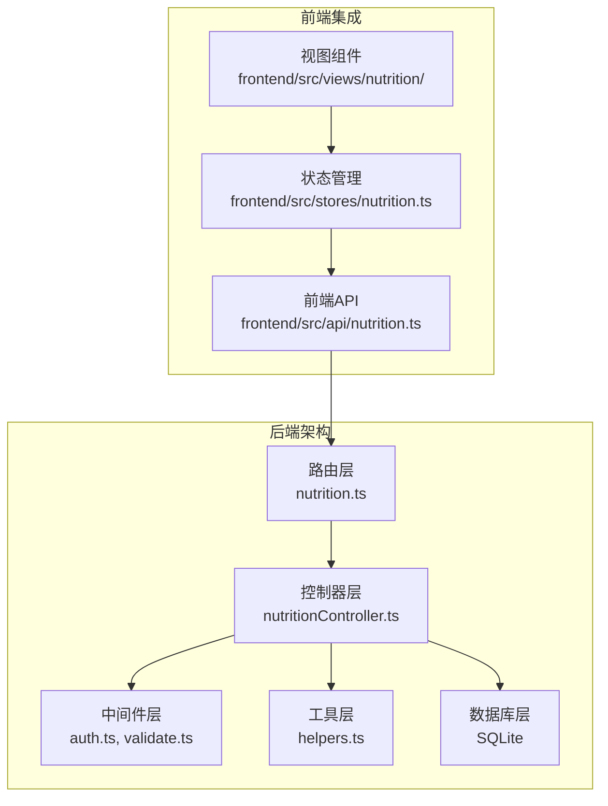
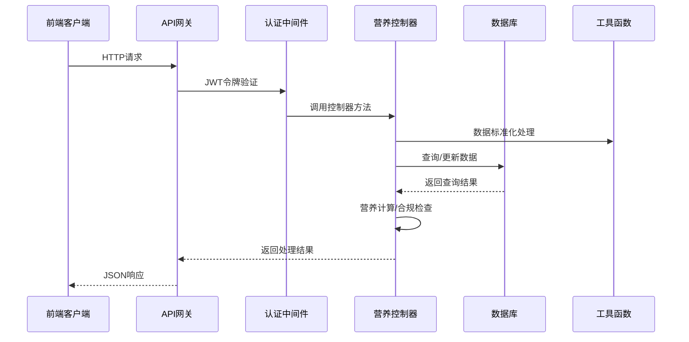
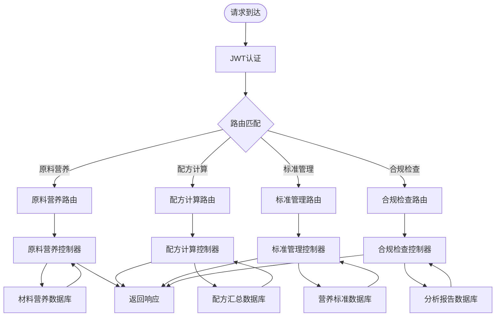
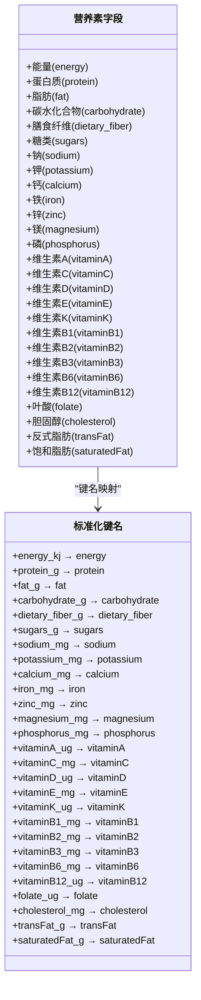
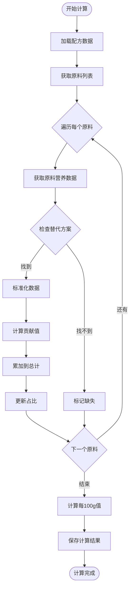
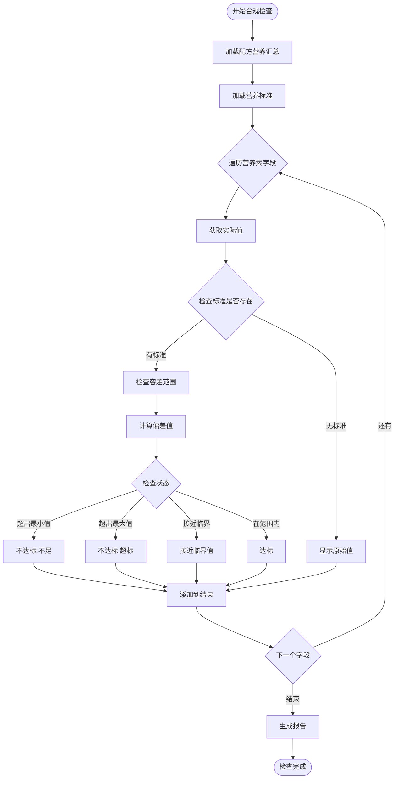
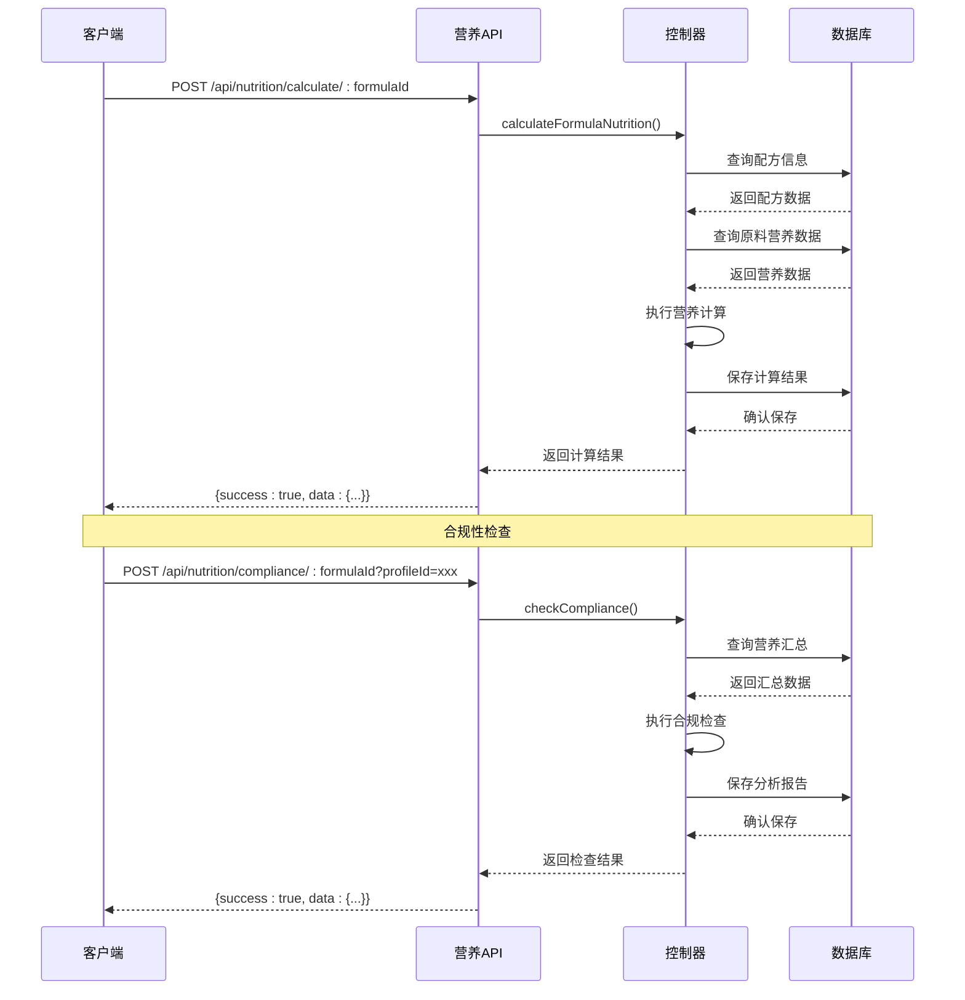
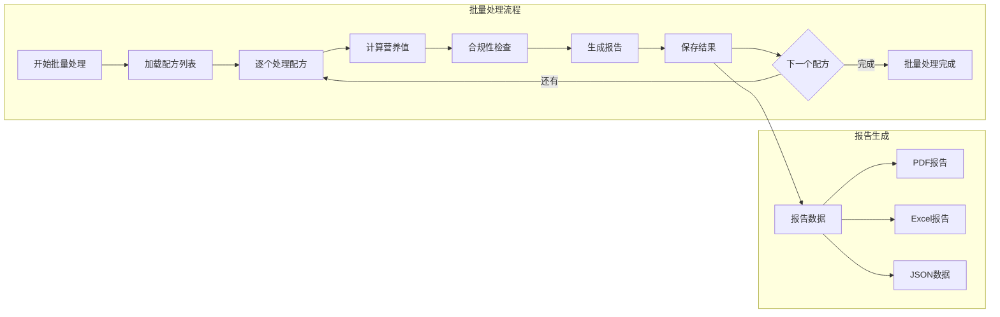
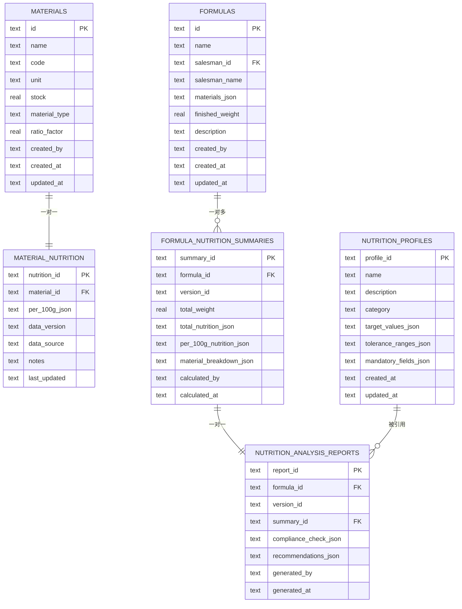
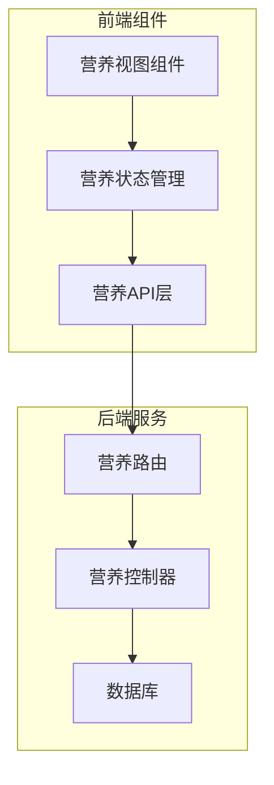

# 营养分析路由模块

<cite>
**本文档引用的文件**
- [nutrition.ts](file://backend/src/routes/nutrition.ts)
- [nutritionController.ts](file://backend/src/controllers/nutritionController.ts)
- [validate.ts](file://backend/src/middleware/validate.ts)
- [helpers.ts](file://backend/src/utils/helpers.ts)
- [auth.ts](file://backend/src/middleware/auth.ts)
- [DATABASE_DOC.md](file://backend/DATABASE_DOC.md)
- [API_DOC.md](file://backend/API_DOC.md)
- [importNutritionData.ts](file://backend/src/scripts/importNutritionData.ts)
- [nutrition.ts](file://frontend/src/api/nutrition.ts)
- [nutrition.ts](file://frontend/src/stores/nutrition.ts)
</cite>

## 目录
1. [简介](#简介)
2. [项目结构](#项目结构)
3. [核心组件](#核心组件)
4. [架构概览](#架构概览)
5. [详细组件分析](#详细组件分析)
6. [依赖关系分析](#依赖关系分析)
7. [性能考虑](#性能考虑)
8. [故障排除指南](#故障排除指南)
9. [结论](#结论)
10. [附录](#附录)

## 简介

营养分析路由模块是 TingStudio 配方管理系统中的核心功能模块，专门负责营养成分的计算、标准对照和合规性检查。该模块基于 RESTful API 设计，提供了完整的营养数据分析解决方案，支持从单一原料到复杂配方的多层次营养计算，并能够与国际标准进行对比分析。

该模块采用模块化设计，将营养计算逻辑、数据验证、错误处理等功能分离到不同的组件中，确保了代码的可维护性和扩展性。通过标准化的数据模型和算法接口，为前端应用提供了丰富的营养分析功能。

## 项目结构

营养分析路由模块位于后端项目的 `backend/src` 目录下，采用典型的三层架构模式：

**图表来源**
- [nutrition.ts:1-31](file://backend/src/routes/nutrition.ts#L1-L31)
- [nutritionController.ts:1-641](file://backend/src/controllers/nutritionController.ts#L1-L641)

**章节来源**
- [nutrition.ts:1-31](file://backend/src/routes/nutrition.ts#L1-L31)
- [API_DOC.md:561-701](file://backend/API_DOC.md#L561-L701)

## 核心组件

### 路由定义组件

营养分析路由模块定义了完整的 RESTful API 接口，所有接口都经过 JWT 认证保护：

| 组件 | 功能 | HTTP方法 | 路径 |
|------|------|----------|------|
| 原料营养接口 | 获取和设置原料营养成分 | GET/PUT | `/nutrition/material/:materialId` |
| 配方计算接口 | 计算配方营养汇总 | POST | `/nutrition/calculate/:formulaId` |
| 表格数据接口 | 获取配方营养表格数据 | GET | `/nutrition/tables/:formulaId` |
| 营养标准接口 | 获取和创建营养标准 | GET/POST | `/nutrition/profiles` |
| 合规检查接口 | 执行营养合规性检查 | POST | `/nutrition/compliance/:formulaId` |

### 控制器组件

控制器层实现了具体的业务逻辑，包含以下核心功能：

- **营养成分标准化**：统一不同来源的营养数据格式
- **配方营养计算**：基于原料营养数据进行加权计算
- **标准对照分析**：与预设营养标准进行对比
- **合规性检查**：验证配方是否符合特定标准要求
- **报告生成**：创建详细的营养分析报告

**章节来源**
- [nutritionController.ts:1-641](file://backend/src/controllers/nutritionController.ts#L1-L641)

## 架构概览

营养分析模块采用分层架构设计，确保了关注点分离和代码的可维护性：

**图表来源**
- [auth.ts:13-31](file://backend/src/middleware/auth.ts#L13-L31)
- [nutritionController.ts:124-242](file://backend/src/controllers/nutritionController.ts#L124-L242)

### 数据流架构

**图表来源**
- [nutrition.ts:15-30](file://backend/src/routes/nutrition.ts#L15-L30)
- [DATABASE_DOC.md:273-390](file://backend/DATABASE_DOC.md#L273-L390)

## 详细组件分析

### 营养数据模型设计

#### 核心营养素字段体系

系统支持 29 种核心营养素的标准化表示：

**图表来源**
- [nutritionController.ts:7-33](file://backend/src/controllers/nutritionController.ts#L7-L33)

#### 营养素参考值(NRV)体系

系统内置了标准的营养素参考值，用于合规性检查和百分比计算：

| 营养素类别 | 标准值 | 单位 | 用途 |
|------------|--------|------|------|
| 能量 | 8400 | kJ/天 | 基础代谢需求 |
| 蛋白质 | 60 | g/天 | 蛋白质需求 |
| 脂肪 | 60 | g/天 | 脂肪需求 |
| 碳水化合物 | 300 | g/天 | 碳水需求 |
| 钠 | 2000 | mg/天 | 钠摄入上限 |
| 钾 | 2000 | mg/天 | 钾需求 |
| 钙 | 800 | mg/天 | 钙需求 |
| 铁 | 15 | mg/天 | 铁需求 |
| 锌 | 15 | mg/天 | 锌需求 |
| 维生素A | 800 | μg/天 | 维生素A需求 |
| 维生素C | 100 | mg/天 | 维生素C需求 |
| 维生素D | 5 | μg/天 | 维生素D需求 |
| 维生素E | 14 | mg/天 | 维生素E需求 |
| 维生素B1 | 1.4 | mg/天 | 维生素B1需求 |
| 维生素B2 | 1.4 | mg/天 | 维生素B2需求 |
| 维生素B3 | 14 | mg/天 | 维生素B3需求 |
| 维生素B6 | 1.4 | mg/天 | 维生素B6需求 |
| 维生素B12 | 2.4 | μg/天 | 维生素B12需求 |
| 叶酸 | 400 | μg/天 | 叶酸需求 |
| 胆固醇 | 300 | mg/天 | 胆固醇摄入上限 |
| 膳食纤维 | 25 | g/天 | 膳食纤维需求 |

**章节来源**
- [nutritionController.ts:47-53](file://backend/src/controllers/nutritionController.ts#L47-L53)

### 算法接口实现

#### 配方营养值计算算法

配方营养计算采用加权平均算法，确保营养值的准确性：

**图表来源**
- [nutritionController.ts:124-242](file://backend/src/controllers/nutritionController.ts#L124-L242)

#### 合规性检查算法

合规性检查算法支持多种标准和容差范围：

**图表来源**
- [nutritionController.ts:290-407](file://backend/src/controllers/nutritionController.ts#L290-L407)

### API 完整示例

#### 单个配方分析流程

**图表来源**
- [API_DOC.md:608-680](file://backend/API_DOC.md#L608-L680)
- [nutritionController.ts:124-407](file://backend/src/controllers/nutritionController.ts#L124-L407)

#### 批量分析和报告生成

系统支持批量处理多个配方的营养分析，并生成详细的报告：

**章节来源**
- [API_DOC.md:608-700](file://backend/API_DOC.md#L608-L700)

## 依赖关系分析

### 数据库依赖关系

营养分析模块涉及 4 个核心数据库表，形成了完整的营养数据生态系统：

**图表来源**
- [DATABASE_DOC.md:273-390](file://backend/DATABASE_DOC.md#L273-L390)

### 前端集成依赖

前端通过 API 层与后端进行交互，主要依赖关系如下：

**图表来源**
- [nutrition.ts:1-38](file://frontend/src/api/nutrition.ts#L1-L38)
- [nutrition.ts:1-100](file://frontend/src/stores/nutrition.ts#L1-L100)

**章节来源**
- [DATABASE_DOC.md:393-427](file://backend/DATABASE_DOC.md#L393-L427)

## 性能考虑

### 数据库优化策略

1. **索引优化**：关键查询字段建立了适当的索引，包括 `material_id`、`formula_id`、`profile_id` 等
2. **批量查询**：配方计算时使用批量查询减少数据库往返次数
3. **缓存机制**：对于频繁访问的标准数据采用内存缓存
4. **事务处理**：重要操作使用事务确保数据一致性

### 算法性能优化

1. **向量化计算**：使用数组操作进行批量营养值计算
2. **延迟加载**：仅在需要时加载完整的营养数据
3. **增量更新**：支持部分更新避免全量重算
4. **结果缓存**：计算结果在一定时间内缓存复用

### 前端性能优化

1. **懒加载**：营养分析页面按需加载数据
2. **虚拟滚动**：大量数据展示时使用虚拟滚动
3. **防抖处理**：输入验证采用防抖机制减少请求频率
4. **状态缓存**：Pinia 状态管理提供快速数据访问

## 故障排除指南

### 常见问题及解决方案

#### 认证失败
- **症状**：返回 401 未认证错误
- **原因**：JWT 令牌无效或过期
- **解决**：重新登录获取新令牌

#### 营养数据缺失
- **症状**：配方计算时报错或结果不完整
- **原因**：原料缺少营养数据或名称不匹配
- **解决**：为原料添加营养数据或修正原料名称

#### 计算结果异常
- **症状**：营养值计算结果明显不合理
- **原因**：数据格式不正确或单位转换错误
- **解决**：检查数据格式和单位一致性

#### 合规性检查失败
- **症状**：合规检查返回错误
- **原因**：配方尚未计算营养值或标准配置错误
- **解决**：先执行营养计算，再选择正确的标准

**章节来源**
- [API_DOC.md:48-71](file://backend/API_DOC.md#L48-L71)
- [nutritionController.ts:56-121](file://backend/src/controllers/nutritionController.ts#L56-L121)

### 调试技巧

1. **日志记录**：使用统一的成功和错误响应格式
2. **参数验证**：前端和后端双重参数验证
3. **单元测试**：为关键算法编写测试用例
4. **性能监控**：监控关键操作的执行时间

## 结论

营养分析路由模块是一个设计完善的营养数据分析系统，具有以下特点：

1. **完整性**：覆盖从原料到配方的完整营养分析流程
2. **标准化**：采用国际通用的营养素标准和计算方法
3. **可扩展性**：模块化设计便于功能扩展和维护
4. **用户体验**：提供直观的前端界面和详细的报告生成功能

该模块为配方管理系统提供了强大的营养分析能力，能够满足不同场景下的营养计算和合规性检查需求。通过持续的优化和改进，该模块将继续为用户提供高质量的营养分析服务。

## 附录

### API 接口规范

#### 原料营养接口
- **GET** `/api/nutrition/material/:materialId` - 获取原料营养成分
- **PUT** `/api/nutrition/material/:materialId` - 设置/更新原料营养成分

#### 配方计算接口
- **POST** `/api/nutrition/calculate/:formulaId` - 计算配方营养汇总
- **GET** `/api/nutrition/tables/:formulaId` - 获取配方营养表格数据

#### 营养标准接口
- **GET** `/api/nutrition/profiles` - 获取营养标准列表
- **POST** `/api/nutrition/profiles` - 创建营养标准

#### 合规检查接口
- **POST** `/api/nutrition/compliance/:formulaId` - 执行营养合规性检查

### 数据导入脚本

系统提供了完整的数据导入脚本，支持从 Excel 文件导入真实的原料营养数据：

- **脚本位置**：`backend/src/scripts/importNutritionData.ts`
- **功能特性**：自动去重、能量计算、版本管理
- **使用方法**：运行脚本自动导入预设的营养数据

**章节来源**
- [importNutritionData.ts:1-215](file://backend/src/scripts/importNutritionData.ts#L1-L215)