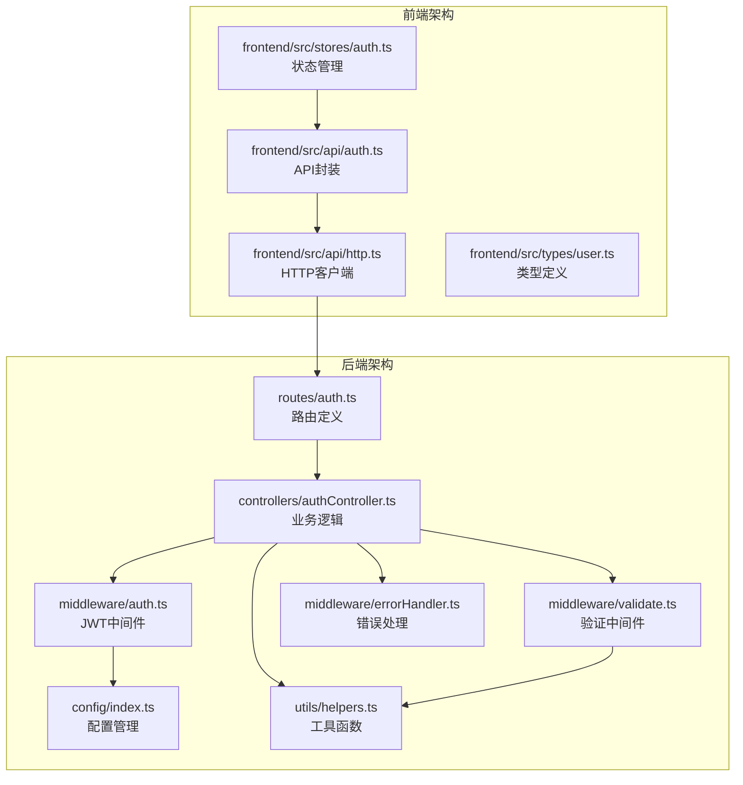
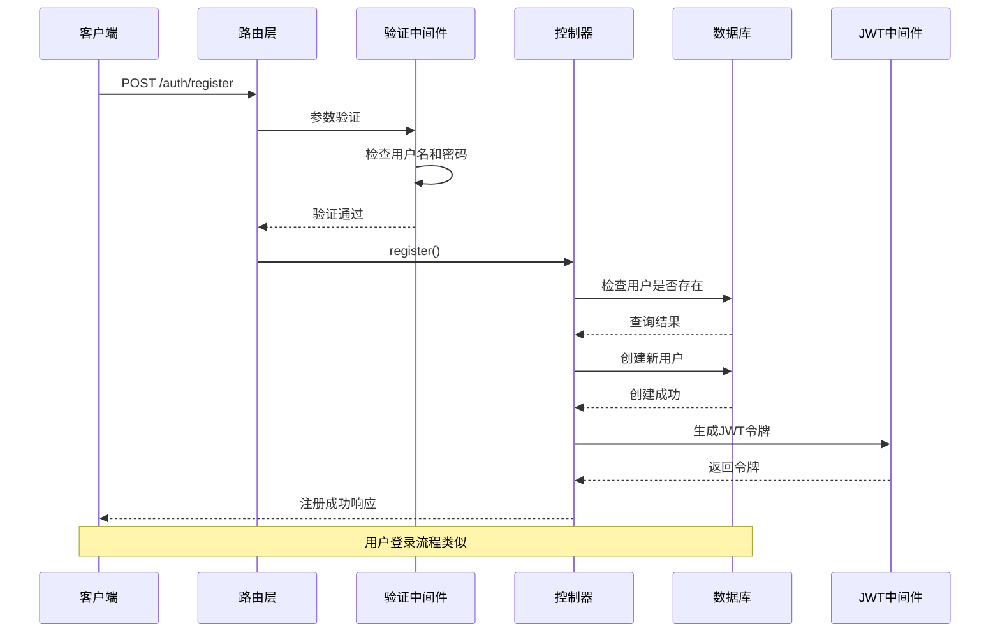
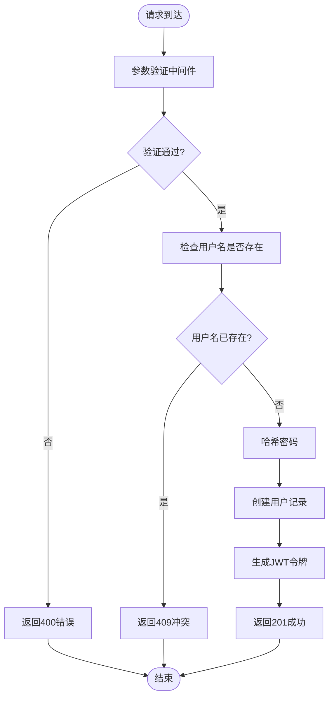
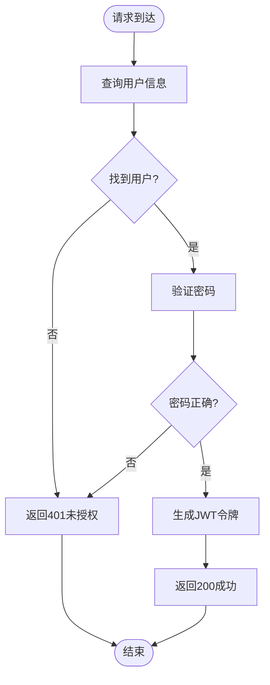
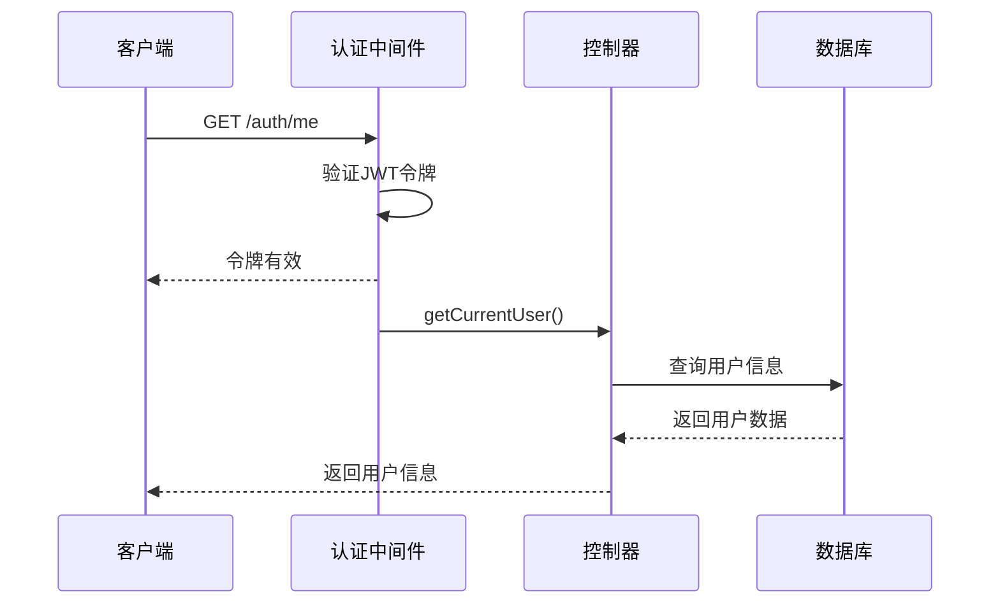
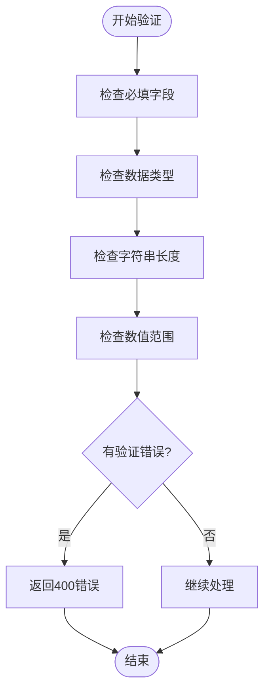
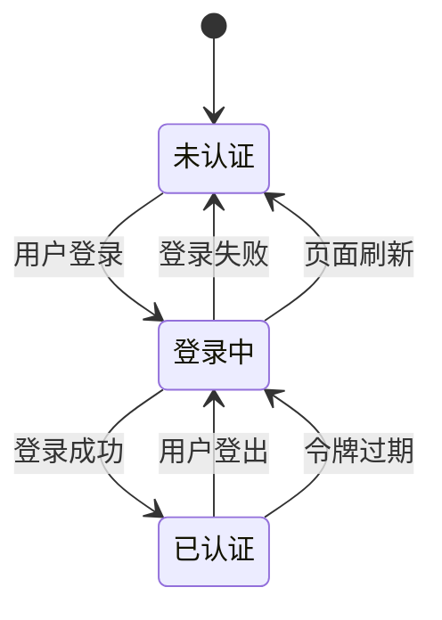
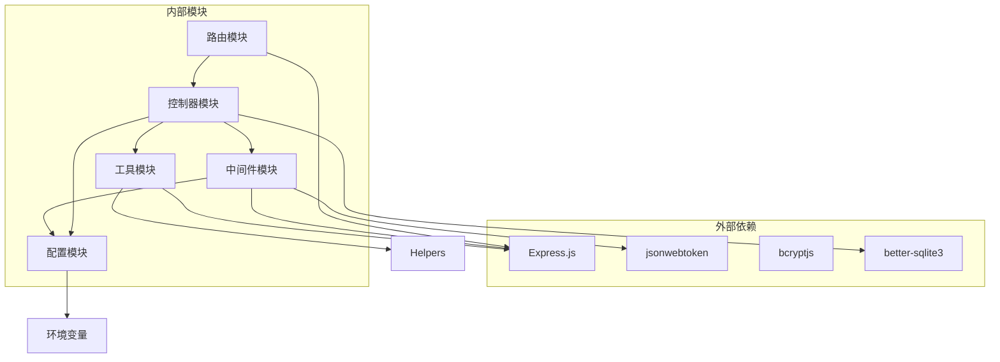

# 认证路由模块

<cite>
**本文档引用的文件**
- [backend/src/routes/auth.ts](file://backend/src/routes/auth.ts)
- [backend/src/controllers/authController.ts](file://backend/src/controllers/authController.ts)
- [backend/src/middleware/auth.ts](file://backend/src/middleware/auth.ts)
- [backend/src/middleware/validate.ts](file://backend/src/middleware/validate.ts)
- [backend/src/middleware/errorHandler.ts](file://backend/src/middleware/errorHandler.ts)
- [backend/src/config/index.ts](file://backend/src/config/index.ts)
- [backend/src/utils/helpers.ts](file://backend/src/utils/helpers.ts)
- [backend/DATABASE_DOC.md](file://backend/DATABASE_DOC.md)
- [frontend/src/api/auth.ts](file://frontend/src/api/auth.ts)
- [frontend/src/stores/auth.ts](file://frontend/src/stores/auth.ts)
- [frontend/src/api/http.ts](file://frontend/src/api/http.ts)
- [frontend/src/types/user.ts](file://frontend/src/types/user.ts)
</cite>

## 目录
1. [简介](#简介)
2. [项目结构](#项目结构)
3. [核心组件](#核心组件)
4. [架构概览](#架构概览)
5. [详细组件分析](#详细组件分析)
6. [依赖关系分析](#依赖关系分析)
7. [性能考虑](#性能考虑)
8. [故障排除指南](#故障排除指南)
9. [结论](#结论)

## 简介

认证路由模块是 TingStudio 系统的核心安全组件，负责处理用户身份验证和授权相关的所有 HTTP 请求。该模块实现了完整的用户认证生命周期，包括用户注册、登录、信息获取等功能，并集成了基于 JWT 的令牌认证机制。

该模块采用分层架构设计，将路由定义、业务逻辑、数据访问和中间件分离，确保了代码的可维护性和可扩展性。通过严格的输入验证、错误处理和安全措施，为整个系统的安全性提供了坚实的基础。

## 项目结构

认证路由模块在项目中的组织结构如下：



**图表来源**
- [backend/src/routes/auth.ts:1-20](file://backend/src/routes/auth.ts#L1-L20)
- [backend/src/controllers/authController.ts:1-89](file://backend/src/controllers/authController.ts#L1-L89)
- [backend/src/middleware/auth.ts:1-38](file://backend/src/middleware/auth.ts#L1-L38)
- [frontend/src/api/auth.ts:1-36](file://frontend/src/api/auth.ts#L1-L36)

**章节来源**
- [backend/src/routes/auth.ts:1-20](file://backend/src/routes/auth.ts#L1-L20)
- [backend/src/controllers/authController.ts:1-89](file://backend/src/controllers/authController.ts#L1-L89)
- [frontend/src/api/auth.ts:1-36](file://frontend/src/api/auth.ts#L1-L36)

## 核心组件

### 路由层 (Routes)

路由层负责定义认证相关的 HTTP 端点和请求处理流程。当前实现包含三个主要路由：

1. **POST /auth/register** - 用户注册
2. **POST /auth/login** - 用户登录
3. **GET /auth/me** - 获取当前用户信息

每个路由都应用了相应的中间件进行参数验证和身份认证。

### 控制器层 (Controllers)

控制器层实现了具体的业务逻辑，包括用户注册、登录验证和用户信息查询。所有控制器都遵循统一的错误处理模式，返回标准化的响应格式。

### 中间件层 (Middleware)

中间件层提供了认证和验证功能：
- **JWT 认证中间件**：验证请求头中的 JWT 令牌
- **请求验证中间件**：对请求体参数进行类型和格式验证
- **全局错误处理器**：统一处理各种类型的错误

### 前端集成

前端通过专门的 API 模块与后端认证服务交互，实现了完整的用户认证状态管理和本地存储。

**章节来源**
- [backend/src/routes/auth.ts:7-19](file://backend/src/routes/auth.ts#L7-L19)
- [backend/src/controllers/authController.ts:8-88](file://backend/src/controllers/authController.ts#L8-L88)
- [backend/src/middleware/auth.ts:13-37](file://backend/src/middleware/auth.ts#L13-L37)

## 架构概览

认证模块采用经典的三层架构模式，实现了清晰的关注点分离：



**图表来源**
- [backend/src/routes/auth.ts:9-15](file://backend/src/routes/auth.ts#L9-L15)
- [backend/src/controllers/authController.ts:9-39](file://backend/src/controllers/authController.ts#L9-L39)
- [backend/src/middleware/auth.ts:33-37](file://backend/src/middleware/auth.ts#L33-L37)

## 详细组件分析

### 路由定义分析

认证路由模块定义了三个核心端点，每个端点都有明确的功能职责和安全要求。

#### 用户注册路由



**图表来源**
- [backend/src/routes/auth.ts:9-15](file://backend/src/routes/auth.ts#L9-L15)
- [backend/src/controllers/authController.ts:9-39](file://backend/src/controllers/authController.ts#L9-L39)

#### 用户登录路由

登录路由相对简单，主要负责验证用户凭据并发放令牌：



**图表来源**
- [backend/src/routes/auth.ts:17](file://backend/src/routes/auth.ts#L17)
- [backend/src/controllers/authController.ts:42-71](file://backend/src/controllers/authController.ts#L42-L71)

#### 获取当前用户路由

此路由需要有效的认证令牌才能访问：



**图表来源**
- [backend/src/routes/auth.ts:19](file://backend/src/routes/auth.ts#L19)
- [backend/src/middleware/auth.ts:13-31](file://backend/src/middleware/auth.ts#L13-L31)
- [backend/src/controllers/authController.ts:74-88](file://backend/src/controllers/authController.ts#L74-L88)

**章节来源**
- [backend/src/routes/auth.ts:1-20](file://backend/src/routes/auth.ts#L1-L20)
- [backend/src/controllers/authController.ts:1-89](file://backend/src/controllers/authController.ts#L1-L89)

### JWT 认证机制

JWT（JSON Web Token）认证是现代 Web 应用的标准安全机制。认证模块实现了完整的 JWT 生命周期管理：

#### 令牌生成

令牌生成过程包含以下步骤：
1. 使用配置的密钥对用户标识进行签名
2. 设置过期时间（默认7天）
3. 返回加密后的令牌字符串

#### 令牌验证

令牌验证过程包括：
1. 从 Authorization 请求头提取 Bearer 令牌
2. 使用相同的密钥验证令牌签名
3. 检查令牌是否过期
4. 将解码后的用户信息注入到请求对象中

#### 安全考虑

- 使用强随机密钥进行令牌签名
- 实现合理的过期时间策略
- 在请求头中传输令牌，避免在 URL 中暴露
- 支持令牌刷新机制（建议实现）

**章节来源**
- [backend/src/middleware/auth.ts:33-37](file://backend/src/middleware/auth.ts#L33-L37)
- [backend/src/config/index.ts:10-13](file://backend/src/config/index.ts#L10-L13)

### 请求验证机制

请求验证中间件提供了灵活的参数验证框架，支持多种数据类型和验证规则：

#### 验证规则类型

| 规则类型 | 用途 | 示例 |
|---------|------|------|
| `type` | 数据类型检查 | `string`, `number`, `boolean` |
| `required` | 必填字段 | `true`/`false` |
| `minLength`/`maxLength` | 字符串长度限制 | `minLength: 2, maxLength: 50` |
| `min`/`max` | 数字范围限制 | `min: 1, max: 100` |
| `message` | 自定义错误消息 | `message: '用户名长度为2-50个字符'` |

#### 验证流程



**图表来源**
- [backend/src/middleware/validate.ts:16-67](file://backend/src/middleware/validate.ts#L16-L67)

**章节来源**
- [backend/src/middleware/validate.ts:1-68](file://backend/src/middleware/validate.ts#L1-L68)

### 错误处理机制

系统实现了多层次的错误处理策略，确保用户获得清晰的反馈信息：

#### 错误分类

| 错误类型 | HTTP状态码 | 用途 |
|---------|-----------|------|
| 参数验证失败 | 400 | 请求参数不符合要求 |
| 未提供认证令牌 | 401 | 访问受保护资源但无令牌 |
| 令牌无效或已过期 | 401 | JWT令牌验证失败 |
| 用户名已存在 | 409 | 注册时用户名冲突 |
| 数据库约束冲突 | 409 | SQLite约束违反 |
| 服务器内部错误 | 500 | 未预期的系统错误 |

#### 错误响应格式

所有错误响应遵循统一的结构：
```json
{
  "success": false,
  "message": "错误描述",
  "error": "详细错误信息"
}
```

**章节来源**
- [backend/src/middleware/errorHandler.ts:1-51](file://backend/src/middleware/errorHandler.ts#L1-L51)
- [backend/src/controllers/authController.ts:18-38](file://backend/src/controllers/authController.ts#L18-L38)

### 前端集成实现

前端通过专门的认证模块与后端 API 进行交互，实现了完整的用户状态管理：

#### 认证状态管理



#### 本地存储策略

前端使用浏览器本地存储来持久化认证状态：
- `tingstudio_token`: 存储 JWT 令牌
- `tingstudio_user`: 存储用户基本信息

#### HTTP 拦截器

前端 HTTP 客户端实现了智能的请求和响应拦截：
- 自动在请求头中添加认证令牌
- 统一处理认证失败的响应
- 提供用户友好的错误提示

**章节来源**
- [frontend/src/stores/auth.ts:1-64](file://frontend/src/stores/auth.ts#L1-L64)
- [frontend/src/api/http.ts:12-43](file://frontend/src/api/http.ts#L12-L43)

## 依赖关系分析

认证模块的依赖关系体现了清晰的分层架构：



**图表来源**
- [backend/src/routes/auth.ts:2-5](file://backend/src/routes/auth.ts#L2-L5)
- [backend/src/controllers/authController.ts:3-6](file://backend/src/controllers/authController.ts#L3-L6)
- [backend/src/middleware/auth.ts:3-4](file://backend/src/middleware/auth.ts#L3-L4)

### 数据库设计

认证模块直接依赖于用户表的设计，该表包含了所有必要的认证信息：

| 字段名 | 类型 | 约束 | 说明 |
|--------|------|------|------|
| `id` | TEXT | PRIMARY KEY | 用户唯一标识 |
| `username` | TEXT | NOT NULL, UNIQUE | 用户名，登录凭证 |
| `password` | TEXT | NOT NULL | 密码（bcrypt 哈希） |
| `role` | TEXT | NOT NULL, DEFAULT 'formulist' | 用户角色 |
| `created_at` | TEXT | NOT NULL | 创建时间 |
| `updated_at` | TEXT | NOT NULL | 更新时间 |

**章节来源**
- [backend/DATABASE_DOC.md:25-42](file://backend/DATABASE_DOC.md#L25-L42)

## 性能考虑

### 认证性能优化

1. **密码哈希成本**：使用 bcrypt 10 轮次平衡安全性和性能
2. **令牌过期时间**：合理设置过期时间减少频繁验证开销
3. **数据库查询优化**：用户表建立适当的索引提高查询效率
4. **内存使用**：避免在内存中存储敏感信息过长时间

### 缓存策略

- 用户信息缓存：在内存中缓存最近使用的用户信息
- 令牌验证缓存：缓存有效的令牌验证结果
- 配置信息缓存：缓存应用配置减少重复读取

### 并发处理

- 使用连接池管理数据库连接
- 实现请求队列避免数据库连接过多
- 使用异步操作处理 I/O 密集型任务

## 故障排除指南

### 常见问题诊断

#### 认证失败问题

**症状**：用户无法登录或访问受保护资源
**可能原因**：
- 令牌格式不正确（缺少 Bearer 前缀）
- 令牌已过期或被篡改
- 用户名或密码错误
- 数据库连接问题

**解决方案**：
1. 检查请求头格式：`Authorization: Bearer YOUR_TOKEN`
2. 验证令牌过期时间
3. 确认用户凭据正确性
4. 检查数据库服务状态

#### 参数验证错误

**症状**：注册或登录请求返回 400 错误
**可能原因**：
- 必填字段缺失
- 数据类型不匹配
- 字符串长度超出限制
- 数值范围不正确

**解决方案**：
1. 检查请求体格式
2. 验证字段类型和长度
3. 确认数值范围符合要求
4. 查看具体的错误消息

#### 数据库连接问题

**症状**：认证操作抛出数据库相关错误
**可能原因**：
- 数据库文件损坏
- 权限不足
- 连接池耗尽
- 磁盘空间不足

**解决方案**：
1. 检查数据库文件完整性
2. 验证文件权限设置
3. 监控连接池使用情况
4. 清理磁盘空间

### 调试技巧

1. **启用详细日志**：在开发环境中启用详细的错误日志
2. **使用调试工具**：利用浏览器开发者工具监控网络请求
3. **单元测试**：编写针对认证逻辑的单元测试
4. **集成测试**：模拟完整的认证流程进行测试

**章节来源**
- [backend/src/middleware/errorHandler.ts:13-34](file://backend/src/middleware/errorHandler.ts#L13-L34)
- [backend/src/controllers/authController.ts:36-38](file://backend/src/controllers/authController.ts#L36-L38)

## 结论

认证路由模块通过精心设计的架构和完善的错误处理机制，为 TingStudio 系统提供了可靠的安全保障。模块采用了现代化的 JWT 认证技术，结合严格的参数验证和统一的错误处理策略，确保了系统的安全性和用户体验。

该模块的主要优势包括：
- **清晰的架构分离**：路由、控制器、中间件职责明确
- **强大的验证机制**：灵活的参数验证和类型检查
- **完善的错误处理**：统一的错误响应格式和分类
- **前后端协同**：完整的前端状态管理和本地存储策略
- **可扩展性设计**：模块化的结构便于功能扩展

未来可以考虑的改进方向：
- 实现令牌刷新机制
- 添加多因素认证支持
- 增强安全审计功能
- 优化性能监控和日志记录