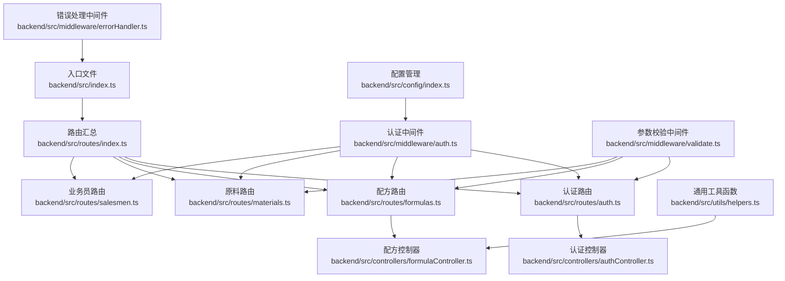
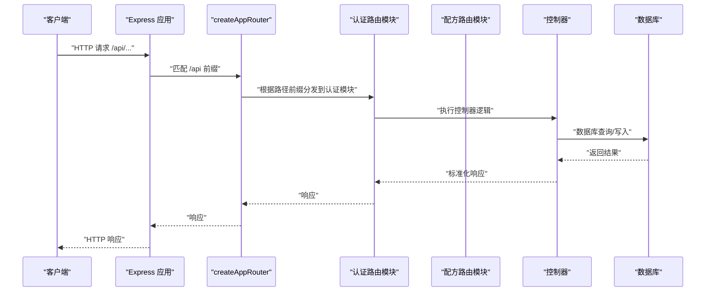
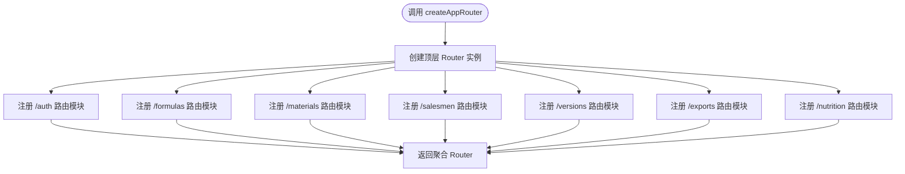
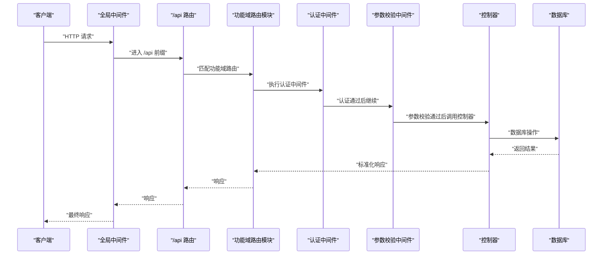
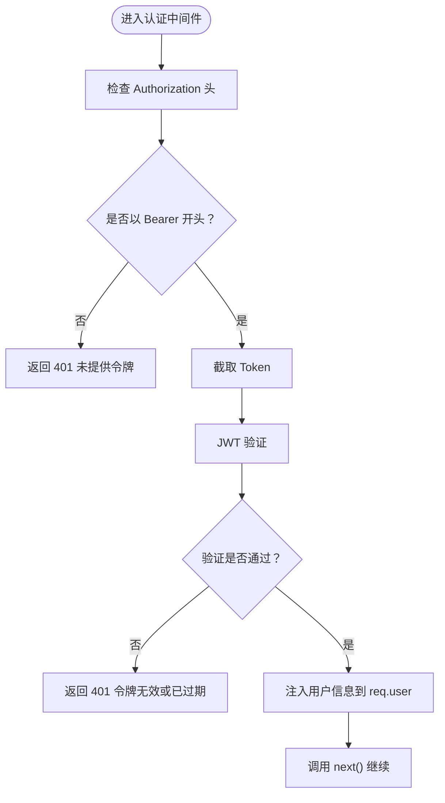
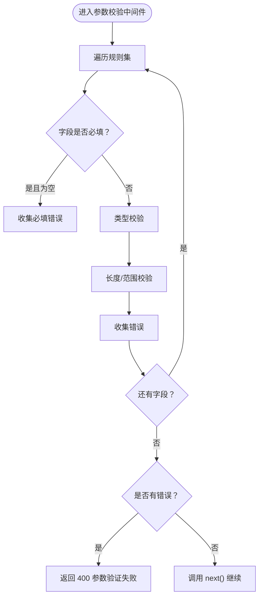
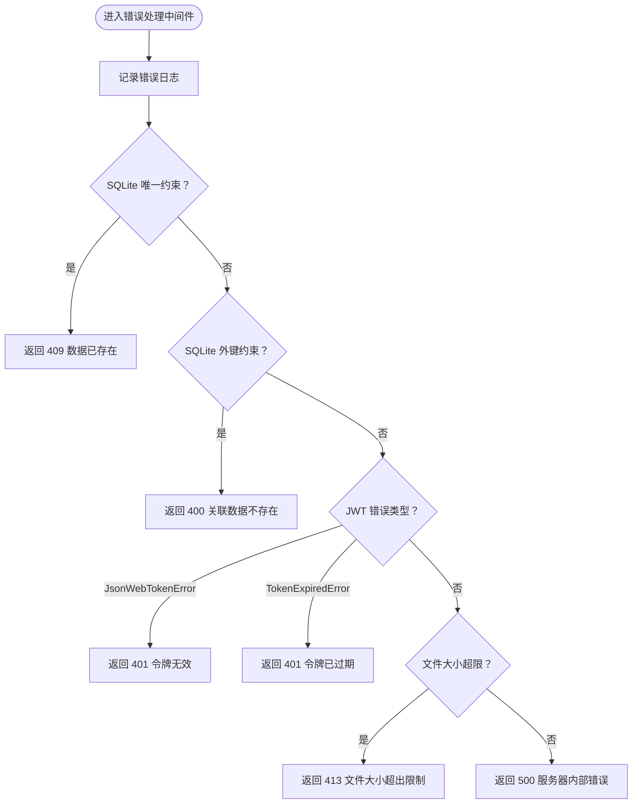
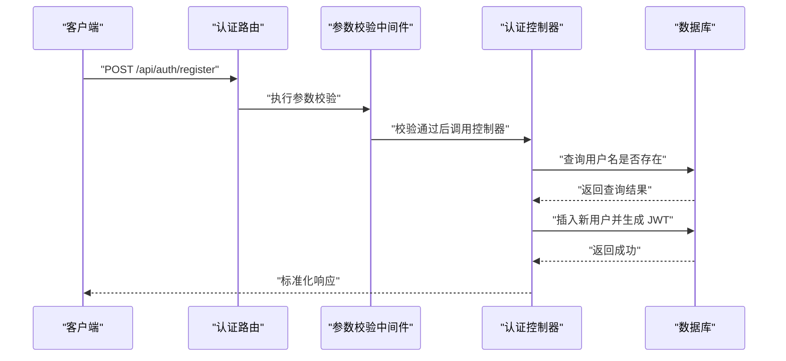
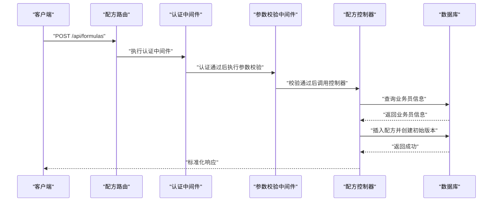
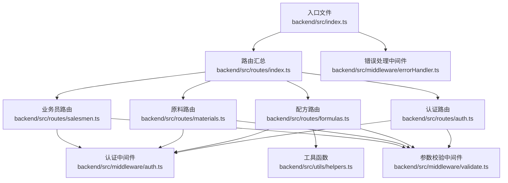

# 路由系统概览

<cite>
**本文档引用的文件**
- [backend/src/index.ts](file://backend/src/index.ts)
- [backend/src/routes/index.ts](file://backend/src/routes/index.ts)
- [backend/src/routes/auth.ts](file://backend/src/routes/auth.ts)
- [backend/src/routes/formulas.ts](file://backend/src/routes/formulas.ts)
- [backend/src/routes/materials.ts](file://backend/src/routes/materials.ts)
- [backend/src/routes/salesmen.ts](file://backend/src/routes/salesmen.ts)
- [backend/src/middleware/auth.ts](file://backend/src/middleware/auth.ts)
- [backend/src/middleware/errorHandler.ts](file://backend/src/middleware/errorHandler.ts)
- [backend/src/middleware/validate.ts](file://backend/src/middleware/validate.ts)
- [backend/src/controllers/authController.ts](file://backend/src/controllers/authController.ts)
- [backend/src/controllers/formulaController.ts](file://backend/src/controllers/formulaController.ts)
- [backend/src/utils/helpers.ts](file://backend/src/utils/helpers.ts)
- [backend/src/config/index.ts](file://backend/src/config/index.ts)
</cite>

## 目录
1. [简介](#简介)
2. [项目结构](#项目结构)
3. [核心组件](#核心组件)
4. [架构总览](#架构总览)
5. [详细组件分析](#详细组件分析)
6. [依赖关系分析](#依赖关系分析)
7. [性能考虑](#性能考虑)
8. [故障排除指南](#故障排除指南)
9. [结论](#结论)

## 简介
本文件提供 TingStudio 后端路由系统的全面概览文档。重点阐述整体路由架构设计、路由分发机制、模块化路由组织方式以及统一的路由前缀管理策略。同时深入解析 createAppRouter 函数的实现原理、路由注册流程与中间件链式调用机制，并给出路由系统扩展性设计的最佳实践指导，帮助开发者快速理解并高效扩展新的功能模块路由。

## 项目结构
后端采用基于 Express 的模块化路由架构，遵循“按功能域划分”的组织方式：
- 入口文件负责应用初始化、全局中间件配置与路由挂载
- routes 目录按功能域拆分路由模块，每个模块独立导出路由实例
- controllers 目录承载业务逻辑处理
- middleware 目录提供可复用的中间件（认证、校验、错误处理）
- utils 提供通用工具函数
- config 提供配置管理

图表来源
- [backend/src/index.ts:1-61](file://backend/src/index.ts#L1-L61)
- [backend/src/routes/index.ts:1-24](file://backend/src/routes/index.ts#L1-L24)
- [backend/src/routes/auth.ts:1-20](file://backend/src/routes/auth.ts#L1-L20)
- [backend/src/routes/formulas.ts:1-28](file://backend/src/routes/formulas.ts#L1-L28)
- [backend/src/routes/materials.ts:1-22](file://backend/src/routes/materials.ts#L1-L22)
- [backend/src/routes/salesmen.ts:1-24](file://backend/src/routes/salesmen.ts#L1-L24)
- [backend/src/middleware/auth.ts:1-38](file://backend/src/middleware/auth.ts#L1-L38)
- [backend/src/middleware/errorHandler.ts:1-51](file://backend/src/middleware/errorHandler.ts#L1-L51)
- [backend/src/middleware/validate.ts:1-68](file://backend/src/middleware/validate.ts#L1-L68)
- [backend/src/controllers/authController.ts:1-89](file://backend/src/controllers/authController.ts#L1-L89)
- [backend/src/controllers/formulaController.ts:1-287](file://backend/src/controllers/formulaController.ts#L1-L287)
- [backend/src/utils/helpers.ts:1-86](file://backend/src/utils/helpers.ts#L1-L86)
- [backend/src/config/index.ts:1-24](file://backend/src/config/index.ts#L1-L24)

章节来源
- [backend/src/index.ts:1-61](file://backend/src/index.ts#L1-L61)
- [backend/src/routes/index.ts:1-24](file://backend/src/routes/index.ts#L1-L24)

## 核心组件
- createAppRouter：路由汇总工厂函数，统一注册各功能域路由并返回 Express Router 实例
- 路由模块：每个功能域（认证、配方、原料、业务员等）独立定义 Router 实例，包含该域的所有路由规则
- 中间件体系：认证中间件、参数校验中间件、全局错误处理中间件
- 控制器层：承载具体业务逻辑，与数据库交互并返回标准化响应
- 工具函数：提供 ID 生成、时间格式化、分页构建、命名转换等通用能力

章节来源
- [backend/src/routes/index.ts:11-23](file://backend/src/routes/index.ts#L11-L23)
- [backend/src/middleware/auth.ts:13-31](file://backend/src/middleware/auth.ts#L13-L31)
- [backend/src/middleware/validate.ts:16-67](file://backend/src/middleware/validate.ts#L16-L67)
- [backend/src/middleware/errorHandler.ts:5-50](file://backend/src/middleware/errorHandler.ts#L5-L50)
- [backend/src/utils/helpers.ts:3-86](file://backend/src/utils/helpers.ts#L3-L86)

## 架构总览
路由系统采用“集中式路由汇总 + 功能域路由模块”的分层设计：
- 入口文件在 /api 前缀下挂载 createAppRouter 返回的路由器
- createAppRouter 在内部使用统一前缀（如 /auth、/formulas 等）注册各功能域路由
- 每个功能域路由模块可独立设置中间件（如全局认证中间件），形成清晰的职责边界
- 全局错误处理中间件统一捕获异常并返回标准化响应

图表来源
- [backend/src/index.ts:34-35](file://backend/src/index.ts#L34-L35)
- [backend/src/routes/index.ts:14-20](file://backend/src/routes/index.ts#L14-L20)
- [backend/src/routes/auth.ts:17](file://backend/src/routes/auth.ts#L17)
- [backend/src/controllers/authController.ts:42-71](file://backend/src/controllers/authController.ts#L42-L71)

## 详细组件分析

### createAppRouter 函数实现原理
- 设计目标：提供统一的路由注册入口，确保所有功能域路由在应用启动时一次性加载
- 实现要点：
  - 创建顶层 Router 实例
  - 使用 router.use('/前缀', 路由实例) 的模式注册各功能域路由
  - 返回聚合后的 Router，供入口文件在 /api 前缀下挂载
- 优势：
  - 统一管理路由前缀，避免重复硬编码
  - 支持后续扩展新功能域时仅需在汇总函数中追加一行注册语句
  - 便于集中测试与监控

图表来源
- [backend/src/routes/index.ts:11-23](file://backend/src/routes/index.ts#L11-L23)

章节来源
- [backend/src/routes/index.ts:11-23](file://backend/src/routes/index.ts#L11-L23)

### 路由注册流程与中间件链式调用机制
- 注册流程：
  - 入口文件在 /api 前缀下挂载 createAppRouter 返回的 Router
  - createAppRouter 内部逐个注册各功能域路由模块
  - 每个功能域路由模块可设置自身中间件（如全局认证）
- 中间件链式调用：
  - 认证中间件：从 Authorization 头提取 Bearer Token 并进行 JWT 校验，通过后将用户信息注入请求对象
  - 参数校验中间件：对请求体字段进行类型、长度、范围等规则校验，失败时直接返回 400
  - 错误处理中间件：捕获所有未处理异常，区分数据库约束错误、JWT 过期/无效、文件大小超限等场景，返回标准化错误响应
- 调用顺序：
  - 全局中间件（安全、压缩、日志、静态资源）
  - /api 路由前缀
  - 功能域路由模块中间件（如认证）
  - 控制器逻辑
  - 全局错误处理中间件

图表来源
- [backend/src/index.ts:20-48](file://backend/src/index.ts#L20-L48)
- [backend/src/routes/auth.ts:17](file://backend/src/routes/auth.ts#L17)
- [backend/src/middleware/auth.ts:13-31](file://backend/src/middleware/auth.ts#L13-L31)
- [backend/src/middleware/validate.ts:16-67](file://backend/src/middleware/validate.ts#L16-L67)

章节来源
- [backend/src/index.ts:20-48](file://backend/src/index.ts#L20-L48)
- [backend/src/middleware/auth.ts:13-31](file://backend/src/middleware/auth.ts#L13-L31)
- [backend/src/middleware/validate.ts:16-67](file://backend/src/middleware/validate.ts#L16-L67)
- [backend/src/middleware/errorHandler.ts:5-50](file://backend/src/middleware/errorHandler.ts#L5-L50)

### 认证中间件设计
- 功能：从 Authorization 头提取 Bearer Token，使用配置中的密钥进行 JWT 校验
- 流程：
  - 检查 Authorization 头是否存在且以 Bearer 开头
  - 截取 Token 并调用 JWT 验证函数
  - 成功则将用户信息注入 req.user，调用 next() 继续后续中间件
  - 失败则返回 401 未授权错误
- 配置：JWT 密钥与过期时间来自配置文件，支持环境变量覆盖

图表来源
- [backend/src/middleware/auth.ts:13-31](file://backend/src/middleware/auth.ts#L13-L31)
- [backend/src/config/index.ts:10-13](file://backend/src/config/index.ts#L10-L13)

章节来源
- [backend/src/middleware/auth.ts:13-31](file://backend/src/middleware/auth.ts#L13-L31)
- [backend/src/config/index.ts:10-13](file://backend/src/config/index.ts#L10-L13)

### 参数校验中间件设计
- 功能：对请求体字段进行类型、长度、范围等规则校验
- 规则定义：
  - type：支持 string、number、boolean、object、array
  - required：是否必填
  - min/max：数值范围
  - minLength/maxLength：字符串长度
  - message：自定义错误消息
- 流程：
  - 遍历规则集，逐项校验
  - 收集错误并统一返回 400 参数验证失败
  - 通过则调用 next()

图表来源
- [backend/src/middleware/validate.ts:16-67](file://backend/src/middleware/validate.ts#L16-L67)

章节来源
- [backend/src/middleware/validate.ts:16-67](file://backend/src/middleware/validate.ts#L16-L67)

### 错误处理中间件设计
- 功能：统一捕获未处理异常，区分不同错误类型并返回标准化响应
- 错误分类：
  - SQLite 唯一约束冲突：409 数据已存在
  - SQLite 外键约束冲突：400 关联数据不存在
  - JWT 错误：401 认证令牌无效/已过期
  - 文件大小超限：413 文件大小超出限制
  - 默认：500 服务器内部错误
- 输出：开发环境输出详细错误信息，生产环境输出通用提示

图表来源
- [backend/src/middleware/errorHandler.ts:5-50](file://backend/src/middleware/errorHandler.ts#L5-L50)

章节来源
- [backend/src/middleware/errorHandler.ts:5-50](file://backend/src/middleware/errorHandler.ts#L5-L50)

### 认证路由模块示例
- 路由定义：
  - POST /register：注册接口，使用参数校验中间件对用户名、密码进行校验
  - POST /login：登录接口
  - GET /me：获取当前用户信息，需要认证中间件
- 控制器逻辑：
  - 注册：检查用户名是否存在，哈希密码后写入数据库，生成 JWT 返回
  - 登录：查询用户并比对密码，成功后生成 JWT 返回
  - 获取当前用户：根据 req.user.userId 查询用户信息

图表来源
- [backend/src/routes/auth.ts:9-19](file://backend/src/routes/auth.ts#L9-L19)
- [backend/src/controllers/authController.ts:8-39](file://backend/src/controllers/authController.ts#L8-L39)

章节来源
- [backend/src/routes/auth.ts:9-19](file://backend/src/routes/auth.ts#L9-L19)
- [backend/src/controllers/authController.ts:8-39](file://backend/src/controllers/authController.ts#L8-L39)

### 配方路由模块示例
- 路由定义：
  - 全局中间件：在模块级使用认证中间件，确保所有接口均需登录
  - GET /：获取配方列表，支持关键字、业务员筛选与分页
  - GET /:id：获取单个配方
  - POST /：创建配方，使用参数校验中间件对必填字段进行校验
  - PUT /:id：更新配方
  - DELETE /:id：删除配方
  - GET /by-material/:materialId：根据原料查找配方
- 控制器逻辑：
  - 列表查询：根据用户角色（admin 或普通用户）构建查询条件，支持多条件过滤与分页
  - 创建配方：校验业务员存在性，构造材料清单，写入配方表并创建初始版本
  - 更新配方：比较材料变更，自动生成新版本并标记旧版本为非当前
  - 删除配方：删除对应记录

图表来源
- [backend/src/routes/formulas.ts:12-27](file://backend/src/routes/formulas.ts#L12-L27)
- [backend/src/controllers/formulaController.ts:88-130](file://backend/src/controllers/formulaController.ts#L88-L130)

章节来源
- [backend/src/routes/formulas.ts:12-27](file://backend/src/routes/formulas.ts#L12-L27)
- [backend/src/controllers/formulaController.ts:88-130](file://backend/src/controllers/formulaController.ts#L88-L130)

### 扩展性设计与最佳实践
- 添加新功能模块路由步骤：
  1. 在 routes 目录创建新模块文件（如 mymodule.ts），导出 Router 实例
  2. 在 routes/index.ts 中导入新模块并添加 router.use('/mymodule', mymoduleRoutes)
  3. 在 controllers 目录创建对应的控制器文件
  4. 在新模块中注册所需中间件（如认证、参数校验）
  5. 在入口文件无需额外改动即可生效
- 设计原则：
  - 统一前缀管理：通过 createAppRouter 集中管理路由前缀，避免硬编码
  - 中间件最小化：仅在必要位置设置中间件，减少不必要的拦截
  - 响应标准化：使用工具函数统一构建成功/分页响应，保持一致性
  - 错误分类处理：针对不同错误类型返回明确的状态码与消息
  - 配置外置化：JWT 密钥、过期时间、上传目录等通过环境变量配置
- 最佳实践：
  - 新增路由时先编写控制器逻辑，再补充路由定义，最后添加单元测试
  - 对外部输入严格校验，优先使用参数校验中间件
  - 认证中间件放在模块级，确保所有接口受保护
  - 分页查询统一使用工具函数构建分页参数，避免重复逻辑
  - 错误处理中间件置于应用末尾，确保所有异常被捕获

章节来源
- [backend/src/routes/index.ts:14-20](file://backend/src/routes/index.ts#L14-L20)
- [backend/src/utils/helpers.ts:13-51](file://backend/src/utils/helpers.ts#L13-L51)
- [backend/src/config/index.ts:10-13](file://backend/src/config/index.ts#L10-L13)

## 依赖关系分析
路由系统的关键依赖关系如下：
- 入口文件依赖 createAppRouter，后者依赖各功能域路由模块
- 各功能域路由模块依赖认证中间件与参数校验中间件
- 控制器层依赖数据库访问与工具函数
- 错误处理中间件作为全局兜底，位于应用栈顶

图表来源
- [backend/src/index.ts:8](file://backend/src/index.ts#L8)
- [backend/src/routes/index.ts:3-9](file://backend/src/routes/index.ts#L3-L9)
- [backend/src/middleware/auth.ts:13-31](file://backend/src/middleware/auth.ts#L13-L31)
- [backend/src/middleware/validate.ts:16-67](file://backend/src/middleware/validate.ts#L16-L67)
- [backend/src/middleware/errorHandler.ts:5-50](file://backend/src/middleware/errorHandler.ts#L5-L50)
- [backend/src/utils/helpers.ts:26-51](file://backend/src/utils/helpers.ts#L26-L51)

章节来源
- [backend/src/index.ts:8](file://backend/src/index.ts#L8)
- [backend/src/routes/index.ts:3-9](file://backend/src/routes/index.ts#L3-L9)

## 性能考虑
- 中间件顺序优化：将轻量中间件（如压缩、日志）置于前部，认证与校验中间件尽量靠近控制器，减少不必要的处理
- 数据库查询优化：在控制器层使用分页与条件过滤，避免一次性加载大量数据
- 响应体大小控制：通过配置限制请求体大小，防止内存占用过高
- 缓存策略：对于频繁读取但不常变化的数据，可在控制器层引入缓存中间件（建议在后续扩展）

## 故障排除指南
- 401 未提供认证令牌：检查前端是否正确携带 Authorization 头
- 401 令牌无效或已过期：确认 JWT 密钥与过期时间配置是否正确
- 400 参数验证失败：检查请求体字段是否符合规则定义
- 409 数据已存在：检查唯一约束冲突（如用户名重复）
- 400 关联数据不存在：检查外键约束（如业务员不存在）
- 413 文件大小超出限制：调整上传大小配置
- 500 服务器内部错误：查看日志定位具体异常

章节来源
- [backend/src/middleware/errorHandler.ts:14-40](file://backend/src/middleware/errorHandler.ts#L14-L40)
- [backend/src/middleware/auth.ts:15-30](file://backend/src/middleware/auth.ts#L15-L30)
- [backend/src/middleware/validate.ts:24-62](file://backend/src/middleware/validate.ts#L24-L62)

## 结论
TingStudio 的路由系统通过 createAppRouter 实现了统一的路由前缀管理与模块化组织，配合中间件链式调用机制，形成了清晰、可扩展、易维护的架构。认证、参数校验与错误处理三大中间件为系统提供了可靠的安全保障与一致的错误处理体验。遵循本文档的设计原则与最佳实践，开发者可以高效地扩展新的功能模块路由，持续提升系统的稳定性与可维护性。