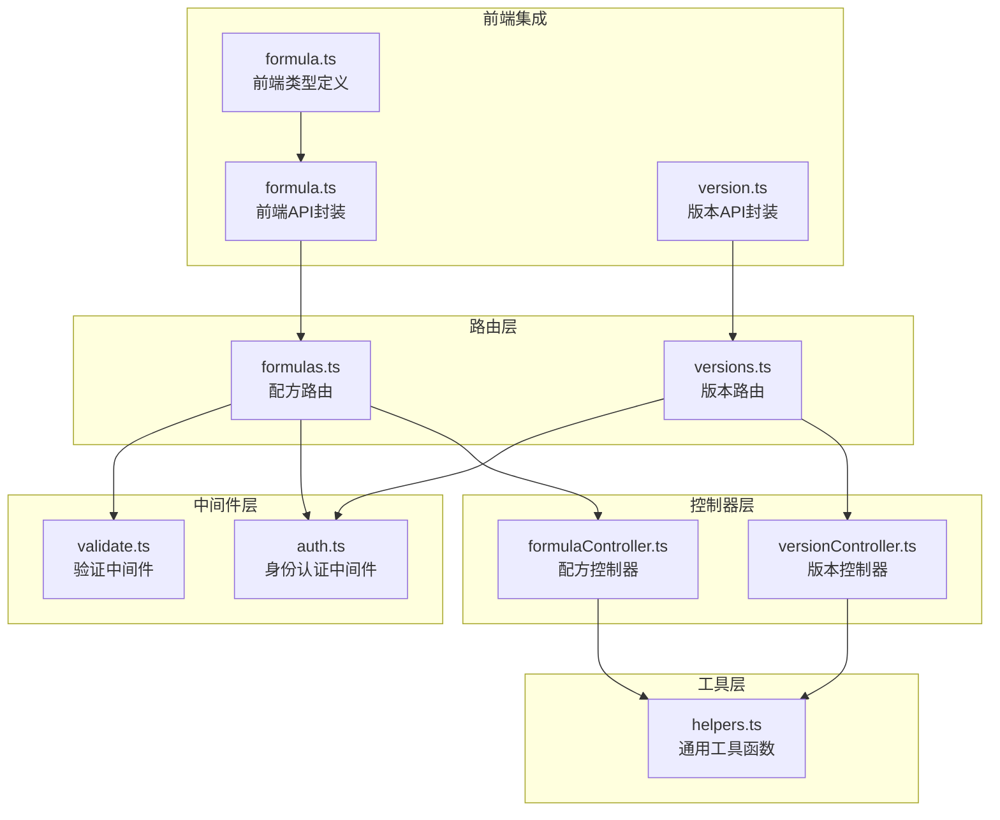
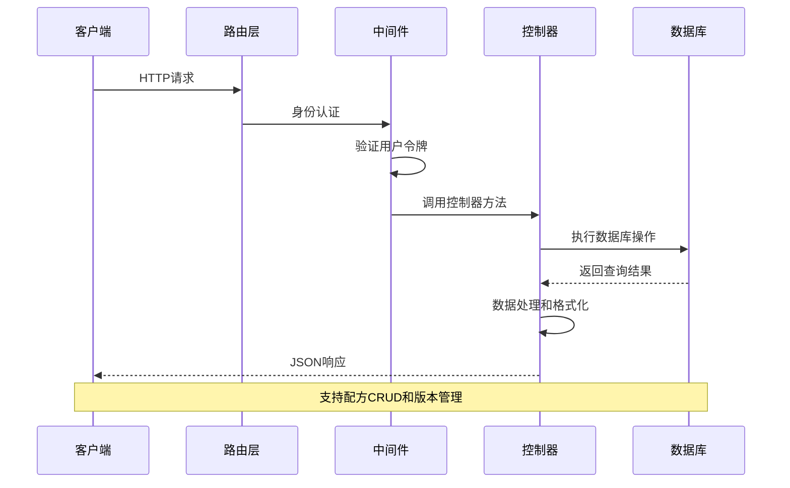
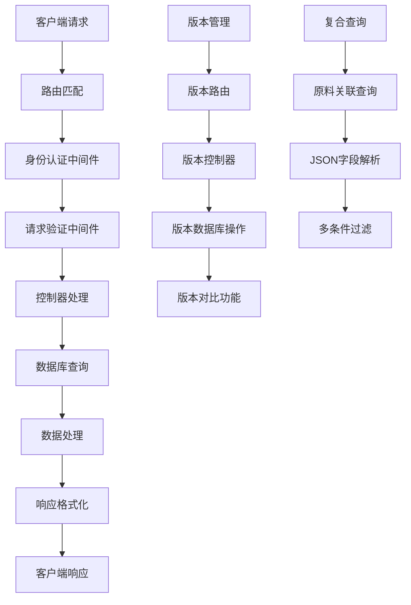
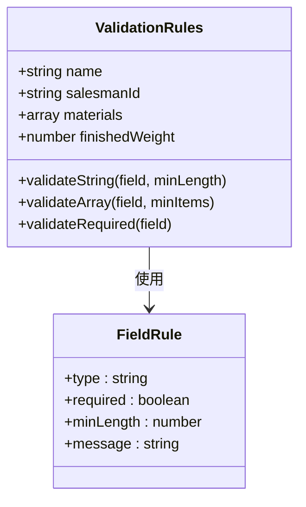
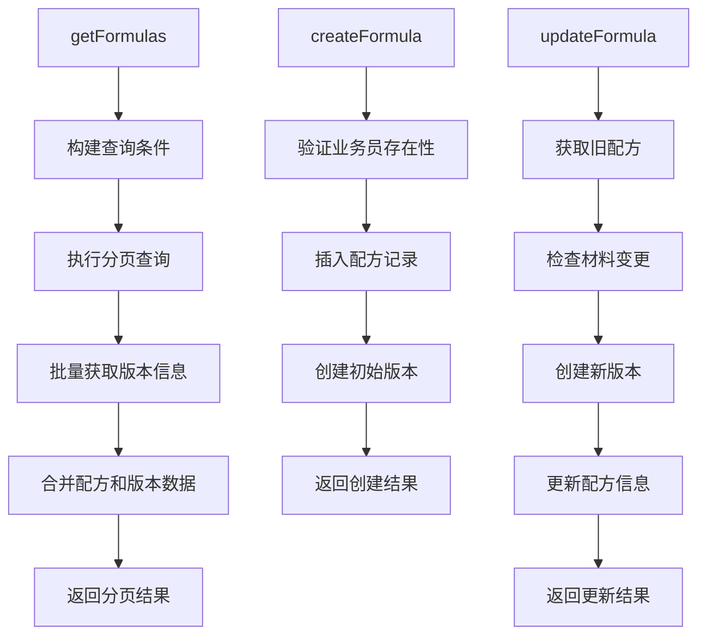
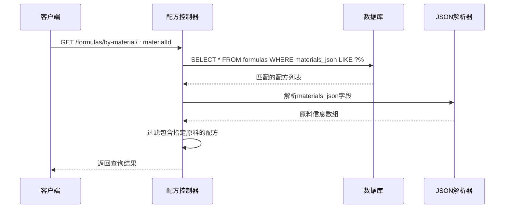
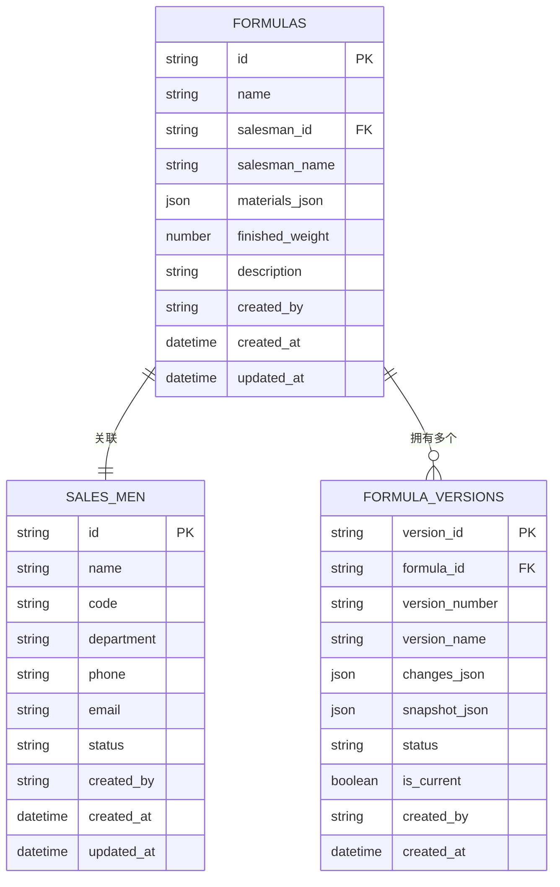
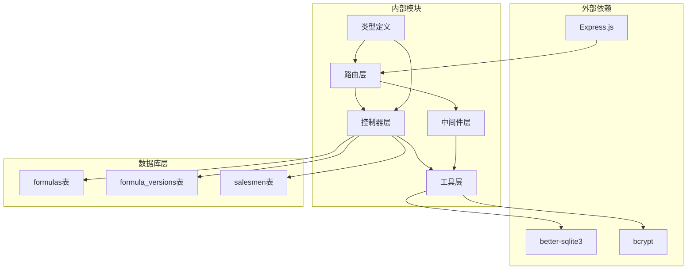
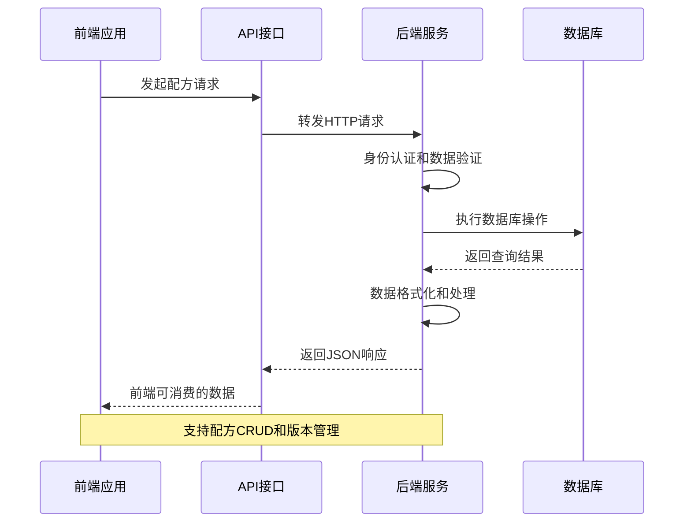
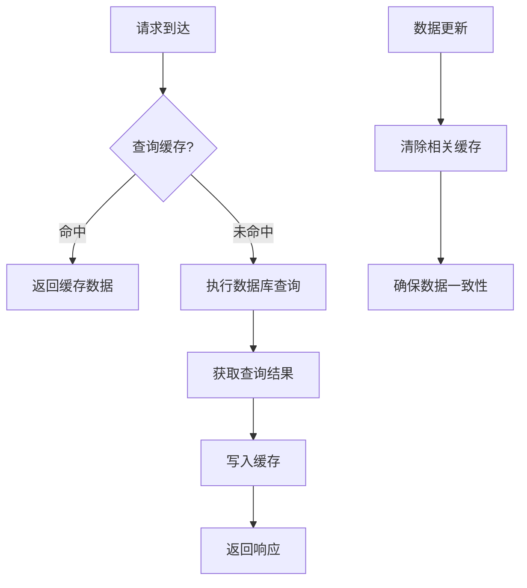

# 配方路由模块

<cite>
**本文档引用的文件**
- [formulas.ts](file://backend/src/routes/formulas.ts)
- [formulaController.ts](file://backend/src/controllers/formulaController.ts)
- [validate.ts](file://backend/src/middleware/validate.ts)
- [helpers.ts](file://backend/src/utils/helpers.ts)
- [formula.ts](file://frontend/src/types/formula.ts)
- [formula.ts](file://frontend/src/api/formula.ts)
- [versions.ts](file://backend/src/routes/versions.ts)
- [versionController.ts](file://backend/src/controllers/versionController.ts)
- [version.ts](file://frontend/src/api/version.ts)
- [DATABASE_DOC.md](file://backend/DATABASE_DOC.md)
- [index.ts](file://backend/src/routes/index.ts)
</cite>

## 目录
1. [简介](#简介)
2. [项目结构](#项目结构)
3. [核心组件](#核心组件)
4. [架构概览](#架构概览)
5. [详细组件分析](#详细组件分析)
6. [依赖关系分析](#依赖关系分析)
7. [性能考虑](#性能考虑)
8. [故障排除指南](#故障排除指南)
9. [结论](#结论)

## 简介

配方路由模块是TingStudio配方管理系统的核心部分，负责处理所有与配方相关的HTTP请求。该模块实现了完整的配方生命周期管理，包括配方的创建、查询、更新、删除以及与原料的关联关系处理。同时，模块还集成了版本控制系统，支持配方的历史版本追踪、版本发布和版本对比功能。

该模块采用RESTful API设计原则，遵循Express.js框架的最佳实践，通过中间件实现请求验证和身份认证，确保系统的安全性和数据完整性。

## 项目结构

配方路由模块位于后端项目的routes目录下，采用模块化设计，每个功能模块都有独立的路由文件和控制器文件。



**图表来源**
- [formulas.ts:1-28](file://backend/src/routes/formulas.ts#L1-L28)
- [versions.ts:1-17](file://backend/src/routes/versions.ts#L1-L17)
- [formulaController.ts:1-287](file://backend/src/controllers/formulaController.ts#L1-L287)
- [versionController.ts:1-270](file://backend/src/controllers/versionController.ts#L1-L270)

**章节来源**
- [formulas.ts:1-28](file://backend/src/routes/formulas.ts#L1-L28)
- [versions.ts:1-17](file://backend/src/routes/versions.ts#L1-L17)
- [index.ts:1-24](file://backend/src/routes/index.ts#L1-L24)

## 核心组件

配方路由模块包含以下核心组件：

### 路由组件
- **配方路由**：处理 `/formulas` 前缀下的所有路由请求
- **版本路由**：处理 `/versions` 前缀下的版本管理请求
- **身份认证中间件**：确保所有路由都需要有效的用户认证
- **请求验证中间件**：对POST和PUT请求进行数据验证

### 控制器组件
- **配方控制器**：实现配方的CRUD操作和复合查询功能
- **版本控制器**：实现版本的创建、发布、对比和查询功能

### 数据模型
- **配方类型**：定义配方的数据结构和字段约束
- **版本类型**：定义版本的数据结构和状态管理
- **原料关联**：通过JSON字段实现配方与原料的灵活关联

**章节来源**
- [formulaController.ts:1-287](file://backend/src/controllers/formulaController.ts#L1-L287)
- [versionController.ts:1-270](file://backend/src/controllers/versionController.ts#L1-L270)
- [formula.ts:1-33](file://frontend/src/types/formula.ts#L1-L33)

## 架构概览

配方路由模块采用经典的MVC架构模式，通过清晰的层次分离实现关注点分离。



**图表来源**
- [formulas.ts:10-28](file://backend/src/routes/formulas.ts#L10-L28)
- [formulaController.ts:88-130](file://backend/src/controllers/formulaController.ts#L88-L130)

### 数据流架构



**图表来源**
- [formulaController.ts:231-243](file://backend/src/controllers/formulaController.ts#L231-L243)
- [versionController.ts:159-269](file://backend/src/controllers/versionController.ts#L159-L269)

## 详细组件分析

### 配方路由组件

配方路由组件提供了完整的配方管理API，支持RESTful风格的CRUD操作。

#### 路由定义

| HTTP方法 | 路径 | 功能 | 验证要求 |
|---------|------|------|----------|
| GET | `/formulas` | 获取配方列表 | 身份认证 |
| GET | `/formulas/:id` | 获取单个配方 | 身份认证 |
| POST | `/formulas` | 创建新配方 | 身份认证 + 数据验证 |
| PUT | `/formulas/:id` | 更新配方 | 身份认证 |
| DELETE | `/formulas/:id` | 删除配方 | 身份认证 |
| GET | `/formulas/by-material/:materialId` | 按原料查询配方 | 身份认证 |

#### 数据验证规则

配方创建时的验证规则如下：



**图表来源**
- [validate.ts:4-14](file://backend/src/middleware/validate.ts#L4-L14)
- [formulas.ts:16-24](file://backend/src/routes/formulas.ts#L16-L24)

**章节来源**
- [formulas.ts:14-27](file://backend/src/routes/formulas.ts#L14-L27)
- [validate.ts:16-67](file://backend/src/middleware/validate.ts#L16-L67)

### 配方控制器组件

配方控制器实现了复杂的业务逻辑，包括数据验证、关联查询和版本管理。

#### 核心功能实现



**图表来源**
- [formulaController.ts:6-69](file://backend/src/controllers/formulaController.ts#L6-L69)
- [formulaController.ts:88-130](file://backend/src/controllers/formulaController.ts#L88-L130)
- [formulaController.ts:132-218](file://backend/src/controllers/formulaController.ts#L132-L218)

#### 复合查询实现

配方与原料的关联关系通过JSON字段实现，支持复杂的查询操作：



**图表来源**
- [formulaController.ts:231-243](file://backend/src/controllers/formulaController.ts#L231-L243)

**章节来源**
- [formulaController.ts:6-69](file://backend/src/controllers/formulaController.ts#L6-L69)
- [formulaController.ts:132-218](file://backend/src/controllers/formulaController.ts#L132-L218)
- [formulaController.ts:231-243](file://backend/src/controllers/formulaController.ts#L231-L243)

### 版本控制组件

版本控制组件提供了完整的配方版本管理功能，支持版本的创建、发布和对比。

#### 版本路由设计

| HTTP方法 | 路径 | 功能 | 状态管理 |
|---------|------|------|----------|
| GET | `/versions/formula/:formulaId` | 获取配方版本列表 | 支持状态过滤 |
| GET | `/versions/detail/:versionId` | 获取版本详情 | 无 |
| POST | `/versions/formula/:formulaId` | 创建新版本 | draft/published |
| PUT | `/versions/publish/:versionId` | 发布版本 | published |
| GET | `/versions/compare/:formulaId` | 版本对比 | draft/archived |

#### 版本号生成算法

版本号采用语义化版本控制策略：

```mermaid
flowchart TD
A[获取最新版本] --> B{是否找到版本?}
B --> |否| C[v1.0]
B --> |是| D[解析版本号]
D --> E[提取主版本号和次版本号]
E --> F{次版本号是否为0?}
F --> |是| G[v{主版本+1}.0]
F --> |否| H[v{主版本}.{次版本+1}]
C --> I[返回新版本号]
G --> I
H --> I
```

**图表来源**
- [versionController.ts:74-84](file://backend/src/controllers/versionController.ts#L74-L84)

**章节来源**
- [versions.ts:12-16](file://backend/src/routes/versions.ts#L12-L16)
- [versionController.ts:6-35](file://backend/src/controllers/versionController.ts#L6-L35)
- [versionController.ts:113-157](file://backend/src/controllers/versionController.ts#L113-L157)

### 数据模型设计

配方和版本的数据模型设计体现了灵活性和扩展性。

#### 配方数据模型



**图表来源**
- [DATABASE_DOC.md:67-97](file://backend/DATABASE_DOC.md#L67-L97)
- [DATABASE_DOC.md:125-171](file://backend/DATABASE_DOC.md#L125-L171)

**章节来源**
- [DATABASE_DOC.md:67-97](file://backend/DATABASE_DOC.md#L67-L97)
- [DATABASE_DOC.md:125-171](file://backend/DATABASE_DOC.md#L125-L171)

## 依赖关系分析

配方路由模块的依赖关系体现了清晰的分层架构设计。



**图表来源**
- [index.ts:11-23](file://backend/src/routes/index.ts#L11-L23)
- [formulas.ts:1-28](file://backend/src/routes/formulas.ts#L1-L28)
- [versions.ts:1-17](file://backend/src/routes/versions.ts#L1-L17)

### 前后端集成



**图表来源**
- [formula.ts:45-64](file://frontend/src/api/formula.ts#L45-L64)
- [version.ts:18-34](file://frontend/src/api/version.ts#L18-L34)

**章节来源**
- [formula.ts:1-65](file://frontend/src/api/formula.ts#L1-L65)
- [version.ts:1-35](file://frontend/src/api/version.ts#L1-L35)

## 性能考虑

配方路由模块在设计时充分考虑了性能优化和可扩展性。

### 查询优化策略

1. **分页查询**：默认每页20条记录，最大100条，防止大数据量查询
2. **索引利用**：针对常用查询字段建立数据库索引
3. **批量查询**：批量获取配方版本信息，减少数据库往返次数
4. **条件过滤**：支持多条件组合查询，提高查询精度

### 缓存策略



### 并发处理

- **连接池管理**：使用SQLite连接池处理并发请求
- **事务控制**：关键操作使用数据库事务保证数据一致性
- **锁机制**：避免并发更新导致的数据竞争

## 故障排除指南

### 常见错误及解决方案

#### 身份认证错误
- **症状**：返回401未授权
- **原因**：缺少有效令牌或令牌过期
- **解决**：重新登录获取新令牌

#### 数据验证错误
- **症状**：返回400参数验证失败
- **原因**：请求数据不符合验证规则
- **解决**：检查请求体中的必填字段和数据类型

#### 业务逻辑错误
- **症状**：返回400业务错误
- **原因**：业务规则不满足（如业务员不存在）
- **解决**：检查关联数据的有效性

#### 数据库错误
- **症状**：返回500服务器错误
- **原因**：数据库操作失败
- **解决**：检查数据库连接和SQL语法

**章节来源**
- [formulaController.ts:66-68](file://backend/src/controllers/formulaController.ts#L66-L68)
- [validate.ts:60-62](file://backend/src/middleware/validate.ts#L60-L62)

### 调试建议

1. **启用日志**：在开发环境中启用详细的请求日志
2. **单元测试**：为关键业务逻辑编写单元测试
3. **监控指标**：监控API响应时间和错误率
4. **性能分析**：定期分析慢查询和性能瓶颈

## 结论

配方路由模块是一个设计精良、功能完整的API模块，它成功地实现了配方管理的核心需求。模块采用了现代化的架构设计，具有良好的可维护性和扩展性。

### 主要优势

1. **完整的功能覆盖**：支持配方的全生命周期管理
2. **灵活的数据模型**：通过JSON字段实现配方与原料的灵活关联
3. **完善的版本控制**：提供版本创建、发布和对比功能
4. **严格的数据验证**：确保数据的完整性和一致性
5. **清晰的架构设计**：采用MVC模式，职责分离明确

### 技术亮点

1. **RESTful API设计**：符合现代Web API设计标准
2. **中间件架构**：通过中间件实现横切关注点
3. **数据库优化**：合理的设计和索引策略
4. **前后端分离**：清晰的接口定义和类型约束

### 改进建议

1. **增加缓存层**：对于频繁查询的配方数据可以考虑添加缓存
2. **实现批量操作**：支持批量创建、更新和删除操作
3. **增强错误处理**：提供更详细的错误信息和恢复策略
4. **添加审计日志**：记录重要的业务操作日志

该模块为TingStudio配方管理系统提供了坚实的基础，能够满足当前和未来的需求发展。