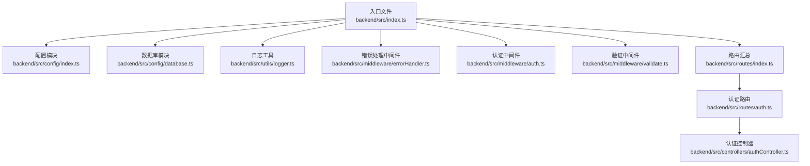
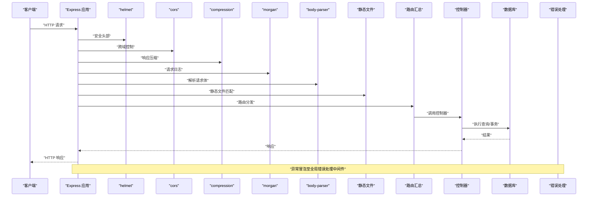
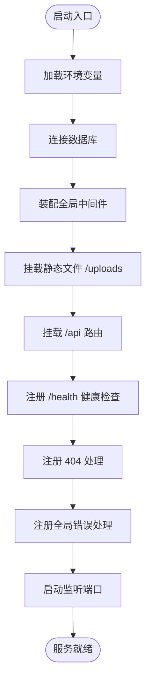
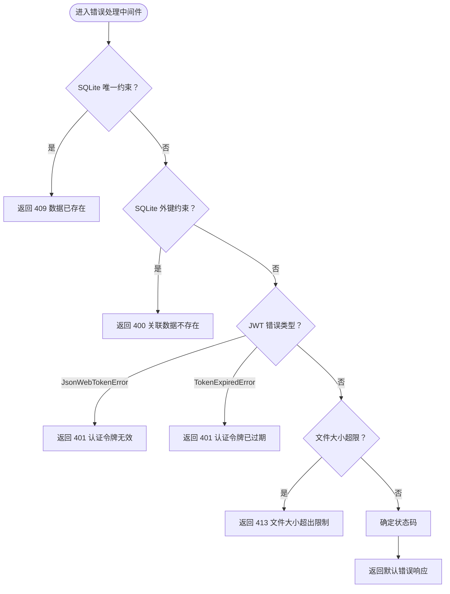
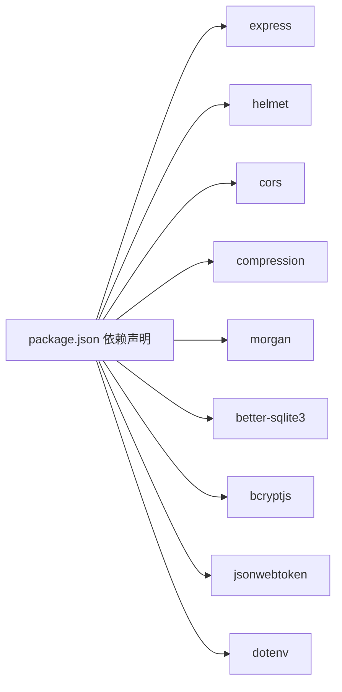

# Express 应用配置

<cite>
**本文引用的文件**
- [backend/src/index.ts](file://backend/src/index.ts)
- [backend/src/config/index.ts](file://backend/src/config/index.ts)
- [backend/src/config/database.ts](file://backend/src/config/database.ts)
- [backend/src/utils/logger.ts](file://backend/src/utils/logger.ts)
- [backend/src/middleware/errorHandler.ts](file://backend/src/middleware/errorHandler.ts)
- [backend/src/middleware/auth.ts](file://backend/src/middleware/auth.ts)
- [backend/src/middleware/validate.ts](file://backend/src/middleware/validate.ts)
- [backend/src/routes/index.ts](file://backend/src/routes/index.ts)
- [backend/src/controllers/authController.ts](file://backend/src/controllers/authController.ts)
- [backend/package.json](file://backend/package.json)
- [README.md](file://README.md)
- [backend/API_DOC.md](file://backend/API_DOC.md)
</cite>

## 目录
1. [引言](#引言)
2. [项目结构](#项目结构)
3. [核心组件](#核心组件)
4. [架构总览](#架构总览)
5. [详细组件分析](#详细组件分析)
6. [依赖关系分析](#依赖关系分析)
7. [性能考虑](#性能考虑)
8. [故障排查指南](#故障排查指南)
9. [结论](#结论)
10. [附录](#附录)

## 引言
本文件面向后端 Express 应用的配置与运行，聚焦以下主题：
- 应用启动流程与控制流
- 中间件配置与全局设置（helmet、cors、compression、morgan）
- 静态文件服务、健康检查端点与错误处理机制
- 环境变量与启动参数最佳实践
- 配置优化建议与常见问题排查

该应用采用前后端分离架构，后端基于 Express + TypeScript，数据库为 SQLite（better-sqlite3），并提供 JWT 认证、RESTful API、版本控制与营养分析等能力。

章节来源
- [README.md:11-29](file://README.md#L11-L29)

## 项目结构
后端采用按职责分层的组织方式：
- 入口文件负责应用初始化、中间件装配、路由挂载、静态资源与健康检查、错误处理与启动监听
- 配置模块集中管理端口、数据库路径、JWT、上传与跨域等配置
- 数据库模块封装连接、事务、查询与 WAL/外键等 SQLite 设置
- 日志工具提供统一的日志输出格式与级别
- 中间件层包括认证、请求体校验与全局错误处理
- 路由层聚合各业务模块路由
- 控制器层实现具体业务逻辑

图表来源
- [backend/src/index.ts:13-55](file://backend/src/index.ts#L13-L55)
- [backend/src/config/index.ts:1-24](file://backend/src/config/index.ts#L1-L24)
- [backend/src/config/database.ts:10-37](file://backend/src/config/database.ts#L10-L37)
- [backend/src/utils/logger.ts:24-39](file://backend/src/utils/logger.ts#L24-L39)
- [backend/src/middleware/errorHandler.ts:5-50](file://backend/src/middleware/errorHandler.ts#L5-L50)
- [backend/src/middleware/auth.ts:13-31](file://backend/src/middleware/auth.ts#L13-L31)
- [backend/src/middleware/validate.ts:16-67](file://backend/src/middleware/validate.ts#L16-L67)
- [backend/src/routes/index.ts:11-23](file://backend/src/routes/index.ts#L11-L23)
- [backend/src/controllers/authController.ts:9-39](file://backend/src/controllers/authController.ts#L9-L39)

章节来源
- [backend/src/index.ts:13-55](file://backend/src/index.ts#L13-L55)
- [backend/src/config/index.ts:1-24](file://backend/src/config/index.ts#L1-L24)
- [backend/src/config/database.ts:10-37](file://backend/src/config/database.ts#L10-L37)
- [backend/src/utils/logger.ts:24-39](file://backend/src/utils/logger.ts#L24-L39)
- [backend/src/middleware/errorHandler.ts:5-50](file://backend/src/middleware/errorHandler.ts#L5-L50)
- [backend/src/middleware/auth.ts:13-31](file://backend/src/middleware/auth.ts#L13-L31)
- [backend/src/middleware/validate.ts:16-67](file://backend/src/middleware/validate.ts#L16-L67)
- [backend/src/routes/index.ts:11-23](file://backend/src/routes/index.ts#L11-L23)
- [backend/src/controllers/authController.ts:9-39](file://backend/src/controllers/authController.ts#L9-L39)

## 核心组件
- 应用入口与启动流程
  - 加载环境变量、连接数据库、装配全局中间件、挂载路由、静态资源、健康检查、404 与错误处理，最后启动监听端口
- 全局中间件
  - 安全：helmet 提供安全头部
  - 跨域：cors 配置允许来源与凭据
  - 压缩：compression 启用 gzip/deflate
  - 日志：morgan 使用 dev 格式输出请求日志
  - 请求体解析：express.json 与 urlencoded，并设置合理大小限制
- 静态文件服务
  - 对 /uploads 路径提供静态文件访问
- 健康检查
  - GET /health 返回服务状态与时间戳
- 错误处理
  - 全局错误处理中间件，针对 SQLite 约束、JWT、文件大小限制与默认错误进行分类处理
- 配置中心
  - 端口、数据库路径、JWT、上传目录与大小、CORS 来源等集中管理
- 数据库
  - better-sqlite3 连接、WAL 模式、外键约束、查询与事务封装
- 日志
  - 自定义日志工具，支持 info/warn/error/debug 四种级别与彩色输出

章节来源
- [backend/src/index.ts:13-55](file://backend/src/index.ts#L13-L55)
- [backend/src/config/index.ts:2-23](file://backend/src/config/index.ts#L2-L23)
- [backend/src/config/database.ts:10-37](file://backend/src/config/database.ts#L10-L37)
- [backend/src/utils/logger.ts:24-39](file://backend/src/utils/logger.ts#L24-L39)
- [backend/src/middleware/errorHandler.ts:5-50](file://backend/src/middleware/errorHandler.ts#L5-L50)

## 架构总览
下图展示了应用启动与请求处理的关键流程，包括中间件顺序、路由挂载与错误处理位置。

图表来源
- [backend/src/index.ts:21-48](file://backend/src/index.ts#L21-L48)
- [backend/src/routes/index.ts:11-23](file://backend/src/routes/index.ts#L11-L23)
- [backend/src/controllers/authController.ts:9-39](file://backend/src/controllers/authController.ts#L9-L39)
- [backend/src/config/database.ts:44-61](file://backend/src/config/database.ts#L44-L61)
- [backend/src/middleware/errorHandler.ts:5-50](file://backend/src/middleware/errorHandler.ts#L5-L50)

## 详细组件分析

### 启动流程与控制流
- 入口函数负责串联数据库连接、中间件装配、路由挂载、静态资源、健康检查、404 与错误处理，最终启动监听
- 启动日志包含服务地址与环境信息，便于运维观察

图表来源
- [backend/src/index.ts:13-55](file://backend/src/index.ts#L13-L55)

章节来源
- [backend/src/index.ts:13-55](file://backend/src/index.ts#L13-L55)

### 中间件配置与作用
- helmet
  - 通过安全头部减少常见 Web 攻击面，建议在生产环境保持启用
- cors
  - 允许指定来源与携带凭据；开发默认允许本地前端地址
- compression
  - 对文本类响应启用压缩，降低带宽占用
- morgan
  - 开发模式使用 dev 格式输出请求日志，便于调试
- express.json / urlencoded
  - 解析 JSON 与表单请求体，设置合理大小限制避免内存压力

章节来源
- [backend/src/index.ts:21-29](file://backend/src/index.ts#L21-L29)
- [backend/src/config/index.ts:20-22](file://backend/src/config/index.ts#L20-L22)

### 静态文件服务与健康检查
- 静态文件
  - /uploads 路径映射到 uploads 目录，用于文件上传后的访问
- 健康检查
  - GET /health 返回服务状态与时间戳，便于容器编排与监控系统探测

章节来源
- [backend/src/index.ts:31-40](file://backend/src/index.ts#L31-L40)

### 错误处理机制
- 全局错误处理中间件对多种错误场景进行分类处理：
  - SQLite 唯一约束冲突（409）
  - 外键约束失败（400）
  - JWT 相关错误（401）
  - 文件大小超限（413）
  - 默认 500 并根据环境返回详细或通用错误信息

图表来源
- [backend/src/middleware/errorHandler.ts:5-50](file://backend/src/middleware/errorHandler.ts#L5-L50)

章节来源
- [backend/src/middleware/errorHandler.ts:5-50](file://backend/src/middleware/errorHandler.ts#L5-L50)

### 配置中心与环境变量
- 端口与环境
  - 端口优先取环境变量，否则默认 3000；NODE_ENV 决定日志与错误细节
- 数据库
  - SQLite 路径默认 ./data/tingstudio.db，启动前确保目录存在
- JWT
  - 密钥与过期时间可配置，建议生产环境强制设置
- 上传
  - 上传目录与最大文件大小可配置
- CORS
  - 允许来源默认本地前端地址

章节来源
- [backend/src/config/index.ts:2-23](file://backend/src/config/index.ts#L2-L23)
- [backend/src/config/database.ts:10-25](file://backend/src/config/database.ts#L10-L25)

### 数据库连接与查询封装
- 连接
  - 自动创建数据目录，连接数据库，启用 WAL 模式与外键约束
- 查询
  - 区分 SELECT 与其他语句，返回兼容 mysql2 的 [rows] 结构或 RunResult
- 事务
  - 提供事务执行封装，保证一致性
- 关闭
  - 提供显式关闭连接的入口

章节来源
- [backend/src/config/database.ts:10-61](file://backend/src/config/database.ts#L10-L61)

### 日志工具
- 支持 info/warn/error/debug 四种级别
- 开发环境下输出 debug 信息
- 输出包含时间戳与颜色标识，便于终端阅读

章节来源
- [backend/src/utils/logger.ts:24-39](file://backend/src/utils/logger.ts#L24-L39)

### 认证与请求体校验中间件
- 认证中间件
  - 从 Authorization 头提取 Bearer 令牌并验证，失败返回 401
  - 生成令牌时使用配置中的密钥与过期时间
- 请求体校验中间件
  - 支持必填、类型、最小/最大长度、最小/最大数值等规则
  - 校验失败返回 400 与错误列表

章节来源
- [backend/src/middleware/auth.ts:13-37](file://backend/src/middleware/auth.ts#L13-L37)
- [backend/src/middleware/validate.ts:16-67](file://backend/src/middleware/validate.ts#L16-L67)

### 路由与控制器示例（认证）
- 路由汇总将各模块路由挂载到 /api 下
- 认证路由示例：注册、登录、获取当前用户
- 控制器实现用户注册/登录/获取当前用户，使用数据库查询与 JWT 生成

章节来源
- [backend/src/routes/index.ts:11-23](file://backend/src/routes/index.ts#L11-L23)
- [backend/src/routes/auth.ts:7-19](file://backend/src/routes/auth.ts#L7-L19)
- [backend/src/controllers/authController.ts:9-88](file://backend/src/controllers/authController.ts#L9-L88)

## 依赖关系分析
- 后端依赖
  - Express、helmet、cors、compression、morgan、better-sqlite3、bcryptjs、jsonwebtoken、dotenv 等
- 开发依赖
  - TypeScript、tsx、@types/* 等

图表来源
- [backend/package.json:14-26](file://backend/package.json#L14-L26)

章节来源
- [backend/package.json:14-26](file://backend/package.json#L14-L26)

## 性能考虑
- 压缩与日志
  - 在生产环境启用 compression 可显著降低传输体积；morgan 在生产建议切换到更轻量的日志格式
- 请求体大小限制
  - 合理设置 express.json 的大小限制，避免大请求导致内存压力
- 数据库
  - WAL 模式提升并发读写性能；外键约束保障数据一致性
- 静态文件
  - 生产环境建议由反向代理或 CDN 提供静态资源，减轻应用负载

## 故障排查指南
- 启动失败
  - 检查数据库路径是否存在且可写；确认端口未被占用
- 认证失败
  - 确认 Authorization 头格式为 Bearer 令牌；核对 JWT 密钥与过期时间配置
- 跨域问题
  - 检查 CORS 来源与凭据配置；开发环境默认允许本地前端地址
- 文件上传失败
  - 检查上传目录权限与最大文件大小限制；关注 413 错误
- 404 与路由
  - 确认 /api 前缀与路由挂载顺序；检查未匹配路由的 404 处理

章节来源
- [backend/src/index.ts:13-55](file://backend/src/index.ts#L13-L55)
- [backend/src/middleware/errorHandler.ts:5-50](file://backend/src/middleware/errorHandler.ts#L5-L50)
- [backend/src/config/index.ts:20-22](file://backend/src/config/index.ts#L20-L22)

## 结论
本 Express 应用通过清晰的分层与中间件装配，实现了安全、可维护与可扩展的服务端基础。建议在生产环境中强化安全头部、严格 CORS 配置、选择合适的日志格式与采样策略，并完善监控与告警。同时，结合数据库 WAL 与外键约束，确保数据一致性和性能表现。

## 附录

### 环境变量与启动参数最佳实践
- 环境变量
  - NODE_ENV：生产环境建议设为 production
  - PORT：生产环境建议固定端口并由进程管理器管理
  - DB_PATH：生产环境建议使用绝对路径与持久化存储
  - JWT_SECRET：生产环境必须设置强密钥并妥善保管
  - UPLOAD_DIR：生产环境建议独立挂载卷并设置权限
  - MAX_FILE_SIZE：根据业务场景设置合理上限
  - CORS_ORIGIN：生产环境建议明确来源，避免 *
- 启动参数
  - 使用进程管理器（如 PM2）管理进程与自动重启
  - 建议在容器中设置资源限制与健康检查探针

章节来源
- [backend/src/config/index.ts:2-23](file://backend/src/config/index.ts#L2-L23)
- [backend/src/index.ts:15-15](file://backend/src/index.ts#L15-L15)
- [backend/src/middleware/auth.ts:33-37](file://backend/src/middleware/auth.ts#L33-L37)

### API 通用约定（参考）
- 基础地址：http://localhost:3000/api
- 认证方式：Bearer Token（JWT）
- Content-Type：application/json
- 通用响应格式与状态码详见接口文档

章节来源
- [backend/API_DOC.md:3-71](file://backend/API_DOC.md#L3-L71)