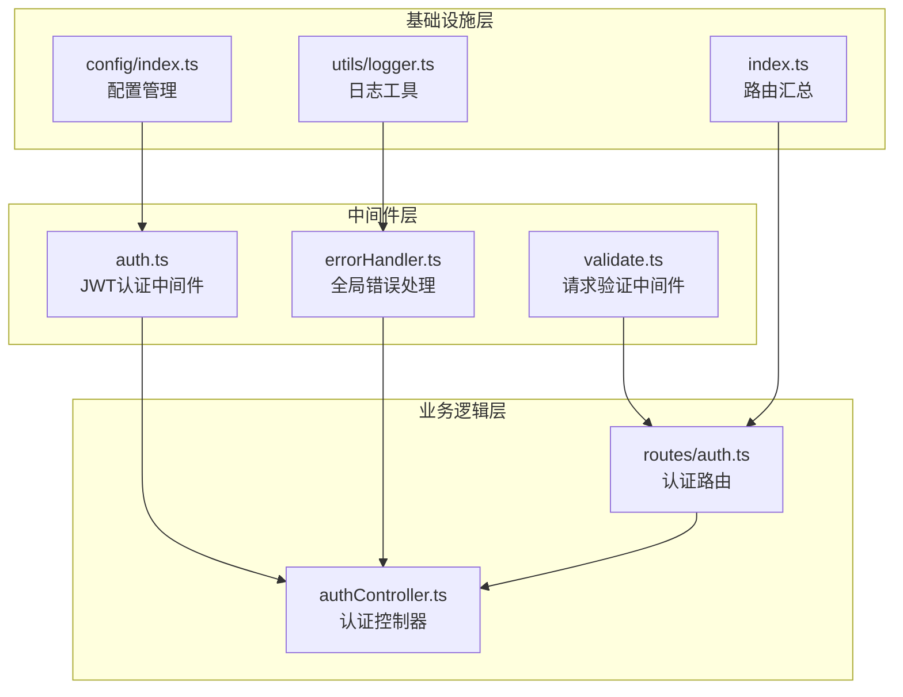
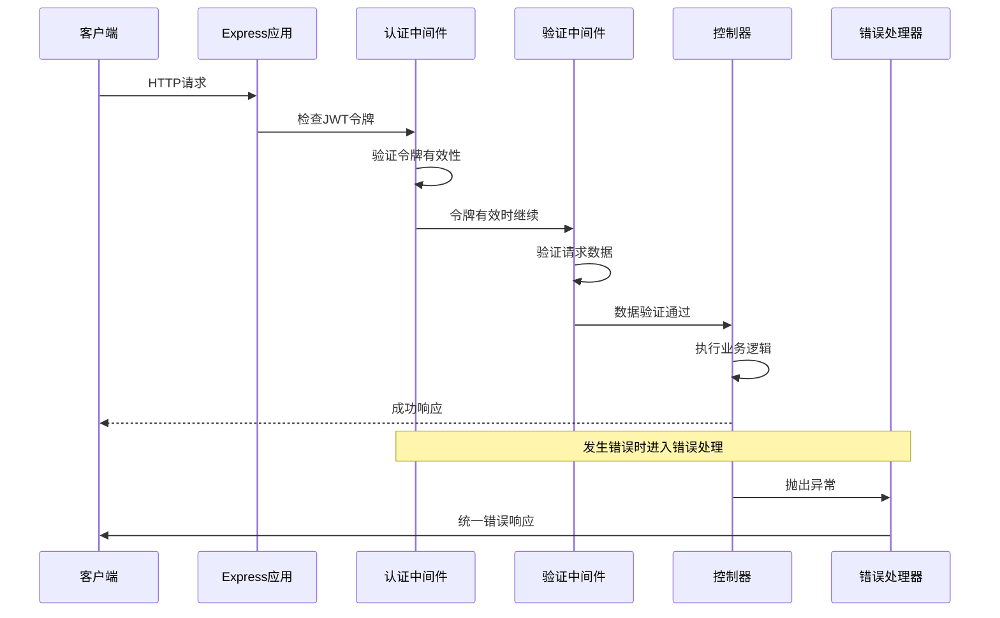
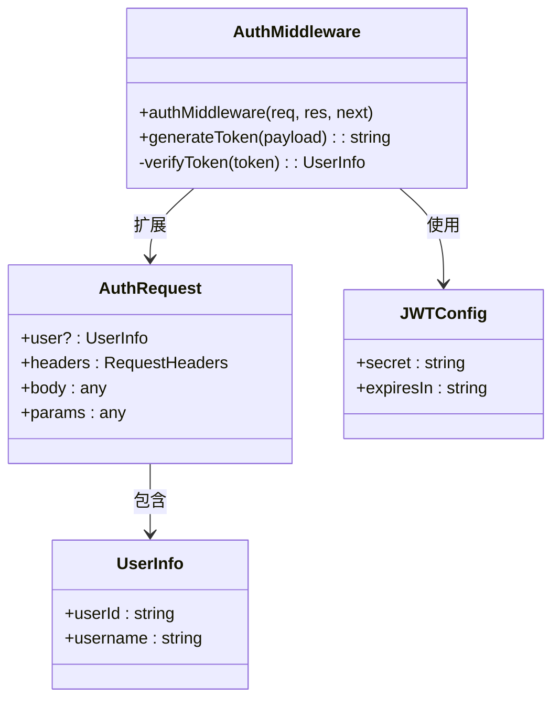
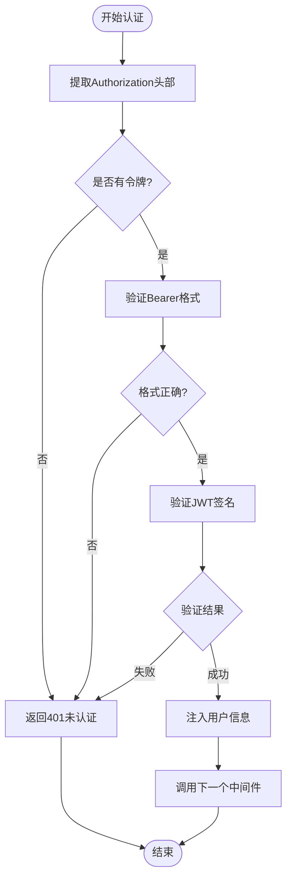
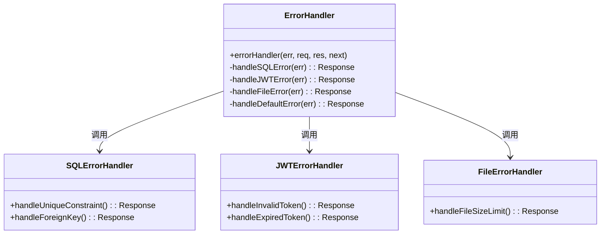
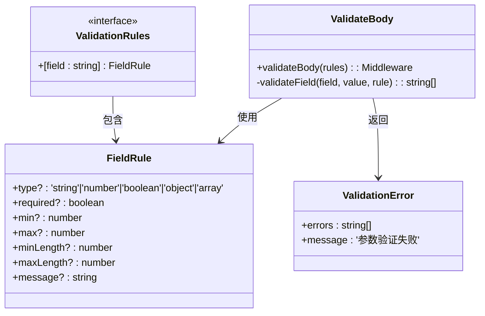
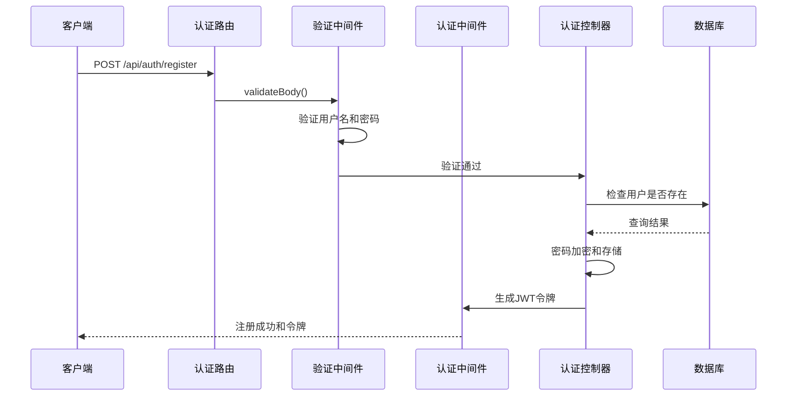
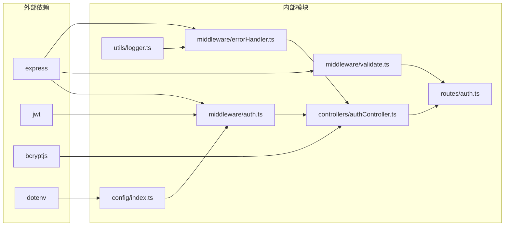

# 中间件系统

<cite>
**本文档引用的文件**
- [auth.ts](file://backend/src/middleware/auth.ts)
- [errorHandler.ts](file://backend/src/middleware/errorHandler.ts)
- [validate.ts](file://backend/src/middleware/validate.ts)
- [authController.ts](file://backend/src/controllers/authController.ts)
- [auth.ts](file://backend/src/routes/auth.ts)
- [index.ts](file://backend/src/routes/index.ts)
- [index.ts](file://backend/src/config/index.ts)
- [helpers.ts](file://backend/src/utils/helpers.ts)
- [logger.ts](file://backend/src/utils/logger.ts)
- [index.ts](file://backend/src/index.ts)
</cite>

## 目录
1. [简介](#简介)
2. [项目结构](#项目结构)
3. [核心组件](#核心组件)
4. [架构概览](#架构概览)
5. [详细组件分析](#详细组件分析)
6. [依赖关系分析](#依赖关系分析)
7. [性能考虑](#性能考虑)
8. [故障排除指南](#故障排除指南)
9. [结论](#结论)

## 简介

TingStudio 中间件系统是一个基于 Express.js 的现代化中间件架构，提供了完整的认证、验证和错误处理机制。该系统采用模块化设计，支持 JWT 令牌认证、请求数据验证、全局错误处理等功能，为整个应用提供了可靠的安全保障和用户体验。

## 项目结构

中间件系统位于后端项目的 `src/middleware` 目录中，与控制器、路由和配置文件形成清晰的分层架构：

**图表来源**
- [auth.ts:1-38](file://backend/src/middleware/auth.ts#L1-L38)
- [errorHandler.ts:1-51](file://backend/src/middleware/errorHandler.ts#L1-L51)
- [validate.ts:1-68](file://backend/src/middleware/validate.ts#L1-L68)
- [authController.ts:1-89](file://backend/src/controllers/authController.ts#L1-L89)

**章节来源**
- [index.ts:1-24](file://backend/src/routes/index.ts#L1-L24)
- [index.ts:1-24](file://backend/src/config/index.ts#L1-L24)

## 核心组件

### 认证中间件 (JWT)

认证中间件实现了基于 JWT 的无状态认证机制，支持令牌验证、用户信息提取和权限控制：

- **令牌格式**: Bearer Token 格式，支持标准 JWT 结构
- **用户信息**: 解码后的用户标识包含 `userId` 和 `username`
- **安全机制**: 使用密钥对令牌进行签名验证
- **错误处理**: 未提供令牌或令牌无效时返回 401 状态码

### 错误处理中间件

全局错误处理中间件提供了统一的错误处理机制，支持多种错误类型的分类处理：

- **SQLite 约束错误**: UNIQUE 和 FOREIGN KEY 约束冲突
- **JWT 错误类型**: JsonWebTokenError 和 TokenExpiredError
- **文件上传错误**: 文件大小超限检测
- **默认错误处理**: 500 服务器内部错误的标准响应

### 输入验证中间件

请求验证中间件提供了灵活的表单验证机制，支持多种数据类型和验证规则：

- **字段规则**: 类型检查、必填验证、长度限制
- **数据类型**: string、number、boolean、object、array
- **验证规则**: min/max 数值范围、minLength/maxLength 字符串长度
- **错误收集**: 支持多字段错误收集和统一响应

**章节来源**
- [auth.ts:13-31](file://backend/src/middleware/auth.ts#L13-L31)
- [errorHandler.ts:5-50](file://backend/src/middleware/errorHandler.ts#L5-L50)
- [validate.ts:16-67](file://backend/src/middleware/validate.ts#L16-L67)

## 架构概览

中间件系统在整个应用架构中的位置和交互关系如下：

**图表来源**
- [auth.ts:13-31](file://backend/src/middleware/auth.ts#L13-L31)
- [validate.ts:16-67](file://backend/src/middleware/validate.ts#L16-L67)
- [errorHandler.ts:5-50](file://backend/src/middleware/errorHandler.ts#L5-L50)

## 详细组件分析

### 认证中间件深度分析

认证中间件采用装饰器模式实现，通过扩展 Express Request 接口来传递用户信息：

**图表来源**
- [auth.ts:6-11](file://backend/src/middleware/auth.ts#L6-L11)
- [auth.ts:13-37](file://backend/src/middleware/auth.ts#L13-L37)
- [index.ts:10-13](file://backend/src/config/index.ts#L10-L13)

#### JWT 验证流程

JWT 验证过程遵循以下步骤：

1. **令牌提取**: 从 Authorization 头部提取 Bearer 令牌
2. **格式验证**: 检查令牌格式是否正确
3. **签名验证**: 使用配置的密钥验证令牌签名
4. **用户信息注入**: 将解码后的用户信息注入到请求对象
5. **权限传递**: 调用下一个中间件继续处理

**图表来源**
- [auth.ts:13-31](file://backend/src/middleware/auth.ts#L13-L31)

**章节来源**
- [auth.ts:1-38](file://backend/src/middleware/auth.ts#L1-L38)
- [authController.ts:74-88](file://backend/src/controllers/authController.ts#L74-L88)

### 错误处理中间件分析

错误处理中间件采用策略模式实现，针对不同类型的错误提供专门的处理逻辑：

**图表来源**
- [errorHandler.ts:5-50](file://backend/src/middleware/errorHandler.ts#L5-L50)

#### 错误分类处理机制

错误处理中间件按照优先级处理不同类型的错误：

1. **SQLite 约束错误**: UNIQUE 和 FOREIGN KEY 约束冲突
2. **JWT 错误类型**: 令牌无效和过期错误
3. **文件上传错误**: 文件大小超限
4. **默认错误处理**: 服务器内部错误

**章节来源**
- [errorHandler.ts:1-51](file://backend/src/middleware/errorHandler.ts#L1-L51)

### 输入验证中间件分析

输入验证中间件采用函数式编程模式，通过高阶函数返回具体的验证中间件：

**图表来源**
- [validate.ts:4-14](file://backend/src/middleware/validate.ts#L4-L14)
- [validate.ts:16-67](file://backend/src/middleware/validate.ts#L16-L67)

#### 验证规则实现机制

验证中间件支持以下验证规则：

- **类型验证**: 自动类型检查和转换
- **必填验证**: 空值、空字符串和 null 的统一处理
- **范围验证**: 数值范围和字符串长度限制
- **错误收集**: 支持多字段错误的统一收集和处理

**章节来源**
- [validate.ts:1-68](file://backend/src/middleware/validate.ts#L1-L68)

### 认证流程集成示例

认证中间件在实际应用中的使用方式：

**图表来源**
- [auth.ts:9-15](file://backend/src/routes/auth.ts#L9-L15)
- [authController.ts:9-39](file://backend/src/controllers/authController.ts#L9-L39)

**章节来源**
- [auth.ts:1-20](file://backend/src/routes/auth.ts#L1-L20)
- [authController.ts:1-89](file://backend/src/controllers/authController.ts#L1-L89)

## 依赖关系分析

中间件系统各组件之间的依赖关系和耦合度分析：

**图表来源**
- [auth.ts:2-4](file://backend/src/middleware/auth.ts#L2-L4)
- [validate.ts](file://backend/src/middleware/validate.ts#L2)
- [errorHandler.ts](file://backend/src/middleware/errorHandler.ts#L3)
- [authController.ts](file://backend/src/controllers/authController.ts#L3)

### 组件耦合度评估

- **低耦合**: 中间件之间相互独立，通过 Express 中间件机制连接
- **配置驱动**: 通过配置文件集中管理 JWT 密钥、过期时间和数据库设置
- **职责分离**: 认证、验证、错误处理各司其职，避免功能混杂

**章节来源**
- [index.ts:1-24](file://backend/src/config/index.ts#L1-L24)
- [logger.ts:1-40](file://backend/src/utils/logger.ts#L1-L40)

## 性能考虑

### 中间件执行顺序优化

中间件的执行顺序直接影响应用性能，建议遵循以下原则：

1. **快速失败**: 认证中间件应放在验证中间件之前
2. **轻量优先**: 将计算密集型中间件放在最后
3. **缓存利用**: 合理利用 JWT 缓存减少重复验证

### 内存和资源管理

- **令牌缓存**: 对频繁访问的用户令牌进行缓存
- **日志级别**: 生产环境使用适当的日志级别避免性能影响
- **错误处理**: 统一错误处理避免重复的日志记录

### 并发处理考虑

- **异步操作**: 认证和验证操作应保持非阻塞特性
- **超时控制**: 为数据库查询设置合理的超时时间
- **连接池**: 使用连接池管理数据库连接

## 故障排除指南

### 常见问题诊断

#### JWT 令牌相关问题

**问题症状**: 用户无法登录或访问受保护资源
**可能原因**:
- JWT 密钥配置错误
- 令牌格式不正确
- 令牌过期

**解决方案**:
1. 检查 `JWT_SECRET` 环境变量配置
2. 验证客户端发送的 Authorization 头格式
3. 确认令牌过期时间设置合理

#### 数据验证失败

**问题症状**: API 返回 400 错误和验证消息
**可能原因**:
- 请求数据格式不符合要求
- 必填字段缺失
- 数据类型不匹配

**解决方案**:
1. 检查前端表单验证规则
2. 确认请求体格式正确
3. 验证数据类型转换逻辑

#### 错误处理异常

**问题症状**: 应用崩溃或返回不一致的错误格式
**可能原因**:
- 未捕获的异常
- 错误处理中间件配置错误
- 日志记录异常

**解决方案**:
1. 确保所有异步操作都有适当的错误处理
2. 检查错误处理中间件的注册顺序
3. 验证日志配置和权限

**章节来源**
- [errorHandler.ts:11-50](file://backend/src/middleware/errorHandler.ts#L11-L50)
- [logger.ts:24-39](file://backend/src/utils/logger.ts#L24-L39)

### 调试技巧

#### 开发环境调试

1. **启用详细日志**: 设置 `NODE_ENV=development` 获取详细错误信息
2. **使用调试工具**: 利用浏览器开发者工具检查网络请求
3. **单元测试**: 为中间件编写单元测试确保功能正确性

#### 生产环境监控

1. **错误追踪**: 配置错误监控服务跟踪未处理异常
2. **性能指标**: 监控中间件执行时间和错误率
3. **日志分析**: 分析日志文件识别潜在问题

## 结论

TingStudio 的中间件系统展现了现代 Web 应用的最佳实践，通过模块化的架构设计实现了高度的可维护性和可扩展性。系统的核心优势包括：

- **安全性**: 基于 JWT 的无状态认证机制提供了强大的安全保障
- **可靠性**: 统一的错误处理机制确保了应用的稳定性
- **可维护性**: 清晰的职责分离和配置驱动的设计便于维护
- **性能**: 合理的中间件执行顺序和资源管理优化了整体性能

该中间件系统为 TingStudio 提供了坚实的技术基础，支持未来的功能扩展和性能优化需求。通过遵循本文档的开发规范和最佳实践，可以确保中间件系统的持续演进和稳定运行。