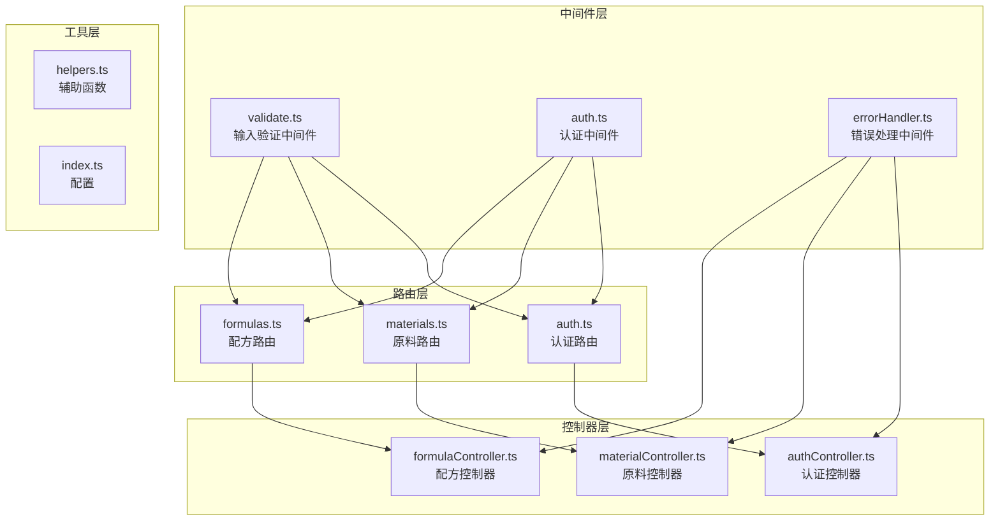
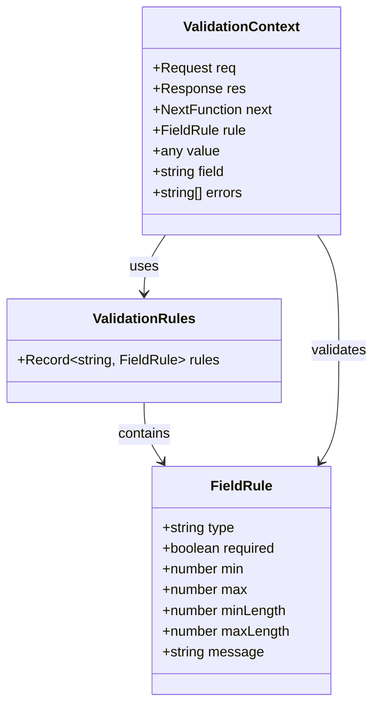
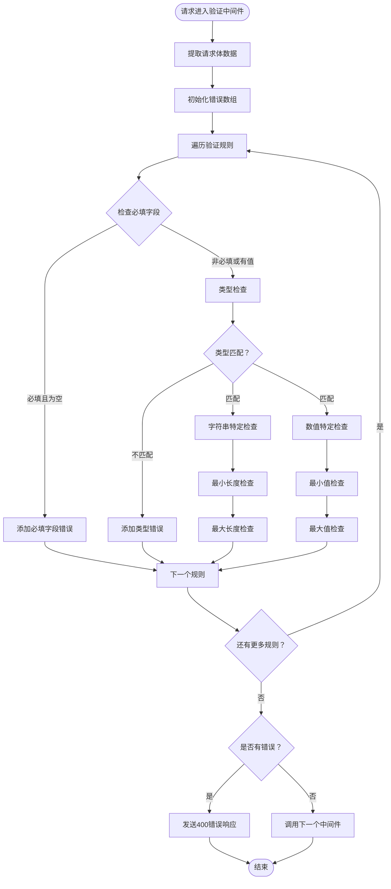
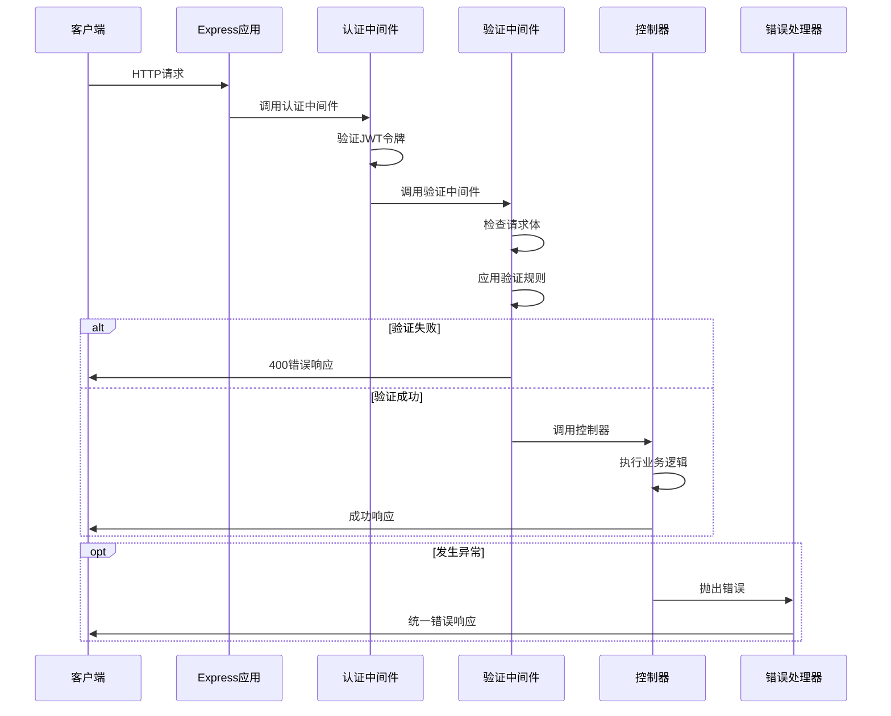
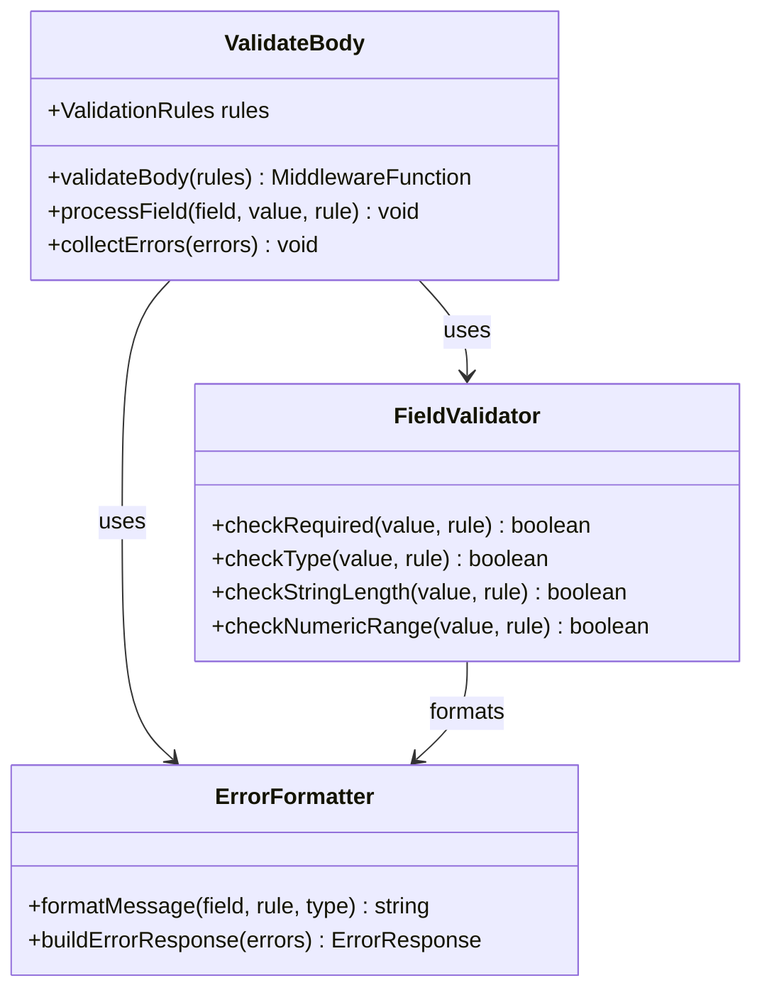
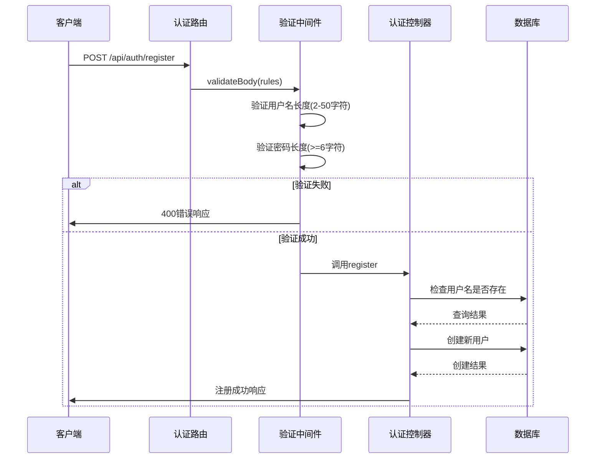
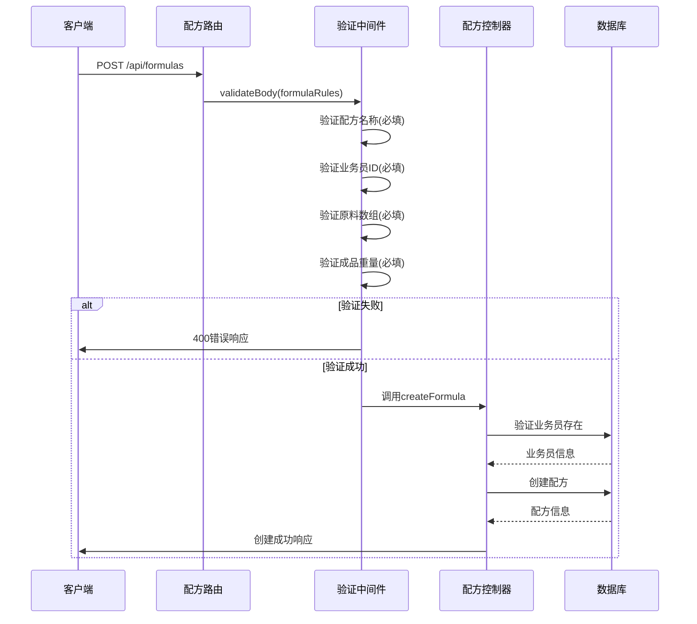
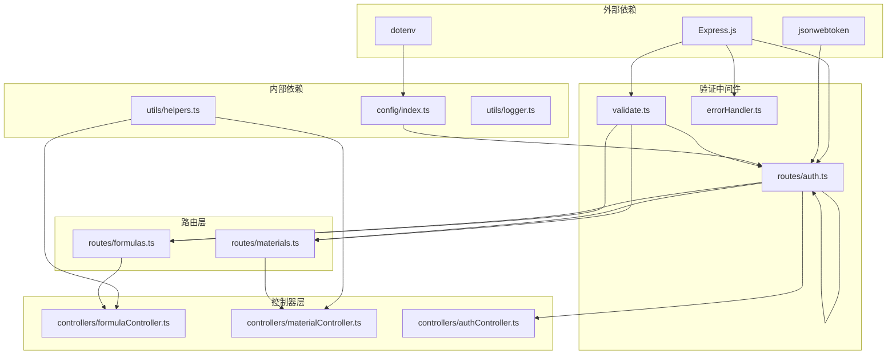
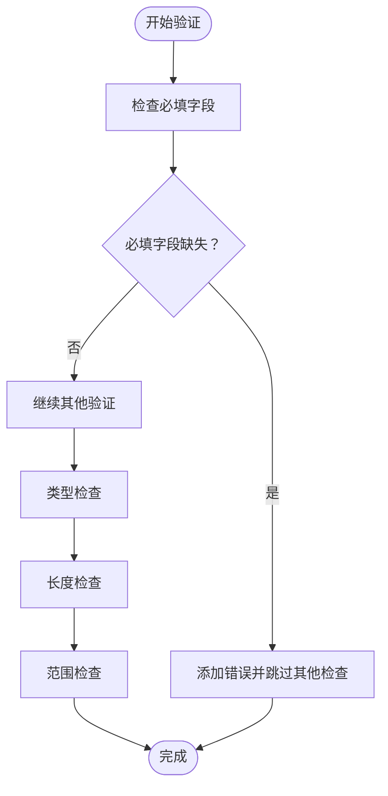

# 输入验证中间件

<cite>
**本文档引用的文件**
- [validate.ts](file://backend/src/middleware/validate.ts)
- [errorHandler.ts](file://backend/src/middleware/errorHandler.ts)
- [auth.ts](file://backend/src/middleware/auth.ts)
- [formulas.ts](file://backend/src/routes/formulas.ts)
- [materials.ts](file://backend/src/routes/materials.ts)
- [auth.ts](file://backend/src/routes/auth.ts)
- [formulaController.ts](file://backend/src/controllers/formulaController.ts)
- [materialController.ts](file://backend/src/controllers/materialController.ts)
- [helpers.ts](file://backend/src/utils/helpers.ts)
- [index.ts](file://backend/src/index.ts)
- [index.ts](file://backend/src/config/index.ts)
</cite>

## 目录
1. [简介](#简介)
2. [项目结构](#项目结构)
3. [核心组件](#核心组件)
4. [架构概览](#架构概览)
5. [详细组件分析](#详细组件分析)
6. [依赖关系分析](#依赖关系分析)
7. [性能考虑](#性能考虑)
8. [故障排除指南](#故障排除指南)
9. [结论](#结论)

## 简介

输入验证中间件是TingStudio后端系统中的关键组件，负责在请求到达控制器之前对请求参数进行严格验证。该中间件提供了灵活且可扩展的验证机制，支持多种数据类型验证、范围限制、必填字段检查等功能，并通过统一的错误格式化机制确保API的一致性。

TingStudio采用Express.js框架构建，验证中间件作为中间件层的一部分，与认证中间件、错误处理中间件协同工作，形成了完整的请求处理管道。该系统特别注重用户体验，通过详细的错误信息帮助开发者快速定位问题。

## 项目结构

TingStudio的验证中间件位于`backend/src/middleware/`目录下，与路由、控制器和其他中间件共同构成了清晰的分层架构：



**图表来源**
- [validate.ts:1-68](file://backend/src/middleware/validate.ts#L1-L68)
- [auth.ts:1-38](file://backend/src/middleware/auth.ts#L1-L38)
- [errorHandler.ts:1-51](file://backend/src/middleware/errorHandler.ts#L1-L51)

**章节来源**
- [validate.ts:1-68](file://backend/src/middleware/validate.ts#L1-L68)
- [formulas.ts:1-28](file://backend/src/routes/formulas.ts#L1-L28)
- [materials.ts:1-22](file://backend/src/routes/materials.ts#L1-L22)
- [auth.ts:1-20](file://backend/src/routes/auth.ts#L1-L20)

## 核心组件

### 验证中间件架构

验证中间件采用函数式编程模式，通过高阶函数返回实际的中间件函数。其核心设计包括：

#### 数据结构定义

验证中间件使用简洁而强大的数据结构来描述验证规则：



**图表来源**
- [validate.ts:4-14](file://backend/src/middleware/validate.ts#L4-L14)

#### 验证流程控制

验证中间件遵循严格的执行顺序，确保所有验证规则都被正确评估：



**图表来源**
- [validate.ts:16-66](file://backend/src/middleware/validate.ts#L16-L66)

**章节来源**
- [validate.ts:1-68](file://backend/src/middleware/validate.ts#L1-L68)

## 架构概览

TingStudio的验证中间件在整个请求处理管道中扮演着关键角色，与认证和错误处理机制紧密协作：



**图表来源**
- [auth.ts:13-31](file://backend/src/middleware/auth.ts#L13-L31)
- [validate.ts:16-66](file://backend/src/middleware/validate.ts#L16-L66)
- [errorHandler.ts:5-50](file://backend/src/middleware/errorHandler.ts#L5-L50)

### 验证规则类型

验证中间件支持多种验证规则类型，每种类型都有其特定的检查逻辑：

| 规则类型 | 用途 | 检查逻辑 | 错误消息 |
|---------|------|----------|----------|
| `type: 'string'` | 字符串验证 | `typeof value !== 'string'` | 必须为字符串 |
| `type: 'number'` | 数字验证 | `typeof value !== 'number'` | 必须为数字 |
| `type: 'boolean'` | 布尔值验证 | `typeof value !== 'boolean'` | 必须为布尔值 |
| `type: 'object'` | 对象验证 | `typeof value !== 'object'` | 必须为对象 |
| `type: 'array'` | 数组验证 | `!Array.isArray(value)` | 必须为数组 |
| `required` | 必填字段 | `(value === undefined || value === null || value === '')` | 为必填项 |
| `minLength` | 最小长度 | `value.length < minLength` | 长度不能少于X |
| `maxLength` | 最大长度 | `value.length > maxLength` | 长度不能超过X |
| `min` | 最小值 | `value < min` | 不能小于X |
| `max` | 最大值 | `value > max` | 不能大于X |

**章节来源**
- [validate.ts:4-12](file://backend/src/middleware/validate.ts#L4-L12)
- [validate.ts:31-57](file://backend/src/middleware/validate.ts#L31-L57)

## 详细组件分析

### 验证中间件实现

验证中间件的核心实现采用了函数式编程的最佳实践，提供了高度可读和可维护的代码结构：

#### 主要功能模块



**图表来源**
- [validate.ts:16-66](file://backend/src/middleware/validate.ts#L16-L66)

#### 错误处理机制

验证中间件实现了统一的错误处理机制，确保所有验证错误都以一致的格式返回：

```mermaid
flowchart TD
ValidationError[验证错误] --> CollectErrors[收集错误信息]
CollectErrors --> FormatMessages[格式化错误消息]
FormatMessages --> BuildResponse[构建响应对象]
BuildResponse --> StatusCode400[HTTP状态码400]
StatusCode400 --> SendResponse[发送响应]
subgraph "错误响应结构"
SuccessField[success: false]
MessageField[message: '参数验证失败']
ErrorsArray[errors: string[]]
end
SendResponse --> SuccessField
SendResponse --> MessageField
SendResponse --> ErrorsArray
```

**图表来源**
- [validate.ts:60-66](file://backend/src/middleware/validate.ts#L60-L66)

**章节来源**
- [validate.ts:16-66](file://backend/src/middleware/validate.ts#L16-L66)

### 实际应用场景

#### 认证路由验证

在认证路由中，验证中间件用于确保用户注册时提供的用户名和密码符合要求：



**图表来源**
- [auth.ts:9-15](file://backend/src/routes/auth.ts#L9-L15)
- [validate.ts:16-23](file://backend/src/middleware/validate.ts#L16-L23)

#### 配方管理验证

在配方管理中，验证中间件确保配方创建时必需的数据完整性和正确性：



**图表来源**
- [formulas.ts:16-24](file://backend/src/routes/formulas.ts#L16-L24)
- [validate.ts:16-23](file://backend/src/middleware/validate.ts#L16-L23)

**章节来源**
- [auth.ts:9-15](file://backend/src/routes/auth.ts#L9-L15)
- [formulas.ts:16-24](file://backend/src/routes/formulas.ts#L16-L24)

### 高级验证特性

#### 自定义错误消息

验证中间件支持为每个字段提供自定义的错误消息，这使得错误信息更加用户友好：

```typescript
validateBody({
  username: { 
    type: 'string', 
    required: true, 
    minLength: 2, 
    maxLength: 50, 
    message: '用户名必须为2-50个字符之间' 
  },
  password: { 
    type: 'string', 
    required: true, 
    minLength: 6,
    message: '密码长度至少6个字符' 
  }
})
```

#### 复杂数据类型验证

对于复杂的JSON数据结构，验证中间件提供了灵活的验证机制：

```typescript
validateBody({
  materials: { 
    type: 'array', 
    required: true,
    message: '请添加至少一种原料'
  },
  finishedWeight: { 
    type: 'number', 
    required: true,
    min: 0,
    message: '成品重量必须为非负数'
  }
})
```

**章节来源**
- [validate.ts:24-27](file://backend/src/middleware/validate.ts#L24-L27)
- [validate.ts:41-57](file://backend/src/middleware/validate.ts#L41-L57)

## 依赖关系分析

验证中间件与其他系统组件之间的依赖关系体现了清晰的分层架构：



**图表来源**
- [validate.ts:2](file://backend/src/middleware/validate.ts#L2)
- [auth.ts:3](file://backend/src/middleware/auth.ts#L3)
- [index.ts:2](file://backend/src/config/index.ts#L2)

### 循环依赖检测

经过分析，验证中间件系统没有发现循环依赖问题：

1. **验证中间件** → 仅依赖Express类型定义
2. **认证中间件** → 依赖JWT和配置
3. **错误处理中间件** → 依赖日志工具
4. **路由层** → 依赖对应的控制器
5. **控制器层** → 依赖数据库和辅助函数

这种设计确保了系统的可维护性和可测试性。

**章节来源**
- [validate.ts:1-68](file://backend/src/middleware/validate.ts#L1-L68)
- [auth.ts:1-38](file://backend/src/middleware/auth.ts#L1-L38)
- [errorHandler.ts:1-51](file://backend/src/middleware/errorHandler.ts#L1-L51)

## 性能考虑

### 验证性能优化

验证中间件在设计时充分考虑了性能因素，采用了多项优化策略：

#### 早期退出机制

验证中间件实现了智能的早期退出策略，一旦发现必填字段缺失立即停止进一步检查：



#### 内存优化

验证中间件使用原地修改的方式处理错误数组，避免不必要的内存分配：

- 错误收集：使用单一数组累积所有错误
- 类型检查：按需进行类型判断，避免重复计算
- 字符串处理：仅在必要时进行长度检查

#### 并发处理

验证中间件是无状态的，可以安全地在并发环境中使用：

- 不保存任何请求特定的状态
- 使用函数参数传递上下文信息
- 避免共享可变状态

### 最佳实践建议

基于性能分析，建议在以下方面优化验证中间件的使用：

1. **规则精简**：只定义必要的验证规则，避免过度验证
2. **类型预检查**：在控制器中进行更严格的类型检查
3. **缓存策略**：对于复杂的验证逻辑，考虑实现缓存机制
4. **异步验证**：对于需要数据库查询的验证，考虑异步处理

## 故障排除指南

### 常见验证错误

验证中间件会根据具体的错误类型返回相应的HTTP状态码和错误信息：

| 错误类型 | HTTP状态码 | 错误原因 | 解决方案 |
|---------|------------|----------|----------|
| 必填字段缺失 | 400 | 字段值为undefined/null/空字符串 | 提供有效的非空值 |
| 类型不匹配 | 400 | 数据类型不符合预期 | 确保数据类型正确 |
| 长度过短 | 400 | 字符串长度小于最小值 | 增加数据长度 |
| 长度过长 | 400 | 字符串长度大于最大值 | 减少数据长度 |
| 数值过小 | 400 | 数字小于最小值 | 提供更大的数值 |
| 数值过大 | 400 | 数字大于最大值 | 提供更小的数值 |

### 调试技巧

#### 开启详细日志

在开发环境中，可以通过调整日志级别来获取更多的调试信息：

```typescript
// 在开发环境中启用详细日志
process.env.NODE_ENV = 'development'
```

#### 错误响应格式

验证中间件返回的错误响应具有统一的格式：

```json
{
  "success": false,
  "message": "参数验证失败",
  "errors": [
    "用户名长度为2-50个字符",
    "密码长度至少6个字符"
  ]
}
```

#### 常见问题排查

1. **验证规则不生效**
   - 检查字段名是否与请求体中的键名完全匹配
   - 确认验证规则的语法正确性
   - 验证中间件是否正确挂载到路由上

2. **错误消息不显示**
   - 检查是否提供了自定义错误消息
   - 确认客户端正确处理了400响应

3. **性能问题**
   - 分析验证规则的复杂度
   - 考虑移除不必要的验证规则
   - 优化数据库查询验证

**章节来源**
- [validate.ts:60-66](file://backend/src/middleware/validate.ts#L60-L66)
- [errorHandler.ts:14-40](file://backend/src/middleware/errorHandler.ts#L14-L40)

## 结论

输入验证中间件是TingStudio后端系统的重要组成部分，它通过提供灵活、可扩展的验证机制，确保了API的安全性和可靠性。该中间件的设计体现了以下特点：

### 设计优势

1. **模块化设计**：验证逻辑独立于业务逻辑，便于维护和测试
2. **类型安全**：使用TypeScript确保编译时类型检查
3. **可扩展性**：支持自定义验证规则和错误消息
4. **性能优化**：采用早期退出和内存优化策略

### 实际价值

- **提升用户体验**：提供清晰的错误反馈信息
- **增强系统稳定性**：防止无效数据进入业务逻辑层
- **简化开发流程**：减少重复的验证代码
- **保证数据质量**：确保数据库中存储的数据完整性

### 改进建议

1. **增强验证规则**：考虑添加更多内置验证规则
2. **性能监控**：添加验证性能指标监控
3. **文档完善**：提供更详细的API文档和示例
4. **测试覆盖**：增加单元测试和集成测试覆盖率

通过持续的优化和改进，输入验证中间件将继续为TingStudio提供可靠、高效的验证服务，支撑整个系统的稳定运行。