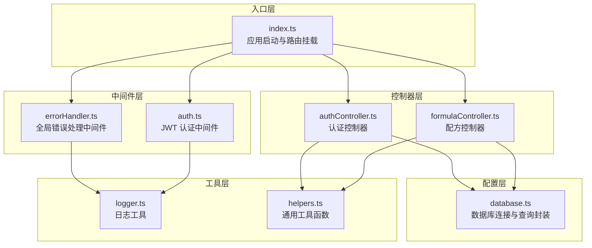
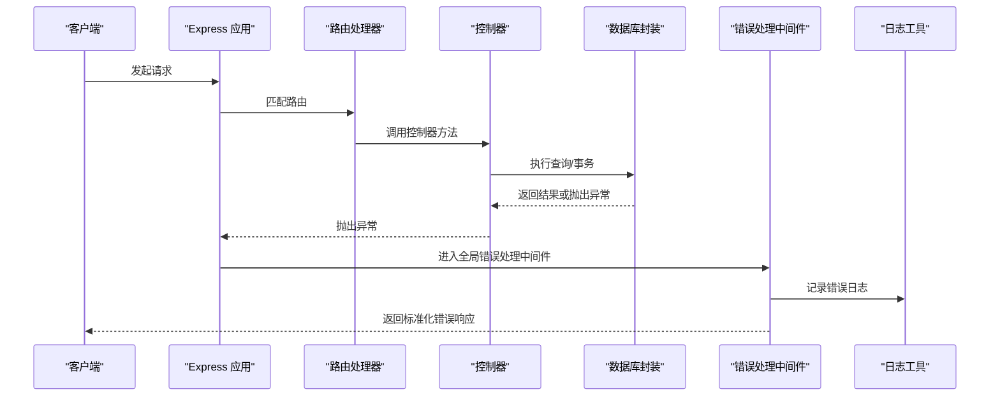
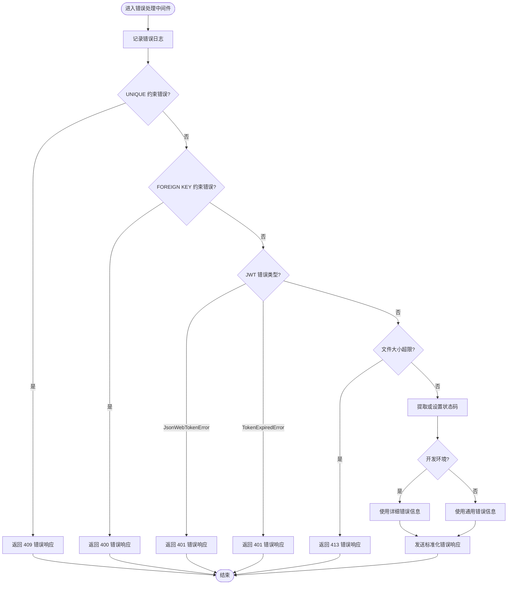
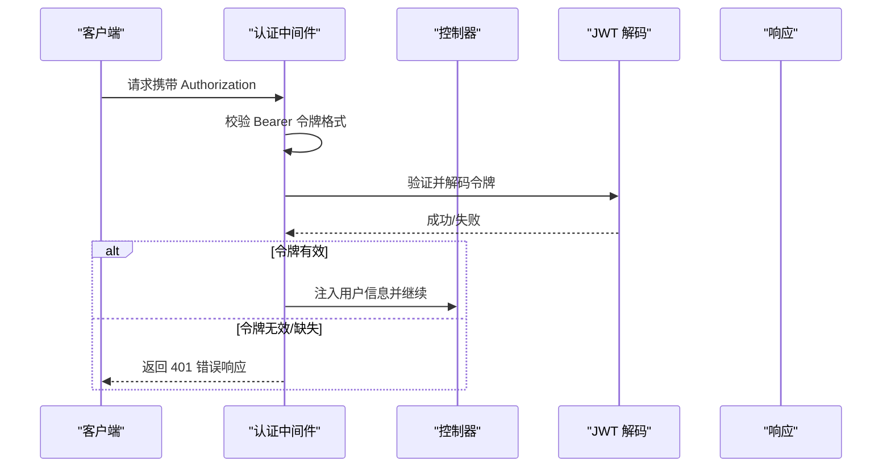
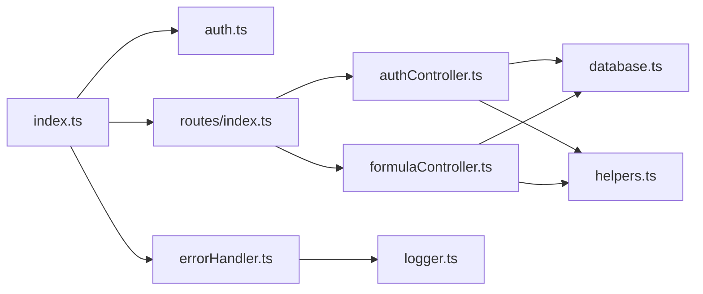

# 错误处理中间件

<cite>
**本文引用的文件**
- [errorHandler.ts](file://backend/src/middleware/errorHandler.ts)
- [logger.ts](file://backend/src/utils/logger.ts)
- [index.ts](file://backend/src/index.ts)
- [auth.ts](file://backend/src/middleware/auth.ts)
- [authController.ts](file://backend/src/controllers/authController.ts)
- [formulaController.ts](file://backend/src/controllers/formulaController.ts)
- [database.ts](file://backend/src/config/database.ts)
- [helpers.ts](file://backend/src/utils/helpers.ts)
- [index.ts](file://backend/src/routes/index.ts)
</cite>

## 目录
1. [简介](#简介)
2. [项目结构](#项目结构)
3. [核心组件](#核心组件)
4. [架构总览](#架构总览)
5. [详细组件分析](#详细组件分析)
6. [依赖关系分析](#依赖关系分析)
7. [性能考量](#性能考量)
8. [故障排查指南](#故障排查指南)
9. [结论](#结论)

## 简介
本文件系统性阐述后端应用的全局错误处理机制，覆盖同步与异步错误的捕获策略、错误中间件的执行时机与在 Express 应用中的位置、错误对象的标准化格式、不同错误类型的处理策略与响应格式、错误日志记录最佳实践与调试技巧，并给出在控制器中抛出自定义错误与在中间件中统一处理的实践方法。该体系通过统一的错误处理中间件，确保所有未捕获异常被规范化输出，同时保留开发环境下的详细错误信息以便调试。

## 项目结构
后端采用模块化分层设计：
- 中间件层：认证中间件与全局错误处理中间件
- 控制器层：各业务控制器负责具体业务逻辑与错误响应
- 工具层：日志工具、通用工具函数
- 配置层：数据库连接与配置
- 入口层：应用启动与路由挂载

图表来源
- [index.ts:13-61](file://backend/src/index.ts#L13-L61)
- [auth.ts:13-31](file://backend/src/middleware/auth.ts#L13-L31)
- [errorHandler.ts:5-50](file://backend/src/middleware/errorHandler.ts#L5-L50)
- [authController.ts:8-89](file://backend/src/controllers/authController.ts#L8-L89)
- [formulaController.ts:6-287](file://backend/src/controllers/formulaController.ts#L6-L287)
- [logger.ts:24-39](file://backend/src/utils/logger.ts#L24-L39)
- [helpers.ts:26-51](file://backend/src/utils/helpers.ts#L26-L51)
- [database.ts:44-61](file://backend/src/config/database.ts#L44-L61)

章节来源
- [index.ts:13-61](file://backend/src/index.ts#L13-L61)
- [routes/index.ts:11-23](file://backend/src/routes/index.ts#L11-L23)

## 核心组件
- 全局错误处理中间件：统一捕获未处理异常，按类型映射到标准 HTTP 状态码与响应体；记录错误日志；在开发环境下输出详细错误信息。
- 日志工具：提供 info/warn/error/debug 四级日志，支持时间戳与彩色输出；debug 日志仅在开发环境生效。
- 认证中间件：验证 JWT 令牌有效性，失败时直接返回标准错误响应，避免进入后续业务逻辑。
- 数据库封装：提供 query 与 transaction 封装，异常向上抛出，交由全局错误处理中间件统一处理。
- 控制器：在业务逻辑中进行条件判断与错误响应；对于未捕获异常，交由全局中间件处理。

章节来源
- [errorHandler.ts:5-50](file://backend/src/middleware/errorHandler.ts#L5-L50)
- [logger.ts:24-39](file://backend/src/utils/logger.ts#L24-L39)
- [auth.ts:13-31](file://backend/src/middleware/auth.ts#L13-L31)
- [database.ts:44-61](file://backend/src/config/database.ts#L44-L61)
- [authController.ts:8-89](file://backend/src/controllers/authController.ts#L8-L89)
- [formulaController.ts:6-287](file://backend/src/controllers/formulaController.ts#L6-L287)

## 架构总览
全局错误处理中间件位于路由之后、404 处理之前，作为最后一个中间件拦截所有未处理异常。其执行流程如下：
- 记录错误日志
- 匹配特定错误类型（如 SQLite 约束错误、JWT 错误、文件大小限制等）
- 使用错误对象上的状态码或默认 500
- 在开发环境输出详细错误信息，在生产环境输出通用提示

图表来源
- [index.ts:47-48](file://backend/src/index.ts#L47-L48)
- [errorHandler.ts:11-49](file://backend/src/middleware/errorHandler.ts#L11-L49)
- [database.ts:26-28](file://backend/src/config/database.ts#L26-L28)

## 详细组件分析

### 全局错误处理中间件
- 执行时机：Express 应用中最后注册，确保所有路由与控制器抛出的异常均能被捕获。
- 错误类型匹配：
  - SQLite UNIQUE/FOREIGN KEY 约束错误：映射到 409/400
  - JWT 错误（JsonWebTokenError/TokenExpiredError）：映射到 401
  - 文件大小超限（LIMIT_FILE_SIZE）：映射到 413
  - 其他错误：使用错误对象上的 statusCode 或默认 500
- 响应格式：统一返回 { success: false, message: string }，开发环境可显示详细错误信息。
- 日志记录：使用日志工具记录错误消息，便于追踪。

图表来源
- [errorHandler.ts:11-49](file://backend/src/middleware/errorHandler.ts#L11-L49)

章节来源
- [errorHandler.ts:5-50](file://backend/src/middleware/errorHandler.ts#L5-L50)

### 认证中间件
- 作用：校验 Authorization 头中的 Bearer 令牌，解码后注入到请求对象，供后续控制器使用。
- 错误处理：若缺少令牌或令牌无效/过期，直接返回 401 错误响应，不进入控制器逻辑。
- 与全局错误处理的关系：认证阶段的错误不会进入全局中间件，因为中间件内已直接响应。

图表来源
- [auth.ts:13-31](file://backend/src/middleware/auth.ts#L13-L31)

章节来源
- [auth.ts:13-31](file://backend/src/middleware/auth.ts#L13-L31)

### 控制器中的错误处理策略
- 同步错误：在 try/catch 中捕获并返回标准化错误响应；开发环境可附加错误详情。
- 异步错误：在 async 方法中捕获 Promise 拒绝或异常，返回标准化错误响应。
- 业务错误：根据业务规则返回 4xx 状态码与明确的消息（如用户名已存在、业务员不存在等）。
- 未捕获异常：交由全局错误处理中间件统一处理。

示例路径
- [authController.ts:36-38](file://backend/src/controllers/authController.ts#L36-L38)
- [formulaController.ts:66-68](file://backend/src/controllers/formulaController.ts#L66-L68)

章节来源
- [authController.ts:8-89](file://backend/src/controllers/authController.ts#L8-L89)
- [formulaController.ts:6-287](file://backend/src/controllers/formulaController.ts#L6-L287)

### 数据库封装与错误传播
- query 函数封装了 SQLite 查询，SELECT 返回行数组，其他语句返回运行结果。
- getDb 在未初始化时抛出错误，交由全局中间件处理。
- connectDatabase 捕获连接异常并记录日志，随后重新抛出，确保错误不被吞掉。

示例路径
- [database.ts:32-37](file://backend/src/config/database.ts#L32-L37)
- [database.ts:44-55](file://backend/src/config/database.ts#L44-L55)
- [database.ts:10-30](file://backend/src/config/database.ts#L10-L30)

章节来源
- [database.ts:10-70](file://backend/src/config/database.ts#L10-L70)

### 日志工具与调试
- 提供 info/warn/error/debug 四级日志，支持时间戳与彩色输出。
- debug 日志仅在开发环境启用，便于本地调试。
- 全局错误处理中间件与数据库连接处均使用日志工具记录关键事件。

示例路径
- [logger.ts:24-39](file://backend/src/utils/logger.ts#L24-L39)
- [errorHandler.ts:11](file://backend/src/middleware/errorHandler.ts#L11)
- [database.ts:25-28](file://backend/src/config/database.ts#L25-L28)

章节来源
- [logger.ts:1-40](file://backend/src/utils/logger.ts#L1-L40)
- [errorHandler.ts:11-11](file://backend/src/middleware/errorHandler.ts#L11)
- [database.ts:25-28](file://backend/src/config/database.ts#L25-L28)

## 依赖关系分析
- 应用入口在 index.ts 中注册全局中间件与路由，确保错误处理中间件位于路由之后。
- 控制器依赖数据库封装与通用工具函数，异常通过调用链向上传播至全局中间件。
- 认证中间件独立于全局错误处理，直接在中间件阶段返回错误响应。
- 错误处理中间件依赖日志工具进行错误记录。

图表来源
- [index.ts:47-48](file://backend/src/index.ts#L47-L48)
- [routes/index.ts:11-23](file://backend/src/routes/index.ts#L11-L23)
- [authController.ts:8-89](file://backend/src/controllers/authController.ts#L8-L89)
- [formulaController.ts:6-287](file://backend/src/controllers/formulaController.ts#L6-L287)
- [database.ts:44-61](file://backend/src/config/database.ts#L44-L61)
- [helpers.ts:26-51](file://backend/src/utils/helpers.ts#L26-L51)
- [errorHandler.ts:11-49](file://backend/src/middleware/errorHandler.ts#L11-L49)
- [logger.ts:24-39](file://backend/src/utils/logger.ts#L24-L39)

章节来源
- [index.ts:13-61](file://backend/src/index.ts#L13-L61)
- [routes/index.ts:11-23](file://backend/src/routes/index.ts#L11-L23)

## 性能考量
- 错误处理中间件应尽量保持轻量，避免在错误路径上执行耗时操作。
- 开发环境输出详细错误信息有助于调试，但生产环境建议隐藏敏感细节。
- 对于频繁发生的业务错误（如 400/401），应优先在中间件或控制器早期返回，减少不必要的数据库访问。

## 故障排查指南
- 未捕获异常：检查全局错误处理中间件是否正确注册在路由之后；确认数据库连接是否正常；查看日志工具输出。
- SQLite 约束冲突：关注 UNIQUE/FOREIGN KEY 约束错误的映射，定位具体字段与业务规则。
- JWT 问题：确认令牌格式与签名密钥；检查过期时间；在认证中间件阶段即可发现令牌无效或过期。
- 文件上传限制：当出现文件大小超限时，检查中间件配置与前端上传大小限制。
- 开发调试：开启 debug 日志，结合浏览器网络面板与后端日志定位问题。

章节来源
- [errorHandler.ts:11-49](file://backend/src/middleware/errorHandler.ts#L11-L49)
- [auth.ts:13-31](file://backend/src/middleware/auth.ts#L13-L31)
- [logger.ts:24-39](file://backend/src/utils/logger.ts#L24-L39)

## 结论
本项目的错误处理体系通过“认证中间件前置 + 全局错误处理中间件兜底”的方式，实现了对同步与异步错误的统一捕获与标准化响应。配合日志工具与开发环境的调试能力，既能保证生产环境的安全与稳定，又能在开发阶段快速定位问题。建议在后续迭代中：
- 明确业务错误码与消息规范，增强前后端一致性
- 对高频错误场景增加更细粒度的分类与响应
- 在控制器中引入统一的错误包装类，提升可维护性