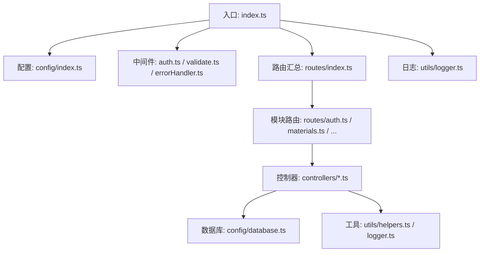
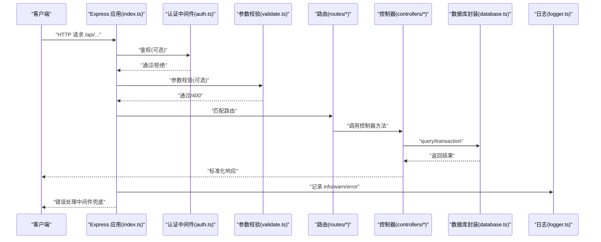
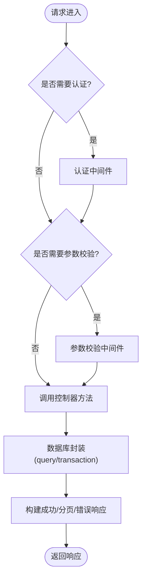
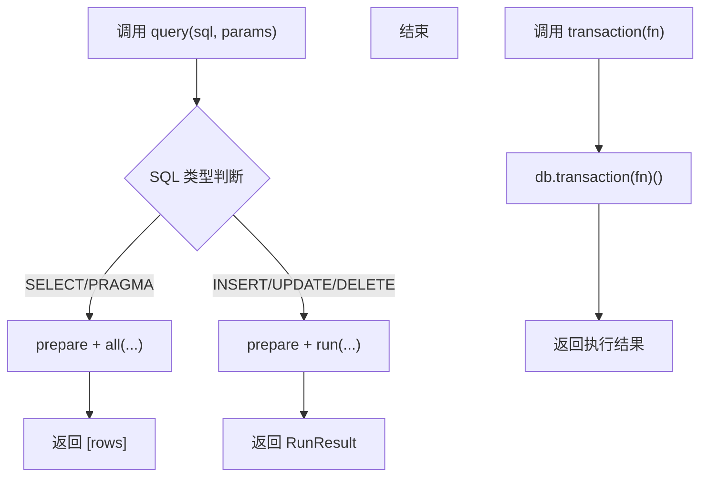
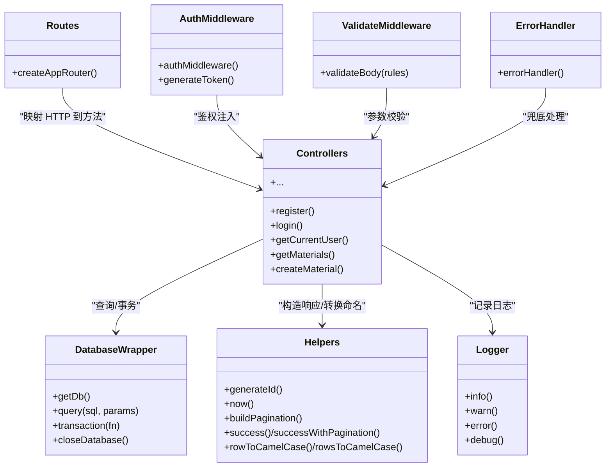
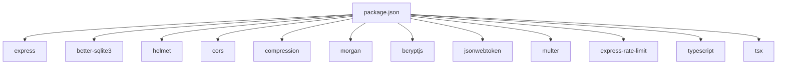

# 后端开发指南

<cite>
**本文档引用的文件**
- [backend/src/index.ts](file://backend/src/index.ts)
- [backend/src/config/index.ts](file://backend/src/config/index.ts)
- [backend/src/config/database.ts](file://backend/src/config/database.ts)
- [backend/src/utils/logger.ts](file://backend/src/utils/logger.ts)
- [backend/src/utils/helpers.ts](file://backend/src/utils/helpers.ts)
- [backend/src/middleware/auth.ts](file://backend/src/middleware/auth.ts)
- [backend/src/middleware/errorHandler.ts](file://backend/src/middleware/errorHandler.ts)
- [backend/src/middleware/validate.ts](file://backend/src/middleware/validate.ts)
- [backend/src/routes/index.ts](file://backend/src/routes/index.ts)
- [backend/src/routes/auth.ts](file://backend/src/routes/auth.ts)
- [backend/src/routes/materials.ts](file://backend/src/routes/materials.ts)
- [backend/src/controllers/authController.ts](file://backend/src/controllers/authController.ts)
- [backend/src/controllers/materialController.ts](file://backend/src/controllers/materialController.ts)
- [backend/API_DOC.md](file://backend/API_DOC.md)
- [backend/DATABASE_DOC.md](file://backend/DATABASE_DOC.md)
- [backend/package.json](file://backend/package.json)
</cite>

## 目录
1. [简介](#简介)
2. [项目结构](#项目结构)
3. [核心组件](#核心组件)
4. [架构总览](#架构总览)
5. [详细组件分析](#详细组件分析)
6. [依赖关系分析](#依赖关系分析)
7. [性能考虑](#性能考虑)
8. [故障排查指南](#故障排查指南)
9. [结论](#结论)
10. [附录](#附录)

## 简介
本指南面向 TingStudio 后端开发者，系统讲解基于 Express 的应用配置与启动流程、中间件体系、路由组织与控制器设计模式；深入说明数据库连接与 better-sqlite3 使用、查询封装与事务支持；阐述 MVC 架构在本项目中的落地实践；给出 API 设计规范、错误处理机制与日志记录策略，并提供最佳实践与扩展建议。

## 项目结构
后端采用 TypeScript + Express + better-sqlite3 的技术栈，遵循“配置-中间件-路由-控制器-工具-数据库”的分层组织方式。核心入口负责初始化服务、加载中间件、挂载路由与错误处理；配置模块集中管理数据库、JWT、上传、CORS 等参数；数据库层提供连接、查询、事务与关闭能力；工具层提供日志、通用辅助方法；中间件层提供认证、参数校验与全局错误处理；路由层按模块拆分；控制器层实现具体业务逻辑。

图表来源
- [backend/src/index.ts:1-61](file://backend/src/index.ts#L1-L61)
- [backend/src/config/index.ts:1-24](file://backend/src/config/index.ts#L1-L24)
- [backend/src/config/database.ts:1-70](file://backend/src/config/database.ts#L1-L70)
- [backend/src/utils/logger.ts:1-40](file://backend/src/utils/logger.ts#L1-L40)
- [backend/src/utils/helpers.ts:1-86](file://backend/src/utils/helpers.ts#L1-L86)
- [backend/src/middleware/auth.ts:1-38](file://backend/src/middleware/auth.ts#L1-L38)
- [backend/src/middleware/validate.ts:1-68](file://backend/src/middleware/validate.ts#L1-L68)
- [backend/src/middleware/errorHandler.ts:1-51](file://backend/src/middleware/errorHandler.ts#L1-L51)
- [backend/src/routes/index.ts:1-24](file://backend/src/routes/index.ts#L1-L24)
- [backend/src/routes/auth.ts:1-20](file://backend/src/routes/auth.ts#L1-L20)
- [backend/src/routes/materials.ts:1-22](file://backend/src/routes/materials.ts#L1-L22)

章节来源
- [backend/src/index.ts:1-61](file://backend/src/index.ts#L1-L61)
- [backend/src/config/index.ts:1-24](file://backend/src/config/index.ts#L1-L24)
- [backend/src/config/database.ts:1-70](file://backend/src/config/database.ts#L1-L70)
- [backend/src/utils/logger.ts:1-40](file://backend/src/utils/logger.ts#L1-L40)
- [backend/src/utils/helpers.ts:1-86](file://backend/src/utils/helpers.ts#L1-L86)
- [backend/src/middleware/auth.ts:1-38](file://backend/src/middleware/auth.ts#L1-L38)
- [backend/src/middleware/validate.ts:1-68](file://backend/src/middleware/validate.ts#L1-L68)
- [backend/src/middleware/errorHandler.ts:1-51](file://backend/src/middleware/errorHandler.ts#L1-L51)
- [backend/src/routes/index.ts:1-24](file://backend/src/routes/index.ts#L1-L24)
- [backend/src/routes/auth.ts:1-20](file://backend/src/routes/auth.ts#L1-L20)
- [backend/src/routes/materials.ts:1-22](file://backend/src/routes/materials.ts#L1-L22)

## 核心组件
- 应用入口与启动
  - 初始化 Express 实例，设置端口与环境变量
  - 加载全局中间件：安全头、CORS、压缩、日志、JSON 解析、静态资源
  - 连接数据库、挂载路由前缀、健康检查、404 与错误处理
  - 启动服务并记录启动日志
- 配置中心
  - 统一读取环境变量，提供数据库路径、JWT 密钥与过期时间、上传目录与大小限制、CORS 源等
- 数据库层
  - better-sqlite3 连接、WAL 模式、外键约束启用
  - 查询封装 query：自动识别 SELECT/INSERT/UPDATE/DELETE 并返回统一结构
  - 事务封装 transaction：简化多语句一致性
  - 连接生命周期管理与关闭
- 中间件体系
  - 认证中间件：从 Authorization 头提取 Bearer Token，解码并注入用户信息
  - 参数校验中间件：声明式规则校验请求体字段类型、长度、范围与必填
  - 全局错误处理：针对 SQLite 约束、JWT、文件大小与默认异常进行分类处理
- 路由与控制器
  - 路由按模块拆分，统一挂载到 /api 前缀
  - 控制器聚焦业务逻辑，调用数据库封装与工具函数，返回标准化响应
- 工具与日志
  - 日志：统一格式化输出，支持 info/warn/error/debug
  - 辅助：ID 生成、时间戳、分页、LIKE 条件、命名转换、JSON 安全解析

章节来源
- [backend/src/index.ts:13-55](file://backend/src/index.ts#L13-L55)
- [backend/src/config/index.ts:2-23](file://backend/src/config/index.ts#L2-L23)
- [backend/src/config/database.ts:10-70](file://backend/src/config/database.ts#L10-L70)
- [backend/src/middleware/auth.ts:13-37](file://backend/src/middleware/auth.ts#L13-L37)
- [backend/src/middleware/validate.ts:16-67](file://backend/src/middleware/validate.ts#L16-L67)
- [backend/src/middleware/errorHandler.ts:5-50](file://backend/src/middleware/errorHandler.ts#L5-L50)
- [backend/src/routes/index.ts:11-23](file://backend/src/routes/index.ts#L11-L23)
- [backend/src/utils/logger.ts:24-39](file://backend/src/utils/logger.ts#L24-L39)
- [backend/src/utils/helpers.ts:3-85](file://backend/src/utils/helpers.ts#L3-L85)

## 架构总览
下图展示从客户端请求到数据库访问的完整链路，以及各层之间的依赖关系。

图表来源
- [backend/src/index.ts:20-48](file://backend/src/index.ts#L20-L48)
- [backend/src/middleware/auth.ts:13-31](file://backend/src/middleware/auth.ts#L13-L31)
- [backend/src/middleware/validate.ts:16-67](file://backend/src/middleware/validate.ts#L16-L67)
- [backend/src/routes/index.ts:11-23](file://backend/src/routes/index.ts#L11-L23)
- [backend/src/controllers/authController.ts:9-39](file://backend/src/controllers/authController.ts#L9-L39)
- [backend/src/config/database.ts:44-61](file://backend/src/config/database.ts#L44-L61)
- [backend/src/utils/logger.ts:24-39](file://backend/src/utils/logger.ts#L24-L39)

## 详细组件分析

### 应用启动与中间件系统
- 启动流程
  - 读取端口与环境变量，连接数据库
  - 注册安全中间件（Helmet）、跨域（CORS）、压缩（Compression）
  - 注册日志中间件（Morgan）、JSON/URL 编码解析、静态资源
  - 挂载 /api 路由与健康检查 /health
  - 404 与全局错误处理中间件
  - 启动监听并记录日志
- 中间件职责
  - 认证中间件：校验 Bearer Token，注入用户信息
  - 参数校验中间件：基于规则集进行字段类型、长度、范围与必填校验
  - 错误处理中间件：区分 SQLite 约束、JWT、文件大小与默认异常，返回统一格式

章节来源
- [backend/src/index.ts:13-55](file://backend/src/index.ts#L13-L55)
- [backend/src/middleware/auth.ts:13-37](file://backend/src/middleware/auth.ts#L13-L37)
- [backend/src/middleware/validate.ts:16-67](file://backend/src/middleware/validate.ts#L16-L67)
- [backend/src/middleware/errorHandler.ts:5-50](file://backend/src/middleware/errorHandler.ts#L5-L50)

### 路由组织与控制器设计模式
- 路由组织
  - 路由汇总函数统一挂载各模块路由
  - 模块路由按需引入认证中间件与控制器
- 控制器设计模式
  - 控制器只做“编排”：接收请求、调用数据库封装、调用工具函数、返回标准化响应
  - 统一的成功响应与分页响应构建
  - 对外暴露纯异步函数，便于路由直接绑定

图表来源
- [backend/src/routes/index.ts:11-23](file://backend/src/routes/index.ts#L11-L23)
- [backend/src/routes/auth.ts:9-19](file://backend/src/routes/auth.ts#L9-L19)
- [backend/src/routes/materials.ts:9-21](file://backend/src/routes/materials.ts#L9-L21)
- [backend/src/controllers/authController.ts:9-39](file://backend/src/controllers/authController.ts#L9-L39)
- [backend/src/controllers/materialController.ts:6-38](file://backend/src/controllers/materialController.ts#L6-L38)
- [backend/src/config/database.ts:44-61](file://backend/src/config/database.ts#L44-L61)
- [backend/src/utils/helpers.ts:26-51](file://backend/src/utils/helpers.ts#L26-L51)

章节来源
- [backend/src/routes/index.ts:11-23](file://backend/src/routes/index.ts#L11-L23)
- [backend/src/routes/auth.ts:1-20](file://backend/src/routes/auth.ts#L1-L20)
- [backend/src/routes/materials.ts:1-22](file://backend/src/routes/materials.ts#L1-L22)
- [backend/src/controllers/authController.ts:1-89](file://backend/src/controllers/authController.ts#L1-L89)
- [backend/src/controllers/materialController.ts:1-129](file://backend/src/controllers/materialController.ts#L1-L129)
- [backend/src/utils/helpers.ts:26-51](file://backend/src/utils/helpers.ts#L26-L51)

### 数据库连接与查询封装
- 连接管理
  - 自动创建数据目录，初始化 better-sqlite3 实例
  - 启用 WAL 模式与外键约束
  - 提供连接获取与关闭方法
- 查询封装
  - 自动识别 SQL 类型（SELECT/PRAGMA vs 其他）
  - SELECT 返回 [rows] 结构，兼容 mysql2 的解构风格
  - INSERT/UPDATE/DELETE 返回 RunResult（包含 changes、lastInsertRowid）
- 事务封装
  - 包装事务执行，保证多语句一致性

图表来源
- [backend/src/config/database.ts:44-61](file://backend/src/config/database.ts#L44-L61)

章节来源
- [backend/src/config/database.ts:10-70](file://backend/src/config/database.ts#L10-L70)

### MVC 在后端的具体实现
- Model（模型）
  - 通过数据库封装抽象 SQL 访问，提供 query/transaction
  - 数据库层不暴露具体 SQL，避免控制器直连底层
- View（视图）
  - 本项目为 API 服务，无传统视图层；响应体即“视图”
- Controller（控制器）
  - 聚合业务逻辑：参数校验、调用数据库、组装响应
  - 保持无状态、纯函数式设计，便于测试与复用
- Middleware（中间件）
  - 认证、参数校验、错误处理贯穿请求生命周期
- Route（路由）
  - 将 HTTP 动作映射到控制器方法，统一前缀与错误处理

图表来源
- [backend/src/config/database.ts:32-61](file://backend/src/config/database.ts#L32-L61)
- [backend/src/utils/helpers.ts:3-85](file://backend/src/utils/helpers.ts#L3-L85)
- [backend/src/utils/logger.ts:24-39](file://backend/src/utils/logger.ts#L24-L39)
- [backend/src/middleware/auth.ts:13-37](file://backend/src/middleware/auth.ts#L13-L37)
- [backend/src/middleware/validate.ts:16-67](file://backend/src/middleware/validate.ts#L16-L67)
- [backend/src/middleware/errorHandler.ts:5-50](file://backend/src/middleware/errorHandler.ts#L5-L50)
- [backend/src/routes/index.ts:11-23](file://backend/src/routes/index.ts#L11-L23)
- [backend/src/controllers/authController.ts:9-89](file://backend/src/controllers/authController.ts#L9-L89)
- [backend/src/controllers/materialController.ts:6-129](file://backend/src/controllers/materialController.ts#L6-L129)

章节来源
- [backend/src/config/database.ts:32-61](file://backend/src/config/database.ts#L32-L61)
- [backend/src/utils/helpers.ts:3-85](file://backend/src/utils/helpers.ts#L3-L85)
- [backend/src/utils/logger.ts:24-39](file://backend/src/utils/logger.ts#L24-L39)
- [backend/src/middleware/auth.ts:13-37](file://backend/src/middleware/auth.ts#L13-L37)
- [backend/src/middleware/validate.ts:16-67](file://backend/src/middleware/validate.ts#L16-L67)
- [backend/src/middleware/errorHandler.ts:5-50](file://backend/src/middleware/errorHandler.ts#L5-L50)
- [backend/src/routes/index.ts:11-23](file://backend/src/routes/index.ts#L11-L23)
- [backend/src/controllers/authController.ts:1-89](file://backend/src/controllers/authController.ts#L1-L89)
- [backend/src/controllers/materialController.ts:1-129](file://backend/src/controllers/materialController.ts#L1-L129)

### API 设计规范与错误处理
- 统一响应结构
  - 成功：success=true，message，data
  - 分页：data.list + data.pagination
  - 错误：success=false，message，errors（参数校验时）
- 统一错误码
  - 200/201/400/401/404/409/410/413/500
- 错误处理策略
  - SQLite 唯一约束冲突 -> 409
  - 外键约束失败 -> 400
  - JWT 无效/过期 -> 401
  - 文件过大 -> 413
  - 默认 -> 500
- 日志策略
  - info/warn/error/debug 分级输出，开发环境开启 debug
  - 记录启动信息、错误堆栈与关键业务事件

章节来源
- [backend/API_DOC.md:18-71](file://backend/API_DOC.md#L18-L71)
- [backend/src/middleware/errorHandler.ts:13-50](file://backend/src/middleware/errorHandler.ts#L13-L50)
- [backend/src/utils/logger.ts:24-39](file://backend/src/utils/logger.ts#L24-L39)

## 依赖关系分析
- 运行时依赖
  - Express、better-sqlite3、helmet、cors、compression、morgan、bcryptjs、jsonwebtoken、multer、express-rate-limit
- 开发时依赖
  - TypeScript、tsx、@types/* 等
- 启动脚本
  - dev：tsx 监听热重载
  - build：tsc 编译
  - start：node dist/index.js
  - init-db/seed/import-nutrition：数据库初始化与数据导入

图表来源
- [backend/package.json:14-40](file://backend/package.json#L14-L40)

章节来源
- [backend/package.json:6-12](file://backend/package.json#L6-L12)
- [backend/package.json:14-40](file://backend/package.json#L14-L40)

## 性能考虑
- 数据库
  - WAL 模式提升并发写入性能
  - 外键约束保障一致性但可能影响写入性能，建议在批量导入时临时禁用并回滚启用
  - 为高频查询字段建立索引（如原料名称、编码、业务员状态等）
- 传输与网络
  - 启用 Compression 减少带宽
  - Morgan 日志在生产环境建议调整级别
- 业务优化
  - 分页默认 20，最大 100，避免一次性返回过多数据
  - JSON 字段查询使用 LIKE 模糊匹配时注意索引与性能
  - 批量导入场景使用事务包裹，减少提交次数

## 故障排查指南
- 启动失败
  - 检查数据库路径是否存在且可写
  - 查看日志中“服务启动失败”与错误堆栈
- 认证失败
  - 确认 Authorization 头格式为 Bearer Token
  - 检查 JWT 密钥与过期时间配置
- 参数校验失败
  - 根据返回的 errors 数组定位字段与规则
- 数据库约束冲突
  - 唯一约束冲突（409）：检查重复键（用户名、原料编码等）
  - 外键约束失败（400）：检查关联实体是否存在
- 文件大小超限
  - 检查上传大小限制与前端上传配置

章节来源
- [backend/src/index.ts:57-60](file://backend/src/index.ts#L57-L60)
- [backend/src/middleware/errorHandler.ts:13-50](file://backend/src/middleware/errorHandler.ts#L13-L50)
- [backend/src/middleware/auth.ts:13-31](file://backend/src/middleware/auth.ts#L13-L31)
- [backend/src/middleware/validate.ts:16-67](file://backend/src/middleware/validate.ts#L16-L67)

## 结论
本项目以清晰的分层与严格的中间件体系实现了高内聚低耦合的后端架构。通过 better-sqlite3 的查询封装与事务支持，结合统一的 API 响应与错误处理策略，既满足了快速迭代的需求，也为后续扩展打下了坚实基础。建议在生产环境中进一步完善监控、限流与备份策略，并持续优化数据库索引与查询性能。

## 附录
- 数据库设计与 ER 关系
  - 参考 DATABASE_DOC.md，了解 13 张表的字段、索引、外键与业务含义
- API 接口清单与示例
  - 参考 API_DOC.md，涵盖认证、原料、配方、业务员、版本、导出、营养等模块

章节来源
- [backend/DATABASE_DOC.md:1-454](file://backend/DATABASE_DOC.md#L1-L454)
- [backend/API_DOC.md:1-688](file://backend/API_DOC.md#L1-L688)