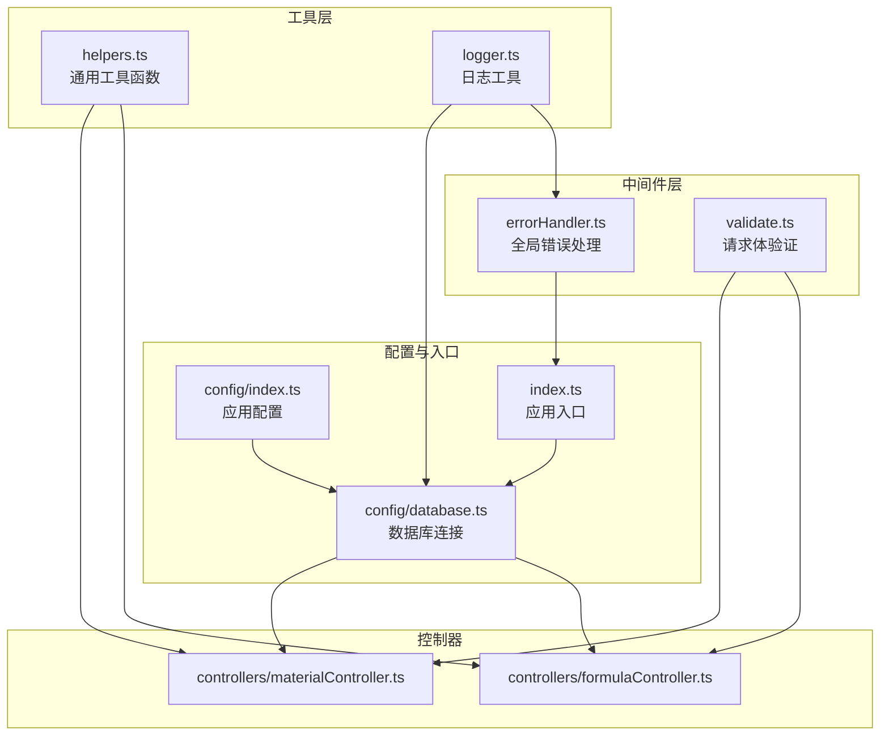
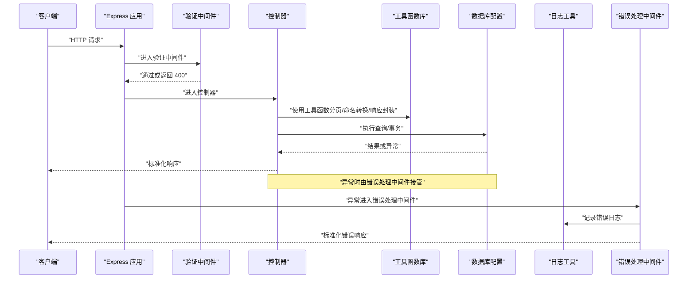
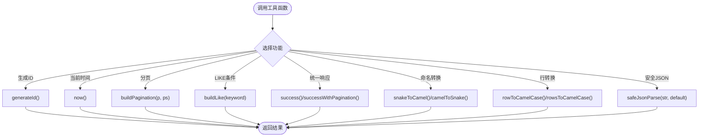
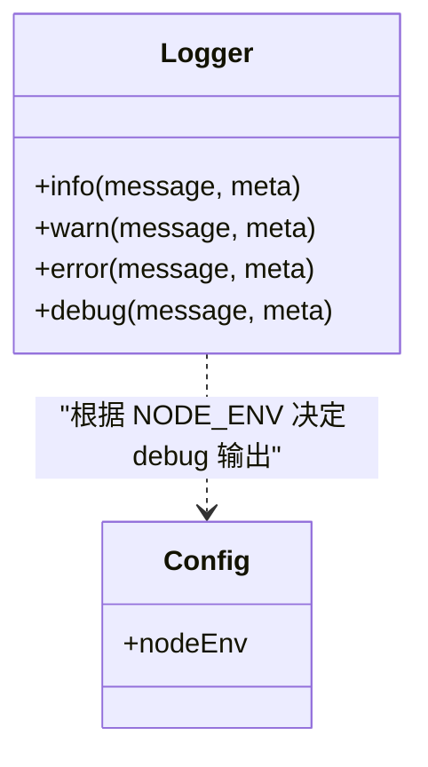
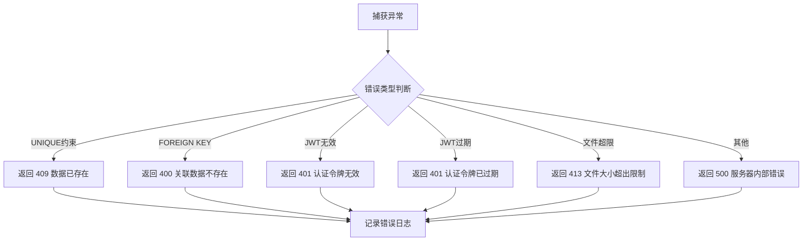
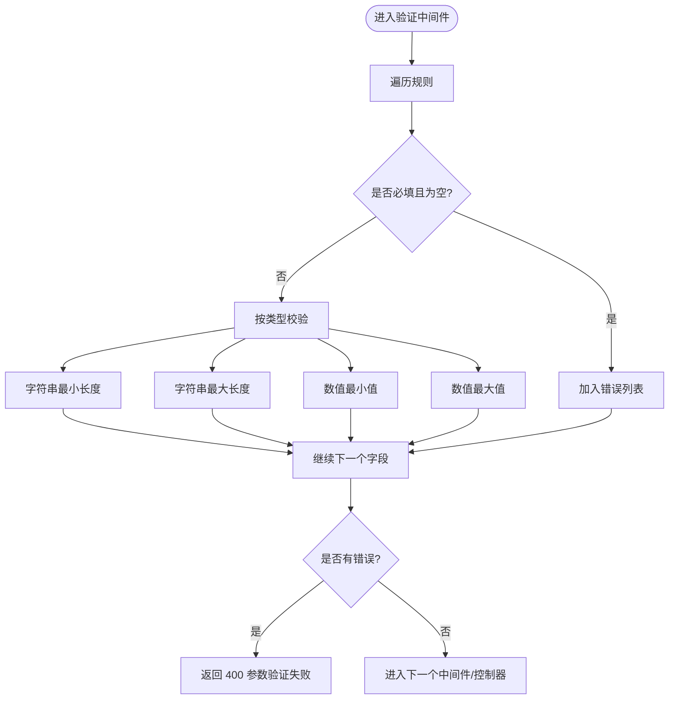
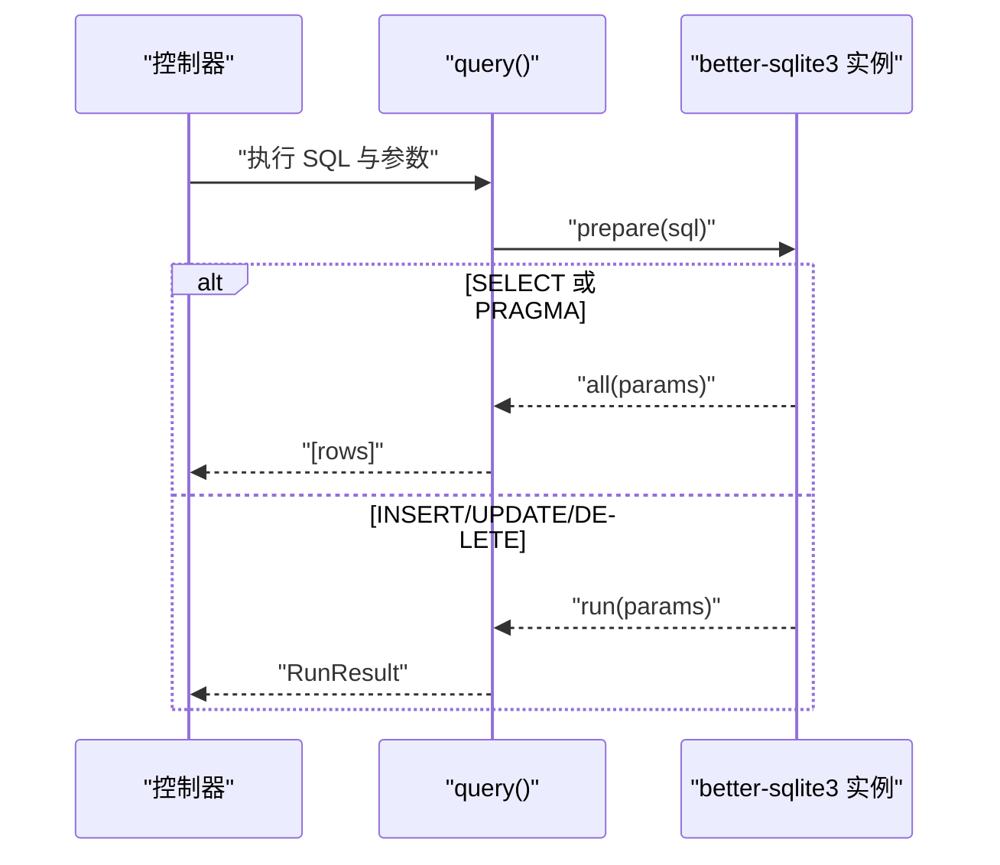
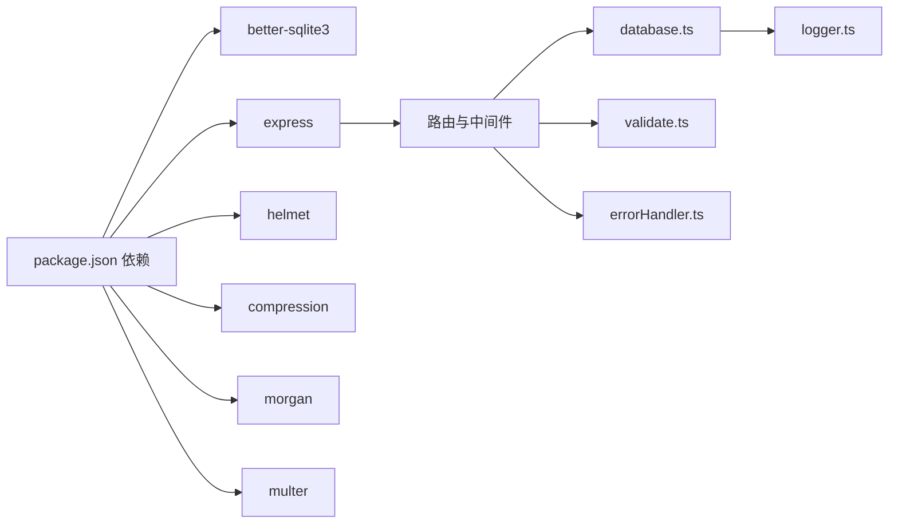

# 工具服务

<cite>
**本文档引用的文件**
- [helpers.ts](file://backend/src/utils/helpers.ts)
- [logger.ts](file://backend/src/utils/logger.ts)
- [errorHandler.ts](file://backend/src/middleware/errorHandler.ts)
- [validate.ts](file://backend/src/middleware/validate.ts)
- [database.ts](file://backend/src/config/database.ts)
- [index.ts](file://backend/src/index.ts)
- [materialController.ts](file://backend/src/controllers/materialController.ts)
- [formulaController.ts](file://backend/src/controllers/formulaController.ts)
- [index.ts](file://backend/src/config/index.ts)
- [package.json](file://backend/package.json)
- [tsconfig.json](file://backend/tsconfig.json)
- [timeFormat.ts](file://frontend/src/utils/timeFormat.ts)
- [mockData.ts](file://frontend/src/utils/mockData.ts)
</cite>

## 目录
1. [简介](#简介)
2. [项目结构](#项目结构)
3. [核心组件](#核心组件)
4. [架构总览](#架构总览)
5. [详细组件分析](#详细组件分析)
6. [依赖分析](#依赖分析)
7. [性能考虑](#性能考虑)
8. [故障排查指南](#故障排查指南)
9. [结论](#结论)
10. [附录](#附录)

## 简介
本文件系统性梳理后端工具服务的设计与使用，覆盖以下方面：
- 工具函数库：数据处理、格式转换、通用算法
- 日志记录系统：配置、级别、输出格式与文件管理
- 错误处理与数据验证：中间件与通用策略
- 使用示例、性能考量与扩展建议
- 最佳实践与常见问题解决方案

工具服务在后端以“工具模块 + 中间件 + 控制器”的方式贯穿应用，既保证了可复用性，也确保了横切关注点的一致性。

## 项目结构
后端工具服务主要位于 backend/src/utils 与 backend/src/middleware，并通过配置、数据库与控制器进行集成。

图表来源
- [helpers.ts:1-86](file://backend/src/utils/helpers.ts#L1-L86)
- [logger.ts:1-40](file://backend/src/utils/logger.ts#L1-L40)
- [errorHandler.ts:1-51](file://backend/src/middleware/errorHandler.ts#L1-L51)
- [validate.ts:1-68](file://backend/src/middleware/validate.ts#L1-L68)
- [database.ts:1-70](file://backend/src/config/database.ts#L1-L70)
- [index.ts:1-61](file://backend/src/index.ts#L1-L61)

章节来源
- [index.ts:1-61](file://backend/src/index.ts#L1-L61)
- [package.json:1-42](file://backend/package.json#L1-L42)
- [tsconfig.json:1-25](file://backend/tsconfig.json#L1-L25)

## 核心组件
- 通用工具函数库：提供 ID 生成、时间格式化、分页构建、SQL LIKE 条件构造、统一响应封装、命名风格转换、批量行转换、安全 JSON 解析等能力。
- 日志工具：支持 info/warn/error/debug 四级日志，带时间戳与颜色输出；开发环境才输出 debug。
- 错误处理中间件：集中捕获异常，识别 SQLite 约束、JWT、文件大小等错误并返回标准化响应。
- 数据验证中间件：基于规则对请求体字段进行类型、长度、范围与必填校验。
- 数据库配置：SQLite 连接、WAL 模式、外键约束、查询封装与事务执行。
- 应用入口：加载 dotenv、注册中间件、路由与静态资源、健康检查与错误处理。

章节来源
- [helpers.ts:1-86](file://backend/src/utils/helpers.ts#L1-L86)
- [logger.ts:1-40](file://backend/src/utils/logger.ts#L1-L40)
- [errorHandler.ts:1-51](file://backend/src/middleware/errorHandler.ts#L1-L51)
- [validate.ts:1-68](file://backend/src/middleware/validate.ts#L1-L68)
- [database.ts:1-70](file://backend/src/config/database.ts#L1-L70)
- [index.ts:1-61](file://backend/src/index.ts#L1-L61)

## 架构总览
工具服务在运行时的交互关系如下：

图表来源
- [validate.ts:16-67](file://backend/src/middleware/validate.ts#L16-L67)
- [materialController.ts:1-129](file://backend/src/controllers/materialController.ts#L1-L129)
- [formulaController.ts:1-287](file://backend/src/controllers/formulaController.ts#L1-L287)
- [helpers.ts:1-86](file://backend/src/utils/helpers.ts#L1-L86)
- [database.ts:44-61](file://backend/src/config/database.ts#L44-L61)
- [errorHandler.ts:5-50](file://backend/src/middleware/errorHandler.ts#L5-L50)
- [logger.ts:24-39](file://backend/src/utils/logger.ts#L24-L39)

## 详细组件分析

### 通用工具函数库（helpers.ts）
- 设计要点
  - 唯一 ID 生成：结合时间戳与随机字符串，兼顾可读性与冲突概率控制。
  - 时间工具：统一 ISO 字符串输出，便于前后端一致处理。
  - 分页构建：默认每页 20 条，最大 100 条，计算偏移量，返回标准分页对象。
  - SQL LIKE 条件：对特殊字符进行转义，避免注入与匹配异常。
  - 统一响应：success/successWithPagination 提供一致的响应结构。
  - 命名风格转换：snakeToCamel/camelToSnake 与行转换 rowToCamelCase/rowsToCamelCase，适配数据库下划线与对象驼峰命名。
  - 安全 JSON 解析：空值与异常返回默认值，避免崩溃。
- 复杂度与性能
  - 分页与 LIKE 构造为 O(1) 操作；批量行转换为 O(n)。
  - 命名转换为 O(m)（m 为字符串长度），通常可忽略。
- 使用示例路径
  - 分页与 LIKE：[materialController.ts:10-22](file://backend/src/controllers/materialController.ts#L10-L22)
  - 响应封装与命名转换：[materialController.ts:34-34](file://backend/src/controllers/materialController.ts#L34-L34)、[formulaController.ts:60-63](file://backend/src/controllers/formulaController.ts#L60-L63)
  - 安全 JSON 解析：[formulaController.ts:190-191](file://backend/src/controllers/formulaController.ts#L190-L191)

图表来源
- [helpers.ts:3-85](file://backend/src/utils/helpers.ts#L3-L85)

章节来源
- [helpers.ts:1-86](file://backend/src/utils/helpers.ts#L1-L86)
- [materialController.ts:10-34](file://backend/src/controllers/materialController.ts#L10-L34)
- [formulaController.ts:60-63](file://backend/src/controllers/formulaController.ts#L60-L63)

### 日志记录系统（logger.ts）
- 设计要点
  - 日志级别：info/warn/error/debug。
  - 输出格式：带时间戳与颜色，支持附加元数据（meta）。
  - 环境控制：仅在 development 环境输出 debug。
- 配置与使用
  - 在数据库连接、错误处理等关键位置调用 logger，确保可观测性。
  - 建议在生产环境配合外部日志系统（如文件轮转、远程收集）。
- 使用示例路径
  - 数据库连接与关闭：[database.ts:25-28](file://backend/src/config/database.ts#L25-L28)、[database.ts:67-68](file://backend/src/config/database.ts#L67-L68)
  - 错误处理记录：[errorHandler.ts:11-11](file://backend/src/middleware/errorHandler.ts#L11-L11)

图表来源
- [logger.ts:24-39](file://backend/src/utils/logger.ts#L24-L39)
- [index.ts:3-4](file://backend/src/config/index.ts#L3-L4)

章节来源
- [logger.ts:1-40](file://backend/src/utils/logger.ts#L1-L40)
- [database.ts:25-28](file://backend/src/config/database.ts#L25-L28)
- [errorHandler.ts:11-11](file://backend/src/middleware/errorHandler.ts#L11-L11)

### 错误处理工具（errorHandler.ts）
- 设计要点
  - 捕获未处理异常，记录错误日志。
  - 针对 SQLite UNIQUE/FOREIGN KEY 约束、JWT 令牌错误、文件大小限制等场景返回语义化错误码与消息。
  - 默认返回 500 并在开发环境返回具体错误信息。
- 使用示例路径
  - 应用入口注册：[index.ts:48-48](file://backend/src/index.ts#L48-L48)
  - 控制器内异常处理：[materialController.ts:35-37](file://backend/src/controllers/materialController.ts#L35-L37)、[formulaController.ts:66-68](file://backend/src/controllers/formulaController.ts#L66-L68)

图表来源
- [errorHandler.ts:5-50](file://backend/src/middleware/errorHandler.ts#L5-L50)

章节来源
- [errorHandler.ts:1-51](file://backend/src/middleware/errorHandler.ts#L1-L51)
- [index.ts:48-48](file://backend/src/index.ts#L48-L48)

### 数据验证工具（validate.ts）
- 设计要点
  - 规则驱动：支持字段类型、必填、最小/最大长度、数值上下界。
  - 统一错误响应：400 返回，包含错误列表。
- 使用示例路径
  - 在控制器中引入并使用：[materialController.ts:1-129](file://backend/src/controllers/materialController.ts#L1-L129)、[formulaController.ts:1-287](file://backend/src/controllers/formulaController.ts#L1-L287)

图表来源
- [validate.ts:16-67](file://backend/src/middleware/validate.ts#L16-L67)

章节来源
- [validate.ts:1-68](file://backend/src/middleware/validate.ts#L1-L68)

### 数据库配置与查询封装（database.ts）
- 设计要点
  - 自动创建数据目录，确保数据库文件可用。
  - 启用 WAL 模式与外键约束，提升并发与一致性。
  - query 函数统一返回格式：SELECT 返回行数组，INSERT/UPDATE/DELETE 返回运行结果。
  - transaction 封装事务执行。
- 使用示例路径
  - 连接与查询：[materialController.ts:24-32](file://backend/src/controllers/materialController.ts#L24-L32)、[formulaController.ts:34-42](file://backend/src/controllers/formulaController.ts#L34-L42)
  - 事务使用：[formulaController.ts:170-173](file://backend/src/controllers/formulaController.ts#L170-L173)

图表来源
- [database.ts:44-55](file://backend/src/config/database.ts#L44-L55)

章节来源
- [database.ts:1-70](file://backend/src/config/database.ts#L1-L70)

### 应用入口与配置（index.ts、config/index.ts）
- 设计要点
  - 加载 .env，设置端口与 CORS。
  - 注册安全中间件（Helmet）、跨域（CORS）、压缩（Compression）、日志（Morgan）。
  - 注册静态资源（上传目录）、API 路由、健康检查与全局错误处理。
- 使用示例路径
  - 中间件与路由注册：[index.ts:20-48](file://backend/src/index.ts#L20-L48)
  - 配置读取：[index.ts:3-23](file://backend/src/config/index.ts#L3-L23)

章节来源
- [index.ts:1-61](file://backend/src/index.ts#L1-L61)
- [index.ts:1-24](file://backend/src/config/index.ts#L1-L24)

## 依赖分析
- 模块耦合
  - 控制器依赖工具函数库与数据库配置，保持低耦合与高内聚。
  - 中间件独立于业务逻辑，通过标准化响应与日志增强横切能力。
- 外部依赖
  - better-sqlite3：数据库访问。
  - express 生态：CORS、Helmet、Compression、Morgan、Multer（文件上传）。
- 潜在风险
  - 数据库连接未初始化即使用会抛错；需确保启动顺序正确。
  - 开发环境 debug 输出可能影响性能，生产环境应关闭。

图表来源
- [package.json:14-26](file://backend/package.json#L14-L26)
- [index.ts:20-29](file://backend/src/index.ts#L20-L29)

章节来源
- [package.json:1-42](file://backend/package.json#L1-L42)
- [index.ts:20-29](file://backend/src/index.ts#L20-L29)

## 性能考虑
- 工具函数
  - 分页与 LIKE 构造为常数时间；批量转换为线性时间，注意大数据量时的内存占用。
  - 命名转换与 JSON 解析开销极低，可忽略。
- 数据库
  - WAL 模式提升并发写入性能；外键约束保障一致性但增加写入成本。
  - query 对 SELECT 使用 all，对 INSERT/UPDATE/DELETE 使用 run，避免不必要的结果集拷贝。
- 中间件
  - 压缩与日志在高并发下会增加 CPU 占用，建议在生产环境评估开启策略。
- 建议
  - 对超大响应启用流式输出或分页优化。
  - 对频繁查询建立必要索引（如 created_by、id 等）。

## 故障排查指南
- 数据库连接失败
  - 现象：启动时报错或查询报“数据库未初始化”。
  - 排查：确认 DB_PATH 存在且可写；检查目录创建与权限。
  - 参考：[database.ts:12-16](file://backend/src/config/database.ts#L12-L16)、[database.ts:32-35](file://backend/src/config/database.ts#L32-L35)
- SQLite 约束冲突
  - 现象：UNIQUE/FOREIGN KEY 冲突导致 409/400。
  - 排查：检查唯一键冲突或关联数据是否存在。
  - 参考：[errorHandler.ts:13-23](file://backend/src/middleware/errorHandler.ts#L13-L23)
- JWT 令牌问题
  - 现象：401 令牌无效或过期。
  - 排查：核对密钥、签名算法与过期时间。
  - 参考：[errorHandler.ts:25-34](file://backend/src/middleware/errorHandler.ts#L25-L34)
- 文件上传失败
  - 现象：413 文件大小超出限制。
  - 排查：调整 MAX_FILE_SIZE 或前端分片上传。
  - 参考：[errorHandler.ts:36-40](file://backend/src/middleware/errorHandler.ts#L36-L40)
- 控制器异常
  - 现象：500 服务器内部错误。
  - 排查：查看日志与堆栈，定位具体业务逻辑。
  - 参考：[materialController.ts:35-37](file://backend/src/controllers/materialController.ts#L35-L37)、[formulaController.ts:66-68](file://backend/src/controllers/formulaController.ts#L66-L68)

章节来源
- [database.ts:12-35](file://backend/src/config/database.ts#L12-L35)
- [errorHandler.ts:13-40](file://backend/src/middleware/errorHandler.ts#L13-L40)
- [materialController.ts:35-37](file://backend/src/controllers/materialController.ts#L35-L37)
- [formulaController.ts:66-68](file://backend/src/controllers/formulaController.ts#L66-L68)

## 结论
工具服务通过“工具函数库 + 中间件 + 配置”的组合，实现了统一的数据处理、日志记录、错误处理与验证机制。其设计强调可复用性、可维护性与可观测性，适用于中小型项目的快速迭代与稳定运行。建议在生产环境中进一步完善日志归档、数据库监控与性能压测，持续优化用户体验与系统稳定性。

## 附录
- 使用示例路径汇总
  - 分页与 LIKE：[materialController.ts:10-22](file://backend/src/controllers/materialController.ts#L10-L22)
  - 统一响应与命名转换：[formulaController.ts:60-63](file://backend/src/controllers/formulaController.ts#L60-L63)
  - 安全 JSON 解析：[formulaController.ts:190-191](file://backend/src/controllers/formulaController.ts#L190-L191)
  - 错误处理：[errorHandler.ts:11-11](file://backend/src/middleware/errorHandler.ts#L11-L11)
- 前端工具参考（时间格式化与模拟数据）
  - 时间格式化：[timeFormat.ts:10-23](file://frontend/src/utils/timeFormat.ts#L10-L23)
  - 模拟数据：[mockData.ts:48-191](file://frontend/src/utils/mockData.ts#L48-L191)