# 业务员控制器

<cite>
**本文档引用的文件**
- [salesmanController.ts](file://backend/src/controllers/salesmanController.ts)
- [salesmen.ts](file://backend/src/routes/salesmen.ts)
- [validate.ts](file://backend/src/middleware/validate.ts)
- [auth.ts](file://backend/src/middleware/auth.ts)
- [helpers.ts](file://backend/src/utils/helpers.ts)
- [database.ts](file://backend/src/config/database.ts)
- [index.ts](file://backend/src/config/index.ts)
- [errorHandler.ts](file://backend/src/middleware/errorHandler.ts)
- [DATABASE_DOC.md](file://backend/DATABASE_DOC.md)
- [salesman.ts](file://frontend/src/stores/salesman.ts)
- [salesman.ts](file://frontend/src/api/salesman.ts)
- [SalesmanList.vue](file://frontend/src/views/salesmen/SalesmanList.vue)
- [SalesmanForm.vue](file://frontend/src/views/salesmen/SalesmanForm.vue)
</cite>

## 目录
1. [简介](#简介)
2. [项目结构](#项目结构)
3. [核心组件](#核心组件)
4. [架构概览](#架构概览)
5. [详细组件分析](#详细组件分析)
6. [依赖关系分析](#依赖关系分析)
7. [性能考虑](#性能考虑)
8. [故障排除指南](#故障排除指南)
9. [结论](#结论)

## 简介

业务员控制器是 TingStudio 配方管理系统中的核心业务组件，负责业务员信息的全生命周期管理。该控制器实现了完整的 CRUD 操作，包括业务员信息的创建、查询、更新和停用管理，并与配方系统建立了紧密的关联关系。

系统采用前后端分离架构，后端基于 Node.js + Express + SQLite，前端使用 Vue 3 + TypeScript + Pinia。业务员控制器通过 RESTful API 提供标准化的数据访问接口，支持分页查询、条件筛选和状态管理等功能。

## 项目结构

业务员控制器位于后端项目的控制器层，遵循 MVC 设计模式的清晰分层：

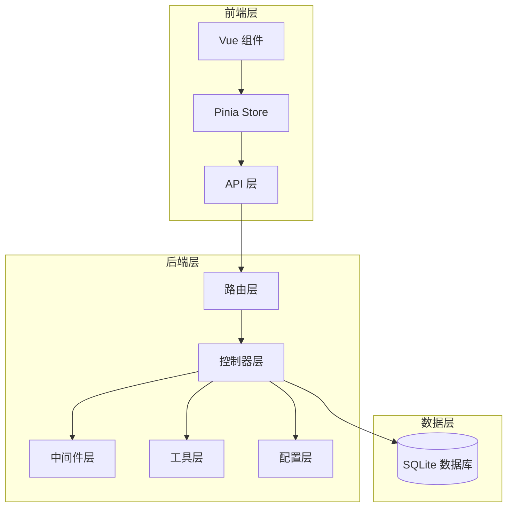

**图表来源**
- [salesmanController.ts:1-125](file://backend/src/controllers/salesmanController.ts#L1-L125)
- [salesmen.ts:1-24](file://backend/src/routes/salesmen.ts#L1-L24)

**章节来源**
- [salesmanController.ts:1-125](file://backend/src/controllers/salesmanController.ts#L1-L125)
- [salesmen.ts:1-24](file://backend/src/routes/salesmen.ts#L1-L24)

## 核心组件

### 控制器层组件

业务员控制器包含以下核心方法：

| 方法 | HTTP 方法 | 功能描述 | 参数 |
|------|-----------|----------|------|
| getSalesmen | GET | 获取业务员列表 | keyword, status, department, page, pageSize |
| getSalesman | GET | 获取业务员详情 | id (路径参数) |
| createSalesman | POST | 创建新业务员 | name, code, department, phone, email |
| updateSalesman | PUT | 更新业务员信息 | id (路径参数) + 可选字段 |
| deleteSalesman | DELETE | 停用业务员（软删除） | id (路径参数) |

### 中间件组件

系统集成了多层中间件确保安全性、数据验证和错误处理：

- **认证中间件**：JWT 令牌验证，确保只有授权用户可访问
- **请求验证中间件**：动态参数验证，支持多种数据类型和长度约束
- **错误处理中间件**：统一错误响应格式，处理各种异常情况

**章节来源**
- [salesmanController.ts:6-125](file://backend/src/controllers/salesmanController.ts#L6-L125)
- [validate.ts:1-68](file://backend/src/middleware/validate.ts#L1-L68)
- [auth.ts:1-38](file://backend/src/middleware/auth.ts#L1-L38)

## 架构概览

业务员控制器采用分层架构设计，各层职责明确，耦合度低：

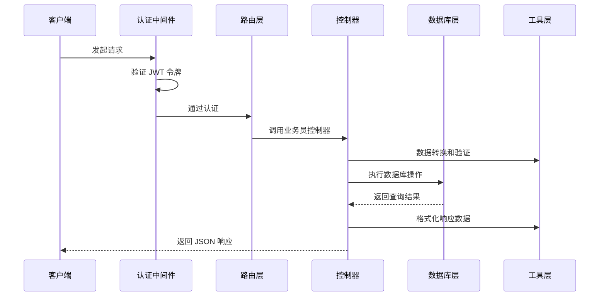

**图表来源**
- [salesmen.ts:11-23](file://backend/src/routes/salesmen.ts#L11-L23)
- [salesmanController.ts:6-125](file://backend/src/controllers/salesmanController.ts#L6-L125)

### 数据模型设计

业务员数据模型采用关系型设计，支持完整的业务需求：

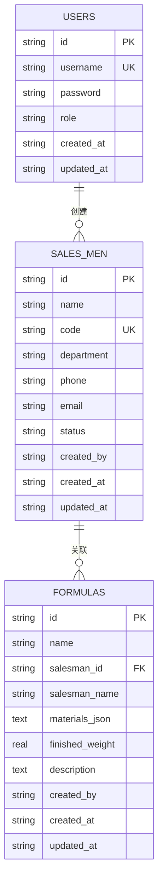

**图表来源**
- [DATABASE_DOC.md:101-122](file://backend/DATABASE_DOC.md#L101-L122)
- [DATABASE_DOC.md:67-90](file://backend/DATABASE_DOC.md#L67-L90)

**章节来源**
- [DATABASE_DOC.md:101-122](file://backend/DATABASE_DOC.md#L101-L122)
- [DATABASE_DOC.md:67-90](file://backend/DATABASE_DOC.md#L67-L90)

## 详细组件分析

### 认证与权限控制

系统采用 JWT（JSON Web Token）进行身份认证，确保 API 的安全性：

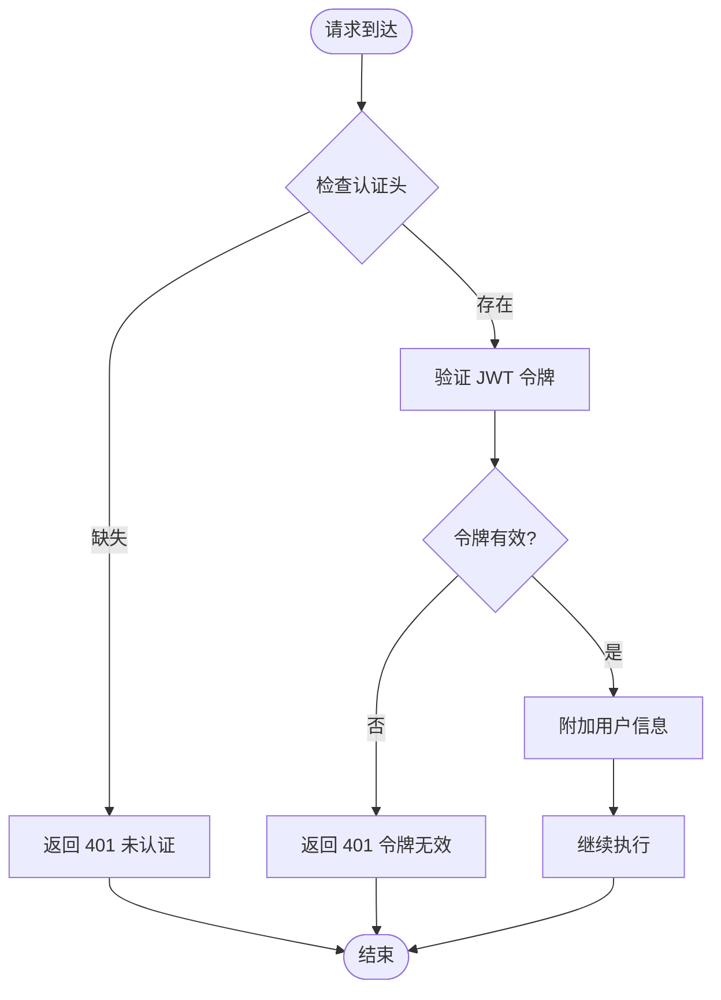

**图表来源**
- [auth.ts:13-31](file://backend/src/middleware/auth.ts#L13-L31)

认证流程特点：
- 支持 Bearer 令牌格式
- 自动解析并验证 JWT 令牌
- 将用户信息注入到请求对象中
- 支持自定义过期时间配置

**章节来源**
- [auth.ts:1-38](file://backend/src/middleware/auth.ts#L1-L38)
- [index.ts:10-13](file://backend/src/config/index.ts#L10-L13)

### 数据验证机制

请求验证中间件提供灵活的参数验证功能：

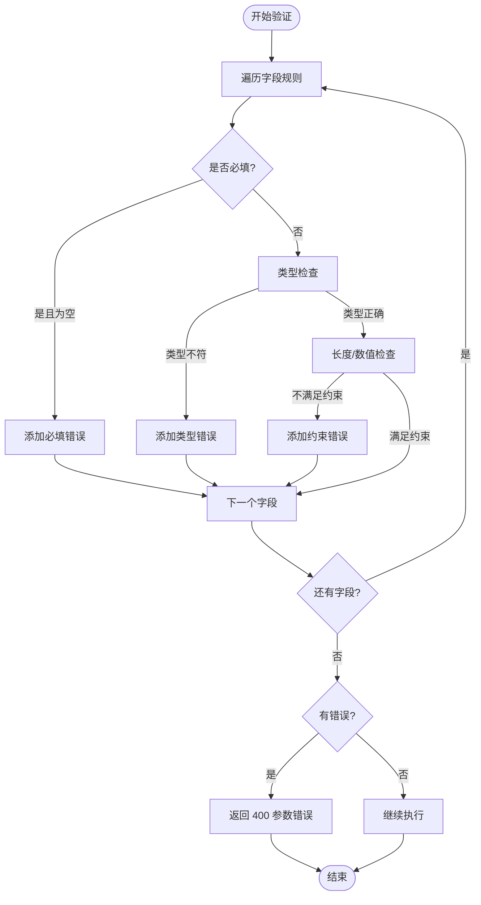

**图表来源**
- [validate.ts:16-67](file://backend/src/middleware/validate.ts#L16-L67)

验证规则支持：
- 基本数据类型验证（string, number, boolean, array）
- 必填字段检查
- 长度和数值范围约束
- 自定义错误消息

**章节来源**
- [validate.ts:1-68](file://backend/src/middleware/validate.ts#L1-L68)

### 业务员管理流程

#### 创建业务员流程

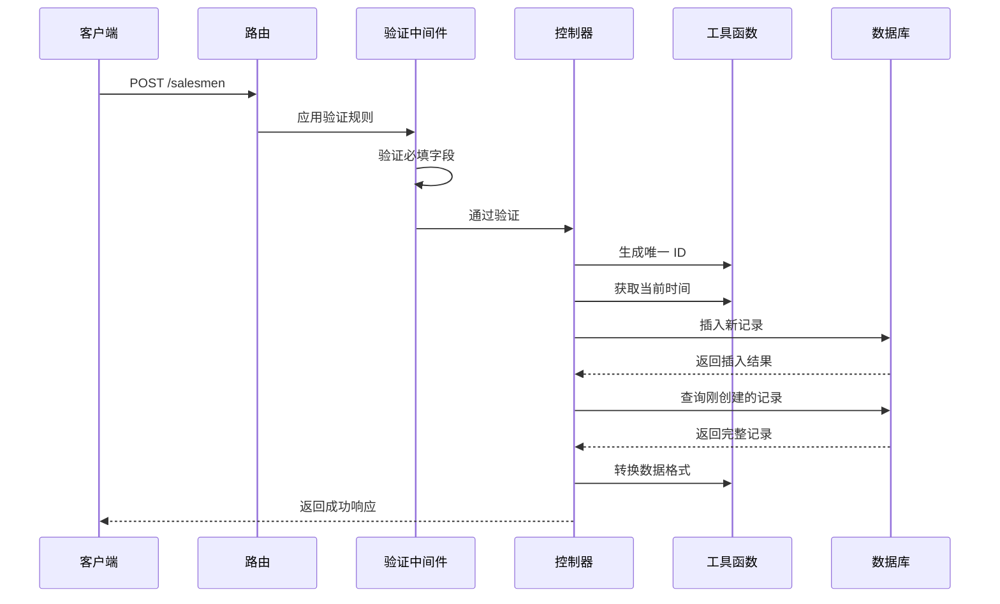

**图表来源**
- [salesmen.ts:15-21](file://backend/src/routes/salesmen.ts#L15-L21)
- [salesmanController.ts:62-83](file://backend/src/controllers/salesmanController.ts#L62-L83)

#### 查询业务员列表流程

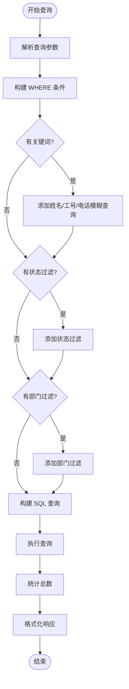

**图表来源**
- [salesmanController.ts:7-43](file://backend/src/controllers/salesmanController.ts#L7-L43)

查询特性：
- 支持关键词模糊搜索（姓名、工号、电话）
- 支持状态和部门过滤
- 分页查询支持
- 统一的分页响应格式

**章节来源**
- [salesmanController.ts:6-43](file://backend/src/controllers/salesmanController.ts#L6-L43)

### 数据关联关系

业务员与配方之间建立了一对多的关联关系：

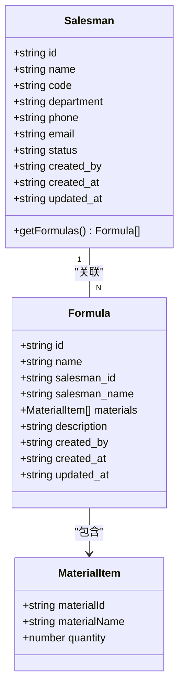

**图表来源**
- [DATABASE_DOC.md:101-122](file://backend/DATABASE_DOC.md#L101-L122)
- [DATABASE_DOC.md:67-90](file://backend/DATABASE_DOC.md#L67-L90)

关联关系特点：
- 外键约束防止孤儿记录
- 配方表存储业务员名称冗余字段
- 支持 RESTRICT 删除策略
- 查询时自动关联业务员信息

**章节来源**
- [DATABASE_DOC.md:75-84](file://backend/DATABASE_DOC.md#L75-L84)

## 依赖关系分析

业务员控制器的依赖关系清晰，遵循单一职责原则：

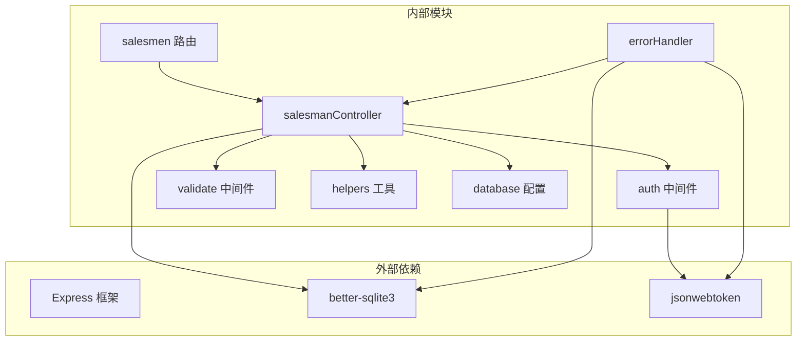

**图表来源**
- [salesmanController.ts:1-5](file://backend/src/controllers/salesmanController.ts#L1-L5)
- [salesmen.ts:1-7](file://backend/src/routes/salesmen.ts#L1-L7)

### 数据库连接管理

系统采用连接池模式管理数据库连接：

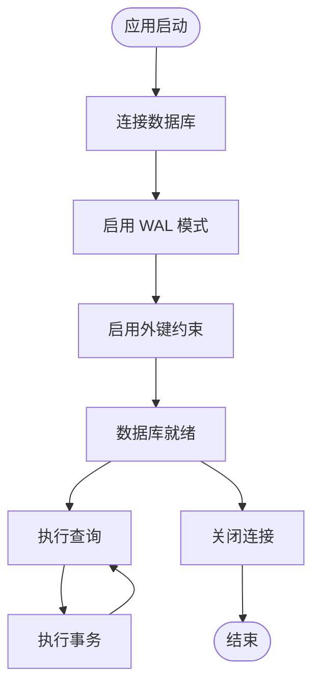

**图表来源**
- [database.ts:10-30](file://backend/src/config/database.ts#L10-L30)

数据库配置特点：
- WAL 模式提升并发性能
- 外键约束确保数据完整性
- 事务支持保证操作原子性
- 自动连接管理和错误处理

**章节来源**
- [database.ts:1-70](file://backend/src/config/database.ts#L1-L70)

## 性能考虑

### 查询优化策略

1. **索引利用**：业务员表建立了多个索引以优化查询性能
2. **分页机制**：默认每页 20 条记录，最大 100 条
3. **模糊查询优化**：使用 LIKE 查询配合索引
4. **批量数据转换**：提供批量数据格式化工具

### 缓存策略

系统目前采用内存缓存策略：
- 配置信息缓存
- 用户会话缓存
- 查询结果缓存（可扩展）

### 并发控制

- 使用 SQLite 的 WAL 模式支持并发读写
- 事务确保数据一致性
- 连接池管理数据库连接

## 故障排除指南

### 常见错误及解决方案

| 错误类型 | HTTP 状态码 | 错误原因 | 解决方案 |
|----------|-------------|----------|----------|
| 认证失败 | 401 | 未提供或无效的 JWT 令牌 | 检查 Authorization 头格式 |
| 参数验证失败 | 400 | 请求参数不符合验证规则 | 检查字段类型和长度约束 |
| 数据已存在 | 409 | 工号重复 | 修改唯一标识符 |
| 外键约束失败 | 400 | 关联数据不存在 | 检查业务员是否存在 |
| 服务器错误 | 500 | 未知服务器错误 | 查看服务器日志 |

### 错误处理机制

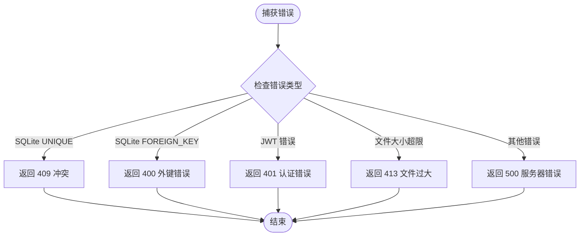

**图表来源**
- [errorHandler.ts:5-50](file://backend/src/middleware/errorHandler.ts#L5-L50)

### 调试建议

1. **启用详细日志**：在开发环境中查看详细的错误堆栈
2. **检查数据库状态**：确认业务员表结构和索引正常
3. **验证 JWT 配置**：确保密钥和过期时间设置正确
4. **测试 API 端点**：使用 Postman 或 curl 测试各个端点

**章节来源**
- [errorHandler.ts:1-51](file://backend/src/middleware/errorHandler.ts#L1-L51)

## 结论

业务员控制器作为 TingStudio 系统的核心组件，展现了良好的软件工程实践：

### 设计优势

1. **清晰的分层架构**：MVC 模式确保了代码的可维护性和可测试性
2. **完善的错误处理**：统一的错误响应格式和详细的错误信息
3. **灵活的验证机制**：动态参数验证支持复杂的业务规则
4. **安全的认证体系**：JWT 令牌验证确保 API 安全性
5. **优雅的数据关联**：业务员与配方的关联关系设计合理

### 扩展建议

1. **增加权限控制**：根据用户角色限制操作权限
2. **实现审计日志**：记录业务员信息的变更历史
3. **添加缓存层**：提升高频查询的响应速度
4. **增强监控指标**：添加性能监控和错误追踪
5. **完善单元测试**：覆盖核心业务逻辑的测试用例

该控制器为整个配方管理系统奠定了坚实的基础，其设计模式和实现细节为类似系统的开发提供了优秀的参考范例。