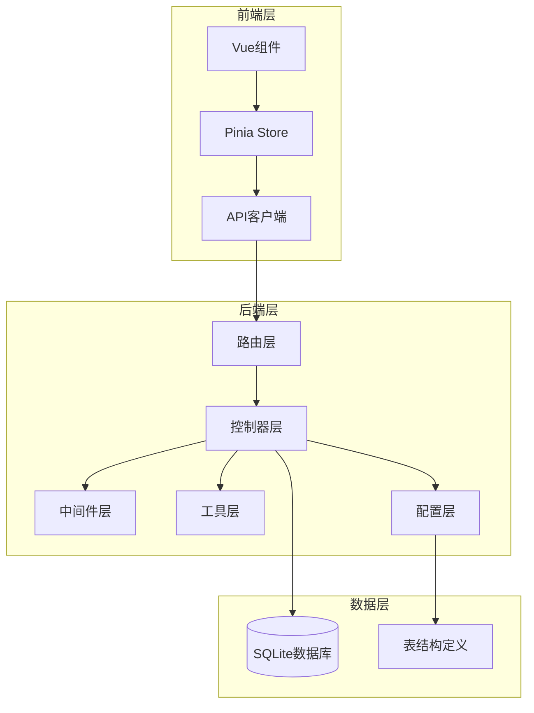
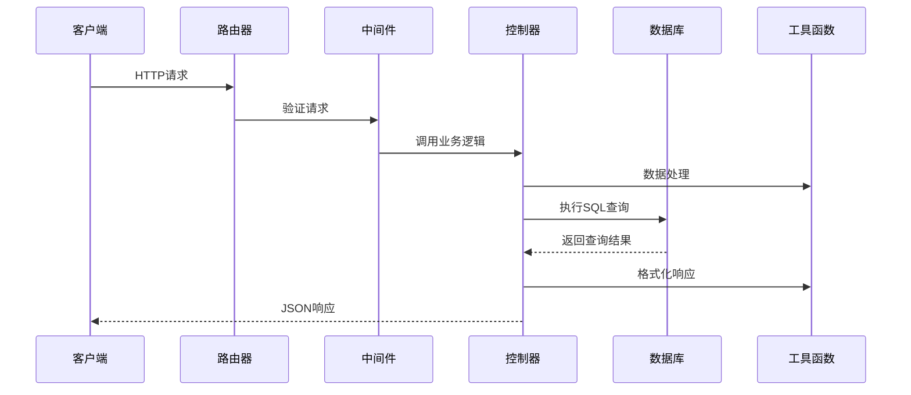
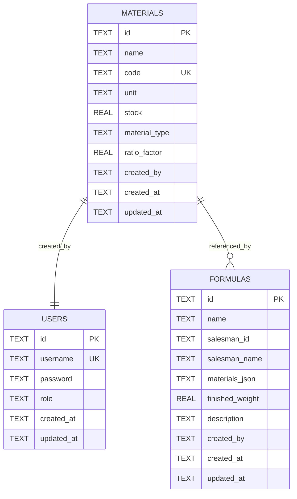
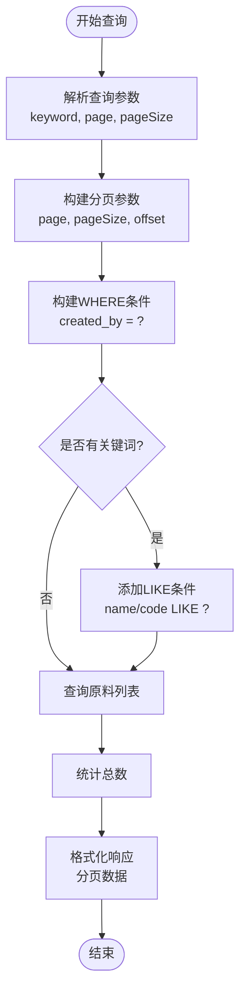
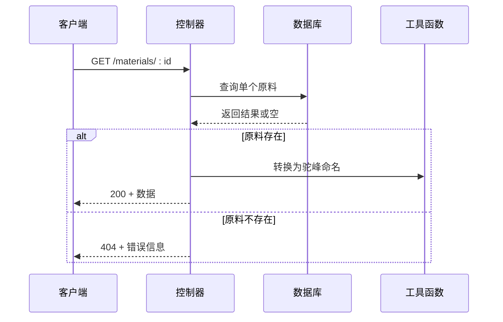
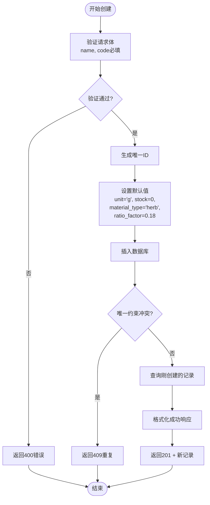
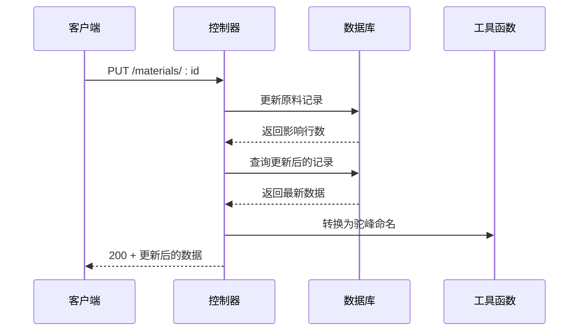
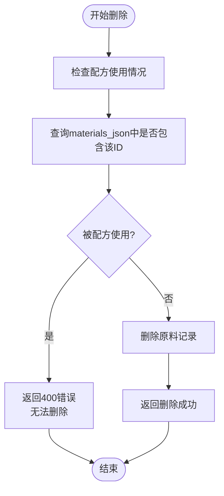
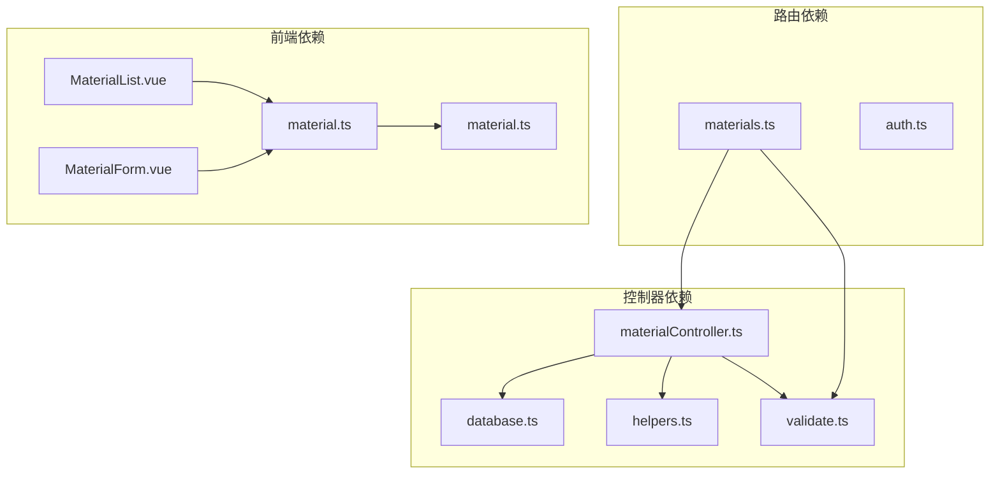

# 原料控制器

<cite>
**本文档引用的文件**
- [materialController.ts](file://backend/src/controllers/materialController.ts)
- [materials.ts](file://backend/src/routes/materials.ts)
- [validate.ts](file://backend/src/middleware/validate.ts)
- [errorHandler.ts](file://backend/src/middleware/errorHandler.ts)
- [helpers.ts](file://backend/src/utils/helpers.ts)
- [database.ts](file://backend/src/config/database.ts)
- [DATABASE_DOC.md](file://backend/DATABASE_DOC.md)
- [init.sql](file://backend/src/scripts/init.sql)
- [material.ts](file://frontend/src/types/material.ts)
- [material.ts](file://frontend/src/api/material.ts)
- [MaterialList.vue](file://frontend/src/views/materials/MaterialList.vue)
- [MaterialForm.vue](file://frontend/src/views/materials/MaterialForm.vue)
- [material.ts](file://frontend/src/stores/material.ts)
</cite>

## 目录
1. [简介](#简介)
2. [项目结构](#项目结构)
3. [核心组件](#核心组件)
4. [架构概览](#架构概览)
5. [详细组件分析](#详细组件分析)
6. [依赖分析](#依赖分析)
7. [性能考虑](#性能考虑)
8. [故障排除指南](#故障排除指南)
9. [结论](#结论)

## 简介

原料控制器是TingStudio配方管理系统中的核心组件之一，负责管理配方所需的各类原料信息。该控制器实现了完整的CRUD操作，包括原料的增删改查、批量操作处理、搜索过滤功能和数据验证机制。系统采用SQLite数据库存储，支持原料分类管理、库存状态处理和关联关系维护。

## 项目结构

原料控制器位于后端服务的控制器层，采用MVC架构模式：



**图表来源**
- [materialController.ts:1-129](file://backend/src/controllers/materialController.ts#L1-L129)
- [materials.ts:1-22](file://backend/src/routes/materials.ts#L1-L22)

**章节来源**
- [materialController.ts:1-129](file://backend/src/controllers/materialController.ts#L1-L129)
- [materials.ts:1-22](file://backend/src/routes/materials.ts#L1-L22)

## 核心组件

### 控制器层组件

原料控制器包含以下核心方法：

1. **getMaterials** - 获取原料列表（支持分页和搜索）
2. **getMaterial** - 获取单个原料详情
3. **createMaterial** - 创建新原料
4. **updateMaterial** - 更新现有原料
5. **deleteMaterial** - 删除原料（带关联检查）

### 中间件组件

1. **validateBody** - 请求体验证中间件
2. **errorHandler** - 全局错误处理中间件

### 工具组件

1. **generateId** - 唯一ID生成器
2. **buildPagination** - 分页参数构建
3. **buildLike** - 模糊搜索条件构建
4. **success/successWithPagination** - 响应格式化

**章节来源**
- [materialController.ts:6-129](file://backend/src/controllers/materialController.ts#L6-L129)
- [validate.ts:16-68](file://backend/src/middleware/validate.ts#L16-L68)
- [helpers.ts:3-86](file://backend/src/utils/helpers.ts#L3-L86)

## 架构概览

原料管理系统的整体架构采用分层设计：



**图表来源**
- [materials.ts:9-21](file://backend/src/routes/materials.ts#L9-L21)
- [materialController.ts:7-129](file://backend/src/controllers/materialController.ts#L7-L129)

### 数据模型

原料表结构定义：



**图表来源**
- [DATABASE_DOC.md:44-64](file://backend/DATABASE_DOC.md#L44-L64)
- [init.sql:17-29](file://backend/src/scripts/init.sql#L17-L29)

**章节来源**
- [DATABASE_DOC.md:44-64](file://backend/DATABASE_DOC.md#L44-L64)
- [init.sql:17-29](file://backend/src/scripts/init.sql#L17-L29)

## 详细组件分析

### CRUD操作实现

#### 列表查询（GET /materials）



**图表来源**
- [materialController.ts:7-38](file://backend/src/controllers/materialController.ts#L7-L38)
- [helpers.ts:13-19](file://backend/src/utils/helpers.ts#L13-L19)

#### 单条查询（GET /materials/:id）



**图表来源**
- [materialController.ts:41-55](file://backend/src/controllers/materialController.ts#L41-L55)

#### 创建操作（POST /materials）



**图表来源**
- [materialController.ts:58-79](file://backend/src/controllers/materialController.ts#L58-L79)
- [validate.ts:16-68](file://backend/src/middleware/validate.ts#L16-L68)

#### 更新操作（PUT /materials/:id）



**图表来源**
- [materialController.ts:82-106](file://backend/src/controllers/materialController.ts#L82-L106)

#### 删除操作（DELETE /materials/:id）



**图表来源**
- [materialController.ts:109-128](file://backend/src/controllers/materialController.ts#L109-L128)

### 数据验证机制

系统采用两级验证机制：

1. **路由级验证**：在路由层使用`validateBody`中间件进行基础验证
2. **控制器级异常处理**：捕获数据库约束异常并转换为合适的HTTP状态码

验证规则定义：
- `name`: 必填，字符串类型，最小长度1
- `code`: 必填，字符串类型，最小长度1

**章节来源**
- [materials.ts:13-19](file://backend/src/routes/materials.ts#L13-L19)
- [validate.ts:16-68](file://backend/src/middleware/validate.ts#L16-L68)

### 搜索过滤功能

搜索功能支持：
- **关键词搜索**：同时匹配原料名称和编码
- **模糊匹配**：使用LIKE操作符进行模糊搜索
- **防注入处理**：对特殊字符进行转义处理

搜索实现流程：
1. 解析查询参数中的keyword
2. 构建WHERE条件子句
3. 使用buildLike函数安全处理特殊字符
4. 执行SQL查询并返回结果

**章节来源**
- [materialController.ts:18-22](file://backend/src/controllers/materialController.ts#L18-L22)
- [helpers.ts:21-24](file://backend/src/utils/helpers.ts#L21-L24)

### 批量操作处理

系统支持以下批量操作：

1. **分页查询**：默认每页20条，最大100条
2. **全量查询**：用于下拉选择框的全量数据获取
3. **搜索过滤**：支持关键词搜索和分页结合

批量操作优化：
- 使用LIMIT和OFFSET进行高效分页
- 建立适当的数据库索引
- 使用连接池管理数据库连接

**章节来源**
- [helpers.ts:13-19](file://backend/src/utils/helpers.ts#L13-L19)
- [material.ts:96-110](file://frontend/src/stores/material.ts#L96-L110)

### 数据模型说明

#### 后端数据模型

```typescript
interface Material {
  id: string;
  name: string;
  code: string;
  unit: string;
  stock: number;
  materialType: string;
  ratioFactor: number;
  createdBy: string;
  createdAt: string;
  updatedAt: string;
}
```

#### 前端数据模型

```typescript
interface MaterialForm {
  name: string;
  code: string;
  unit?: string;
  stock?: number;
  materialType?: string;
  ratioFactor?: number;
}
```

**章节来源**
- [material.ts:1-30](file://frontend/src/types/material.ts#L1-L30)
- [material.ts:3-23](file://frontend/src/api/material.ts#L3-L23)

## 依赖分析

### 组件依赖关系



**图表来源**
- [materialController.ts:2-4](file://backend/src/controllers/materialController.ts#L2-L4)
- [materials.ts:3-5](file://backend/src/routes/materials.ts#L3-L5)

### 外部依赖

1. **better-sqlite3**：SQLite数据库驱动
2. **express**：Web框架
3. **tdesign-vue-next**：前端UI组件库
4. **pinia**：状态管理库

**章节来源**
- [materialController.ts:2-4](file://backend/src/controllers/materialController.ts#L2-L4)
- [database.ts:2](file://backend/src/config/database.ts#L2)

## 性能考虑

### 数据库优化

1. **索引优化**：
   - 原料名称索引：`idx_material_name`
   - 原料编码索引：`idx_material_code`
   - 配方名称索引：`idx_formula_name`
   - 业务员工号索引：`idx_salesman_code`

2. **查询优化**：
   - 使用LIMIT和OFFSET进行分页
   - 避免SELECT *
   - 使用参数化查询防止SQL注入

3. **连接管理**：
   - 启用WAL模式提高并发性能
   - 启用外键约束确保数据完整性

### 前端性能优化

1. **懒加载**：
   - 使用动态导入减少初始包大小
   - 按需加载组件和路由

2. **缓存策略**：
   - Pinia状态持久化
   - API响应缓存
   - 图片和静态资源缓存

3. **渲染优化**：
   - 虚拟滚动处理大量数据
   - 组件懒加载
   - 防抖和节流处理高频操作

**章节来源**
- [DATABASE_DOC.md:61-63](file://backend/DATABASE_DOC.md#L61-L63)
- [database.ts:21-23](file://backend/src/config/database.ts#L21-L23)

## 故障排除指南

### 常见错误及解决方案

#### 1. 原料编码重复错误

**错误表现**：创建或更新时返回409状态码

**原因分析**：
- 原料编码违反了唯一约束
- 同一用户重复创建相同编码的原料

**解决方案**：
- 提示用户修改原料编码
- 在前端进行实时验证
- 提供编码生成建议

#### 2. 原料被配方引用错误

**错误表现**：删除时返回400状态码

**原因分析**：
- 该原料在配方的materials_json中被引用
- SQLite使用LIKE操作符搜索JSON文本

**解决方案**：
- 提示用户先删除或修改相关配方
- 提供配方使用情况统计
- 支持批量解除关联

#### 3. 数据库连接错误

**错误表现**：系统启动时数据库连接失败

**原因分析**：
- 数据库文件路径不存在
- 权限不足访问数据库文件
- 数据库文件损坏

**解决方案**：
- 检查数据库文件路径和权限
- 重新初始化数据库
- 检查磁盘空间和文件系统

#### 4. 参数验证错误

**错误表现**：提交表单时返回400状态码

**原因分析**：
- 必填字段为空
- 数据类型不匹配
- 数据范围超出限制

**解决方案**：
- 前端实时验证
- 提供清晰的错误提示
- 支持批量验证显示

**章节来源**
- [materialController.ts:73-78](file://backend/src/controllers/materialController.ts#L73-L78)
- [materialController.ts:118-121](file://backend/src/controllers/materialController.ts#L118-L121)
- [errorHandler.ts:13-23](file://backend/src/middleware/errorHandler.ts#L13-L23)

### 调试技巧

1. **日志记录**：使用logger记录关键操作和错误信息
2. **数据库监控**：监控慢查询和高负载操作
3. **性能分析**：使用性能分析工具识别瓶颈
4. **单元测试**：编写测试用例覆盖各种场景

## 结论

原料控制器作为TingStudio配方管理系统的核心组件，实现了完整的原料生命周期管理。系统采用分层架构设计，具有良好的可维护性和扩展性。通过合理的数据验证、搜索过滤和错误处理机制，确保了系统的稳定性和用户体验。

主要特点包括：
- 完整的CRUD操作支持
- 两级数据验证机制
- 智能的搜索和过滤功能
- 严格的关联关系检查
- 优雅的错误处理和响应格式化

未来可以考虑的改进方向：
- 添加批量导入导出功能
- 实现原料分类树形结构
- 增强库存预警机制
- 优化移动端用户体验