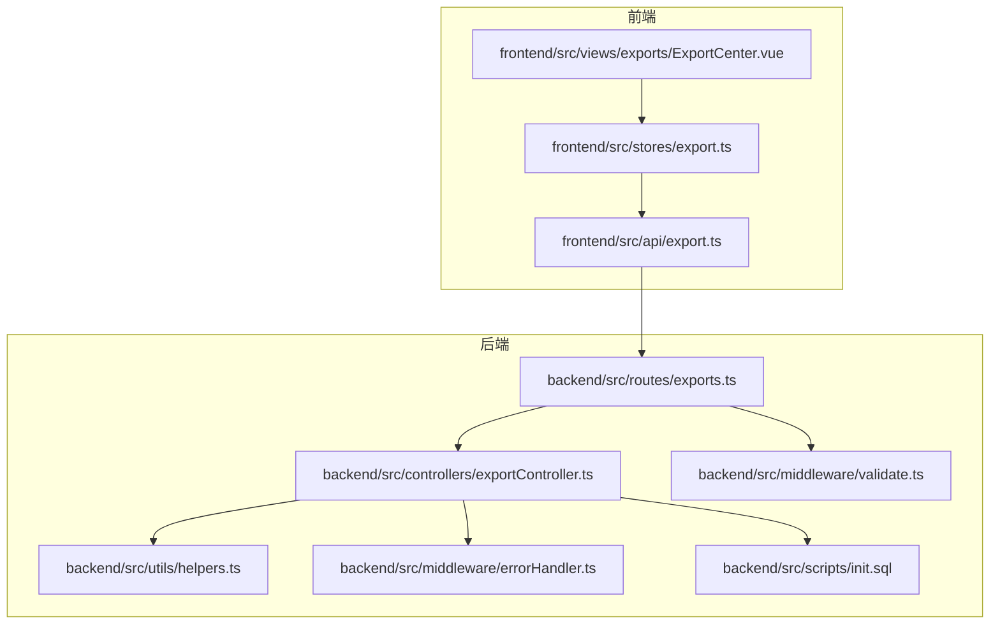
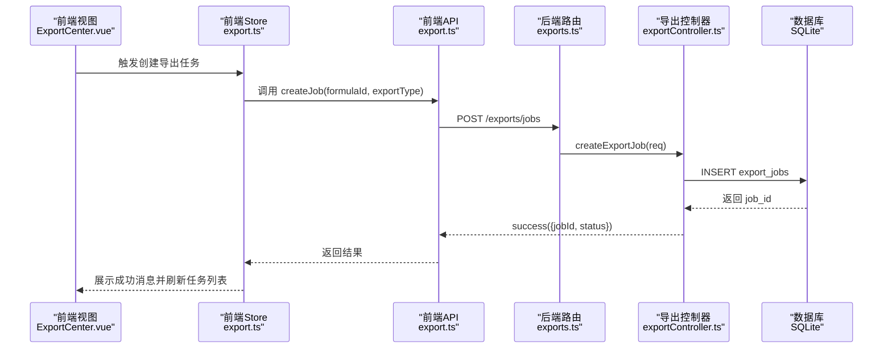
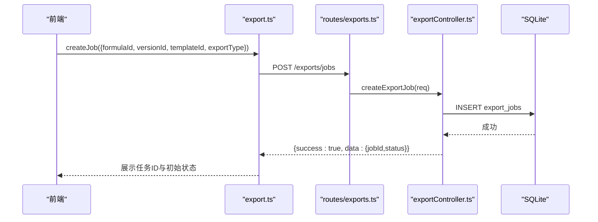
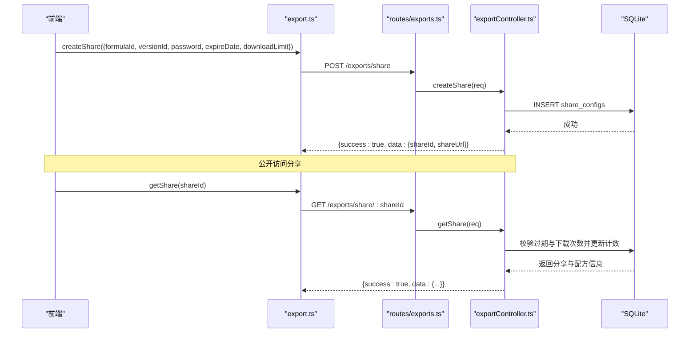
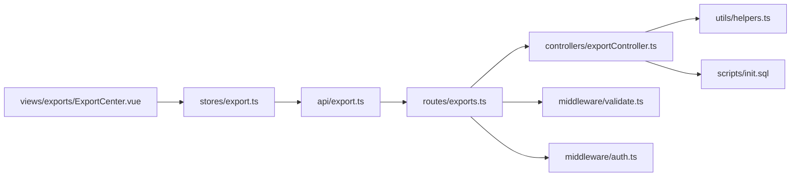
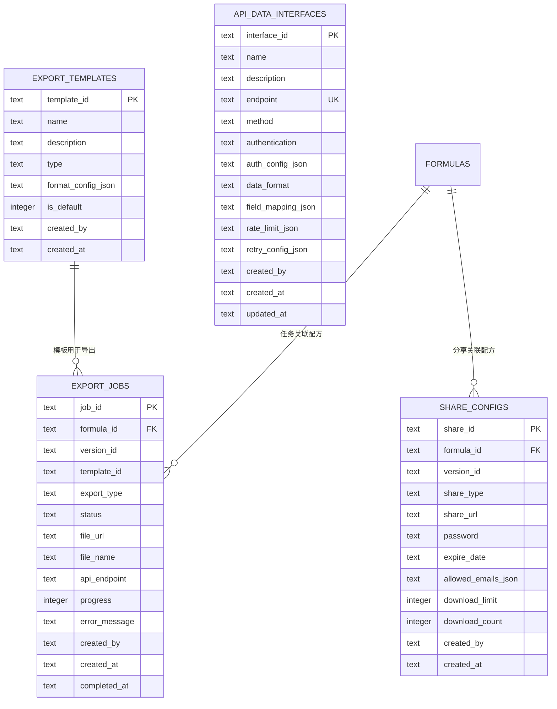
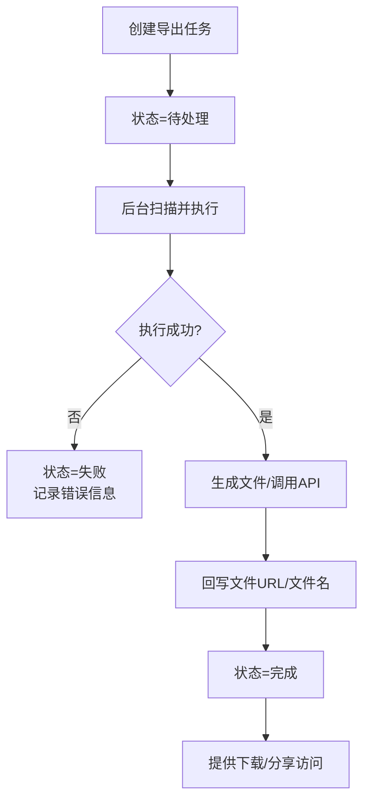

# 导出控制器

<cite>
**本文引用的文件**
- [backend/src/controllers/exportController.ts](file://backend/src/controllers/exportController.ts)
- [backend/src/routes/exports.ts](file://backend/src/routes/exports.ts)
- [backend/src/utils/helpers.ts](file://backend/src/utils/helpers.ts)
- [backend/src/scripts/init.sql](file://backend/src/scripts/init.sql)
- [backend/src/middleware/errorHandler.ts](file://backend/src/middleware/errorHandler.ts)
- [backend/src/middleware/validate.ts](file://backend/src/middleware/validate.ts)
- [frontend/src/api/export.ts](file://frontend/src/api/export.ts)
- [frontend/src/stores/export.ts](file://frontend/src/stores/export.ts)
- [frontend/src/views/exports/ExportCenter.vue](file://frontend/src/views/exports/ExportCenter.vue)
</cite>

## 目录
1. [简介](#简介)
2. [项目结构](#项目结构)
3. [核心组件](#核心组件)
4. [架构总览](#架构总览)
5. [详细组件分析](#详细组件分析)
6. [依赖分析](#依赖分析)
7. [性能考虑](#性能考虑)
8. [故障排查指南](#故障排查指南)
9. [结论](#结论)
10. [附录](#附录)

## 简介
本文件面向“导出控制器”的完整实现，围绕导出模板管理、导出任务处理与文件生成机制展开，系统性阐述导出格式配置、数据转换逻辑、文件下载处理、流程设计、性能优化策略与错误处理方案，并提供操作示例、模板配置说明与最佳实践建议。该实现采用前后端分离架构：后端通过 Express 路由与控制器提供 REST 接口；前端通过 Pinia Store 与 API 模块调用后端接口，完成模板与任务的增删改查以及分享链接的创建与访问。

## 项目结构
后端导出相关模块位于 backend/src，前端导出相关模块位于 frontend/src，数据库初始化脚本位于 backend/src/scripts。

图表来源
- [backend/src/routes/exports.ts:1-34](file://backend/src/routes/exports.ts#L1-L34)
- [backend/src/controllers/exportController.ts:1-230](file://backend/src/controllers/exportController.ts#L1-L230)
- [backend/src/utils/helpers.ts:1-86](file://backend/src/utils/helpers.ts#L1-L86)
- [backend/src/scripts/init.sql:1-228](file://backend/src/scripts/init.sql#L1-L228)
- [backend/src/middleware/errorHandler.ts:1-51](file://backend/src/middleware/errorHandler.ts#L1-L51)
- [backend/src/middleware/validate.ts:1-68](file://backend/src/middleware/validate.ts#L1-L68)
- [frontend/src/api/export.ts:1-56](file://frontend/src/api/export.ts#L1-L56)
- [frontend/src/stores/export.ts:1-109](file://frontend/src/stores/export.ts#L1-L109)
- [frontend/src/views/exports/ExportCenter.vue:1-186](file://frontend/src/views/exports/ExportCenter.vue#L1-L186)

章节来源
- [backend/src/routes/exports.ts:1-34](file://backend/src/routes/exports.ts#L1-L34)
- [backend/src/controllers/exportController.ts:1-230](file://backend/src/controllers/exportController.ts#L1-L230)
- [backend/src/utils/helpers.ts:1-86](file://backend/src/utils/helpers.ts#L1-L86)
- [backend/src/scripts/init.sql:1-228](file://backend/src/scripts/init.sql#L1-L228)
- [frontend/src/api/export.ts:1-56](file://frontend/src/api/export.ts#L1-L56)
- [frontend/src/stores/export.ts:1-109](file://frontend/src/stores/export.ts#L1-L109)
- [frontend/src/views/exports/ExportCenter.vue:1-186](file://frontend/src/views/exports/ExportCenter.vue#L1-L186)

## 核心组件
- 后端控制器：负责导出模板与任务的 CRUD、分享链接创建与校验、API 数据接口管理等。
- 路由层：定义导出路由、鉴权中间件与请求体校验中间件。
- 工具函数：统一响应格式、分页构建、JSON 安全解析、命名转换等。
- 前端 API 与 Store：封装导出相关接口、状态管理与分页控制。
- 数据库：导出模板、导出任务、分享配置、API 数据接口等表结构。

章节来源
- [backend/src/controllers/exportController.ts:1-230](file://backend/src/controllers/exportController.ts#L1-L230)
- [backend/src/routes/exports.ts:1-34](file://backend/src/routes/exports.ts#L1-L34)
- [backend/src/utils/helpers.ts:1-86](file://backend/src/utils/helpers.ts#L1-L86)
- [frontend/src/api/export.ts:1-56](file://frontend/src/api/export.ts#L1-L56)
- [frontend/src/stores/export.ts:1-109](file://frontend/src/stores/export.ts#L1-L109)

## 架构总览
后端采用“路由 → 控制器 → 数据库”的分层设计，前端通过 HTTP 接口与后端交互，控制器对请求进行参数解析与业务处理，最终返回统一格式的响应。

图表来源
- [frontend/src/views/exports/ExportCenter.vue:139-146](file://frontend/src/views/exports/ExportCenter.vue#L139-L146)
- [frontend/src/stores/export.ts:36-46](file://frontend/src/stores/export.ts#L36-L46)
- [frontend/src/api/export.ts:37-39](file://frontend/src/api/export.ts#L37-L39)
- [backend/src/routes/exports.ts:20-23](file://backend/src/routes/exports.ts#L20-L23)
- [backend/src/controllers/exportController.ts:55-72](file://backend/src/controllers/exportController.ts#L55-L72)

## 详细组件分析

### 导出模板管理
- 功能点
  - 获取模板列表：支持按类型过滤，默认按是否默认与创建时间排序。
  - 创建模板：支持设置名称、描述、类型、格式配置与是否默认；若设置默认，则自动取消同类型的其他默认模板。
  - 格式配置：以 JSON 字符串存储在数据库中，读取时安全解析为对象。
- 关键实现
  - 列表查询与条件过滤：[backend/src/controllers/exportController.ts:6-30](file://backend/src/controllers/exportController.ts#L6-L30)
  - 创建模板与默认模板互斥更新：[backend/src/controllers/exportController.ts:32-53](file://backend/src/controllers/exportController.ts#L32-L53)
  - JSON 安全解析与命名转换：[backend/src/utils/helpers.ts:77-85](file://backend/src/utils/helpers.ts#L77-L85)

图表来源
- [backend/src/controllers/exportController.ts:6-30](file://backend/src/controllers/exportController.ts#L6-L30)
- [backend/src/utils/helpers.ts:63-85](file://backend/src/utils/helpers.ts#L63-L85)

章节来源
- [backend/src/controllers/exportController.ts:6-53](file://backend/src/controllers/exportController.ts#L6-L53)
- [backend/src/utils/helpers.ts:63-85](file://backend/src/utils/helpers.ts#L63-L85)

### 导出任务处理
- 功能点
  - 创建任务：接收配方ID、版本ID、模板ID、导出类型，写入导出任务表并初始状态为“待处理”。
  - 查询任务列表：支持按状态、分页查询，返回带分页信息的列表。
  - 查询单个任务：根据任务ID查询任务详情。
- 关键实现
  - 创建任务：[backend/src/controllers/exportController.ts:55-72](file://backend/src/controllers/exportController.ts#L55-L72)
  - 任务列表与分页：[backend/src/controllers/exportController.ts:74-102](file://backend/src/controllers/exportController.ts#L74-L102)
  - 单任务查询：[backend/src/controllers/exportController.ts:104-117](file://backend/src/controllers/exportController.ts#L104-L117)
  - 分页工具：[backend/src/utils/helpers.ts:13-19](file://backend/src/utils/helpers.ts#L13-L19)

图表来源
- [frontend/src/api/export.ts:37-39](file://frontend/src/api/export.ts#L37-L39)
- [backend/src/routes/exports.ts:20-23](file://backend/src/routes/exports.ts#L20-L23)
- [backend/src/controllers/exportController.ts:55-72](file://backend/src/controllers/exportController.ts#L55-L72)

章节来源
- [backend/src/controllers/exportController.ts:55-117](file://backend/src/controllers/exportController.ts#L55-L117)
- [backend/src/utils/helpers.ts:13-19](file://backend/src/utils/helpers.ts#L13-L19)

### 文件生成与下载机制
- 当前实现现状
  - 后端控制器未包含实际文件生成与下载的实现细节；导出任务表中包含文件URL与文件名字段，但创建任务时并未填充这些字段。
  - 前端 Store 与 API 中也未体现文件下载或文件URL回写逻辑。
- 建议扩展方向
  - 在任务状态从“处理中”到“完成”时，生成目标文件并回写文件URL与文件名。
  - 提供文件下载接口或重定向至文件URL。
  - 对大文件生成增加异步队列与进度上报机制。

章节来源
- [backend/src/scripts/init.sql:110-127](file://backend/src/scripts/init.sql#L110-L127)
- [backend/src/controllers/exportController.ts:55-72](file://backend/src/controllers/exportController.ts#L55-L72)
- [frontend/src/stores/export.ts:36-46](file://frontend/src/stores/export.ts#L36-L46)

### 分享链接管理
- 功能点
  - 创建分享：支持设置分享类型、密码、过期时间、允许邮箱列表与下载次数限制。
  - 访问分享：公开访问接口，检查过期与下载次数，更新下载计数并返回配方与分享信息。
- 关键实现
  - 创建分享：[backend/src/controllers/exportController.ts:119-138](file://backend/src/controllers/exportController.ts#L119-L138)
  - 访问分享与校验：[backend/src/controllers/exportController.ts:140-185](file://backend/src/controllers/exportController.ts#L140-L185)

图表来源
- [frontend/src/api/export.ts:46-48](file://frontend/src/api/export.ts#L46-L48)
- [backend/src/routes/exports.ts:25-34](file://backend/src/routes/exports.ts#L25-L34)
- [backend/src/controllers/exportController.ts:119-185](file://backend/src/controllers/exportController.ts#L119-L185)

章节来源
- [backend/src/controllers/exportController.ts:119-185](file://backend/src/controllers/exportController.ts#L119-L185)

### API 数据接口管理
- 功能点
  - 创建与查询 API 数据接口，支持认证方式、数据格式、字段映射、限流与重试配置。
- 关键实现
  - 创建接口：[backend/src/controllers/exportController.ts:187-210](file://backend/src/controllers/exportController.ts#L187-L210)
  - 查询接口列表：[backend/src/controllers/exportController.ts:212-229](file://backend/src/controllers/exportController.ts#L212-L229)

章节来源
- [backend/src/controllers/exportController.ts:187-229](file://backend/src/controllers/exportController.ts#L187-L229)

### 前端集成与使用
- 前端 Store
  - 模板与任务的获取、创建、分页与加载状态管理。
  - 参考路径：[frontend/src/stores/export.ts:14-107](file://frontend/src/stores/export.ts#L14-L107)
- 前端 API
  - 统一封装导出相关接口，便于组件调用。
  - 参考路径：[frontend/src/api/export.ts:30-55](file://frontend/src/api/export.ts#L30-L55)
- 导出中心视图
  - 提供创建导出任务、查看任务列表、创建分享链接与模板管理入口。
  - 参考路径：[frontend/src/views/exports/ExportCenter.vue:1-186](file://frontend/src/views/exports/ExportCenter.vue#L1-L186)

章节来源
- [frontend/src/stores/export.ts:1-109](file://frontend/src/stores/export.ts#L1-L109)
- [frontend/src/api/export.ts:1-56](file://frontend/src/api/export.ts#L1-L56)
- [frontend/src/views/exports/ExportCenter.vue:1-186](file://frontend/src/views/exports/ExportCenter.vue#L1-L186)

## 依赖分析
- 控制器依赖
  - 数据库查询：通过统一数据库连接执行 SQL。
  - 工具函数：统一响应、分页、命名转换、JSON 解析。
- 路由依赖
  - 鉴权中间件：模板管理与任务管理需要登录态。
  - 请求体校验中间件：对关键字段进行类型与长度校验。
- 前端依赖
  - Store 与 API：封装后端接口，提供响应式状态与分页。
  - 视图组件：组合 Store 与 API，完成用户交互。

图表来源
- [backend/src/routes/exports.ts:1-34](file://backend/src/routes/exports.ts#L1-L34)
- [backend/src/controllers/exportController.ts:1-230](file://backend/src/controllers/exportController.ts#L1-L230)
- [backend/src/utils/helpers.ts:1-86](file://backend/src/utils/helpers.ts#L1-L86)
- [backend/src/scripts/init.sql:1-228](file://backend/src/scripts/init.sql#L1-L228)
- [frontend/src/views/exports/ExportCenter.vue:1-186](file://frontend/src/views/exports/ExportCenter.vue#L1-L186)
- [frontend/src/stores/export.ts:1-109](file://frontend/src/stores/export.ts#L1-L109)
- [frontend/src/api/export.ts:1-56](file://frontend/src/api/export.ts#L1-L56)

章节来源
- [backend/src/routes/exports.ts:1-34](file://backend/src/routes/exports.ts#L1-L34)
- [backend/src/controllers/exportController.ts:1-230](file://backend/src/controllers/exportController.ts#L1-L230)
- [backend/src/utils/helpers.ts:1-86](file://backend/src/utils/helpers.ts#L1-L86)
- [backend/src/scripts/init.sql:1-228](file://backend/src/scripts/init.sql#L1-L228)
- [frontend/src/views/exports/ExportCenter.vue:1-186](file://frontend/src/views/exports/ExportCenter.vue#L1-L186)
- [frontend/src/stores/export.ts:1-109](file://frontend/src/stores/export.ts#L1-L109)
- [frontend/src/api/export.ts:1-56](file://frontend/src/api/export.ts#L1-L56)

## 性能考虑
- 数据库索引
  - 模板按类型建立索引，提升按类型筛选效率。
  - 任务按状态与公式ID建立索引，支持高频查询。
  - 分享按公式ID建立索引，加速分享访问。
- 分页与批量转换
  - 使用分页工具限制每页数量，避免一次性返回过多数据。
  - 批量将数据库行转换为驼峰命名，减少重复逻辑。
- JSON 存储与解析
  - 格式配置与字段映射等以 JSON 存储，读取时进行安全解析，避免异常导致服务中断。
- 异步与并发
  - 文件生成建议引入后台队列与状态轮询，避免阻塞请求线程。
  - 对高并发场景，建议对任务创建与默认模板更新加锁或原子更新。

章节来源
- [backend/src/scripts/init.sql:108-166](file://backend/src/scripts/init.sql#L108-L166)
- [backend/src/utils/helpers.ts:13-19](file://backend/src/utils/helpers.ts#L13-L19)
- [backend/src/utils/helpers.ts:77-85](file://backend/src/utils/helpers.ts#L77-L85)

## 故障排查指南
- 常见错误与处理
  - 未认证：模板管理与任务管理需登录，确保携带有效 Token。
  - 参数校验失败：请求体字段缺失或类型不符，检查必填项与长度限制。
  - 数据库约束冲突：如接口地址唯一性冲突，返回 409。
  - 外键约束失败：关联数据不存在，检查配方ID或版本ID。
  - 分享过期或下载次数超限：访问公开分享链接时会返回明确提示。
- 日志与定位
  - 全局错误中间件记录未处理异常，便于定位问题。
- 建议排查步骤
  - 检查请求头与鉴权状态。
  - 校验请求体字段与类型。
  - 查看数据库中对应记录是否存在。
  - 查看全局日志输出。

章节来源
- [backend/src/middleware/errorHandler.ts:1-51](file://backend/src/middleware/errorHandler.ts#L1-L51)
- [backend/src/middleware/validate.ts:16-67](file://backend/src/middleware/validate.ts#L16-L67)
- [backend/src/controllers/exportController.ts:140-185](file://backend/src/controllers/exportController.ts#L140-L185)

## 结论
导出控制器在后端提供了完整的模板与任务管理能力，并通过统一的响应格式与中间件保障了系统的健壮性。前端通过 Store 与 API 实现了直观的操作界面与状态管理。当前实现未包含文件生成与下载的具体逻辑，建议后续补充异步队列、文件回写与下载接口，以完善端到端的导出体验。

## 附录

### 表结构概览（导出相关）
- 导出模板表：存储模板基本信息与格式配置。
- 导出任务表：存储导出任务生命周期与结果信息。
- 分享配置表：存储分享链接与访问控制信息。
- API 数据接口表：存储外部数据接口配置。

图表来源
- [backend/src/scripts/init.sql:97-166](file://backend/src/scripts/init.sql#L97-L166)

### 导出流程设计（建议）
- 任务创建：前端提交配方ID与导出类型，后端写入任务并返回任务ID。
- 任务执行：后台扫描“待处理”任务，按模板类型生成文件或调用API。
- 状态更新：任务执行中更新进度，完成后回写文件URL与文件名并置为完成。
- 下载访问：提供下载接口或重定向，支持分享链接访问与权限校验。

[此图为概念性流程示意，不直接映射具体源码文件]

### 模板配置说明（建议）
- 类型：pdf、excel、api、print。
- 格式配置：以 JSON 存储，包含字段映射、样式、分页等。
- 默认模板：同一类型仅允许一个默认模板，创建新默认模板时自动取消旧默认。

章节来源
- [backend/src/controllers/exportController.ts:32-53](file://backend/src/controllers/exportController.ts#L32-L53)
- [backend/src/scripts/init.sql:97-107](file://backend/src/scripts/init.sql#L97-L107)

### 最佳实践建议
- 前端
  - 使用 Store 管理导出状态与分页，避免重复请求。
  - 对必填字段进行本地校验，减少无效请求。
- 后端
  - 对高并发场景增加幂等与去重逻辑。
  - 对大文件生成采用异步队列与进度上报。
  - 对敏感字段（如密码）严格校验与最小暴露。
- 安全
  - 分享链接支持密码与过期时间控制，防止未授权访问。
  - 对外接口调用应配置认证与限流策略。

[本节为通用建议，不直接分析具体源码文件]