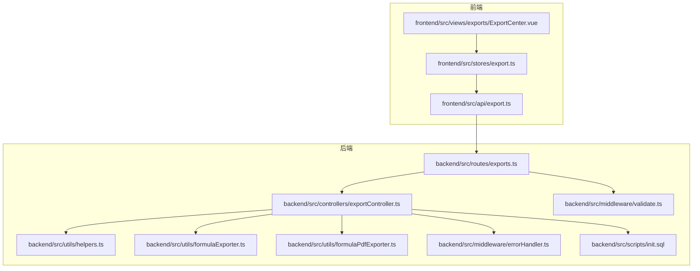
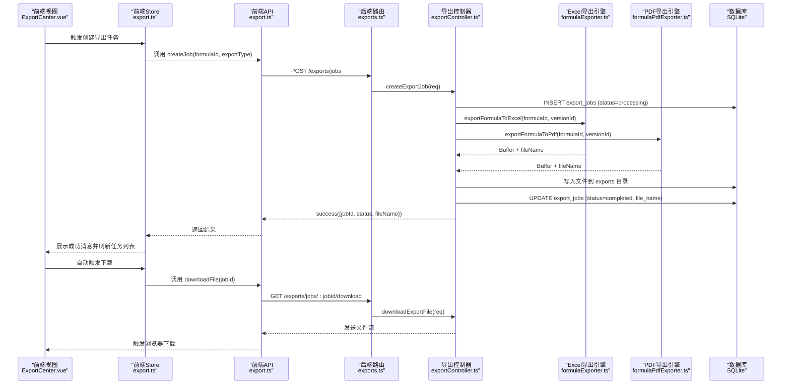
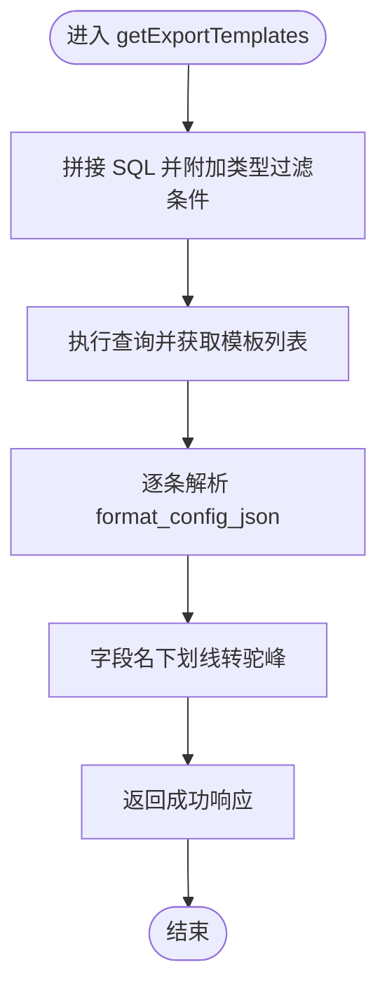
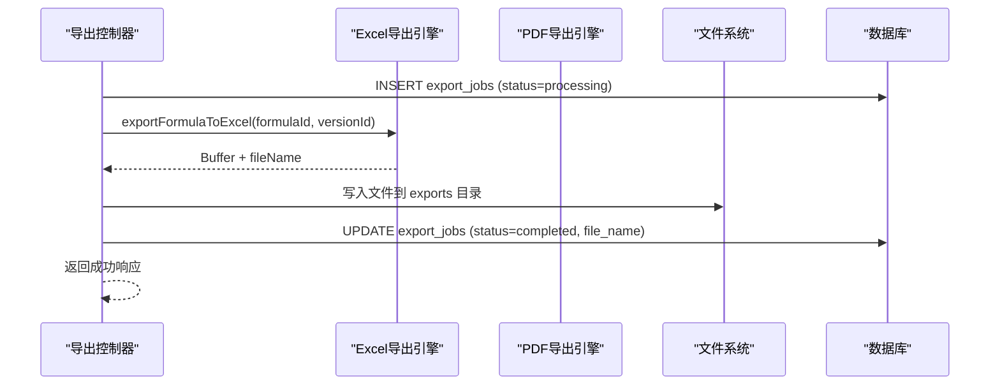
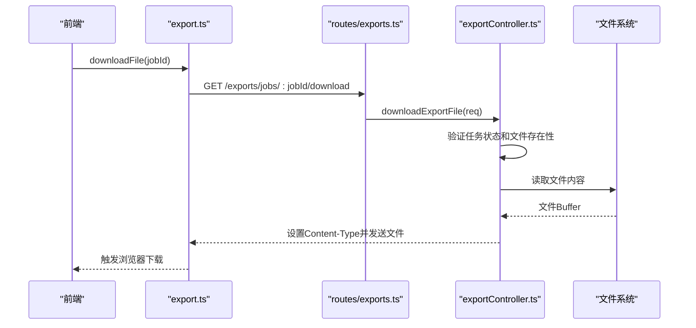
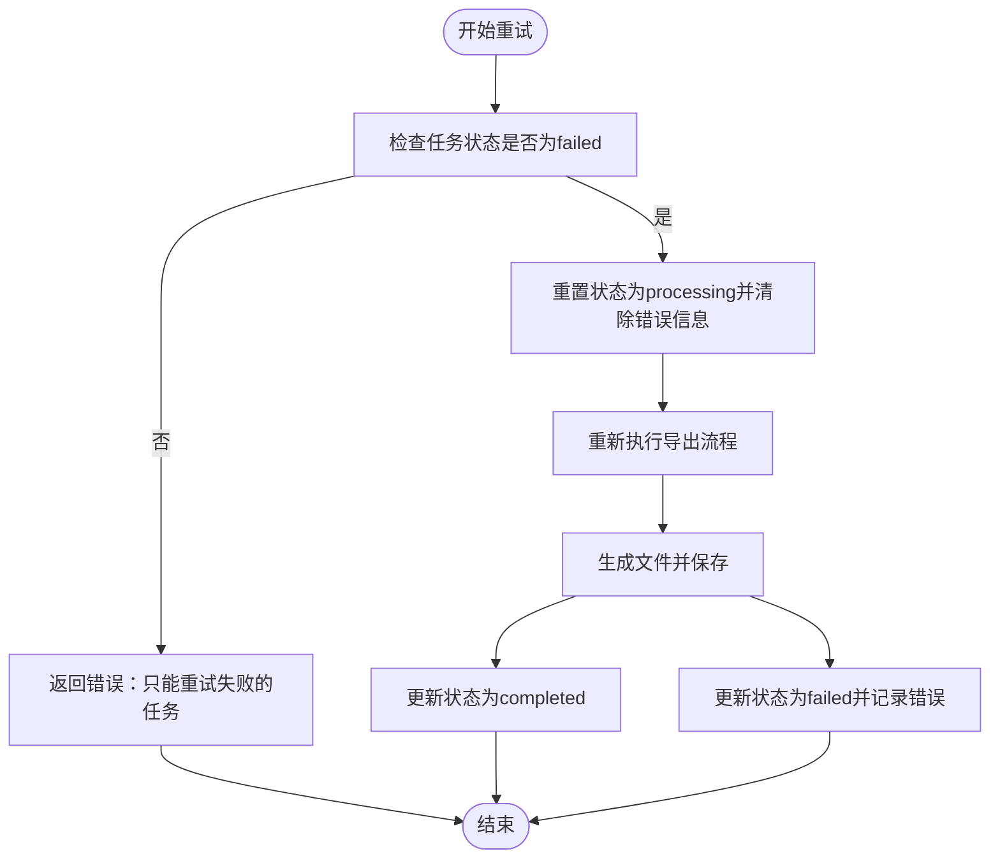
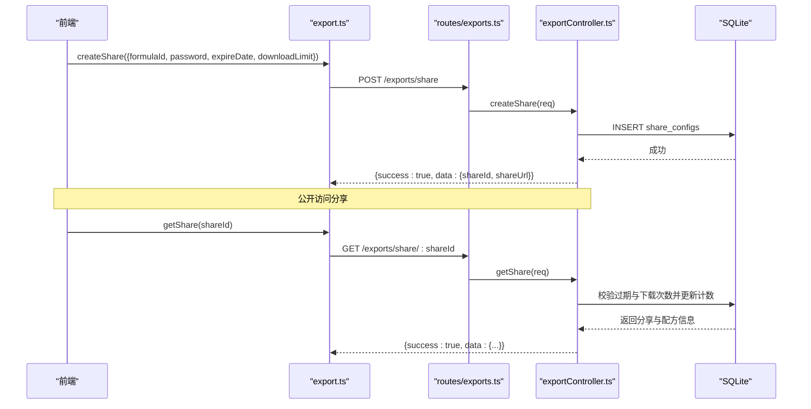
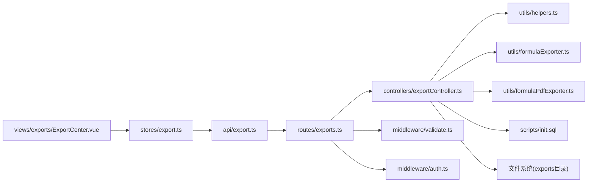
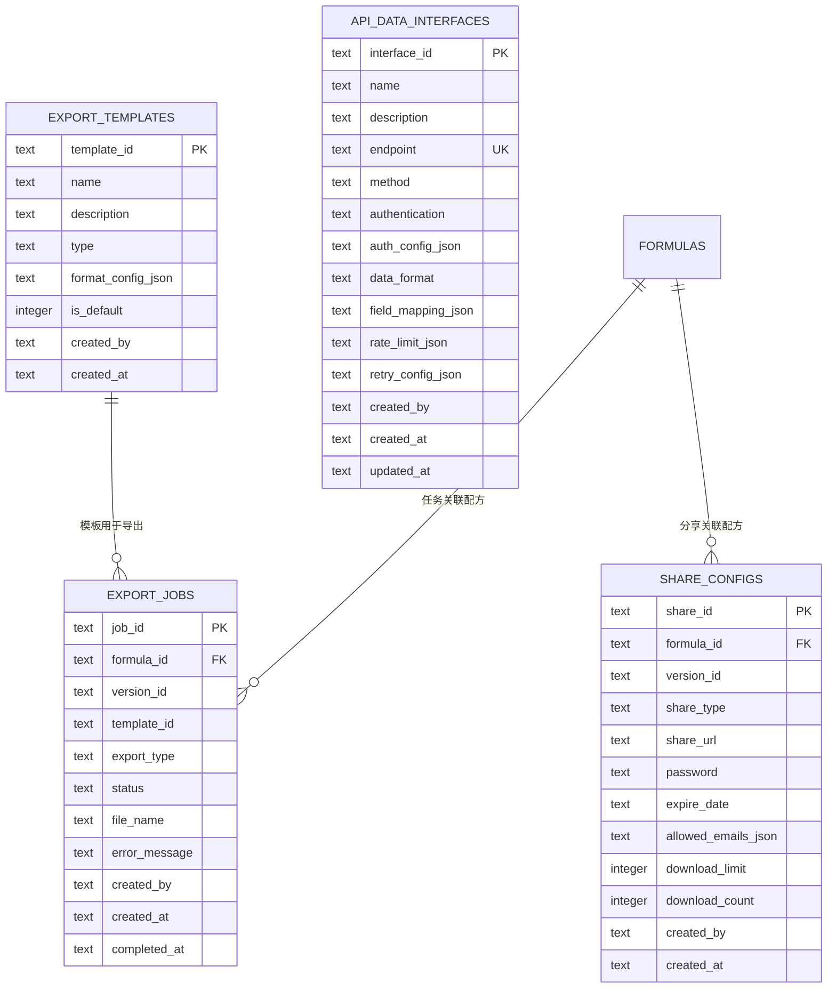
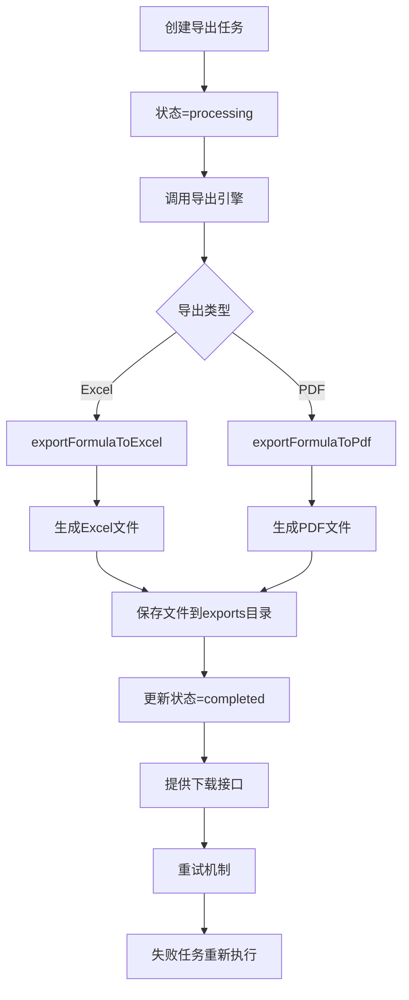

# 导出控制器

<cite>
**本文引用的文件**
- [backend/src/controllers/exportController.ts](file://backend/src/controllers/exportController.ts)
- [backend/src/routes/exports.ts](file://backend/src/routes/exports.ts)
- [backend/src/utils/helpers.ts](file://backend/src/utils/helpers.ts)
- [backend/src/utils/formulaExporter.ts](file://backend/src/utils/formulaExporter.ts)
- [backend/src/utils/formulaPdfExporter.ts](file://backend/src/utils/formulaPdfExporter.ts)
- [backend/src/scripts/init.sql](file://backend/src/scripts/init.sql)
- [backend/src/middleware/errorHandler.ts](file://backend/src/middleware/errorHandler.ts)
- [backend/src/middleware/validate.ts](file://backend/src/middleware/validate.ts)
- [frontend/src/api/export.ts](file://frontend/src/api/export.ts)
- [frontend/src/stores/export.ts](file://frontend/src/stores/export.ts)
- [frontend/src/views/exports/ExportCenter.vue](file://frontend/src/views/exports/ExportCenter.vue)
</cite>

## 更新摘要
**变更内容**
- 新增同步导出作业处理机制，支持实时文件生成
- 完整的文件下载能力，包括下载接口和文件管理
- 引入重试机制，支持失败任务的重新执行
- 增强分享管理功能，支持分享列表、删除和权限控制
- 新增导出文件存储目录和文件生命周期管理
- 扩展导出格式支持，包括 Excel 和 PDF 两种格式
- 增强错误处理和状态管理机制

## 目录
1. [简介](#简介)
2. [项目结构](#项目结构)
3. [核心组件](#核心组件)
4. [架构总览](#架构总览)
5. [详细组件分析](#详细组件分析)
6. [依赖分析](#依赖分析)
7. [性能考虑](#性能考虑)
8. [故障排查指南](#故障排查指南)
9. [结论](#结论)
10. [附录](#附录)

## 简介
本文档详细介绍 TingStudio 应用中的导出控制器实现，涵盖导出模板管理、同步导出作业处理、文件生成与下载机制、重试机制和分享管理功能。该系统采用前后端分离架构：后端通过 Express 路由与控制器提供 REST 接口，支持 Excel 和 PDF 格式的实时导出；前端通过 Pinia Store 与 API 模块调用后端接口，实现完整的导出工作流管理。

## 项目结构
后端导出相关模块位于 backend/src，前端导出相关模块位于 frontend/src，数据库初始化脚本位于 backend/src/scripts。

**图表来源**
- [backend/src/routes/exports.ts:1-40](file://backend/src/routes/exports.ts#L1-L40)
- [backend/src/controllers/exportController.ts:1-421](file://backend/src/controllers/exportController.ts#L1-L421)
- [backend/src/utils/formulaExporter.ts:1-203](file://backend/src/utils/formulaExporter.ts#L1-L203)
- [backend/src/utils/formulaPdfExporter.ts:1-362](file://backend/src/utils/formulaPdfExporter.ts#L1-L362)

## 核心组件
- **后端控制器**：负责导出模板与任务的 CRUD、同步导出执行、文件下载、重试机制、分享链接管理等
- **路由层**：定义导出路由、鉴权中间件与请求体校验中间件
- **导出引擎**：Excel 和 PDF 格式的配方数据导出工具
- **工具函数**：统一响应格式、分页构建、JSON 安全解析、命名转换等
- **前端 API 与 Store**：封装导出相关接口、状态管理与分页控制
- **数据库**：导出模板、导出任务、分享配置、API 数据接口等表结构

## 架构总览
后端采用"路由 → 控制器 → 导出引擎 → 数据库"的分层设计，前端通过 HTTP 接口与后端交互，控制器对请求进行参数解析与业务处理，最终返回统一格式的响应。

**图表来源**
- [frontend/src/views/exports/ExportCenter.vue:346-365](file://frontend/src/views/exports/ExportCenter.vue#L346-L365)
- [frontend/src/stores/export.ts:104-123](file://frontend/src/stores/export.ts#L104-L123)
- [backend/src/controllers/exportController.ts:65-122](file://backend/src/controllers/exportController.ts#L65-L122)
- [backend/src/controllers/exportController.ts:281-311](file://backend/src/controllers/exportController.ts#L281-L311)

## 详细组件分析

### 导出模板管理
- **功能点**
  - 获取模板列表：支持按类型过滤，默认按是否默认与创建时间排序
  - 创建模板：支持设置名称、描述、类型、格式配置与是否默认；若设置默认，则自动取消同类型的其他默认模板
  - 更新模板：支持修改模板属性和格式配置
  - 删除模板：删除指定模板
  - 格式配置：以 JSON 字符串存储在数据库中，读取时安全解析为对象
- **关键实现**
  - 列表查询与条件过滤：[backend/src/controllers/exportController.ts:16-40](file://backend/src/controllers/exportController.ts#L16-L40)
  - 创建模板与默认模板互斥更新：[backend/src/controllers/exportController.ts:42-63](file://backend/src/controllers/exportController.ts#L42-L63)
  - 模板更新与删除：[backend/src/controllers/exportController.ts:391-420](file://backend/src/controllers/exportController.ts#L391-L420)
  - JSON 安全解析与命名转换：[backend/src/utils/helpers.ts:77-85](file://backend/src/utils/helpers.ts#L77-L85)

**图表来源**
- [backend/src/controllers/exportController.ts:16-40](file://backend/src/controllers/exportController.ts#L16-L40)
- [backend/src/utils/helpers.ts:63-85](file://backend/src/utils/helpers.ts#L63-L85)

**章节来源**
- [backend/src/controllers/exportController.ts:16-63](file://backend/src/controllers/exportController.ts#L16-L63)
- [backend/src/controllers/exportController.ts:391-420](file://backend/src/controllers/exportController.ts#L391-L420)
- [backend/src/utils/helpers.ts:63-85](file://backend/src/utils/helpers.ts#L63-L85)

### 同步导出作业处理
- **功能点**
  - 创建任务：接收配方ID、版本ID、模板ID、导出类型，写入导出任务表并初始状态为"processing"
  - 同步执行：根据导出类型调用相应的导出引擎，直接生成文件
  - 文件存储：将生成的文件保存到 exports 目录，更新任务状态为"completed"
  - 错误处理：导出失败时更新任务状态为"failed"并记录错误信息
  - 导出类型：目前支持 Excel 和 PDF 两种格式
- **关键实现**
  - 同步导出任务创建：[backend/src/controllers/exportController.ts:65-122](file://backend/src/controllers/exportController.ts#L65-L122)
  - Excel 导出引擎集成：[backend/src/controllers/exportController.ts:94-98](file://backend/src/controllers/exportController.ts#L94-L98)
  - PDF 导出引擎集成：[backend/src/controllers/exportController.ts:90-94](file://backend/src/controllers/exportController.ts#L90-L94)
  - 文件存储与状态更新：[backend/src/controllers/exportController.ts:100-108](file://backend/src/controllers/exportController.ts#L100-L108)

**图表来源**
- [backend/src/controllers/exportController.ts:65-122](file://backend/src/controllers/exportController.ts#L65-L122)
- [backend/src/utils/formulaExporter.ts:56-202](file://backend/src/utils/formulaExporter.ts#L56-L202)

**章节来源**
- [backend/src/controllers/exportController.ts:65-122](file://backend/src/controllers/exportController.ts#L65-L122)
- [backend/src/utils/formulaExporter.ts:56-202](file://backend/src/utils/formulaExporter.ts#L56-L202)
- [backend/src/utils/formulaPdfExporter.ts:140-361](file://backend/src/utils/formulaPdfExporter.ts#L140-L361)

### 文件下载机制
- **功能点**
  - 下载接口：提供专门的下载接口，支持直接下载已完成的导出文件
  - 文件验证：检查任务状态必须为"completed"且文件存在
  - 内容类型：根据文件类型设置正确的 MIME 类型
  - 文件名处理：支持中文文件名的正确下载
  - 文件清理：过期或不存在的文件会返回相应错误
- **关键实现**
  - 下载接口实现：[backend/src/controllers/exportController.ts:281-311](file://backend/src/controllers/exportController.ts#L281-L311)
  - 文件存在性检查：[backend/src/controllers/exportController.ts:294-299](file://backend/src/controllers/exportController.ts#L294-L299)
  - 内容类型设置：[backend/src/controllers/exportController.ts:302-304](file://backend/src/controllers/exportController.ts#L302-L304)
  - 前端下载调用：[frontend/src/api/export.ts:91-97](file://frontend/src/api/export.ts#L91-L97)

**图表来源**
- [frontend/src/api/export.ts:91-97](file://frontend/src/api/export.ts#L91-L97)
- [backend/src/controllers/exportController.ts:281-311](file://backend/src/controllers/exportController.ts#L281-L311)

**章节来源**
- [backend/src/controllers/exportController.ts:281-311](file://backend/src/controllers/exportController.ts#L281-L311)
- [frontend/src/api/export.ts:91-97](file://frontend/src/api/export.ts#L91-L97)

### 重试机制
- **功能点**
  - 重试条件：只允许重试状态为"failed"的导出任务
  - 自动重置：将任务状态重置为"processing"并清除错误信息
  - 重新执行：调用相同的导出流程重新生成文件
  - 状态更新：成功时更新为"completed"，失败时保持"failed"状态
- **关键实现**
  - 重试接口实现：[backend/src/controllers/exportController.ts:313-360](file://backend/src/controllers/exportController.ts#L313-L360)
  - 状态验证：[backend/src/controllers/exportController.ts:323-326](file://backend/src/controllers/exportController.ts#L323-L326)
  - 重置状态：[backend/src/controllers/exportController.ts:329](file://backend/src/controllers/exportController.ts#L329)
  - 前端重试调用：[frontend/src/stores/export.ts:94-102](file://frontend/src/stores/export.ts#L94-L102)

**图表来源**
- [backend/src/controllers/exportController.ts:313-360](file://backend/src/controllers/exportController.ts#L313-L360)

**章节来源**
- [backend/src/controllers/exportController.ts:313-360](file://backend/src/controllers/exportController.ts#L313-L360)
- [frontend/src/stores/export.ts:94-102](file://frontend/src/stores/export.ts#L94-L102)

### 分享链接管理
- **功能点**
  - 创建分享：支持设置分享类型、密码、过期时间、允许邮箱列表与下载次数限制
  - 分享列表：获取当前用户创建的所有分享链接
  - 删除分享：删除指定的分享链接使其失效
  - 公开访问：提供公开的分享访问接口（无需认证）
  - 访问控制：检查过期时间、下载次数限制并更新下载计数
- **关键实现**
  - 创建分享：[backend/src/controllers/exportController.ts:169-188](file://backend/src/controllers/exportController.ts#L169-L188)
  - 分享列表：[backend/src/controllers/exportController.ts:362-378](file://backend/src/controllers/exportController.ts#L362-L378)
  - 删除分享：[backend/src/controllers/exportController.ts:380-389](file://backend/src/controllers/exportController.ts#L380-L389)
  - 分享访问与校验：[backend/src/controllers/exportController.ts:190-235](file://backend/src/controllers/exportController.ts#L190-L235)

**图表来源**
- [frontend/src/api/export.ts:98-106](file://frontend/src/api/export.ts#L98-L106)
- [backend/src/controllers/exportController.ts:169-188](file://backend/src/controllers/exportController.ts#L169-L188)
- [backend/src/controllers/exportController.ts:190-235](file://backend/src/controllers/exportController.ts#L190-L235)

**章节来源**
- [backend/src/controllers/exportController.ts:169-188](file://backend/src/controllers/exportController.ts#L169-L188)
- [backend/src/controllers/exportController.ts:362-378](file://backend/src/controllers/exportController.ts#L362-L378)
- [backend/src/controllers/exportController.ts:380-389](file://backend/src/controllers/exportController.ts#L380-L389)
- [backend/src/controllers/exportController.ts:190-235](file://backend/src/controllers/exportController.ts#L190-L235)

### API 数据接口管理
- **功能点**
  - 创建与查询 API 数据接口，支持认证方式、数据格式、字段映射、限流与重试配置
  - 支持多种认证方式：无认证、API Key、Basic Auth、OAuth
  - 配置重试机制和速率限制
- **关键实现**
  - 创建接口：[backend/src/controllers/exportController.ts:237-260](file://backend/src/controllers/exportController.ts#L237-L260)
  - 查询接口列表：[backend/src/controllers/exportController.ts:262-279](file://backend/src/controllers/exportController.ts#L262-L279)

**章节来源**
- [backend/src/controllers/exportController.ts:237-279](file://backend/src/controllers/exportController.ts#L237-L279)

### 前端集成与使用
- **前端 Store**
  - 模板与任务的获取、创建、分页与加载状态管理
  - 任务重试和文件下载功能
  - 分享管理的创建、获取和删除操作
  - 参考路径：[frontend/src/stores/export.ts:1-189](file://frontend/src/stores/export.ts#L1-L189)
- **前端 API**
  - 统一封装导出相关接口，便于组件调用
  - 文件下载单独处理，不走 HTTP 拦截器
  - 参考路径：[frontend/src/api/export.ts:1-114](file://frontend/src/api/export.ts#L1-L114)
- **导出中心视图**
  - 提供创建导出任务、查看任务列表、创建分享链接与模板管理入口
  - 自动触发下载和重试功能
  - 参考路径：[frontend/src/views/exports/ExportCenter.vue:1-554](file://frontend/src/views/exports/ExportCenter.vue#L1-L554)

**章节来源**
- [frontend/src/stores/export.ts:1-189](file://frontend/src/stores/export.ts#L1-L189)
- [frontend/src/api/export.ts:1-114](file://frontend/src/api/export.ts#L1-L114)
- [frontend/src/views/exports/ExportCenter.vue:1-554](file://frontend/src/views/exports/ExportCenter.vue#L1-L554)

## 依赖分析
- **控制器依赖**
  - 数据库查询：通过统一数据库连接执行 SQL
  - 导出引擎：Excel 和 PDF 导出功能
  - 工具函数：统一响应、分页、命名转换、JSON 解析
  - 文件系统：导出文件的存储和管理
- **路由依赖**
  - 鉴权中间件：模板管理与任务管理需要登录态
  - 请求体校验中间件：对关键字段进行类型与长度校验
- **前端依赖**
  - Store 与 API：封装后端接口，提供响应式状态与分页
  - 视图组件：组合 Store 与 API，完成用户交互

**图表来源**
- [backend/src/routes/exports.ts:1-40](file://backend/src/routes/exports.ts#L1-L40)
- [backend/src/controllers/exportController.ts:1-421](file://backend/src/controllers/exportController.ts#L1-L421)
- [backend/src/utils/formulaExporter.ts:1-203](file://backend/src/utils/formulaExporter.ts#L1-L203)
- [backend/src/utils/formulaPdfExporter.ts:1-362](file://backend/src/utils/formulaPdfExporter.ts#L1-L362)

**章节来源**
- [backend/src/routes/exports.ts:1-40](file://backend/src/routes/exports.ts#L1-L40)
- [backend/src/controllers/exportController.ts:1-421](file://backend/src/controllers/exportController.ts#L1-L421)
- [backend/src/utils/helpers.ts:1-86](file://backend/src/utils/helpers.ts#L1-L86)
- [backend/src/scripts/init.sql:1-232](file://backend/src/scripts/init.sql#L1-L232)
- [frontend/src/views/exports/ExportCenter.vue:1-554](file://frontend/src/views/exports/ExportCenter.vue#L1-L554)
- [frontend/src/stores/export.ts:1-189](file://frontend/src/stores/export.ts#L1-L189)
- [frontend/src/api/export.ts:1-114](file://frontend/src/api/export.ts#L1-L114)

## 性能考虑
- **数据库索引**
  - 模板按类型建立索引，提升按类型筛选效率
  - 任务按状态与公式ID建立索引，支持高频查询
  - 分享按公式ID建立索引，加速分享访问
- **文件存储优化**
  - 导出文件存储在 exports 目录，支持快速文件访问
  - 文件名采用任务ID+扩展名的格式，便于管理和清理
  - 支持文件过期清理机制
- **分页与批量转换**
  - 使用分页工具限制每页数量，避免一次性返回过多数据
  - 批量将数据库行转换为驼峰命名，减少重复逻辑
- **JSON 存储与解析**
  - 格式配置与字段映射等以 JSON 存储，读取时进行安全解析，避免异常导致服务中断
- **异步与并发**
  - 同步导出模式简化了并发控制，但可能影响响应时间
  - 建议对大型导出任务考虑异步队列处理
  - 对高并发场景，建议对任务创建与默认模板更新加锁或原子更新

**章节来源**
- [backend/src/scripts/init.sql:108-171](file://backend/src/scripts/init.sql#L108-L171)
- [backend/src/utils/helpers.ts:13-19](file://backend/src/utils/helpers.ts#L13-L19)
- [backend/src/utils/helpers.ts:77-85](file://backend/src/utils/helpers.ts#L77-L85)

## 故障排查指南
- **常见错误与处理**
  - 未认证：模板管理与任务管理需登录，确保携带有效 Token
  - 参数校验失败：请求体字段缺失或类型不符，检查必填项与长度限制
  - 数据库约束冲突：如接口地址唯一性冲突，返回 409
  - 外键约束失败：关联数据不存在，检查配方ID或版本ID
  - 分享过期或下载次数超限：访问公开分享链接时会返回明确提示
  - 文件下载失败：检查任务状态是否为"completed"且文件是否存在
  - 导出失败：检查导出引擎日志和数据库错误信息
- **日志与定位**
  - 全局错误中间件记录未处理异常，便于定位问题
  - 导出引擎提供详细的错误堆栈信息
- **建议排查步骤**
  - 检查请求头与鉴权状态
  - 校验请求体字段与类型
  - 查看数据库中对应记录是否存在
  - 检查 exports 目录的文件权限和空间
  - 查看全局日志输出

**章节来源**
- [backend/src/middleware/errorHandler.ts:1-51](file://backend/src/middleware/errorHandler.ts#L1-L51)
- [backend/src/middleware/validate.ts:16-67](file://backend/src/middleware/validate.ts#L16-L67)
- [backend/src/controllers/exportController.ts:190-235](file://backend/src/controllers/exportController.ts#L190-L235)
- [backend/src/controllers/exportController.ts:281-311](file://backend/src/controllers/exportController.ts#L281-L311)

## 结论
导出控制器经过大幅增强，现已提供完整的同步导出解决方案。系统支持 Excel 和 PDF 两种格式的实时导出，具备完善的文件下载、重试机制和分享管理功能。通过导出引擎的集成和文件存储管理，实现了高效的导出工作流。前端通过 Store 与 API 实现了直观的操作界面与状态管理，用户可以轻松创建、管理和下载导出文件。

## 附录

### 表结构概览（导出相关）
- **导出模板表**：存储模板基本信息与格式配置
- **导出任务表**：存储导出任务生命周期与结果信息，支持文件存储
- **分享配置表**：存储分享链接与访问控制信息
- **API 数据接口表**：存储外部数据接口配置

**图表来源**
- [backend/src/scripts/init.sql:101-171](file://backend/src/scripts/init.sql#L101-L171)

### 导出流程设计
- **任务创建**：前端提交配方ID与导出类型，后端写入任务并立即执行
- **同步执行**：根据导出类型调用相应的导出引擎生成文件
- **状态更新**：任务执行中更新状态为"processing"，完成后更新为"completed"
- **文件存储**：生成的文件保存到 exports 目录，更新文件名信息
- **下载访问**：提供下载接口，支持直接下载已完成的文件
- **重试机制**：失败的任务可以重新执行，支持错误恢复

**图表来源**
- [backend/src/controllers/exportController.ts:65-122](file://backend/src/controllers/exportController.ts#L65-L122)
- [backend/src/controllers/exportController.ts:313-360](file://backend/src/controllers/exportController.ts#L313-L360)

### 模板配置说明
- **类型**：pdf、excel、api、print
- **格式配置**：以 JSON 存储，包含字段映射、样式、分页等
- **默认模板**：同一类型仅允许一个默认模板，创建新默认模板时自动取消旧默认
- **导出引擎**：Excel 使用 XLSX 库，PDF 使用 pdfkit 库

**章节来源**
- [backend/src/controllers/exportController.ts:42-63](file://backend/src/controllers/exportController.ts#L42-L63)
- [backend/src/scripts/init.sql:101-111](file://backend/src/scripts/init.sql#L101-L111)
- [backend/src/utils/formulaExporter.ts:5](file://backend/src/utils/formulaExporter.ts#L5)
- [backend/src/utils/formulaPdfExporter.ts:5](file://backend/src/utils/formulaPdfExporter.ts#L5)

### 最佳实践建议
- **前端**
  - 使用 Store 管理导出状态与分页，避免重复请求
  - 对必填字段进行本地校验，减少无效请求
  - 实现自动下载功能，提升用户体验
- **后端**
  - 对高并发场景增加幂等与去重逻辑
  - 考虑对大型导出任务采用异步队列处理
  - 对敏感字段（如密码）严格校验与最小暴露
  - 实现文件过期清理机制，避免磁盘空间占用
- **安全**
  - 分享链接支持密码与过期时间控制，防止未授权访问
  - 对外接口调用应配置认证与限流策略
  - 文件下载接口应验证任务状态和文件存在性
- **性能**
  - Excel 导出适合大量数据，PDF 导出适合打印需求
  - 合理设置导出文件的过期时间，平衡存储成本和可用性
  - 对频繁访问的导出文件考虑缓存策略