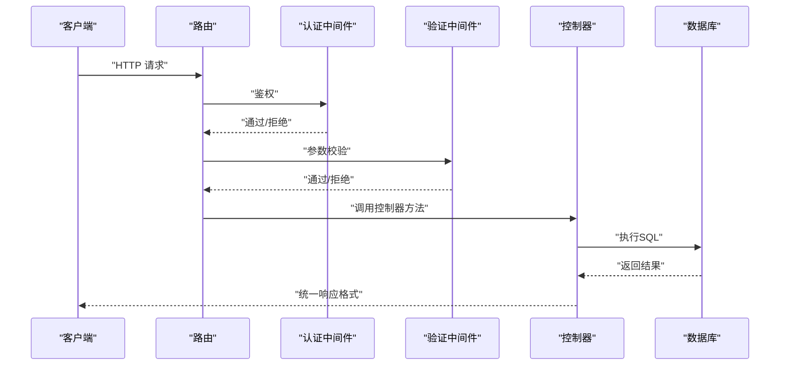
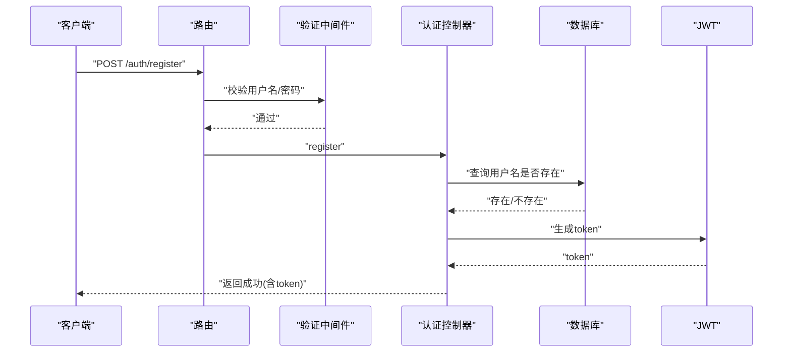
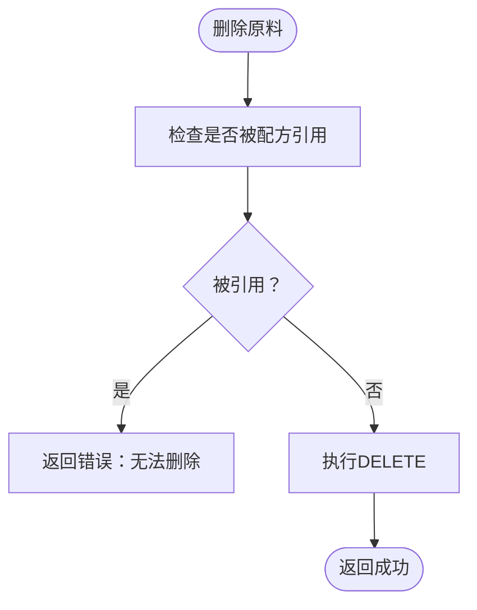
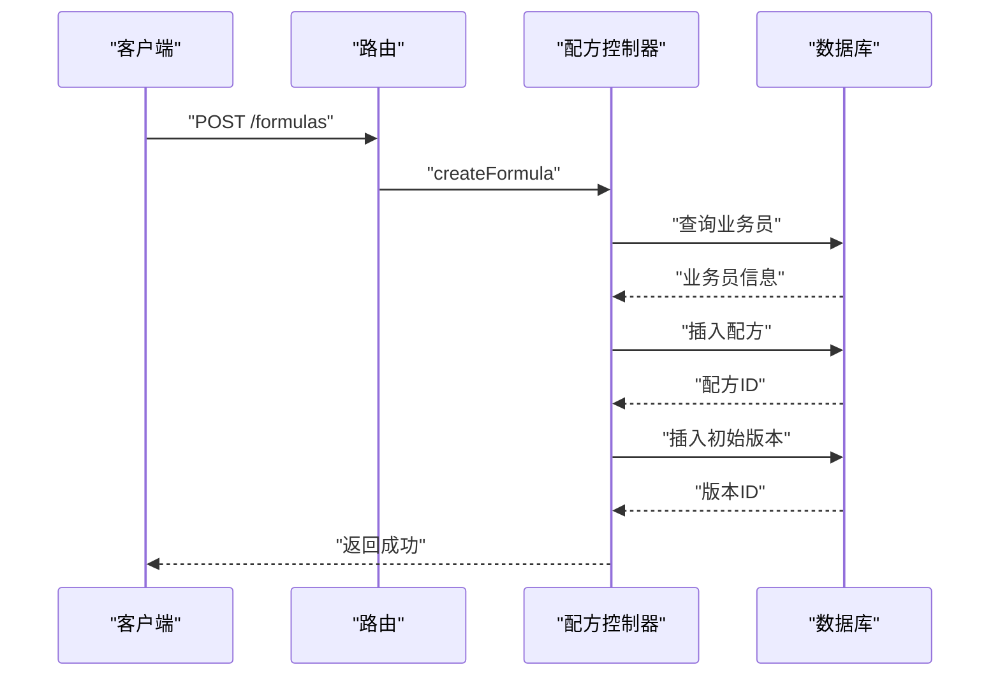
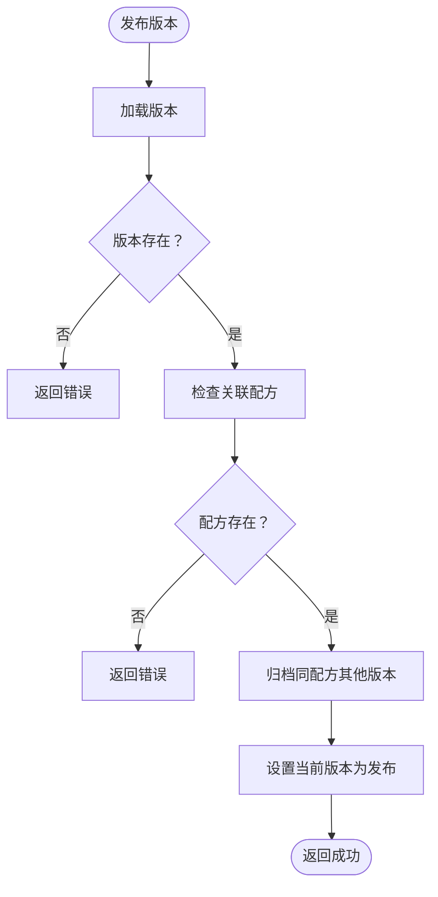
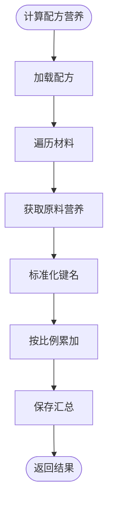
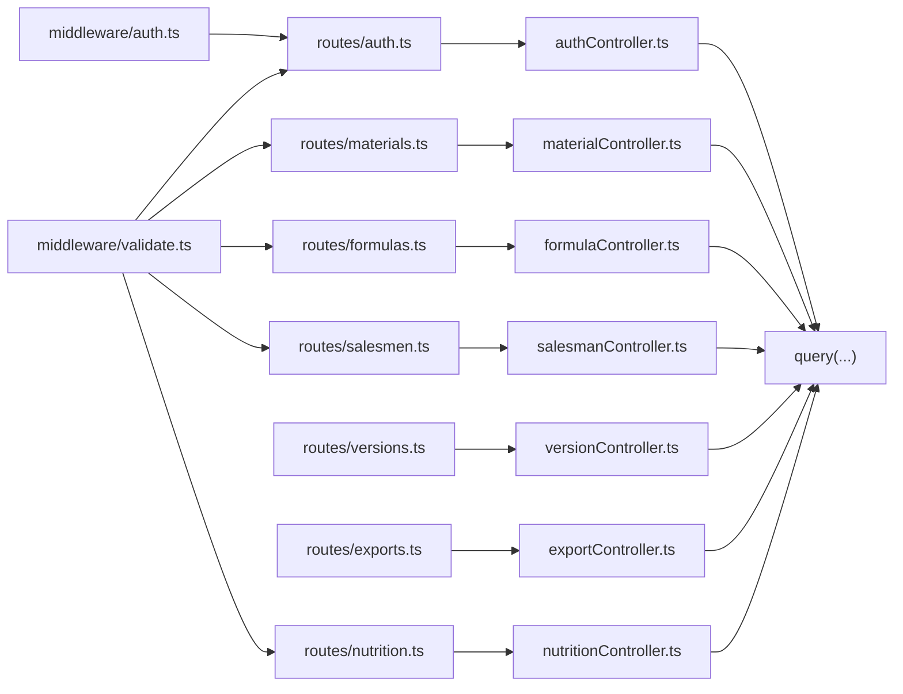

# 控制器层实现

<cite>
**本文引用的文件**
- [backend/src/controllers/authController.ts](file://backend/src/controllers/authController.ts)
- [backend/src/controllers/materialController.ts](file://backend/src/controllers/materialController.ts)
- [backend/src/controllers/formulaController.ts](file://backend/src/controllers/formulaController.ts)
- [backend/src/controllers/salesmanController.ts](file://backend/src/controllers/salesmanController.ts)
- [backend/src/controllers/versionController.ts](file://backend/src/controllers/versionController.ts)
- [backend/src/controllers/exportController.ts](file://backend/src/controllers/exportController.ts)
- [backend/src/controllers/nutritionController.ts](file://backend/src/controllers/nutritionController.ts)
- [backend/src/middleware/auth.ts](file://backend/src/middleware/auth.ts)
- [backend/src/middleware/validate.ts](file://backend/src/middleware/validate.ts)
- [backend/src/routes/auth.ts](file://backend/src/routes/auth.ts)
- [backend/src/routes/materials.ts](file://backend/src/routes/materials.ts)
- [backend/src/routes/formulas.ts](file://backend/src/routes/formulas.ts)
- [backend/src/routes/salesmen.ts](file://backend/src/routes/salesmen.ts)
- [backend/src/routes/versions.ts](file://backend/src/routes/versions.ts)
- [backend/src/routes/exports.ts](file://backend/src/routes/exports.ts)
- [backend/src/routes/nutrition.ts](file://backend/src/routes/nutrition.ts)
</cite>

## 目录
1. [引言](#引言)
2. [项目结构](#项目结构)
3. [核心组件](#核心组件)
4. [架构总览](#架构总览)
5. [详细组件分析](#详细组件分析)
6. [依赖关系分析](#依赖关系分析)
7. [性能考虑](#性能考虑)
8. [故障排查指南](#故障排查指南)
9. [结论](#结论)
10. [附录](#附录)

## 引言
本文件系统性梳理后端控制器层的实现，覆盖认证、原料、配方、业务员、版本、导出与营养分析七大模块。重点阐述控制器的设计模式（职责单一、围绕资源的REST风格）、请求处理流程（路由→中间件→控制器→数据库→统一响应）、数据验证策略、业务规则封装与响应格式化。同时提供开发规范、单元测试策略与性能优化建议，帮助开发者快速理解与维护代码。

## 项目结构
控制器层位于 backend/src/controllers，按领域划分模块；路由层位于 backend/src/routes，负责URL到控制器函数的绑定；中间件层位于 backend/src/middleware，提供认证与请求体校验能力。

```mermaid
graph TB
subgraph "路由层"
R_AUTH["routes/auth.ts"]
R_MATERIALS["routes/materials.ts"]
R_FORMULAS["routes/formulas.ts"]
R_SALES["routes/salesmen.ts"]
R_VERSIONS["routes/versions.ts"]
R_EXPORTS["routes/exports.ts"]
R_NUTRITION["routes/nutrition.ts"]
end
subgraph "中间件层"
M_AUTH["middleware/auth.ts"]
M_VALIDATE["middleware/validate.ts"]
end
subgraph "控制器层"
C_AUTH["controllers/authController.ts"]
C_MATERIAL["controllers/materialController.ts"]
C_FORMULA["controllers/formulaController.ts"]
C_SALES["controllers/salesmanController.ts"]
C_VERSION["controllers/versionController.ts"]
C_EXPORT["controllers/exportController.ts"]
C_NUTRITION["controllers/nutritionController.ts"]
end
R_AUTH --> M_VALIDATE
R_AUTH --> M_AUTH
R_AUTH --> C_AUTH
R_MATERIALS --> M_AUTH
R_MATERIALS --> M_VALIDATE
R_MATERIALS --> C_MATERIAL
R_FORMULAS --> M_AUTH
R_FORMULAS --> M_VALIDATE
R_FORMULAS --> C_FORMULA
R_SALES --> M_AUTH
R_SALES --> M_VALIDATE
R_SALES --> C_SALES
R_VERSIONS --> M_AUTH
R_VERSIONS --> C_VERSION
R_EXPORTS --> M_AUTH
R_EXPORTS --> C_EXPORT
R_NUTRITION --> M_AUTH
R_NUTRITION --> M_VALIDATE
R_NUTRITION --> C_NUTRITION
```

图表来源
- [backend/src/routes/auth.ts:1-20](file://backend/src/routes/auth.ts#L1-L20)
- [backend/src/routes/materials.ts:1-22](file://backend/src/routes/materials.ts#L1-L22)
- [backend/src/routes/formulas.ts:1-28](file://backend/src/routes/formulas.ts#L1-L28)
- [backend/src/routes/salesmen.ts:1-24](file://backend/src/routes/salesmen.ts#L1-L24)
- [backend/src/routes/versions.ts:1-17](file://backend/src/routes/versions.ts#L1-L17)
- [backend/src/routes/exports.ts:1-34](file://backend/src/routes/exports.ts#L1-L34)
- [backend/src/routes/nutrition.ts:1-31](file://backend/src/routes/nutrition.ts#L1-L31)
- [backend/src/middleware/auth.ts:1-38](file://backend/src/middleware/auth.ts#L1-L38)
- [backend/src/middleware/validate.ts:1-68](file://backend/src/middleware/validate.ts#L1-L68)
- [backend/src/controllers/authController.ts:1-89](file://backend/src/controllers/authController.ts#L1-L89)
- [backend/src/controllers/materialController.ts:1-129](file://backend/src/controllers/materialController.ts#L1-L129)
- [backend/src/controllers/formulaController.ts:1-287](file://backend/src/controllers/formulaController.ts#L1-L287)
- [backend/src/controllers/salesmanController.ts:1-125](file://backend/src/controllers/salesmanController.ts#L1-L125)
- [backend/src/controllers/versionController.ts:1-270](file://backend/src/controllers/versionController.ts#L1-L270)
- [backend/src/controllers/exportController.ts:1-230](file://backend/src/controllers/exportController.ts#L1-L230)
- [backend/src/controllers/nutritionController.ts:1-641](file://backend/src/controllers/nutritionController.ts#L1-L641)

章节来源
- [backend/src/routes/auth.ts:1-20](file://backend/src/routes/auth.ts#L1-L20)
- [backend/src/routes/materials.ts:1-22](file://backend/src/routes/materials.ts#L1-L22)
- [backend/src/routes/formulas.ts:1-28](file://backend/src/routes/formulas.ts#L1-L28)
- [backend/src/routes/salesmen.ts:1-24](file://backend/src/routes/salesmen.ts#L1-L24)
- [backend/src/routes/versions.ts:1-17](file://backend/src/routes/versions.ts#L1-L17)
- [backend/src/routes/exports.ts:1-34](file://backend/src/routes/exports.ts#L1-L34)
- [backend/src/routes/nutrition.ts:1-31](file://backend/src/routes/nutrition.ts#L1-L31)

## 核心组件
- 认证控制器：处理注册、登录、当前用户信息读取，包含密码哈希、JWT签发与错误处理。
- 原料控制器：原料的增删改查、唯一性约束处理、与配方引用关系检查。
- 配方控制器：配方CRUD、版本自动创建与变更记录、按原料检索、权限控制（admin可见全部）。
- 业务员控制器：业务员分页查询、软删除（停用）、唯一性约束处理。
- 版本控制器：版本列表、详情、手动快照、发布、版本对比与差异计算。
- 导出控制器：导出模板管理、导出任务队列、分享链接创建与访问、API接口定义。
- 营养分析控制器：原料营养录入与更新、配方营养汇总计算、合规性检查、XLS一致性表格输出。

章节来源
- [backend/src/controllers/authController.ts:1-89](file://backend/src/controllers/authController.ts#L1-L89)
- [backend/src/controllers/materialController.ts:1-129](file://backend/src/controllers/materialController.ts#L1-L129)
- [backend/src/controllers/formulaController.ts:1-287](file://backend/src/controllers/formulaController.ts#L1-L287)
- [backend/src/controllers/salesmanController.ts:1-125](file://backend/src/controllers/salesmanController.ts#L1-L125)
- [backend/src/controllers/versionController.ts:1-270](file://backend/src/controllers/versionController.ts#L1-L270)
- [backend/src/controllers/exportController.ts:1-230](file://backend/src/controllers/exportController.ts#L1-L230)
- [backend/src/controllers/nutritionController.ts:1-641](file://backend/src/controllers/nutritionController.ts#L1-L641)

## 架构总览
控制器层遵循“路由→中间件→控制器”的调用链，统一使用数据库查询封装与工具函数进行响应格式化与分页构建。

图表来源
- [backend/src/middleware/auth.ts:13-31](file://backend/src/middleware/auth.ts#L13-L31)
- [backend/src/middleware/validate.ts:16-67](file://backend/src/middleware/validate.ts#L16-L67)
- [backend/src/routes/auth.ts:9-19](file://backend/src/routes/auth.ts#L9-L19)
- [backend/src/routes/materials.ts:11-21](file://backend/src/routes/materials.ts#L11-L21)
- [backend/src/controllers/authController.ts:9-39](file://backend/src/controllers/authController.ts#L9-L39)
- [backend/src/controllers/materialController.ts:58-79](file://backend/src/controllers/materialController.ts#L58-L79)

## 详细组件分析

### 认证控制器
- 设计模式：围绕用户资源的REST风格控制器，职责清晰（注册/登录/当前用户）。
- 请求处理流程：
  - 注册：参数校验→用户名去重→密码哈希→插入用户→签发JWT→返回成功。
  - 登录：参数校验→查询用户→密码校验→签发JWT→返回成功。
  - 当前用户：基于JWT载荷查询用户→返回成功。
- 数据验证：用户名长度、密码长度等基础规则。
- 业务规则：用户名唯一、密码安全存储、JWT有效期。
- 响应格式：统一success包装，错误时返回标准错误对象。

图表来源
- [backend/src/routes/auth.ts:9-15](file://backend/src/routes/auth.ts#L9-L15)
- [backend/src/middleware/validate.ts:16-67](file://backend/src/middleware/validate.ts#L16-L67)
- [backend/src/controllers/authController.ts:9-39](file://backend/src/controllers/authController.ts#L9-L39)
- [backend/src/middleware/auth.ts:33-37](file://backend/src/middleware/auth.ts#L33-L37)

章节来源
- [backend/src/controllers/authController.ts:1-89](file://backend/src/controllers/authController.ts#L1-L89)
- [backend/src/routes/auth.ts:1-20](file://backend/src/routes/auth.ts#L1-L20)
- [backend/src/middleware/validate.ts:1-68](file://backend/src/middleware/validate.ts#L1-L68)
- [backend/src/middleware/auth.ts:1-38](file://backend/src/middleware/auth.ts#L1-L38)

### 原料控制器
- 设计模式：资源型控制器，支持分页、关键词过滤、创建默认值填充。
- 请求处理流程：
  - 列表：构建动态WHERE条件（关键词LIKE、创建者过滤）→分页查询→总数统计→统一响应。
  - 单条：ID查询→存在性校验→返回。
  - 创建：参数校验→生成ID→默认值填充→插入→返回刚创建记录。
  - 更新：参数校验→更新→存在性校验→返回。
  - 删除：检查是否被配方引用→删除→返回。
- 数据验证：名称/编码必填。
- 业务规则：唯一性约束冲突捕获、引用完整性检查、默认值策略。
- 响应格式：统一successWithPagination或success。

图表来源
- [backend/src/controllers/materialController.ts:109-128](file://backend/src/controllers/materialController.ts#L109-L128)

章节来源
- [backend/src/controllers/materialController.ts:1-129](file://backend/src/controllers/materialController.ts#L1-L129)
- [backend/src/routes/materials.ts:1-22](file://backend/src/routes/materials.ts#L1-L22)

### 配方控制器
- 设计模式：资源型+版本化控制器，围绕配方与版本的双向关系。
- 请求处理流程：
  - 列表：根据用户角色决定是否过滤→关键词/业务员过滤→分页查询→批量查询版本→合并返回。
  - 单条：ID查询→返回。
  - 创建：校验业务员→组装材料项→插入配方→自动生成初始版本。
  - 更新：获取旧配方→可选业务员变更→材料变更则生成新版本（变更记录）→返回。
  - 删除：直接删除。
  - 按原料检索：JSON字段LIKE搜索→返回。
- 数据验证：配方名称、业务员、材料、成品重量必填。
- 业务规则：admin可见全部；材料变更触发版本自动创建；版本号递增规则。
- 响应格式：统一successWithPagination或success。

图表来源
- [backend/src/routes/formulas.ts:16-24](file://backend/src/routes/formulas.ts#L16-L24)
- [backend/src/controllers/formulaController.ts:89-130](file://backend/src/controllers/formulaController.ts#L89-L130)

章节来源
- [backend/src/controllers/formulaController.ts:1-287](file://backend/src/controllers/formulaController.ts#L1-L287)
- [backend/src/routes/formulas.ts:1-28](file://backend/src/routes/formulas.ts#L1-L28)

### 业务员控制器
- 设计模式：资源型控制器，支持多维过滤（关键词/状态/部门）。
- 请求处理流程：
  - 列表：动态WHERE条件→分页查询→总数统计→统一响应。
  - 单条：ID查询→存在性校验→返回。
  - 创建：参数校验→默认状态激活→插入→返回。
  - 更新：可选字段更新→存在性校验→返回。
  - 删除：软删除（状态置为非活跃）。
- 数据验证：姓名/工号必填。
- 业务规则：唯一性约束冲突捕获、软删除策略。
- 响应格式：统一successWithPagination或success。

章节来源
- [backend/src/controllers/salesmanController.ts:1-125](file://backend/src/controllers/salesmanController.ts#L1-L125)
- [backend/src/routes/salesmen.ts:1-24](file://backend/src/routes/salesmen.ts#L1-L24)

### 版本控制器
- 设计模式：版本资源控制器，围绕配方版本生命周期管理。
- 请求处理流程：
  - 列表：按配方过滤→可按状态过滤→倒序返回。
  - 详情：ID查询→JSON解析→返回。
  - 创建：获取当前配方→计算新版本号→旧版本非当前→插入新版本→返回。
  - 发布：校验版本与配方存在→归档同配方其他版本→设置当前版本为发布。
  - 对比：获取两个版本快照→材料/描述/业务员对比→统计差异。
- 数据验证：版本名称、状态、版本ID必填。
- 业务规则：版本号递增、状态机（draft/published/archived）、当前版本唯一。
- 响应格式：统一success。

图表来源
- [backend/src/controllers/versionController.ts:114-157](file://backend/src/controllers/versionController.ts#L114-L157)

章节来源
- [backend/src/controllers/versionController.ts:1-270](file://backend/src/controllers/versionController.ts#L1-L270)
- [backend/src/routes/versions.ts:1-17](file://backend/src/routes/versions.ts#L1-L17)

### 导出控制器
- 设计模式：多资源控制器（模板/任务/分享/API接口），围绕导出工作流。
- 请求处理流程：
  - 模板：查询模板→JSON解析→返回。
  - 创建模板：默认模板去重→插入→返回。
  - 任务：创建导出任务→状态初始化→返回。
  - 任务列表：按创建者过滤→分页→返回。
  - 任务状态：ID查询→返回。
  - 分享：创建分享→生成URL→返回。
  - 分享访问：校验过期/下载次数→更新计数→返回配方数据。
  - API接口：创建接口→JSON序列化→返回。
- 数据验证：模板/任务/分享/API字段必填。
- 业务规则：默认模板类型内唯一、分享过期/次数限制、任务状态机。
- 响应格式：统一successWithPagination或success。

章节来源
- [backend/src/controllers/exportController.ts:1-230](file://backend/src/controllers/exportController.ts#L1-L230)
- [backend/src/routes/exports.ts:1-34](file://backend/src/routes/exports.ts#L1-L34)

### 营养分析控制器
- 设计模式：复合业务控制器，围绕原料与配方的营养数据计算与合规检查。
- 请求处理流程：
  - 原料营养：按ID查询→标准化per_100g键名→返回。
  - 设置原料营养：校验原料→存在则版本递增→更新；否则新建→返回。
  - 计算配方营养：获取配方→遍历原料→按比例累加→保存汇总→返回。
  - 营养标准：查询/创建→JSON解析/序列化。
  - 合规检查：读取汇总→与标准对比→生成报告→返回。
  - 表格数据：按XLS一致性规则→技术处理→生成计算表与标签表→返回。
- 数据验证：配方/标准/合规字段必填。
- 业务规则：键名标准化、NRV基准、技术处理阈值、报告生成。
- 响应格式：统一success。

图表来源
- [backend/src/controllers/nutritionController.ts:124-242](file://backend/src/controllers/nutritionController.ts#L124-L242)

章节来源
- [backend/src/controllers/nutritionController.ts:1-641](file://backend/src/controllers/nutritionController.ts#L1-L641)
- [backend/src/routes/nutrition.ts:1-31](file://backend/src/routes/nutrition.ts#L1-L31)

## 依赖关系分析
- 控制器对数据库的依赖：通过统一查询封装执行SQL，避免在控制器内直接拼接SQL。
- 控制器对工具函数的依赖：统一响应、分页、驼峰转换、JSON安全解析等。
- 控制器对中间件的依赖：认证中间件注入用户上下文；验证中间件前置参数校验。
- 路由对控制器的依赖：路由文件集中声明URL与控制器函数映射。

图表来源
- [backend/src/controllers/authController.ts:1-89](file://backend/src/controllers/authController.ts#L1-L89)
- [backend/src/controllers/materialController.ts:1-129](file://backend/src/controllers/materialController.ts#L1-L129)
- [backend/src/controllers/formulaController.ts:1-287](file://backend/src/controllers/formulaController.ts#L1-L287)
- [backend/src/controllers/salesmanController.ts:1-125](file://backend/src/controllers/salesmanController.ts#L1-L125)
- [backend/src/controllers/versionController.ts:1-270](file://backend/src/controllers/versionController.ts#L1-L270)
- [backend/src/controllers/exportController.ts:1-230](file://backend/src/controllers/exportController.ts#L1-L230)
- [backend/src/controllers/nutritionController.ts:1-641](file://backend/src/controllers/nutritionController.ts#L1-L641)
- [backend/src/routes/auth.ts:1-20](file://backend/src/routes/auth.ts#L1-L20)
- [backend/src/routes/materials.ts:1-22](file://backend/src/routes/materials.ts#L1-L22)
- [backend/src/routes/formulas.ts:1-28](file://backend/src/routes/formulas.ts#L1-L28)
- [backend/src/routes/salesmen.ts:1-24](file://backend/src/routes/salesmen.ts#L1-L24)
- [backend/src/routes/versions.ts:1-17](file://backend/src/routes/versions.ts#L1-L17)
- [backend/src/routes/exports.ts:1-34](file://backend/src/routes/exports.ts#L1-L34)
- [backend/src/routes/nutrition.ts:1-31](file://backend/src/routes/nutrition.ts#L1-L31)
- [backend/src/middleware/auth.ts:1-38](file://backend/src/middleware/auth.ts#L1-L38)
- [backend/src/middleware/validate.ts:1-68](file://backend/src/middleware/validate.ts#L1-L68)

章节来源
- [backend/src/controllers/*:1-89](file://backend/src/controllers/authController.ts#L1-L89)
- [backend/src/routes/*:1-20](file://backend/src/routes/auth.ts#L1-L20)
- [backend/src/middleware/*:1-38](file://backend/src/middleware/auth.ts#L1-L38)

## 性能考虑
- 分页与索引：列表查询使用LIMIT/OFFSET，建议在高频过滤字段（如created_by、created_at）建立索引。
- 动态WHERE：多条件拼接WHERE子句时注意参数绑定，避免SQL注入与全表扫描。
- 批量查询：版本列表与材料变更对比采用IN查询与一次性聚合，减少多次往返。
- JSON字段：频繁解析/序列化JSON时，尽量在DAO层或工具函数中做缓存与异常兜底。
- JWT与加密：密码哈希成本适中，建议在高并发场景评估异步处理或连接池优化。
- 响应格式：统一success包装减少前端分支判断，提升可维护性。

## 故障排查指南
- 认证失败：检查Authorization头格式、JWT签名密钥与过期时间。
- 参数校验失败：核对必填字段、类型与长度限制。
- 唯一性冲突：用户名/编码重复导致409，检查唯一约束与提示信息。
- 资源不存在：ID查询返回404，确认外键与软删除状态。
- 引用完整性：删除原料被配方引用返回错误，先清理引用再删除。
- 版本发布异常：检查版本与配方存在性、状态机流转。
- 营养计算缺失：原料无营养数据或键名不匹配，检查标准化逻辑与数据源。

章节来源
- [backend/src/middleware/auth.ts:13-31](file://backend/src/middleware/auth.ts#L13-L31)
- [backend/src/middleware/validate.ts:16-67](file://backend/src/middleware/validate.ts#L16-L67)
- [backend/src/controllers/materialController.ts:113-121](file://backend/src/controllers/materialController.ts#L113-L121)
- [backend/src/controllers/versionController.ts:118-137](file://backend/src/controllers/versionController.ts#L118-L137)
- [backend/src/controllers/nutritionController.ts:147-167](file://backend/src/controllers/nutritionController.ts#L147-L167)

## 结论
控制器层实现了清晰的资源化设计与严格的中间件约束，统一了响应格式与错误处理。通过模块化的控制器与路由组织，提升了可维护性与扩展性。建议在生产环境中进一步完善索引策略、批量查询与JSON处理性能，并补充单元测试与集成测试覆盖关键路径。

## 附录

### 控制器开发规范
- 命名规范：控制器函数命名与资源一致（如getMaterials/createFormula）。
- 错误处理：捕获异常并返回统一错误对象，区分业务错误与系统错误。
- 参数校验：在路由层使用验证中间件，明确必填与范围限制。
- 权限控制：敏感操作使用认证中间件，必要时在控制器内做角色校验。
- 响应格式：统一success/successWithPagination包装，便于前端处理。

### 单元测试策略
- 路由层：模拟HTTP请求，验证中间件顺序与控制器调用。
- 控制器层：Mock数据库查询，覆盖正常/异常分支与边界条件。
- 中间件层：验证JWT解码、参数校验与错误响应。
- 数据库层：使用事务与回滚，确保测试隔离与可重复性。

### 性能优化建议
- 使用索引：在高频过滤字段与排序字段建立索引。
- 减少N+1查询：批量查询版本与材料比率，合并查询结果。
- 缓存热点数据：对只读配置与标准数据进行缓存。
- 异步处理：对耗时任务（如导出、合规检查）放入队列异步执行。
- 连接池：合理配置数据库连接池大小与超时时间。