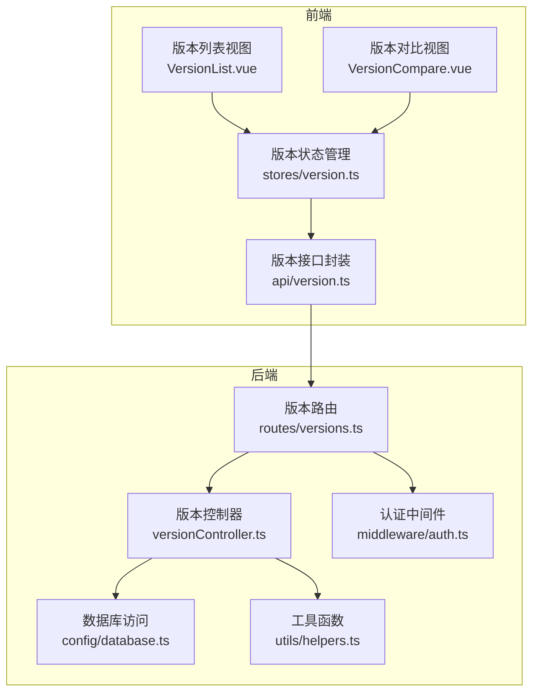
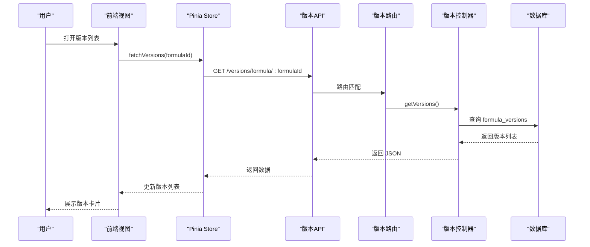
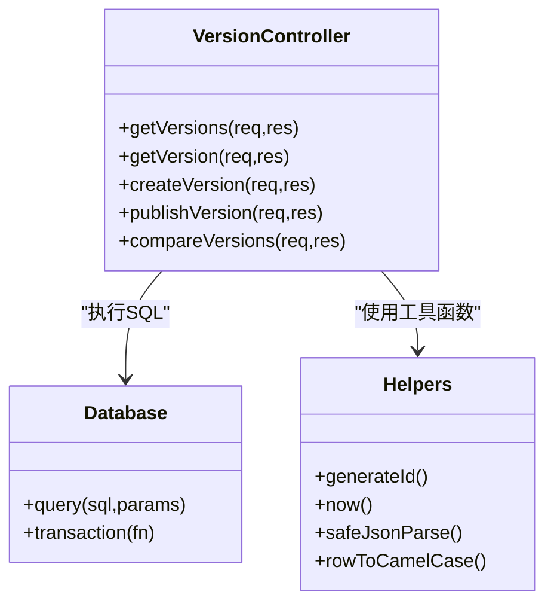
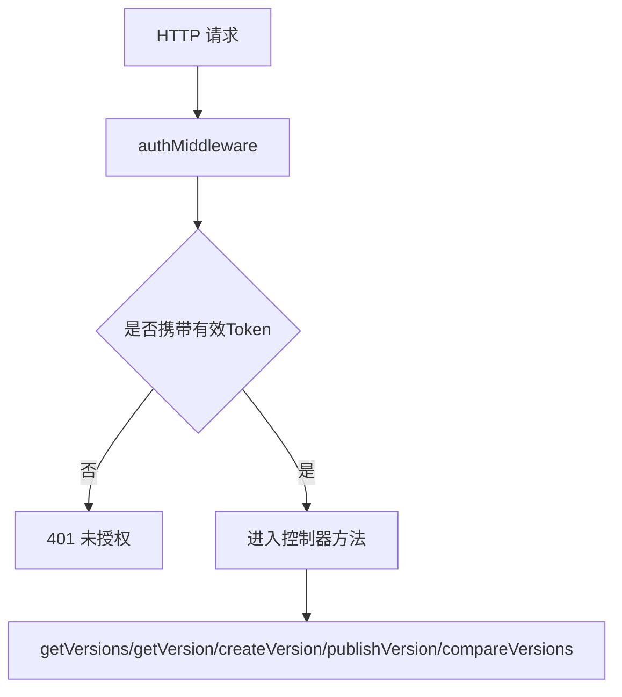
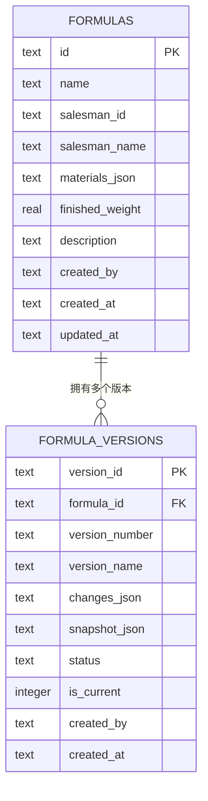
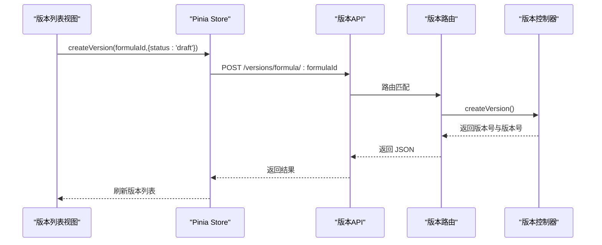
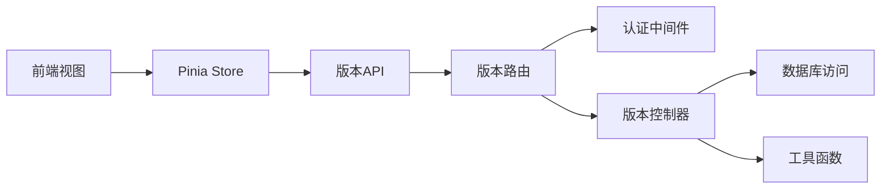

# 版本控制器

<cite>
**本文引用的文件**
- [backend/src/controllers/versionController.ts](file://backend/src/controllers/versionController.ts)
- [backend/src/routes/versions.ts](file://backend/src/routes/versions.ts)
- [backend/src/middleware/auth.ts](file://backend/src/middleware/auth.ts)
- [backend/src/config/database.ts](file://backend/src/config/database.ts)
- [backend/src/utils/helpers.ts](file://backend/src/utils/helpers.ts)
- [frontend/src/views/versions/VersionList.vue](file://frontend/src/views/versions/VersionList.vue)
- [frontend/src/views/versions/VersionCompare.vue](file://frontend/src/views/versions/VersionCompare.vue)
- [frontend/src/stores/version.ts](file://frontend/src/stores/version.ts)
- [frontend/src/api/version.ts](file://frontend/src/api/version.ts)
- [backend/DATABASE_DOC.md](file://backend/DATABASE_DOC.md)
- [backend/src/scripts/init.sql](file://backend/src/scripts/init.sql)
</cite>

## 目录
1. [简介](#简介)
2. [项目结构](#项目结构)
3. [核心组件](#核心组件)
4. [架构总览](#架构总览)
5. [详细组件分析](#详细组件分析)
6. [依赖关系分析](#依赖关系分析)
7. [性能考量](#性能考量)
8. [故障排除指南](#故障排除指南)
9. [结论](#结论)
10. [附录](#附录)

## 简介
本文件面向“版本控制器”的完整实现，覆盖版本创建、版本对比与版本发布三大流程，解释版本历史记录管理、差异计算算法与版本状态控制，并提供版本管理策略、数据一致性保证与回滚机制说明。文档同时包含前端交互示例、性能优化建议与故障排除指南，帮助开发者与产品人员理解并高效使用版本控制系统。

## 项目结构
版本控制功能由前后端协同实现：
- 后端提供 REST 接口与数据库访问层，负责版本生命周期管理与差异计算。
- 前端通过 Pinia Store 调用 API，提供版本列表、版本对比与快照查看等界面。

图表来源
- [backend/src/routes/versions.ts:1-17](file://backend/src/routes/versions.ts#L1-L17)
- [backend/src/controllers/versionController.ts:1-270](file://backend/src/controllers/versionController.ts#L1-L270)
- [backend/src/config/database.ts:1-70](file://backend/src/config/database.ts#L1-L70)
- [backend/src/utils/helpers.ts:1-86](file://backend/src/utils/helpers.ts#L1-L86)
- [backend/src/middleware/auth.ts:1-38](file://backend/src/middleware/auth.ts#L1-L38)
- [frontend/src/views/versions/VersionList.vue:1-173](file://frontend/src/views/versions/VersionList.vue#L1-L173)
- [frontend/src/views/versions/VersionCompare.vue:1-146](file://frontend/src/views/versions/VersionCompare.vue#L1-L146)
- [frontend/src/stores/version.ts:1-83](file://frontend/src/stores/version.ts#L1-L83)
- [frontend/src/api/version.ts:1-35](file://frontend/src/api/version.ts#L1-L35)

章节来源
- [backend/src/routes/versions.ts:1-17](file://backend/src/routes/versions.ts#L1-L17)
- [frontend/src/views/versions/VersionList.vue:1-173](file://frontend/src/views/versions/VersionList.vue#L1-L173)
- [frontend/src/views/versions/VersionCompare.vue:1-146](file://frontend/src/views/versions/VersionCompare.vue#L1-L146)
- [frontend/src/stores/version.ts:1-83](file://frontend/src/stores/version.ts#L1-L83)
- [frontend/src/api/version.ts:1-35](file://frontend/src/api/version.ts#L1-L35)

## 核心组件
- 版本控制器：提供版本列表查询、版本详情、手动创建版本、发布版本与版本对比等接口。
- 版本路由：绑定控制器方法到 REST 路径，统一鉴权。
- 数据库访问：封装 SQLite 查询与事务，支持 WAL 模式与外键约束。
- 工具函数：提供 ID 生成、时间格式、JSON 安全解析与命名转换等通用能力。
- 前端 Store/API：封装版本相关请求，管理版本列表、当前版本与对比结果。
- 前端视图：版本列表展示、快照弹窗、版本对比界面与操作按钮。

章节来源
- [backend/src/controllers/versionController.ts:1-270](file://backend/src/controllers/versionController.ts#L1-L270)
- [backend/src/routes/versions.ts:1-17](file://backend/src/routes/versions.ts#L1-L17)
- [backend/src/config/database.ts:1-70](file://backend/src/config/database.ts#L1-L70)
- [backend/src/utils/helpers.ts:1-86](file://backend/src/utils/helpers.ts#L1-L86)
- [frontend/src/stores/version.ts:1-83](file://frontend/src/stores/version.ts#L1-L83)
- [frontend/src/api/version.ts:1-35](file://frontend/src/api/version.ts#L1-L35)

## 架构总览
版本控制采用“前后端分离 + 数据库存储快照”的架构：
- 前端通过 API 请求版本列表、创建版本、发布版本与版本对比。
- 后端控制器在数据库中持久化版本快照与状态，确保可追溯性。
- 版本对比基于快照 JSON 的字段级差异计算，支持业务员、描述与原料数量等维度。

图表来源
- [frontend/src/views/versions/VersionList.vue:108-110](file://frontend/src/views/versions/VersionList.vue#L108-L110)
- [frontend/src/stores/version.ts:12-22](file://frontend/src/stores/version.ts#L12-L22)
- [frontend/src/api/version.ts:19-21](file://frontend/src/api/version.ts#L19-L21)
- [backend/src/routes/versions.ts:12-12](file://backend/src/routes/versions.ts#L12-L12)
- [backend/src/controllers/versionController.ts:7-35](file://backend/src/controllers/versionController.ts#L7-L35)
- [backend/src/config/database.ts:44-55](file://backend/src/config/database.ts#L44-L55)

## 详细组件分析

### 版本控制器（后端）
版本控制器提供以下关键能力：
- 获取版本列表：支持按状态过滤，按创建时间倒序返回。
- 获取版本详情：返回快照与变更记录的 JSON 结构。
- 创建版本：从当前配方生成快照，自动递增版本号，设置为当前版本。
- 发布版本：将目标版本置为已发布，同时将同配方其他草稿/已发布版本归档。
- 版本对比：比较两个版本的快照，统计差异并返回摘要与明细。

图表来源
- [backend/src/controllers/versionController.ts:1-270](file://backend/src/controllers/versionController.ts#L1-L270)
- [backend/src/config/database.ts:44-61](file://backend/src/config/database.ts#L44-L61)
- [backend/src/utils/helpers.ts:3-86](file://backend/src/utils/helpers.ts#L3-L86)

章节来源
- [backend/src/controllers/versionController.ts:6-35](file://backend/src/controllers/versionController.ts#L6-L35)
- [backend/src/controllers/versionController.ts:37-58](file://backend/src/controllers/versionController.ts#L37-L58)
- [backend/src/controllers/versionController.ts:60-111](file://backend/src/controllers/versionController.ts#L60-L111)
- [backend/src/controllers/versionController.ts:113-157](file://backend/src/controllers/versionController.ts#L113-L157)
- [backend/src/controllers/versionController.ts:159-269](file://backend/src/controllers/versionController.ts#L159-L269)

### 版本路由与鉴权
- 路由统一挂载认证中间件，确保只有登录用户可访问版本接口。
- 提供版本列表、详情、创建、发布与对比的 REST 端点。

图表来源
- [backend/src/middleware/auth.ts:13-31](file://backend/src/middleware/auth.ts#L13-L31)
- [backend/src/routes/versions.ts:10-16](file://backend/src/routes/versions.ts#L10-L16)

章节来源
- [backend/src/routes/versions.ts:1-17](file://backend/src/routes/versions.ts#L1-L17)
- [backend/src/middleware/auth.ts:1-38](file://backend/src/middleware/auth.ts#L1-L38)

### 数据模型与一致性
- 版本表 schema：包含版本 ID、配方 ID、版本号、版本名称、快照 JSON、变更 JSON、状态、是否当前版本、创建人与创建时间等字段。
- 快照 JSON：保存配方名称、业务员信息、原料列表与描述等完整上下文，用于对比与回溯。
- 一致性保障：数据库启用外键约束与级联删除；发布时通过事务更新多条记录，确保状态一致性。

图表来源
- [backend/DATABASE_DOC.md:67-99](file://backend/DATABASE_DOC.md#L67-L99)
- [backend/DATABASE_DOC.md:125-173](file://backend/DATABASE_DOC.md#L125-L173)
- [backend/src/scripts/init.sql:77-91](file://backend/src/scripts/init.sql#L77-L91)

章节来源
- [backend/DATABASE_DOC.md:125-173](file://backend/DATABASE_DOC.md#L125-L173)
- [backend/src/scripts/init.sql:77-91](file://backend/src/scripts/init.sql#L77-L91)

### 前端交互与状态管理
- 版本列表：支持状态筛选、创建版本、发布版本与快照查看。
- 版本对比：选择两个版本进行对比，展示差异摘要与明细。
- Store/API：封装请求逻辑，集中处理 loading 状态与错误提示。

图表来源
- [frontend/src/views/versions/VersionList.vue:114-118](file://frontend/src/views/versions/VersionList.vue#L114-L118)
- [frontend/src/stores/version.ts:33-44](file://frontend/src/stores/version.ts#L33-L44)
- [frontend/src/api/version.ts:25-27](file://frontend/src/api/version.ts#L25-L27)
- [backend/src/routes/versions.ts:14-14](file://backend/src/routes/versions.ts#L14-L14)
- [backend/src/controllers/versionController.ts:60-111](file://backend/src/controllers/versionController.ts#L60-L111)

章节来源
- [frontend/src/views/versions/VersionList.vue:1-173](file://frontend/src/views/versions/VersionList.vue#L1-L173)
- [frontend/src/views/versions/VersionCompare.vue:1-146](file://frontend/src/views/versions/VersionCompare.vue#L1-L146)
- [frontend/src/stores/version.ts:1-83](file://frontend/src/stores/version.ts#L1-L83)
- [frontend/src/api/version.ts:1-35](file://frontend/src/api/version.ts#L1-L35)

## 依赖关系分析
- 控制器依赖数据库访问与工具函数，确保 SQL 执行与数据转换的一致性。
- 路由依赖认证中间件，统一鉴权入口。
- 前端 Store 依赖 API 封装，API 再依赖后端路由。
- 数据库层通过 WAL 模式提升并发读写性能，外键约束保障参照完整性。

图表来源
- [frontend/src/views/versions/VersionList.vue:74-81](file://frontend/src/views/versions/VersionList.vue#L74-L81)
- [frontend/src/stores/version.ts:1-83](file://frontend/src/stores/version.ts#L1-L83)
- [frontend/src/api/version.ts:1-35](file://frontend/src/api/version.ts#L1-L35)
- [backend/src/routes/versions.ts:1-17](file://backend/src/routes/versions.ts#L1-L17)
- [backend/src/middleware/auth.ts:1-38](file://backend/src/middleware/auth.ts#L1-L38)
- [backend/src/controllers/versionController.ts:1-270](file://backend/src/controllers/versionController.ts#L1-L270)
- [backend/src/config/database.ts:1-70](file://backend/src/config/database.ts#L1-L70)
- [backend/src/utils/helpers.ts:1-86](file://backend/src/utils/helpers.ts#L1-L86)

章节来源
- [backend/src/controllers/versionController.ts:1-270](file://backend/src/controllers/versionController.ts#L1-L270)
- [backend/src/routes/versions.ts:1-17](file://backend/src/routes/versions.ts#L1-L17)
- [backend/src/middleware/auth.ts:1-38](file://backend/src/middleware/auth.ts#L1-L38)
- [backend/src/config/database.ts:1-70](file://backend/src/config/database.ts#L1-L70)
- [backend/src/utils/helpers.ts:1-86](file://backend/src/utils/helpers.ts#L1-L86)

## 性能考量
- 数据库层面
  - 使用 WAL 模式提升并发读取性能，减少锁竞争。
  - 为配方与版本号建立复合索引，加速版本查询与去重。
  - 通过事务批量更新状态，避免多次往返导致的延迟。
- 接口层面
  - 列表查询支持按状态过滤，减少不必要的数据传输。
  - 快照 JSON 仅在需要时解析，避免重复解析带来的开销。
- 前端层面
  - Store 统一管理 loading 状态，避免重复请求。
  - 对比结果缓存于 Store，减少重复对比请求。

章节来源
- [backend/src/config/database.ts:21-23](file://backend/src/config/database.ts#L21-L23)
- [backend/src/config/database.ts:89-91](file://backend/src/config/database.ts#L89-L91)
- [backend/src/controllers/versionController.ts:139-150](file://backend/src/controllers/versionController.ts#L139-L150)
- [frontend/src/stores/version.ts:12-22](file://frontend/src/stores/version.ts#L12-L22)

## 故障排除指南
- 401 未授权
  - 现象：访问版本接口返回未提供认证令牌或令牌无效。
  - 处理：确认请求头携带有效的 Bearer Token，检查令牌是否过期。
  - 参考
    - [backend/src/middleware/auth.ts:13-31](file://backend/src/middleware/auth.ts#L13-L31)
- 版本不存在
  - 现象：获取版本详情或发布版本时报错。
  - 处理：确认版本 ID 正确且属于当前配方。
  - 参考
    - [backend/src/controllers/versionController.ts:45-47](file://backend/src/controllers/versionController.ts#L45-L47)
    - [backend/src/controllers/versionController.ts:122-124](file://backend/src/controllers/versionController.ts#L122-L124)
- 数据库连接失败
  - 现象：启动服务时报数据库连接失败。
  - 处理：检查数据库路径与权限，确认 WAL 与外键已启用。
  - 参考
    - [backend/src/config/database.ts:10-30](file://backend/src/config/database.ts#L10-L30)
- 版本对比异常
  - 现象：对比接口报错或返回空差异。
  - 处理：确认传入两个版本 ID 且属于同一配方；检查快照 JSON 结构。
  - 参考
    - [backend/src/controllers/versionController.ts:165-168](file://backend/src/controllers/versionController.ts#L165-L168)
    - [backend/src/controllers/versionController.ts:179-182](file://backend/src/controllers/versionController.ts#L179-L182)

章节来源
- [backend/src/middleware/auth.ts:13-31](file://backend/src/middleware/auth.ts#L13-L31)
- [backend/src/controllers/versionController.ts:45-47](file://backend/src/controllers/versionController.ts#L45-L47)
- [backend/src/controllers/versionController.ts:122-124](file://backend/src/controllers/versionController.ts#L122-L124)
- [backend/src/config/database.ts:10-30](file://backend/src/config/database.ts#L10-L30)
- [backend/src/controllers/versionController.ts:165-168](file://backend/src/controllers/versionController.ts#L165-L168)
- [backend/src/controllers/versionController.ts:179-182](file://backend/src/controllers/versionController.ts#L179-L182)

## 结论
版本控制器通过“快照 + 状态 + 对比”的设计，实现了配方版本的完整生命周期管理。后端以数据库为核心，前端以 Store/API 为桥梁，形成清晰的职责边界。通过外键约束、WAL 模式与事务更新，系统在一致性与性能之间取得平衡。建议在生产环境中结合日志监控与缓存策略，进一步提升稳定性与用户体验。

## 附录

### 版本创建流程（手动快照）
- 输入：配方 ID、版本名称（可选）、状态（默认草稿）。
- 流程：
  1) 校验配方存在性。
  2) 计算新版本号（基于最新版本号递增主版本号）。
  3) 将旧当前版本标记为非当前。
  4) 插入新版本记录，快照来自当前配方数据。
- 输出：返回新版本 ID 与版本号。
- 参考
  - [backend/src/controllers/versionController.ts:60-111](file://backend/src/controllers/versionController.ts#L60-L111)

### 版本发布流程
- 输入：版本 ID。
- 流程：
  1) 校验版本与关联配方存在。
  2) 将同配方其他草稿/已发布版本归档并取消当前标记。
  3) 将目标版本置为已发布并标记为当前版本。
- 输出：发布成功消息。
- 参考
  - [backend/src/controllers/versionController.ts:113-157](file://backend/src/controllers/versionController.ts#L113-L157)

### 版本对比算法
- 输入：配方 ID、版本 A、版本 B。
- 流程：
  1) 加载两个版本快照。
  2) 比较业务员、描述与原料列表。
  3) 统计新增、修改、删除数量与差异明细。
- 输出：差异摘要与明细列表。
- 参考
  - [backend/src/controllers/versionController.ts:159-269](file://backend/src/controllers/versionController.ts#L159-L269)

### 版本状态控制
- 状态枚举：草稿（draft）、已发布（published）、已归档（archived）。
- 当前版本：同一配方仅有一个 is_current=1 的版本。
- 参考
  - [backend/DATABASE_DOC.md:129-140](file://backend/DATABASE_DOC.md#L129-L140)

### 数据一致性与回滚机制
- 一致性：
  - 外键约束：删除配方时级联删除其版本。
  - 事务：发布流程中批量更新状态，保证原子性。
- 回滚：
  - 当前实现不直接提供“回滚”操作，可通过创建新版本的方式“撤销”变更。
  - 若需严格回滚，可在应用层扩展“回滚版本”逻辑，基于快照重建历史版本。
- 参考
  - [backend/src/scripts/init.sql:88-88](file://backend/src/scripts/init.sql#L88-L88)
  - [backend/src/controllers/versionController.ts:139-150](file://backend/src/controllers/versionController.ts#L139-L150)