# 营养分析控制器

<cite>
**本文档引用的文件**
- [nutritionController.ts](file://backend/src/controllers/nutritionController.ts)
- [nutrition.ts](file://backend/src/routes/nutrition.ts)
- [helpers.ts](file://backend/src/utils/helpers.ts)
- [validate.ts](file://backend/src/middleware/validate.ts)
- [importNutritionData.ts](file://backend/src/scripts/importNutritionData.ts)
- [DATABASE_DOC.md](file://backend/DATABASE_DOC.md)
- [nutrition.ts](file://frontend/src/api/nutrition.ts)
</cite>

## 目录
1. [简介](#简介)
2. [项目结构](#项目结构)
3. [核心组件](#核心组件)
4. [架构概览](#架构概览)
5. [详细组件分析](#详细组件分析)
6. [依赖关系分析](#依赖关系分析)
7. [性能考虑](#性能考虑)
8. [故障排除指南](#故障排除指南)
9. [结论](#结论)

## 简介

营养分析控制器是TingStudio系统中的核心模块，负责处理营养成分计算、标准对照和合规性检查功能。该控制器实现了完整的营养数据分析流程，包括原料营养数据管理、配方营养汇总计算、营养标准配置和合规性验证等功能。

系统采用前后端分离架构，后端使用Node.js + Express框架，数据库采用SQLite，前端使用Vue.js构建用户界面。营养分析控制器通过RESTful API提供服务，支持多种营养分析场景和标准配置。

## 项目结构

营养分析控制器位于后端项目的控制器层，与路由、中间件、工具函数等模块协同工作：

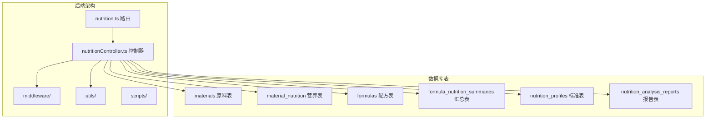

**图表来源**
- [nutrition.ts:1-31](file://backend/src/routes/nutrition.ts#L1-L31)
- [nutritionController.ts:1-641](file://backend/src/controllers/nutritionController.ts#L1-L641)

**章节来源**
- [nutrition.ts:1-31](file://backend/src/routes/nutrition.ts#L1-L31)
- [nutritionController.ts:1-641](file://backend/src/controllers/nutritionController.ts#L1-L641)

## 核心组件

### 营养成分字段定义

控制器定义了完整的营养成分字段列表，涵盖宏量营养素、微量营养素和特殊指标：

| 营养素类别 | 字段名称 | 单位 | 说明 |
|------------|----------|------|------|
| 能量 | energy | kJ | 营养素参考值：8400 kJ |
| 蛋白质 | protein | g | 营养素参考值：60 g |
| 脂肪 | fat | g | 营养素参考值：60 g |
| 碳水化合物 | carbohydrate | g | 营养素参考值：300 g |
| 膳食纤维 | fiber | g | 营养素参考值：25 g |
| 糖类 | sugars | g | - |
| 钠 | sodium | mg | 营养素参考值：2000 mg |
| 钾 | potassium | mg | 营养素参考值：2000 mg |
| 钙 | calcium | mg | 营养素参考值：800 mg |
| 铁 | iron | mg | 营养素参考值：15 mg |
| 锌 | zinc | mg | 营养素参考值：15 mg |
| 镁 | magnesium | mg | - |
| 磷 | phosphorus | mg | - |
| 维生素A | vitaminA | μg | 营养素参考值：800 μg |
| 维生素C | vitaminC | mg | 营养素参考值：100 mg |
| 维生素D | vitaminD | μg | 营养素参考值：5 μg |
| 维生素E | vitaminE | mg | 营养素参考值：14 mg |
| 维生素K | vitaminK | μg | 营养素参考值：800 μg |
| 维生素B1 | vitaminB1 | mg | 营养素参考值：1.4 mg |
| 维生素B2 | vitaminB2 | mg | 营养素参考值：1.4 mg |
| 维生素B3 | vitaminB3 | mg | 营养素参考值：14 mg |
| 维生素B6 | vitaminB6 | mg | 营养素参考值：1.4 mg |
| 维生素B12 | vitaminB12 | μg | 营养素参考值：2.4 μg |
| 叶酸 | folate | μg | 营养素参考值：400 μg |
| 胆固醇 | cholesterol | mg | 营养素参考值：300 mg |
| 反式脂肪 | transFat | g | - |
| 饱和脂肪 | saturatedFat | g | - |

### 营养素参考值(NRV)

系统内置了标准的营养素参考值，用于计算营养素参考值百分比：

- **能量**: 8400 kJ (每日推荐摄入量)
- **蛋白质**: 60 g
- **脂肪**: 60 g  
- **碳水化合物**: 300 g
- **钠**: 2000 mg
- **其他维生素和矿物质**: 对应的每日推荐摄入量

**章节来源**
- [nutritionController.ts:7-53](file://backend/src/controllers/nutritionController.ts#L7-L53)

## 架构概览

营养分析控制器采用分层架构设计，各组件职责明确：

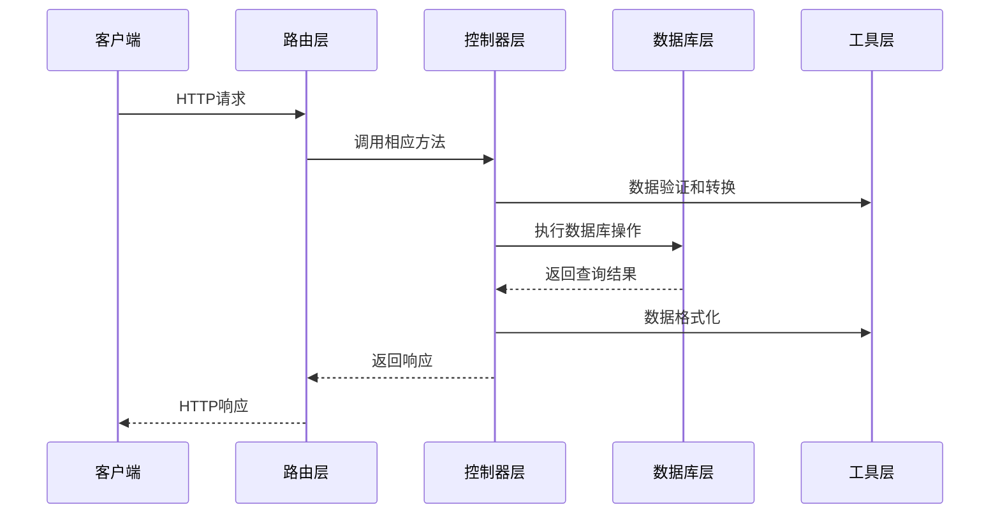

**图表来源**
- [nutrition.ts:1-31](file://backend/src/routes/nutrition.ts#L1-L31)
- [nutritionController.ts:1-641](file://backend/src/controllers/nutritionController.ts#L1-L641)

### API接口设计

控制器提供了完整的RESTful API接口：

| 方法 | 路径 | 功能 | 参数 |
|------|------|------|------|
| GET | `/nutrition/material/:materialId` | 获取原料营养数据 | materialId |
| PUT | `/nutrition/material/:materialId` | 设置/更新原料营养数据 | materialId, per100g, dataSource, notes |
| POST | `/nutrition/calculate/:formulaId` | 计算配方营养汇总 | formulaId |
| GET | `/nutrition/tables/:formulaId` | 获取营养计算表格数据 | formulaId |
| GET | `/nutrition/profiles` | 获取营养标准列表 | category |
| POST | `/nutrition/profiles` | 创建营养标准 | name, description, category, targetValues, toleranceRanges, mandatoryFields |
| POST | `/nutrition/compliance/:formulaId` | 合规性检查 | formulaId, profileId |

**章节来源**
- [nutrition.ts:13-31](file://backend/src/routes/nutrition.ts#L13-L31)
- [nutritionController.ts:55-641](file://backend/src/controllers/nutritionController.ts#L55-L641)

## 详细组件分析

### 原料营养数据管理

#### 数据标准化机制

控制器实现了智能的数据键名标准化功能，能够处理不同格式的营养数据：

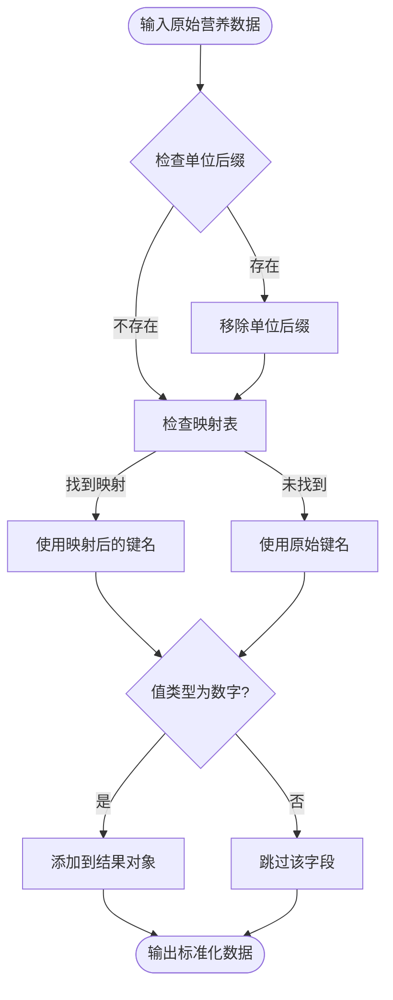

**图表来源**
- [nutritionController.ts:16-44](file://backend/src/controllers/nutritionController.ts#L16-L44)

#### 数据存储结构

原料营养数据以JSON格式存储在`material_nutrition`表中：

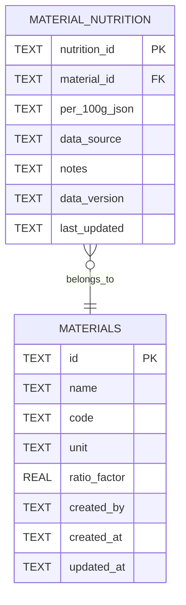

**图表来源**
- [DATABASE_DOC.md:200-227](file://backend/DATABASE_DOC.md#L200-L227)

**章节来源**
- [nutritionController.ts:55-121](file://backend/src/controllers/nutritionController.ts#L55-L121)

### 配方营养计算引擎

#### 计算算法实现

配方营养计算采用加权平均算法，基于原料的用量和营养密度：

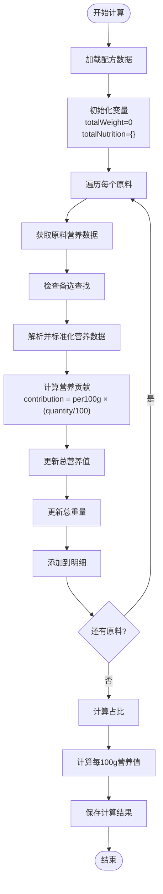

**图表来源**
- [nutritionController.ts:124-242](file://backend/src/controllers/nutritionController.ts#L124-L242)

#### 关键计算公式

1. **营养贡献计算**:
   ```
   contribution[field] = per100g[field] × (quantity / 100)
   ```

2. **总营养值累积**:
   ```
   totalNutrition[field] += contribution[field]
   ```

3. **配方占比计算**:
   ```
   percentage = (weightContribution / totalWeight) × 100
   ```

4. **每100g营养值计算**:
   ```
   per100g[field] = (totalNutrition[field] / totalWeight) × 100
   ```

**章节来源**
- [nutritionController.ts:124-242](file://backend/src/controllers/nutritionController.ts#L124-L242)

### 营养标准对照机制

#### 标准配置数据结构

营养标准以JSON格式存储，支持灵活的配置：

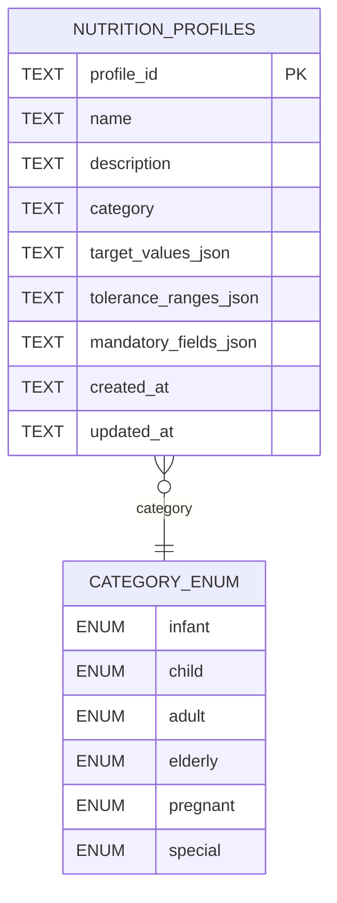

**图表来源**
- [DATABASE_DOC.md:200-212](file://backend/DATABASE_DOC.md#L200-L212)

#### 标准对照算法

合规性检查采用分级判定机制：

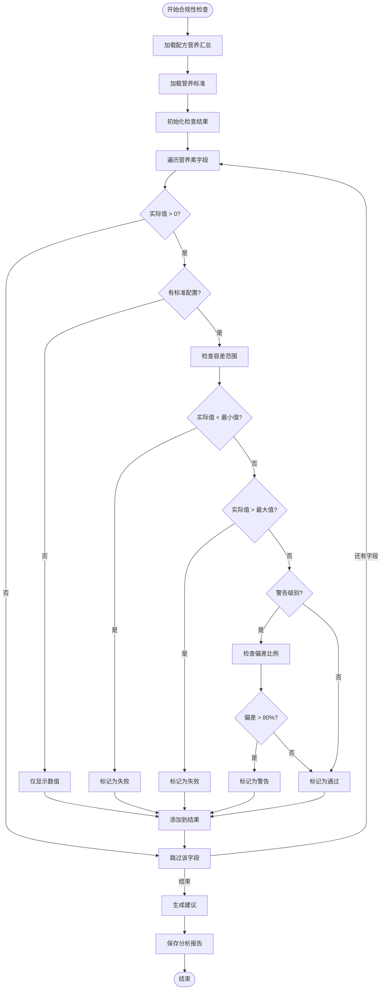

**图表来源**
- [nutritionController.ts:290-407](file://backend/src/controllers/nutritionController.ts#L290-L407)

**章节来源**
- [nutritionController.ts:244-407](file://backend/src/controllers/nutritionController.ts#L244-L407)

### Excel格式营养计算表

#### 技术处理规则

系统实现了与Excel完全一致的技术处理规则：

| 营养素 | 0界限值 | 计算公式 | 标签规则 |
|--------|---------|----------|----------|
| 能量 | ≤17 kJ | 由蛋白质、脂肪、碳水计算 | 归零后重新计算 |
| 蛋白质 | ≤0.5 g | 蛋白质 × 17 kJ/g | ≥80%标示值 |
| 脂肪 | ≤0.5 g | 脂肪 × 37 kJ/g | ≤120%标示值 |
| 碳水化合物 | ≤0.5 g | 碳水 × 17 kJ/g | ≥80%标示值 |
| 钠 | ≤5 mg | - | ≤120%标示值 |

#### 计算流程

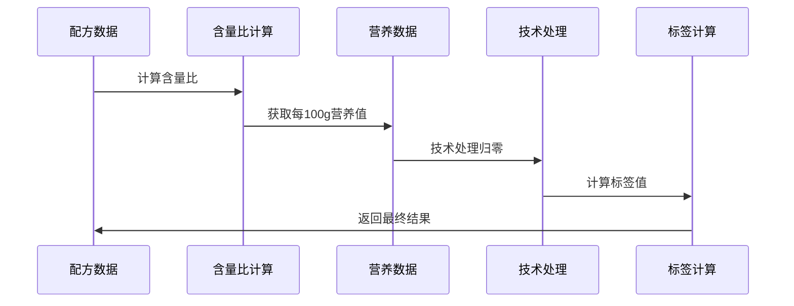

**图表来源**
- [nutritionController.ts:420-640](file://backend/src/controllers/nutritionController.ts#L420-L640)

**章节来源**
- [nutritionController.ts:420-640](file://backend/src/controllers/nutritionController.ts#L420-L640)

## 依赖关系分析

### 数据库依赖关系

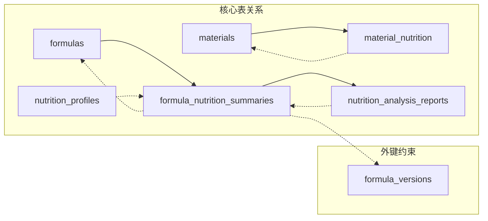

**图表来源**
- [DATABASE_DOC.md:200-227](file://backend/DATABASE_DOC.md#L200-L227)

### 内部依赖关系

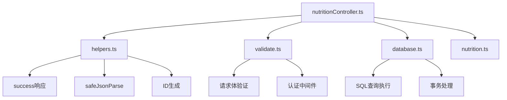

**图表来源**
- [nutritionController.ts:1-6](file://backend/src/controllers/nutritionController.ts#L1-L6)
- [helpers.ts:1-86](file://backend/src/utils/helpers.ts#L1-L86)
- [validate.ts:1-68](file://backend/src/middleware/validate.ts#L1-L68)

**章节来源**
- [nutritionController.ts:1-641](file://backend/src/controllers/nutritionController.ts#L1-L641)
- [helpers.ts:1-86](file://backend/src/utils/helpers.ts#L1-L86)
- [validate.ts:1-68](file://backend/src/middleware/validate.ts#L1-L68)

## 性能考虑

### 数据库优化策略

1. **索引优化**
   - `material_nutrition(material_id)` - 主要查询条件
   - `formula_nutrition_summaries(formula_id)` - 汇总查询
   - `nutrition_profiles(category)` - 标准查询
   - `nutrition_analysis_reports(formula_id)` - 报告查询

2. **批量查询优化**
   - 原料营养数据批量获取，减少数据库往返
   - 含量比系数批量查询，避免逐条查询

3. **缓存策略**
   - 营养标准数据可缓存到内存中
   - 常用查询结果可考虑短期缓存

### 计算性能优化

1. **算法复杂度**
   - 配方计算：O(n)，n为原料数量
   - 合规性检查：O(m×n)，m为标准字段数，n为配方字段数

2. **内存使用优化**
   - 使用流式处理避免大对象创建
   - 及时释放临时变量

3. **并发处理**
   - 支持多配方并行计算
   - 数据库连接池管理

## 故障排除指南

### 常见错误类型

| 错误类型 | 触发条件 | 解决方案 |
|----------|----------|----------|
| 数据库连接失败 | 数据库不可访问 | 检查数据库配置和连接状态 |
| 配方不存在 | formula_id无效 | 验证配方ID是否存在 |
| 营养数据缺失 | 原料无营养数据 | 检查原料营养数据导入 |
| 标准配置错误 | 标准数据格式不正确 | 验证JSON格式和字段完整性 |
| 权限不足 | 用户无访问权限 | 检查用户角色和认证状态 |

### 异常处理机制

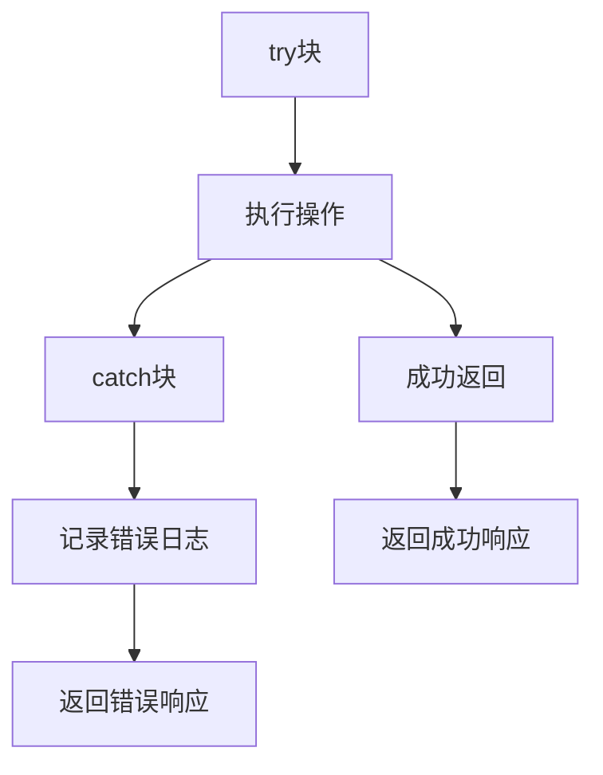

**图表来源**
- [nutritionController.ts:55-121](file://backend/src/controllers/nutritionController.ts#L55-L121)

### 调试建议

1. **启用详细日志**
   ```javascript
   // 在开发环境中启用详细日志
   process.env.DEBUG = 'nutrition:*';
   ```

2. **数据验证**
   - 检查输入参数格式
   - 验证JSON数据完整性
   - 确认数据库连接状态

3. **性能监控**
   - 监控数据库查询时间
   - 分析内存使用情况
   - 检查并发处理能力

**章节来源**
- [nutritionController.ts:55-121](file://backend/src/controllers/nutritionController.ts#L55-L121)

## 结论

营养分析控制器是一个功能完整、架构清晰的营养数据分析系统。它实现了以下关键特性：

1. **完整的营养分析流程**：从原料数据管理到配方计算，再到合规性检查
2. **灵活的标准配置**：支持多种营养标准和自定义配置
3. **精确的计算算法**：基于科学的营养学原理和Excel标准
4. **完善的错误处理**：全面的异常捕获和用户友好的错误提示
5. **良好的性能表现**：优化的数据库查询和计算算法

该控制器为TingStudio系统提供了强大的营养分析能力，支持各种复杂的营养计算需求，并确保了数据的准确性和合规性。通过模块化的架构设计和清晰的代码组织，该系统具有良好的可维护性和扩展性。