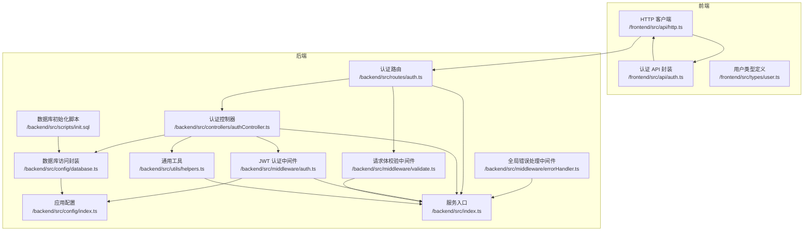
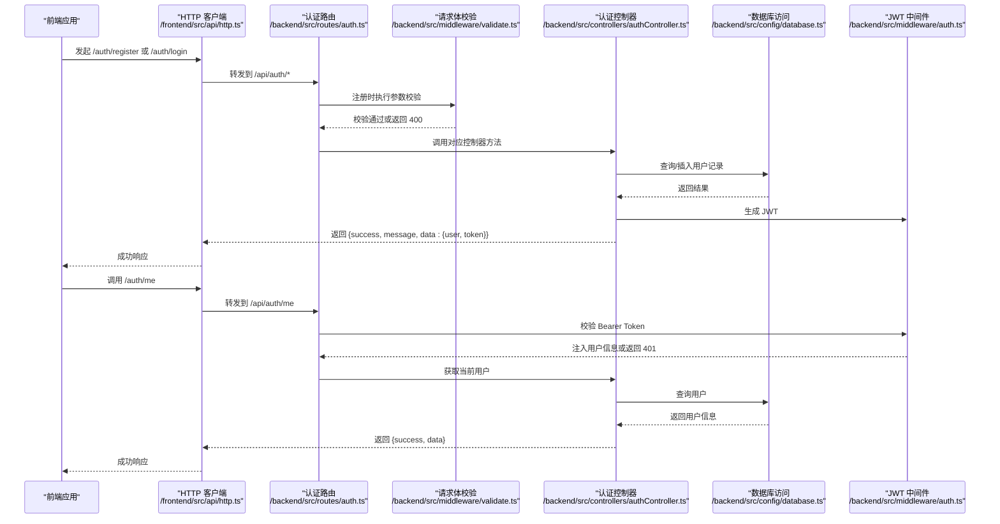
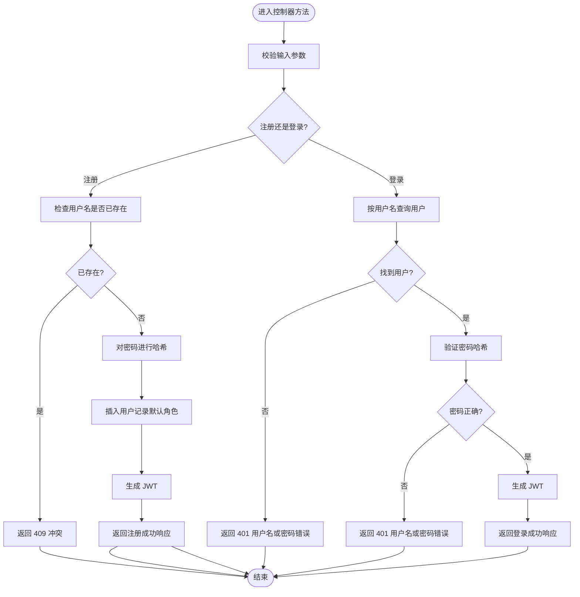
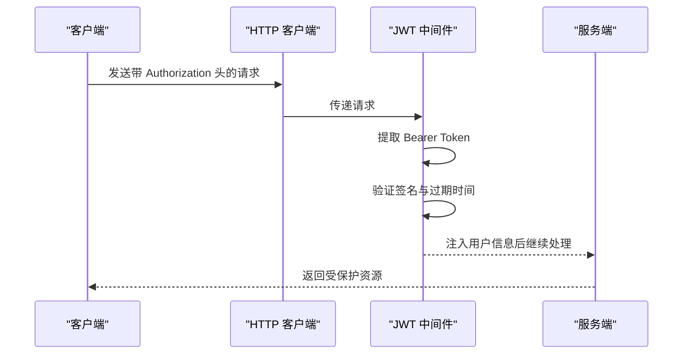
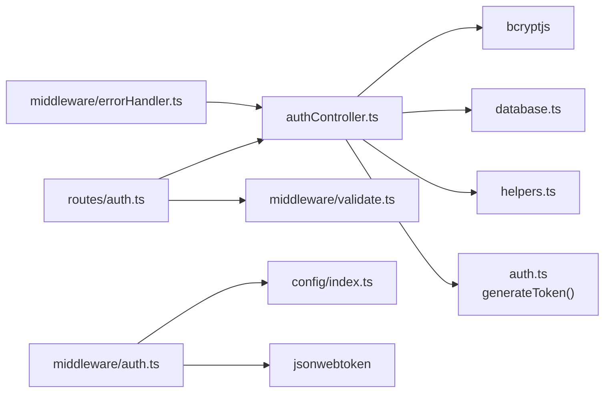

# 认证控制器

<cite>
**本文引用的文件**
- [backend/src/controllers/authController.ts](file://backend/src/controllers/authController.ts)
- [backend/src/routes/auth.ts](file://backend/src/routes/auth.ts)
- [backend/src/middleware/auth.ts](file://backend/src/middleware/auth.ts)
- [backend/src/middleware/validate.ts](file://backend/src/middleware/validate.ts)
- [backend/src/utils/helpers.ts](file://backend/src/utils/helpers.ts)
- [backend/src/config/index.ts](file://backend/src/config/index.ts)
- [backend/src/config/database.ts](file://backend/src/config/database.ts)
- [backend/src/middleware/errorHandler.ts](file://backend/src/middleware/errorHandler.ts)
- [backend/src/scripts/init.sql](file://backend/src/scripts/init.sql)
- [backend/src/index.ts](file://backend/src/index.ts)
- [frontend/src/api/auth.ts](file://frontend/src/api/auth.ts)
- [frontend/src/api/http.ts](file://frontend/src/api/http.ts)
- [frontend/src/types/user.ts](file://frontend/src/types/user.ts)
</cite>

## 目录
1. [简介](#简介)
2. [项目结构](#项目结构)
3. [核心组件](#核心组件)
4. [架构总览](#架构总览)
5. [详细组件分析](#详细组件分析)
6. [依赖关系分析](#依赖关系分析)
7. [性能考虑](#性能考虑)
8. [故障排除指南](#故障排除指南)
9. [结论](#结论)
10. [附录](#附录)

## 简介
本文件面向“认证控制器”的实现进行系统性技术文档化，覆盖以下目标：
- 用户注册、登录与获取当前用户信息三类核心功能的实现逻辑
- JWT 令牌生成与验证机制
- 密码加密处理策略
- 用户角色与权限管理现状
- 错误处理策略与安全最佳实践
- 认证流程图、常见问题解决方案与 API 调用演示

## 项目结构
后端采用按职责分层的组织方式：路由层负责路径与参数校验；中间件层负责认证与错误处理；控制器层负责业务逻辑；配置与工具层提供数据库访问、JWT 配置与通用工具。

图表来源
- [backend/src/routes/auth.ts:1-20](file://backend/src/routes/auth.ts#L1-L20)
- [backend/src/controllers/authController.ts:1-89](file://backend/src/controllers/authController.ts#L1-L89)
- [backend/src/middleware/auth.ts:1-38](file://backend/src/middleware/auth.ts#L1-L38)
- [backend/src/middleware/validate.ts:1-68](file://backend/src/middleware/validate.ts#L1-L68)
- [backend/src/utils/helpers.ts:1-86](file://backend/src/utils/helpers.ts#L1-L86)
- [backend/src/config/index.ts:1-24](file://backend/src/config/index.ts#L1-L24)
- [backend/src/config/database.ts:1-70](file://backend/src/config/database.ts#L1-L70)
- [backend/src/middleware/errorHandler.ts:1-51](file://backend/src/middleware/errorHandler.ts#L1-L51)
- [backend/src/scripts/init.sql:1-228](file://backend/src/scripts/init.sql#L1-L228)
- [backend/src/index.ts:1-61](file://backend/src/index.ts#L1-L61)
- [frontend/src/api/http.ts:1-58](file://frontend/src/api/http.ts#L1-L58)
- [frontend/src/api/auth.ts:1-36](file://frontend/src/api/auth.ts#L1-L36)
- [frontend/src/types/user.ts:1-22](file://frontend/src/types/user.ts#L1-L22)

章节来源
- [backend/src/index.ts:1-61](file://backend/src/index.ts#L1-L61)
- [backend/src/routes/auth.ts:1-20](file://backend/src/routes/auth.ts#L1-L20)

## 核心组件
- 认证控制器：实现注册、登录、获取当前用户信息三大接口，负责与数据库交互、密码哈希与 JWT 签发。
- 认证中间件：从请求头提取 Bearer Token 并验证其有效性，将解码后的用户信息注入到请求上下文。
- 请求体校验中间件：对注册接口的用户名与密码进行格式与长度校验。
- 数据库访问封装：提供 query 与 transaction 方法，兼容 MySQL 风格的 [rows] 结构，支持 SQLite。
- JWT 配置：通过环境变量配置密钥与过期时间。
- 全局错误处理：统一捕获异常并返回结构化错误响应。
- 前端 HTTP 客户端：自动附加 Authorization 头，统一对 401 进行登出处理，并集中展示错误消息。

章节来源
- [backend/src/controllers/authController.ts:1-89](file://backend/src/controllers/authController.ts#L1-L89)
- [backend/src/middleware/auth.ts:1-38](file://backend/src/middleware/auth.ts#L1-L38)
- [backend/src/middleware/validate.ts:1-68](file://backend/src/middleware/validate.ts#L1-L68)
- [backend/src/config/database.ts:1-70](file://backend/src/config/database.ts#L1-L70)
- [backend/src/config/index.ts:1-24](file://backend/src/config/index.ts#L1-L24)
- [backend/src/middleware/errorHandler.ts:1-51](file://backend/src/middleware/errorHandler.ts#L1-L51)
- [frontend/src/api/http.ts:1-58](file://frontend/src/api/http.ts#L1-L58)

## 架构总览
认证相关请求在后端的典型流转如下：

图表来源
- [backend/src/routes/auth.ts:1-20](file://backend/src/routes/auth.ts#L1-L20)
- [backend/src/middleware/validate.ts:1-68](file://backend/src/middleware/validate.ts#L1-L68)
- [backend/src/controllers/authController.ts:1-89](file://backend/src/controllers/authController.ts#L1-L89)
- [backend/src/config/database.ts:1-70](file://backend/src/config/database.ts#L1-L70)
- [backend/src/middleware/auth.ts:1-38](file://backend/src/middleware/auth.ts#L1-L38)
- [frontend/src/api/http.ts:1-58](file://frontend/src/api/http.ts#L1-L58)

## 详细组件分析

### 认证控制器（注册、登录、获取当前用户）
- 注册
  - 输入校验：用户名长度与密码长度规则由请求体校验中间件保障。
  - 去重检查：按用户名查询是否存在重复。
  - 密码加密：使用 bcrypt 对明文密码进行哈希存储。
  - 角色默认值：新用户默认角色为“formulist”。
  - 令牌签发：注册成功后签发 JWT 并返回给客户端。
  - 响应格式：统一使用工具函数构建成功响应。
- 登录
  - 用户查找：按用户名查询用户记录。
  - 密码验证：使用 bcrypt.compare 对比哈希。
  - 令牌签发：登录成功后签发 JWT 并返回给客户端。
  - 响应脱敏：返回用户信息时移除敏感字段。
- 获取当前用户
  - 使用认证中间件注入的用户标识查询用户信息。
  - 返回用户基本信息（不含密码等敏感字段）。

图表来源
- [backend/src/controllers/authController.ts:8-39](file://backend/src/controllers/authController.ts#L8-L39)
- [backend/src/controllers/authController.ts:41-71](file://backend/src/controllers/authController.ts#L41-L71)
- [backend/src/controllers/authController.ts:73-88](file://backend/src/controllers/authController.ts#L73-L88)
- [backend/src/middleware/validate.ts:16-67](file://backend/src/middleware/validate.ts#L16-L67)

章节来源
- [backend/src/controllers/authController.ts:1-89](file://backend/src/controllers/authController.ts#L1-L89)
- [backend/src/middleware/validate.ts:1-68](file://backend/src/middleware/validate.ts#L1-L68)
- [backend/src/utils/helpers.ts:26-29](file://backend/src/utils/helpers.ts#L26-L29)

### JWT 令牌生成与验证机制
- 生成
  - 使用对称密钥（JWT_SECRET）与配置的过期时间（JWT_EXPIRES_IN）签发 JWT。
  - 生成的 payload 包含用户标识与用户名。
- 验证
  - 从 Authorization 请求头中提取 Bearer Token。
  - 使用相同密钥验证签名与有效期。
  - 验证通过后将用户信息注入到请求上下文，供后续控制器使用。
- 前端集成
  - HTTP 客户端在请求前自动附加 Authorization: Bearer token。
  - 响应拦截器对 401 统一处理，清除本地 token 并跳转至登录页。

图表来源
- [backend/src/middleware/auth.ts:13-31](file://backend/src/middleware/auth.ts#L13-L31)
- [backend/src/middleware/auth.ts:33-37](file://backend/src/middleware/auth.ts#L33-L37)
- [frontend/src/api/http.ts:12-19](file://frontend/src/api/http.ts#L12-L19)
- [frontend/src/api/http.ts:33-37](file://frontend/src/api/http.ts#L33-L37)

章节来源
- [backend/src/middleware/auth.ts:1-38](file://backend/src/middleware/auth.ts#L1-L38)
- [backend/src/config/index.ts:10-13](file://backend/src/config/index.ts#L10-L13)
- [frontend/src/api/http.ts:1-58](file://frontend/src/api/http.ts#L1-L58)

### 密码加密处理
- bcrypt 哈希
  - 注册时对明文密码进行哈希存储。
  - 登录时使用 bcrypt.compare 对比哈希，避免明文比较。
- 安全建议
  - 使用足够高的成本因子（如 12）可进一步提升安全性。
  - 定期轮换 JWT 密钥并启用刷新令牌策略（建议）。

章节来源
- [backend/src/controllers/authController.ts:24](file://backend/src/controllers/authController.ts#L24)
- [backend/src/controllers/authController.ts:55](file://backend/src/controllers/authController.ts#L55)

### 用户权限管理
- 角色字段
  - 用户表包含 role 字段，默认值为 “formulist”，允许值限定为 “admin” 或 “formulist”。
- 当前实现
  - 控制器未在注册时显式设置角色，而是依赖数据库默认值。
  - 登录与获取当前用户接口未进行角色级权限校验。
- 建议
  - 在需要区分管理员与普通用户的接口处增加角色校验中间件。
  - 对关键操作（如删除、修改他人数据）实施 RBAC 策略。

章节来源
- [backend/src/scripts/init.sql:8-15](file://backend/src/scripts/init.sql#L8-L15)
- [backend/src/controllers/authController.ts:27](file://backend/src/controllers/authController.ts#L27)
- [backend/src/controllers/authController.ts:76-84](file://backend/src/controllers/authController.ts#L76-L84)

### 错误处理策略
- 控制器层
  - 注册/登录/获取当前用户均使用 try/catch 捕获异常并返回统一结构化错误。
- 中间件层
  - 参数校验中间件返回 400 与具体错误列表。
  - JWT 中间件返回 401 未提供或无效令牌。
  - 全局错误处理中间件统一处理 SQLite 约束错误、JWT 错误与文件大小限制等。
- 前端
  - 响应拦截器对非 success 场景统一提示错误。
  - 对 401 自动清理本地 token 并跳转登录。

章节来源
- [backend/src/controllers/authController.ts:36-38](file://backend/src/controllers/authController.ts#L36-L38)
- [backend/src/controllers/authController.ts:68-70](file://backend/src/controllers/authController.ts#L68-L70)
- [backend/src/controllers/authController.ts:85-87](file://backend/src/controllers/authController.ts#L85-L87)
- [backend/src/middleware/validate.ts:60-66](file://backend/src/middleware/validate.ts#L60-L66)
- [backend/src/middleware/auth.ts:15-30](file://backend/src/middleware/auth.ts#L15-L30)
- [backend/src/middleware/errorHandler.ts:13-40](file://backend/src/middleware/errorHandler.ts#L13-L40)
- [frontend/src/api/http.ts:21-43](file://frontend/src/api/http.ts#L21-L43)

### 数据库与用户表结构
- 用户表 users
  - 主键 id、唯一用户名 username、密码 password、角色 role、创建时间 created_at。
  - 角色枚举约束为 admin/formulist。
- 初始化脚本
  - 提供完整的建表与索引初始化 SQL，确保开发与生产环境一致。

章节来源
- [backend/src/scripts/init.sql:7-15](file://backend/src/scripts/init.sql#L7-L15)

### API 调用演示（路径与要点）
- 注册
  - 路径：/api/auth/register
  - 方法：POST
  - 参数：username（2-50 字符）、password（≥6）
  - 响应：包含 user 与 token 的成功结构
- 登录
  - 路径：/api/auth/login
  - 方法：POST
  - 参数：username、password
  - 响应：包含 user 与 token 的成功结构
- 获取当前用户
  - 路径：/api/auth/me
  - 方法：GET
  - 需携带 Authorization: Bearer <token>
  - 响应：当前用户信息

章节来源
- [backend/src/routes/auth.ts:9-19](file://backend/src/routes/auth.ts#L9-L19)
- [frontend/src/api/auth.ts:8-16](file://frontend/src/api/auth.ts#L8-L16)
- [frontend/src/api/http.ts:12-19](file://frontend/src/api/http.ts#L12-L19)

## 依赖关系分析
- 控制器依赖
  - bcrypt：密码哈希与对比
  - 数据库访问封装：query 与事务
  - JWT 中间件：generateToken
  - 通用工具：success 响应构建
- 中间件依赖
  - jsonwebtoken：JWT 签发与验证
  - 配置：JWT 密钥与过期时间
- 路由依赖
  - 请求体校验中间件用于注册接口
  - 认证中间件用于受保护接口

图表来源
- [backend/src/controllers/authController.ts:1-7](file://backend/src/controllers/authController.ts#L1-L7)
- [backend/src/routes/auth.ts:3-5](file://backend/src/routes/auth.ts#L3-L5)
- [backend/src/middleware/auth.ts:1-4](file://backend/src/middleware/auth.ts#L1-L4)
- [backend/src/config/index.ts:10-13](file://backend/src/config/index.ts#L10-L13)
- [backend/src/middleware/errorHandler.ts:1-51](file://backend/src/middleware/errorHandler.ts#L1-L51)

章节来源
- [backend/src/controllers/authController.ts:1-89](file://backend/src/controllers/authController.ts#L1-L89)
- [backend/src/routes/auth.ts:1-20](file://backend/src/routes/auth.ts#L1-L20)
- [backend/src/middleware/auth.ts:1-38](file://backend/src/middleware/auth.ts#L1-L38)
- [backend/src/config/index.ts:1-24](file://backend/src/config/index.ts#L1-L24)

## 性能考虑
- 密码哈希成本
  - 当前使用固定成本进行哈希，建议根据硬件能力调整成本以平衡安全与性能。
- 数据库查询
  - 用户表对 username 建有唯一索引，查询效率较高。
- 响应构建
  - 统一使用 success 辅助函数，减少重复样板代码。
- 前端缓存
  - 前端在本地缓存用户信息，减少重复请求。

[本节为通用指导，不直接分析具体文件]

## 故障排除指南
- 注册返回 409
  - 可能原因：用户名已存在
  - 处理建议：更换用户名或执行登录
- 登录返回 401
  - 可能原因：用户名或密码错误
  - 处理建议：核对凭据或重置密码
- 获取当前用户返回 404
  - 可能原因：用户被删除或令牌对应的用户不存在
  - 处理建议：重新登录
- 401 未提供认证令牌
  - 可能原因：请求缺少 Authorization 头或格式不正确
  - 处理建议：确认前端已保存 token 并在请求头中附加
- JWT 无效或已过期
  - 可能原因：密钥不匹配或过期
  - 处理建议：重新登录获取新 token
- SQLite 约束冲突
  - 可能原因：违反唯一约束或外键约束
  - 处理建议：检查数据完整性与关联关系

章节来源
- [backend/src/controllers/authController.ts:18-21](file://backend/src/controllers/authController.ts#L18-L21)
- [backend/src/controllers/authController.ts:50-59](file://backend/src/controllers/authController.ts#L50-L59)
- [backend/src/controllers/authController.ts:80-82](file://backend/src/controllers/authController.ts#L80-L82)
- [backend/src/middleware/auth.ts:15-30](file://backend/src/middleware/auth.ts#L15-L30)
- [backend/src/middleware/errorHandler.ts:13-23](file://backend/src/middleware/errorHandler.ts#L13-L23)

## 结论
认证控制器围绕注册、登录与获取当前用户三项核心功能，结合 bcrypt 密码哈希、JWT 令牌机制与统一的错误处理策略，提供了清晰、可维护的实现。当前实现具备良好的扩展性，建议在后续迭代中引入角色级权限校验与刷新令牌机制，以进一步提升安全性与用户体验。

[本节为总结性内容，不直接分析具体文件]

## 附录

### 安全最佳实践清单
- 强制使用 HTTPS 传输
- 定期轮换 JWT 密钥
- 启用刷新令牌与黑名单机制（建议）
- 限制请求频率与文件大小
- 对所有敏感字段进行最小化暴露

[本节为通用指导，不直接分析具体文件]

### 前端认证状态管理要点
- 保存 token 与用户信息到本地存储
- 请求拦截器自动附加 Authorization 头
- 响应拦截器对 401 进行统一登出处理

章节来源
- [frontend/src/api/auth.ts:19-35](file://frontend/src/api/auth.ts#L19-L35)
- [frontend/src/api/http.ts:12-19](file://frontend/src/api/http.ts#L12-L19)
- [frontend/src/api/http.ts:33-37](file://frontend/src/api/http.ts#L33-L37)
- [frontend/src/types/user.ts:1-22](file://frontend/src/types/user.ts#L1-L22)