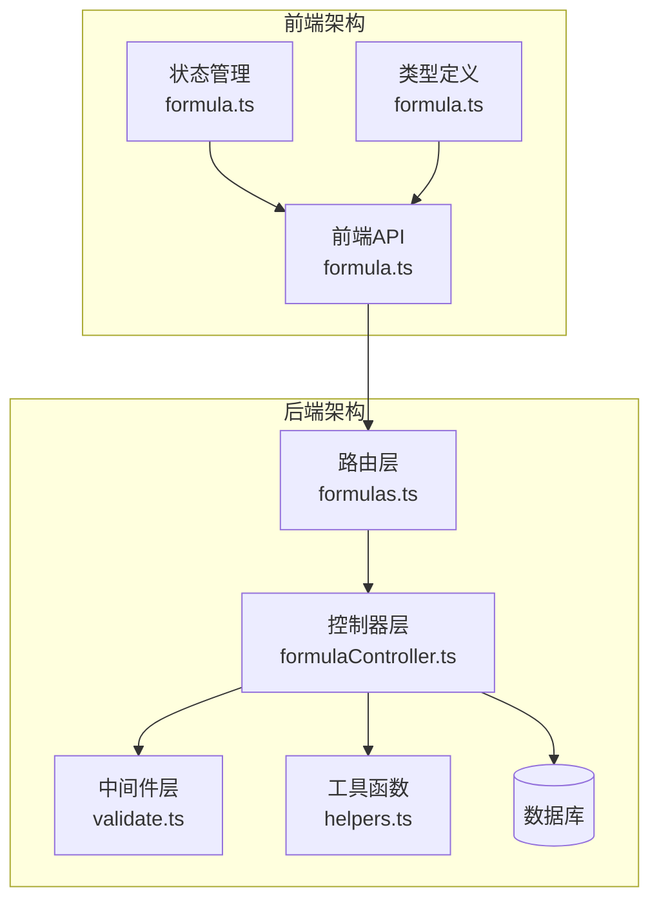
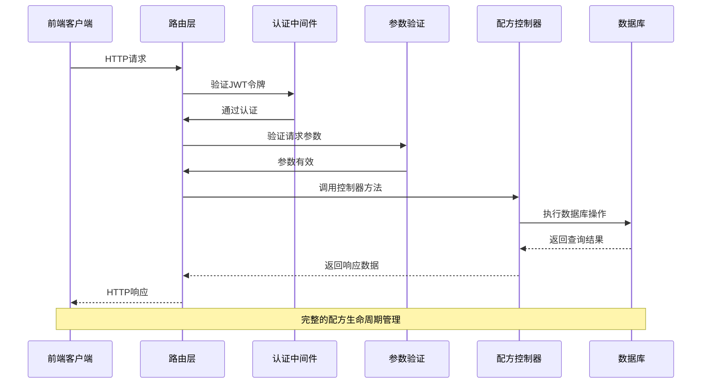
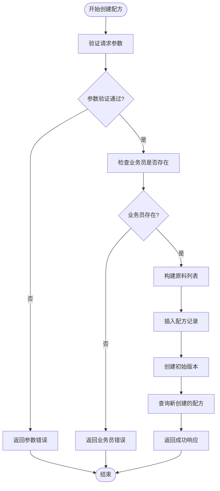
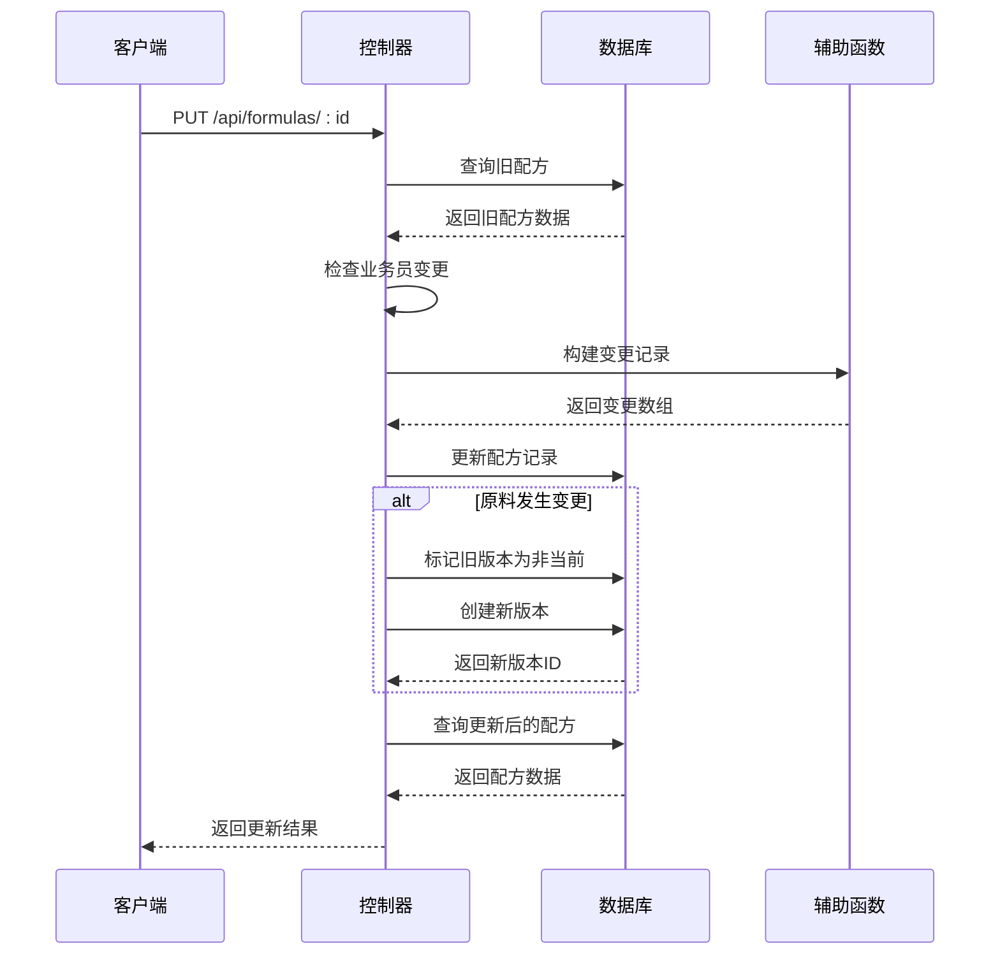
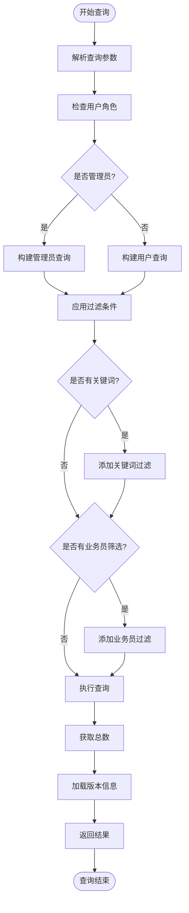
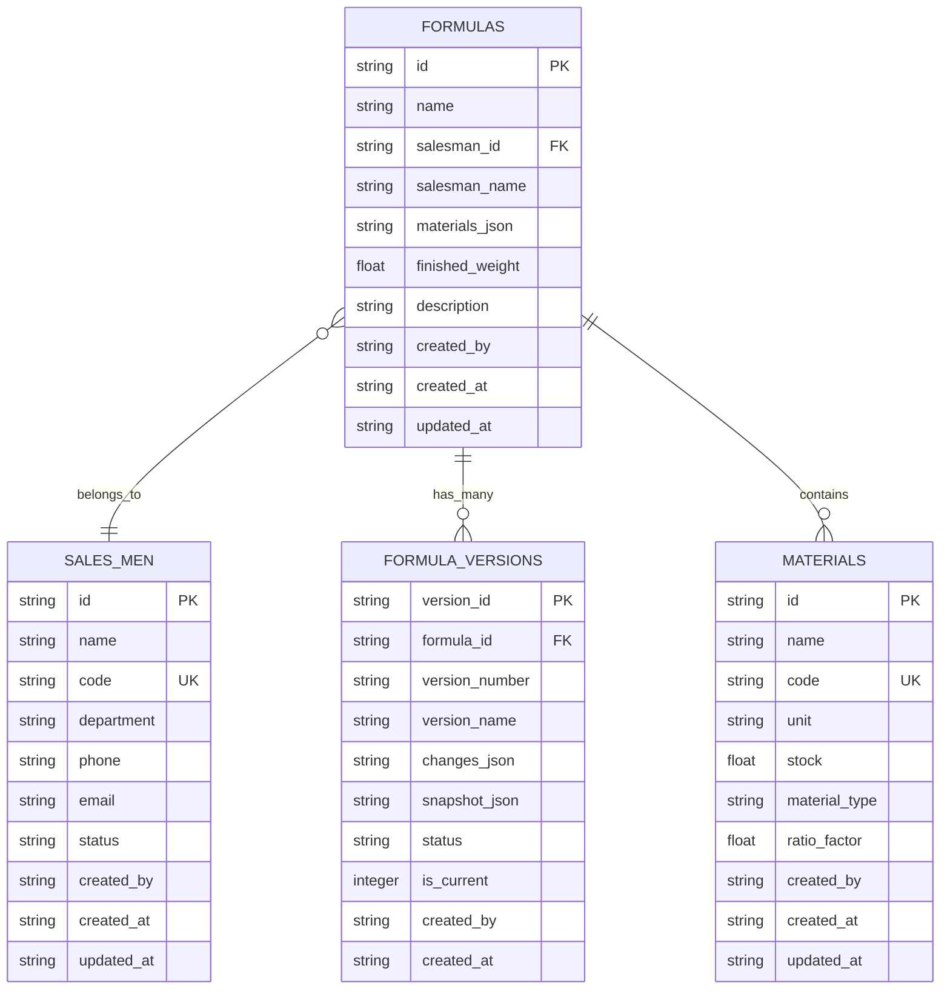
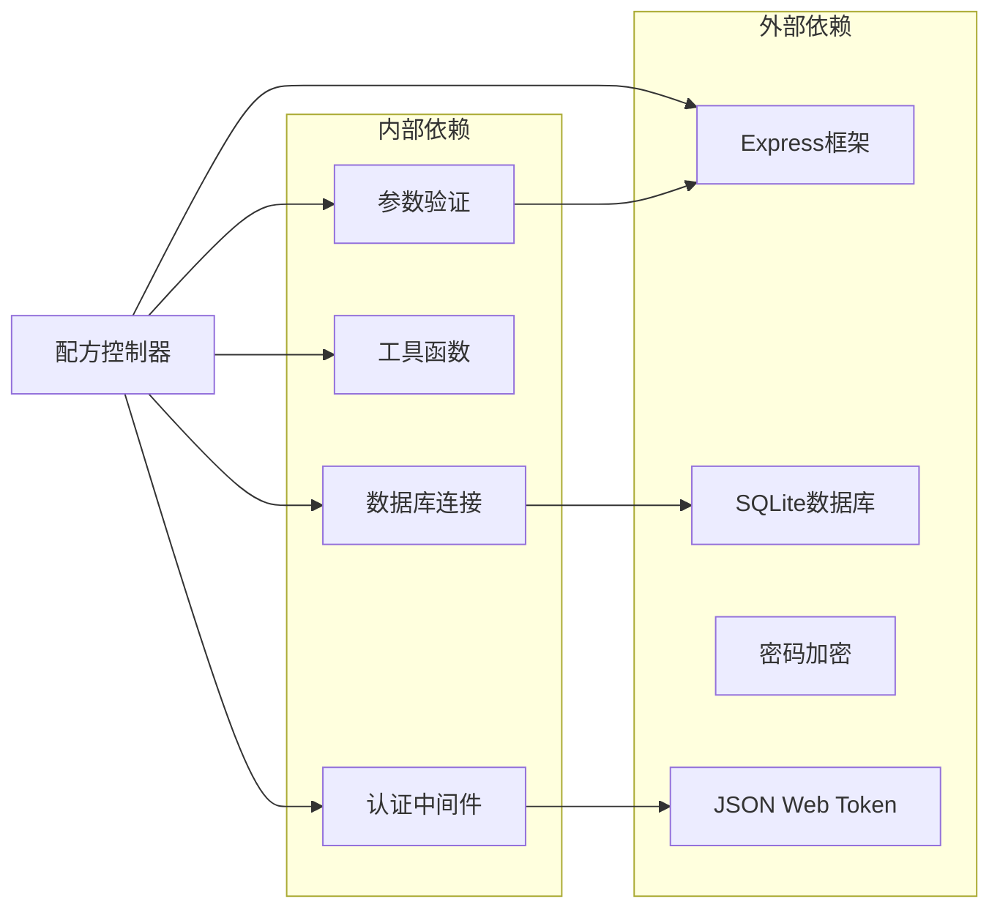
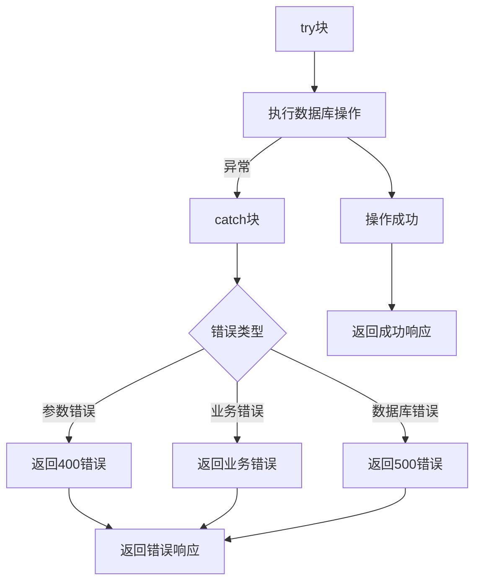

# 配方控制器

<cite>
**本文档引用的文件**
- [formulaController.ts](file://backend/src/controllers/formulaController.ts)
- [formulas.ts](file://backend/src/routes/formulas.ts)
- [helpers.ts](file://backend/src/utils/helpers.ts)
- [validate.ts](file://backend/src/middleware/validate.ts)
- [DATABASE_DOC.md](file://backend/DATABASE_DOC.md)
- [API_DOC.md](file://backend/API_DOC.md)
- [formula.ts](file://frontend/src/types/formula.ts)
- [formula.ts](file://frontend/src/stores/formula.ts)
- [formula.ts](file://frontend/src/api/formula.ts)
</cite>

## 目录
1. [简介](#简介)
2. [项目结构](#项目结构)
3. [核心组件](#核心组件)
4. [架构概览](#架构概览)
5. [详细组件分析](#详细组件分析)
6. [依赖分析](#依赖分析)
7. [性能考虑](#性能考虑)
8. [故障排除指南](#故障排除指南)
9. [结论](#结论)

## 简介

配方控制器是TingStudio系统中的核心业务组件，负责管理配方的完整生命周期。该控制器实现了配方的创建、编辑、删除和查询功能，并与原料管理系统建立了紧密的关联关系。系统采用前后端分离架构，后端使用Node.js + Express构建RESTful API，前端使用Vue.js + Pinia进行状态管理。

配方控制器不仅处理基本的CRUD操作，还实现了复杂的版本管理机制、数据完整性约束和业务规则验证。通过JSON字段存储配方的原料列表，系统提供了灵活的数据结构来支持各种配方需求。

## 项目结构

配方控制器位于后端项目的控制器目录中，与路由、中间件和工具函数协同工作：

**图表来源**
- [formulas.ts:1-28](file://backend/src/routes/formulas.ts#L1-L28)
- [formulaController.ts:1-287](file://backend/src/controllers/formulaController.ts#L1-L287)

**章节来源**
- [formulas.ts:1-28](file://backend/src/routes/formulas.ts#L1-L28)
- [formulaController.ts:1-287](file://backend/src/controllers/formulaController.ts#L1-L287)

## 核心组件

配方控制器包含以下核心功能模块：

### 1. 配方查询模块
- **列表查询**：支持关键词搜索、业务员筛选、分页查询
- **详情查询**：获取单个配方的完整信息
- **原料关联查询**：根据原料ID查找使用该原料的所有配方

### 2. 配方管理模块
- **创建配方**：验证输入参数，创建配方并生成初始版本
- **更新配方**：智能检测变更，生成新版本
- **删除配方**：级联删除关联的版本数据

### 3. 版本控制模块
- **版本生成**：自动创建版本快照和变更记录
- **版本比较**：支持版本间差异对比
- **版本状态管理**：draft、published、archived状态控制

**章节来源**
- [formulaController.ts:6-69](file://backend/src/controllers/formulaController.ts#L6-L69)
- [formulaController.ts:88-218](file://backend/src/controllers/formulaController.ts#L88-L218)
- [formulaController.ts:220-243](file://backend/src/controllers/formulaController.ts#L220-L243)

## 架构概览

配方控制器采用经典的MVC架构模式，通过中间件实现请求验证和身份认证：

**图表来源**
- [formulas.ts:12-27](file://backend/src/routes/formulas.ts#L12-L27)
- [formulaController.ts:88-130](file://backend/src/controllers/formulaController.ts#L88-L130)

## 详细组件分析

### 配方创建流程

配方创建是系统中最复杂的业务流程之一，涉及多个步骤和数据完整性检查：

**图表来源**
- [formulaController.ts:88-130](file://backend/src/controllers/formulaController.ts#L88-L130)

#### 关键实现细节

1. **参数验证**：使用统一的验证中间件确保请求数据的完整性
2. **业务员检查**：在创建前验证业务员的存在性
3. **原料处理**：自动补充原料名称，移除不需要的ratioFactor字段
4. **版本管理**：自动创建v1.0初始版本并标记为published状态

**章节来源**
- [formulaController.ts:88-130](file://backend/src/controllers/formulaController.ts#L88-L130)
- [validate.ts:16-67](file://backend/src/middleware/validate.ts#L16-L67)

### 配方更新流程

配方更新实现了智能的版本控制机制，只有当配方发生实质性变更时才创建新版本：

**图表来源**
- [formulaController.ts:132-218](file://backend/src/controllers/formulaController.ts#L132-L218)

#### 版本生成算法

系统实现了智能的版本号生成算法：

1. **版本号解析**：从最新版本中提取主版本号和次版本号
2. **自动递增**：次版本号加1，主版本号保持不变
3. **默认版本**：如果没有历史版本，从v1.0开始

**章节来源**
- [formulaController.ts:167-211](file://backend/src/controllers/formulaController.ts#L167-L211)

### 配方查询流程

配方查询支持多种筛选条件和分页机制：

**图表来源**
- [formulaController.ts:6-69](file://backend/src/controllers/formulaController.ts#L6-L69)

#### 查询优化策略

1. **分页查询**：限制每页最大100条记录，防止内存溢出
2. **批量版本加载**：使用IN查询一次性获取所有配方的版本信息
3. **索引利用**：合理使用数据库索引提高查询性能

**章节来源**
- [formulaController.ts:6-69](file://backend/src/controllers/formulaController.ts#L6-L69)
- [helpers.ts:14-19](file://backend/src/utils/helpers.ts#L14-L19)

### 数据模型设计

配方系统采用JSON字段存储灵活的数据结构：

**图表来源**
- [DATABASE_DOC.md:67-172](file://backend/DATABASE_DOC.md#L67-L172)

#### JSON数据结构

配方的materials_json字段采用标准化的数据结构：

| 字段名 | 类型 | 必填 | 说明 |
|--------|------|------|------|
| materialId | string | 是 | 原料唯一标识 |
| materialName | string | 否 | 原料名称（冗余） |
| quantity | number | 是 | 使用量 |

**章节来源**
- [DATABASE_DOC.md:91-97](file://backend/DATABASE_DOC.md#L91-L97)

## 依赖分析

配方控制器的依赖关系清晰明确，遵循单一职责原则：

**图表来源**
- [formulaController.ts:2-4](file://backend/src/controllers/formulaController.ts#L2-L4)

### 组件耦合度分析

配方控制器与其他组件的耦合度适中：

1. **低耦合**：与Express框架的集成通过标准接口实现
2. **中等耦合**：与数据库的交互通过统一的查询接口
3. **高内聚**：配方相关的所有逻辑都集中在控制器中

**章节来源**
- [formulaController.ts:1-287](file://backend/src/controllers/formulaController.ts#L1-L287)

## 性能考虑

### 查询性能优化

1. **分页限制**：每页最多100条记录，防止大规模数据查询
2. **批量查询**：版本信息采用批量查询减少数据库往返
3. **索引优化**：合理使用数据库索引提高查询效率

### 内存使用优化

1. **流式处理**：大查询结果采用流式处理避免内存溢出
2. **延迟加载**：版本信息按需加载，不强制加载所有版本
3. **数据压缩**：JSON数据在传输前进行必要的压缩

### 缓存策略

虽然当前实现没有显式的缓存机制，但可以通过以下方式优化：

1. **查询结果缓存**：对频繁访问的查询结果进行缓存
2. **版本快照缓存**：对常用的版本快照进行缓存
3. **配置数据缓存**：对静态配置数据进行缓存

## 故障排除指南

### 常见错误类型

1. **参数验证错误**：400错误，通常由于缺少必需字段
2. **业务员不存在**：400错误，业务员ID无效
3. **配方不存在**：404错误，配方ID不存在
4. **数据库错误**：500错误，通常是数据库约束冲突

### 错误处理机制

配方控制器实现了完善的错误处理机制：

**图表来源**
- [formulaController.ts:66-68](file://backend/src/controllers/formulaController.ts#L66-L68)

### 调试建议

1. **日志记录**：在关键操作点添加详细的日志记录
2. **参数验证**：确保所有输入参数都经过严格的验证
3. **事务管理**：对于复杂的多表操作使用数据库事务
4. **资源清理**：确保所有数据库连接和文件句柄都能正确释放

**章节来源**
- [formulaController.ts:66-217](file://backend/src/controllers/formulaController.ts#L66-L217)

## 结论

配方控制器作为TingStudio系统的核心组件，展现了良好的软件工程实践：

### 设计优势

1. **清晰的职责分离**：控制器专注于业务逻辑，路由和中间件各司其职
2. **完整的生命周期管理**：从创建到删除的完整流程覆盖
3. **智能的版本控制**：基于变更的版本生成机制
4. **灵活的数据模型**：JSON字段支持复杂的配方数据结构

### 改进建议

1. **增加缓存层**：为频繁访问的数据添加缓存机制
2. **增强监控**：添加性能监控和错误追踪
3. **完善测试**：增加单元测试和集成测试覆盖率
4. **文档完善**：为复杂业务逻辑添加详细的代码注释

配方控制器为整个系统的配方管理提供了坚实的基础，其设计思路和实现方式可以作为类似业务系统的参考模板。