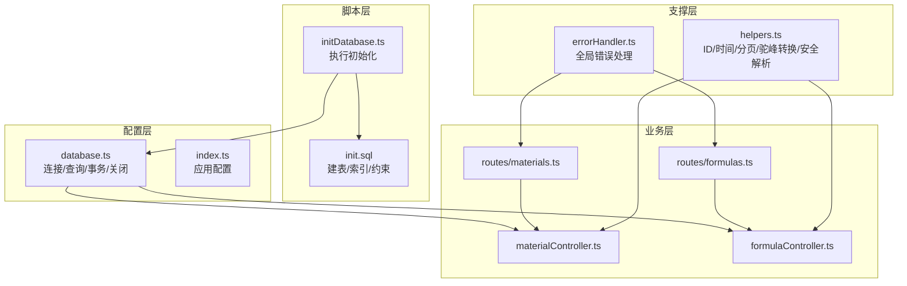
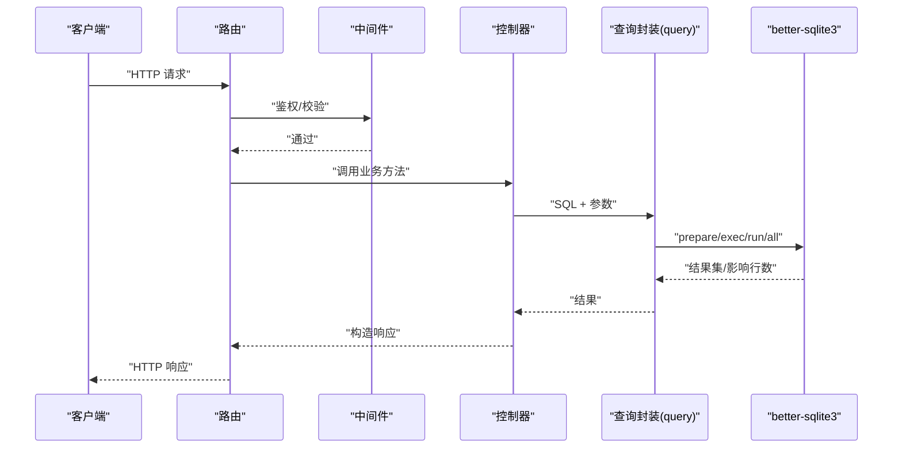
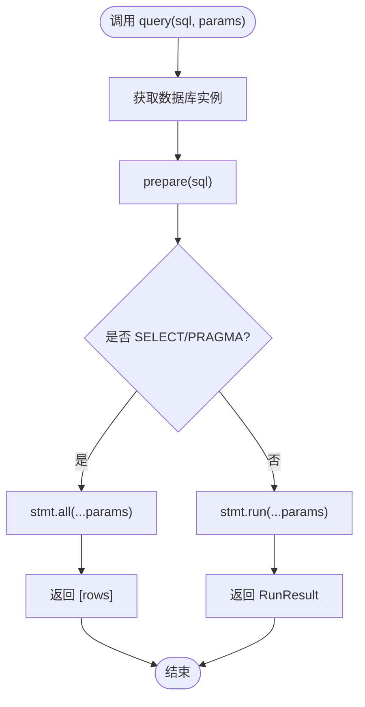
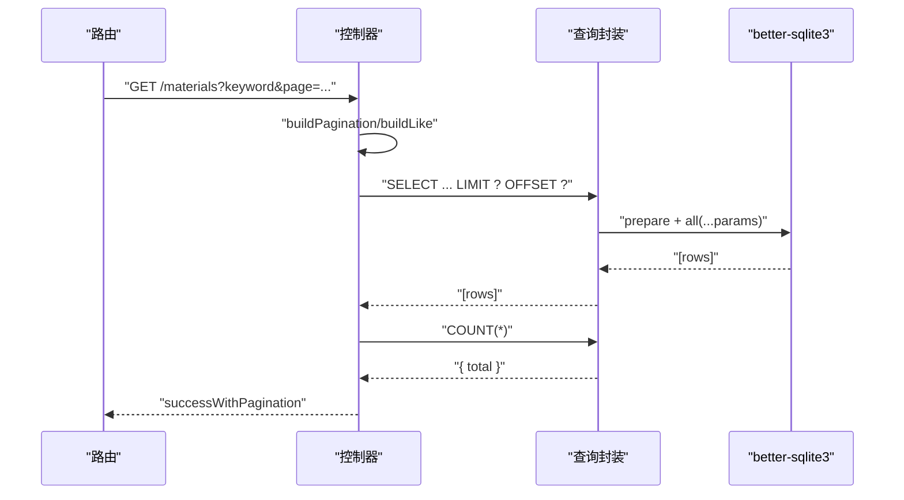
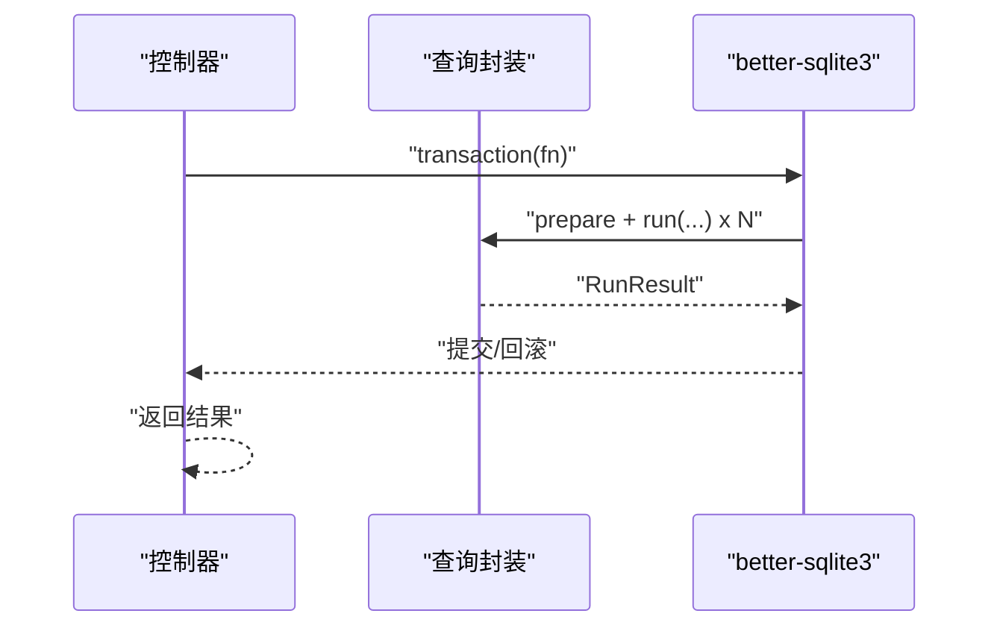
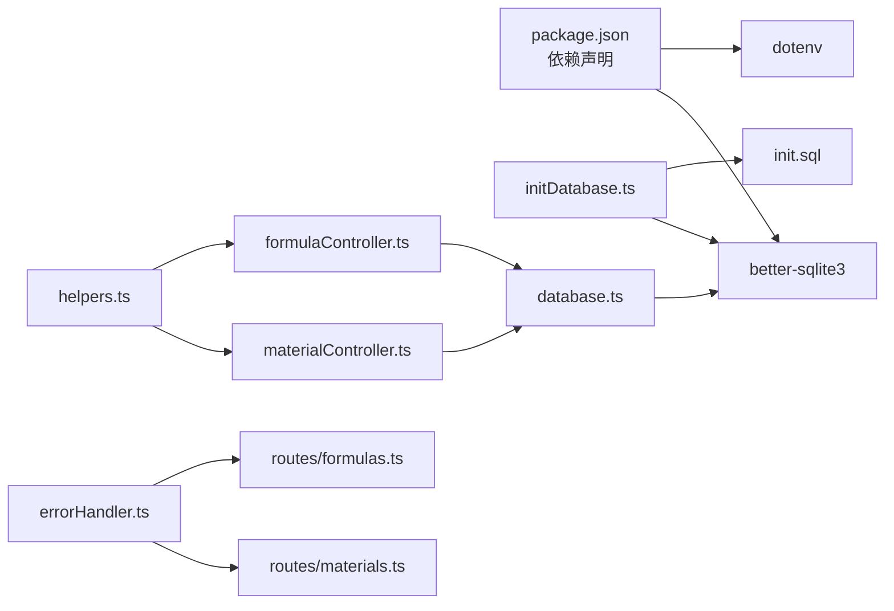

# 数据库集成

<cite>
**本文引用的文件**
- [backend/src/config/database.ts](file://backend/src/config/database.ts)
- [backend/src/config/index.ts](file://backend/src/config/index.ts)
- [backend/DATABASE_DOC.md](file://backend/DATABASE_DOC.md)
- [backend/src/scripts/init.sql](file://backend/src/scripts/init.sql)
- [backend/src/scripts/initDatabase.ts](file://backend/src/scripts/initDatabase.ts)
- [backend/src/utils/helpers.ts](file://backend/src/utils/helpers.ts)
- [backend/src/middleware/errorHandler.ts](file://backend/src/middleware/errorHandler.ts)
- [backend/src/controllers/materialController.ts](file://backend/src/controllers/materialController.ts)
- [backend/src/controllers/formulaController.ts](file://backend/src/controllers/formulaController.ts)
- [backend/src/routes/materials.ts](file://backend/src/routes/materials.ts)
- [backend/src/routes/formulas.ts](file://backend/src/routes/formulas.ts)
- [backend/package.json](file://backend/package.json)
</cite>

## 目录
1. [简介](#简介)
2. [项目结构](#项目结构)
3. [核心组件](#核心组件)
4. [架构总览](#架构总览)
5. [详细组件分析](#详细组件分析)
6. [依赖关系分析](#依赖关系分析)
7. [性能考虑](#性能考虑)
8. [故障排查指南](#故障排查指南)
9. [结论](#结论)
10. [附录](#附录)

## 简介
本文件面向数据库集成场景，围绕 better-sqlite3 在本项目中的配置与连接管理、事务处理、查询封装、参数绑定与错误处理进行系统化说明；同时覆盖数据库初始化流程、表结构与索引设计、迁移策略、备份恢复与性能监控建议，并提供可复用的最佳实践与示例路径。

## 项目结构
后端采用分层架构：配置层负责数据库连接与统一查询封装；脚本层负责数据库初始化；控制器与路由层通过统一查询接口访问数据库；工具与中间件层提供辅助能力与错误处理。

图表来源
- [backend/src/config/database.ts:1-70](file://backend/src/config/database.ts#L1-L70)
- [backend/src/config/index.ts:1-24](file://backend/src/config/index.ts#L1-L24)
- [backend/src/scripts/init.sql:1-228](file://backend/src/scripts/init.sql#L1-L228)
- [backend/src/scripts/initDatabase.ts:1-37](file://backend/src/scripts/initDatabase.ts#L1-L37)
- [backend/src/controllers/materialController.ts:1-129](file://backend/src/controllers/materialController.ts#L1-L129)
- [backend/src/controllers/formulaController.ts:1-287](file://backend/src/controllers/formulaController.ts#L1-L287)
- [backend/src/routes/materials.ts:1-22](file://backend/src/routes/materials.ts#L1-L22)
- [backend/src/routes/formulas.ts:1-28](file://backend/src/routes/formulas.ts#L1-L28)
- [backend/src/utils/helpers.ts:1-86](file://backend/src/utils/helpers.ts#L1-L86)
- [backend/src/middleware/errorHandler.ts:1-51](file://backend/src/middleware/errorHandler.ts#L1-L51)

章节来源
- [backend/src/config/database.ts:1-70](file://backend/src/config/database.ts#L1-L70)
- [backend/src/config/index.ts:1-24](file://backend/src/config/index.ts#L1-L24)
- [backend/src/scripts/init.sql:1-228](file://backend/src/scripts/init.sql#L1-L228)
- [backend/src/scripts/initDatabase.ts:1-37](file://backend/src/scripts/initDatabase.ts#L1-L37)
- [backend/src/utils/helpers.ts:1-86](file://backend/src/utils/helpers.ts#L1-L86)
- [backend/src/middleware/errorHandler.ts:1-51](file://backend/src/middleware/errorHandler.ts#L1-L51)

## 核心组件
- 连接管理与查询封装
  - 连接建立：确保数据目录存在，创建/打开数据库，启用 WAL 与外键约束。
  - 查询封装：统一 prepare + all/run，兼容 SELECT 返回数组与非 SELECT 返回运行结果。
  - 事务封装：基于 better-sqlite3 的 transaction 包装。
  - 连接关闭：优雅关闭数据库连接。
- 配置中心
  - 提供数据库路径、JWT、上传、CORS 等配置项。
- 初始化脚本
  - 一次性执行建表、索引与约束定义。
- 控制器与路由
  - 控制器通过统一查询接口访问数据库，实现 CRUD 与复杂查询。
  - 路由层统一鉴权与参数校验。
- 工具与错误处理
  - ID 生成、时间格式、分页、LIKE 转义、驼峰转换、JSON 安全解析。
  - 全局错误处理对 SQLite 约束冲突、JWT、文件大小等进行分类处理。

章节来源
- [backend/src/config/database.ts:10-70](file://backend/src/config/database.ts#L10-L70)
- [backend/src/config/index.ts:6-23](file://backend/src/config/index.ts#L6-L23)
- [backend/src/scripts/init.sql:1-228](file://backend/src/scripts/init.sql#L1-L228)
- [backend/src/utils/helpers.ts:3-86](file://backend/src/utils/helpers.ts#L3-L86)
- [backend/src/middleware/errorHandler.ts:5-51](file://backend/src/middleware/errorHandler.ts#L5-L51)

## 架构总览
下图展示从路由到控制器、再到数据库查询的整体调用链路与数据流。

图表来源
- [backend/src/routes/materials.ts:1-22](file://backend/src/routes/materials.ts#L1-L22)
- [backend/src/controllers/materialController.ts:6-38](file://backend/src/controllers/materialController.ts#L6-L38)
- [backend/src/config/database.ts:44-55](file://backend/src/config/database.ts#L44-L55)

## 详细组件分析

### 组件一：数据库连接与查询封装
- 连接生命周期
  - 初始化时确保数据目录存在，创建/打开数据库，启用 WAL 与外键约束。
  - 提供获取实例与关闭连接的方法，避免重复初始化与资源泄漏。
- 查询封装
  - 自动识别 SELECT/PRAGMA 与非 SELECT 语句，分别返回行数组或运行结果。
  - 保持与 mysql2 的 [rows] 解构风格兼容，便于控制器解构使用。
- 事务封装
  - 使用 better-sqlite3 的 transaction 包装，简化多语句一致性处理。
- 错误处理
  - 连接失败与查询异常均向上抛出，由全局中间件捕获并统一响应。

图表来源
- [backend/src/config/database.ts:44-55](file://backend/src/config/database.ts#L44-L55)

章节来源
- [backend/src/config/database.ts:10-70](file://backend/src/config/database.ts#L10-L70)

### 组件二：数据库初始化与表结构
- 初始化流程
  - 读取 SQL 文件内容，一次性执行建表、索引与约束。
  - 通过 better-sqlite3 的 exec 支持多条 SQL 一次性执行。
- 表结构与索引
  - 涵盖用户、原料、配方、业务员、版本、导出、分享、营养等模块。
  - 为高频查询字段建立索引，如名称、编码、状态、类型、外键等。
  - 外键约束启用，部分表采用 RESTRICT/CASCADE 策略保证参照完整性。
- 设计要点
  - JSON 字段用于灵活存储结构化数据（如配方原料、版本快照、营养汇总）。
  - 时间字段统一使用 ISO 8601 字符串，便于跨语言解析。

章节来源
- [backend/src/scripts/initDatabase.ts:11-31](file://backend/src/scripts/initDatabase.ts#L11-L31)
- [backend/src/scripts/init.sql:7-228](file://backend/src/scripts/init.sql#L7-L228)
- [backend/DATABASE_DOC.md:9-457](file://backend/DATABASE_DOC.md#L9-L457)

### 组件三：控制器中的查询与参数绑定
- 分页与模糊查询
  - 控制器使用构建好的分页参数与 LIKE 条件，配合参数绑定防止注入。
  - LIKE 转义函数处理特殊字符，避免匹配异常。
- 参数绑定与 JSON 序列化
  - 插入/更新时将对象序列化为 JSON 存储，读取时再反序列化。
  - 使用占位符与数组参数绑定，提升安全性与性能。
- 复杂查询与批量处理
  - 列表查询后批量拉取关联版本信息，减少多次往返。
  - JSON 文本 LIKE 查询用于检测引用关系（如配方中是否使用某原料）。

图表来源
- [backend/src/controllers/materialController.ts:6-38](file://backend/src/controllers/materialController.ts#L6-L38)
- [backend/src/utils/helpers.ts:13-24](file://backend/src/utils/helpers.ts#L13-L24)

章节来源
- [backend/src/controllers/materialController.ts:6-129](file://backend/src/controllers/materialController.ts#L6-L129)
- [backend/src/controllers/formulaController.ts:6-287](file://backend/src/controllers/formulaController.ts#L6-L287)
- [backend/src/utils/helpers.ts:13-86](file://backend/src/utils/helpers.ts#L13-L86)

### 组件四：事务处理与一致性保障
- 事务封装
  - 使用 better-sqlite3 的 transaction(fn) 包装，确保多语句原子性。
- 实际应用
  - 配方更新时，若材料发生变更，需同时更新主表与版本表，使用事务保证一致性。
  - 版本号计算与变更记录构建在事务内完成，避免中间态数据污染。

图表来源
- [backend/src/config/database.ts:57-61](file://backend/src/config/database.ts#L57-L61)
- [backend/src/controllers/formulaController.ts:132-218](file://backend/src/controllers/formulaController.ts#L132-L218)

章节来源
- [backend/src/config/database.ts:57-61](file://backend/src/config/database.ts#L57-L61)
- [backend/src/controllers/formulaController.ts:132-218](file://backend/src/controllers/formulaController.ts#L132-L218)

### 组件五：错误处理与约束冲突
- 全局错误处理
  - 对 UNIQUE/FOREIGN KEY 冲突、JWT 过期/无效、文件大小超限等进行分类响应。
- 控制器级错误处理
  - 在关键操作中捕获并根据错误特征返回明确提示（如“原料编码已存在”）。

章节来源
- [backend/src/middleware/errorHandler.ts:5-51](file://backend/src/middleware/errorHandler.ts#L5-L51)
- [backend/src/controllers/materialController.ts:73-78](file://backend/src/controllers/materialController.ts#L73-L78)

## 依赖关系分析
- 外部依赖
  - better-sqlite3：核心数据库驱动，提供连接、预编译、事务与 PRAGMA 支持。
  - dotenv：加载环境变量，支持数据库路径等配置。
- 内部依赖
  - 配置层被脚本层与控制器共同依赖。
  - 工具层为控制器提供通用能力（ID、时间、分页、驼峰转换、JSON 安全解析）。
  - 中间件层为路由层提供统一错误处理。

图表来源
- [backend/package.json:14-26](file://backend/package.json#L14-L26)
- [backend/src/scripts/initDatabase.ts:1-37](file://backend/src/scripts/initDatabase.ts#L1-L37)
- [backend/src/scripts/init.sql:1-228](file://backend/src/scripts/init.sql#L1-L228)
- [backend/src/config/database.ts:1-70](file://backend/src/config/database.ts#L1-L70)
- [backend/src/controllers/materialController.ts:1-129](file://backend/src/controllers/materialController.ts#L1-L129)
- [backend/src/controllers/formulaController.ts:1-287](file://backend/src/controllers/formulaController.ts#L1-L287)
- [backend/src/utils/helpers.ts:1-86](file://backend/src/utils/helpers.ts#L1-L86)
- [backend/src/middleware/errorHandler.ts:1-51](file://backend/src/middleware/errorHandler.ts#L1-L51)
- [backend/src/routes/materials.ts:1-22](file://backend/src/routes/materials.ts#L1-L22)
- [backend/src/routes/formulas.ts:1-28](file://backend/src/routes/formulas.ts#L1-L28)

章节来源
- [backend/package.json:14-26](file://backend/package.json#L14-L26)

## 性能考虑
- 连接与并发
  - better-sqlite3 为单进程同步驱动，不提供内置连接池。可通过应用层复用单实例连接，避免频繁打开/关闭。
  - 若未来需要更高并发，可评估在应用前加一层连接池（如外部池），但需注意 WAL 模式下的写入竞争。
- 查询优化
  - 为高频过滤字段建立索引（名称、编码、状态、类型、外键）。
  - 使用参数绑定替代字符串拼接，避免 SQL 注入与缓存命中率下降。
  - 对 JSON 文本查询（如配方中原料引用）谨慎使用 LIKE，必要时考虑物化派生字段或视图。
- IO 与 WAL
  - 已启用 WAL 模式，读写分离提升并发；定期检查磁盘空间与日志清理策略。
- 分页与批量
  - 列表查询使用 LIMIT/OFFSET，结合 COUNT(*) 分页；批量拉取关联数据减少往返。
- 编码与时间
  - 统一使用 ISO 8601 字符串存储时间，避免时区与解析差异带来的性能损耗。

## 故障排查指南
- 连接失败
  - 检查数据库路径是否存在且可写；确认环境变量 DB_PATH 设置正确。
  - 查看日志输出定位具体错误。
- 约束冲突
  - UNIQUE 冲突：检查唯一字段（用户名、原料编码、端点等）是否重复。
  - 外键冲突：检查关联数据是否存在，或是否违反 RESTRICT/CASCADE 策略。
- 查询异常
  - 确认 SQL 语法与参数绑定顺序一致；对 JSON 字段查询使用 LIKE 时注意转义。
- 事务回滚
  - 确保异常被捕获并回滚，避免部分提交导致数据不一致。
- 日志与监控
  - 结合全局错误中间件输出的错误日志定位问题；生产环境建议接入结构化日志与指标采集。

章节来源
- [backend/src/config/database.ts:10-30](file://backend/src/config/database.ts#L10-L30)
- [backend/src/middleware/errorHandler.ts:13-40](file://backend/src/middleware/errorHandler.ts#L13-L40)

## 结论
本项目基于 better-sqlite3 构建了清晰的数据库集成方案：统一连接与查询封装、完善的初始化脚本、严格的约束与索引设计、以及控制器与路由层的安全参数绑定与错误处理。通过 WAL 模式与合理的索引策略，满足中小规模业务的数据需求；未来如需更高并发，可在应用层引入连接池或评估分库分表策略。

## 附录

### 数据库初始化与迁移策略
- 初始化
  - 使用初始化脚本一次性创建所有表、索引与约束。
  - 通过脚本入口执行，确保部署一致性。
- 迁移
  - 建议将每次结构变更沉淀为独立 SQL 文件，按版本号命名，执行顺序固定。
  - 迁移前先备份数据库，执行迁移后验证关键查询与约束是否生效。
- 备份与恢复
  - 备份：直接复制 SQLite 数据库文件；生产环境建议在停机窗口或 WAL 模式下进行。
  - 恢复：停止服务后替换数据库文件，启动后验证连接与关键功能。

章节来源
- [backend/src/scripts/initDatabase.ts:11-31](file://backend/src/scripts/initDatabase.ts#L11-L31)
- [backend/src/scripts/init.sql:1-228](file://backend/src/scripts/init.sql#L1-L228)

### 查询封装与参数绑定最佳实践
- 统一使用 prepare + all/run，区分 SELECT 与非 SELECT。
- 参数绑定使用数组，严格按顺序传参，避免字符串拼接。
- LIKE 查询使用转义函数，防止通配符与反斜杠干扰。
- JSON 字段使用 TEXT 存储，应用层进行序列化/反序列化。

章节来源
- [backend/src/config/database.ts:44-55](file://backend/src/config/database.ts#L44-L55)
- [backend/src/utils/helpers.ts:21-24](file://backend/src/utils/helpers.ts#L21-L24)

### 事务处理与一致性最佳实践
- 将多步写操作放入事务，确保原子性。
- 对外键约束与唯一约束的冲突进行显式捕获与反馈。
- 大事务拆分为小事务，降低锁竞争与回滚成本。

章节来源
- [backend/src/config/database.ts:57-61](file://backend/src/config/database.ts#L57-L61)
- [backend/src/controllers/formulaController.ts:132-218](file://backend/src/controllers/formulaController.ts#L132-L218)

### 实际数据库操作示例（示例路径）
- 获取原料列表（带分页与模糊查询）
  - 路由：[backend/src/routes/materials.ts:11-12](file://backend/src/routes/materials.ts#L11-L12)
  - 控制器：[backend/src/controllers/materialController.ts:6-38](file://backend/src/controllers/materialController.ts#L6-L38)
  - 查询封装：[backend/src/config/database.ts:44-55](file://backend/src/config/database.ts#L44-L55)
- 创建配方并自动生成初始版本
  - 控制器：[backend/src/controllers/formulaController.ts:88-130](file://backend/src/controllers/formulaController.ts#L88-L130)
  - 查询封装：[backend/src/config/database.ts:44-55](file://backend/src/config/database.ts#L44-L55)
- 使用事务更新配方并生成新版本
  - 控制器：[backend/src/controllers/formulaController.ts:132-218](file://backend/src/controllers/formulaController.ts#L132-L218)
  - 事务封装：[backend/src/config/database.ts:57-61](file://backend/src/config/database.ts#L57-L61)