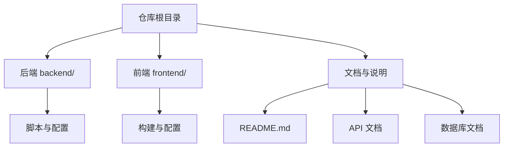
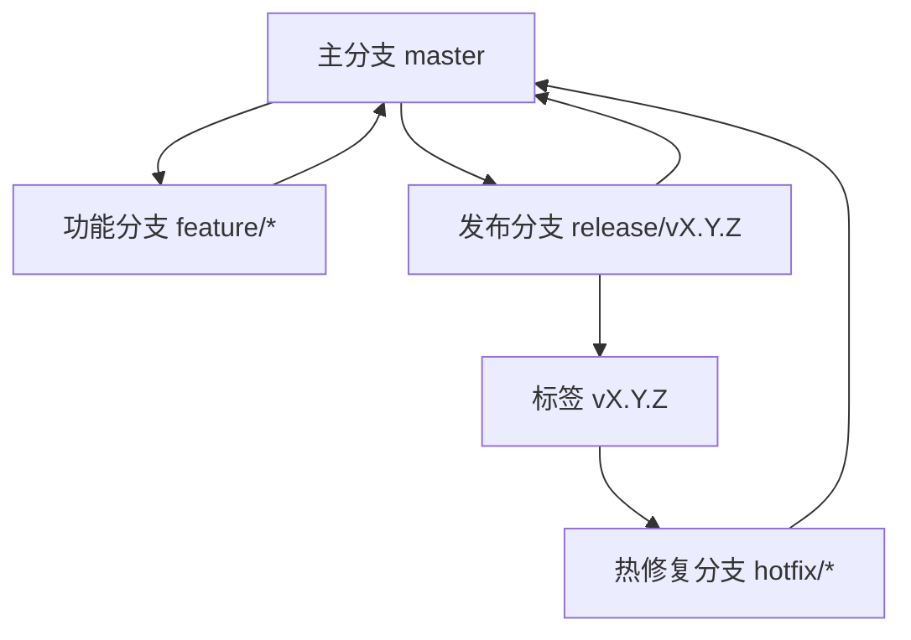
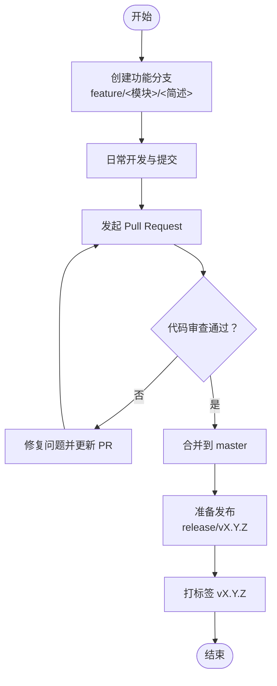
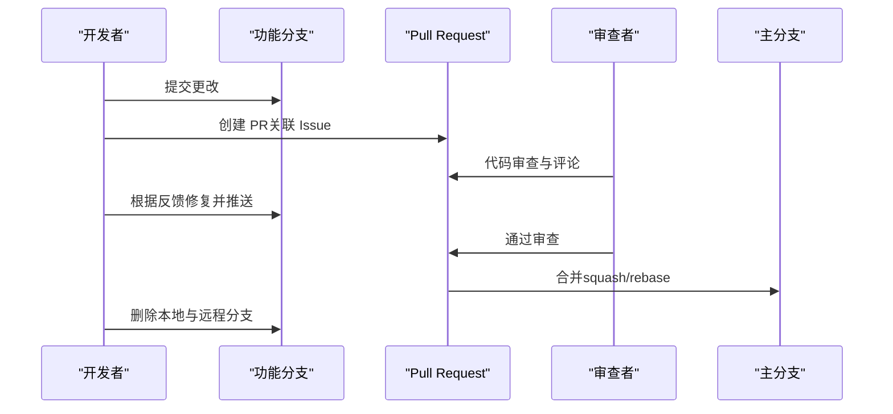
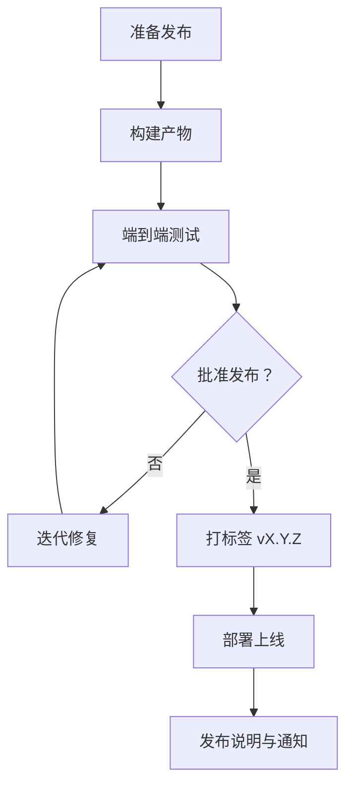
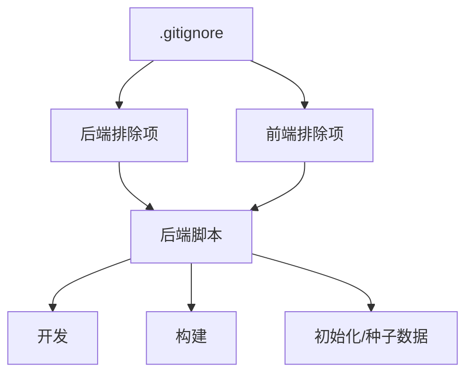

# Git 工作流程

<cite>
**本文引用的文件**
- [README.md](file://README.md)
- [DEVELOPMENT_PLAN.md](file://DEVELOPMENT_PLAN.md)
- [PRD-TingStudio-v2.0.md](file://PRD-TingStudio-v2.0.md)
- [API_DOC.md](file://backend/API_DOC.md)
- [DATABASE_DOC.md](file://backend/DATABASE_DOC.md)
- [.gitignore](file://.gitignore)
- [backend/package.json](file://backend/package.json)
- [frontend/package.json](file://frontend/package.json)
</cite>

## 目录
1. [简介](#简介)
2. [项目结构](#项目结构)
3. [核心组件](#核心组件)
4. [架构总览](#架构总览)
5. [详细组件分析](#详细组件分析)
6. [依赖分析](#依赖分析)
7. [性能考虑](#性能考虑)
8. [故障排查指南](#故障排查指南)
9. [结论](#结论)
10. [附录](#附录)

## 简介
本文件为 TingStudio Git 工作流程规范，结合项目现有文档与脚本，建立标准化的分支管理、提交规范、Pull Request 流程、标签与版本发布、常用命令与最佳实践。目标是提升团队协作效率、保证代码质量与可追溯性。

## 项目结构
TingStudio 采用前后端分离架构，仓库包含后端（Express + TypeScript）、前端（Vue 3 + TypeScript + Vite）与公共文档。根目录包含整体说明与脚本，后端与前端分别维护各自依赖与构建脚本。

**图表来源**
- [README.md:1-113](file://README.md#L1-L113)
- [backend/package.json:1-42](file://backend/package.json#L1-L42)
- [frontend/package.json:1-30](file://frontend/package.json#L1-L30)

**章节来源**
- [README.md:65-113](file://README.md#L65-L113)
- [backend/package.json:6-12](file://backend/package.json#L6-L12)
- [frontend/package.json:6-11](file://frontend/package.json#L6-L11)

## 核心组件
- 分支与版本管理：以主分支为核心，功能开发在功能分支进行，发布通过标签与版本号管理。
- 提交规范：采用约定式提交，明确类型、影响范围与简短描述，配合详细变更说明。
- PR 流程：功能分支合并前需代码审查、单元/集成测试通过、文档同步更新。
- 标签与发布：使用语义化版本（SemVer），以 v<主>.<次>.<修订> 形式打标签并发布。
- 常用命令：围绕开发、构建、数据库初始化与种子数据填充，形成标准工作流。

**章节来源**
- [PRD-TingStudio-v2.0.md:1-27](file://PRD-TingStudio-v2.0.md#L1-L27)
- [DEVELOPMENT_PLAN.md:1-321](file://DEVELOPMENT_PLAN.md#L1-L321)
- [API_DOC.md:1-714](file://backend/API_DOC.md#L1-L714)
- [DATABASE_DOC.md:1-457](file://backend/DATABASE_DOC.md#L1-L457)

## 架构总览
下图展示 TingStudio 的版本与发布流程，强调“主分支稳定、功能分支演进、标签发布”的闭环。

**图表来源**
- [PRD-TingStudio-v2.0.md:211-238](file://PRD-TingStudio-v2.0.md#L211-L238)
- [README.md:178-238](file://README.md#L178-L238)

## 详细组件分析

### 分支管理策略
- 主分支保护
  - master 作为受保护分支，禁止直接推送，所有改动必须通过 Pull Request 合并。
  - 合并前需通过 CI/代码审查与测试。
- 功能分支命名
  - 命名规范：feature/<模块>/<简述>，如 feature/formula/add-version-compare。
  - 作用域限定在具体模块，便于追踪与评审。
- 发布分支管理
  - release/vX.Y.Z 用于准备发布的稳定版本，仅做最小必要修复与版本号更新。
  - 发布完成后合并回 master 并打标签 vX.Y.Z。

**图表来源**
- [PRD-TingStudio-v2.0.md:211-238](file://PRD-TingStudio-v2.0.md#L211-L238)
- [DEVELOPMENT_PLAN.md:281-293](file://DEVELOPMENT_PLAN.md#L281-L293)

**章节来源**
- [PRD-TingStudio-v2.0.md:211-238](file://PRD-TingStudio-v2.0.md#L211-L238)
- [DEVELOPMENT_PLAN.md:281-293](file://DEVELOPMENT_PLAN.md#L281-L293)

### 提交规范
- 提交消息格式
  - <类型>(<作用域>): <简短描述>
  - 类型：feat、fix、docs、style、refactor、perf、test、chore、revert
  - 作用域：模块名，如 backend、frontend、auth、formula、version
  - 示例：feat(formula): 新增版本对比功能
- 描述要求
  - 首字母小写，避免句号结尾。
  - 简洁明了，必要时在正文补充背景与影响范围。
- 变更说明
  - 重大变更在正文详细说明动机、方案与风险，附带相关 Issue/PR 链接。

**章节来源**
- [PRD-TingStudio-v2.0.md:595-636](file://PRD-TingStudio-v2.0.md#L595-L636)

### Pull Request 流程
- 代码审查
  - 至少一名维护者审查，关注安全性、性能、可读性与一致性。
  - 优先解决审查意见，避免一次性大幅修改。
- 合并策略
  - 使用 squash 合并，保留一条清晰的提交历史；或 rebase 合并以保持线性历史。
  - 合并前确保分支与 master 同步，无冲突。
- 冲突解决
  - 在本地 rebase 或 merge master，解决冲突后再推送。
  - 冲突解决后进行回归测试，确保功能正常。

**图表来源**
- [DEVELOPMENT_PLAN.md:246-276](file://DEVELOPMENT_PLAN.md#L246-L276)

**章节来源**
- [DEVELOPMENT_PLAN.md:246-276](file://DEVELOPMENT_PLAN.md#L246-L276)

### 标签与版本发布
- 标签策略
  - 使用语义化版本：v<主>.<次>.<修订>，如 v2.3.0。
  - 标签与发布说明同步，发布说明与更新日志一致。
- 发布流程
  - 在 release 分支完成最终校验后打标签 vX.Y.Z。
  - 合并回 master，更新 README 与 CHANGELOG，发布到部署环境。

**图表来源**
- [README.md:178-238](file://README.md#L178-L238)
- [PRD-TingStudio-v2.0.md:211-238](file://PRD-TingStudio-v2.0.md#L211-L238)

**章节来源**
- [README.md:178-238](file://README.md#L178-L238)
- [PRD-TingStudio-v2.0.md:211-238](file://PRD-TingStudio-v2.0.md#L211-L238)

### 常用 Git 命令与工作流示例
- 日常开发
  - 创建功能分支：git checkout -b feature/<模块>/<简述>
  - 同步主分支：git fetch origin && git rebase origin/master
  - 推送分支：git push -u origin feature/<模块>/<简述>
- bug 修复
  - 从 master 创建 hotfix 分支：git checkout -b hotfix/<问题简述> master
  - 修复后合并回 master 并打标签 v<修订补丁>
- 功能开发标准流程
  - 基于 master 新建 feature 分支
  - 开发与提交，保持小步提交
  - 发起 PR，等待审查与测试
  - 合并后删除分支，继续下一个功能

**章节来源**
- [backend/package.json:6-12](file://backend/package.json#L6-L12)
- [frontend/package.json:6-11](file://frontend/package.json#L6-L11)

### 冲突解决与历史修改最佳实践
- 冲突解决
  - 在本地 rebase 或 merge master，逐一解决冲突文件。
  - 解决后运行测试，确保功能与回归测试通过。
- 历史修改
  - 避免修改已推送的公共历史；如确需修改，使用交互式 rebase 并强制推送，提前沟通。
  - 使用更清晰的提交信息与更小的提交粒度，减少冲突概率。

**章节来源**
- [DEVELOPMENT_PLAN.md:246-276](file://DEVELOPMENT_PLAN.md#L246-L276)

## 依赖分析
- 仓库忽略文件
  - .gitignore 排除了 node_modules、构建产物、日志、数据库文件与 IDE 临时文件，避免污染版本库。
- 依赖与脚本
  - 后端与前端分别维护 scripts，涵盖开发、构建、数据库初始化与种子数据填充。
  - 通过 package.json 的 scripts 统一入口，便于团队协作与 CI 集成。

**图表来源**
- [.gitignore:1-25](file://.gitignore#L1-L25)
- [backend/package.json:6-12](file://backend/package.json#L6-L12)
- [frontend/package.json:6-11](file://frontend/package.json#L6-L11)

**章节来源**
- [.gitignore:1-25](file://.gitignore#L1-L25)
- [backend/package.json:6-12](file://backend/package.json#L6-L12)
- [frontend/package.json:6-11](file://frontend/package.json#L6-L11)

## 性能考虑
- 提交粒度：小步提交，便于审查与回滚。
- 分支策略：避免长期存在功能分支，减少合并复杂度。
- 依赖管理：定期更新依赖，关注安全公告与性能改进。

## 故障排查指南
- 提交被拒绝
  - 检查是否直接推送 master；应通过 PR 合并。
  - 确认提交信息符合规范，必要时使用 squash 合并。
- 冲突频繁
  - 定期 rebase master，减少长分支与远端差异。
  - 采用更细粒度的功能分支，缩短开发周期。
- 构建失败
  - 检查本地 node_modules 与构建产物是否被忽略。
  - 使用 package.json 的脚本进行统一构建与初始化。

**章节来源**
- [.gitignore:1-25](file://.gitignore#L1-L25)
- [backend/package.json:6-12](file://backend/package.json#L6-L12)
- [frontend/package.json:6-11](file://frontend/package.json#L6-L11)

## 结论
通过建立清晰的分支策略、约定式提交、严格的 PR 流程与标签发布机制，TingStudio 可以显著提升协作效率与代码质量。建议团队在日常工作中严格执行本规范，并根据项目演进持续优化。

## 附录
- 术语
  - 主分支：master，受保护，只接收来自 PR 的合并。
  - 功能分支：feature/*，用于新功能开发。
  - 发布分支：release/vX.Y.Z，准备发布的稳定版本。
  - 热修复分支：hotfix/*，紧急修复线上问题。
- 参考文档
  - 产品需求文档（PRD）、API 文档、数据库文档与开发计划为工作流程提供上下文支撑。