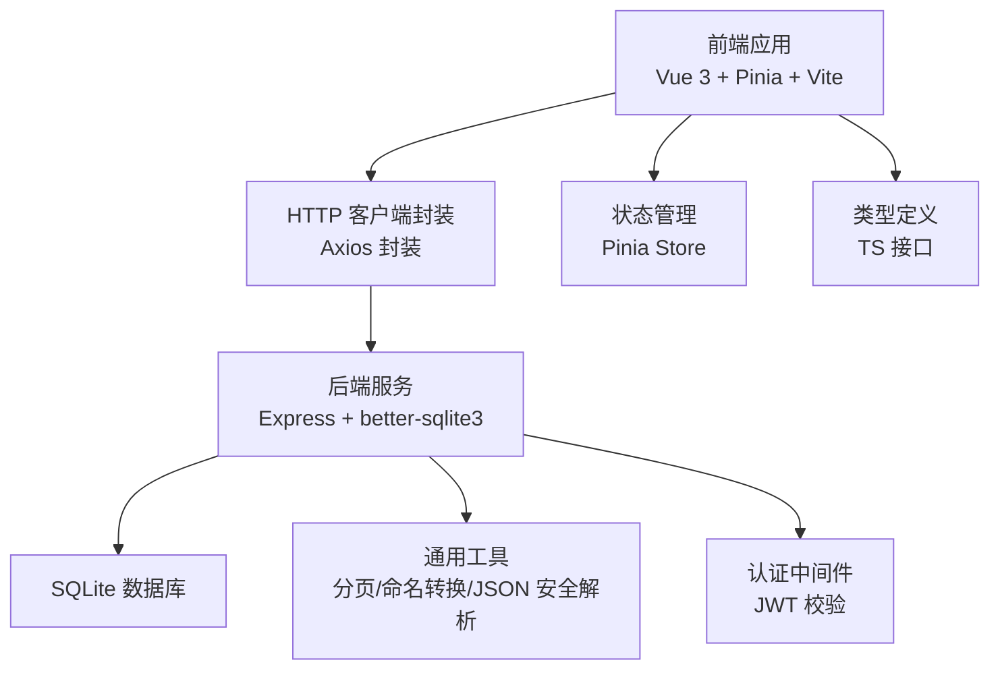
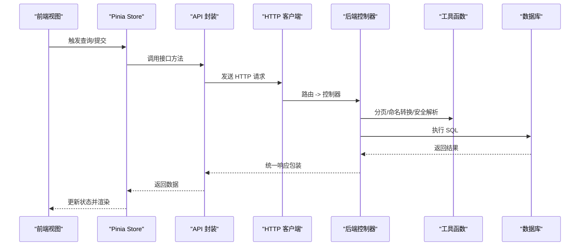
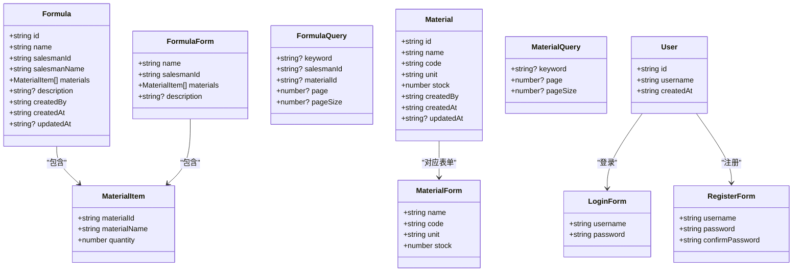

# 代码质量规范

<cite>
**本文引用的文件**
- [backend/package.json](file://backend/package.json)
- [frontend/package.json](file://frontend/package.json)
- [backend/tsconfig.json](file://backend/tsconfig.json)
- [frontend/tsconfig.json](file://frontend/tsconfig.json)
- [frontend/vite.config.ts](file://frontend/vite.config.ts)
- [backend/src/controllers/authController.ts](file://backend/src/controllers/authController.ts)
- [backend/src/controllers/formulaController.ts](file://backend/src/controllers/formulaController.ts)
- [backend/src/utils/helpers.ts](file://backend/src/utils/helpers.ts)
- [backend/src/middleware/auth.ts](file://backend/src/middleware/auth.ts)
- [frontend/src/types/formula.ts](file://frontend/src/types/formula.ts)
- [frontend/src/types/material.ts](file://frontend/src/types/material.ts)
- [frontend/src/types/user.ts](file://frontend/src/types/user.ts)
- [frontend/src/stores/formula.ts](file://frontend/src/stores/formula.ts)
- [frontend/src/api/formula.ts](file://frontend/src/api/formula.ts)
</cite>

## 目录
1. [引言](#引言)
2. [项目结构](#项目结构)
3. [核心组件](#核心组件)
4. [架构总览](#架构总览)
5. [详细组件分析](#详细组件分析)
6. [依赖分析](#依赖分析)
7. [性能考虑](#性能考虑)
8. [故障排查指南](#故障排查指南)
9. [结论](#结论)
10. [附录](#附录)

## 引言
本规范旨在统一 TingStudio 前后端的 TypeScript 编码与质量标准，覆盖类型定义、接口设计、泛型使用、代码风格、注释与文档、代码审查清单、重构与反模式、依赖与版本管理、安全与性能等方面。本文以仓库现有实现为依据，提炼可落地的质量准则，并给出可视化图示帮助理解。

## 项目结构
- 后端采用 Node.js + Express + better-sqlite3，使用 TypeScript 编译与模块路径别名，严格开启编译器严格模式。
- 前端采用 Vue 3 + Pinia + Vite，使用 TypeScript 与 TSX，启用严格模式与未使用变量/参数检查，构建时通过 vue-tsc 进行类型检查。
- 前端通过 Vite 代理将 /api 请求转发至后端本地服务，便于联调。

图表来源
- [frontend/vite.config.ts:1-23](file://frontend/vite.config.ts#L1-L23)
- [backend/src/controllers/formulaController.ts:1-287](file://backend/src/controllers/formulaController.ts#L1-L287)
- [backend/src/utils/helpers.ts:1-86](file://backend/src/utils/helpers.ts#L1-L86)
- [backend/src/middleware/auth.ts:1-38](file://backend/src/middleware/auth.ts#L1-L38)
- [frontend/src/stores/formula.ts:1-166](file://frontend/src/stores/formula.ts#L1-L166)
- [frontend/src/api/formula.ts:1-65](file://frontend/src/api/formula.ts#L1-L65)

章节来源
- [backend/tsconfig.json:1-25](file://backend/tsconfig.json#L1-L25)
- [frontend/tsconfig.json:1-32](file://frontend/tsconfig.json#L1-L32)
- [frontend/vite.config.ts:1-23](file://frontend/vite.config.ts#L1-L23)

## 核心组件
- 类型系统与接口设计：前后端均通过明确的 TS 接口约束数据结构，确保 API 约束与运行时数据一致。
- 工具函数：提供分页、命名转换、JSON 安全解析等通用能力，减少重复逻辑。
- 中间件：统一认证流程，保证路由层不直接处理鉴权细节。
- 状态与 API：前端通过 Pinia Store 管理状态，API 层封装 HTTP 调用，保持视图与数据访问解耦。

章节来源
- [frontend/src/types/formula.ts:1-33](file://frontend/src/types/formula.ts#L1-L33)
- [frontend/src/types/material.ts:1-30](file://frontend/src/types/material.ts#L1-L30)
- [frontend/src/types/user.ts:1-22](file://frontend/src/types/user.ts#L1-L22)
- [backend/src/utils/helpers.ts:1-86](file://backend/src/utils/helpers.ts#L1-L86)
- [backend/src/middleware/auth.ts:1-38](file://backend/src/middleware/auth.ts#L1-L38)
- [frontend/src/stores/formula.ts:1-166](file://frontend/src/stores/formula.ts#L1-L166)
- [frontend/src/api/formula.ts:1-65](file://frontend/src/api/formula.ts#L1-L65)

## 架构总览
后端控制器负责业务编排，调用数据库与工具函数；前端通过 API 层与后端交互，Store 统一管理状态与加载态，视图仅关注展示。

图表来源
- [frontend/src/stores/formula.ts:18-44](file://frontend/src/stores/formula.ts#L18-L44)
- [frontend/src/api/formula.ts:45-64](file://frontend/src/api/formula.ts#L45-L64)
- [backend/src/controllers/formulaController.ts:6-69](file://backend/src/controllers/formulaController.ts#L6-L69)
- [backend/src/utils/helpers.ts:13-51](file://backend/src/utils/helpers.ts#L13-L51)

## 详细组件分析

### 类型定义与接口设计
- 前端类型：配方、原料、用户等核心实体以接口形式定义，字段覆盖必要与可选属性，便于表单与表格使用。
- 后端接口：控制器返回值统一通过工具函数包装，前端 API 层对响应结构进行强约束，避免运行时类型错误。

建议
- 优先使用只读接口与可选链，减少可变性带来的副作用。
- 对外暴露的接口尽量稳定，新增字段使用可选属性并提供默认值。

章节来源
- [frontend/src/types/formula.ts:1-33](file://frontend/src/types/formula.ts#L1-L33)
- [frontend/src/types/material.ts:1-30](file://frontend/src/types/material.ts#L1-L30)
- [frontend/src/types/user.ts:1-22](file://frontend/src/types/user.ts#L1-L22)
- [frontend/src/api/formula.ts:22-43](file://frontend/src/api/formula.ts#L22-L43)

### 泛型与工具函数
- 泛型使用：工具函数支持泛型返回值，确保在不同场景下保持类型安全。
- 命名转换：提供蛇形与驼峰互转，配合数据库字段命名策略。
- JSON 安全解析：对可能异常的字符串进行容错解析，避免崩溃。

建议
- 在需要“宽进严出”的场景使用泛型约束输入输出。
- 对外部输入统一做安全解析与校验。

章节来源
- [backend/src/utils/helpers.ts:26-86](file://backend/src/utils/helpers.ts#L26-L86)

### 控制器与业务流程
- 列表查询：支持关键词、业务员筛选、分页与管理员可见范围控制。
- 创建/更新：自动维护版本快照与变更记录，确保可追溯。
- 错误处理：统一捕获异常并返回标准化消息，避免泄露内部错误。

建议
- 对数据库操作进行事务化或幂等设计，防止并发问题。
- 对敏感字段（如密码）在传输与存储环节严格加密与脱敏。

章节来源
- [backend/src/controllers/formulaController.ts:6-287](file://backend/src/controllers/formulaController.ts#L6-L287)
- [backend/src/controllers/authController.ts:8-89](file://backend/src/controllers/authController.ts#L8-L89)

### 中间件与认证
- 中间件职责：校验 Authorization 头中的 Bearer Token，解析并注入用户信息。
- 令牌生成：基于配置生成带过期时间的 JWT。

建议
- 使用 HTTPS 与安全的 Cookie 策略，避免明文传输。
- 定期轮换密钥，限制令牌有效期。

章节来源
- [backend/src/middleware/auth.ts:13-38](file://backend/src/middleware/auth.ts#L13-L38)

### 前端状态与 API 封装
- Store：集中管理列表、分页、加载态与关键字过滤，统一调用 API。
- API：对 GET/POST/PUT/DELETE 进行统一封装，返回统一结构。
- 解析与格式化：对后端返回的 JSON 字段进行解析与摘要提取，提升用户体验。

建议
- 对 Store 的异步操作增加重试与取消机制。
- 对复杂字段（如描述）提供多形态展示（纯文本/JSON 摘要）。

章节来源
- [frontend/src/stores/formula.ts:9-134](file://frontend/src/stores/formula.ts#L9-L134)
- [frontend/src/api/formula.ts:45-64](file://frontend/src/api/formula.ts#L45-L64)

### 类图（类型与接口）

图表来源
- [frontend/src/types/formula.ts:1-33](file://frontend/src/types/formula.ts#L1-L33)
- [frontend/src/types/material.ts:1-30](file://frontend/src/types/material.ts#L1-L30)
- [frontend/src/types/user.ts:1-22](file://frontend/src/types/user.ts#L1-L22)

## 依赖分析
- 后端依赖：Express 提供 Web 框架，better-sqlite3 提供 SQLite 访问，helmet/morgan/cors/compression 提升安全与性能，bcryptjs/jwt 实现认证与令牌。
- 前端依赖：Vue 3 生态，Pinia 状态管理，tdesign-vue-next UI，vee-validate/yup 表单校验，axios HTTP 客户端。

建议
- 锁定关键依赖版本，定期扫描安全漏洞。
- 对第三方包进行最小权限授权与最小功能集引入。

章节来源
- [backend/package.json:14-40](file://backend/package.json#L14-L40)
- [frontend/package.json:12-28](file://frontend/package.json#L12-L28)

## 性能考虑
- 分页与查询：后端对分页参数进行边界控制，避免一次性返回大量数据。
- 命名转换与 JSON 解析：在批量转换时注意复杂度，避免在热路径上进行昂贵操作。
- 前端 Store：对列表进行本地缓存与懒加载，减少重复请求。

建议
- 对高频查询建立索引，优化 LIKE 与关联查询。
- 使用连接池与超时控制，避免阻塞。

章节来源
- [backend/src/utils/helpers.ts:13-19](file://backend/src/utils/helpers.ts#L13-L19)
- [backend/src/controllers/formulaController.ts:34-68](file://backend/src/controllers/formulaController.ts#L34-L68)

## 故障排查指南
- 认证失败：检查 Authorization 头格式与令牌有效性，确认密钥与过期时间配置。
- 数据库异常：核对 SQL 参数绑定与表结构，检查分页与 LIKE 条件构造。
- 前端解析错误：检查后端返回 JSON 字段是否符合预期，前端解析逻辑是否健壮。

章节来源
- [backend/src/middleware/auth.ts:13-31](file://backend/src/middleware/auth.ts#L13-L31)
- [backend/src/utils/helpers.ts:77-86](file://backend/src/utils/helpers.ts#L77-L86)
- [frontend/src/stores/formula.ts:137-165](file://frontend/src/stores/formula.ts#L137-L165)

## 结论
本规范以现有代码为蓝本，总结了类型、接口、工具函数、中间件与前端状态管理的关键实践。建议在后续迭代中持续完善 ESLint/Prettier 配置、补充 JSDoc 注释与 API 文档生成流程，并将安全与性能指标纳入 CI/CD 质检。

## 附录

### TypeScript 编码规范要点
- 类型优先：优先使用接口与只读类型，避免 any/unknown 的滥用。
- 泛型约束：在工具函数与 API 封装中使用泛型，确保输入输出类型一致。
- 命名约定：变量与函数采用驼峰，常量采用大写下划线，类名首字母大写。
- 错误处理：统一捕获异常并返回结构化消息，避免抛出原始错误。

章节来源
- [backend/src/utils/helpers.ts:26-86](file://backend/src/utils/helpers.ts#L26-L86)
- [backend/src/controllers/formulaController.ts:66-88](file://backend/src/controllers/formulaController.ts#L66-L88)

### 代码风格与格式化
- 编译器严格模式：前后端 tsconfig 均启用 strict、noUnusedLocals、noUnusedParameters 等。
- 路径别名：通过 baseUrl 与 paths 统一模块导入路径，提升可读性。
- Vite 代理：开发环境通过代理将 /api 请求转发到后端，简化联调。

章节来源
- [backend/tsconfig.json:9-20](file://backend/tsconfig.json#L9-L20)
- [frontend/tsconfig.json:17-27](file://frontend/tsconfig.json#L17-L27)
- [frontend/vite.config.ts:15-21](file://frontend/vite.config.ts#L15-L21)

### 注释与文档
- JSDoc 建议：为公共接口、工具函数与控制器添加简要说明，描述参数、返回值与异常情况。
- API 文档：结合现有控制器与 API 封装，生成统一的接口文档，标注请求/响应结构。

章节来源
- [backend/src/controllers/authController.ts:8-39](file://backend/src/controllers/authController.ts#L8-L39)
- [backend/src/controllers/formulaController.ts:6-130](file://backend/src/controllers/formulaController.ts#L6-L130)
- [frontend/src/api/formula.ts:45-64](file://frontend/src/api/formula.ts#L45-L64)

### 代码审查清单
- 类型与接口：是否完整覆盖字段？是否区分必填与可选？
- 泛型与工具函数：是否正确约束输入输出？是否考虑边界条件？
- 控制器：是否处理异常？是否遵循最小权限与安全原则？
- 前端：Store 是否集中管理状态？API 封装是否统一？

章节来源
- [frontend/src/stores/formula.ts:9-134](file://frontend/src/stores/formula.ts#L9-L134)
- [backend/src/middleware/auth.ts:13-31](file://backend/src/middleware/auth.ts#L13-L31)

### 重构指导与反模式
- 反模式：any 类型滥用、全局状态分散、控制器内嵌 SQL 逻辑、重复的 JSON 解析。
- 重构方向：抽取通用工具、拆分控制器职责、统一响应结构、加强类型约束。

章节来源
- [backend/src/utils/helpers.ts:77-86](file://backend/src/utils/helpers.ts#L77-L86)
- [frontend/src/stores/formula.ts:137-165](file://frontend/src/stores/formula.ts#L137-L165)

### 依赖与版本管理
- 版本锁定：使用 package-lock.json 固定依赖版本。
- 安全扫描：定期更新依赖并扫描 CVE。
- 最小化依赖：按需引入第三方包，避免冗余。

章节来源
- [backend/package.json:14-40](file://backend/package.json#L14-L40)
- [frontend/package.json:12-28](file://frontend/package.json#L12-L28)

### 安全与性能
- 安全：JWT 密钥安全存储与轮换、HTTPS、CORS 限制、速率限制。
- 性能：数据库索引、分页与查询优化、前端缓存与懒加载。

章节来源
- [backend/package.json:17-25](file://backend/package.json#L17-L25)
- [backend/src/controllers/formulaController.ts:34-68](file://backend/src/controllers/formulaController.ts#L34-L68)