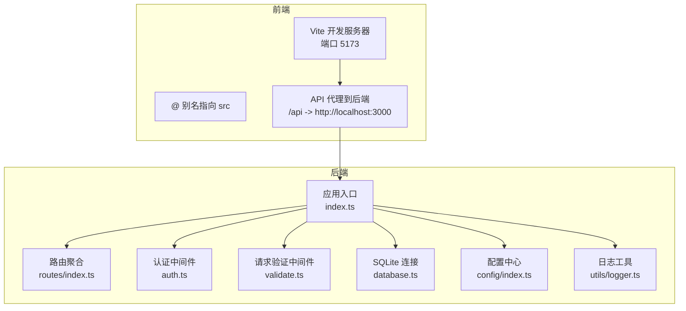
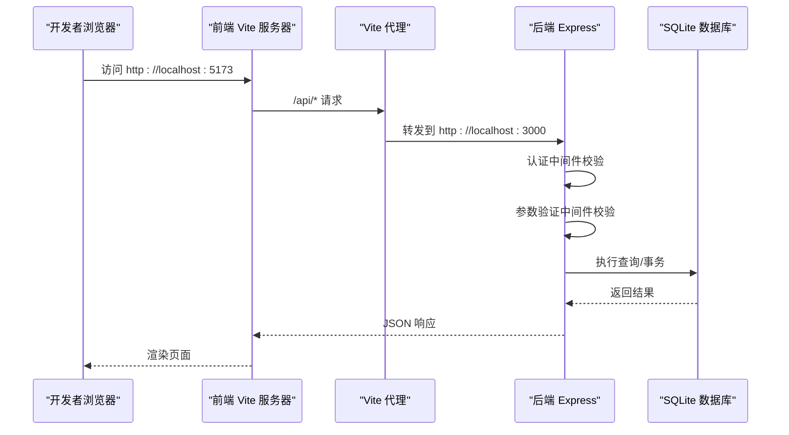
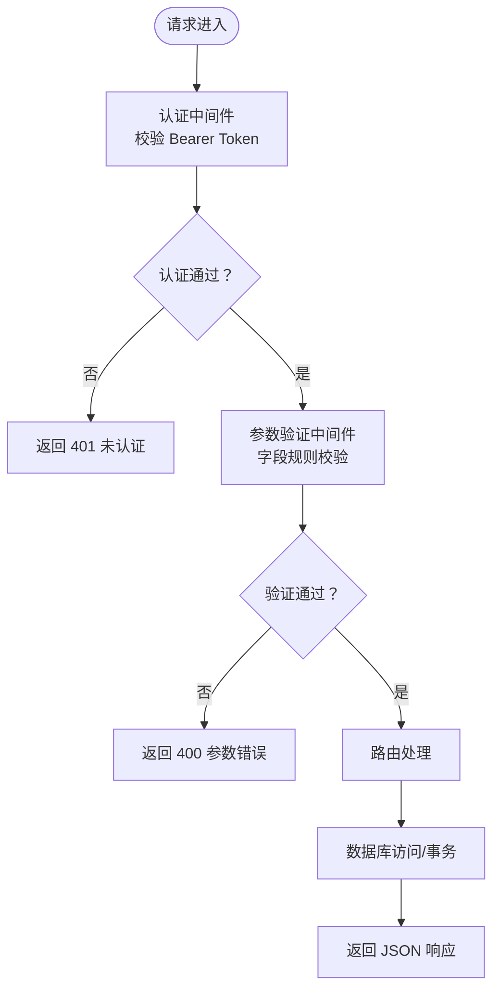
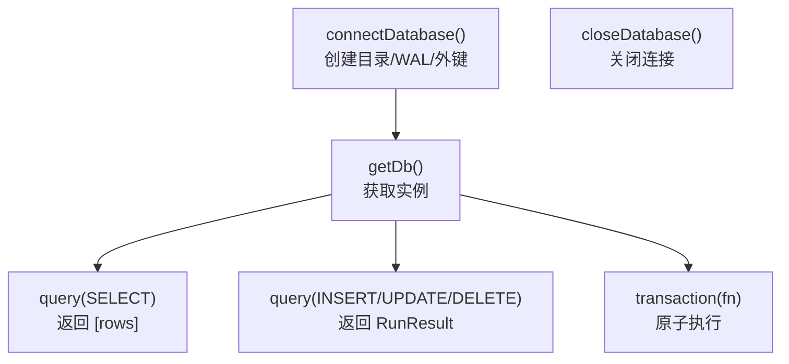
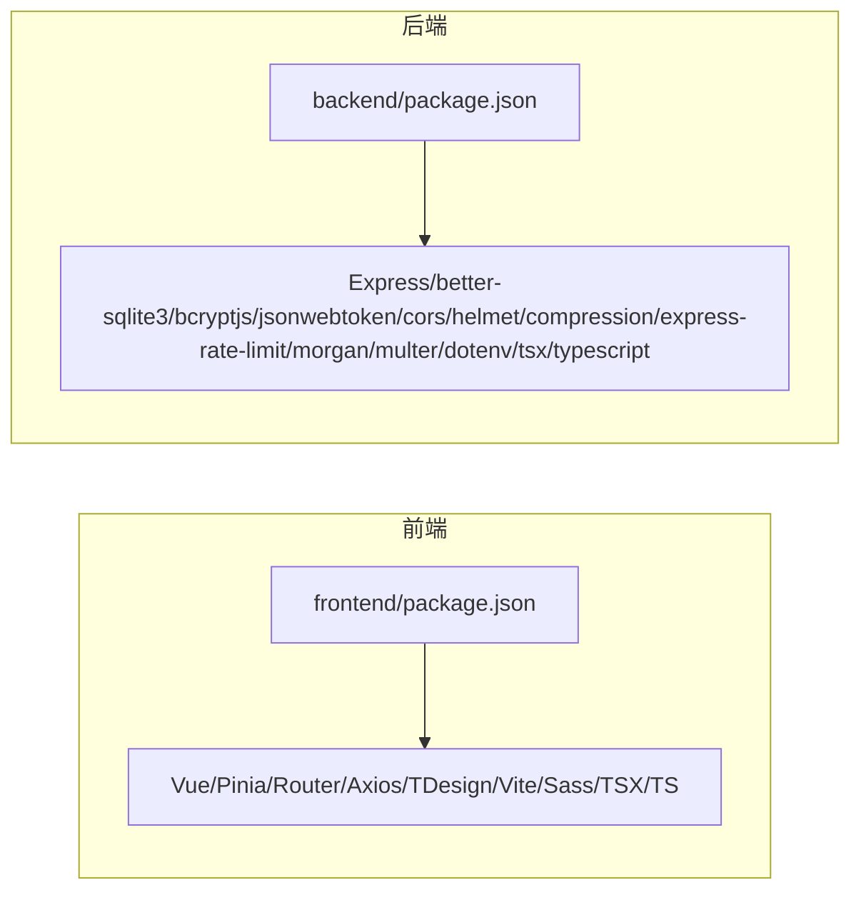

# 开发工作流程

<cite>
**本文引用的文件**
- [README.md](file://README.md)
- [package.json](file://package.json)
- [backend/package.json](file://backend/package.json)
- [frontend/package.json](file://frontend/package.json)
- [backend/tsconfig.json](file://backend/tsconfig.json)
- [frontend/tsconfig.json](file://frontend/tsconfig.json)
- [frontend/vite.config.ts](file://frontend/vite.config.ts)
- [backend/src/index.ts](file://backend/src/index.ts)
- [backend/src/config/index.ts](file://backend/src/config/index.ts)
- [backend/src/config/database.ts](file://backend/src/config/database.ts)
- [backend/src/middleware/auth.ts](file://backend/src/middleware/auth.ts)
- [backend/src/middleware/validate.ts](file://backend/src/middleware/validate.ts)
- [backend/src/utils/logger.ts](file://backend/src/utils/logger.ts)
- [backend/src/scripts/initDatabase.ts](file://backend/src/scripts/initDatabase.ts)
- [backend/src/scripts/seedData.ts](file://backend/src/scripts/seedData.ts)
- [backend/API_DOC.md](file://backend/API_DOC.md)
</cite>

## 目录
1. [引言](#引言)
2. [项目结构](#项目结构)
3. [核心组件](#核心组件)
4. [架构总览](#架构总览)
5. [详细组件分析](#详细组件分析)
6. [依赖关系分析](#依赖关系分析)
7. [性能考虑](#性能考虑)
8. [故障排除指南](#故障排除指南)
9. [结论](#结论)
10. [附录](#附录)

## 引言
本指南面向 TingStudio 项目的开发者与维护者，系统阐述开发规范、Git 工作流程、代码管理策略、构建与测试流程、部署策略、开发环境配置与调试技巧（热重载、断点调试、性能分析）、代码风格与提交消息规范、分支管理策略、团队协作最佳实践以及常见问题排查方法。目标是帮助团队高效协作、保持代码质量、降低维护成本。

## 项目结构
TingStudio 采用前后端分离架构：
- 后端：基于 Node.js + Express + TypeScript，使用 better-sqlite3 作为 SQLite 驱动，提供 RESTful API。
- 前端：基于 Vue 3 + TypeScript + Vite，使用 Pinia、Vue Router、Axios、TDesign 等生态。
- 数据库：SQLite（WAL 模式 + 外键约束），通过脚本初始化与填充种子数据。
- 文档：API 文档与数据库文档，便于接口理解与数据结构参考。

图表来源
- [frontend/vite.config.ts:1-23](file://frontend/vite.config.ts#L1-L23)
- [backend/src/index.ts:1-61](file://backend/src/index.ts#L1-L61)
- [backend/src/config/database.ts:1-70](file://backend/src/config/database.ts#L1-L70)
- [backend/src/middleware/auth.ts:1-38](file://backend/src/middleware/auth.ts#L1-L38)
- [backend/src/middleware/validate.ts:1-68](file://backend/src/middleware/validate.ts#L1-L68)
- [backend/src/config/index.ts:1-24](file://backend/src/config/index.ts#L1-L24)
- [backend/src/utils/logger.ts:1-40](file://backend/src/utils/logger.ts#L1-L40)

章节来源
- [README.md:65-113](file://README.md#L65-L113)
- [frontend/vite.config.ts:1-23](file://frontend/vite.config.ts#L1-L23)
- [backend/src/index.ts:1-61](file://backend/src/index.ts#L1-L61)

## 核心组件
- 应用入口与中间件
  - 后端入口负责加载配置、连接数据库、挂载中间件（CORS、Helmet、压缩、日志、静态资源）、注册路由、健康检查与全局错误处理。
  - 认证中间件实现 Bearer Token 校验；请求验证中间件提供统一的字段规则校验。
- 数据库层
  - 使用 better-sqlite3，启用 WAL 模式与外键约束；提供 query/transaction 封装以兼容控制器对 mysql2 的 [rows] 结构习惯。
- 配置与日志
  - 配置集中于 config/index.ts，支持端口、JWT、上传、CORS 等；日志工具提供 info/warn/error/debug 输出。
- 初始化与种子数据
  - initDatabase 脚本一次性执行 SQL 并创建表结构；seedData 脚本批量插入用户、原料、业务员、配方、版本、导出模板、导出任务、营养标准与原料营养数据。

章节来源
- [backend/src/index.ts:1-61](file://backend/src/index.ts#L1-L61)
- [backend/src/middleware/auth.ts:1-38](file://backend/src/middleware/auth.ts#L1-L38)
- [backend/src/middleware/validate.ts:1-68](file://backend/src/middleware/validate.ts#L1-L68)
- [backend/src/config/database.ts:1-70](file://backend/src/config/database.ts#L1-L70)
- [backend/src/config/index.ts:1-24](file://backend/src/config/index.ts#L1-L24)
- [backend/src/utils/logger.ts:1-40](file://backend/src/utils/logger.ts#L1-L40)
- [backend/src/scripts/initDatabase.ts:1-37](file://backend/src/scripts/initDatabase.ts#L1-L37)
- [backend/src/scripts/seedData.ts:1-400](file://backend/src/scripts/seedData.ts#L1-L400)

## 架构总览
后端服务通过 Vite 的代理将前端请求转发至后端 API，后端通过统一的路由模块组织各业务模块控制器，并通过中间件进行认证与参数校验，最终访问 SQLite 数据库。

图表来源
- [frontend/vite.config.ts:12-21](file://frontend/vite.config.ts#L12-L21)
- [backend/src/index.ts:34-48](file://backend/src/index.ts#L34-L48)
- [backend/src/middleware/auth.ts:13-31](file://backend/src/middleware/auth.ts#L13-L31)
- [backend/src/middleware/validate.ts:16-67](file://backend/src/middleware/validate.ts#L16-L67)
- [backend/src/config/database.ts:44-61](file://backend/src/config/database.ts#L44-L61)

## 详细组件分析

### 后端入口与中间件
- 入口职责
  - 加载 .env，连接数据库，配置全局中间件（CORS、Helmet、compression、morgan、JSON/URL 编码、静态文件），注册 /api 路由，健康检查，404 与错误处理，启动服务。
- 认证中间件
  - 从 Authorization 头提取 Bearer Token，使用配置中的密钥验证；通过则注入用户信息到请求对象，否则返回 401。
- 请求验证中间件
  - 支持字段类型、必填、长度、数值范围等规则，统一返回 400 与错误列表。

图表来源
- [backend/src/index.ts:20-48](file://backend/src/index.ts#L20-L48)
- [backend/src/middleware/auth.ts:13-31](file://backend/src/middleware/auth.ts#L13-L31)
- [backend/src/middleware/validate.ts:16-67](file://backend/src/middleware/validate.ts#L16-L67)

章节来源
- [backend/src/index.ts:1-61](file://backend/src/index.ts#L1-L61)
- [backend/src/middleware/auth.ts:1-38](file://backend/src/middleware/auth.ts#L1-L38)
- [backend/src/middleware/validate.ts:1-68](file://backend/src/middleware/validate.ts#L1-L68)

### 数据库连接与事务封装
- 连接管理
  - 自动创建数据目录，确保 WAL 模式与外键约束开启，记录连接日志。
- 查询封装
  - query 函数兼容 SELECT 返回数组与非 SELECT 返回 RunResult，便于控制器解构与事务使用。
- 事务封装
  - transaction(fn) 包裹回调，保证原子性。

图表来源
- [backend/src/config/database.ts:10-70](file://backend/src/config/database.ts#L10-L70)

章节来源
- [backend/src/config/database.ts:1-70](file://backend/src/config/database.ts#L1-L70)

### 配置与日志
- 配置中心
  - 提供端口、数据库路径、JWT 密钥与过期时间、上传目录与大小限制、CORS 源等默认值，支持通过环境变量覆盖。
- 日志工具
  - 提供 info/warn/error/debug 四种级别输出，开发环境下输出 debug。

章节来源
- [backend/src/config/index.ts:1-24](file://backend/src/config/index.ts#L1-L24)
- [backend/src/utils/logger.ts:1-40](file://backend/src/utils/logger.ts#L1-L40)

### 初始化与种子数据脚本
- 初始化数据库
  - 读取 SQL 文件并一次性执行，创建所有表结构。
- 填充种子数据
  - 事务内批量插入用户、原料、业务员、配方、版本、导出模板、导出任务、营养标准与原料营养数据，输出详细进度与跳过提示。

章节来源
- [backend/src/scripts/initDatabase.ts:1-37](file://backend/src/scripts/initDatabase.ts#L1-L37)
- [backend/src/scripts/seedData.ts:1-400](file://backend/src/scripts/seedData.ts#L1-L400)

### 前端开发服务器与代理
- 别名与代理
  - Vite 配置 @ 指向 src，开发服务器端口 5173，将 /api 代理到后端 3000 端口，便于前后端联调。
- 构建与预览
  - dev/build/preview 脚本分别用于开发、构建与本地预览。

章节来源
- [frontend/vite.config.ts:1-23](file://frontend/vite.config.ts#L1-L23)
- [frontend/package.json:6-11](file://frontend/package.json#L6-L11)

### API 文档与接口规范
- 通用约定
  - 基础地址、认证方式（Bearer Token）、统一响应结构（success/message/data/errors）、分页结构、状态码。
- 认证模块
  - 注册、登录、获取当前用户信息。
- 原料、配方、业务员、版本、导出、营养等模块接口
  - 列表/详情/创建/更新/删除/对比/计算/合规检查等完整端点与参数说明。

章节来源
- [backend/API_DOC.md:1-688](file://backend/API_DOC.md#L1-L688)

## 依赖关系分析
- 前端依赖
  - Vue 3、Pinia、Vue Router、Axios、TDesign、Vite、Sass、TSX、TypeScript、vue-tsc。
- 后端依赖
  - Express、better-sqlite3、bcryptjs、jsonwebtoken、cors、helmet、compression、express-rate-limit、morgan、multer、dotenv、tsx、typescript。
- 构建与脚本
  - 后端使用 tsc + tsx watch，前端使用 vue-tsc + vite build；提供 init-db、seed、import-nutrition 等脚本。

图表来源
- [frontend/package.json:1-30](file://frontend/package.json#L1-L30)
- [backend/package.json:1-42](file://backend/package.json#L1-L42)

章节来源
- [frontend/package.json:1-30](file://frontend/package.json#L1-L30)
- [backend/package.json:1-42](file://backend/package.json#L1-L42)

## 性能考虑
- 数据库
  - 启用 WAL 模式与外键约束，有助于并发写入与一致性；避免大事务，合理拆分批量写入。
- 中间件
  - 压缩中间件减少传输体积；日志中间件在开发环境输出 debug，生产环境建议降级。
- 前端
  - 使用 Vite 的按需编译与热重载；合理拆分路由与组件，避免单页体积过大。
- API
  - 对大列表接口使用分页与关键词过滤；对图片/文件上传设置合理大小限制。

## 故障排除指南
- 启动失败
  - 后端：检查数据库连接路径与权限、端口占用、环境变量是否正确；查看日志输出定位错误。
  - 前端：确认代理配置与后端是否启动；检查端口占用与跨域配置。
- 数据库初始化失败
  - 确认 init.sql 存在且可读；检查 better-sqlite3 权限；必要时删除旧数据库文件重新初始化。
- 种子数据插入异常
  - 查看事务回滚日志，确认唯一约束冲突或字段类型不匹配；逐表检查数据。
- 认证失败
  - 确认请求头 Authorization 格式为 Bearer Token；核对 JWT 密钥与过期时间；检查用户是否存在且状态正常。
- 参数校验失败
  - 根据返回的错误列表修正请求体字段类型、长度与范围；必要时参考 API 文档。

章节来源
- [backend/src/index.ts:57-61](file://backend/src/index.ts#L57-L61)
- [backend/src/config/database.ts:26-29](file://backend/src/config/database.ts#L26-L29)
- [backend/src/scripts/initDatabase.ts:25-27](file://backend/src/scripts/initDatabase.ts#L25-L27)
- [backend/src/middleware/auth.ts:13-31](file://backend/src/middleware/auth.ts#L13-L31)
- [backend/API_DOC.md:48-71](file://backend/API_DOC.md#L48-L71)

## 结论
通过明确的开发规范、清晰的 Git 工作流程、严格的代码与提交规范、完善的构建与测试流程、合理的部署策略以及系统化的调试与故障排除方法，TingStudio 项目能够在团队协作中保持高效率与高质量。建议在日常开发中持续遵循本指南，并根据实际演进不断优化流程与工具链。

## 附录

### 开发环境配置与调试技巧
- 环境准备
  - Node.js 18+、npm 9+；安装依赖后分别在 backend/frontend 目录执行 dev 脚本。
- 热重载与代理
  - 前端 Vite 默认热重载；通过代理将 /api 请求转发至后端，便于联调。
- 断点调试
  - 使用 VS Code 或其他 IDE 在后端 tsx watch 与前端 Vite 环境下设置断点；后端可结合日志定位。
- 性能分析
  - 后端可使用 Node.js 内置分析工具或第三方工具；前端使用浏览器性能面板分析渲染与网络请求。

章节来源
- [README.md:117-148](file://README.md#L117-L148)
- [frontend/vite.config.ts:12-21](file://frontend/vite.config.ts#L12-L21)

### 构建脚本与测试流程
- 后端
  - dev：tsx watch 监听 TypeScript 变更；build：tsc 编译；start：运行 dist；init-db/seed/import-nutrition：数据库初始化与数据填充。
- 前端
  - dev/build/preview：开发、构建与本地预览；init:sample-data：初始化示例数据脚本。
- 测试
  - 当前仓库未提供单元/集成测试脚本，建议后续引入 Vitest/Jest 与 Playwright（前端）及 Supertest（后端）完善测试体系。

章节来源
- [backend/package.json:6-12](file://backend/package.json#L6-L12)
- [frontend/package.json:6-11](file://frontend/package.json#L6-L11)
- [README.md:167-177](file://README.md#L167-L177)

### 部署策略
- 后端
  - 生产环境建议使用 PM2 或 Docker 容器化部署；配置环境变量（端口、JWT 密钥、数据库路径、CORS 源）；启用 HTTPS 与限流中间件。
- 前端
  - 使用 Nginx/Apache 部署构建产物；配置静态资源缓存与 gzip；将 /api 代理至后端服务。
- 数据库
  - SQLite 适合开发与小规模场景；生产建议迁移到 PostgreSQL/MySQL 并配合备份与监控。

章节来源
- [backend/src/config/index.ts:2-23](file://backend/src/config/index.ts#L2-L23)
- [backend/src/index.ts:22-25](file://backend/src/index.ts#L22-L25)

### 代码风格与提交消息规范
- 代码风格
  - TypeScript 严格模式；命名规范：驼峰命名；文件与目录采用小写加连字符；组件与模块按功能划分。
- 提交消息
  - 建议采用约定式提交：feat/fix/docs/style/refactor/test/build/chore，例如 feat(auth): 添加用户注册接口。
- 分支管理
  - 主分支保护；功能开发在 feature/*；修复在 hotfix/*；发布打 tag 并合并到 main/master。

章节来源
- [backend/tsconfig.json:9-16](file://backend/tsconfig.json#L9-L16)
- [frontend/tsconfig.json:17-21](file://frontend/tsconfig.json#L17-L21)

### 团队协作最佳实践
- 代码评审
  - PR 必须通过至少一名维护者评审；关注可读性、性能与安全性。
- 文档同步
  - 修改接口或数据库结构时同步更新 API 文档与数据库文档。
- 版本与发布
  - 使用语义化版本；更新 README 与更新日志；发布前进行端到端测试。

章节来源
- [README.md:178-227](file://README.md#L178-L227)