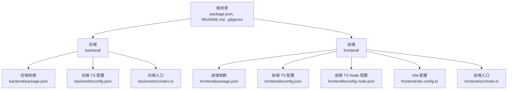
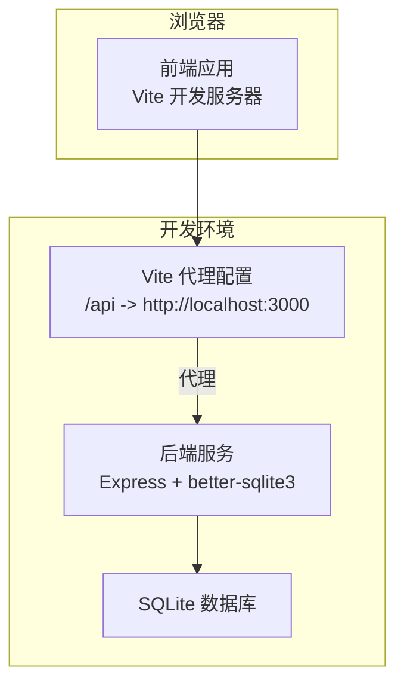
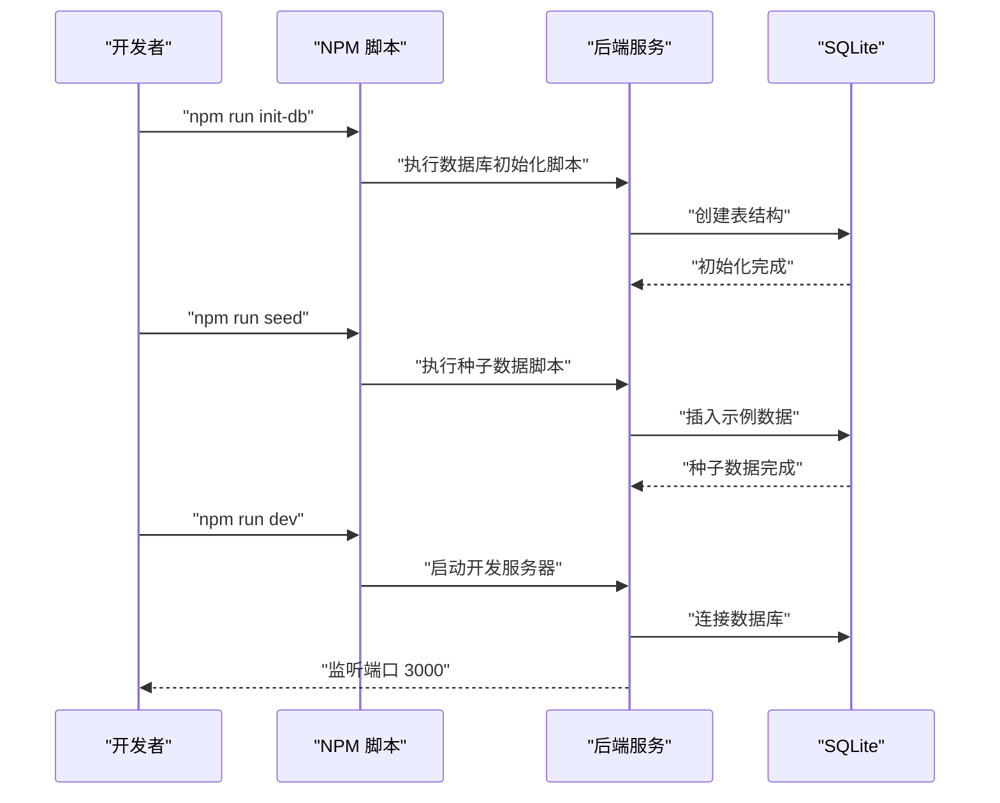
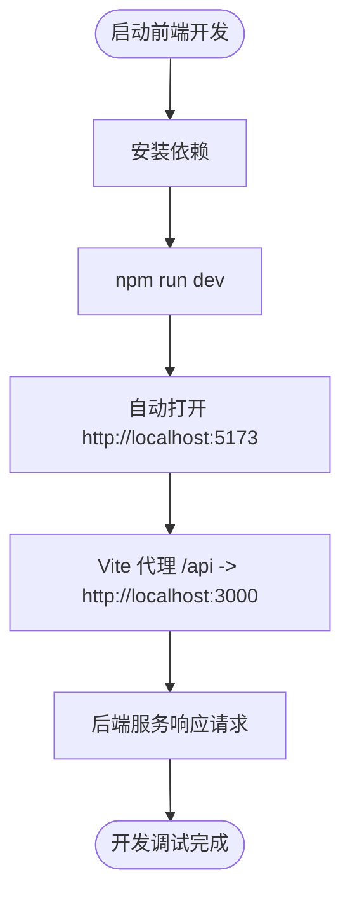
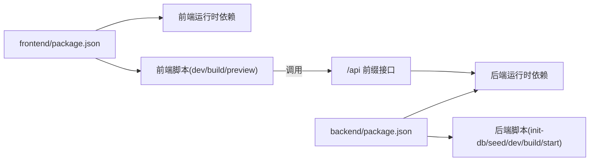

# 开发环境搭建

<cite>
**本文引用的文件**
- [package.json](file://package.json)
- [README.md](file://README.md)
- [backend/package.json](file://backend/package.json)
- [frontend/package.json](file://frontend/package.json)
- [backend/tsconfig.json](file://backend/tsconfig.json)
- [frontend/tsconfig.json](file://frontend/tsconfig.json)
- [frontend/tsconfig.node.json](file://frontend/tsconfig.node.json)
- [frontend/vite.config.ts](file://frontend/vite.config.ts)
- [backend/src/index.ts](file://backend/src/index.ts)
- [backend/.gitignore](file://backend/.gitignore)
- [frontend/src/main.ts](file://frontend/src/main.ts)
</cite>

## 目录
1. [简介](#简介)
2. [项目结构](#项目结构)
3. [核心组件](#核心组件)
4. [架构总览](#架构总览)
5. [详细组件分析](#详细组件分析)
6. [依赖分析](#依赖分析)
7. [性能考虑](#性能考虑)
8. [故障排除指南](#故障排除指南)
9. [结论](#结论)
10. [附录](#附录)

## 简介
本指南面向首次参与 TingStudio 项目的开发者，帮助你在本地快速完成开发环境搭建与配置。项目采用前后端分离架构：前端基于 Vue 3 + Vite + TypeScript，后端基于 Express + TypeScript + better-sqlite3，使用 SQLite 存储数据，并通过 JWT 进行认证。你将学会如何安装 Node.js/npm、安装前后端依赖、启动开发服务器、配置代理与热重载、以及推荐的 IDE 设置。

## 项目结构
项目采用“根目录 + 子目录”的组织方式：
- 根目录包含顶层依赖与通用配置（如顶层 package.json、.gitignore、README.md）
- backend 子目录：后端服务源码、数据库脚本、API 文档与数据库文档
- frontend 子目录：前端源码、Vite 配置、TypeScript 配置与构建脚本

图表来源
- [README.md:65-113](file://README.md#L65-L113)
- [backend/package.json:1-42](file://backend/package.json#L1-L42)
- [frontend/package.json:1-30](file://frontend/package.json#L1-L30)
- [backend/tsconfig.json:1-25](file://backend/tsconfig.json#L1-L25)
- [frontend/tsconfig.json:1-32](file://frontend/tsconfig.json#L1-L32)
- [frontend/tsconfig.node.json:1-11](file://frontend/tsconfig.node.json#L1-L11)
- [frontend/vite.config.ts:1-23](file://frontend/vite.config.ts#L1-L23)
- [backend/src/index.ts:1-61](file://backend/src/index.ts#L1-L61)
- [frontend/src/main.ts:1-17](file://frontend/src/main.ts#L1-L17)

章节来源
- [README.md:65-113](file://README.md#L65-L113)

## 核心组件
- 后端服务
  - 使用 Express 作为 Web 框架，提供 RESTful API，支持跨域、压缩、日志与健康检查
  - 使用 better-sqlite3 作为数据库驱动，配合 SQLite
  - 提供数据库初始化与种子数据填充脚本
- 前端应用
  - 使用 Vue 3 + TypeScript + Vite 构建，采用 Composition API
  - 使用 Pinia 进行状态管理，TDesign Vue Next 提供 UI 组件
  - 通过 Vite 配置 API 代理至后端服务，实现开发时前后端联调

章节来源
- [backend/src/index.ts:13-55](file://backend/src/index.ts#L13-L55)
- [backend/package.json:14-40](file://backend/package.json#L14-L40)
- [frontend/package.json:12-28](file://frontend/package.json#L12-L28)

## 架构总览
下图展示了前后端分离架构中各组件之间的交互关系，以及开发阶段的请求流向。

图表来源
- [frontend/vite.config.ts:12-21](file://frontend/vite.config.ts#L12-L21)
- [backend/src/index.ts:13-55](file://backend/src/index.ts#L13-L55)

## 详细组件分析

### 后端开发环境
- 环境要求
  - Node.js 18+
  - npm 9+
- 依赖安装
  - 在 backend 目录执行依赖安装
- 启动流程
  - 初始化数据库：执行数据库初始化脚本
  - 可选：填充种子数据
  - 启动开发服务：监听端口 3000
- 关键配置
  - 端口：默认 3000，可通过环境变量覆盖
  - CORS：允许来自前端开发端口的跨域请求
  - 静态资源：上传文件目录映射
  - 路由：统一前缀 /api
  - 健康检查：GET /health
- 调试与日志
  - 使用 morgan 输出请求日志
  - 使用 dotenv 加载环境变量（.env）

图表来源
- [backend/package.json:6-12](file://backend/package.json#L6-L12)
- [backend/src/index.ts:13-55](file://backend/src/index.ts#L13-L55)

章节来源
- [README.md:117-136](file://README.md#L117-L136)
- [backend/package.json:6-12](file://backend/package.json#L6-L12)
- [backend/src/index.ts:13-55](file://backend/src/index.ts#L13-L55)

### 前端开发环境
- 环境要求
  - Node.js 18+
  - npm 9+
- 依赖安装
  - 在 frontend 目录执行依赖安装
- 启动流程
  - 启动开发服务器：默认端口 5173，自动打开浏览器
  - 通过 Vite 代理将 /api 请求转发至后端
- 关键配置
  - Vite 代理：将 /api 代理到 http://localhost:3000
  - 路径别名：@ 指向 src
  - TypeScript：使用 bundler 模式，严格模式与无 emit
  - 构建：先进行类型检查再打包

图表来源
- [frontend/package.json:6-10](file://frontend/package.json#L6-L10)
- [frontend/vite.config.ts:12-21](file://frontend/vite.config.ts#L12-L21)
- [frontend/tsconfig.json:9-15](file://frontend/tsconfig.json#L9-L15)

章节来源
- [README.md:138-148](file://README.md#L138-L148)
- [frontend/package.json:6-10](file://frontend/package.json#L6-L10)
- [frontend/vite.config.ts:12-21](file://frontend/vite.config.ts#L12-L21)
- [frontend/tsconfig.json:9-15](file://frontend/tsconfig.json#L9-L15)

### 配置文件详解

#### 根目录 package.json
- 作用：顶层开发依赖（如 xlsx），用于文档生成或脚本工具
- 注意：不包含前端/后端业务依赖，业务依赖位于各自子目录

章节来源
- [package.json:1-6](file://package.json#L1-L6)

#### 后端 package.json
- 作用：后端依赖与脚本定义
- 关键脚本
  - dev：使用 tsx 监听模式启动开发服务器
  - build：编译 TypeScript 到 dist
  - start：运行编译后的入口文件
  - init-db：初始化数据库表结构
  - seed：填充种子数据
  - import-nutrition：导入营养数据（如有需要）
- 依赖要点
  - 运行时：Express、better-sqlite3、bcryptjs、jsonwebtoken、helmet、cors、compression、morgan、multer
  - 开发时：@types/*、tsx、typescript

章节来源
- [backend/package.json:6-40](file://backend/package.json#L6-L40)

#### 前端 package.json
- 作用：前端依赖与脚本定义
- 关键脚本
  - dev：启动 Vite 开发服务器
  - build：先类型检查再打包
  - preview：预览生产构建
  - init:sample-data：初始化示例数据（脚本）
- 依赖要点
  - 运行时：Vue 3、Vue Router、Pinia、Axios、TDesign Vue Next、VeeValidate、Yup
  - 开发时：Vite、Vue 插件、TypeScript、vue-tsc、sass、tsx

章节来源
- [frontend/package.json:6-28](file://frontend/package.json#L6-L28)

#### 后端 tsconfig.json
- 作用：TypeScript 编译选项与路径映射
- 关键点
  - 模块系统：ESNext
  - 解析策略：bundler
  - 路径映射：@/* -> ./src/*
  - 输出目录：dist
  - 严格模式：开启
  - 源码与声明：生成 .d.ts 与 source map

章节来源
- [backend/tsconfig.json:2-24](file://backend/tsconfig.json#L2-L24)

#### 前端 tsconfig.json
- 作用：TypeScript 编译选项与路径映射
- 关键点
  - 目标与模块：ESNext
  - 解析策略：bundler
  - DOM 支持：启用 DOM 与 DOM.Iterable
  - 严格模式：开启
  - 无 emit：仅类型检查
  - 路径映射：@/* -> src/*
  - 引用：包含 tsconfig.node.json

章节来源
- [frontend/tsconfig.json:2-31](file://frontend/tsconfig.json#L2-L31)

#### 前端 tsconfig.node.json
- 作用：Vite/Vue 配置文件的 TypeScript 设置
- 关键点
  - 模块：ESNext
  - 解析策略：bundler
  - 允许合成默认导入：便于 Vite 使用

章节来源
- [frontend/tsconfig.node.json:2-10](file://frontend/tsconfig.node.json#L2-L10)

#### 前端 vite.config.ts
- 作用：Vite 开发服务器与代理配置
- 关键点
  - 插件：Vue 插件
  - 路径别名：@ -> src
  - 服务器：端口 5173，自动打开浏览器
  - 代理：/api -> http://localhost:3000
- 端口与代理
  - 前端端口：5173
  - 后端端口：3000（默认）
  - 代理规则：将 /api 前缀转发到后端

章节来源
- [frontend/vite.config.ts:5-22](file://frontend/vite.config.ts#L5-L22)

#### 后端入口 index.ts
- 作用：应用引导、中间件装配、路由挂载、静态资源与健康检查
- 关键点
  - 端口：优先读取环境变量，否则默认 3000
  - 中间件：Helmet、CORS、Compression、Morgan、JSON/URL 编码
  - 静态资源：/uploads
  - 路由：/api 前缀
  - 健康检查：GET /health
  - 404 与错误处理

章节来源
- [backend/src/index.ts:13-55](file://backend/src/index.ts#L13-L55)

#### 前端入口 main.ts
- 作用：创建 Vue 应用、挂载 Pinia、路由与 UI 组件库
- 关键点
  - 注册 Pinia、Router、TDesign
  - 引入全局样式与图标样式
  - 挂载到 #app

章节来源
- [frontend/src/main.ts:1-17](file://frontend/src/main.ts#L1-L17)

#### 后端 .gitignore
- 作用：忽略 node_modules、dist、.env、日志与上传目录
- 影响：避免将构建产物与敏感文件提交到仓库

章节来源
- [backend/.gitignore:1-6](file://backend/.gitignore#L1-L6)

## 依赖分析
- 依赖分层
  - 根目录：通用开发工具依赖
  - backend：后端运行时与开发依赖
  - frontend：前端运行时与开发依赖
- 脚本耦合
  - 前端通过 Vite 代理与后端 API 通信
  - 后端提供 /api 前缀接口，前端统一通过 axios 调用
- 环境变量
  - 后端支持通过环境变量配置端口与 CORS 来源

图表来源
- [frontend/package.json:6-28](file://frontend/package.json#L6-L28)
- [backend/package.json:6-40](file://backend/package.json#L6-L40)

章节来源
- [frontend/package.json:6-28](file://frontend/package.json#L6-L28)
- [backend/package.json:6-40](file://backend/package.json#L6-L40)

## 性能考虑
- 启动速度
  - 使用 tsx watch 与 Vite HMR，提升开发体验
- 网络请求
  - 前端代理减少跨域与额外配置
- 数据库
  - better-sqlite3 为内存外存混合存储，适合开发与小规模数据
- 日志
  - morgan 输出请求日志，便于定位问题

## 故障排除指南
- 端口冲突
  - 前端默认端口 5173；若被占用，请在 Vite 配置中修改端口
  - 后端默认端口 3000；可在环境变量中覆盖
- CORS 错误
  - 确认后端 CORS 来源包含前端地址（默认允许本地开发端口）
- 代理无效
  - 确认 Vite 代理配置正确指向后端地址
  - 确认后端已启动且可访问
- 数据库未初始化
  - 先执行数据库初始化脚本，再执行种子数据脚本
- 环境变量未生效
  - 确保 .env 文件存在且包含必要变量（如端口、CORS 来源）
- 依赖安装失败
  - 清理 node_modules 并重新安装
  - 确认 Node.js 与 npm 版本满足最低要求

章节来源
- [frontend/vite.config.ts:12-21](file://frontend/vite.config.ts#L12-L21)
- [backend/src/index.ts:22-25](file://backend/src/index.ts#L22-L25)
- [backend/package.json:6-12](file://backend/package.json#L6-L12)
- [backend/.gitignore:3](file://backend/.gitignore#L3)

## 结论
通过本指南，你可以完成 TingStudio 的开发环境搭建：安装 Node.js 与 npm、分别在前后端目录安装依赖、启动后端与前端开发服务器、配置代理与热重载，并根据推荐的 IDE 设置提升开发效率。遇到问题时，可参考故障排除章节中的常见问题与解决方案。

## 附录
- 快速开始命令
  - 后端：进入 backend 目录，安装依赖、初始化数据库、可选填充种子数据、启动开发服务
  - 前端：进入 frontend 目录，安装依赖、启动开发服务
- 访问地址
  - 前端：http://localhost:5173
- 测试账号
  - 管理员：用户名与密码均为 admin
  - 配方师：user002 及 user003~user030，密码与用户名一致

章节来源
- [README.md:117-158](file://README.md#L117-L158)