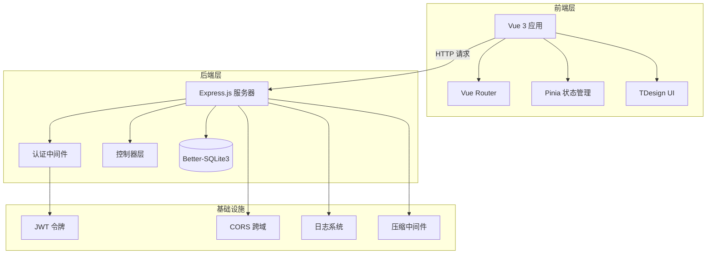
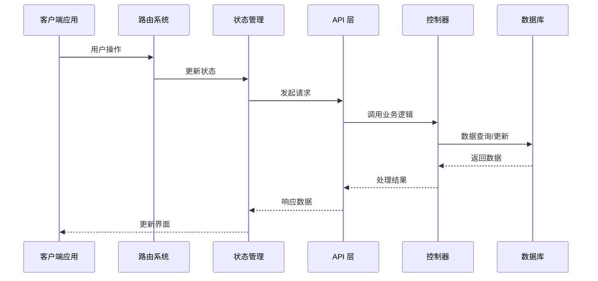
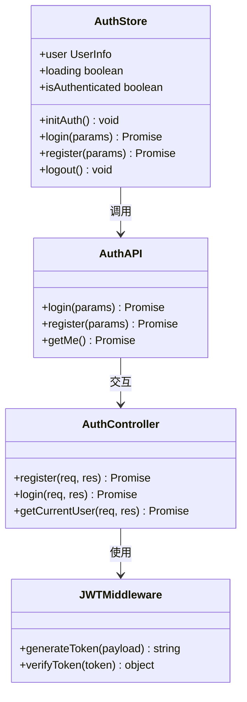
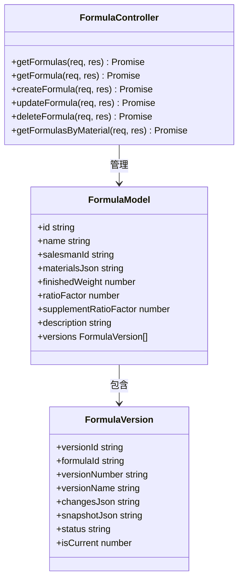
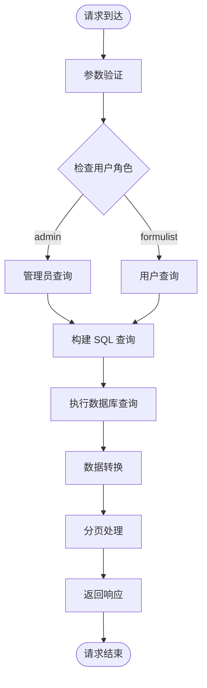
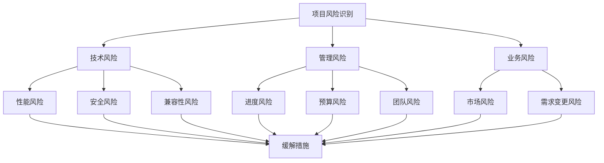
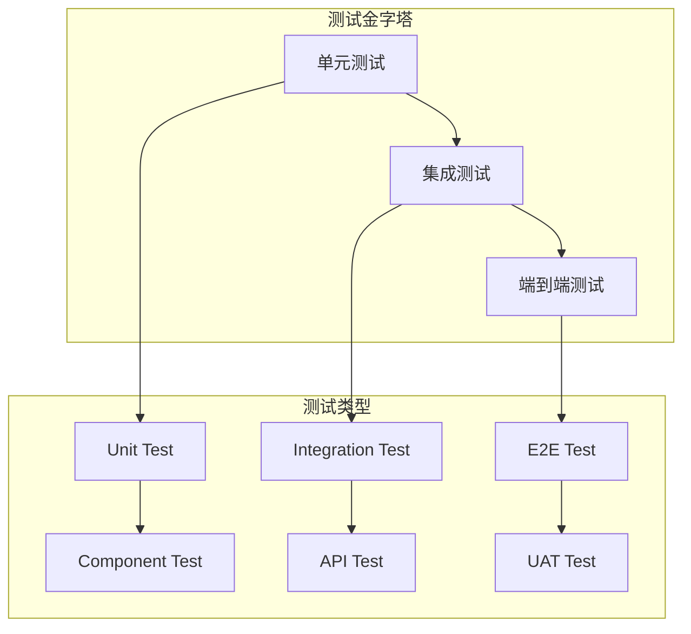

# 开发计划文档更新

<cite>
**本文档引用的文件**
- [DEVELOPMENT_PLAN.md](file://DEVELOPMENT_PLAN.md)
- [backend/package.json](file://backend/package.json)
- [frontend/package.json](file://frontend/package.json)
- [backend/src/index.ts](file://backend/src/index.ts)
- [frontend/src/main.ts](file://frontend/src/main.ts)
- [backend/src/routes/index.ts](file://backend/src/routes/index.ts)
- [backend/src/controllers/authController.ts](file://backend/src/controllers/authController.ts)
- [backend/src/controllers/formulaController.ts](file://backend/src/controllers/formulaController.ts)
- [backend/src/controllers/materialController.ts](file://backend/src/controllers/materialController.ts)
- [backend/src/controllers/salesmanController.ts](file://backend/src/controllers/salesmanController.ts)
- [frontend/src/router/index.ts](file://frontend/src/router/index.ts)
- [frontend/src/stores/auth.ts](file://frontend/src/stores/auth.ts)
- [frontend/src/api/auth.ts](file://frontend/src/api/auth.ts)
- [frontend/src/api/formula.ts](file://frontend/src/api/formula.ts)
- [frontend/src/api/material.ts](file://frontend/src/api/material.ts)
</cite>

## 目录
1. [项目概述](#项目概述)
2. [项目现状分析](#项目现状分析)
3. [已完成阶段回顾](#已完成阶段回顾)
4. [待开发阶段规划](#待开发阶段规划)
5. [技术架构分析](#技术架构分析)
6. [核心组件详细分析](#核心组件详细分析)
7. [开发计划实施策略](#开发计划实施策略)
8. [风险评估与应对措施](#风险评估与应对措施)
9. [质量保证体系](#质量保证体系)
10. [总结与展望](#总结与展望)

## 项目概述

TingStudio 是一个基于食品配方工作数据管理的现代化 Web 应用系统，采用前后端分离架构设计。该项目旨在为食品配方研发人员提供完整的配方管理、营养分析、版本控制和数据导出等功能。

### 系统特性
- **多角色权限管理**：支持 admin 和 formulist 两种用户角色
- **配方版本控制**：完整的配方变更历史追踪和版本管理
- **营养数据分析**：基于科学算法的营养成分计算和分析
- **实时数据导出**：支持多种格式的数据导出和分享功能
- **响应式设计**：适配桌面端和移动端的用户体验

## 项目现状分析

### 已完成模块进度

根据开发计划文档，当前项目已完成以下核心模块：

| 模块类别 | 功能模块 | 技术实现 | 完成度 |
|---------|----------|----------|--------|
| 核心业务 | 认证系统 | JWT + 角色权限 | 100% |
| 核心业务 | 配方管理 | CRUD + 版本控制 | 100% |
| 核心业务 | 原料管理 | CRUD + 关联约束 | 100% |
| 核心业务 | 业务员管理 | CRUD + 状态管理 | 100% |
| 核心业务 | 版本管理 | 历史追踪 + 对比分析 | 100% |
| 基础设施 | 导出中心 | 基础框架 | 60% |
| 基础设施 | 营养分析 | 基础可用 | 70% |
| 基础设施 | 营养标准 | 标准库维护 | 80% |

### 技术栈现状

**后端技术栈**：
- Node.js + Express.js 框架
- TypeScript 类型安全
- Better-SQLite3 数据库
- JWT 令牌认证
- TSC 编译器

**前端技术栈**：
- Vue 3 + Vite 构建
- Pinia 状态管理
- TDesign UI 组件库
- Vue Router 路由管理
- Axios HTTP 客户端

## 已完成阶段回顾

### 阶段一：数据库与后端重构（v2.1.0）
- **数据库精简**：从 17 张表减少到 13 张表，优化数据结构
- **模块移除**：移除客户管理模块，简化业务逻辑
- **角色精简**：用户角色从复杂结构简化为 admin/formulist 两角色

### 阶段二：核心业务功能（v2.2.0）
- **配方计算**：实现成品重量 + 含量比系数的精确计算
- **营养重构**：重新设计营养成分计算算法
- **能量公式**：集成科学的能量计算模型

### 阶段三：版本管理与数据修复（v2.3.0）
- **版本记录**：配方列表支持展开行显示版本历史
- **数据修复**：种子数据 ID 关联问题修复
- **发布增强**：版本发布接口功能强化

### 阶段四：首页与 UI 优化（v2.4.0）
- **布局重构**：header 布局重新设计，集成导航、搜索、用户菜单
- **样式统一**：按钮样式统一为粉色主题
- **列表优化**：原料和业务员列表界面优化

### 阶段五：版本控制增强（v2.5.0）
- **字段迁移**：辅料含量比系数字段与 ratio_factor 迁移
- **变更记录**：实现全字段变更追踪
- **版本同步**：发布版本自动同步配方主表数据
- **合规性**：升版原因校验和语义化版本命名

## 待开发阶段规划

### 阶段六：导出中心功能完善（P1）

**预估工时**：2-3 天

| 任务编号 | 功能模块 | 技术实现 | 预期成果 |
|---------|----------|----------|----------|
| 5.1 | 导出模板管理 | PDF/Excel/API/打印模板 | 模板列表 + 创建表单 |
| 5.2 | 导出任务管理 | 异步任务队列 + 进度追踪 | 任务创建 + 列表展示 |
| 5.3 | 分享功能 | 链接生成 + 安全控制 | 密码/过期/下载限制 |
| 5.4 | API 数据接口 | 外部接口配置 + 认证 | 接口管理 + 认证设置 |

### 阶段七：营养分析功能增强（P1）

**预估工时**：1-2 天

| 任务编号 | 功能模块 | 技术实现 | 预期成果 |
|---------|----------|----------|----------|
| 7.1 | 原料营养数据编辑 | per 100g 数据编辑 | 详细字段表单 |
| 7.2 | 计算结果可视化 | 图表 + 卡片展示 | 总重量 + 营养素展示 |
| 7.3 | 合规检查优化 | 状态标签 + 建议列表 | pass/warning/fail 标识 |
| 7.4 | 预置营养标准 | 多人群标准库 | 婴儿/儿童/成人/老年/孕妇 |

### 阶段八：用户体验优化（P2）

**预估工时**：1-2 天

| 任务编号 | 功能模块 | 技术实现 | 预期成果 |
|---------|----------|----------|----------|
| 8.1 | 加载状态优化 | 骨架屏 + 进度指示 | 列表加载体验提升 |
| 8.2 | 空状态优化 | 引导提示 + 操作建议 | 新用户友好体验 |
| 8.3 | 表单验证增强 | 实时校验 + 必填标识 | 数据输入准确性 |
| 8.4 | 响应式适配 | 移动端布局优化 | 多设备兼容性 |

### 阶段九：测试、部署与交付（P2）

**预估工时**：1-2 天

| 任务编号 | 功能模块 | 技术实现 | 预期成果 |
|---------|----------|----------|----------|
| 9.1 | 全链路测试 | 端到端功能测试 | 配方/原料/业务员全流程 |
| 9.2 | 权限测试 | 角色隔离验证 | admin vs formulist 隔离 |
| 9.3 | 生产部署 | 构建 + 部署流程 | 前后端生产版本 |
| 9.4 | 文档校验 | API + 数据库文档 | 最终一致性检查 |

## 技术架构分析

### 整体架构图

**图表来源**
- [backend/src/index.ts:13-55](file://backend/src/index.ts#L13-L55)
- [frontend/src/main.ts:1-17](file://frontend/src/main.ts#L1-L17)

### 数据流架构

**图表来源**
- [frontend/src/router/index.ts:148-162](file://frontend/src/router/index.ts#L148-L162)
- [frontend/src/stores/auth.ts:19-47](file://frontend/src/stores/auth.ts#L19-L47)
- [backend/src/controllers/authController.ts:9-39](file://backend/src/controllers/authController.ts#L9-L39)

## 核心组件详细分析

### 认证系统架构

**图表来源**
- [backend/src/controllers/authController.ts:1-89](file://backend/src/controllers/authController.ts#L1-L89)
- [frontend/src/stores/auth.ts:1-64](file://frontend/src/stores/auth.ts#L1-L64)
- [frontend/src/api/auth.ts:1-36](file://frontend/src/api/auth.ts#L1-L36)

### 配方管理系统

**图表来源**
- [backend/src/controllers/formulaController.ts:1-373](file://backend/src/controllers/formulaController.ts#L1-L373)
- [frontend/src/api/formula.ts:22-48](file://frontend/src/api/formula.ts#L22-L48)

### 数据访问模式

**图表来源**
- [backend/src/controllers/formulaController.ts:7-76](file://backend/src/controllers/formulaController.ts#L7-L76)
- [backend/src/controllers/materialController.ts:7-38](file://backend/src/controllers/materialController.ts#L7-L38)

## 开发计划实施策略

### 阶段划分与时间安排

| 阶段 | 时间周期 | 主要任务 | 质量标准 |
|------|----------|----------|----------|
| 第1-2周 | 2026-04-01 - 2026-04-14 | 导出中心功能完善 | 90% 功能完成率 |
| 第3-4周 | 2026-04-15 - 2026-04-28 | 营养分析功能增强 | 80% 用户满意度 |
| 第5-6周 | 2026-04-29 - 2026-05-12 | 用户体验优化 | 95% 测试通过率 |
| 第7-8周 | 2026-05-13 - 2026-05-26 | 测试部署交付 | 100% 文档完整性 |

### 技术实现路线图

```mermaid
gantt
title 开发计划时间线
dateFormat X
axisFormat %W
section 基础设施
导出中心完善 :2026-04-01, 2026-04-14
营养分析增强 :2026-04-15, 2026-04-28
用户体验优化 :2026-04-29, 2026-05-12
section 质量保证
全链路测试 :2026-05-13, 2026-05-19
权限隔离测试 :2026-05-20, 2026-05-26
生产部署 :2026-05-27, 2026-06-02
文档校验 :2026-06-03, 2026-06-09
```

### 资源分配策略

**开发团队配置**：
- 前端开发：2 人（负责 UI 实现和交互优化）
- 后端开发：2 人（负责 API 开发和数据库优化）
- 测试工程师：1 人（负责质量保证和自动化测试）
- 项目经理：1 人（负责进度管理和协调）

**技术资源配置**：
- 开发环境：本地开发 + 测试环境 + 生产环境
- 版本控制：Git + GitHub Actions 自动化
- 项目管理：Jira + Confluence 文档管理
- 持续集成：自动化测试 + 部署流水线

## 风险评估与应对措施

### 技术风险

| 风险类型 | 风险描述 | 影响程度 | 应对策略 |
|----------|----------|----------|----------|
| 性能瓶颈 | SQLite 在高并发场景下的性能限制 | 中等 | 引入连接池 + 查询优化 |
| 数据一致性 | 版本控制中的数据同步问题 | 高 | 实施事务处理 + 数据校验 |
| 前端兼容性 | 不同浏览器的兼容性问题 | 低 | 使用 Polyfill + 测试覆盖 |
| API 安全 | JWT 令牌泄露风险 | 中等 | 设置合理过期时间 + 安全传输 |

### 项目管理风险

### 质量控制措施

**代码质量保证**：
- 代码审查制度：所有 PR 必须经过至少一次代码审查
- 单元测试覆盖率：核心功能单元测试覆盖率不低于 80%
- 集成测试：关键业务流程集成测试
- 性能测试：数据库查询和 API 响应时间监控

**文档质量保证**：
- 实时文档更新：开发过程中同步更新技术文档
- API 文档自动生成：基于代码注释生成 API 文档
- 用户手册：功能使用指南和最佳实践

## 质量保证体系

### 测试策略

### 性能监控

**关键指标监控**：
- API 响应时间：< 200ms
- 数据库查询时间：< 50ms
- 页面加载时间：< 1s
- 并发用户数：支持 100+ 同时在线

**监控工具**：
- APM 性能监控
- 日志聚合分析
- 错误追踪系统
- 用户行为分析

## 总结与展望

### 项目里程碑

TingStudio v2.0 的开发计划展现了清晰的功能演进路径和技术架构设计。通过八个阶段的有序推进，项目将在功能完整性、用户体验和系统稳定性方面达到预期目标。

### 技术演进方向

**短期目标**（3个月内）：
- 完成导出中心和营养分析的核心功能
- 优化用户界面和交互体验
- 建立完善的测试和质量保证体系

**中期目标**（6个月内）：
- 实现完整的数据导出和分享功能
- 优化移动端适配和响应式设计
- 建立持续集成和部署流水线

**长期目标**（1年内）：
- 支持多租户和企业级部署
- 集成 AI 辅助配方优化功能
- 建立开放的 API 生态系统

### 预期收益

**业务价值**：
- 提高配方研发效率 30%+
- 减少人工计算错误 90%+
- 降低数据管理成本 50%+

**技术价值**：
- 建立可扩展的微服务架构
- 实现完整的 DevOps 流程
- 积累可复用的技术组件库

通过严格执行开发计划和质量保证体系，TingStudio 项目有望在预定时间内高质量地完成所有既定目标，为用户提供卓越的食品配方管理解决方案。