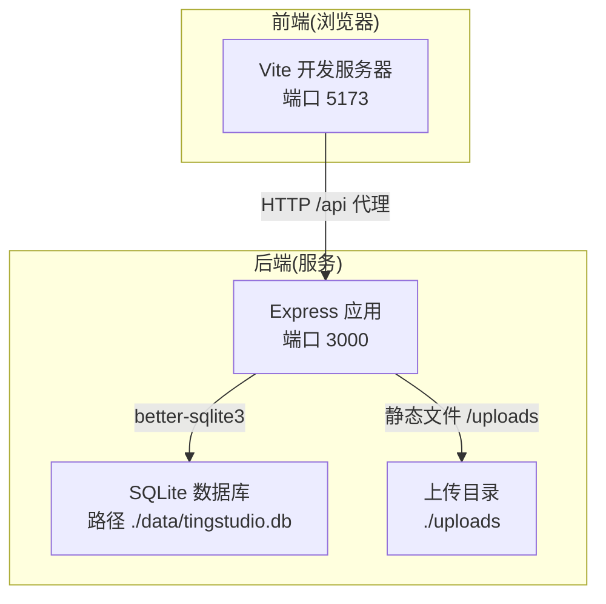
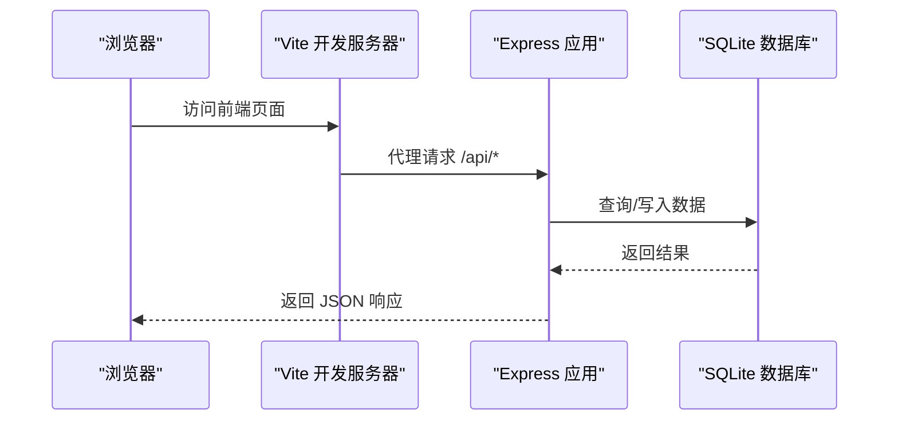
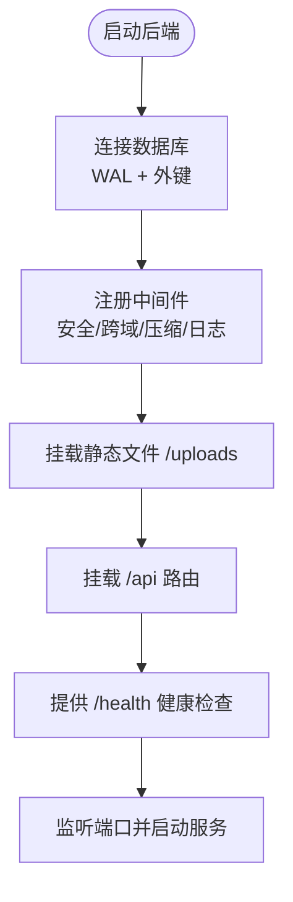
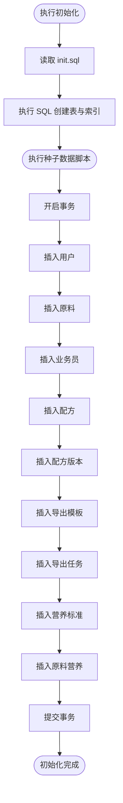
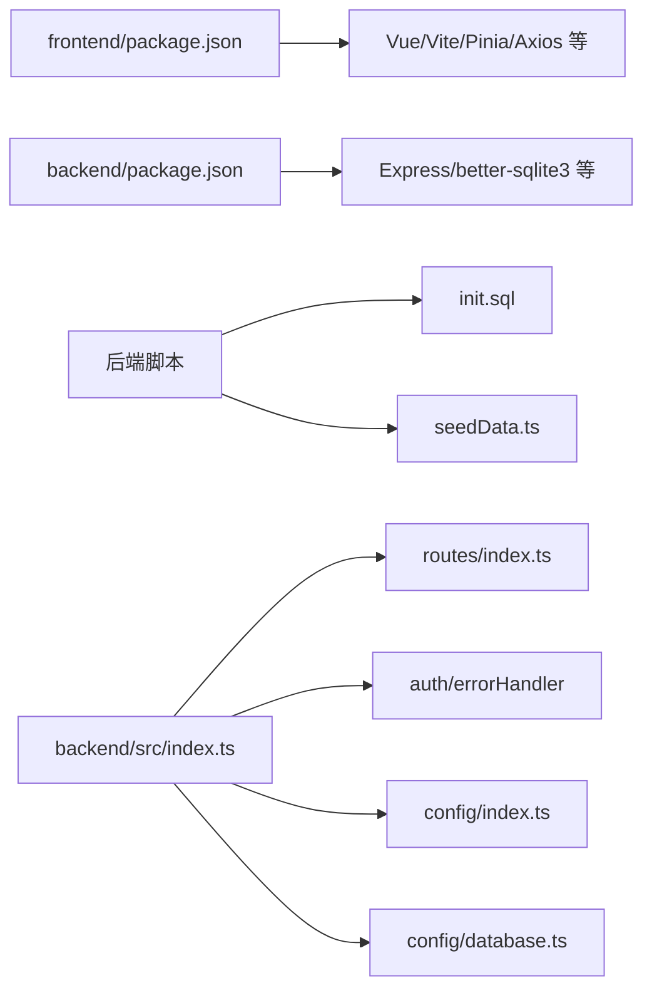

# 构建与部署

<cite>
**本文引用的文件**
- [frontend/vite.config.ts](file://frontend/vite.config.ts)
- [frontend/package.json](file://frontend/package.json)
- [backend/package.json](file://backend/package.json)
- [backend/src/index.ts](file://backend/src/index.ts)
- [backend/src/config/index.ts](file://backend/src/config/index.ts)
- [backend/src/config/database.ts](file://backend/src/config/database.ts)
- [backend/src/utils/logger.ts](file://backend/src/utils/logger.ts)
- [backend/src/utils/helpers.ts](file://backend/src/utils/helpers.ts)
- [backend/src/middleware/auth.ts](file://backend/src/middleware/auth.ts)
- [backend/src/middleware/errorHandler.ts](file://backend/src/middleware/errorHandler.ts)
- [backend/src/routes/index.ts](file://backend/src/routes/index.ts)
- [backend/src/scripts/initDatabase.ts](file://backend/src/scripts/initDatabase.ts)
- [backend/src/scripts/init.sql](file://backend/src/scripts/init.sql)
- [backend/src/scripts/seedData.ts](file://backend/src/scripts/seedData.ts)
- [backend/src/scripts/importNutritionData.ts](file://backend/src/scripts/importNutritionData.ts)
- [backend/.gitignore](file://backend/.gitignore)
- [scripts/update-docs.ps1](file://scripts/update-docs.ps1)
</cite>

## 目录
1. [简介](#简介)
2. [项目结构](#项目结构)
3. [核心组件](#核心组件)
4. [架构总览](#架构总览)
5. [详细组件分析](#详细组件分析)
6. [依赖关系分析](#依赖关系分析)
7. [性能考量](#性能考量)
8. [故障排查指南](#故障排查指南)
9. [结论](#结论)
10. [附录](#附录)

## 简介
本指南面向 TingStudio 的构建与部署实践，覆盖前端 Vite 构建配置与生产优化（代码分割、资源压缩、缓存策略）、后端 Express 应用打包与部署流程（数据库初始化与种子数据生成）、环境变量配置与多环境差异、容器化与编排部署方案、CI/CD 流水线与监控建议，以及部署后的验证与回滚策略。内容基于仓库现有配置与脚本进行系统化整理，帮助团队在开发、测试与生产环境中稳定交付。

## 项目结构
TingStudio 采用前后端分离架构：
- 前端：Vue 3 + Vite，通过本地代理访问后端 API
- 后端：Express + TypeScript，使用 better-sqlite3 作为持久化存储，提供 REST 接口与静态资源服务

图表来源
- [frontend/vite.config.ts:12-21](file://frontend/vite.config.ts#L12-L21)
- [backend/src/index.ts:31-35](file://backend/src/index.ts#L31-L35)
- [backend/src/config/database.ts:18-23](file://backend/src/config/database.ts#L18-L23)
- [backend/src/config/index.ts:6-8](file://backend/src/config/index.ts#L6-L8)

章节来源
- [frontend/vite.config.ts:1-23](file://frontend/vite.config.ts#L1-L23)
- [backend/src/index.ts:13-55](file://backend/src/index.ts#L13-L55)

## 核心组件
- 前端构建与开发
  - 使用 Vite 进行开发与构建，配置了本地代理到后端服务，便于联调
  - 生产构建命令会先类型检查再打包，确保类型安全
- 后端应用与数据库
  - Express 应用启动时连接 SQLite，并启用安全、压缩与日志中间件
  - 数据库初始化脚本一次性执行 SQL 文件创建所有表；种子数据脚本批量插入演示数据
- 配置与环境变量
  - 配置集中于配置模块，支持端口、数据库路径、JWT、上传目录、CORS 等参数
  - 日志工具按环境输出调试信息
- 中间件与路由
  - 认证中间件基于 JWT；全局错误处理器对常见数据库约束与文件大小等错误做分类处理
  - 路由按模块聚合，统一挂载到 /api 下

章节来源
- [frontend/package.json:6-10](file://frontend/package.json#L6-L10)
- [backend/package.json:6-12](file://backend/package.json#L6-L12)
- [backend/src/config/index.ts:1-24](file://backend/src/config/index.ts#L1-L24)
- [backend/src/config/database.ts:10-30](file://backend/src/config/database.ts#L10-L30)
- [backend/src/middleware/auth.ts:13-37](file://backend/src/middleware/auth.ts#L13-L37)
- [backend/src/middleware/errorHandler.ts:5-50](file://backend/src/middleware/errorHandler.ts#L5-L50)
- [backend/src/routes/index.ts:11-23](file://backend/src/routes/index.ts#L11-L23)

## 架构总览
下图展示从浏览器到后端再到数据库的数据流与交互：

图表来源
- [frontend/vite.config.ts:15-20](file://frontend/vite.config.ts#L15-L20)
- [backend/src/index.ts:35-48](file://backend/src/index.ts#L35-L48)
- [backend/src/config/database.ts:44-55](file://backend/src/config/database.ts#L44-L55)

## 详细组件分析

### 前端构建与生产优化
- 构建命令
  - 类型检查与打包：先执行类型检查，再进行构建，降低运行时类型错误风险
- 本地开发
  - 本地代理将 /api 请求转发至后端服务，便于前后端联调
  - 别名 @ 指向 src，提升导入可读性
- 生产优化建议
  - 代码分割：利用 Vite 的动态导入实现路由级或组件级懒加载，减少首屏体积
  - 资源压缩：生产构建默认启用 JS/HTML/CSS 压缩；如需更细粒度控制，可在 Vite 配置中扩展插件链
  - 缓存策略：静态资源采用内容哈希命名；服务端通过合适的 Cache-Control 和 ETag 实现浏览器缓存
  - 预加载与预取：对关键路由与首屏依赖进行预加载，非关键资源使用预取
  - 图片与字体：压缩图片、使用现代格式（如 WebP），字体使用子集化与可变字体以减小体积
  - HTTPS 与安全头：生产环境启用 HTTPS 并配置安全响应头（HSTS、X-Content-Type-Options 等）
  - 性能监控：集成 Web Vitals 或自定义埋点，持续观测 LCP、FID、CLS 等指标

章节来源
- [frontend/package.json:8](file://frontend/package.json#L8)
- [frontend/vite.config.ts:5-22](file://frontend/vite.config.ts#L5-L22)

### 后端 Express 应用打包与部署
- 启动流程
  - 初始化数据库连接，开启 WAL 与外键约束
  - 注册安全、跨域、压缩、日志中间件
  - 挂载静态文件 /uploads 与 API 路由
  - 提供健康检查接口
- 部署要点
  - 构建：TypeScript 编译为 JavaScript，产物位于 dist
  - 运行：使用 Node.js 启动 dist/index.js
  - 环境变量：通过 .env 文件注入，避免硬编码
  - 上传目录：确保 uploads 目录可写，持久化文件存放于此
  - 健康检查：对外暴露 /health 接口，便于负载均衡与编排平台探测

图表来源
- [backend/src/index.ts:13-55](file://backend/src/index.ts#L13-L55)
- [backend/src/config/database.ts:18-30](file://backend/src/config/database.ts#L18-L30)

章节来源
- [backend/package.json:7-12](file://backend/package.json#L7-L12)
- [backend/src/index.ts:13-55](file://backend/src/index.ts#L13-L55)
- [backend/src/config/index.ts:1-24](file://backend/src/config/index.ts#L1-L24)

### 数据库初始化与种子数据
- 初始化脚本
  - 读取 SQL 文件并一次性执行，创建所有表与索引
  - 支持重复执行，避免因表已存在导致失败
- 种子数据
  - 批量插入用户、原料、业务员、配方、版本、导出模板、导出任务、营养标准与原料营养数据
  - 使用事务保证一致性，失败时回滚
  - 包含从 Excel 提取的真实数据，便于演示与测试

图表来源
- [backend/src/scripts/initDatabase.ts:11-31](file://backend/src/scripts/initDatabase.ts#L11-L31)
- [backend/src/scripts/init.sql:1-228](file://backend/src/scripts/init.sql#L1-L228)
- [backend/src/scripts/seedData.ts:102-393](file://backend/src/scripts/seedData.ts#L102-L393)

章节来源
- [backend/src/scripts/initDatabase.ts:1-37](file://backend/src/scripts/initDatabase.ts#L1-L37)
- [backend/src/scripts/init.sql:1-228](file://backend/src/scripts/init.sql#L1-L228)
- [backend/src/scripts/seedData.ts:1-399](file://backend/src/scripts/seedData.ts#L1-L399)

### 环境变量与多环境差异
- 关键变量
  - 端口：PORT
  - 数据库路径：DB_PATH
  - JWT 密钥与过期：JWT_SECRET、JWT_EXPIRES_IN
  - 上传目录与大小限制：UPLOAD_DIR、MAX_FILE_SIZE
  - CORS 来源：CORS_ORIGIN
  - 日志级别：NODE_ENV（影响调试输出）
- 开发 vs 生产
  - 开发：Vite 本地代理到后端；日志输出调试信息
  - 生产：后端直接提供静态资源；启用压缩与安全头；严格控制日志级别

章节来源
- [backend/src/config/index.ts:1-24](file://backend/src/config/index.ts#L1-L24)
- [backend/src/utils/logger.ts:24-39](file://backend/src/utils/logger.ts#L24-L39)
- [backend/src/index.ts:21-28](file://backend/src/index.ts#L21-L28)

### 容器化与编排部署
- 容器镜像建议
  - 基础镜像：官方 Node.js LTS
  - 前端：构建产物放入 Nginx 或静态站点根目录，或在容器内运行轻量 HTTP 服务
  - 后端：安装依赖后构建，运行 dist/index.js；挂载 uploads 目录与数据目录
  - 环境变量：通过镜像构建参数或运行时注入
- Kubernetes 部署要点
  - Deployment：副本数、滚动更新策略、就绪/存活探针
  - Service：ClusterIP/LoadBalancer，暴露后端服务
  - ConfigMap：存放非敏感配置（如 CORS、JWT 过期等）
  - Secret：存放数据库路径、JWT 密钥、上传目录等敏感信息
  - PersistentVolume：为 SQLite 数据文件与上传目录提供持久化存储
  - Ingress：反向代理与 TLS 终止
  - HPA：根据 CPU/内存或自定义指标自动扩缩容
- Docker Compose 示例思路
  - 服务：nginx（前端静态）、node（后端）、sqlite（数据卷）
  - 网络：隔离后端与前端
  - 卷：挂载 uploads 与数据目录

[本节为概念性部署方案说明，不直接对应具体源码文件，故无“章节来源”]

### CI/CD 流水线与监控
- 流水线阶段
  - 触发：Push/PR 触发构建
  - 安装依赖：分别在前后端目录执行安装
  - 类型检查与单元测试：前端类型检查，后端 TS 编译与测试
  - 构建：前端构建产物，后端编译 dist
  - 扫描：镜像漏洞扫描与依赖审计
  - 部署：发布到目标环境（容器或裸机）
  - 回归：健康检查与关键接口验证
- 监控与告警
  - 应用：日志采集、错误率、响应时间、P95/P99
  - 基础设施：CPU/内存/磁盘/网络、Pod/容器状态
  - 告警：阈值触发与通知渠道（邮件/IM）

[本节为通用实践建议，不直接对应具体源码文件，故无“章节来源”]

## 依赖关系分析
- 前端
  - 依赖 Vue 3、Vite、Pinia、Axios 等，构建脚本依赖 vue-tsc 与 vite
- 后端
  - 依赖 Express、better-sqlite3、bcryptjs、helmet、compression、cors、morgan、multer 等
  - 通过脚本完成数据库初始化与种子数据插入
- 配置与工具
  - 配置集中于 config 模块；日志与工具函数提供统一能力；中间件负责认证与错误处理

图表来源
- [frontend/package.json:12-29](file://frontend/package.json#L12-L29)
- [backend/package.json:14-26](file://backend/package.json#L14-L26)
- [backend/src/scripts/init.sql:1-228](file://backend/src/scripts/init.sql#L1-L228)
- [backend/src/scripts/seedData.ts:1-399](file://backend/src/scripts/seedData.ts#L1-L399)
- [backend/src/index.ts:8-11](file://backend/src/index.ts#L8-L11)
- [backend/src/routes/index.ts:1-24](file://backend/src/routes/index.ts#L1-L24)
- [backend/src/middleware/auth.ts:1-38](file://backend/src/middleware/auth.ts#L1-L38)
- [backend/src/middleware/errorHandler.ts:1-51](file://backend/src/middleware/errorHandler.ts#L1-L51)
- [backend/src/config/index.ts:1-24](file://backend/src/config/index.ts#L1-L24)
- [backend/src/config/database.ts:1-70](file://backend/src/config/database.ts#L1-L70)

章节来源
- [frontend/package.json:1-30](file://frontend/package.json#L1-L30)
- [backend/package.json:1-42](file://backend/package.json#L1-L42)

## 性能考量
- 前端
  - 动态导入实现按需加载；合理拆分 vendor 与业务代码；启用压缩与内容哈希
  - 静态资源 CDN 加速；缓存策略与 ETag 配合
- 后端
  - better-sqlite3 适合中小规模数据；开启 WAL 模式提升并发读取
  - 合理索引（已有 SQL 中创建索引）；避免 N+1 查询；分页参数校验
  - 压缩中间件减少带宽；日志级别控制开销
- 存储与上传
  - 上传目录独立挂载，避免频繁 IO 影响主进程；文件大小限制防止滥用

[本节提供通用指导，不直接分析具体文件，故无“章节来源”]

## 故障排查指南
- 启动失败
  - 检查数据库连接路径与权限；确认 uploads 目录存在且可写
  - 查看日志输出，区分开发与生产日志级别
- 认证问题
  - 核对 JWT 密钥与过期配置；确认客户端携带正确的 Bearer Token
- 数据库约束冲突
  - UNIQUE 冲突：提示数据已存在；FOREIGN KEY 冲突：提示关联数据不存在
- 文件上传失败
  - 超出大小限制：调整 MAX_FILE_SIZE；检查上传目录权限
- 健康检查
  - 对外暴露 /health 接口，用于编排平台探测与自动恢复

章节来源
- [backend/src/config/database.ts:18-30](file://backend/src/config/database.ts#L18-L30)
- [backend/src/utils/logger.ts:24-39](file://backend/src/utils/logger.ts#L24-L39)
- [backend/src/middleware/auth.ts:13-37](file://backend/src/middleware/auth.ts#L13-L37)
- [backend/src/middleware/errorHandler.ts:13-40](file://backend/src/middleware/errorHandler.ts#L13-L40)
- [backend/src/index.ts:38-40](file://backend/src/index.ts#L38-L40)

## 结论
本指南基于仓库现有配置与脚本，给出了前后端构建与部署的完整实践路径。通过明确的环境变量、数据库初始化与种子数据流程、中间件与路由组织，以及可扩展的容器化与编排建议，团队可以在不同环境中稳定交付 TingStudio。建议在生产环境中进一步完善 CI/CD、监控与备份策略，并结合实际流量与数据规模持续优化性能与可靠性。

## 附录
- 部署后验证清单
  - 健康检查：访问 /health，确认返回正常
  - 登录与鉴权：使用 admin 账号登录，验证 JWT 生成与刷新
  - 数据初始化：确认用户、原料、配方、版本等种子数据存在
  - 上传功能：上传文件至 /uploads，确认可访问
  - 接口连通性：调用关键 API（如列表、详情、导出）验证响应
- 回滚策略
  - 快照与版本：保留上一个稳定版本的镜像与配置
  - 数据备份：定期备份 SQLite 数据文件与上传目录
  - 一键回滚：通过编排平台回滚到上一个稳定版本；必要时回退数据库快照

[本节为通用操作建议，不直接对应具体源码文件，故无“章节来源”]