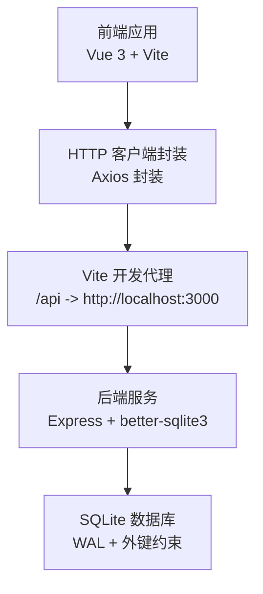
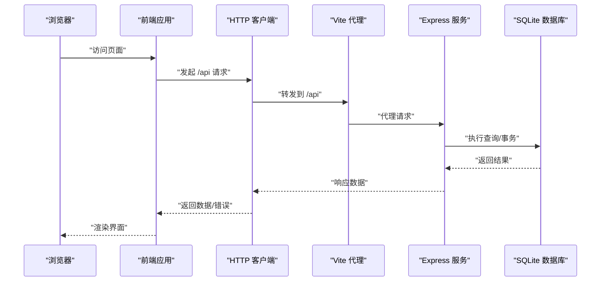
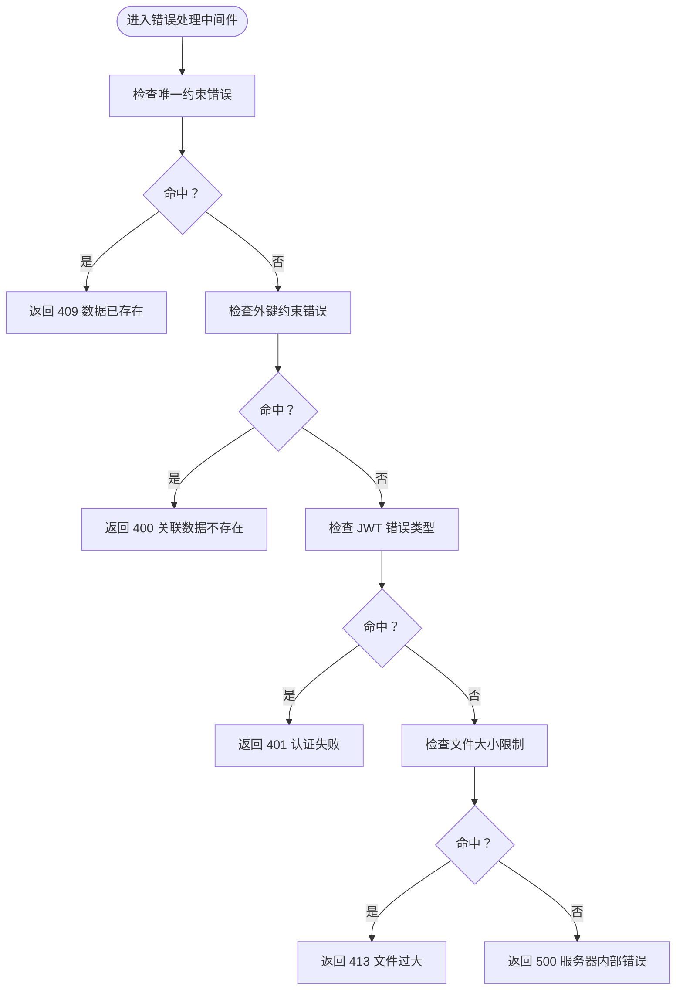
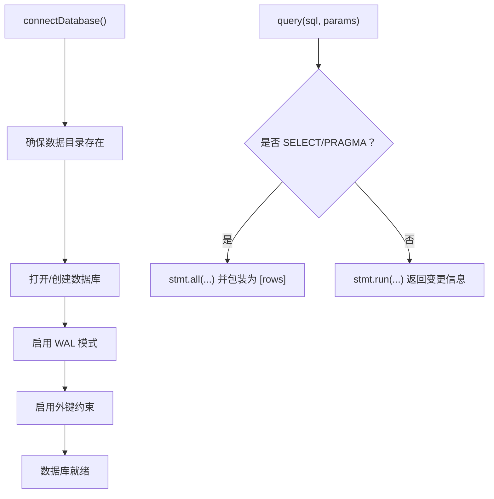
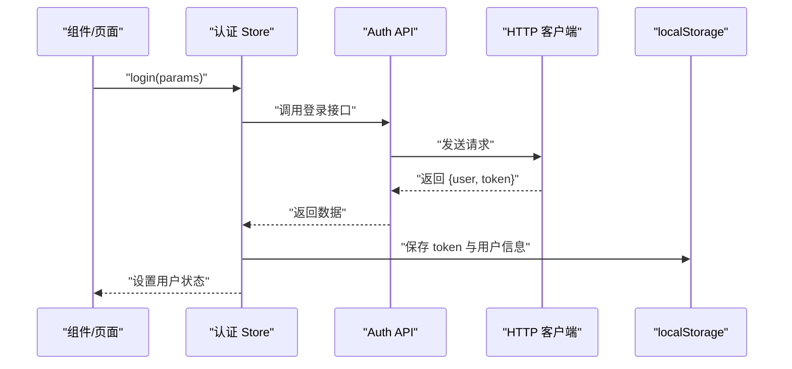
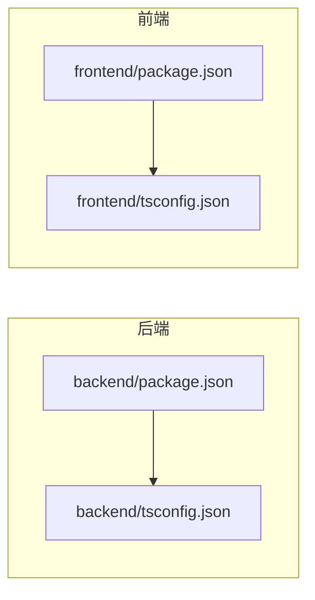

# 测试与调试

<cite>
**本文引用的文件**
- [backend/package.json](file://backend/package.json)
- [frontend/package.json](file://frontend/package.json)
- [backend/tsconfig.json](file://backend/tsconfig.json)
- [frontend/tsconfig.json](file://frontend/tsconfig.json)
- [backend/src/index.ts](file://backend/src/index.ts)
- [frontend/vite.config.ts](file://frontend/vite.config.ts)
- [backend/src/utils/logger.ts](file://backend/src/utils/logger.ts)
- [backend/src/middleware/errorHandler.ts](file://backend/src/middleware/errorHandler.ts)
- [backend/src/config/database.ts](file://backend/src/config/database.ts)
- [backend/src/routes/index.ts](file://backend/src/routes/index.ts)
- [frontend/src/api/http.ts](file://frontend/src/api/http.ts)
- [frontend/src/stores/auth.ts](file://frontend/src/stores/auth.ts)
- [frontend/src/utils/mockData.ts](file://frontend/src/utils/mockData.ts)
</cite>

## 目录
1. [简介](#简介)
2. [项目结构](#项目结构)
3. [核心组件](#核心组件)
4. [架构总览](#架构总览)
5. [详细组件分析](#详细组件分析)
6. [依赖分析](#依赖分析)
7. [性能考虑](#性能考虑)
8. [故障排查指南](#故障排查指南)
9. [结论](#结论)
10. [附录](#附录)

## 简介
本指南面向 TingStudio 的开发与测试团队，系统化阐述如何在前后端分别开展单元测试与集成测试，如何利用浏览器开发者工具、Node.js 调试器与数据库调试手段进行问题定位，如何通过 Mock 数据与测试环境配置提升测试效率，并给出性能分析与内存泄漏检测方法、错误监控与日志记录最佳实践、常见 Bug 调试技巧与性能优化建议，以及测试覆盖率要求与持续集成中的测试执行策略。

## 项目结构
- 后端采用 Express + better-sqlite3，提供 RESTful 接口，支持健康检查、静态资源、CORS、压缩、安全头等中间件。
- 前端基于 Vue 3 + Vite，使用 Pinia 状态管理、Axios 封装的 HTTP 客户端，路由代理到后端 /api。
- 两者通过 /api 前缀打通，前端本地开发默认代理至后端 3000 端口。

图表来源
- [frontend/vite.config.ts:12-21](file://frontend/vite.config.ts#L12-L21)
- [backend/src/index.ts:35-48](file://backend/src/index.ts#L35-L48)
- [backend/src/config/database.ts:21-23](file://backend/src/config/database.ts#L21-L23)

章节来源
- [backend/src/index.ts:13-54](file://backend/src/index.ts#L13-L54)
- [frontend/vite.config.ts:1-23](file://frontend/vite.config.ts#L1-L23)

## 核心组件
- 日志与错误处理：后端提供统一日志格式与错误处理中间件，便于测试时捕获异常与断言。
- 数据库连接：better-sqlite3 连接、事务封装与查询兼容层，便于在测试中注入/清理数据。
- 前端 HTTP 客户端：统一请求/响应拦截器、Token 注入、401 自动登出逻辑，便于模拟鉴权场景。
- 认证状态：Pinia Store 管理用户会话，便于在测试中注入/重置用户状态。

章节来源
- [backend/src/utils/logger.ts:24-39](file://backend/src/utils/logger.ts#L24-L39)
- [backend/src/middleware/errorHandler.ts:5-50](file://backend/src/middleware/errorHandler.ts#L5-L50)
- [backend/src/config/database.ts:32-61](file://backend/src/config/database.ts#L32-L61)
- [frontend/src/api/http.ts:6-43](file://frontend/src/api/http.ts#L6-L43)
- [frontend/src/stores/auth.ts:6-63](file://frontend/src/stores/auth.ts#L6-L63)

## 架构总览
下图展示从浏览器到后端再到数据库的典型请求链路，以及错误处理与日志落盘路径。

图表来源
- [frontend/vite.config.ts:15-19](file://frontend/vite.config.ts#L15-L19)
- [backend/src/index.ts:35-48](file://backend/src/index.ts#L35-L48)
- [backend/src/config/database.ts:44-55](file://backend/src/config/database.ts#L44-L55)

## 详细组件分析

### 后端：错误处理与日志
- 统一日志格式：按级别输出时间戳、消息与可选元数据；开发环境启用 debug 输出。
- 全局错误中间件：针对 SQLite 约束冲突、JWT 错误、文件大小限制等进行分类处理，返回语义化错误码与消息。
- 建议测试点：
  - 针对不同错误分支构造断言（如唯一约束冲突、外键缺失、JWT 过期）。
  - 使用日志输出验证错误是否被正确捕获与记录。

图表来源
- [backend/src/middleware/errorHandler.ts:14-40](file://backend/src/middleware/errorHandler.ts#L14-L40)

章节来源
- [backend/src/utils/logger.ts:24-39](file://backend/src/utils/logger.ts#L24-L39)
- [backend/src/middleware/errorHandler.ts:5-50](file://backend/src/middleware/errorHandler.ts#L5-L50)

### 后端：数据库连接与事务
- 连接管理：自动创建数据目录、启用 WAL 模式与外键约束，提供查询与事务封装。
- 查询兼容：SELECT 返回行数组，INSERT/UPDATE/DELETE 返回变更信息，便于控制器解构。
- 建议测试点：
  - 在测试前清理/重建表，在测试后回滚或删除临时数据。
  - 验证事务边界与回滚行为，确保并发场景下的数据一致性。

图表来源
- [backend/src/config/database.ts:10-30](file://backend/src/config/database.ts#L10-L30)
- [backend/src/config/database.ts:44-55](file://backend/src/config/database.ts#L44-L55)

章节来源
- [backend/src/config/database.ts:10-70](file://backend/src/config/database.ts#L10-L70)

### 前端：HTTP 客户端与认证状态
- Axios 封装：统一基础 URL、超时、请求头；请求自动附加 Token；响应统一错误处理与 401 自动登出。
- 认证 Store：管理用户信息、加载状态与登录/注册/退出流程；支持从本地缓存初始化。
- 建议测试点：
  - 模拟 Token 存在/不存在、401 场景、业务失败场景。
  - 断言 Store 用户状态变化与本地存储更新。

图表来源
- [frontend/src/stores/auth.ts:19-32](file://frontend/src/stores/auth.ts#L19-L32)
- [frontend/src/api/http.ts:12-19](file://frontend/src/api/http.ts#L12-L19)
- [frontend/src/api/http.ts:21-43](file://frontend/src/api/http.ts#L21-L43)

章节来源
- [frontend/src/api/http.ts:6-58](file://frontend/src/api/http.ts#L6-L58)
- [frontend/src/stores/auth.ts:6-63](file://frontend/src/stores/auth.ts#L6-L63)

### 前端：Mock 数据工具
- 提供中文姓名、手机号、邮箱、地址、原料/配方名称、库存与用量等生成器，支持随机打乱与多元素抽取。
- 建议测试点：
  - 使用 Mock 数据快速生成大量测试样本，覆盖边界值与异常输入。
  - 在组件测试中注入 Mock 数据，验证渲染与交互逻辑。

章节来源
- [frontend/src/utils/mockData.ts:48-192](file://frontend/src/utils/mockData.ts#L48-L192)

## 依赖分析
- 后端依赖：Express、better-sqlite3、CORS、Helmet、Compression、Morgan、JWT、Multer 等。
- 前端依赖：Vue 3、Vue Router、Pinia、Axios、tdesign-vue-next、vee-validate、yup 等。
- 构建与运行：后端使用 TypeScript + tsx，前端使用 Vite + Vue + TS。

图表来源
- [backend/package.json:14-40](file://backend/package.json#L14-L40)
- [frontend/package.json:12-28](file://frontend/package.json#L12-L28)
- [backend/tsconfig.json:2-24](file://backend/tsconfig.json#L2-L24)
- [frontend/tsconfig.json:2-31](file://frontend/tsconfig.json#L2-L31)

章节来源
- [backend/package.json:1-42](file://backend/package.json#L1-L42)
- [frontend/package.json:1-30](file://frontend/package.json#L1-L30)

## 性能考虑
- 数据库层面
  - WAL 模式提升并发读写性能；外键约束保障一致性但可能影响写入性能，需结合业务权衡。
  - 事务批量提交减少往返次数；避免长事务占用锁。
- 服务端层面
  - 压缩中间件降低传输体积；合理设置请求体大小限制防止内存压力。
  - Morgan 访问日志在生产环境建议降级为轻量格式。
- 前端层面
  - 合理拆分组件与懒加载；避免不必要的响应式计算；控制状态粒度。
  - Axios 超时与重试策略需平衡用户体验与服务器压力。

## 故障排查指南
- 浏览器端
  - 使用开发者工具 Network 面板观察 /api 请求状态码、响应体与请求头；查看 Console 是否有错误堆栈。
  - 在 Application 面板检查 localStorage 中的 Token 是否存在且未过期。
- Node.js 调试器
  - 后端使用 tsx 或 Node 调试参数启动，断点定位控制器、中间件与数据库层。
  - 前端在 Vite 开发环境下使用浏览器断点或 VS Code 调试配置。
- 数据库调试
  - 通过 better-sqlite3 CLI 或可视化工具查看 WAL 文件与当前事务状态。
  - 在测试中打印 SQL 与参数，核对约束冲突与外键关系。
- 日志与错误监控
  - 后端日志包含时间戳与级别，开发环境开启 debug；生产环境关注 error/warn。
  - 对关键路径增加上下文元数据（如用户 ID、请求 ID），便于追踪。

章节来源
- [backend/src/utils/logger.ts:13-39](file://backend/src/utils/logger.ts#L13-L39)
- [backend/src/middleware/errorHandler.ts:10-50](file://backend/src/middleware/errorHandler.ts#L10-L50)
- [backend/src/config/database.ts:21-23](file://backend/src/config/database.ts#L21-L23)

## 结论
通过规范化的日志与错误处理、完善的数据库连接与事务封装、统一的前端 HTTP 客户端与认证状态管理，以及丰富的 Mock 数据工具，TingStudio 可以构建稳定高效的测试体系。配合浏览器与 Node.js 调试器、数据库调试手段与日志监控，能够快速定位问题并持续优化性能与稳定性。

## 附录

### 单元测试与集成测试编写要点
- 后端
  - 使用 better-sqlite3 内存数据库或独立测试库进行隔离；在每个测试前准备种子数据，结束后清理。
  - 针对错误处理中间件编写分支测试，覆盖唯一约束、外键约束、JWT 过期、文件大小限制等。
  - 对路由层进行集成测试，验证鉴权、参数校验与业务逻辑。
- 前端
  - 使用 Vue Test Utils 或 Vitest 对组件进行快照与交互测试；对 Store 进行状态变更测试。
  - 使用 Mock 数据驱动渲染与交互，覆盖正常与异常路径。
  - 对 HTTP 客户端进行拦截器与错误处理测试，模拟 401 登出与业务失败。

### 测试环境搭建与 Mock 数据
- 后端
  - 使用独立的测试数据库路径，避免污染开发/生产数据。
  - 在测试入口初始化数据库与必要表结构，使用事务包裹单测以保证隔离。
- 前端
  - 使用 Mock 数据工具生成多样化测试样本；在组件测试中注入假数据与假路由。
  - 对外部依赖（如 API）进行模块级 Mock，确保测试可重复。

### 性能分析与内存泄漏检测
- 后端
  - 使用 Node.js Profiler 分析 CPU 与 Heap 快照，定位热点函数与内存增长点。
  - 监控数据库查询耗时与事务持有时间，识别慢查询与锁竞争。
- 前端
  - 使用浏览器 Performance 面板分析渲染与脚本执行；使用 Memory 面板观察对象分配与泄漏。
  - 检查组件生命周期与事件监听器是否正确释放，避免闭包与全局变量泄漏。

### 错误监控与日志记录最佳实践
- 后端
  - 统一错误分类与返回码；在中间件中记录错误上下文与请求标识。
  - 生产环境避免泄露堆栈细节，仅记录必要元数据。
- 前端
  - 对业务错误进行 Toast 提示，对网络错误与 401 自动跳转登录。
  - 收集用户操作轨迹与关键事件，便于复现与定位。

### 常见 Bug 调试技巧
- 认证相关
  - 检查 Token 是否过期或被清除；确认请求头 Authorization 是否正确附加。
- 数据一致性
  - 核查外键是否存在；确认唯一约束冲突的具体字段。
- 前端交互
  - 检查 Pinia 状态是否同步更新；确认响应拦截器是否正确处理业务失败。

### 测试覆盖率与持续集成
- 覆盖率目标建议
  - 关键业务逻辑（控制器、服务、Store 动作）达到较高覆盖率；至少 80% 的分支覆盖。
- CI 执行
  - 在 CI 中分别执行后端与前端测试脚本，确保数据库初始化与种子数据准备完成。
  - 将测试报告与覆盖率上传至平台，设置阈值门禁。