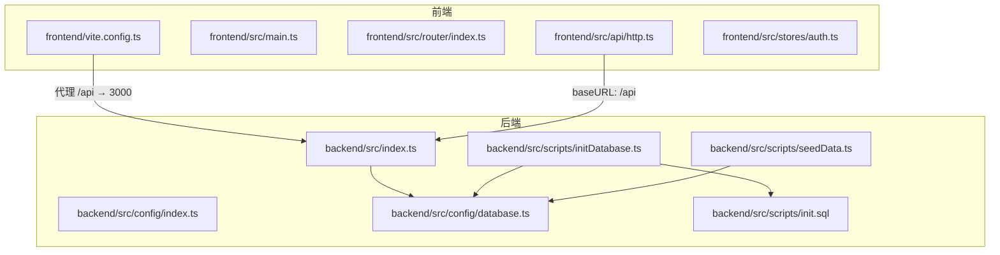
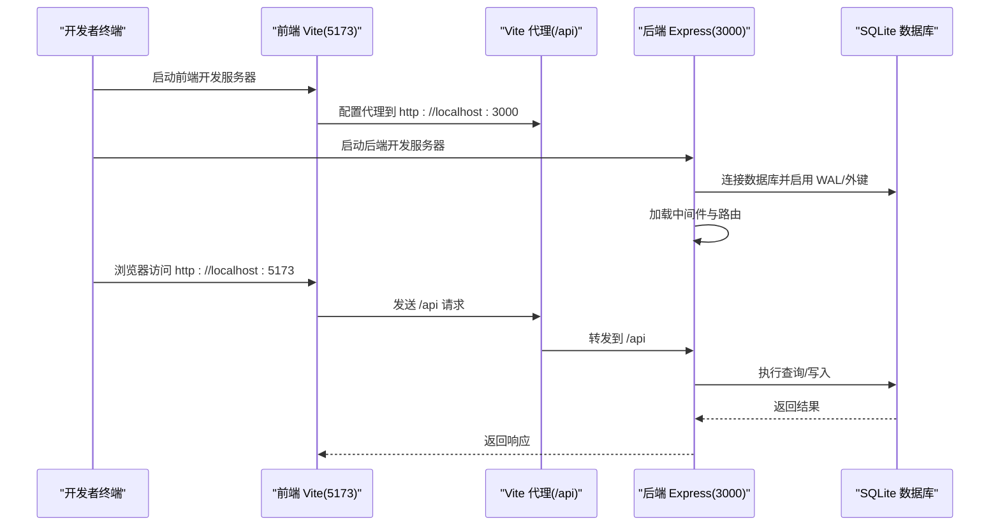
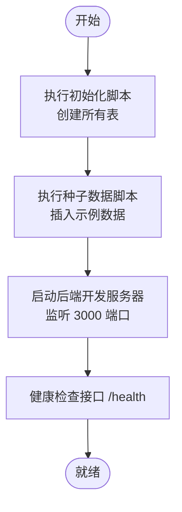
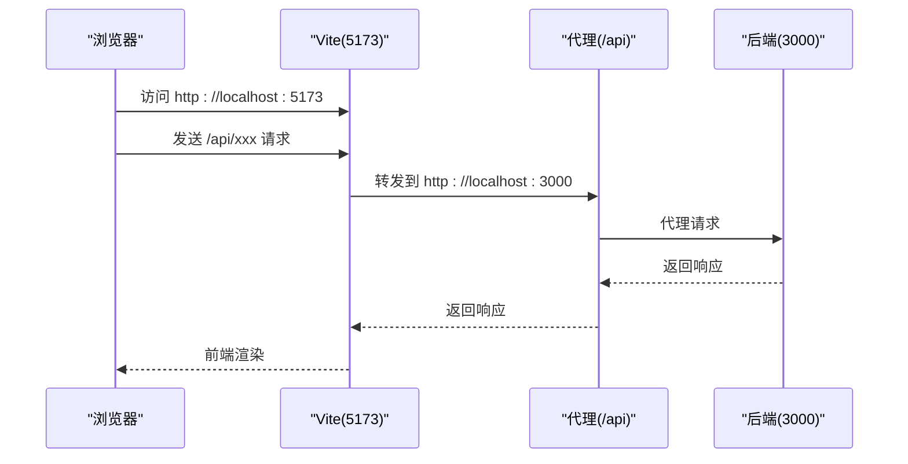
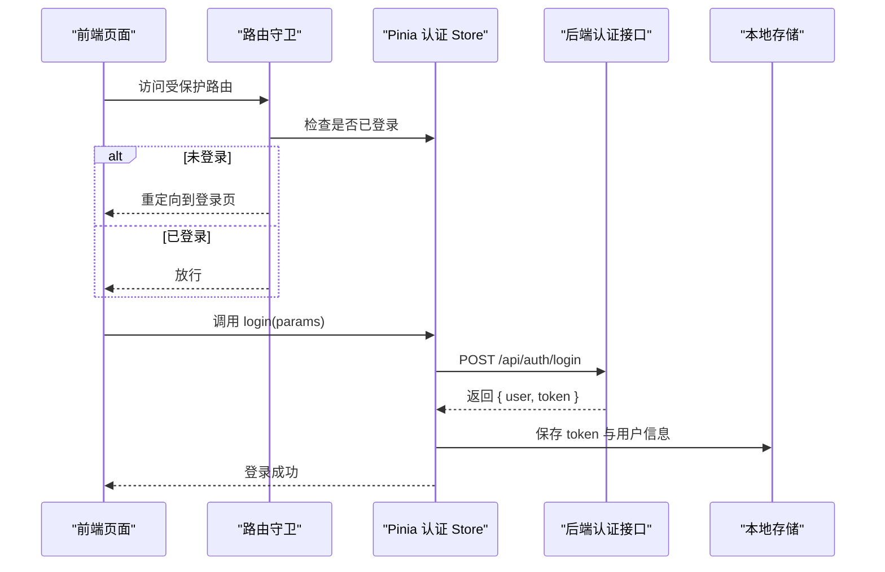

# 快速开始

<cite>
**本文引用的文件**
- [README.md](file://README.md)
- [package.json](file://package.json)
- [backend/package.json](file://backend/package.json)
- [frontend/package.json](file://frontend/package.json)
- [backend/src/index.ts](file://backend/src/index.ts)
- [backend/src/config/index.ts](file://backend/src/config/index.ts)
- [backend/src/config/database.ts](file://backend/src/config/database.ts)
- [backend/src/scripts/initDatabase.ts](file://backend/src/scripts/initDatabase.ts)
- [backend/src/scripts/init.sql](file://backend/src/scripts/init.sql)
- [backend/src/scripts/seedData.ts](file://backend/src/scripts/seedData.ts)
- [frontend/vite.config.ts](file://frontend/vite.config.ts)
- [frontend/src/main.ts](file://frontend/src/main.ts)
- [frontend/src/router/index.ts](file://frontend/src/router/index.ts)
- [frontend/src/api/http.ts](file://frontend/src/api/http.ts)
- [frontend/src/stores/auth.ts](file://frontend/src/stores/auth.ts)
</cite>

## 目录
1. [简介](#简介)
2. [项目结构](#项目结构)
3. [核心组件](#核心组件)
4. [架构总览](#架构总览)
5. [详细组件分析](#详细组件分析)
6. [依赖关系分析](#依赖关系分析)
7. [性能注意事项](#性能注意事项)
8. [故障排查指南](#故障排查指南)
9. [结论](#结论)
10. [附录](#附录)

## 简介
本指南面向首次接触 TingStudio 的开发者，帮助你在本地快速搭建并运行完整的开发环境。你将获得：
- 环境要求与安装步骤
- 后端与前端分别安装依赖、初始化数据库、填充种子数据、启动开发服务器的完整流程
- 开发环境启动顺序与端口配置说明
- 测试账号与初始登录凭证
- 常见问题排查建议

## 项目结构
TingStudio 采用前后端分离架构：
- 后端：基于 Node.js + Express + TypeScript，使用 better-sqlite3 作为 SQLite 驱动，提供 RESTful API。
- 前端：基于 Vue 3 + Vite + TypeScript，使用 Pinia 状态管理、Axios 发起 HTTP 请求、TDesign UI 组件库。

图表来源
- [backend/src/index.ts:13-54](file://backend/src/index.ts#L13-L54)
- [backend/src/config/index.ts:1-24](file://backend/src/config/index.ts#L1-L24)
- [backend/src/config/database.ts:10-37](file://backend/src/config/database.ts#L10-L37)
- [backend/src/scripts/initDatabase.ts:11-31](file://backend/src/scripts/initDatabase.ts#L11-L31)
- [backend/src/scripts/init.sql:1-227](file://backend/src/scripts/init.sql#L1-L227)
- [backend/src/scripts/seedData.ts:7-394](file://backend/src/scripts/seedData.ts#L7-L394)
- [frontend/vite.config.ts:12-21](file://frontend/vite.config.ts#L12-L21)
- [frontend/src/main.ts:1-17](file://frontend/src/main.ts#L1-L17)
- [frontend/src/router/index.ts:148-162](file://frontend/src/router/index.ts#L148-L162)
- [frontend/src/api/http.ts:6-10](file://frontend/src/api/http.ts#L6-L10)

章节来源
- [README.md:65-113](file://README.md#L65-L113)
- [backend/src/index.ts:13-54](file://backend/src/index.ts#L13-L54)
- [frontend/vite.config.ts:12-21](file://frontend/vite.config.ts#L12-L21)

## 核心组件
- 后端入口与中间件：负责启动服务、加载全局中间件（CORS、Helmet、Compression、Morgan）、挂载路由、健康检查与错误处理。
- 数据库配置与连接：集中管理数据库路径、JWT 密钥、上传目录、CORS 来源等配置；提供连接、查询、事务与关闭数据库的方法。
- 初始化脚本：读取 SQL 文件一次性创建所有表结构。
- 种子数据脚本：批量插入用户、原料、业务员、配方、版本、导出模板、导出任务、营养标准与原料营养数据。
- 前端开发服务器与代理：Vite 默认端口 5173，并将 /api 代理到后端 3000 端口；Axios 默认 base URL 为 /api，自动附加本地存储中的 JWT Token。

章节来源
- [backend/src/index.ts:13-54](file://backend/src/index.ts#L13-L54)
- [backend/src/config/index.ts:1-24](file://backend/src/config/index.ts#L1-L24)
- [backend/src/config/database.ts:10-69](file://backend/src/config/database.ts#L10-L69)
- [backend/src/scripts/initDatabase.ts:11-31](file://backend/src/scripts/initDatabase.ts#L11-L31)
- [backend/src/scripts/seedData.ts:7-394](file://backend/src/scripts/seedData.ts#L7-L394)
- [frontend/vite.config.ts:12-21](file://frontend/vite.config.ts#L12-L21)
- [frontend/src/api/http.ts:6-10](file://frontend/src/api/http.ts#L6-L10)

## 架构总览
下面的时序图展示了从启动前端到后端数据库初始化、种子数据填充，再到浏览器访问系统的完整流程。

图表来源
- [frontend/vite.config.ts:12-21](file://frontend/vite.config.ts#L12-L21)
- [backend/src/index.ts:13-54](file://backend/src/index.ts#L13-L54)
- [backend/src/config/database.ts:10-37](file://backend/src/config/database.ts#L10-L37)

## 详细组件分析

### 后端：数据库初始化与种子数据
- 初始化数据库
  - 执行命令：在 backend 目录下运行初始化脚本，一次性创建所有表结构。
  - 预期输出：控制台打印“开始初始化数据库...”、“所有数据库表创建成功”、“数据库初始化完成！”。
- 填充种子数据（可选）
  - 执行命令：在 backend 目录下运行种子数据脚本，向各表插入示例数据（每表约 10~30 条）。
  - 预期输出：控制台逐项打印“创建用户/原料/业务员/配方/版本/导出模板/导出任务/营养标准/原料营养”的进度与结果。
- 启动后端开发服务器
  - 执行命令：在 backend 目录下运行开发脚本。
  - 预期输出：控制台打印“TingStudio 后端服务启动成功: http://localhost:3000”以及环境信息。

图表来源
- [backend/src/scripts/initDatabase.ts:11-31](file://backend/src/scripts/initDatabase.ts#L11-L31)
- [backend/src/scripts/seedData.ts:7-394](file://backend/src/scripts/seedData.ts#L7-L394)
- [backend/src/index.ts:37-54](file://backend/src/index.ts#L37-L54)

章节来源
- [README.md:122-136](file://README.md#L122-L136)
- [backend/src/scripts/initDatabase.ts:11-31](file://backend/src/scripts/initDatabase.ts#L11-L31)
- [backend/src/scripts/seedData.ts:7-394](file://backend/src/scripts/seedData.ts#L7-L394)
- [backend/src/index.ts:37-54](file://backend/src/index.ts#L37-L54)

### 前端：开发服务器与 API 代理
- 启动前端开发服务器
  - 执行命令：在 frontend 目录下运行开发脚本。
  - 预期输出：Vite 在 5173 端口启动，并自动打开浏览器访问 http://localhost:5173。
- API 代理
  - Vite 将以 /api 开头的请求代理到 http://localhost:3000，便于前后端联调。
- Axios 配置
  - Axios 默认 baseURL 为 /api，请求时自动从本地存储中读取 Token 并附加 Authorization 头。
  - 响应拦截器统一处理错误消息与 401 未授权逻辑（清理本地缓存并跳转登录页）。

图表来源
- [frontend/vite.config.ts:12-21](file://frontend/vite.config.ts#L12-L21)
- [frontend/src/api/http.ts:6-10](file://frontend/src/api/http.ts#L6-L10)
- [frontend/src/api/http.ts:21-43](file://frontend/src/api/http.ts#L21-L43)

章节来源
- [README.md:138-146](file://README.md#L138-L146)
- [frontend/vite.config.ts:12-21](file://frontend/vite.config.ts#L12-L21)
- [frontend/src/api/http.ts:6-10](file://frontend/src/api/http.ts#L6-L10)
- [frontend/src/api/http.ts:21-43](file://frontend/src/api/http.ts#L21-L43)

### 认证与登录流程（前端）
- 路由守卫
  - 若访问需要登录的页面且未登录，则重定向至登录页；若已登录访问登录/注册页则重定向首页。
- 登录与注册
  - 使用 Pinia Store 调用后端认证接口，成功后保存用户信息与 Token 至本地存储。
- Token 管理
  - Axios 请求拦截器自动附加 Bearer Token；响应拦截器处理 401 清理本地缓存并提示重新登录。

图表来源
- [frontend/src/router/index.ts:148-162](file://frontend/src/router/index.ts#L148-L162)
- [frontend/src/stores/auth.ts:19-32](file://frontend/src/stores/auth.ts#L19-L32)
- [frontend/src/api/http.ts:12-19](file://frontend/src/api/http.ts#L12-L19)

章节来源
- [frontend/src/router/index.ts:148-162](file://frontend/src/router/index.ts#L148-L162)
- [frontend/src/stores/auth.ts:19-32](file://frontend/src/stores/auth.ts#L19-L32)
- [frontend/src/api/http.ts:12-19](file://frontend/src/api/http.ts#L12-L19)

## 依赖关系分析
- 后端
  - 运行时：Node.js 18+、npm 9+
  - 框架与库：Express、better-sqlite3、bcryptjs、jsonwebtoken、helmet、cors、express-rate-limit、morgan、multer、compression
  - 开发工具：TypeScript、tsx
- 前端
  - 运行时：Node.js 18+、npm 9+
  - 框架与库：Vue 3、Vite、Axios、Pinia、Vue Router、TDesign、VeeValidate、Yup、SCSS
  - 开发工具：TypeScript、Vite、vue-tsc

章节来源
- [README.md:9-29](file://README.md#L9-L29)
- [backend/package.json:14-40](file://backend/package.json#L14-L40)
- [frontend/package.json:12-29](file://frontend/package.json#L12-L29)

## 性能注意事项
- SQLite 适合开发与中小规模数据，生产场景建议评估更高并发的数据库方案。
- 后端已启用压缩中间件，有助于减少传输体积。
- 前端开发服务器默认开启自动打开浏览器，便于调试但可能影响多开体验。
- 种子数据脚本使用事务批量插入，避免频繁 IO；如需自定义数据，建议遵循相同事务模式以保证一致性。

## 故障排查指南
- 启动后端时报数据库连接错误
  - 检查数据库路径配置与权限；确认初始化脚本已成功执行。
- 前端无法访问后端接口
  - 确认后端已在 3000 端口启动；检查 Vite 代理配置是否正确指向 3000。
- 登录后仍提示未登录或 401
  - 检查本地存储中是否存在 token；确认响应拦截器是否被触发导致自动清理。
- 健康检查失败
  - 访问 http://localhost:3000/health 确认后端服务状态。

章节来源
- [backend/src/config/database.ts:10-37](file://backend/src/config/database.ts#L10-L37)
- [backend/src/index.ts:37-54](file://backend/src/index.ts#L37-L54)
- [frontend/vite.config.ts:12-21](file://frontend/vite.config.ts#L12-L21)
- [frontend/src/api/http.ts:21-43](file://frontend/src/api/http.ts#L21-L43)

## 结论
按照本指南的步骤，你可以快速完成 TingStudio 的本地开发环境搭建：先安装后端依赖并初始化数据库与种子数据，再安装前端依赖并启动开发服务器。随后即可通过浏览器访问前端页面并使用测试账号进行登录与功能验证。

## 附录

### 环境要求
- Node.js 18+
- npm 9+

章节来源
- [README.md:117-121](file://README.md#L117-L121)

### 完整安装与启动步骤
- 后端
  - 进入 backend 目录，安装依赖并初始化数据库、填充种子数据、启动开发服务器。
  - 参考命令与预期输出：[README.md:122-136](file://README.md#L122-L136)
- 前端
  - 进入 frontend 目录，安装依赖并启动开发服务器。
  - 参考命令与预期输出：[README.md:138-146](file://README.md#L138-L146)

章节来源
- [README.md:122-146](file://README.md#L122-L146)

### 端口与代理配置
- 后端服务：默认监听 3000 端口
- 前端开发服务器：默认监听 5173 端口
- 前端代理：将 /api 代理到 http://localhost:3000

章节来源
- [backend/src/index.ts:15](file://backend/src/index.ts#L15)
- [frontend/vite.config.ts:12-21](file://frontend/vite.config.ts#L12-L21)

### 测试账号与初始登录凭证
- 管理员：用户名 admin，密码 admin123
- 配方师：用户名 user002，密码 user002
- 其他测试账号：user003 ~ user030，密码与用户名相同，角色在 admin 与 formulist 之间循环

章节来源
- [README.md:150-157](file://README.md#L150-L157)

### 数据库初始化 SQL 与表结构
- 初始化 SQL 文件包含 13 张表的建表语句与索引
- 可参考数据库文档以了解字段说明与关系

章节来源
- [backend/src/scripts/init.sql:1-227](file://backend/src/scripts/init.sql#L1-L227)
- [README.md:163-165](file://README.md#L163-L165)