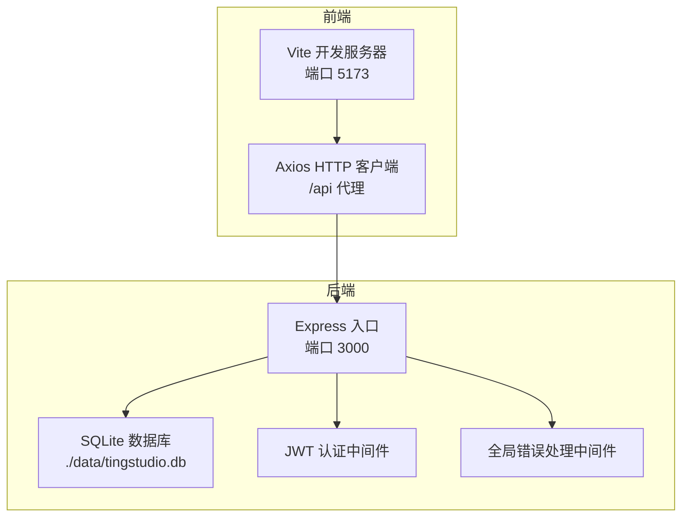
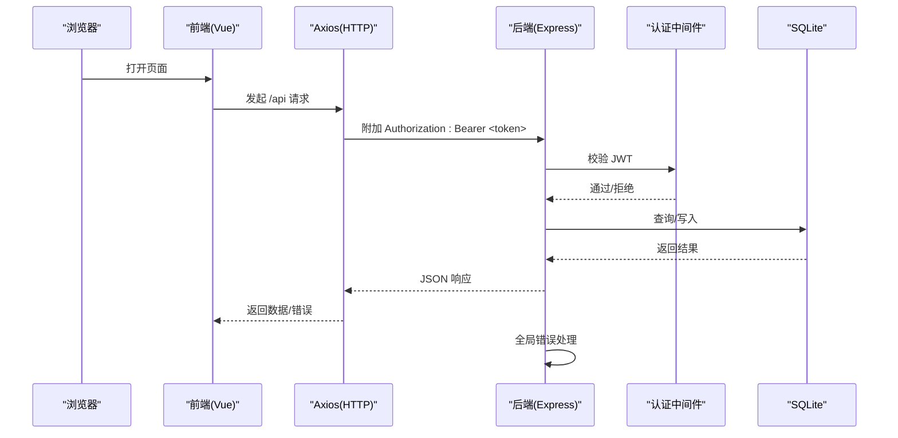
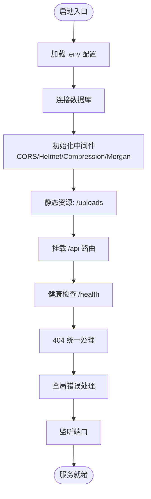

# 常见问题

<cite>
**本文引用的文件**
- [README.md](file://README.md)
- [backend/package.json](file://backend/package.json)
- [frontend/package.json](file://frontend/package.json)
- [backend/src/config/index.ts](file://backend/src/config/index.ts)
- [backend/src/config/database.ts](file://backend/src/config/database.ts)
- [backend/src/middleware/auth.ts](file://backend/src/middleware/auth.ts)
- [backend/src/middleware/errorHandler.ts](file://backend/src/middleware/errorHandler.ts)
- [backend/src/utils/logger.ts](file://backend/src/utils/logger.ts)
- [backend/src/index.ts](file://backend/src/index.ts)
- [backend/DATABASE_DOC.md](file://backend/DATABASE_DOC.md)
- [frontend/vite.config.ts](file://frontend/vite.config.ts)
- [frontend/src/api/http.ts](file://frontend/src/api/http.ts)
- [frontend/src/api/auth.ts](file://frontend/src/api/auth.ts)
- [frontend/src/stores/auth.ts](file://frontend/src/stores/auth.ts)
</cite>

## 目录
1. [简介](#简介)
2. [项目结构](#项目结构)
3. [核心组件](#核心组件)
4. [架构总览](#架构总览)
5. [详细组件分析](#详细组件分析)
6. [依赖关系分析](#依赖关系分析)
7. [性能考虑](#性能考虑)
8. [故障排查指南](#故障排查指南)
9. [结论](#结论)
10. [附录](#附录)

## 简介
本常见问题解答面向 TingStudio 开发者，聚焦开发阶段高频问题与快速修复方案，覆盖数据库连接失败、JWT 认证错误、API 请求超时、端口占用、环境变量缺失、依赖安装问题、权限问题等。文档同时提供问题自检清单与快速修复步骤，帮助你迅速定位并解决问题。

## 项目结构
TingStudio 采用前后端分离架构：前端基于 Vue 3 + Vite，后端基于 Express + better-sqlite3。前端通过本地代理将 /api 请求转发到后端 3000 端口；后端通过环境变量控制端口、数据库路径、JWT 密钥、CORS 来源等。

图表来源
- [frontend/vite.config.ts:12-21](file://frontend/vite.config.ts#L12-L21)
- [backend/src/index.ts:13-55](file://backend/src/index.ts#L13-L55)
- [backend/src/config/database.ts:10-37](file://backend/src/config/database.ts#L10-L37)
- [backend/src/middleware/auth.ts:13-31](file://backend/src/middleware/auth.ts#L13-L31)
- [backend/src/middleware/errorHandler.ts:5-50](file://backend/src/middleware/errorHandler.ts#L5-L50)

章节来源
- [README.md:65-113](file://README.md#L65-L113)
- [frontend/vite.config.ts:12-21](file://frontend/vite.config.ts#L12-L21)
- [backend/src/index.ts:13-55](file://backend/src/index.ts#L13-L55)

## 核心组件
- 后端配置中心：集中管理端口、数据库路径、JWT 密钥、上传目录、CORS 来源等。
- 数据库连接：自动确保数据目录存在、启用 WAL 与外键约束，并提供统一查询与事务封装。
- 认证中间件：校验 Authorization 头中的 Bearer Token，支持过期与无效令牌处理。
- 全局错误处理：对 SQLite 约束冲突、JWT 错误、文件大小限制、通用异常进行分类响应。
- 前端 HTTP 层：统一设置 baseURL、超时、请求头附加 Token、响应拦截统一错误提示与 401 自动登出。
- 健康检查：提供 /health 快速判断后端服务状态。

章节来源
- [backend/src/config/index.ts:2-23](file://backend/src/config/index.ts#L2-L23)
- [backend/src/config/database.ts:10-70](file://backend/src/config/database.ts#L10-L70)
- [backend/src/middleware/auth.ts:13-38](file://backend/src/middleware/auth.ts#L13-L38)
- [backend/src/middleware/errorHandler.ts:5-50](file://backend/src/middleware/errorHandler.ts#L5-L50)
- [frontend/src/api/http.ts:6-58](file://frontend/src/api/http.ts#L6-L58)
- [backend/src/index.ts:37-48](file://backend/src/index.ts#L37-L48)

## 架构总览
下图展示从浏览器到后端数据库的关键交互路径，以及错误处理与认证流程。

图表来源
- [frontend/src/api/http.ts:12-43](file://frontend/src/api/http.ts#L12-L43)
- [backend/src/middleware/auth.ts:13-31](file://backend/src/middleware/auth.ts#L13-L31)
- [backend/src/config/database.ts:44-61](file://backend/src/config/database.ts#L44-L61)
- [backend/src/middleware/errorHandler.ts:5-50](file://backend/src/middleware/errorHandler.ts#L5-L50)

## 详细组件分析

### 数据库连接失败
现象
- 启动后端时报错“数据库连接失败”或无法执行查询。
- 前端访问接口出现 500 或数据库相关错误。

可能原因
- 数据库文件路径不存在且未自动创建。
- 数据库文件被其他进程占用或权限不足。
- 数据库初始化未完成（缺少表结构）。
- WAL 模式或外键约束启用失败。

解决步骤
1. 确认数据库目录存在：后端会在启动时自动创建数据目录，若手动删除需确认权限。
2. 检查数据库文件是否存在且可读写：默认路径为 ./data/tingstudio.db。
3. 确保未有其他进程占用数据库文件（如 SQLite Studio、VS Code 插件等）。
4. 执行数据库初始化脚本，确保表结构存在。
5. 查看后端日志，确认 WAL 与外键约束是否启用成功。

章节来源
- [backend/src/config/database.ts:10-37](file://backend/src/config/database.ts#L10-L37)
- [backend/src/index.ts:17-18](file://backend/src/index.ts#L17-L18)
- [backend/DATABASE_DOC.md:447-457](file://backend/DATABASE_DOC.md#L447-L457)

### JWT 认证错误
现象
- 登录成功但后续接口返回 401。
- 提示“令牌无效或已过期”、“认证令牌无效/已过期”。

可能原因
- 前端未正确携带 Authorization: Bearer <token>。
- 后端 JWT 密钥不一致（环境变量变化）。
- Token 已过期或签名不合法。
- 前端本地存储被清理导致 Token 失效。

解决步骤
1. 检查前端请求拦截器是否在请求头附加 Bearer Token。
2. 确认后端 JWT_SECRET 与前端使用的密钥一致（默认开发密钥）。
3. 检查 JWT_EXPIRES_IN 设置是否过短。
4. 登录后确认本地存储中 token 是否存在。
5. 若更换密钥或清除本地存储，需重新登录获取新 token。

章节来源
- [backend/src/middleware/auth.ts:13-31](file://backend/src/middleware/auth.ts#L13-L31)
- [backend/src/middleware/errorHandler.ts:25-34](file://backend/src/middleware/errorHandler.ts#L25-L34)
- [frontend/src/api/http.ts:12-19](file://frontend/src/api/http.ts#L12-L19)
- [backend/src/config/index.ts:10-13](file://backend/src/config/index.ts#L10-L13)

### API 请求超时
现象
- 前端长时间无响应，最终提示网络错误或超时。
- 后端日志未见请求到达。

可能原因
- 前端 Axios 超时设置过短（默认 15000ms）。
- 代理配置错误，/api 未转发到后端 3000 端口。
- 后端端口被占用，服务未监听预期端口。
- 网络或防火墙阻断本地回环。

解决步骤
1. 检查前端代理配置是否指向 http://localhost:3000。
2. 确认后端监听端口与代理目标一致（默认 3000）。
3. 使用健康检查接口 /health 验证后端可用性。
4. 适当增大前端超时时间（如 30000ms）。
5. 关闭占用 3000 端口的其他程序。

章节来源
- [frontend/src/api/http.ts:6-10](file://frontend/src/api/http.ts#L6-L10)
- [frontend/vite.config.ts:15-20](file://frontend/vite.config.ts#L15-L20)
- [backend/src/index.ts:51-54](file://backend/src/index.ts#L51-L54)

### 端口占用
现象
- 启动后端时报端口被占用（如 3000）。
- 启动前端时报端口被占用（如 5173）。

可能原因
- 该端口已被浏览器、IDE 内置服务器或其他 Node 进程占用。

解决步骤
1. 修改后端端口：设置环境变量 PORT。
2. 修改前端端口：在 Vite 配置中调整 server.port。
3. 终止占用进程或释放端口后再启动。

章节来源
- [backend/src/config/index.ts](file://backend/src/config/index.ts#L3)
- [backend/src/index.ts](file://backend/src/index.ts#L15)
- [frontend/vite.config.ts](file://frontend/vite.config.ts#L13)

### 环境配置问题
现象
- 数据库路径异常、CORS 不生效、JWT 密钥不一致。
- 部分功能在生产环境不可用。

可能原因
- 未设置必要的环境变量（DB_PATH、JWT_SECRET、CORS_ORIGIN 等）。
- 环境变量拼写错误或未加载（dotenv）。

解决步骤
1. 在后端根目录创建 .env 文件，设置必要变量。
2. 确认 dotenv 已正确加载（入口文件已引入）。
3. 验证各模块读取的配置值是否符合预期。

章节来源
- [backend/src/config/index.ts:2-23](file://backend/src/config/index.ts#L2-L23)
- [backend/src/index.ts](file://backend/src/index.ts#L2)

### 依赖安装问题
现象
- npm install 报错或部分包安装失败。
- 启动时报模块找不到或类型定义缺失。

可能原因
- Node.js 版本过低（要求 18+）。
- npm 版本过低（要求 9+）。
- 依赖版本冲突或缓存损坏。

解决步骤
1. 升级 Node.js 至 18+，npm 至 9+。
2. 清理 node_modules 与 package-lock.json，重新安装。
3. 确保后端与前端分别在各自目录执行安装。
4. 如使用 pnpm/yarn，请统一团队工具链。

章节来源
- [README.md:117-121](file://README.md#L117-L121)
- [backend/package.json:14-40](file://backend/package.json#L14-L40)
- [frontend/package.json:12-29](file://frontend/package.json#L12-L29)

### 权限问题
现象
- 数据库文件无法创建或写入失败。
- 上传文件失败或目录无权限。

可能原因
- 当前用户对 data/ 与 uploads/ 目录无写权限。
- Windows/macOS 上文件系统权限限制。

解决步骤
1. 确保 data/ 与 uploads/ 目录存在且可写。
2. 在 Windows 上以管理员身份运行终端。
3. 在 macOS/Linux 上检查目录权限并赋予写权限。

章节来源
- [backend/src/config/database.ts:12-16](file://backend/src/config/database.ts#L12-L16)
- [backend/src/config/index.ts:15-18](file://backend/src/config/index.ts#L15-L18)

### 外键/唯一约束冲突
现象
- 新增/更新数据时报“数据已存在”或“关联数据不存在”。

可能原因
- 违反了数据库唯一约束（UNIQUE）。
- 外键引用的目标不存在。

解决步骤
1. 检查唯一字段是否重复（如用户名、编码）。
2. 确认外键引用的数据已存在。
3. 查看后端错误处理器对约束冲突的统一响应。

章节来源
- [backend/src/middleware/errorHandler.ts:13-23](file://backend/src/middleware/errorHandler.ts#L13-L23)
- [backend/DATABASE_DOC.md:29-36](file://backend/DATABASE_DOC.md#L29-L36)

## 依赖关系分析
后端启动流程与关键依赖如下：

图表来源
- [backend/src/index.ts:13-55](file://backend/src/index.ts#L13-L55)
- [backend/src/config/index.ts:2-23](file://backend/src/config/index.ts#L2-L23)
- [backend/src/config/database.ts:10-37](file://backend/src/config/database.ts#L10-L37)
- [backend/src/middleware/errorHandler.ts:5-50](file://backend/src/middleware/errorHandler.ts#L5-L50)

章节来源
- [backend/src/index.ts:13-55](file://backend/src/index.ts#L13-L55)

## 性能考虑
- 数据库：启用 WAL 模式提升并发读写性能；合理使用索引避免全表扫描。
- 网络：前端超时与重试策略需结合后端处理能力；避免一次性传输大体积数据。
- 中间件：压缩与日志在开发环境开启，生产环境谨慎评估开销。
- 缓存：前端对用户信息与常用列表做本地缓存，减少重复请求。

## 故障排查指南

### 自检清单
- 环境
  - Node.js 与 npm 版本满足要求
  - 已设置必要环境变量（DB_PATH、JWT_SECRET、CORS_ORIGIN）
- 依赖
  - 后端/前端分别安装依赖
  - 未使用不兼容的包管理器
- 数据库
  - data/ 目录存在且可写
  - 数据库初始化已完成
  - 无进程占用数据库文件
- 服务
  - 后端监听端口 3000 且 /health 可访问
  - 前端代理正确指向后端 3000 端口
- 认证
  - 登录成功后本地存储包含 token
  - 请求头包含 Authorization: Bearer <token>
- 错误处理
  - 401 场景前端是否自动清空 token 并跳转登录
  - 409/400 场景是否提示具体约束冲突

### 快速修复方法
- 数据库连接失败：确认 data/ 目录权限与数据库文件存在；执行初始化脚本；查看日志。
- JWT 401：检查前端是否附加 Bearer Token；核对后端 JWT_SECRET；重新登录。
- API 超时：增大前端超时；确认代理与端口；使用 /health 健康检查。
- 端口占用：修改 PORT 或终止占用进程；前端调整 Vite 端口。
- 权限问题：赋予 data/ 与 uploads/ 写权限；Windows 以管理员运行。
- 约束冲突：修正唯一字段重复或外键引用数据。

章节来源
- [backend/src/config/index.ts:2-23](file://backend/src/config/index.ts#L2-L23)
- [backend/src/config/database.ts:12-16](file://backend/src/config/database.ts#L12-L16)
- [backend/src/middleware/errorHandler.ts:13-23](file://backend/src/middleware/errorHandler.ts#L13-L23)
- [frontend/src/api/http.ts:33-42](file://frontend/src/api/http.ts#L33-L42)
- [backend/src/index.ts:37-48](file://backend/src/index.ts#L37-L48)

## 结论
通过以上常见问题与解决方案，你可以快速定位并修复开发过程中的大多数障碍。建议在团队内统一环境变量与端口约定，规范依赖安装流程，并在开发与生产环境分别配置合适的日志与中间件策略，以获得更稳定的开发体验。

## 附录
- 健康检查：访问 /health 确认后端可用。
- 数据库文档：参阅 DATABASE_DOC.md 了解表结构与约束。
- API 文档：参阅 API_DOC.md 了解接口规范。

章节来源
- [backend/src/index.ts:37-48](file://backend/src/index.ts#L37-L48)
- [backend/DATABASE_DOC.md:1-10](file://backend/DATABASE_DOC.md#L1-L10)